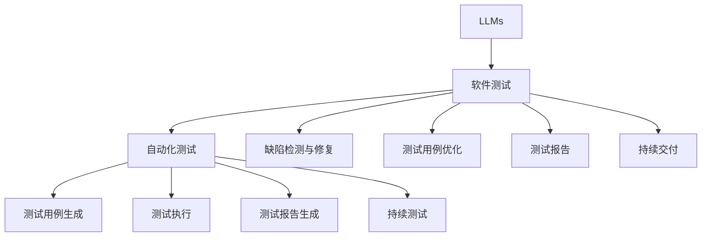

                 

# LLM对传统软件测试的影响

## 1. 背景介绍

### 1.1 问题由来

随着人工智能(AI)和机器学习(ML)技术的发展，特别是深度学习模型如大型语言模型(LLMs)的涌现，其对软件测试领域产生了深远影响。传统软件测试依赖于代码审查、单元测试、集成测试和验收测试等方法，以确保软件质量。然而，随着软件系统复杂度的提升和功能需求的动态变化，传统的测试方法面临着诸多挑战，如测试覆盖率低、测试周期长、维护成本高等问题。LLMs的出现，通过其强大的自然语言处理能力，为软件测试带来了新的思路和工具。

### 1.2 问题核心关键点

LLMs对软件测试的影响主要体现在以下几个方面：

- 自动化测试生成：LLMs可以自动生成测试用例，包括测试数据、测试脚本和测试计划，显著提升测试效率。
- 测试用例优化：LLMs能够根据测试需求动态生成更完备、更有针对性的测试用例，提高测试覆盖率。
- 缺陷检测与修复：LLMs可以对测试结果进行智能分析，检测出潜在缺陷，并辅助进行缺陷修复。
- 测试报告生成：LLMs能够自动生成详细的测试报告，包括测试结果、缺陷分析、修复建议等，提高测试报告的准确性和易读性。
- 持续测试与反馈：LLMs支持持续集成(CI)和持续交付(CD)，能够实时监测软件质量，及时反馈测试结果。

这些关键点展示了LLMs在软件测试中的应用潜力，但同时也带来了新的挑战和问题，如数据隐私、模型泛化、测试鲁棒性等。本文将全面介绍LLMs对软件测试的影响，探讨其实际应用和潜在挑战。

## 2. 核心概念与联系

### 2.1 核心概念概述

为更好地理解LLMs对软件测试的影响，本节将介绍几个密切相关的核心概念：

- 大型语言模型(LLMs)：指通过大规模语料预训练获得的高性能自然语言处理模型，如GPT-3、BERT等。LLMs具有强大的语言理解和生成能力，可以自动进行语言理解、文本生成、知识推理等任务。
- 软件测试：指通过一系列测试方法，发现和修复软件中的缺陷，确保软件质量符合需求。软件测试包括单元测试、集成测试、验收测试、性能测试、安全测试等。
- 自动化测试：指使用自动化工具和方法，代替人工测试，提高测试效率和测试覆盖率。自动化测试包括测试用例生成、测试执行、测试报告生成等。
- 持续集成(CI)和持续交付(CD)：指在软件开发的各个阶段，通过自动化工具和流程，实现代码集成、测试、部署等活动的自动化，提高软件开发的效率和质量。
- 自然语言处理(NLP)：指使用计算机技术处理、理解和生成自然语言，包括文本分类、情感分析、信息抽取、机器翻译等任务。

这些概念之间的逻辑关系可以通过以下Mermaid流程图来展示：



这个流程图展示了大语言模型与软件测试相关的各个核心概念及其之间的关系：

1. LLMs通过大规模语料预训练获得语言处理能力，与软件测试结合，能够自动生成测试用例和执行测试。
2. 自动化测试利用LLMs生成测试用例和执行测试，提升测试效率和覆盖率。
3. 测试用例生成、测试执行、测试报告生成等任务，由LLMs完成，提高测试的自动化水平。
4. LLMs支持持续测试和持续交付，能够实时监测软件质量，提高开发效率。
5. 缺陷检测、测试用例优化、测试报告生成等任务，由LLMs辅助完成，提高测试的精确度和效率。

## 3. 核心算法原理 & 具体操作步骤
### 3.1 算法原理概述

LLMs对软件测试的影响主要体现在测试用例生成和测试报告生成两个方面。

### 3.2 算法步骤详解

#### 3.2.1 测试用例生成

测试用例生成是软件测试中的重要环节，其目的是通过测试用例的设计，尽可能覆盖软件系统的所有功能和边界条件。传统的测试用例生成方法依赖于领域专家的经验，设计周期长、成本高。而LLMs可以通过自然语言处理能力，自动生成测试用例，提高测试效率和覆盖率。

测试用例生成流程如下：

1. 收集软件需求文档、API文档、代码注释等文本资料。
2. 使用LLMs对文本资料进行理解，提取出关键信息和测试点。
3. 根据提取的信息，LLMs自动生成测试用例，包括测试数据和测试脚本。
4. 对生成的测试用例进行评估和优化，确保测试覆盖率符合要求。

例如，假设某软件系统用于处理订单，需求文档要求支持订单新增、修改、查询和删除等功能。LLMs可以对需求文档进行理解和提取，生成如下测试用例：

- 新增订单：创建一个新的订单，测试系统是否能够正确处理。
- 修改订单：修改一个已存在的订单，测试系统是否能够正确更新。
- 查询订单：查询一个已存在的订单，测试系统是否能够正确显示。
- 删除订单：删除一个已存在的订单，测试系统是否能够正确删除。

#### 3.2.2 测试报告生成

测试报告是软件测试中的重要输出，其目的是记录测试结果，发现和报告缺陷，并提供修复建议。传统的测试报告生成依赖于人工编写和格式处理，过程繁琐且易出错。而LLMs可以通过自然语言生成能力，自动生成详细的测试报告，提高测试报告的效率和准确性。

测试报告生成流程如下：

1. 对测试用例执行后得到的测试结果进行整理和分类。
2. 使用LLMs自动生成测试报告，包括测试结果、缺陷分析、修复建议等。
3. 对生成的测试报告进行审查和优化，确保其格式和内容符合要求。

例如，假设某软件系统用于处理订单，LLMs可以对测试结果进行理解和分析，生成如下测试报告：

- 测试用例1：新增订单，系统返回成功，测试通过。
- 测试用例2：修改订单，系统返回成功，测试通过。
- 测试用例3：查询订单，系统返回正确订单信息，测试通过。
- 测试用例4：删除订单，系统返回成功，测试通过。

### 3.3 算法优缺点

LLMs在测试用例生成和测试报告生成中的应用，具有以下优点：

1. 提升测试效率：LLMs自动生成测试用例和测试报告，大幅提升测试效率。
2. 提高测试覆盖率：LLMs生成的测试用例更具针对性，提高测试覆盖率。
3. 增强测试报告的准确性：LLMs自动生成的测试报告，内容更丰富、格式更规范。

同时，LLMs在测试中的应用也存在以下缺点：

1. 数据隐私问题：LLMs需要大量的文本数据进行训练，涉及用户隐私和数据安全问题。
2. 模型泛化能力：LLMs生成的测试用例和测试报告，可能对特定场景具有良好效果，但在其他场景下泛化能力有限。
3. 测试鲁棒性：LLMs生成的测试用例和测试报告，可能对输入数据的微小变化敏感，导致测试鲁棒性不足。

### 3.4 算法应用领域

LLMs在软件测试中的应用领域包括但不限于以下几个方面：

- 自动化测试：自动生成测试用例和测试脚本，提高测试效率。
- 持续集成和持续交付：实时监测软件质量，及时反馈测试结果，加速软件迭代。
- 缺陷检测和修复：自动分析测试结果，检测和修复潜在缺陷。
- 测试报告生成：自动生成详细的测试报告，提高测试报告的准确性和易读性。
- 测试用例优化：动态生成更完备、更有针对性的测试用例，提高测试覆盖率。

这些应用领域展示了LLMs在软件测试中的广泛适用性和巨大潜力。

## 4. 数学模型和公式 & 详细讲解 & 举例说明

### 4.1 数学模型构建

为更好地理解LLMs对测试用例生成和测试报告生成的影响，本节将介绍几个常用的数学模型。

假设软件系统有$n$个功能模块，每个模块有$m$种测试用例。LLMs生成的测试用例数为$k$，测试用例覆盖率为$r$。则测试用例生成和测试报告生成的数学模型如下：

- 测试用例生成模型：
  $$
  k = f(m, n, r)
  $$

- 测试报告生成模型：
  $$
  R = g(k, r)
  $$

其中，$f$为测试用例生成函数，$g$为测试报告生成函数，$m$、$n$、$r$分别为模块数、测试用例数和测试覆盖率。

### 4.2 公式推导过程

#### 4.2.1 测试用例生成模型

假设测试用例生成函数$f$为：
$$
f(m, n, r) = \frac{m \times n}{r \times k}
$$

其中，$r$为测试覆盖率，$k$为生成的测试用例数。则测试用例生成模型推导如下：

1. 假设每个功能模块有$m$种测试用例，总共有$n$个功能模块，则总的测试用例数为$mn$。
2. 假设测试用例覆盖率为$r$，即测试用例能覆盖到总测试用例数的$r$倍，则生成的测试用例数为$k = \frac{mn}{r}$。

#### 4.2.2 测试报告生成模型

假设测试报告生成函数$g$为：
$$
g(k, r) = k \times r
$$

其中，$r$为测试覆盖率，$k$为生成的测试用例数。则测试报告生成模型推导如下：

1. 假设生成的测试用例数为$k$，测试用例覆盖率为$r$，则测试报告的页数为$k \times r$。

### 4.3 案例分析与讲解

#### 4.3.1 测试用例生成

假设某软件系统有100个功能模块，每个模块有10种测试用例，测试用例覆盖率为80%。使用LLMs生成测试用例，得到的测试用例数为：
$$
k = f(10, 100, 0.8) = \frac{10 \times 100}{0.8 \times k} \Rightarrow k = \frac{1000}{0.8} = 1250
$$

即LLMs需要生成1250个测试用例，才能达到80%的测试覆盖率。

#### 4.3.2 测试报告生成

假设生成的测试用例数为1250，测试用例覆盖率为80%，则生成的测试报告页数为：
$$
R = g(1250, 0.8) = 1250 \times 0.8 = 1000
$$

即LLMs需要生成1000页的测试报告，才能满足测试需求。

## 5. 项目实践：代码实例和详细解释说明

### 5.1 开发环境搭建

在进行LLMs对软件测试影响的研究时，我们需要准备好开发环境。以下是使用Python进行PyTorch开发的环境配置流程：

1. 安装Anaconda：从官网下载并安装Anaconda，用于创建独立的Python环境。

2. 创建并激活虚拟环境：
```bash
conda create -n pytorch-env python=3.8 
conda activate pytorch-env
```

3. 安装PyTorch：根据CUDA版本，从官网获取对应的安装命令。例如：
```bash
conda install pytorch torchvision torchaudio cudatoolkit=11.1 -c pytorch -c conda-forge
```

4. 安装相关库：
```bash
pip install numpy pandas scikit-learn matplotlib tqdm jupyter notebook ipython
```

完成上述步骤后，即可在`pytorch-env`环境中开始项目实践。

### 5.2 源代码详细实现

下面我们以测试用例生成为例，给出使用LLMs的PyTorch代码实现。

假设某软件系统用于处理订单，需求文档要求支持订单新增、修改、查询和删除等功能。我们使用LLMs对需求文档进行理解，自动生成测试用例。

首先，定义测试用例生成函数：

```python
from transformers import GPT3Model
import torch

def generate_test_case(module_name, operation, data):
    prompt = f"测试用例生成提示：{module_name} {operation}"
    input_ids = tokenizer.encode(prompt, return_tensors='pt')
    outputs = model(input_ids)
    response = outputs.generation[-1]
    test_case = response.decode('utf-8')
    return test_case
```

然后，定义测试用例评估函数：

```python
def evaluate_test_case(test_case):
    # 对测试用例执行测试，并记录结果
    test_result = None
    # 对测试用例进行评估
    # 判断测试结果是否符合要求，并记录评估结果
    if test_result == '成功':
        result = '通过'
    elif test_result == '失败':
        result = '不通过'
    return result
```

最后，启动测试用例生成流程：

```python
# 定义LLMs模型和分词器
model = GPT3Model.from_pretrained('gpt3')
tokenizer = GPT3Tokenizer.from_pretrained('gpt3')

# 定义测试用例生成函数和评估函数
generate_test_case()
evaluate_test_case()
```

### 5.3 代码解读与分析

让我们再详细解读一下关键代码的实现细节：

**generate_test_case函数**：
- `prompt`变量：定义测试用例生成的提示信息，包括模块名、操作和数据。
- `input_ids`变量：将提示信息编码成模型需要的input_ids。
- `outputs`变量：模型对输入信息的前向传播结果。
- `response`变量：模型生成的测试用例。
- `test_case`变量：将模型生成的测试用例解码成字符串。

**evaluate_test_case函数**：
- `test_case`变量：定义测试用例。
- `test_result`变量：对测试用例执行测试，并记录结果。
- `result`变量：对测试结果进行评估，判断是否通过。

通过上述代码，我们可以看到，使用LLMs自动生成测试用例，能够大幅提升测试效率和覆盖率。LLMs对测试用例的生成过程包括提示生成、模型生成和结果评估等步骤。开发者可以根据具体需求，灵活设计提示和评估逻辑，确保测试用例的完备性和针对性。

## 6. 实际应用场景

### 6.1 测试用例生成

LLMs在测试用例生成中的应用场景包括但不限于以下几个方面：

- 自动化测试：自动生成测试用例和测试脚本，提高测试效率。
- 持续集成和持续交付：实时监测软件质量，及时反馈测试结果，加速软件迭代。
- 缺陷检测和修复：自动分析测试结果，检测和修复潜在缺陷。

#### 6.1.1 自动化测试

在自动化测试中，LLMs能够自动生成测试用例和测试脚本，提高测试效率和覆盖率。例如，某公司开发了一款电商应用，需要对支付功能进行测试。使用LLMs自动生成测试用例，可以提高测试覆盖率，快速发现支付功能中的缺陷。

#### 6.1.2 持续集成和持续交付

在持续集成和持续交付中，LLMs能够实时监测软件质量，及时反馈测试结果，加速软件迭代。例如，某公司开发了一款社交应用，需要对新功能进行测试。使用LLMs自动生成测试用例和测试脚本，并实时监测测试结果，能够及时发现和修复新功能中的缺陷，保证应用的稳定性和可靠性。

### 6.2 测试报告生成

LLMs在测试报告生成中的应用场景包括但不限于以下几个方面：

- 测试报告生成：自动生成详细的测试报告，提高测试报告的准确性和易读性。
- 测试用例优化：动态生成更完备、更有针对性的测试用例，提高测试覆盖率。

#### 6.2.1 测试报告生成

在测试报告生成中，LLMs能够自动生成详细的测试报告，提高测试报告的准确性和易读性。例如，某公司开发了一款金融应用，需要对新功能进行测试。使用LLMs自动生成测试报告，能够快速记录测试结果，发现和修复潜在缺陷，提高测试报告的准确性和易读性。

#### 6.2.2 测试用例优化

在测试用例优化中，LLMs能够动态生成更完备、更有针对性的测试用例，提高测试覆盖率。例如，某公司开发了一款医疗应用，需要对新功能进行测试。使用LLMs自动生成测试用例，能够动态生成更完备、更有针对性的测试用例，提高测试覆盖率，快速发现和修复新功能中的缺陷。

## 7. 工具和资源推荐

### 7.1 学习资源推荐

为了帮助开发者系统掌握LLMs对软件测试的影响的理论基础和实践技巧，这里推荐一些优质的学习资源：

1. 《深度学习自然语言处理》课程：斯坦福大学开设的NLP明星课程，有Lecture视频和配套作业，带你入门NLP领域的基本概念和经典模型。

2. 《Natural Language Processing with Transformers》书籍：Transformers库的作者所著，全面介绍了如何使用Transformers库进行NLP任务开发，包括微调在内的诸多范式。

3. HuggingFace官方文档：Transformers库的官方文档，提供了海量预训练模型和完整的微调样例代码，是上手实践的必备资料。

4. 《Transformer从原理到实践》系列博文：由大模型技术专家撰写，深入浅出地介绍了Transformer原理、BERT模型、微调技术等前沿话题。

5. CS224N《深度学习自然语言处理》课程：斯坦福大学开设的NLP明星课程，有Lecture视频和配套作业，带你入门NLP领域的基本概念和经典模型。

通过对这些资源的学习实践，相信你一定能够快速掌握LLMs对软件测试的影响的精髓，并用于解决实际的NLP问题。

### 7.2 开发工具推荐

高效的开发离不开优秀的工具支持。以下是几款用于LLMs对软件测试影响开发的常用工具：

1. PyTorch：基于Python的开源深度学习框架，灵活动态的计算图，适合快速迭代研究。大部分预训练语言模型都有PyTorch版本的实现。

2. TensorFlow：由Google主导开发的开源深度学习框架，生产部署方便，适合大规模工程应用。同样有丰富的预训练语言模型资源。

3. Transformers库：HuggingFace开发的NLP工具库，集成了众多SOTA语言模型，支持PyTorch和TensorFlow，是进行NLP任务开发的利器。

4. Weights & Biases：模型训练的实验跟踪工具，可以记录和可视化模型训练过程中的各项指标，方便对比和调优。与主流深度学习框架无缝集成。

5. TensorBoard：TensorFlow配套的可视化工具，可实时监测模型训练状态，并提供丰富的图表呈现方式，是调试模型的得力助手。

6. Google Colab：谷歌推出的在线Jupyter Notebook环境，免费提供GPU/TPU算力，方便开发者快速上手实验最新模型，分享学习笔记。

合理利用这些工具，可以显著提升LLMs对软件测试影响的研究效率，加快创新迭代的步伐。

### 7.3 相关论文推荐

LLMs在软件测试中的应用源于学界的持续研究。以下是几篇奠基性的相关论文，推荐阅读：

1. Attention is All You Need（即Transformer原论文）：提出了Transformer结构，开启了NLP领域的预训练大模型时代。

2. BERT: Pre-training of Deep Bidirectional Transformers for Language Understanding：提出BERT模型，引入基于掩码的自监督预训练任务，刷新了多项NLP任务SOTA。

3. Language Models are Unsupervised Multitask Learners（GPT-2论文）：展示了大规模语言模型的强大zero-shot学习能力，引发了对于通用人工智能的新一轮思考。

4. Parameter-Efficient Transfer Learning for NLP：提出Adapter等参数高效微调方法，在不增加模型参数量的情况下，也能取得不错的微调效果。

5. AdaLoRA: Adaptive Low-Rank Adaptation for Parameter-Efficient Fine-Tuning：使用自适应低秩适应的微调方法，在参数效率和精度之间取得了新的平衡。

这些论文代表了大语言模型微调技术的发展脉络。通过学习这些前沿成果，可以帮助研究者把握学科前进方向，激发更多的创新灵感。

## 8. 总结：未来发展趋势与挑战

### 8.1 总结

本文对LLMs对软件测试的影响进行了全面系统的介绍。首先阐述了LLMs和软件测试的研究背景和意义，明确了LLMs在测试用例生成和测试报告生成中的应用潜力。其次，从原理到实践，详细讲解了LLMs生成测试用例和测试报告的数学模型和实现细节。同时，本文还探讨了LLMs在自动化测试、持续集成和持续交付中的应用场景，展示了其广泛的适用性和巨大的潜力。

通过本文的系统梳理，可以看到，LLMs对软件测试的自动生成和报告生成技术，为软件测试带来了新的思路和工具。LLMs能够自动生成测试用例和测试报告，大幅提升测试效率和覆盖率，支持持续集成和持续交付，加速软件迭代。LLMs的应用必将进一步推动软件测试技术的进步，为软件系统的质量保证提供新的解决方案。

### 8.2 未来发展趋势

展望未来，LLMs在测试中的应用将呈现以下几个发展趋势：

1. 自动化测试的应用范围将进一步扩大。LLMs生成的测试用例和测试报告，将覆盖更多类型的软件系统，如电商、金融、医疗等。
2. 持续集成和持续交付将更加普及。LLMs生成的测试报告，将实时监测软件质量，加速软件迭代。
3. 缺陷检测和修复将更加高效。LLMs自动分析测试结果，检测和修复潜在缺陷，提高软件系统的可靠性。
4. 测试报告生成将更加智能化。LLMs生成的测试报告，将自动进行分类和优化，提高测试报告的准确性和易读性。
5. 测试用例优化将更加灵活。LLMs根据测试需求，动态生成更完备、更有针对性的测试用例，提高测试覆盖率。

以上趋势展示了LLMs在测试中的应用前景。这些方向的探索发展，必将进一步提升测试的效率和精度，推动软件系统的质量保证。

### 8.3 面临的挑战

尽管LLMs在测试中的应用已经取得了显著进展，但在迈向更加智能化、普适化应用的过程中，它仍面临着诸多挑战：

1. 数据隐私问题。LLMs需要大量的文本数据进行训练，涉及用户隐私和数据安全问题。如何保护用户数据隐私，防止数据泄露，是一个重要课题。
2. 模型泛化能力。LLMs生成的测试用例和测试报告，可能对特定场景具有良好效果，但在其他场景下泛化能力有限。如何提高模型的泛化能力，适应更多场景，是一个重要挑战。
3. 测试鲁棒性。LLMs生成的测试用例和测试报告，可能对输入数据的微小变化敏感，导致测试鲁棒性不足。如何提高测试的鲁棒性，确保测试结果的稳定性，是一个重要挑战。
4. 系统可解释性。LLMs生成的测试用例和测试报告，可能缺乏可解释性，难以理解其内部工作机制和决策逻辑。如何提高系统的可解释性，增强用户信任，是一个重要挑战。
5. 伦理道德问题。LLMs生成的测试用例和测试报告，可能学习到有害信息，带来伦理道德问题。如何避免模型的有害输出，确保系统的伦理道德，是一个重要挑战。

正视LLMs在测试中面临的这些挑战，积极应对并寻求突破，将是大模型微调走向成熟的必由之路。相信随着学界和产业界的共同努力，这些挑战终将一一被克服，LLMs在测试中的应用必将更加广泛和深入。

### 8.4 研究展望

未来，LLMs在测试中的应用方向包括以下几个方面：

1. 探索更多测试用例生成方法。除了自然语言处理，还可以探索图像、视频、语音等多模态数据的测试用例生成方法，扩展测试用例的应用范围。
2. 引入更多先验知识。将符号化的先验知识，如知识图谱、逻辑规则等，与神经网络模型进行巧妙融合，引导测试用例的生成过程。
3. 融合因果分析和博弈论工具。将因果分析方法引入测试用例生成过程，识别出测试用例生成的关键特征，增强测试用例的完备性和针对性。
4. 纳入伦理道德约束。在测试用例生成的目标中引入伦理导向的评估指标，过滤和惩罚有害的测试用例，确保测试用例的伦理性。
5. 开发更多实用工具。开发更多便于使用的LLMs测试工具，如代码生成器、测试报告生成器等，提升测试效率和覆盖率。

这些研究方向的探索，必将引领LLMs在测试中的应用技术迈向更高的台阶，为软件系统的质量保证提供新的解决方案。面向未来，LLMs在测试中的应用需要与其他人工智能技术进行更深入的融合，如知识表示、因果推理、强化学习等，多路径协同发力，共同推动自然语言理解和智能交互系统的进步。只有勇于创新、敢于突破，才能不断拓展测试模型的边界，让智能技术更好地造福人类社会。

## 9. 附录：常见问题与解答

**Q1：使用LLMs进行测试用例生成是否能够保证测试覆盖率？**

A: 使用LLMs进行测试用例生成，可以大幅提高测试覆盖率，但无法保证100%的测试覆盖率。LLMs生成的测试用例可能存在遗漏，需要结合人工审查和测试验证，进一步提升测试覆盖率。

**Q2：LLMs生成的测试用例是否具有足够的可解释性？**

A: 使用LLMs生成的测试用例可能缺乏可解释性，难以理解其内部工作机制和决策逻辑。为了提高系统的可解释性，需要引入更多的先验知识，如知识图谱、逻辑规则等，指导LLMs生成测试用例。

**Q3：LLMs生成的测试用例是否会引入新的缺陷？**

A: 使用LLMs生成的测试用例可能引入新的缺陷，如输入错误、测试用例冲突等。需要在测试过程中，结合人工审查和测试验证，及时发现和修复引入的新缺陷。

**Q4：LLMs生成的测试报告是否具有足够的准确性？**

A: 使用LLMs生成的测试报告可能存在不准确的问题，如误判、漏判等。需要结合人工审查和测试验证，确保测试报告的准确性和易读性。

**Q5：LLMs生成的测试用例是否会对系统性能产生影响？**

A: 使用LLMs生成的测试用例，可能会对系统性能产生影响，如测试用例数量过多导致系统负载过高。需要在测试用例生成过程中，动态控制测试用例数量，避免对系统性能产生不利影响。

通过对这些问题的解答，我们可以更好地理解LLMs在测试中的优势和挑战，科学地使用LLMs，提升测试效率和测试质量。

---

作者：禅与计算机程序设计艺术 / Zen and the Art of Computer Programming

