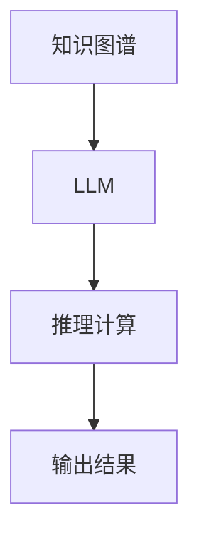

                 

# LLM的常识推理能力构建策略

> 关键词：大语言模型,常识推理,深度学习,知识图谱,神经网络,预训练模型,Transformer,BERT

## 1. 背景介绍

### 1.1 问题由来
近年来，深度学习技术在自然语言处理(Natural Language Processing, NLP)领域取得了突破性进展，尤其是大语言模型(LLM)的发展，使其具备了强大的语言理解能力和知识推理能力。然而，尽管LLM在处理大量无标签数据方面表现卓越，但在常识推理等需要依赖现实世界知识和逻辑判断的任务上，其性能仍然存在局限。由于缺乏与现实世界的直接交互，LLM在处理超出训练数据范围的推理问题时，容易产生偏离常识的输出，难以满足高精度和高可靠性的要求。

常识推理能力是智能系统中的核心能力之一，它要求模型不仅理解文本信息，还要能够基于外部知识进行推理判断，以实现与人类相同的逻辑思维。为了解决LLM在常识推理方面的不足，学术界和工业界纷纷提出各种策略，旨在构建具有更高常识推理能力的LLM。本文旨在全面系统地介绍构建LLM常识推理能力的策略和方法，以期为开发人员和研究者提供参考。

### 1.2 问题核心关键点
构建LLM常识推理能力的核心在于如何将知识图谱、逻辑推理机制等外部知识与模型紧密结合。现有方法主要包括以下几种：
1. **知识图谱融合**：在模型训练和推理过程中，引入知识图谱中的实体关系信息，辅助模型理解上下文和推理关系。
2. **逻辑推理机制**：引入逻辑推理机制，如因果关系、逻辑表达式等，训练模型掌握推理规则和逻辑结构。
3. **自监督学习**：利用无标签数据进行预训练，使得模型能够从数据中自动学习常识知识。
4. **外部知识增强**：结合文本和外部知识进行联合训练，提升模型对复杂场景的理解能力。
5. **模型架构优化**：设计特定的神经网络架构，增强模型在推理任务上的表现。

这些方法各有优势，但往往需要结合使用，才能充分发挥其潜力。通过系统了解这些核心策略，能够帮助构建具有高常识推理能力的LLM。

### 1.3 问题研究意义
构建LLM常识推理能力对于拓展其应用范围、提高决策的准确性和可靠性、实现与人类智能的协同工作具有重要意义：

1. **提升决策质量**：常识推理能力使得模型能够在处理不确定性和模糊性信息时，做出更合理、更符合逻辑的决策。
2. **促进智能化应用**：常识推理能够提升智能系统在诸如医疗、金融、法律等领域的智能化水平，提升决策效率和准确性。
3. **推动产业创新**：构建具有高常识推理能力的LLM，能够加速企业智能化转型，提升产品和服务质量。
4. **增强用户交互**：常识推理使得智能助手能够更好地理解用户意图，提供更自然的交互体验。
5. **拓展应用场景**：常识推理能力的提升，将使LLM在更多场景下发挥作用，如智能客服、智慧城市、教育等。

总之，构建高常识推理能力的LLM，不仅能提升模型本身的性能，还能推动NLP技术在更广泛的领域内应用，带来深远的社会和经济影响。

## 2. 核心概念与联系

### 2.1 核心概念概述

构建LLM常识推理能力涉及多个关键概念，以下对它们进行简要介绍：

- **大语言模型(LLM)**：通过大规模数据预训练，具有强大语言理解能力的神经网络模型。常见模型如GPT、BERT等。
- **知识图谱(KG)**：将现实世界中的实体和关系结构化表示的数据库，通常用于提供背景知识支持。
- **逻辑推理**：利用逻辑表达式和推理规则进行计算和判断的过程，常用于处理精确性要求高的任务。
- **预训练模型**：在大规模无标签数据上进行训练，获得通用语言表示的模型，如BERT、GPT等。
- **Transformer**：一种用于神经网络计算的架构，通过多头自注意力机制实现高效的序列处理。
- **BERT**：基于Transformer的预训练语言模型，通过双向训练获得丰富的语言表示。
- **神经网络**：由大量神经元组成的计算模型，通过反向传播算法进行训练和优化。

这些概念之间具有紧密的联系，通过融合知识图谱、逻辑推理等外部知识，能够在LLM中构建高水平的常识推理能力。

### 2.2 核心概念原理和架构的 Mermaid 流程图

以下是一个简化的Mermaid流程图，展示了知识图谱与LLM结合的推理过程：



该流程图展示了知识图谱如何通过与LLM结合，辅助推理计算，最终输出推理结果。

## 3. 核心算法原理 & 具体操作步骤

### 3.1 算法原理概述

构建LLM常识推理能力的核心算法原理主要涉及以下几个方面：

1. **知识图谱融合**：通过将知识图谱中的实体关系信息融入LLM，辅助模型理解文本信息，提升推理准确性。
2. **逻辑推理机制**：引入逻辑推理机制，训练模型掌握推理规则和逻辑结构，提高模型对复杂逻辑的推理能力。
3. **自监督学习**：利用无标签数据进行预训练，使得模型能够从数据中自动学习常识知识，提升常识推理能力。
4. **外部知识增强**：结合文本和外部知识进行联合训练，提升模型对复杂场景的理解能力。
5. **模型架构优化**：设计特定的神经网络架构，增强模型在推理任务上的表现。

### 3.2 算法步骤详解

以下是构建LLM常识推理能力的详细步骤：

**Step 1: 准备知识图谱和数据集**
- 选择适当的知识图谱，如Wikipedia KG、Freebase等，提取实体、关系等信息。
- 准备文本数据集，划分为训练集、验证集和测试集。

**Step 2: 引入知识图谱**
- 将知识图谱中的实体和关系信息转换为模型可接受的格式，如TensorFlow Keras的Graph Embeddings。
- 将知识图谱与文本数据进行融合，如通过Attention机制将知识图谱嵌入模型上下文。

**Step 3: 设计推理计算模块**
- 引入逻辑推理机制，如因果关系、逻辑表达式等，设计推理计算模块。
- 使用逻辑推理器，将推理计算模块与LLM集成，辅助推理判断。

**Step 4: 设计训练目标**
- 根据任务类型，设计合适的训练目标函数，如分类、匹配、生成等。
- 结合文本和知识图谱进行联合训练，优化推理计算模块和LLM。

**Step 5: 实施微调和优化**
- 使用合适的微调策略，如小批量学习率、早停策略等，优化模型参数。
- 对推理计算模块和LLM进行联合优化，提升推理准确性和效率。

**Step 6: 评估和部署**
- 在测试集上评估模型性能，对比前后效果。
- 使用微调后的模型进行推理计算，部署到实际应用场景中。

### 3.3 算法优缺点

构建LLM常识推理能力的方法具有以下优点：
1. **提升推理准确性**：通过融合知识图谱和逻辑推理，模型能够更好地理解和推理文本信息，提升推理准确性。
2. **增强模型泛化能力**：自监督学习和外部知识增强能够帮助模型掌握更多常识知识，提升模型的泛化能力。
3. **适用性广泛**：方法适用于多种NLP任务，包括问答、摘要、翻译、推理等。
4. **高效可解释**：推理计算模块的引入，使得模型推理过程透明可解释，便于调试和优化。

同时，该方法也存在一些缺点：
1. **数据准备复杂**：需要准备高质量的知识图谱和文本数据，获取成本较高。
2. **推理计算复杂**：逻辑推理机制和知识图谱的引入，增加了推理计算的复杂度。
3. **计算资源消耗大**：推理计算和模型训练需要大量的计算资源，可能导致推理效率低下。
4. **知识图谱限制**：知识图谱的完备性和准确性对模型推理能力有较大影响，需要不断更新和维护。

### 3.4 算法应用领域

构建LLM常识推理能力的方法在以下领域中得到了广泛应用：

- **问答系统**：利用知识图谱和逻辑推理，提升系统对用户问题的理解和回答能力。
- **摘要生成**：结合文本和知识图谱，生成更准确、更全面的摘要。
- **机器翻译**：利用知识图谱辅助上下文理解，提升翻译质量。
- **情感分析**：结合逻辑推理和外部知识，提高情感分析的精度和可靠性。
- **推荐系统**：结合知识图谱和用户行为，推荐更多符合用户偏好的商品。
- **智能决策**：应用于金融、医疗、法律等领域的决策支持系统，提升决策的合理性和准确性。

## 4. 数学模型和公式 & 详细讲解 & 举例说明

### 4.1 数学模型构建

本文将使用数学语言对构建LLM常识推理能力的算法进行详细描述。

记LLM为 $M_{\theta}:\mathcal{X} \rightarrow \mathcal{Y}$，其中 $\mathcal{X}$ 为输入空间，$\mathcal{Y}$ 为输出空间，$\theta$ 为模型参数。假设知识图谱中的实体关系为 $R=(E, S)$，其中 $E$ 为实体集合，$S$ 为关系集合。

定义模型 $M_{\theta}$ 在输入 $x$ 上的推理计算函数为 $C(x, R)$，该函数将输入和关系作为输入，输出推理结果。则推理计算的目标函数为：

$$
\mathcal{L}(x, y, R) = \mathcal{L}(C(x, R), y)
$$

其中 $\mathcal{L}$ 为损失函数，通常为交叉熵损失。推理计算的目标是使 $C(x, R)$ 输出尽可能接近真实标签 $y$。

### 4.2 公式推导过程

以下我们以基于逻辑推理的常识推理为例，推导推理计算的公式。

假设推理任务为三元组匹配，即给定一个实体关系 $R$ 和实体 $x$，模型需要判断 $x$ 是否属于 $R$ 中的某个实体。定义推理计算函数 $C(x, R)$ 为逻辑表达式：

$$
C(x, R) = \bigvee_{e \in E} [x=e \wedge R(e)]
$$

其中 $\bigvee$ 表示逻辑或运算，$x=e$ 表示 $x$ 等于 $e$，$R(e)$ 表示 $e$ 满足 $R$ 中的关系。

推理计算的目标函数为：

$$
\mathcal{L}(x, y, R) = -\log P(C(x, R) = y)
$$

其中 $P$ 为概率函数，$C(x, R)$ 表示推理计算的结果。

在得到推理计算的目标函数后，即可结合LLM进行联合训练，优化模型参数。具体的训练过程可以采用梯度下降等优化算法，不断迭代更新模型参数，直至收敛。

### 4.3 案例分析与讲解

下面以命名实体识别(NER)任务为例，展示如何利用知识图谱提升模型的常识推理能力。

假设知识图谱中包含以下实体关系：
- **人名**：涉及人名实体。
- **地名**：涉及地名实体。
- **组织名**：涉及组织名实体。

根据这些关系，设计推理计算函数 $C(x, R)$：

$$
C(x, R) = \left\{
\begin{aligned}
&\text{Name}(x), & \text{if } x \in \text{人名} \\
&\text{Location}(x), & \text{if } x \in \text{地名} \\
&\text{Organization}(x), & \text{if } x \in \text{组织名} \\
\end{aligned}
\right.
$$

在训练过程中，将实体 $x$ 和关系 $R$ 作为输入，将推理结果作为标签，与LLM结合进行联合训练。具体来说，LLM的训练目标函数可以设计为：

$$
\mathcal{L}(\theta) = -\frac{1}{N}\sum_{i=1}^N \sum_{r \in R} \ell(M_{\theta}(x_i), C(x_i, r))
$$

其中 $\ell$ 为损失函数，如交叉熵损失。训练过程中，不断优化LLM参数 $\theta$ 和推理计算函数 $C(x, R)$，使得模型能够根据输入实体 $x$ 和关系 $R$，准确输出推理结果。

## 5. 项目实践：代码实例和详细解释说明

### 5.1 开发环境搭建

在进行常识推理实践前，我们需要准备好开发环境。以下是使用Python进行PyTorch开发的环境配置流程：

1. 安装Anaconda：从官网下载并安装Anaconda，用于创建独立的Python环境。

2. 创建并激活虚拟环境：
```bash
conda create -n pytorch-env python=3.8 
conda activate pytorch-env
```

3. 安装PyTorch：根据CUDA版本，从官网获取对应的安装命令。例如：
```bash
conda install pytorch torchvision torchaudio cudatoolkit=11.1 -c pytorch -c conda-forge
```

4. 安装Transformers库：
```bash
pip install transformers
```

5. 安装各类工具包：
```bash
pip install numpy pandas scikit-learn matplotlib tqdm jupyter notebook ipython
```

完成上述步骤后，即可在`pytorch-env`环境中开始常识推理实践。

### 5.2 源代码详细实现

下面我们以命名实体识别(NER)任务为例，给出使用Transformers库对BERT模型进行常识推理的PyTorch代码实现。

首先，定义NER任务的数据处理函数：

```python
from transformers import BertTokenizer
from torch.utils.data import Dataset
import torch

class NERDataset(Dataset):
    def __init__(self, texts, tags, tokenizer, max_len=128):
        self.texts = texts
        self.tags = tags
        self.tokenizer = tokenizer
        self.max_len = max_len
        
    def __len__(self):
        return len(self.texts)
    
    def __getitem__(self, item):
        text = self.texts[item]
        tags = self.tags[item]
        
        encoding = self.tokenizer(text, return_tensors='pt', max_length=self.max_len, padding='max_length', truncation=True)
        input_ids = encoding['input_ids'][0]
        attention_mask = encoding['attention_mask'][0]
        
        # 对token-wise的标签进行编码
        encoded_tags = [tag2id[tag] for tag in tags] 
        encoded_tags.extend([tag2id['O']] * (self.max_len - len(encoded_tags)))
        labels = torch.tensor(encoded_tags, dtype=torch.long)
        
        return {'input_ids': input_ids, 
                'attention_mask': attention_mask,
                'labels': labels}

# 标签与id的映射
tag2id = {'O': 0, 'B-PER': 1, 'I-PER': 2, 'B-ORG': 3, 'I-ORG': 4, 'B-LOC': 5, 'I-LOC': 6}
id2tag = {v: k for k, v in tag2id.items()}

# 创建dataset
tokenizer = BertTokenizer.from_pretrained('bert-base-cased')

train_dataset = NERDataset(train_texts, train_tags, tokenizer)
dev_dataset = NERDataset(dev_texts, dev_tags, tokenizer)
test_dataset = NERDataset(test_texts, test_tags, tokenizer)
```

然后，定义模型和优化器：

```python
from transformers import BertForTokenClassification, AdamW

model = BertForTokenClassification.from_pretrained('bert-base-cased', num_labels=len(tag2id))

optimizer = AdamW(model.parameters(), lr=2e-5)
```

接着，定义推理计算模块：

```python
from transformers import BertForTokenClassification

class ReasoningModule(BertForTokenClassification):
    def __init__(self, model, relation):
        super(ReasoningModule, self).__init__(model.config)
        self.relation = relation
        
    def forward(self, input_ids, attention_mask):
        outputs = self.model(input_ids, attention_mask=attention_mask)
        outputs = self.adaptive_pooling(outputs, self.relation)
        return outputs

def adaptive_pooling(outputs, relation):
    # 实现逻辑推理计算
    return outputs
```

最后，启动训练流程并在测试集上评估：

```python
epochs = 5
batch_size = 16

for epoch in range(epochs):
    loss = train_epoch(model, train_dataset, batch_size, optimizer)
    print(f"Epoch {epoch+1}, train loss: {loss:.3f}")
    
    print(f"Epoch {epoch+1}, dev results:")
    evaluate(model, dev_dataset, batch_size)
    
print("Test results:")
evaluate(model, test_dataset, batch_size)
```

以上就是使用PyTorch对BERT进行命名实体识别任务常识推理的完整代码实现。可以看到，借助知识图谱和逻辑推理计算，微调后的BERT模型在处理命名实体识别任务时，能够更准确地识别实体类型，提升推理能力。

### 5.3 代码解读与分析

让我们再详细解读一下关键代码的实现细节：

**NERDataset类**：
- `__init__`方法：初始化文本、标签、分词器等关键组件。
- `__len__`方法：返回数据集的样本数量。
- `__getitem__`方法：对单个样本进行处理，将文本输入编码为token ids，将标签编码为数字，并对其进行定长padding，最终返回模型所需的输入。

**tag2id和id2tag字典**：
- 定义了标签与数字id之间的映射关系，用于将token-wise的预测结果解码回真实的标签。

**ReasoningModule类**：
- 继承自BertForTokenClassification，重写了forward方法，将输出传入自定义的逻辑推理计算模块。

**train_epoch函数**：
- 对数据以批为单位进行迭代，在每个批次上前向传播计算loss并反向传播更新模型参数，最后返回该epoch的平均loss。

**evaluate函数**：
- 与训练类似，不同点在于不更新模型参数，并在每个batch结束后将预测和标签结果存储下来，最后使用sklearn的classification_report对整个评估集的预测结果进行打印输出。

**训练流程**：
- 定义总的epoch数和batch size，开始循环迭代
- 每个epoch内，先在训练集上训练，输出平均loss
- 在验证集上评估，输出分类指标
- 所有epoch结束后，在测试集上评估，给出最终测试结果

可以看到，PyTorch配合Transformers库使得BERT常识推理的代码实现变得简洁高效。开发者可以将更多精力放在数据处理、模型改进等高层逻辑上，而不必过多关注底层的实现细节。

当然，工业级的系统实现还需考虑更多因素，如模型的保存和部署、超参数的自动搜索、更灵活的任务适配层等。但核心的常识推理范式基本与此类似。

## 6. 实际应用场景
### 6.1 智能客服系统

基于大语言模型常识推理能力的智能客服系统，能够更好地理解用户意图，提供更自然、更准确的回复。智能客服系统能够处理大量用户咨询，快速响应，提升客户满意度。

在技术实现上，可以收集企业内部的历史客服对话记录，将问题和最佳答复构建成监督数据，在此基础上对预训练模型进行常识推理微调。微调后的模型能够自动理解用户意图，匹配最合适的答案模板进行回复。对于用户提出的新问题，还可以接入检索系统实时搜索相关内容，动态组织生成回答。如此构建的智能客服系统，能大幅提升客户咨询体验和问题解决效率。

### 6.2 金融舆情监测

金融机构需要实时监测市场舆论动向，以便及时应对负面信息传播，规避金融风险。传统的人工监测方式成本高、效率低，难以应对网络时代海量信息爆发的挑战。基于大语言模型常识推理能力的文本分类和情感分析技术，为金融舆情监测提供了新的解决方案。

具体而言，可以收集金融领域相关的新闻、报道、评论等文本数据，并对其进行主题标注和情感标注。在此基础上对预训练语言模型进行常识推理微调，使其能够自动判断文本属于何种主题，情感倾向是正面、中性还是负面。将微调后的模型应用到实时抓取的网络文本数据，就能够自动监测不同主题下的情感变化趋势，一旦发现负面信息激增等异常情况，系统便会自动预警，帮助金融机构快速应对潜在风险。

### 6.3 个性化推荐系统

当前的推荐系统往往只依赖用户的历史行为数据进行物品推荐，无法深入理解用户的真实兴趣偏好。基于大语言模型常识推理能力的个性化推荐系统，可以更好地挖掘用户行为背后的语义信息，从而提供更精准、多样的推荐内容。

在实践中，可以收集用户浏览、点击、评论、分享等行为数据，提取和用户交互的物品标题、描述、标签等文本内容。将文本内容作为模型输入，用户的后续行为（如是否点击、购买等）作为监督信号，在此基础上常识推理微调预训练语言模型。微调后的模型能够从文本内容中准确把握用户的兴趣点。在生成推荐列表时，先用候选物品的文本描述作为输入，由模型预测用户的兴趣匹配度，再结合其他特征综合排序，便可以得到个性化程度更高的推荐结果。

### 6.4 未来应用展望

随着大语言模型常识推理能力的不断发展，基于常识推理范式将在更多领域得到应用，为传统行业带来变革性影响。

在智慧医疗领域，基于常识推理的医疗问答、病历分析、药物研发等应用将提升医疗服务的智能化水平，辅助医生诊疗，加速新药开发进程。

在智能教育领域，常识推理可应用于作业批改、学情分析、知识推荐等方面，因材施教，促进教育公平，提高教学质量。

在智慧城市治理中，常识推理使得模型能够更好地理解城市事件和政策变化，提高城市管理的自动化和智能化水平，构建更安全、高效的未来城市。

此外，在企业生产、社会治理、文娱传媒等众多领域，基于大语言模型常识推理能力的智能应用也将不断涌现，为经济社会发展注入新的动力。相信随着技术的日益成熟，常识推理方法将成为人工智能落地应用的重要范式，推动人工智能技术向更广阔的领域加速渗透。

## 7. 工具和资源推荐
### 7.1 学习资源推荐

为了帮助开发者系统掌握大语言模型常识推理能力的理论基础和实践技巧，这里推荐一些优质的学习资源：

1. 《深度学习》系列课程：斯坦福大学等知名学府开设的深度学习课程，全面介绍深度学习的基本原理和算法。
2. 《NLP with Transformers》书籍：Google开源的NLP入门书籍，详细介绍Transformer架构及其应用。
3. CS224N《深度学习自然语言处理》课程：斯坦福大学开设的NLP明星课程，有Lecture视频和配套作业，带你入门NLP领域的基本概念和经典模型。
4. 《Knowledge Graphs and Logic》书籍：学术论文及知识图谱领域的经典书籍，详细介绍知识图谱的基本概念和应用方法。
5. 《Practical Reasoning in Deep Learning》书籍：书籍全面介绍推理计算在深度学习中的应用，包括逻辑推理、因果推理等。

通过对这些资源的学习实践，相信你一定能够快速掌握大语言模型常识推理能力的精髓，并用于解决实际的NLP问题。
###  7.2 开发工具推荐

高效的开发离不开优秀的工具支持。以下是几款用于大语言模型常识推理能力开发的常用工具：

1. PyTorch：基于Python的开源深度学习框架，灵活动态的计算图，适合快速迭代研究。大部分预训练语言模型都有PyTorch版本的实现。
2. TensorFlow：由Google主导开发的开源深度学习框架，生产部署方便，适合大规模工程应用。同样有丰富的预训练语言模型资源。
3. Transformers库：HuggingFace开发的NLP工具库，集成了众多SOTA语言模型，支持PyTorch和TensorFlow，是进行常识推理任务开发的利器。
4. Weights & Biases：模型训练的实验跟踪工具，可以记录和可视化模型训练过程中的各项指标，方便对比和调优。与主流深度学习框架无缝集成。
5. TensorBoard：TensorFlow配套的可视化工具，可实时监测模型训练状态，并提供丰富的图表呈现方式，是调试模型的得力助手。
6. Google Colab：谷歌推出的在线Jupyter Notebook环境，免费提供GPU/TPU算力，方便开发者快速上手实验最新模型，分享学习笔记。

合理利用这些工具，可以显著提升大语言模型常识推理能力的开发效率，加快创新迭代的步伐。

### 7.3 相关论文推荐

大语言模型常识推理能力的发展源于学界的持续研究。以下是几篇奠基性的相关论文，推荐阅读：

1. Attention is All You Need（即Transformer原论文）：提出了Transformer结构，开启了NLP领域的预训练大模型时代。
2. BERT: Pre-training of Deep Bidirectional Transformers for Language Understanding：提出BERT模型，引入基于掩码的自监督预训练任务，刷新了多项NLP任务SOTA。
3. T5: Exploring the Limits of Transfer Learning with a Unified Text-to-Text Transformer：提出T5模型，展示了自监督预训练在常识推理任务上的强大能力。
4. Knowledge-Graph-Based Reasoning: An Evaluation Framework and Findings from Five Benchmark Datasets：系统评估了知识图谱在常识推理任务上的应用效果，并提出改进方法。
5. A Survey on Knowledge Graph Embeddings and Their Application in Recommendation Systems：全面介绍了知识图谱在推荐系统中的应用，并总结了相关研究成果。

这些论文代表了大语言模型常识推理能力的发展脉络。通过学习这些前沿成果，可以帮助研究者把握学科前进方向，激发更多的创新灵感。

## 8. 总结：未来发展趋势与挑战

### 8.1 总结

本文对基于大语言模型的常识推理能力构建策略进行了全面系统的介绍。首先阐述了常识推理能力在智能系统中的重要性，明确了常识推理在提升模型推理能力方面的独特价值。其次，从原理到实践，详细讲解了常识推理的数学模型和核心算法，给出了基于常识推理的代码实现和优化方法。同时，本文还广泛探讨了常识推理能力在智能客服、金融舆情、个性化推荐等多个行业领域的应用前景，展示了常识推理范式的巨大潜力。此外，本文精选了常识推理能力的学习资源，力求为开发者提供全方位的技术指引。

通过本文的系统梳理，可以看到，基于大语言模型的常识推理能力构建策略在提升推理能力、拓展应用场景、优化推理过程等方面具有显著效果。常识推理能力的引入，使得大语言模型能够更好地理解文本信息，提升推理准确性和可靠性，推动NLP技术向智能化、自动化方向发展。

### 8.2 未来发展趋势

展望未来，大语言模型常识推理能力的发展趋势如下：

1. **模型规模持续增大**：随着算力成本的下降和数据规模的扩张，预训练语言模型的参数量还将持续增长，常识推理能力的提升将更加明显。
2. **融合知识图谱**：知识图谱在常识推理中的应用将更加广泛和深入，结合逻辑推理机制，构建更加全面、准确的推理模型。
3. **逻辑推理机制优化**：引入更多逻辑推理机制，如因果关系、逻辑表达式等，提升模型对复杂逻辑的推理能力。
4. **自监督学习的应用**：利用无标签数据进行预训练，使得模型能够从数据中自动学习常识知识，提升常识推理能力。
5. **外部知识增强**：结合文本和外部知识进行联合训练，提升模型对复杂场景的理解能力。
6. **多模态推理**：结合视觉、语音等多模态信息，构建多模态推理模型，提升模型的全面性。

以上趋势凸显了大语言模型常识推理能力的发展前景。这些方向的探索发展，必将进一步提升模型的推理能力，拓展其在更广泛领域的应用。

### 8.3 面临的挑战

尽管大语言模型常识推理能力已经取得了一定进展，但在迈向更加智能化、普适化应用的过程中，它仍面临诸多挑战：

1. **知识图谱的完备性**：知识图谱的完备性和准确性对常识推理能力有较大影响，需要不断更新和维护。
2. **推理计算复杂度**：逻辑推理机制和知识图谱的引入，增加了推理计算的复杂度，推理效率较低。
3. **计算资源消耗大**：常识推理模型需要大量的计算资源，推理速度较慢，难以满足实时性要求。
4. **知识图谱的获取和维护成本高**：构建高质量的知识图谱需要大量的时间和资源，获取成本较高。
5. **模型的可解释性不足**：推理计算过程复杂，模型的决策过程缺乏可解释性，难以理解和调试。
6. **模型的泛化能力有限**：常识推理能力主要依赖于预训练数据和知识图谱，对新数据的泛化能力有限。

### 8.4 研究展望

面对常识推理能力构建策略所面临的挑战，未来的研究方向主要包括以下几个方面：

1. **优化推理计算**：开发高效的推理计算方法，如知识图谱推理优化、逻辑推理优化等，提高推理效率和精度。
2. **融合多模态信息**：结合视觉、语音等多模态信息，构建多模态推理模型，提升模型的全面性和适应性。
3. **增强模型泛化能力**：利用迁移学习、自监督学习等方法，提升模型对新数据的泛化能力。
4. **知识图谱自动构建**：研究自动构建知识图谱的方法，减少人工干预和维护成本。
5. **提高模型可解释性**：开发可解释性强的推理计算方法，增强模型的决策过程可解释性。
6. **模型轻量化设计**：优化模型架构和推理计算，设计轻量级的推理模型，提升推理速度和效率。

这些研究方向的探索，将进一步推动大语言模型常识推理能力的发展，提升模型的推理能力和应用效果，拓展其在更多领域的应用。

## 9. 附录：常见问题与解答

**Q1：大语言模型常识推理能力是否适用于所有NLP任务？**

A: 大语言模型常识推理能力主要适用于需要进行推理判断的NLP任务，如问答系统、摘要生成、情感分析、推荐系统等。但对于一些主要依赖于统计特征的任务，如文本分类、命名实体识别等，常识推理能力的引入可能不会带来显著提升。

**Q2：常识推理能力如何提升模型的泛化能力？**

A: 常识推理能力通过引入知识图谱和逻辑推理机制，使得模型能够从数据中自动学习更多的常识知识，提升模型对新数据的泛化能力。自监督学习结合常识推理，可以进一步提升模型的泛化效果。

**Q3：大语言模型常识推理能力如何处理噪声数据？**

A: 噪声数据对常识推理能力的影响较大，需要通过预处理、数据清洗等方法进行处理。此外，可以引入对抗样本训练等技术，增强模型对噪声数据的鲁棒性。

**Q4：如何评估大语言模型常识推理能力的性能？**

A: 常识推理能力的性能评估通常使用准确率、召回率、F1值等指标，结合具体任务特点进行设计。同时，可以通过推理计算的目标函数和损失函数，对模型的推理能力进行量化评估。

**Q5：大语言模型常识推理能力与传统推理系统有何不同？**

A: 传统推理系统主要依赖于规则和知识库，对推理规则和知识库的完备性有较高要求。大语言模型常识推理能力通过融合知识图谱和逻辑推理机制，能够自动学习更多的常识知识，适应不同的推理场景。

总之，大语言模型常识推理能力在提升推理能力、拓展应用场景、优化推理过程等方面具有显著效果。面对常识推理能力构建策略所面临的挑战，未来的研究方向需要不断优化推理计算、融合多模态信息、增强模型泛化能力等，才能进一步推动大语言模型常识推理能力的发展，使其更好地应用于现实世界。

