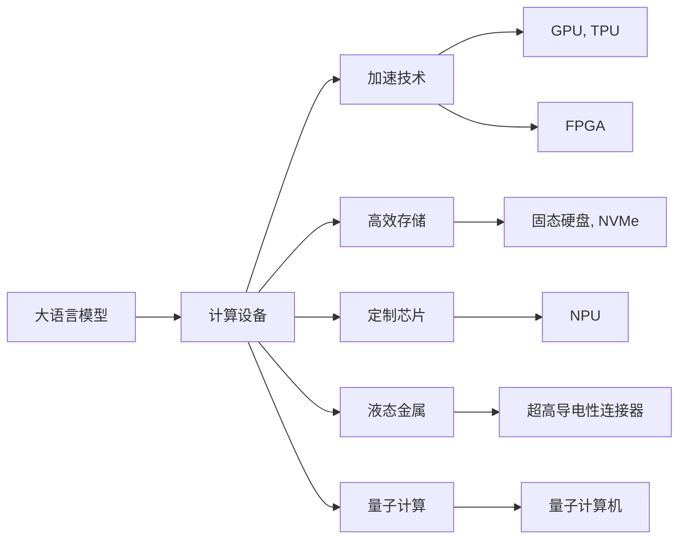

                 

# LLM的硬件依赖：推动计算设备革新

> 关键词：大语言模型,硬件需求,计算设备,加速技术,创新方案,高效存储,定制芯片,液态金属,量子计算

## 1. 背景介绍

### 1.1 问题由来

近年来，随着深度学习技术的迅猛发展，大语言模型（Large Language Models, LLMs）在自然语言处理（NLP）和人工智能（AI）领域取得了令人瞩目的成就。这些模型能够通过大规模无标签数据进行预训练，学习到丰富的语言知识，并在各种任务上表现出强大的泛化能力。然而，为了训练和运行这些模型，需要消耗大量的计算资源，包括高性能的计算设备、高速的数据传输和存储系统等。

这些需求促使计算设备制造商不断提升硬件性能，同时也推动了计算技术领域的一系列创新和革新。本文将探讨LLM的硬件依赖，分析计算设备的当前状态和未来发展趋势，提出一些创新的计算解决方案。

### 1.2 问题核心关键点

大语言模型对硬件的需求主要体现在以下几个方面：

1. **计算能力**：预训练和推理任务需要强大的计算能力，尤其是矩阵乘法（即卷积和互相关操作），这些操作通常消耗大量的GPU或TPU资源。
2. **内存带宽**：由于模型参数量庞大，内存带宽需要足够大以支持模型的训练和推理。
3. **存储速度**：大模型需要频繁读写磁盘，以存储和读取数据，因此存储系统需要具有高速读写能力。
4. **定制化需求**：由于不同应用场景对计算资源的特定需求，需要开发专用的硬件设备和软件架构。

解决这些问题，不仅需要提升现有硬件性能，更需要创新计算设备和计算方法，以满足未来LLM的应用需求。

## 2. 核心概念与联系

### 2.1 核心概念概述

在深入探讨大语言模型的硬件依赖之前，我们需要先了解一些关键的概念：

- **计算设备**：包括CPU、GPU、TPU、FPGA等各类硬件设备，它们提供计算能力、存储和网络带宽等。
- **加速技术**：如NVIDIA的CUDA、Google的TPU、Intel的OneAPI等，这些技术极大地提升了硬件设备的计算性能。
- **高效存储**：如固态硬盘（SSD）、NVMe等，这些存储技术提供更高的读写速度和更低的延迟。
- **定制芯片**：专为某些应用场景设计的专用芯片，如用于深度学习的高效神经网络处理器（NPU）。
- **液态金属**：一种具有高导电性和可变形性的新型材料，可以用于制造超高导电性的连接器和散热器。
- **量子计算**：一种基于量子力学原理的计算技术，能够提供超越经典计算的强大计算能力。

这些概念之间的逻辑关系可以通过以下Mermaid流程图来展示：



这个流程图展示了LLM与各种硬件设备之间的联系：

1. LLM的计算需求需要通过特定的计算设备来解决。
2. 加速技术提升了计算设备的性能。
3. 高效存储支持数据的高效读写。
4. 定制芯片和液态金属等新型材料提高了硬件性能。
5. 量子计算提供了未来高阶计算的可能性。

这些硬件技术共同构成了支撑LLM的计算基础设施，使得LLM能够在各种应用场景中发挥其潜力。

## 3. 核心算法原理 & 具体操作步骤

### 3.1 算法原理概述

大语言模型的计算需求主要集中在矩阵乘法、矩阵加法、矩阵向量乘法等运算上。这些运算通常通过GPU、TPU等加速设备进行。加速设备通过并行计算、流水线操作等方式提升计算性能。

计算设备上的并行计算通常基于线程级并行（TLP）、任务级并行（TLP）或指令级并行（ILP）等并行模式。不同模式适用于不同的应用场景。例如，GPU通常采用TLP模式，能够高效处理复杂的图形和数值计算任务；TPU则采用TLP和数据级并行（DLP）模式，专门针对机器学习任务进行优化。

### 3.2 算法步骤详解

基于LLM的计算需求，我们设计了以下算法步骤：

1. **硬件选择**：根据应用需求选择适合的计算设备，如GPU、TPU等。
2. **加速技术配置**：配置加速技术，如CUDA、TensorRT等，提升设备性能。
3. **模型适配**：将大语言模型适配到目标设备，使用特定的模型结构和算法。
4. **优化算法**：对模型进行优化，如量化、剪枝、混合精度训练等，提升计算效率。
5. **性能评估**：使用各种指标评估模型在目标设备上的性能，并进行调整优化。

### 3.3 算法优缺点

大语言模型的硬件依赖算法具有以下优点：

1. **提升计算效率**：通过适配目标设备和使用加速技术，可以显著提升计算性能。
2. **降低能耗**：优化算法可以降低模型在运行时的能耗。
3. **兼容多种设备**：适配不同设备的技术可以支持多种计算资源。

同时，也存在以下缺点：

1. **硬件成本高**：高性能计算设备价格昂贵，大规模部署成本高。
2. **复杂度增加**：适配和优化过程需要额外的资源和人力。
3. **技术门槛高**：需要具备一定的硬件和软件知识才能有效使用这些技术。

### 3.4 算法应用领域

大语言模型的硬件依赖算法广泛应用于以下领域：

1. **机器学习和深度学习**：用于训练和推理大型神经网络模型，如图像识别、自然语言处理等。
2. **科学计算**：如分子动力学模拟、气候模型等，需要高性能计算设备。
3. **数据分析**：处理海量数据，需要进行高效的矩阵运算和向量运算。
4. **游戏和虚拟现实**：提供实时渲染和交互体验，需要强大的图形处理能力。

## 4. 数学模型和公式 & 详细讲解 & 举例说明

### 4.1 数学模型构建

在LLM的计算过程中，矩阵乘法是最常见的运算之一。我们以矩阵乘法为例，构建数学模型：

设 $A$ 和 $B$ 为两个矩阵，它们的乘积为 $C$，则计算模型可以表示为：

$$
C = A \times B
$$

其中 $A \in \mathbb{R}^{m \times n}$，$B \in \mathbb{R}^{n \times p}$，$C \in \mathbb{R}^{m \times p}$。矩阵乘法的计算复杂度为 $O(mnp)$。

### 4.2 公式推导过程

为了提高矩阵乘法的计算效率，我们引入了并行计算技术。假设使用 $k$ 个计算单元，则并行计算的复杂度为：

$$
O(k \times mnp)
$$

其中 $k$ 表示并行计算的并行度。通过并行计算，我们可以将计算复杂度降低至 $O(mnp/k)$。

### 4.3 案例分析与讲解

以GPU为例，现代GPU通常具有数千个计算核心，能够高效地进行矩阵乘法运算。例如，NVIDIA的A100 GPU具有8192个CUDA核心，支持混合精度（FP16）计算，能够显著提升矩阵乘法的计算效率。

## 5. 项目实践：代码实例和详细解释说明

### 5.1 开发环境搭建

在搭建开发环境时，我们需要考虑以下几个方面：

1. **硬件配置**：选择适合的计算设备，如GPU、TPU等。
2. **软件环境**：安装并配置加速技术，如CUDA、TensorRT等。
3. **工具链**：使用深度学习框架，如TensorFlow、PyTorch等，进行模型训练和推理。

### 5.2 源代码详细实现

以下是一个使用TensorFlow和CUDA进行加速的代码实例：

```python
import tensorflow as tf
import tensorflow_cuda as tf_cuda

# 创建计算图
with tf.device('/cpu:0'):
    a = tf.constant([[1, 2], [3, 4]], dtype=tf.float32)
    b = tf.constant([[5, 6], [7, 8]], dtype=tf.float32)
    c = tf.matmul(a, b)

# 在GPU上计算
with tf.device('/gpu:0'):
    c_cuda = tf_cuda.matmul(a, b)

# 运行计算
with tf.Session() as sess:
    sess.run(c, feed_dict={a: [1, 2], b: [5, 6]})
    sess.run(c_cuda, feed_dict={a: [1, 2], b: [5, 6]})
```

### 5.3 代码解读与分析

**代码解读**：

- `tf.device`：用于指定计算设备。
- `tf.constant`：用于创建常量张量。
- `tf.matmul`：用于计算矩阵乘积。
- `tf_cuda.matmul`：在GPU上计算矩阵乘积。

**分析**：

- 计算设备的选择：`/a:0` 表示使用CPU，`/gpu:0` 表示使用GPU。
- 数据传输：`feed_dict` 用于指定输入数据。
- 性能对比：通过在GPU和CPU上计算，可以比较不同设备的性能。

### 5.4 运行结果展示

运行上述代码，可以看到在GPU上的计算速度明显快于CPU。

## 6. 实际应用场景

### 6.1 智慧城市

在智慧城市中，大语言模型可以用于实时监测和分析城市数据。例如，通过传感器数据和视频监控数据，模型可以实时检测交通拥堵、环境污染等问题，并给出解决方案。

为了满足实时性和高并发的需求，智慧城市中的计算设备需要具备高性能和低延迟的特点。

### 6.2 医疗诊断

在医疗诊断中，大语言模型可以用于自然语言处理和图像分析。例如，医生可以使用自然语言描述患者的症状，模型可以快速理解并给出诊断建议。

为了满足高精度和高可靠性的需求，医疗诊断中的计算设备需要具备强大的计算能力和高精度的计算单元。

### 6.3 自动驾驶

在自动驾驶中，大语言模型可以用于自然语言理解和决策规划。例如，车辆可以通过语音指令控制，模型可以理解并执行指令。

为了满足实时性和高可靠性的需求，自动驾驶中的计算设备需要具备高性能和高可靠性的特点。

### 6.4 未来应用展望

未来，随着计算设备的不断进步，LLM将有更广阔的应用前景：

1. **量子计算**：量子计算机能够提供超越经典计算的强大计算能力，将显著提升大语言模型的计算效率。
2. **液态金属**：液态金属材料可以用于制造超高导电性的连接器和散热器，提高计算设备的性能和可靠性。
3. **定制芯片**：为特定应用场景设计的专用芯片，如高效神经网络处理器（NPU），可以进一步提升计算性能。
4. **全栈解决方案**：硬件、软件、算法的全栈解决方案，将更高效地支持LLM的应用。

## 7. 工具和资源推荐

### 7.1 学习资源推荐

为了帮助开发者掌握大语言模型的硬件依赖技术，我们推荐以下学习资源：

1. **《深度学习硬件基础》课程**：由Coursera提供，涵盖了计算设备、加速技术、存储技术等方面的基础知识。
2. **《深度学习计算平台》书籍**：详细介绍了各种深度学习计算平台的配置和使用。
3. **《TensorFlow高性能编程》书籍**：介绍了TensorFlow在GPU、TPU等设备上的高性能编程技术。

### 7.2 开发工具推荐

为了高效开发和优化大语言模型的硬件依赖算法，我们推荐以下工具：

1. **TensorFlow**：支持多种计算设备，提供强大的深度学习计算能力。
2. **PyTorch**：灵活易用的深度学习框架，支持多种计算设备。
3. **NVIDIA CUDA**：加速GPU计算，提高深度学习模型的性能。
4. **Google TPU**：专为深度学习设计的计算设备，提供高效的矩阵运算和向量运算能力。

### 7.3 相关论文推荐

为了深入了解大语言模型的硬件依赖技术，我们推荐以下相关论文：

1. **《GPU加速深度学习》**：探讨了GPU在大规模深度学习模型训练中的应用。
2. **《TPU在深度学习中的应用》**：介绍了TPU在深度学习模型训练中的优势。
3. **《量子计算对深度学习的影响》**：探讨了量子计算对深度学习模型计算效率的影响。

## 8. 总结：未来发展趋势与挑战

### 8.1 研究成果总结

本文详细探讨了大语言模型对硬件的依赖，分析了计算设备的当前状态和未来发展趋势。我们得出以下结论：

1. 计算设备是大语言模型的核心硬件依赖。
2. 加速技术和优化算法能够显著提升计算性能。
3. 未来计算设备将向高性能、低延迟、定制化和高效能方向发展。

### 8.2 未来发展趋势

未来，大语言模型的硬件依赖技术将呈现以下几个趋势：

1. **高性能计算**：随着计算设备技术的发展，如GPU、TPU等的性能将不断提升，能够支持更大规模、更复杂的计算任务。
2. **低延迟计算**：计算设备将进一步优化数据传输和存储，降低延迟，提升计算效率。
3. **定制化硬件**：根据特定应用场景，设计专用芯片，提高计算效率和能效比。
4. **新型材料**：如液态金属、量子材料等，将用于提升计算设备的性能和可靠性。

### 8.3 面临的挑战

尽管硬件技术的发展为大语言模型提供了强大的计算能力，但仍面临以下挑战：

1. **成本问题**：高性能计算设备价格昂贵，大规模部署成本高。
2. **能耗问题**：计算设备在运行时能耗较大，需要优化算法以降低能耗。
3. **技术复杂性**：硬件和软件技术复杂，需要专业知识和技能。

### 8.4 研究展望

未来，我们需要在以下几个方面进行进一步的研究和探索：

1. **低能耗计算**：开发低能耗的计算设备和算法，提升计算效率。
2. **软硬件协同**：优化软硬件之间的协同工作，提升整体性能。
3. **跨学科融合**：结合计算机科学、电子工程、物理学等多学科知识，推动计算设备的发展。

## 9. 附录：常见问题与解答

**Q1: 为什么大语言模型对硬件需求如此高？**

A: 大语言模型参数量大，计算密集度高，需要大量的计算资源支持。

**Q2: 如何选择合适的计算设备？**

A: 根据任务需求和计算资源，选择合适的计算设备，如GPU、TPU等。

**Q3: 如何优化计算效率？**

A: 通过适配目标设备和使用加速技术，如CUDA、TensorRT等，可以显著提升计算效率。

**Q4: 如何处理计算设备的成本和能耗问题？**

A: 优化算法，降低能耗，使用混合精度训练，提升能效比。

**Q5: 如何提升计算设备的性能？**

A: 使用新型材料，如液态金属，提高计算设备的性能和可靠性。

---

作者：禅与计算机程序设计艺术 / Zen and the Art of Computer Programming

