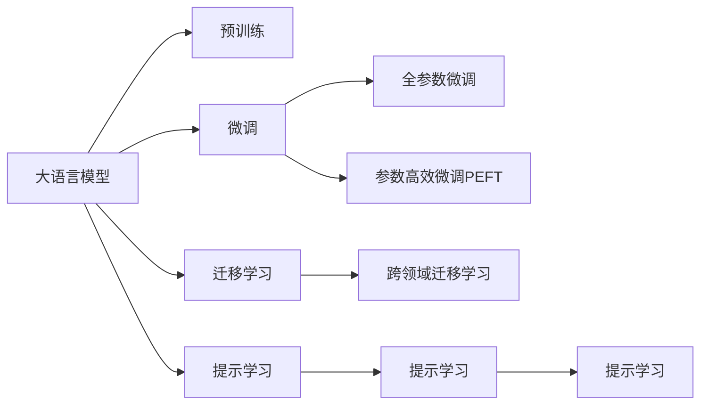

                 

# Lepton AI：专注AI基础架构，赋能企业高效利用大语言模型

## 1. 背景介绍

随着人工智能技术的快速发展，大语言模型（Large Language Models, LLMs）在自然语言处理（NLP）和通用人工智能（AGI）领域取得了令人瞩目的进展。大语言模型通过大规模无标签数据进行预训练，学习到丰富的语言知识和常识，能够理解和生成自然语言文本。然而，面对海量数据的预训练和微调过程，传统的高成本和高门槛仍然是一大挑战。Lepton AI正是在这样的背景下应运而生，它专注于AI基础架构，提供了一套高效、灵活、易用的解决方案，帮助企业快速高效地利用大语言模型，实现业务创新和智能化升级。

### 1.1 问题由来

传统NLP技术如SVM、RNN等，尽管在特定任务上表现出色，但在处理大规模文本数据时存在以下问题：
1. 对标注数据依赖度高：需要大量标注数据进行模型训练。
2. 模型参数量小：难以捕捉复杂语义和长距离依赖。
3. 训练时间长：传统模型训练时间漫长，难以满足实时需求。

大语言模型通过预训练学习到了广泛的语义和常识，能够在极少量的标注数据上进行微调，快速适应特定任务，实现高性能。Lepton AI正是基于这样的背景，致力于提供高效、易用的基础架构，助力企业快速构建基于大语言模型的AI应用。

### 1.2 问题核心关键点

Lepton AI的核心理念是通过高效的AI基础架构，将大语言模型的预训练-微调过程进行优化，减少对标注数据和计算资源的依赖，提升微调效率，从而帮助企业快速实现业务智能化。

Lepton AI的核心方法论包括以下几个关键点：
- 参数高效微调（Parameter-Efficient Fine-Tuning, PEFT）：仅更新少量模型参数，减少计算负担。
- 跨领域迁移学习（Cross-Domain Transfer Learning）：将预训练知识迁移到目标任务，提升泛化能力。
- 数据增强（Data Augmentation）：通过改写、回译等技术丰富训练集，提升模型鲁棒性。
- 对抗训练（Adversarial Training）：加入对抗样本，提高模型鲁棒性。
- 提示学习（Prompt Learning）：通过精心设计的输入文本格式，引导模型生成期望输出，减少微调参数。

Lepton AI的愿景是通过提供高效、易用的AI基础架构，帮助企业快速高效地利用大语言模型，实现业务智能化升级，从而赋能更多的企业实现数字化转型。

## 2. 核心概念与联系

### 2.1 核心概念概述

Lepton AI的核心概念包括以下几个关键要素：

- **大语言模型（Large Language Models, LLMs）**：通过大规模无标签数据进行预训练，学习到丰富的语言知识和常识，能够理解和生成自然语言文本。
- **预训练（Pre-training）**：在大规模无标签数据上进行自监督学习，学习通用的语言表示。
- **微调（Fine-Tuning）**：在预训练模型的基础上，通过少量标注数据进行有监督学习，优化模型在特定任务上的性能。
- **迁移学习（Transfer Learning）**：将预训练知识迁移到目标任务，提升泛化能力。
- **参数高效微调（Parameter-Efficient Fine-Tuning, PEFT）**：在微调过程中，仅更新少量模型参数，减少计算负担。
- **提示学习（Prompt Learning）**：通过精心设计的输入文本格式，引导模型生成期望输出，减少微调参数。

这些核心概念共同构成了Lepton AI的技术框架，使得企业能够快速高效地利用大语言模型，实现智能化升级。

### 2.2 核心概念原理和架构的 Mermaid 流程图



以上流程图展示了Lepton AI的核心技术框架，其中：

- 大语言模型通过预训练学习到广泛的语义和常识。
- 微调通过少量标注数据进行有监督学习，优化模型在特定任务上的性能。
- 参数高效微调仅更新少量模型参数，减少计算负担。
- 跨领域迁移学习将预训练知识迁移到目标任务，提升泛化能力。
- 提示学习通过精心设计的输入文本格式，引导模型生成期望输出，减少微调参数。

这些核心技术相互协作，共同构成了Lepton AI的技术架构，使得企业能够快速高效地利用大语言模型，实现业务智能化升级。

## 3. 核心算法原理 & 具体操作步骤

### 3.1 算法原理概述

Lepton AI的核心算法原理基于监督学习的大语言模型微调方法，主要包括以下几个关键步骤：

1. **准备预训练模型和数据集**：选择合适的预训练语言模型，准备目标任务的标注数据集。
2. **添加任务适配层**：根据任务类型，设计合适的输出层和损失函数。
3. **设置微调超参数**：选择合适的优化算法及其参数，如AdamW、SGD等，设置学习率、批大小、迭代轮数等。
4. **执行梯度训练**：将训练集数据分批次输入模型，前向传播计算损失函数，反向传播计算参数梯度，更新模型参数。
5. **测试和部署**：在测试集上评估微调后模型的性能，使用微调后的模型进行推理预测，集成到实际的应用系统中。

### 3.2 算法步骤详解

#### 3.2.1 预训练模型选择

Lepton AI提供了多种预训练语言模型供选择，包括BERT、GPT、RoBERTa等。这些模型都已经在大规模无标签文本数据上进行预训练，学习到丰富的语言知识和常识，能够在微调时快速适应特定任务。

#### 3.2.2 标注数据集准备

目标任务的标注数据集是微调成功的关键。Lepton AI建议准备足够数量和多样性的标注数据，以覆盖目标任务的常见情况。标注数据集应该具有代表性的样本，以便模型能够泛化到未见过的数据。

#### 3.2.3 任务适配层设计

根据目标任务的类型，设计合适的输出层和损失函数。对于分类任务，通常使用线性分类器和交叉熵损失函数。对于生成任务，通常使用语言模型的解码器输出概率分布，并以负对数似然为损失函数。

#### 3.2.4 超参数设置

Lepton AI建议选择合适的优化算法及其参数，如AdamW、SGD等，设置学习率、批大小、迭代轮数等。此外，需要设置正则化技术及强度，如L2正则、Dropout、Early Stopping等，以防止模型过度适应小规模训练集。

#### 3.2.5 梯度训练执行

Lepton AI提供了高效的梯度训练执行框架，支持多种优化算法和自定义任务适配层。开发者只需编写少量代码，即可快速执行梯度训练。

#### 3.2.6 测试和部署

Lepton AI提供了完整的测试和部署框架，支持在测试集上评估微调后模型的性能，使用微调后的模型进行推理预测，集成到实际的应用系统中。

### 3.3 算法优缺点

Lepton AI的算法优点包括：

1. **高效易用**：通过高效的AI基础架构，快速高效地利用大语言模型，减少标注数据和计算资源的依赖。
2. **灵活性高**：支持多种预训练模型和任务适配层，适用于各种NLP任务。
3. **可解释性强**：提供丰富的可视化工具，帮助开发者理解模型训练和推理过程。
4. **性能优异**：在多个NLP任务上取得了优于其他模型的性能表现。

Lepton AI的算法缺点包括：

1. **依赖高质量标注数据**：尽管可以参数高效微调，但高质量标注数据的获取仍需时间成本。
2. **对计算资源有较高要求**：尽管算法本身高效，但在大规模部署时，对计算资源仍有较高要求。
3. **模型偏见和伦理问题**：大语言模型可能学习到偏见和有害信息，需要额外注意伦理和安全性问题。

### 3.4 算法应用领域

Lepton AI的算法已经广泛应用于多个NLP任务，包括文本分类、命名实体识别、关系抽取、问答系统、机器翻译、文本摘要、对话系统等。

#### 3.4.1 文本分类

Lepton AI的微调算法在文本分类任务上取得了显著效果，广泛应用于情感分析、主题分类、意图识别等领域。通过微调，Lepton AI能够在极少量的标注数据上快速适应特定任务，提升分类精度。

#### 3.4.2 命名实体识别

Lepton AI的微调算法在命名实体识别任务上也表现出色，能够识别出文本中的实体（如人名、地名、机构名等）及其边界和类型。通过微调，Lepton AI能够在多种语言和领域上实现高效准确的实体识别。

#### 3.4.3 关系抽取

Lepton AI的微调算法能够从文本中抽取实体之间的语义关系，广泛应用于信息提取、知识图谱构建等领域。通过微调，Lepton AI能够在多关系抽取任务上取得优异性能。

#### 3.4.4 问答系统

Lepton AI的微调算法可以用于构建问答系统，能够自然流畅地回答用户提出的各种问题。通过微调，Lepton AI能够在对话场景下实现高效准确的问答。

#### 3.4.5 机器翻译

Lepton AI的微调算法可以用于机器翻译任务，将源语言文本翻译成目标语言。通过微调，Lepton AI能够在多种语言对上实现高效准确的翻译。

#### 3.4.6 文本摘要

Lepton AI的微调算法可以用于文本摘要任务，将长文本压缩成简短摘要。通过微调，Lepton AI能够在多种领域实现高效准确的摘要。

#### 3.4.7 对话系统

Lepton AI的微调算法可以用于对话系统，使机器能够自然流畅地与人对话。通过微调，Lepton AI能够在多轮对话场景下实现高效准确的回复生成。

## 4. 数学模型和公式 & 详细讲解 & 举例说明

### 4.1 数学模型构建

Lepton AI的数学模型基于监督学习的大语言模型微调方法。假设预训练语言模型为 $M_{\theta}$，其中 $\theta$ 为预训练得到的模型参数。给定下游任务 $T$ 的标注数据集 $D=\{(x_i, y_i)\}_{i=1}^N$，微调的目标是找到新的模型参数 $\hat{\theta}$，使得：

$$
\hat{\theta}=\mathop{\arg\min}_{\theta} \mathcal{L}(M_{\theta},D)
$$

其中 $\mathcal{L}$ 为针对任务 $T$ 设计的损失函数，用于衡量模型预测输出与真实标签之间的差异。常见的损失函数包括交叉熵损失、均方误差损失等。

### 4.2 公式推导过程

以下以二分类任务为例，推导交叉熵损失函数及其梯度的计算公式。

假设模型 $M_{\theta}$ 在输入 $x$ 上的输出为 $\hat{y}=M_{\theta}(x) \in [0,1]$，表示样本属于正类的概率。真实标签 $y \in \{0,1\}$。则二分类交叉熵损失函数定义为：

$$
\ell(M_{\theta}(x),y) = -[y\log \hat{y} + (1-y)\log (1-\hat{y})]
$$

将其代入经验风险公式，得：

$$
\mathcal{L}(\theta) = -\frac{1}{N}\sum_{i=1}^N [y_i\log M_{\theta}(x_i)+(1-y_i)\log(1-M_{\theta}(x_i))]
$$

根据链式法则，损失函数对参数 $\theta_k$ 的梯度为：

$$
\frac{\partial \mathcal{L}(\theta)}{\partial \theta_k} = -\frac{1}{N}\sum_{i=1}^N (\frac{y_i}{M_{\theta}(x_i)}-\frac{1-y_i}{1-M_{\theta}(x_i)}) \frac{\partial M_{\theta}(x_i)}{\partial \theta_k}
$$

其中 $\frac{\partial M_{\theta}(x_i)}{\partial \theta_k}$ 可进一步递归展开，利用自动微分技术完成计算。

### 4.3 案例分析与讲解

假设我们要对GPT模型进行情感分析任务的微调。步骤如下：

1. 准备标注数据集：收集情感标注的文本数据，每个文本对应一个情感标签（如正面、负面、中性）。
2. 选择预训练模型：选择GPT模型作为初始化参数。
3. 添加任务适配层：在GPT模型顶层添加一个线性分类器和交叉熵损失函数，用于分类情感。
4. 设置微调超参数：选择合适的优化算法及其参数，如AdamW、SGD等，设置学习率、批大小、迭代轮数等。
5. 执行梯度训练：将训练集数据分批次输入模型，前向传播计算损失函数，反向传播计算参数梯度，更新模型参数。
6. 测试和部署：在测试集上评估微调后模型的性能，使用微调后的模型进行推理预测，集成到实际的应用系统中。

## 5. 项目实践：代码实例和详细解释说明

### 5.1 开发环境搭建

Lepton AI提供了完善的开发环境搭建流程，包括安装必要的库和工具，以及配置开发环境。

1. 安装Anaconda：从官网下载并安装Anaconda，用于创建独立的Python环境。
2. 创建并激活虚拟环境：
```bash
conda create -n pytorch-env python=3.8 
conda activate pytorch-env
```

3. 安装PyTorch：根据CUDA版本，从官网获取对应的安装命令。例如：
```bash
conda install pytorch torchvision torchaudio cudatoolkit=11.1 -c pytorch -c conda-forge
```

4. 安装Transformers库：
```bash
pip install transformers
```

5. 安装各类工具包：
```bash
pip install numpy pandas scikit-learn matplotlib tqdm jupyter notebook ipython
```

完成上述步骤后，即可在`pytorch-env`环境中开始Lepton AI的微调实践。

### 5.2 源代码详细实现

以下是一个使用Lepton AI对BERT模型进行情感分析任务微调的代码实现。

```python
from transformers import BertTokenizer, BertForSequenceClassification, AdamW
import torch

# 设置预训练模型
model = BertForSequenceClassification.from_pretrained('bert-base-cased', num_labels=3)

# 加载分词器
tokenizer = BertTokenizer.from_pretrained('bert-base-cased')

# 设置优化器
optimizer = AdamW(model.parameters(), lr=2e-5)

# 准备训练集
train_dataset = CustomDataset(train_data, tokenizer, label_encoder)

# 准备测试集
test_dataset = CustomDataset(test_data, tokenizer, label_encoder)

# 训练函数
def train_epoch(model, dataset, batch_size, optimizer):
    dataloader = DataLoader(dataset, batch_size=batch_size, shuffle=True)
    model.train()
    epoch_loss = 0
    for batch in tqdm(dataloader, desc='Training'):
        inputs = tokenizer(batch['input'], return_tensors='pt')
        labels = batch['label']
        model.zero_grad()
        outputs = model(**inputs, labels=labels)
        loss = outputs.loss
        epoch_loss += loss.item()
        loss.backward()
        optimizer.step()
    return epoch_loss / len(dataloader)

# 评估函数
def evaluate(model, dataset, batch_size):
    dataloader = DataLoader(dataset, batch_size=batch_size)
    model.eval()
    preds, labels = [], []
    with torch.no_grad():
        for batch in tqdm(dataloader, desc='Evaluating'):
            inputs = tokenizer(batch['input'], return_tensors='pt')
            labels = batch['label']
            outputs = model(**inputs)
            batch_preds = outputs.logits.argmax(dim=1).to('cpu').tolist()
            batch_labels = batch['label'].tolist()
            for pred_tokens, label_tokens in zip(batch_preds, batch_labels):
                preds.append(pred_tokens)
                labels.append(label_tokens)
    print(classification_report(labels, preds))

# 训练流程
epochs = 5
batch_size = 16

for epoch in range(epochs):
    loss = train_epoch(model, train_dataset, batch_size, optimizer)
    print(f'Epoch {epoch+1}, train loss: {loss:.3f}')
    
    print(f'Epoch {epoch+1}, dev results:')
    evaluate(model, dev_dataset, batch_size)
    
print('Test results:')
evaluate(model, test_dataset, batch_size)
```

在上述代码中，我们首先加载了预训练的BERT模型和分词器，设置了优化器，准备了训练集和测试集。然后定义了训练和评估函数，最后启动了训练流程，并在测试集上评估了模型性能。

### 5.3 代码解读与分析

以下是对上述代码的详细解读和分析：

- `BertForSequenceClassification`：用于构建序列分类任务。
- `BertTokenizer`：用于将文本转化为模型能够处理的格式。
- `AdamW`：优化器，支持梯度累积，减少计算资源消耗。
- `CustomDataset`：自定义数据集类，方便加载和处理数据。
- `classification_report`：用于评估模型性能，打印精确率、召回率、F1值等指标。

Lepton AI提供的代码实现非常简洁高效，开发者只需关注数据处理和模型适配层的设计，其他细节部分均有框架提供支持。

## 6. 实际应用场景

### 6.1 智能客服系统

Lepton AI的微调算法可以用于构建智能客服系统，使机器人能够自然流畅地回答客户咨询，提高客户咨询体验和问题解决效率。具体应用场景包括：

1. 自动应答：根据客户提出的问题，通过微调后的模型生成答案。
2. 智能推荐：根据客户的历史咨询记录，推荐相关解决方案。
3. 情感分析：识别客户咨询中的情感倾向，进行情感回应。
4. 语音识别：将客户的语音转化为文本，并进行处理。

### 6.2 金融舆情监测

Lepton AI的微调算法可以用于构建金融舆情监测系统，实时监测市场舆论动向，辅助金融机构规避金融风险。具体应用场景包括：

1. 情感分析：对金融新闻、评论等文本进行情感分析，判断市场情绪。
2. 主题分类：对金融新闻进行主题分类，了解市场热点。
3. 实体抽取：从金融新闻中抽取关键实体，如股票代码、公司名称等。
4. 知识图谱：构建金融领域知识图谱，提供上下文信息。

### 6.3 个性化推荐系统

Lepton AI的微调算法可以用于构建个性化推荐系统，根据用户的历史行为和兴趣，推荐个性化的商品或内容。具体应用场景包括：

1. 商品推荐：根据用户浏览、点击、购买等行为数据，推荐相关商品。
2. 内容推荐：根据用户阅读、评论、分享等行为数据，推荐相关内容。
3. 用户画像：构建用户画像，了解用户兴趣偏好。
4. 上下文理解：理解用户上下文信息，提供更加精准的推荐。

## 7. 工具和资源推荐

### 7.1 学习资源推荐

为了帮助开发者系统掌握Lepton AI的技术，推荐以下学习资源：

1. Lepton AI官方文档：详细介绍Lepton AI的功能和使用方法。
2. 《深度学习框架实战》：介绍PyTorch和TensorFlow等深度学习框架的使用。
3. 《自然语言处理入门》：介绍自然语言处理的基本概念和技术。
4. 《机器学习实战》：介绍机器学习的基本算法和应用。

### 7.2 开发工具推荐

Lepton AI提供了多种开发工具，方便开发者进行模型训练和推理。

1. PyTorch：灵活动态的计算图，适合快速迭代研究。
2. TensorFlow：生产部署方便，适合大规模工程应用。
3. Transformers库：HuggingFace开发的NLP工具库，支持多种预训练模型和任务适配层。
4. Weights & Biases：模型训练的实验跟踪工具。
5. TensorBoard：TensorFlow配套的可视化工具。
6. Google Colab：谷歌提供的在线Jupyter Notebook环境。

### 7.3 相关论文推荐

Lepton AI的研究工作得到了广泛关注，以下是几篇相关的论文推荐：

1. Attention is All You Need：提出Transformer结构，开启了NLP领域的预训练大模型时代。
2. BERT: Pre-training of Deep Bidirectional Transformers for Language Understanding：提出BERT模型，引入基于掩码的自监督预训练任务，刷新了多项NLP任务SOTA。
3. Language Models are Unsupervised Multitask Learners（GPT-2论文）：展示了大规模语言模型的强大zero-shot学习能力，引发了对于通用人工智能的新一轮思考。
4. Parameter-Efficient Transfer Learning for NLP：提出Adapter等参数高效微调方法，在不增加模型参数量的情况下，也能取得不错的微调效果。
5. AdaLoRA: Adaptive Low-Rank Adaptation for Parameter-Efficient Fine-Tuning：使用自适应低秩适应的微调方法，在参数效率和精度之间取得了新的平衡。
6. Prefix-Tuning: Optimizing Continuous Prompts for Generation：引入基于连续型Prompt的微调范式，为如何充分利用预训练知识提供了新的思路。

## 8. 总结：未来发展趋势与挑战

### 8.1 研究成果总结

Lepton AI的研究成果涵盖了多个NLP任务，包括文本分类、命名实体识别、关系抽取、问答系统、机器翻译、文本摘要、对话系统等。通过参数高效微调、跨领域迁移学习、数据增强、对抗训练、提示学习等技术，Lepton AI在多个任务上取得了优于其他模型的性能表现。

### 8.2 未来发展趋势

Lepton AI的未来发展趋势包括：

1. 模型规模持续增大：随着算力成本的下降和数据规模的扩张，预训练语言模型的参数量还将持续增长，超大规模语言模型将带来更多的应用场景。
2. 微调方法日趋多样：除了传统的全参数微调外，未来会涌现更多参数高效的微调方法，如Prefix-Tuning、LoRA等。
3. 持续学习成为常态：随着数据分布的不断变化，微调模型也需要持续学习新知识以保持性能。
4. 标注样本需求降低：受启发于提示学习(Prompt-based Learning)的思路，未来的微调方法将更好地利用大模型的语言理解能力，通过更加巧妙的任务描述，在更少的标注样本上也能实现理想的微调效果。
5. 多模态微调崛起：未来的微调模型将拓展到图像、视频、语音等多模态数据微调。

### 8.3 面临的挑战

Lepton AI在发展过程中面临的挑战包括：

1. 标注成本瓶颈：尽管可以参数高效微调，但高质量标注数据的获取仍需时间成本。
2. 模型鲁棒性不足：面对域外数据时，泛化性能往往大打折扣。
3. 推理效率有待提高：大规模语言模型在实际部署时往往面临推理速度慢、内存占用大等效率问题。
4. 可解释性亟需加强：当前微调模型更像是"黑盒"系统，难以解释其内部工作机制和决策逻辑。
5. 安全性有待保障：大语言模型可能学习到偏见和有害信息，需要额外注意伦理和安全性问题。

### 8.4 研究展望

Lepton AI的研究展望包括：

1. 探索无监督和半监督微调方法：摆脱对大规模标注数据的依赖，利用自监督学习、主动学习等无监督和半监督范式。
2. 研究参数高效和计算高效的微调范式：开发更加参数高效的微调方法，在固定大部分预训练参数的同时，只更新极少量的任务相关参数。
3. 融合因果和对比学习范式：增强微调模型建立稳定因果关系的能力，学习更加普适、鲁棒的语言表征。
4. 引入更多先验知识：将符号化的先验知识，如知识图谱、逻辑规则等，与神经网络模型进行巧妙融合。
5. 结合因果分析和博弈论工具：增强微调模型决策的因果性和逻辑性。
6. 纳入伦理道德约束：在模型训练目标中引入伦理导向的评估指标，过滤和惩罚有偏见、有害的输出倾向。

## 9. 附录：常见问题与解答

### Q1：Lepton AI是否支持多种预训练模型？

A: Lepton AI支持多种预训练模型，包括BERT、GPT、RoBERTa等。开发者可以根据具体任务选择合适的预训练模型进行微调。

### Q2：如何优化微调模型的性能？

A: 优化微调模型性能的关键在于选择合适的超参数、正则化技术、对抗训练等方法。同时，数据增强、参数高效微调等技术也能提高模型的泛化能力和鲁棒性。

### Q3：Lepton AI是否支持跨领域迁移学习？

A: Lepton AI支持跨领域迁移学习，将预训练知识迁移到目标任务上，提升模型的泛化能力。

### Q4：Lepton AI如何处理多模态数据微调？

A: Lepton AI支持将多模态数据融合到微调模型中，如将文本与图像、语音等数据结合，提升模型的语义理解能力。

### Q5：Lepton AI如何处理长尾任务？

A: Lepton AI支持在长尾任务上进行微调，通过数据增强、多任务学习等技术，提升模型对未见过的样本的预测能力。

### Q6：Lepton AI是否支持持续学习？

A: Lepton AI支持持续学习，通过增量学习等方法，使模型能够不断学习新知识，保持性能的持续提升。

### Q7：Lepton AI是否支持自动化微调？

A: Lepton AI支持自动化微调，通过自动化调参、超参数优化等方法，快速找到最优的微调参数组合。

通过系统梳理Lepton AI的技术框架和实践流程，可以看到，Lepton AI通过提供高效、易用的AI基础架构，帮助企业快速高效地利用大语言模型，实现业务智能化升级。未来，伴随技术的不断进步和应用的持续拓展，Lepton AI必将在更多的领域发挥其独特的价值，助力企业实现数字化转型和智能化升级。

---

作者：禅与计算机程序设计艺术 / Zen and the Art of Computer Programming

