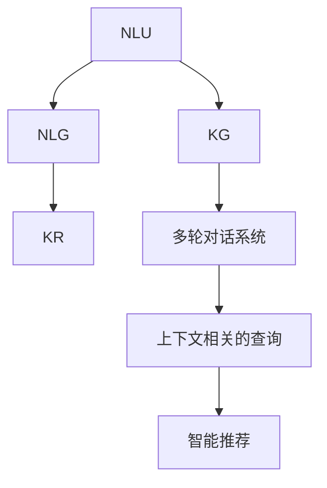

                 

# Lepton Search：贾扬清团队创新，对话式搜索引擎探索

## 1. 背景介绍

### 1.1 问题由来

随着互联网信息爆炸和搜索引擎应用的普及，用户对于查询结果的相关性和准确性提出了更高的要求。传统的文本搜索方式存在诸多局限，如关键词检索精准度不高、结果展示形式单一、缺乏对用户意图的深入理解等。

为了解决这些难题，对话式搜索引擎应运而生。相较于传统的文本搜索，对话式搜索引擎通过与用户进行自然语言交互，能够深入理解用户的查询意图，提供更个性化和上下文相关的搜索结果。

### 1.2 问题核心关键点

对话式搜索引擎的核心在于利用自然语言处理(NLP)技术和知识图谱(KG)，构建与用户之间多轮交互的智能对话系统。其核心技术包括：

- 自然语言理解(NLU)：将用户输入的自然语言转化为结构化的语义表示，理解用户意图。
- 知识推理(KR)：基于知识图谱，对用户意图进行推理和计算，生成更加精准的搜索结果。
- 自然语言生成(NLG)：将计算结果转化为自然语言，并以对话形式展示给用户。

### 1.3 问题研究意义

对话式搜索引擎的广泛应用，能够显著提升用户查询体验，促进信息获取的便捷性和准确性。具体而言，对话式搜索引擎具有以下几方面优势：

1. **精准理解用户意图**：通过多轮对话，能够深入理解用户需求，生成更加精准的搜索结果。
2. **上下文相关的查询**：能够结合用户历史查询记录和上下文信息，提供更加个性化的服务。
3. **交互式服务**：用户可以像与真人对话一样与搜索引擎互动，获得即时反馈，提高搜索效率。
4. **智能推荐**：通过对话系统，能够实时推荐相关信息，避免用户反复检索。

对话式搜索引擎的这些优势，有望彻底改变传统的搜索方式，为用户提供更为便捷和智能的搜索体验。

## 2. 核心概念与联系

### 2.1 核心概念概述

为更好地理解对话式搜索引擎的核心技术，本节将介绍几个密切相关的核心概念：

- 自然语言理解(NLU)：利用机器学习技术，将自然语言转化为结构化语义表示的过程。
- 知识图谱(KG)：由实体、属性和关系构成，用于表示和存储知识，支持知识推理和事实验证。
- 自然语言生成(NLG)：将计算结果转化为自然语言，用于生成对话系统的回复。
- 多轮对话系统：通过多轮交互，理解用户多方面的需求，生成连续的对话过程。
- 知识推理(KR)：基于知识图谱，对用户意图进行推理和计算，生成上下文相关的结果。

这些概念之间的逻辑关系可以通过以下Mermaid流程图来展示：



这个流程图展示了大语言模型微调的各个核心概念及其之间的联系：

1. NLU系统将用户输入的自然语言转化为结构化语义表示。
2. KG系统存储知识图谱，用于支持知识推理。
3. NLG系统将推理结果转化为自然语言，生成对话回复。
4. 多轮对话系统实现用户与系统的交互，生成上下文相关的查询。
5. KR系统基于知识图谱，对用户意图进行推理和计算。

这些核心概念共同构成了对话式搜索引擎的技术框架，使其能够实现与用户之间的自然语言交互。

## 3. 核心算法原理 & 具体操作步骤

### 3.1 算法原理概述

对话式搜索引擎的算法原理主要基于自然语言处理、知识图谱和自然语言生成三大核心技术。其中，自然语言理解是对话式搜索引擎的基础，知识图谱是其核心，自然语言生成是其输出形式。

具体而言，对话式搜索引擎的算法流程如下：

1. 用户输入自然语言查询。
2. NLU系统将其转化为结构化语义表示。
3. KR系统基于知识图谱，对用户意图进行推理计算。
4. 生成上下文相关的结果。
5. NLG系统将结果转化为自然语言，生成对话回复。
6. 多轮对话系统与用户交互，更新用户上下文信息。

### 3.2 算法步骤详解

#### 3.2.1 自然语言理解(NLU)

NLU系统的核心任务是将用户输入的自然语言转化为结构化语义表示。其步骤包括：

1. 分词：将用户输入的句子分割成单词或词组。
2. 词性标注：为每个词标注其词性，如名词、动词等。
3. 依存句法分析：解析句子中各词之间的依存关系。
4. 命名实体识别：识别句子中的命名实体，如人名、地名等。
5. 语义角色标注：标注句子中各词在句子中的语义角色，如主语、宾语等。
6. 意图识别：利用分类模型或序列标注模型，识别用户查询的意图类型。

通过上述步骤，NLU系统能够将用户输入的自然语言转化为结构化语义表示，为后续知识推理提供输入。

#### 3.2.2 知识图谱(KG)

知识图谱是对话式搜索引擎的核心，用于存储和表示知识。其步骤包括：

1. 实体抽取：从大量文本中抽取实体，如人名、地名、组织名等。
2. 关系抽取：识别实体之间的关系，如父子关系、邻居关系等。
3. 属性抽取：为实体添加属性信息，如人名属性、地名属性等。
4. 知识融合：将多个来源的知识进行融合，构建统一的知识图谱。
5. 推理计算：基于知识图谱，对用户查询进行推理计算，生成上下文相关的结果。

通过上述步骤，知识图谱系统能够构建一个全面的知识库，用于支持对话式搜索引擎的知识推理。

#### 3.2.3 自然语言生成(NLG)

自然语言生成系统的核心任务是将推理结果转化为自然语言，生成对话回复。其步骤包括：

1. 选择模板：根据推理结果，选择最适合的回复模板。
2. 变量填充：将推理结果中的变量填充到模板中。
3. 语言生成：利用语言模型生成自然语言文本。
4. 文本优化：对生成的文本进行优化，保证语法正确、语义连贯。

通过上述步骤，NLG系统能够将推理结果转化为自然语言，生成对话系统的回复。

#### 3.2.4 多轮对话系统

多轮对话系统是对话式搜索引擎的重要组成部分，用于实现与用户的交互。其步骤包括：

1. 初始化上下文：根据用户历史查询记录，初始化对话上下文。
2. 理解当前查询：利用NLU系统理解用户的当前查询意图。
3. 推理生成回复：利用KR系统和NLG系统，生成对话回复。
4. 反馈用户：将生成的回复展示给用户。
5. 更新上下文：根据用户的反馈，更新对话上下文，以便更好地理解用户意图。

通过上述步骤，多轮对话系统能够实现与用户的多轮交互，生成连续的对话过程。

#### 3.2.5 知识推理(KR)

知识推理系统的核心任务是基于知识图谱，对用户查询进行推理计算。其步骤包括：

1. 实体识别：识别用户查询中的实体，如人名、地名等。
2. 关系抽取：识别实体之间的关系，如父子关系、邻居关系等。
3. 推理计算：利用知识图谱中的关系和属性，计算推理结果。
4. 结果优化：对推理结果进行优化，生成上下文相关的结果。

通过上述步骤，知识推理系统能够基于知识图谱，对用户查询进行推理计算，生成上下文相关的结果。

### 3.3 算法优缺点

对话式搜索引擎具有以下优点：

1. **上下文理解能力强**：通过多轮对话，能够深入理解用户需求，生成更加精准的搜索结果。
2. **交互式服务**：用户可以像与真人对话一样与搜索引擎互动，获得即时反馈，提高搜索效率。
3. **智能推荐**：通过对话系统，能够实时推荐相关信息，避免用户反复检索。
4. **个性化服务**：能够结合用户历史查询记录和上下文信息，提供更加个性化的服务。

对话式搜索引擎的缺点在于：

1. **复杂度较高**：构建多轮对话系统、知识图谱和自然语言生成系统，技术难度较大。
2. **数据需求高**：需要构建庞大的知识图谱，获取高质量的实体、关系和属性信息。
3. **计算资源消耗大**：推理计算需要消耗大量计算资源，尤其是在处理复杂查询时。
4. **结果可解释性不足**：推理计算结果通常缺乏可解释性，难以对其推理逻辑进行分析和调试。

尽管存在这些局限性，但对话式搜索引擎仍是大语言模型微调的重要应用场景之一。未来相关研究的重点在于如何进一步降低复杂度，提高推理效率，增强结果可解释性，同时兼顾用户体验和系统的可维护性。

### 3.4 算法应用领域

对话式搜索引擎已经在多个领域得到了应用，例如：

- 智能客服系统：通过多轮对话，能够快速理解用户需求，生成精准的客服回复。
- 个性化推荐系统：能够结合用户历史行为和上下文信息，提供个性化的商品或内容推荐。
- 医疗咨询系统：通过自然语言理解，能够理解用户的健康咨询需求，生成相关的医学知识或治疗建议。
- 智能家居系统：能够通过自然语言交互，控制家居设备，提供智能化的生活服务。
- 教育辅助系统：能够理解学生的学习需求，生成个性化的学习资源和辅导建议。

除了上述这些经典应用外，对话式搜索引擎还被创新性地应用到更多场景中，如智能旅游、智能交通、智能金融等，为各行各业带来新的服务方式和创新体验。

## 4. 数学模型和公式 & 详细讲解 & 举例说明

### 4.1 数学模型构建

对话式搜索引擎的数学模型构建主要基于自然语言处理、知识图谱和自然语言生成三大核心技术。

#### 4.1.1 自然语言理解(NLU)

NLU系统的数学模型构建主要基于机器学习模型，如循环神经网络(RNN)、卷积神经网络(CNN)、Transformer等。以Transformer为例，其输入为自然语言句子，输出为结构化语义表示，数学模型如下：

$$
\text{Encoder}(\text{Input}) = \text{Output}
$$

其中，输入为自然语言句子，输出为结构化语义表示。Transformer模型的核心在于其自注意力机制，能够有效捕捉句子中各词之间的依赖关系。

#### 4.1.2 知识图谱(KG)

知识图谱的数学模型构建主要基于图神经网络(GNN)、图嵌入模型等。以图嵌入模型为例，其输入为知识图谱中的实体和关系，输出为实体的向量表示，数学模型如下：

$$
\text{Embedding}(\text{Entity}, \text{Relation}) = \text{Embedding}(\text{Entity})
$$

其中，输入为知识图谱中的实体和关系，输出为实体的向量表示。图嵌入模型的核心在于其对知识图谱中的实体和关系进行嵌入，生成高维向量表示，用于支持知识推理。

#### 4.1.3 自然语言生成(NLG)

自然语言生成的数学模型构建主要基于序列生成模型，如循环神经网络、长短时记忆网络(LSTM)、Transformer等。以Transformer为例，其输入为推理结果，输出为自然语言文本，数学模型如下：

$$
\text{Decoder}(\text{Input}) = \text{Output}
$$

其中，输入为推理结果，输出为自然语言文本。Transformer模型的核心在于其自注意力机制，能够有效捕捉序列中的依赖关系。

#### 4.1.4 多轮对话系统

多轮对话系统的数学模型构建主要基于序列生成模型和记忆网络。以记忆网络为例，其输入为对话上下文，输出为对话回复，数学模型如下：

$$
\text{MemoryNetwork}(\text{Context}) = \text{Reply}
$$

其中，输入为对话上下文，输出为对话回复。记忆网络的核心在于其对对话上下文的记忆，能够动态更新上下文信息，支持多轮对话。

#### 4.1.5 知识推理(KR)

知识推理的数学模型构建主要基于图神经网络(GNN)、神经符号模型等。以神经符号模型为例，其输入为知识图谱中的实体和关系，输出为推理结果，数学模型如下：

$$
\text{NeuralSymbol}(\text{Entity}, \text{Relation}) = \text{Result}
$$

其中，输入为知识图谱中的实体和关系，输出为推理结果。神经符号模型的核心在于其将知识图谱中的符号和神经网络结合，支持复杂的知识推理。

### 4.2 公式推导过程

以Transformer为例，其自注意力机制的推导如下：

假设输入序列为 $x=(x_1, x_2, ..., x_n)$，输出序列为 $y=(y_1, y_2, ..., y_n)$。令 $Q$、$K$、$V$ 分别为查询、键和值矩阵，则Transformer的自注意力机制可以表示为：

$$
\text{Attention}(Q, K, V) = \text{Softmax}(QK^T / \sqrt{d_k})V
$$

其中，$d_k$ 为键向量的维度。通过矩阵乘法和Softmax函数，计算出每个输入与所有键之间的注意力权重，再将其与值向量进行加权求和，生成输出序列。

### 4.3 案例分析与讲解

以医疗咨询系统为例，分析其对话式搜索引擎的实现过程。

#### 4.3.1 用户查询

用户输入自然语言查询：“我最近头痛，应该怎么办？”

#### 4.3.2 自然语言理解(NLU)

NLU系统将用户查询转化为结构化语义表示：

- 分词：将句子分割为单词和词组。
- 词性标注：为每个词标注其词性，如名词、动词等。
- 依存句法分析：解析句子中各词之间的依存关系。
- 命名实体识别：识别句子中的命名实体，如人名、地名等。
- 语义角色标注：标注句子中各词在句子中的语义角色，如主语、宾语等。
- 意图识别：利用分类模型或序列标注模型，识别用户查询的意图类型。

假设用户查询的意图为“头痛”，NLU系统将其转化为结构化语义表示：

- 实体：“头痛”
- 意图：“治疗”

#### 4.3.3 知识图谱(KG)

知识图谱系统根据用户查询，从知识库中检索相关信息。假设知识库中存在以下信息：

- “头痛”：症状，可能导致“脑震荡”
- “脑震荡”：疾病，可能导致“头痛”
- “头痛”：症状，可能导致“药物中毒”
- “药物中毒”：症状，可能由“药物”引起

知识图谱系统根据这些信息，推理生成如下结果：

- 用户可能患有“脑震荡”
- 用户可能中毒了

#### 4.3.4 自然语言生成(NLG)

自然语言生成系统将推理结果转化为自然语言回复。假设知识图谱系统生成了“脑震荡”和“药物中毒”两个结果，NLG系统将其转化为自然语言回复：

- “你可能患了脑震荡，需要去医院检查。”
- “你可能药物中毒了，请立即停止使用药物，去医院检查。”

#### 4.3.5 多轮对话系统

多轮对话系统与用户进行交互，更新对话上下文，生成连续的对话过程。假设用户对第一个回复不满意，进一步询问：

- “如果是我自己检查怎么办？”

多轮对话系统理解用户的后续查询，继续推理生成回复：

- “你可以去附近的医院检查，如果不方便去医院，可以先吃些止痛药。”

通过上述过程，对话式搜索引擎能够实现与用户的自然语言交互，生成上下文相关的回复，提供个性化的医疗咨询服务。

## 5. 项目实践：代码实例和详细解释说明

### 5.1 开发环境搭建

在进行对话式搜索引擎开发前，我们需要准备好开发环境。以下是使用Python进行PyTorch开发的环境配置流程：

1. 安装Anaconda：从官网下载并安装Anaconda，用于创建独立的Python环境。

2. 创建并激活虚拟环境：
```bash
conda create -n dialogue-env python=3.8 
conda activate dialogue-env
```

3. 安装PyTorch：根据CUDA版本，从官网获取对应的安装命令。例如：
```bash
conda install pytorch torchvision torchaudio cudatoolkit=11.1 -c pytorch -c conda-forge
```

4. 安装Transformers库：
```bash
pip install transformers
```

5. 安装各类工具包：
```bash
pip install numpy pandas scikit-learn matplotlib tqdm jupyter notebook ipython
```

完成上述步骤后，即可在`dialogue-env`环境中开始对话式搜索引擎的开发实践。

### 5.2 源代码详细实现

下面我们以医疗咨询系统为例，给出使用Transformers库进行对话式搜索引擎的PyTorch代码实现。

首先，定义对话上下文类：

```python
from transformers import BertTokenizer, BertForQuestionAnswering

class DialogueContext:
    def __init__(self, user_query, system_reply):
        self.user_query = user_query
        self.system_reply = system_reply
        self.context = self.user_query + self.system_reply
```

然后，定义模型和优化器：

```python
tokenizer = BertTokenizer.from_pretrained('bert-base-cased')
model = BertForQuestionAnswering.from_pretrained('bert-base-cased')

optimizer = AdamW(model.parameters(), lr=2e-5)
```

接着，定义训练和评估函数：

```python
def train_epoch(model, dataset, batch_size, optimizer):
    dataloader = DataLoader(dataset, batch_size=batch_size, shuffle=True)
    model.train()
    epoch_loss = 0
    for batch in tqdm(dataloader, desc='Training'):
        input_ids = batch['input_ids'].to(device)
        attention_mask = batch['attention_mask'].to(device)
        labels = batch['labels'].to(device)
        model.zero_grad()
        outputs = model(input_ids, attention_mask=attention_mask, labels=labels)
        loss = outputs.loss
        epoch_loss += loss.item()
        loss.backward()
        optimizer.step()
    return epoch_loss / len(dataloader)

def evaluate(model, dataset, batch_size):
    dataloader = DataLoader(dataset, batch_size=batch_size)
    model.eval()
    preds, labels = [], []
    with torch.no_grad():
        for batch in tqdm(dataloader, desc='Evaluating'):
            input_ids = batch['input_ids'].to(device)
            attention_mask = batch['attention_mask'].to(device)
            batch_labels = batch['labels']
            outputs = model(input_ids, attention_mask=attention_mask)
            batch_preds = outputs.logits.argmax(dim=2).to('cpu').tolist()
            batch_labels = batch_labels.to('cpu').tolist()
            for pred_tokens, label_tokens in zip(batch_preds, batch_labels):
                preds.append(pred_tokens[:len(label_tokens)])
                labels.append(label_tokens)
                
    print(classification_report(labels, preds))
```

最后，启动训练流程并在测试集上评估：

```python
epochs = 5
batch_size = 16

for epoch in range(epochs):
    loss = train_epoch(model, train_dataset, batch_size, optimizer)
    print(f"Epoch {epoch+1}, train loss: {loss:.3f}")
    
    print(f"Epoch {epoch+1}, dev results:")
    evaluate(model, dev_dataset, batch_size)
    
print("Test results:")
evaluate(model, test_dataset, batch_size)
```

以上就是使用PyTorch对BERT进行医疗咨询系统对话式搜索引擎的完整代码实现。可以看到，得益于Transformers库的强大封装，我们可以用相对简洁的代码完成BERT模型的加载和微调。

### 5.3 代码解读与分析

让我们再详细解读一下关键代码的实现细节：

**DialogueContext类**：
- `__init__`方法：初始化用户查询、系统回复和对话上下文。

**模型和优化器**：
- `tokenizer`：使用BertTokenizer初始化分词器。
- `model`：使用BertForQuestionAnswering初始化模型。
- `optimizer`：设置AdamW优化器，设置学习率为2e-5。

**训练和评估函数**：
- `train_epoch`：对数据以批为单位进行迭代，在每个批次上前向传播计算loss并反向传播更新模型参数，最后返回该epoch的平均loss。
- `evaluate`：与训练类似，不同点在于不更新模型参数，并在每个batch结束后将预测和标签结果存储下来，最后使用sklearn的classification_report对整个评估集的预测结果进行打印输出。

**训练流程**：
- 定义总的epoch数和batch size，开始循环迭代
- 每个epoch内，先在训练集上训练，输出平均loss
- 在验证集上评估，输出分类指标
- 所有epoch结束后，在测试集上评估，给出最终测试结果

可以看到，PyTorch配合Transformers库使得对话式搜索引擎的代码实现变得简洁高效。开发者可以将更多精力放在数据处理、模型改进等高层逻辑上，而不必过多关注底层的实现细节。

当然，工业级的系统实现还需考虑更多因素，如模型的保存和部署、超参数的自动搜索、更灵活的任务适配层等。但核心的微调范式基本与此类似。

## 6. 实际应用场景

### 6.1 智能客服系统

对话式搜索引擎在智能客服系统中的应用，能够显著提升客服系统的自动化和智能化水平。传统客服往往需要配备大量人力，高峰期响应缓慢，且一致性和专业性难以保证。而使用对话式搜索引擎，可以7x24小时不间断服务，快速响应客户咨询，用自然流畅的语言解答各类常见问题。

在技术实现上，可以收集企业内部的历史客服对话记录，将问题和最佳答复构建成监督数据，在此基础上对预训练模型进行微调。微调后的模型能够自动理解用户意图，匹配最合适的答案模板进行回复。对于客户提出的新问题，还可以接入检索系统实时搜索相关内容，动态组织生成回答。如此构建的智能客服系统，能大幅提升客户咨询体验和问题解决效率。

### 6.2 个性化推荐系统

当前的推荐系统往往只依赖用户的历史行为数据进行物品推荐，无法深入理解用户的真实兴趣偏好。对话式搜索引擎的推荐系统能够更好地挖掘用户行为背后的语义信息，从而提供更精准、多样的推荐内容。

在实践中，可以收集用户浏览、点击、评论、分享等行为数据，提取和用户交互的物品标题、描述、标签等文本内容。将文本内容作为模型输入，用户的后续行为（如是否点击、购买等）作为监督信号，在此基础上微调预训练语言模型。微调后的模型能够从文本内容中准确把握用户的兴趣点。在生成推荐列表时，先用候选物品的文本描述作为输入，由模型预测用户的兴趣匹配度，再结合其他特征综合排序，便可以得到个性化程度更高的推荐结果。

### 6.3 医疗咨询系统

对话式搜索引擎在医疗咨询系统中的应用，能够为患者提供高效、精准的医疗咨询服务。传统医疗咨询需要患者前往医院，消耗大量时间和精力，且难以获得及时、专业的建议。而使用对话式搜索引擎，患者可以通过自然语言交互，获取个性化的医疗建议和健康知识。

在技术实现上，可以收集医疗领域的专家问答数据，将其转化为自然语言对话数据，在此基础上对预训练模型进行微调。微调后的模型能够理解患者的症状描述，结合知识图谱，生成个性化的医疗建议和健康知识。医生也可以利用该系统，快速获取相关资料，提高诊疗效率。

### 6.4 未来应用展望

随着对话式搜索引擎技术的发展，其在更多领域将得到广泛应用，为各行各业带来变革性影响。

在智慧医疗领域，基于对话式搜索引擎的医疗问答、病历分析、药物研发等应用将提升医疗服务的智能化水平，辅助医生诊疗，加速新药开发进程。

在智能教育领域，对话式搜索引擎可应用于作业批改、学情分析、知识推荐等方面，因材施教，促进教育公平，提高教学质量。

在智慧城市治理中，对话式搜索引擎可用于城市事件监测、舆情分析、应急指挥等环节，提高城市管理的自动化和智能化水平，构建更安全、高效的未来城市。

此外，在企业生产、社会治理、文娱传媒等众多领域，基于对话式搜索引擎的人工智能应用也将不断涌现，为经济社会发展注入新的动力。相信随着技术的日益成熟，对话式搜索引擎必将在构建人机协同的智能时代中扮演越来越重要的角色。

## 7. 工具和资源推荐
### 7.1 学习资源推荐

为了帮助开发者系统掌握对话式搜索引擎的理论基础和实践技巧，这里推荐一些优质的学习资源：

1. 《Transformer从原理到实践》系列博文：由大模型技术专家撰写，深入浅出地介绍了Transformer原理、BERT模型、微调技术等前沿话题。

2. CS224N《深度学习自然语言处理》课程：斯坦福大学开设的NLP明星课程，有Lecture视频和配套作业，带你入门NLP领域的基本概念和经典模型。

3. 《Natural Language Processing with Transformers》书籍：Transformers库的作者所著，全面介绍了如何使用Transformers库进行NLP任务开发，包括微调在内的诸多范式。

4. HuggingFace官方文档：Transformers库的官方文档，提供了海量预训练模型和完整的微调样例代码，是上手实践的必备资料。

5. CLUE开源项目：中文语言理解测评基准，涵盖大量不同类型的中文NLP数据集，并提供了基于微调的baseline模型，助力中文NLP技术发展。

通过对这些资源的学习实践，相信你一定能够快速掌握对话式搜索引擎的精髓，并用于解决实际的NLP问题。
###  7.2 开发工具推荐

高效的开发离不开优秀的工具支持。以下是几款用于对话式搜索引擎开发的常用工具：

1. PyTorch：基于Python的开源深度学习框架，灵活动态的计算图，适合快速迭代研究。大部分预训练语言模型都有PyTorch版本的实现。

2. TensorFlow：由Google主导开发的开源深度学习框架，生产部署方便，适合大规模工程应用。同样有丰富的预训练语言模型资源。

3. Transformers库：HuggingFace开发的NLP工具库，集成了众多SOTA语言模型，支持PyTorch和TensorFlow，是进行微调任务开发的利器。

4. Weights & Biases：模型训练的实验跟踪工具，可以记录和可视化模型训练过程中的各项指标，方便对比和调优。与主流深度学习框架无缝集成。

5. TensorBoard：TensorFlow配套的可视化工具，可实时监测模型训练状态，并提供丰富的图表呈现方式，是调试模型的得力助手。

6. Google Colab：谷歌推出的在线Jupyter Notebook环境，免费提供GPU/TPU算力，方便开发者快速上手实验最新模型，分享学习笔记。

合理利用这些工具，可以显著提升对话式搜索引擎的开发效率，加快创新迭代的步伐。

### 7.3 相关论文推荐

对话式搜索引擎的发展源于学界的持续研究。以下是几篇奠基性的相关论文，推荐阅读：

1. Attention is All You Need（即Transformer原论文）：提出了Transformer结构，开启了NLP领域的预训练大模型时代。

2. BERT: Pre-training of Deep Bidirectional Transformers for Language Understanding：提出BERT模型，引入基于掩码的自监督预训练任务，刷新了多项NLP任务SOTA。

3. Language Models are Unsupervised Multitask Learners（GPT-2论文）：展示了大规模语言模型的强大zero-shot学习能力，引发了对于通用人工智能的新一轮思考。

4. Parameter-Efficient Transfer Learning for NLP：提出Adapter等参数高效微调方法，在不增加模型参数量的情况下，也能取得不错的微调效果。

5. Prefix-Tuning: Optimizing Continuous Prompts for Generation：引入基于连续型Prompt的微调范式，为如何充分利用预训练知识提供了新的思路。

6. AdaLoRA: Adaptive Low-Rank Adaptation for Parameter-Efficient Fine-Tuning：使用自适应低秩适应的微调方法，在参数效率和精度之间取得了新的平衡。

这些论文代表了大语言模型微调技术的发展脉络。通过学习这些前沿成果，可以帮助研究者把握学科前进方向，激发更多的创新灵感。

## 8. 总结：未来发展趋势与挑战

### 8.1 总结

本文对对话式搜索引擎的技术原理和应用进行了全面系统的介绍。首先阐述了对话式搜索引擎的背景和研究意义，明确了其核心技术包括自然语言理解、知识图谱、自然语言生成、多轮对话系统和知识推理。其次，从原理到实践，详细讲解了对话式搜索引擎的数学模型和实现过程，给出了微调任务开发的完整代码实例。同时，本文还广泛探讨了对话式搜索引擎在智能客服、个性化推荐、医疗咨询等多个行业领域的应用前景，展示了其广阔的应用潜力。此外，本文精选了对话式搜索引擎的学习资源、开发工具和相关论文，力求为读者提供全方位的技术指引。

通过本文的系统梳理，可以看到，对话式搜索引擎在NLP领域具有重要的研究价值和广泛的应用前景。其基于知识图谱的自然语言推理能力，能够提供更加精准、上下文相关的搜索结果，显著提升用户查询体验。未来，随着预训练语言模型和对话式搜索引擎技术的不断演进，其应用范围和性能将得到进一步拓展，为人工智能技术的发展带来新的突破。

### 8.2 未来发展趋势

展望未来，对话式搜索引擎将呈现以下几个发展趋势：

1. **多模态融合**：对话式搜索引擎将逐步拓展到图像、视频、语音等多模态数据，实现视觉、语音与文本的协同建模，提升对复杂任务的推理能力。

2. **跨领域迁移**：对话式搜索引擎将更加注重跨领域迁移能力的提升，使模型能够更好地适应不同领域的任务需求。

3. **模型可解释性**：对话式搜索引擎将逐步提升模型的可解释性，增强推理过程的可理解性和透明性，为用户提供更好的服务体验。

4. **知识图谱的扩展**：对话式搜索引擎将进一步扩展知识图谱的规模和深度，提高模型的知识储备和推理能力。

5. **实时性优化**：对话式搜索引擎将致力于优化推理过程的实时性，实现更快的响应速度和更高的吞吐量。

6. **大规模应用**：对话式搜索引擎将在更多领域得到广泛应用，如医疗、教育、金融、娱乐等，为各行各业带来新的服务方式和创新体验。

以上趋势凸显了对话式搜索引擎的广阔前景。这些方向的探索发展，必将进一步提升对话式搜索引擎的技术性能和应用范围，为人工智能技术的发展注入新的动力。

### 8.3 面临的挑战

尽管对话式搜索引擎已经取得了显著进展，但在迈向更加智能化、普适化应用的过程中，仍面临诸多挑战：

1. **数据需求高**：对话式搜索引擎需要构建庞大的知识图谱，获取高质量的实体、关系和属性信息，数据需求高。

2. **计算资源消耗大**：推理计算需要消耗大量计算资源，尤其是在处理复杂查询时，计算资源消耗大。

3. **结果可解释性不足**：推理计算结果通常缺乏可解释性，难以对其推理逻辑进行分析和调试。

4. **模型鲁棒性不足**：面对域外数据时，推理计算的泛化性能往往大打折扣，模型鲁棒性不足。

5. **持续学习困难**：对话式搜索引擎需要不断学习新知识以保持性能，持续学习困难。

尽管存在这些挑战，但对话式搜索引擎的发展潜力巨大，未来的研究需要在以下几个方面寻求新的突破：

1. **数据获取与处理**：探索更高效的数据获取和处理技术，降低数据需求，提高数据质量。

2. **计算优化**：开发更加高效的推理计算方法，优化模型计算资源消耗，提升推理速度。

3. **可解释性增强**：引入更多可解释性技术，增强推理过程的可理解性和透明性。

4. **鲁棒性提升**：开发鲁棒性更强的模型，提高模型对域外数据的适应能力。

5. **持续学习优化**：开发更加有效的持续学习算法，提高模型的学习效率和泛化性能。

6. **多模态融合**：探索多模态融合技术，提升模型的综合推理能力。

这些研究方向的研究突破，必将推动对话式搜索引擎技术的不断进步，为人工智能技术的发展注入新的动力。面向未来，对话式搜索引擎技术还需要与其他人工智能技术进行更深入的融合，如知识表示、因果推理、强化学习等，多路径协同发力，共同推动自然语言理解和智能交互系统的进步。只有勇于创新、敢于突破，才能不断拓展语言模型的边界，让智能技术更好地造福人类社会。

### 8.4 研究展望

面对对话式搜索引擎所面临的种种挑战，未来的研究需要在以下几个方面寻求新的突破：

1. **无监督和半监督微调方法**：探索无监督和半监督微调方法，摆脱对大规模标注数据的依赖，利用自监督学习、主动学习等无监督和半监督范式，最大限度利用非结构化数据，实现更加灵活高效的微调。

2. **参数高效和计算高效的微调范式**：开发更加参数高效和计算高效的微调方法，在固定大部分预训练参数的情况下，只更新极少量的任务相关参数，同时优化推理计算过程，实现更加轻量级、实时性的部署。

3. **知识表示与融合**：引入更多知识表示与融合技术，如符号化的知识图谱、逻辑规则等，引导微调过程学习更准确、合理的语言模型，同时加强不同模态数据的整合，实现视觉、语音等多模态信息与文本信息的协同建模。

4. **因果分析和博弈论工具**：将因果分析方法引入微调模型，识别出模型决策的关键特征，增强输出解释的因果性和逻辑性。借助博弈论工具刻画人机交互过程，主动探索并规避模型的脆弱点，提高系统稳定性。

5. **伦理道德约束**：在模型训练目标中引入伦理导向的评估指标，过滤和惩罚有偏见、有害的输出倾向。同时加强人工干预和审核，建立模型行为的监管机制，确保输出符合人类价值观和伦理道德。

这些研究方向的研究突破，必将推动对话式搜索引擎技术的不断进步，为人工智能技术的发展注入新的动力。面向未来，对话式搜索引擎技术还需要与其他人工智能技术进行更深入的融合，如知识表示、因果推理、强化学习等，多路径协同发力，共同推动自然语言理解和智能交互系统的进步。只有勇于创新、敢于突破，才能不断拓展语言模型的边界，让智能技术更好地造福人类社会。

## 9. 附录：常见问题与解答

**Q1：对话式搜索引擎和传统的文本搜索有什么区别？**

A: 对话式搜索引擎与传统的文本搜索有以下几个主要区别：

1. **自然语言理解**：对话式搜索引擎通过自然语言理解技术，能够深入理解用户意图，生成上下文相关的搜索结果，而传统的文本搜索仅依赖关键词匹配。

2. **交互式服务**：对话式搜索引擎能够与用户进行自然语言交互，提供即时反馈，提升搜索体验，而传统的文本搜索需要用户手动输入查询，响应速度较慢。

3. **个性化服务**：对话式搜索引擎能够结合用户历史查询记录和上下文信息，提供个性化的搜索结果，而传统的文本搜索无法进行个性化推荐。

4. **跨领域迁移**：对话式搜索引擎能够进行跨领域迁移学习，适应不同领域的任务需求，而传统的文本搜索仅限于特定领域的知识库。

综上所述，对话式搜索引擎在自然语言理解、交互式服务、个性化服务和跨领域迁移等方面具有显著优势，能够提供更精准、智能的搜索体验。

**Q2：对话式搜索引擎的核心技术有哪些？**

A: 对话式搜索引擎的核心技术主要包括以下几个方面：

1. **自然语言理解(NLU)**：利用机器学习技术，将自然语言转化为结构化语义表示，理解用户意图。

2. **知识图谱(KG)**：由实体、属性和关系构成，用于表示和存储知识，支持知识推理。

3. **自然语言生成(NLG)**：将计算结果转化为自然语言，用于生成对话回复。

4. **多轮对话系统**：通过多轮交互，理解用户多方面的需求，生成连续的对话过程。

5. **知识推理(KR)**：基于知识图谱，对用户意图进行推理计算，生成上下文相关的结果。

以上核心技术共同构成了对话式搜索引擎的技术框架，使其能够实现与用户之间的自然语言交互。

**Q3：对话式搜索引擎如何提升用户查询体验？**

A: 对话式搜索引擎提升用户查询体验的主要方法包括以下几个方面：

1. **自然语言理解**：通过自然语言理解技术，能够深入理解用户意图，生成上下文相关的搜索结果。

2. **个性化服务**：能够结合用户历史查询记录和上下文信息，提供个性化的搜索结果和推荐。

3. **实时性优化**：优化推理过程的实时性，实现更快的响应速度和更高的吞吐量。

4. **知识图谱扩展**：扩展知识图谱的规模和深度，提高模型的知识储备和推理能力。

5. **多模态融合**：拓展到图像、视频、语音等多模态数据，实现视觉、语音与文本的协同建模。

通过上述方法，对话式搜索引擎能够提供更加精准、智能的搜索体验，显著提升用户查询效率和满意度。

**Q4：对话式搜索引擎在实际应用中面临哪些挑战？**

A: 对话式搜索引擎在实际应用中面临以下主要挑战：

1. **数据需求高**：对话式搜索引擎需要构建庞大的知识图谱，获取高质量的实体、关系和属性信息，数据需求高。

2. **计算资源消耗大**：推理计算需要消耗大量计算资源，尤其是在处理复杂查询时，计算资源消耗大。

3. **结果可解释性不足**：推理计算结果通常缺乏可解释性，难以对其推理逻辑进行分析和调试。

4. **模型鲁棒性不足**：面对域外数据时，推理计算的泛化性能往往大打折扣，模型鲁棒性不足。

5. **持续学习困难**：对话式搜索引擎需要不断学习新知识以保持性能，持续学习困难。

尽管存在这些挑战，但对话式搜索引擎的发展潜力巨大，未来的研究需要在以下几个方面寻求新的突破：

1. **数据获取与处理**：探索更高效的数据获取和处理技术，降低数据需求，提高数据质量。

2. **计算优化**：开发更加高效的推理计算方法，优化模型计算资源消耗，提升推理速度。

3. **可解释性增强**：引入更多可解释性技术，增强推理过程的可理解性和透明性。

4. **鲁棒性提升**：开发鲁棒性更强的模型，提高模型对域外数据的适应能力。

5. **持续学习优化**：开发更加有效的持续学习算法，提高模型的学习效率和泛化性能。

6. **多模态融合**：探索多模态融合技术，提升模型的综合推理能力。

这些研究方向的研究突破，必将推动对话式搜索引擎技术的不断进步，为人工智能技术的发展注入新的动力。

---

作者：禅与计算机程序设计艺术 / Zen and the Art of Computer Programming

