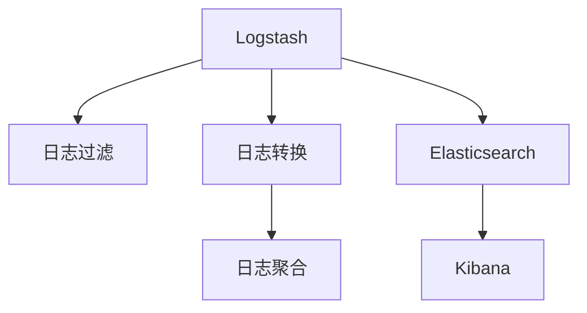

                 

# Logstash日志过滤与转换

## 1. 背景介绍

在现代信息系统中，日志文件扮演着至关重要的角色。它们不仅记录了系统运行的过程，还为问题诊断、性能优化、安全审计等提供重要依据。然而，日志数据量庞大且格式多样，未经处理的日志文件难以直接用于分析，需要借助专业的日志处理工具进行过滤、转换、聚合等操作。

### 1.1 问题由来

随着IT基础设施的日益复杂，日志文件数量呈指数级增长，处理难度不断加大。对于大型企业而言，每天生成的日志数据可能达到TB级别，其中包含大量重复、无用信息，亟需过滤与转换才能提取有价值的内容。此外，日志文件格式各异，不同系统生成的日志格式互不兼容，也需要统一转换为标准格式以便分析。

### 1.2 问题核心关键点

日志处理的核心关键点在于高效地过滤和转换日志数据。具体而言：

1. **数据过滤**：去除无用日志，保留有价值信息。
2. **数据转换**：统一日志格式，使其适应分析工具。
3. **数据聚合**：对日志进行统计分析，发现系统行为模式。

### 1.3 问题研究意义

有效处理日志数据能够提升系统的可用性、性能和安全水平。具体来说：

1. **问题诊断**：快速定位系统异常，减少宕机时间。
2. **性能优化**：分析日志性能瓶颈，提升系统效率。
3. **安全审计**：监测系统安全事件，及时响应安全威胁。
4. **合规管理**：确保日志符合法规要求，降低合规风险。
5. **用户体验**：提升用户服务质量，优化客户体验。

## 2. 核心概念与联系

### 2.1 核心概念概述

为更好地理解Logstash在日志处理中的作用，本节将介绍几个关键概念：

- **Logstash**：Apache Software Foundation开源的日志处理工具，支持多种输入输出插件，能够高效处理和转换日志数据。
- **日志过滤**：从原始日志中筛选出有用信息的过程，包括去除噪声、剔除重复记录等。
- **日志转换**：将不同格式的日志数据转换为统一格式，如从JSON转换为CSV。
- **日志聚合**：对日志数据进行统计分析，如计算日志数量、平均响应时间等。
- **Elasticsearch**：一个分布式搜索与分析引擎，可以存储和检索大规模日志数据。
- **Kibana**：基于Elasticsearch的可视化工具，支持日志数据的图表展示和仪表盘创建。

这些概念之间的联系可以通过以下Mermaid流程图来展示：



这个流程图展示了几类关键操作的流程：

1. Logstash对日志数据进行过滤和转换，并将其发送至Elasticsearch。
2. Elasticsearch存储和管理日志数据，支持快速的全文搜索和聚合查询。
3. Kibana从Elasticsearch中读取日志数据，进行可视化展示和分析。

## 3. 核心算法原理 & 具体操作步骤

### 3.1 算法原理概述

Logstash的核心算法原理主要基于管道流数据处理模型。其核心流程如下：

1. **数据输入**：通过插件从各种日志源（如系统日志、应用程序日志）读取日志数据。
2. **数据过滤**：使用插件（如grok、filter）对日志数据进行过滤和清理。
3. **数据转换**：使用插件（如json2csv、json2xml）对日志数据进行格式转换，使其适应不同的分析工具。
4. **数据存储**：将处理后的日志数据存储至Elasticsearch，方便后续查询和分析。

### 3.2 算法步骤详解

Logstash的主要操作步骤包括：

**Step 1: 安装与配置**
- 在系统中安装Logstash。
- 配置input、filter、output插件，指定日志源、过滤规则和目标存储。

**Step 2: 数据输入与过滤**
- 通过input插件从日志源读取数据，如syslog、file、http等。
- 使用filter插件对数据进行初步过滤和处理，如去除无用字段、匹配正则表达式等。

**Step 3: 数据转换**
- 使用output插件对数据进行格式转换，如将JSON格式转换为CSV、XML等。
- 使用插件（如multilines、stringmanip）对数据进行进一步的清理和处理。

**Step 4: 数据存储与分析**
- 通过output插件将处理后的日志数据存储至Elasticsearch。
- 使用Elasticsearch的API和Kibana工具对日志数据进行查询和可视化分析。

### 3.3 算法优缺点

Logstash作为开源的日志处理工具，具有以下优点：

1. **灵活性高**：支持多种输入输出插件，满足不同日志源和目标的需求。
2. **功能强大**：提供丰富的数据过滤、转换和聚合功能，能够满足复杂的日志处理需求。
3. **开源免费**：作为Apache项目，社区支持良好，资源丰富。
4. **社区活跃**：有大量社区贡献的插件和脚本，可以方便地进行功能扩展。

同时，Logstash也存在一些局限性：

1. **性能瓶颈**：当处理大规模日志数据时，Logstash的性能可能受到影响。
2. **学习成本高**：插件配置复杂，需要一定的时间和精力进行学习。
3. **资源占用高**：处理大量日志数据时，可能需要较高的系统资源支持。

尽管存在这些局限性，但Logstash在日志处理领域仍然是主流的工具之一。通过合理的配置和优化，可以充分发挥其优势，提升日志处理效率和质量。

### 3.4 算法应用领域

Logstash在多个领域都得到了广泛应用，包括但不限于：

1. **监控系统**：用于监控服务器、网络设备等系统日志，及时发现和解决性能问题。
2. **应用日志**：用于记录应用程序的日志信息，进行问题诊断和性能优化。
3. **安全审计**：用于记录和分析安全事件日志，提升系统安全性。
4. **数据分析**：用于存储和分析业务日志，进行用户行为分析和营销策略优化。
5. **日志存储**：用于构建分布式日志存储系统，提高日志存储的可靠性和可扩展性。

## 4. 数学模型和公式 & 详细讲解

### 4.1 数学模型构建

Logstash的核心数学模型主要涉及日志数据的过滤和转换。具体来说，Logstash的插件机制允许通过编写脚本来定义过滤和转换规则。

### 4.2 公式推导过程

以一个简单的过滤规则为例，假设我们需要从日志数据中过滤出包含特定关键字的记录。可以使用grok过滤器来实现：

```python
filter {
    grok {
        match => { "message" => "%{my_pattern}" }
    }
}
```

这里，`my_pattern`是一个正则表达式，用于匹配日志中的关键字。通过grok过滤器，Logstash能够将匹配到的记录从日志中提取出来，进行后续处理。

### 4.3 案例分析与讲解

假设我们有一个Web应用的日志文件，包含如下内容：

```
[2019-01-01 10:00:00] INFO: User login from IP 192.168.1.1
[2019-01-01 10:05:00] ERROR: Database connection timeout
[2019-01-01 10:10:00] ERROR: Memory usage exceeded limit
```

我们使用Logstash进行过滤和转换，首先通过grok插件匹配出日志中的关键字段，然后进行格式转换：

```python
input {
    file {
        path => "/var/log/webapp.log"
    }
}

filter {
    grok {
        match => { "message" => "%{time} %{level}: %{body}" }
    }
}

output {
    json2csv {
        record => output
        fields => [ "@timestamp", "level", "message" ]
        headers => [ "timestamp", "level", "message" ]
    }
}
```

通过grok过滤器，我们可以提取出时间、日志级别和具体信息。然后，使用json2csv插件将JSON格式转换为CSV格式，便于后续分析。

## 5. 项目实践：代码实例和详细解释说明

### 5.1 开发环境搭建

在进行Logstash实践前，我们需要准备好开发环境。以下是使用Linux系统搭建Logstash环境的步骤：

1. 安装Logstash：
```bash
wget https://artifacts.elastic.co/downloads/logstash/logstash-8.2.1.tar.gz
tar xvf logstash-8.2.1.tar.gz
cd logstash-8.2.1
```

2. 下载并解压插件：
```bash
cd plugins
wget https://artifacts.elastic.co/downloads/logstash/plugins/8.2.1/grok-8.2.1.zip
unzip grok-8.2.1.zip
```

3. 配置Logstash：
```bash
vi logstash.conf
```

4. 启动Logstash：
```bash
./bin/logstash -f logstash.conf
```

完成上述步骤后，即可在系统中运行Logstash进行日志处理。

### 5.2 源代码详细实现

下面是一个简单的Logstash配置文件示例，用于处理Web服务器的日志文件：

```python
input {
    file {
        path => "/var/log/httpd/access_log"
        start_position => "beginning"
        codec => "json"
    }
}

filter {
    grok {
        match => { "message" => "%{time} %{remote_addr} - %{remote_user} \[(.+)\] \"(.+)\" %{status_code} %{body_size} \"%{referer}\" \"%{user_agent}\"" }
    }
    field {
        name => "ip"
        value => "remote_addr"
    }
    field {
        name => "timestamp"
        value => "@timestamp"
    }
}

output {
    stdout {}
    elasticsearch {
        hosts => ["localhost:9200"]
        index => "access_logs_20230101"
        type => "log"
        document_type => "log"
        bulk => 1000
    }
}
```

在这个配置文件中，我们首先定义了输入源，从日志文件中读取数据。然后，使用grok过滤器进行正则表达式匹配，提取日志的时间、IP地址等信息。最后，将处理后的数据存储到Elasticsearch中，供后续查询和分析。

### 5.3 代码解读与分析

让我们再详细解读一下关键代码的实现细节：

**input部分**：
- `file`插件用于从日志文件中读取数据，`codec`参数指定使用JSON编码。
- `start_position`参数指定从日志文件的开头开始读取。

**filter部分**：
- `grok`插件用于进行正则表达式匹配，提取日志中的关键信息。
- `field`插件用于重命名字段，将`remote_addr`字段重命名为`ip`。

**output部分**：
- `stdout`插件用于将日志数据输出到控制台，方便调试。
- `elasticsearch`插件用于将日志数据存储到Elasticsearch中，`index`和`type`参数指定日志数据的索引和类型。

**配置解释**：
- `index`参数指定日志数据的索引名称，`type`参数指定文档类型，`document_type`参数指定文档类型。
- `bulk`参数指定一次写入的最大文档数，避免网络传输开销过大。

## 6. 实际应用场景

### 6.1 监控系统

Logstash在监控系统中具有广泛应用。例如，在一个云服务提供商的监控系统中，Logstash可以收集并处理来自多个云平台的日志数据，如AWS、Azure、Google Cloud等。通过Logstash的插件机制，可以轻松集成这些平台的日志源，并进行过滤、转换和存储。

**实现思路**：
- 使用Logstash的`syslog`和`log`插件收集不同平台的日志数据。
- 使用grok过滤器进行格式统一，提取出关键信息。
- 使用Elasticsearch进行索引和查询，进行实时监控和报警。
- 使用Kibana进行数据可视化，提供丰富的图表和仪表盘。

### 6.2 应用日志

Logstash在应用日志处理中也发挥重要作用。例如，在一个电商平台的订单系统中，Logstash可以收集并处理订单日志、交易日志、用户行为日志等，用于问题诊断、性能优化和用户行为分析。

**实现思路**：
- 使用Logstash的`file`和`http`插件收集订单日志、交易日志、用户行为日志等。
- 使用grok过滤器进行格式统一，提取出关键信息。
- 使用Elasticsearch进行索引和查询，进行实时监控和报警。
- 使用Kibana进行数据可视化，提供丰富的图表和仪表盘。

### 6.3 安全审计

Logstash在安全审计中同样重要。例如，在一个企业的安全审计系统中，Logstash可以收集并处理各种安全相关日志，如防火墙日志、入侵检测日志、身份认证日志等，用于安全事件监测和响应。

**实现思路**：
- 使用Logstash的`syslog`和`log`插件收集防火墙日志、入侵检测日志、身份认证日志等。
- 使用grok过滤器进行格式统一，提取出关键信息。
- 使用Elasticsearch进行索引和查询，进行实时监控和报警。
- 使用Kibana进行数据可视化，提供丰富的图表和仪表盘。

### 6.4 日志存储

Logstash还可以用于构建分布式日志存储系统。例如，在一个大型企业的日志存储系统中，Logstash可以分布式部署，收集来自各个业务系统的日志数据，并统一存储到Elasticsearch集群中，进行高效管理和查询。

**实现思路**：
- 使用Logstash的`file`和`log`插件收集各个业务系统的日志数据。
- 使用grok过滤器进行格式统一，提取出关键信息。
- 使用Elasticsearch进行索引和查询，进行实时监控和报警。
- 使用Kibana进行数据可视化，提供丰富的图表和仪表盘。

## 7. 工具和资源推荐

### 7.1 学习资源推荐

为了帮助开发者系统掌握Logstash的日志处理能力，这里推荐一些优质的学习资源：

1. **官方文档**：Logstash的官方文档提供了详细的配置和使用指南，是学习Logstash的首选资源。

2. **Elastic Stack官方博客**：Elastic官方博客提供了大量的Logstash、Elasticsearch、Kibana相关教程，覆盖从入门到高级的各个方面。

3. **Pluralsight课程**：Pluralsight提供了多门关于Logstash的课程，涵盖从基础配置到高级应用的各种场景。

4. **Udemy课程**：Udemy上有大量关于Logstash的课程，适合有一定编程基础的开发者学习。

5. **Elastic Stack社区**：Elastic Stack社区是开发者交流和分享经验的平台，提供了大量的插件和脚本，方便进行功能扩展。

通过学习这些资源，相信你一定能够快速掌握Logstash的核心功能和实践技巧，并用于解决实际的日志处理问题。

### 7.2 开发工具推荐

高效的开发离不开优秀的工具支持。以下是几款用于Logstash开发的常用工具：

1. **Logstash官方插件库**：Logstash的官方插件库提供了丰富的插件选择，方便进行功能扩展。
2. **Elasticsearch官方API**：Elasticsearch提供了简单易用的API接口，方便进行数据存储和查询。
3. **Kibana官方插件库**：Kibana的官方插件库提供了丰富的可视化组件，方便进行数据展示和分析。
4. **GrokDebugger**：GrokDebugger是一个用于调试grok过滤器的工具，方便进行正则表达式调试和优化。
5. **Logstash-bulk**：Logstash-bulk是一个用于批量导入Elasticsearch数据的工具，方便进行大批量日志处理。

合理利用这些工具，可以显著提升Logstash的开发效率，加快创新迭代的步伐。

### 7.3 相关论文推荐

Logstash作为日志处理领域的重要工具，相关的研究论文也相当丰富。以下是几篇有代表性的论文，推荐阅读：

1. **Logstash: Continuous Log Processing with Distributed Reliability**：介绍了Logstash的架构设计和核心功能，强调了其分布式处理能力。
2. **Elastic Stack in Action: Logstash, Elasticsearch, Kibana**：介绍了Elastic Stack的整体架构和Logstash的具体应用，提供了丰富的案例和实践经验。
3. **A Survey of Log Management Systems**：对多种日志管理系统的现状进行了综述，包括Logstash、Graylog、Fluentd等，提供了比较和分析。
4. **Logging in Microservices**：讨论了微服务架构下的日志处理问题，提出了基于Logstash的解决方案，涵盖了数据收集、存储和分析的各个环节。
5. **Using Logstash to Process Logs**：介绍了Logstash的基本配置和使用技巧，适合初学者入门。

这些论文代表了Logstash的研究进展和应用实践，通过学习这些前沿成果，可以帮助研究者把握学科前进方向，激发更多的创新灵感。

## 8. 总结：未来发展趋势与挑战

### 8.1 总结

本文对Logstash在日志处理中的应用进行了全面系统的介绍。首先阐述了日志处理的背景和意义，明确了Logstash在数据过滤、转换和存储等方面的核心作用。其次，从原理到实践，详细讲解了Logstash的核心操作流程和具体实现方法。同时，本文还广泛探讨了Logstash在监控系统、应用日志、安全审计等多个场景的应用前景，展示了其在实际应用中的强大能力。

通过本文的系统梳理，可以看到，Logstash作为开源的日志处理工具，凭借其灵活性和功能强大的特点，广泛应用于各种日志场景中。其插件机制和Elasticsearch的集成，使得日志处理变得更加高效和便捷。未来，伴随技术的不断演进，Logstash必将在更广泛的应用领域发挥更大的作用，为信息系统的稳定运行提供可靠保障。

### 8.2 未来发展趋势

展望未来，Logstash在日志处理领域将呈现以下几个发展趋势：

1. **云计算集成**：Logstash将更加深入地集成到云平台中，提供自动化配置和弹性扩展能力。
2. **人工智能融合**：Logstash将引入更多AI技术，如自动特征工程、实时异常检测等，提升日志分析的智能化水平。
3. **数据湖支持**：Logstash将支持更多数据湖平台，如AWS Lake Formation、Azure Data Lake等，提供跨平台的数据处理能力。
4. **实时流处理**：Logstash将支持实时流处理，处理来自传感器、IoT设备等的高频数据，满足更广泛的日志处理需求。
5. **API接口扩展**：Logstash将提供更加丰富和灵活的API接口，支持更多的集成和扩展场景。

### 8.3 面临的挑战

尽管Logstash在日志处理领域取得了重要进展，但在迈向更加智能化、普适化应用的过程中，它仍面临诸多挑战：

1. **性能瓶颈**：当处理大规模日志数据时，Logstash的性能可能受到影响，需要进一步优化算法和配置。
2. **学习成本高**：插件配置复杂，需要一定的时间和精力进行学习，如何降低门槛、简化配置，是未来需要解决的问题。
3. **资源占用高**：处理大量日志数据时，可能需要较高的系统资源支持，如何提升资源利用效率，是未来需要探索的方向。
4. **安全性不足**：Logstash需要在处理敏感数据时保证数据安全，防止数据泄露和滥用。

### 8.4 研究展望

为了解决上述挑战，未来的研究需要在以下几个方面寻求新的突破：

1. **优化算法和配置**：引入高性能算法，提升Logstash在处理大规模数据时的性能表现。
2. **简化配置和部署**：提供更友好的用户界面和配置向导，降低Logstash的入门门槛，提升用户的使用体验。
3. **提高资源利用率**：引入更多优化技术，如分布式处理、批量导入等，提升资源利用效率，降低系统成本。
4. **增强数据安全性**：引入数据加密、访问控制等技术，确保日志数据的安全性和隐私保护。

这些研究方向的探索，必将引领Logstash技术迈向更高的台阶，为构建安全、可靠、高效的信息系统提供坚实的基础。面向未来，Logstash需要在算法、配置、资源利用和安全性等方面进行全面优化，以满足更广泛的日志处理需求。

## 9. 附录：常见问题与解答

**Q1：如何选择合适的Logstash插件？**

A: 选择合适的Logstash插件需要根据具体的需求和数据源进行选择。例如：
- 处理日志文件时，可以选择`file`插件。
- 处理syslog日志时，可以选择`syslog`插件。
- 处理Web请求日志时，可以选择`http`插件。
- 进行正则表达式匹配时，可以选择`grok`插件。
- 进行JSON格式转换时，可以选择`json`插件。

在选择插件时，可以参考官方文档和社区推荐，结合实际需求进行选择。

**Q2：如何提高Logstash的性能？**

A: 提高Logstash的性能可以从以下几个方面入手：
- 使用分布式处理：将日志数据分布式存储和处理，提升处理能力。
- 优化配置参数：调整批量大小、缓存大小、线程数等参数，提升系统性能。
- 使用批量导入：使用`logstash-bulk`工具进行批量导入，减少网络传输开销。
- 引入高性能插件：使用GrokDebugger等工具进行正则表达式优化，提高匹配效率。

通过合理的配置和优化，可以显著提升Logstash的性能，满足更大量的日志处理需求。

**Q3：如何保证Logstash的数据安全性？**

A: 保证Logstash的数据安全性可以从以下几个方面入手：
- 使用数据加密：对敏感数据进行加密，防止数据泄露。
- 配置访问控制：配置日志处理插件的访问权限，防止未授权访问。
- 使用数据脱敏：对日志中的敏感信息进行脱敏处理，保护用户隐私。
- 定期备份数据：定期备份日志数据，防止数据丢失。
- 进行安全审计：定期审计日志处理过程，发现和修复安全漏洞。

通过这些措施，可以确保Logstash在处理敏感数据时，能够保证数据的安全性和隐私保护。

**Q4：Logstash是否支持实时流处理？**

A: 是的，Logstash支持实时流处理。可以使用`beat`插件将日志数据实时采集到Logstash中，然后进行实时处理和存储。例如，可以使用`beats`插件采集来自IoT设备的日志数据，使用`grok`插件进行格式匹配，使用`elasticsearch`插件进行实时存储和查询。

通过实时流处理，Logstash能够处理来自传感器、IoT设备等的高频数据，满足更广泛的日志处理需求。

**Q5：Logstash是否支持多语言支持？**

A: 是的，Logstash支持多语言支持。可以使用`locale`插件对日志数据进行本地化处理，支持多种语言编码和翻译。例如，使用`locale`插件将英文日志转换为中文，方便中文用户进行分析和处理。

通过多语言支持，Logstash能够处理来自不同语言环境的日志数据，提升全球化应用能力。

---

作者：禅与计算机程序设计艺术 / Zen and the Art of Computer Programming

