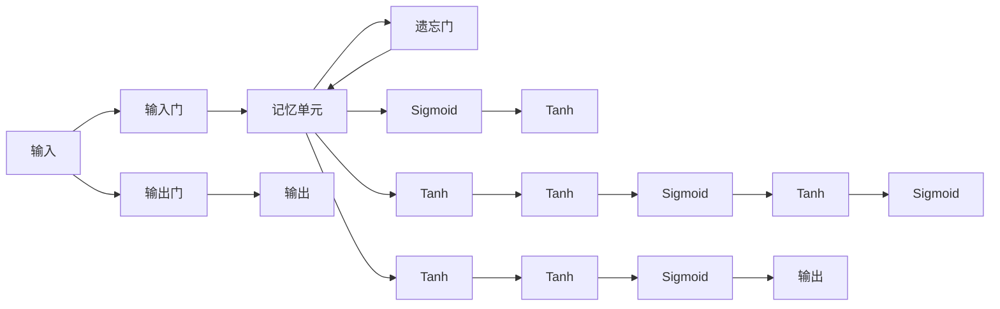

                 

# Long Short-Term Memory (LSTM)原理与代码实例讲解

> 关键词：LSTM, 长短期记忆网络, 神经网络, 循环神经网络, 序列建模, 代码实现

## 1. 背景介绍

### 1.1 问题由来
在深度学习领域，循环神经网络(RNN)因其能够处理序列数据而广受关注。然而，RNN存在梯度消失和梯度爆炸的问题，限制了其在处理长序列时的表现。为解决这一问题，长短期记忆网络（LSTM）被提出，它通过巧妙的门控机制来控制信息的流动，有效地解决了序列建模中的长程依赖问题。

### 1.2 问题核心关键点
LSTM网络的核心在于其记忆单元和门控机制。在LSTM中，每个时间步都有一个记忆单元来保存当前状态信息，并通过三个门控（输入门、遗忘门、输出门）来决定信息的保留和更新。LSTM通过这些门控机制，使得信息可以流动在网络内部，同时也能够遗忘和更新之前的信息。

## 2. 核心概念与联系

### 2.1 核心概念概述

LSTM网络是一种循环神经网络的变种，其核心在于记忆单元和门控机制。以下是LSTM网络的关键概念：

- 记忆单元(Cell State)：用于保存当前状态的信息，类似于RNN的隐藏状态。
- 输入门(Input Gate)：决定当前输入是否加入记忆单元，避免过时信息对当前状态的影响。
- 遗忘门(Forgotten Gate)：决定哪些历史信息应该被遗忘，以保持记忆单元的清洁。
- 输出门(Output Gate)：决定哪些信息可以输出到后续网络层，提供当前状态的预测。
- 门控单元(Gate Unit)：包含Sigmoid和Tanh激活函数，用于生成输入门、遗忘门和输出门的激活值。
- 网络架构：LSTM由多个记忆单元和时间步连接组成，每个时间步都有各自的输入、输出和遗忘门，共同决定当前状态和输出。

### 2.2 核心概念原理和架构的 Mermaid 流程图



这个流程图展示了LSTM网络的基本架构：

1. 输入通过输入门决定加入记忆单元的信息。
2. 遗忘门决定哪些历史信息应该被遗忘。
3. 输出门决定哪些信息可以输出到后续层。
4. 输入门、遗忘门和输出门由Sigmoid和Tanh组成的门控单元生成。

## 3. 核心算法原理 & 具体操作步骤

### 3.1 算法原理概述

LSTM网络的基本算法原理包括以下几个步骤：

1. 输入门：通过输入门单元决定当前输入是否加入记忆单元。
2. 遗忘门：通过遗忘门单元决定哪些历史信息应该被遗忘。
3. 记忆单元更新：记忆单元根据输入和遗忘门生成新的状态信息。
4. 输出门：通过输出门单元决定哪些信息可以输出到后续层。

LSTM的每个时间步都重复上述步骤，以处理序列数据。

### 3.2 算法步骤详解

以下详细讲解LSTM的算法步骤：

1. **输入门**：
   - 输入门单元 $i_t$ 由门控单元生成，计算公式为：
   $$
   i_t = \sigma(W_i x_t + U_i h_{t-1} + b_i)
   $$
   其中 $\sigma$ 为Sigmoid函数，$x_t$ 为当前输入，$h_{t-1}$ 为上一时间步的隐藏状态，$W_i, U_i, b_i$ 为权重和偏置。

2. **遗忘门**：
   - 遗忘门单元 $f_t$ 同样由门控单元生成，计算公式为：
   $$
   f_t = \sigma(W_f x_t + U_f h_{t-1} + b_f)
   $$

3. **记忆单元更新**：
   - 记忆单元 $c_t$ 根据输入门 $i_t$ 和遗忘门 $f_t$ 更新，计算公式为：
   $$
   c_t = f_t \odot c_{t-1} + i_t \odot \tanh(W_c x_t + U_c h_{t-1} + b_c)
   $$
   其中 $\odot$ 表示逐元素乘积，$\tanh$ 为Tanh函数。

4. **输出门**：
   - 输出门单元 $o_t$ 由门控单元生成，计算公式为：
   $$
   o_t = \sigma(W_o x_t + U_o h_{t-1} + b_o)
   $$

5. **隐藏状态**：
   - 隐藏状态 $h_t$ 根据输出门 $o_t$ 和记忆单元 $c_t$ 计算，计算公式为：
   $$
   h_t = o_t \odot \tanh(c_t)
   $$

### 3.3 算法优缺点

LSTM网络具有以下优点：

- 能够处理长序列数据，避免梯度消失和梯度爆炸问题。
- 通过门控机制控制信息的流动，能够保留重要信息并遗忘无关信息。
- 适用于时间序列数据的建模和预测，如语音识别、文本生成等。

同时，LSTM也存在一些缺点：

- 计算复杂度较高，参数较多，训练时间较长。
- 门控单元的设计可能导致梯度消失或梯度爆炸问题，需要精心调参。
- 对噪声敏感，输入数据的微小变化可能导致输出不稳定。

### 3.4 算法应用领域

LSTM网络被广泛应用于以下几个领域：

- 语音识别：通过LSTM网络对音频信号进行建模，实现语音识别和语音合成。
- 自然语言处理：用于文本分类、情感分析、机器翻译等任务，能够捕捉文本中的长程依赖关系。
- 时间序列预测：应用于股票价格预测、气象预测等任务，能够处理时间序列数据并预测未来趋势。
- 图像描述生成：通过LSTM网络对图像特征进行建模，生成图像的描述文字。

## 4. 数学模型和公式 & 详细讲解 & 举例说明

### 4.1 数学模型构建

LSTM网络的数学模型可以表示为：

$$
h_t = o_t \odot \tanh(c_t)
$$

其中 $h_t$ 为当前时间步的隐藏状态，$c_t$ 为记忆单元，$o_t$ 为输出门，$\tanh$ 为Tanh函数。

### 4.2 公式推导过程

LSTM网络的门控单元包括输入门、遗忘门和输出门，其激活函数为Sigmoid和Tanh。输入门的计算公式为：

$$
i_t = \sigma(W_i x_t + U_i h_{t-1} + b_i)
$$

遗忘门的计算公式为：

$$
f_t = \sigma(W_f x_t + U_f h_{t-1} + b_f)
$$

记忆单元的更新公式为：

$$
c_t = f_t \odot c_{t-1} + i_t \odot \tanh(W_c x_t + U_c h_{t-1} + b_c)
$$

输出门的计算公式为：

$$
o_t = \sigma(W_o x_t + U_o h_{t-1} + b_o)
$$

隐藏状态的计算公式为：

$$
h_t = o_t \odot \tanh(c_t)
$$

### 4.3 案例分析与讲解

以下是一个简单的LSTM网络实现案例，用于文本分类任务。

1. **数据准备**：

   假设我们有如下文本数据：

   ```
   "I like to eat pizza"
   "I don't like pizza"
   "I love to eat pasta"
   "I hate pizza"
   ```

   我们可以将每个单词转换为向量表示，并构建一个字典将单词映射到向量索引。

2. **模型定义**：

   定义一个包含一个LSTM层和一个全连接层的简单模型：

   ```python
   import torch
   import torch.nn as nn
   import torch.nn.functional as F

   class LSTMClassifier(nn.Module):
       def __init__(self, input_size, hidden_size, output_size):
           super(LSTMClassifier, self).__init__()
           self.hidden_size = hidden_size
           self.lstm = nn.LSTM(input_size, hidden_size)
           self.fc = nn.Linear(hidden_size, output_size)
           self.softmax = nn.Softmax(dim=1)

       def forward(self, x, (h_0, c_0)):
           h_0, c_0 = h_0, c_0
           out, (h_n, c_n) = self.lstm(x, (h_0, c_0))
           out = self.fc(h_n.view(len(out), -1))
           out = self.softmax(out)
           return out, (h_n, c_n)

       def init_hidden(self):
           return (torch.zeros(1, 1, self.hidden_size), torch.zeros(1, 1, self.hidden_size))
   ```

3. **模型训练**：

   定义损失函数和优化器，并训练模型：

   ```python
   def train(model, train_data, criterion, optimizer, device):
       model.train()
       hidden = model.init_hidden()
       loss_total = 0
       correct_total = 0

       for i, (inputs, labels) in enumerate(train_data):
           inputs, labels = inputs.to(device), labels.to(device)
           optimizer.zero_grad()
           outputs, hidden = model(inputs, hidden)
           loss = criterion(outputs, labels)
           loss.backward()
           optimizer.step()

           loss_total += loss.item()
           _, predicted = torch.max(outputs.data, 1)
           correct_total += (predicted == labels).sum().item()

           if i % 500 == 0:
               print('Epoch: %d/%d - Loss: %.4f - Acc: %.2f%%' %
                     (epoch + 1, epochs, loss_total / (i + 1), 100 * correct_total / (len(train_data) * batch_size)))
   ```

4. **模型评估**：

   定义测试数据集和评估函数，并评估模型：

   ```python
   def evaluate(model, test_data, device):
       model.eval()
       hidden = model.init_hidden()
       correct_total = 0
       with torch.no_grad():
           for i, (inputs, labels) in enumerate(test_data):
               inputs, labels = inputs.to(device), labels.to(device)
               outputs, hidden = model(inputs, hidden)
               _, predicted = torch.max(outputs.data, 1)
               correct_total += (predicted == labels).sum().item()

           print('Test Acc: %.2f%%' % (100 * correct_total / (len(test_data) * batch_size)))
   ```

## 5. 项目实践：代码实例和详细解释说明

### 5.1 开发环境搭建

在搭建LSTM网络的开发环境时，我们需要安装以下Python库：

- `torch`：深度学习框架，提供了LSTM层的实现。
- `torch.nn`：包含各种神经网络层。
- `torch.optim`：包含优化器。
- `torch.utils.data`：用于数据加载和处理。
- `numpy`：用于数组操作。
- `pandas`：用于数据处理。

### 5.2 源代码详细实现

以下是一个简单的LSTM网络实现案例，用于文本分类任务。

1. **数据准备**：

   假设我们有如下文本数据：

   ```
   "I like to eat pizza"
   "I don't like pizza"
   "I love to eat pasta"
   "I hate pizza"
   ```

   我们可以将每个单词转换为向量表示，并构建一个字典将单词映射到向量索引。

2. **模型定义**：

   定义一个包含一个LSTM层和一个全连接层的简单模型：

   ```python
   import torch
   import torch.nn as nn
   import torch.nn.functional as F

   class LSTMClassifier(nn.Module):
       def __init__(self, input_size, hidden_size, output_size):
           super(LSTMClassifier, self).__init__()
           self.hidden_size = hidden_size
           self.lstm = nn.LSTM(input_size, hidden_size)
           self.fc = nn.Linear(hidden_size, output_size)
           self.softmax = nn.Softmax(dim=1)

       def forward(self, x, (h_0, c_0)):
           h_0, c_0 = h_0, c_0
           out, (h_n, c_n) = self.lstm(x, (h_0, c_0))
           out = self.fc(h_n.view(len(out), -1))
           out = self.softmax(out)
           return out, (h_n, c_n)

       def init_hidden(self):
           return (torch.zeros(1, 1, self.hidden_size), torch.zeros(1, 1, self.hidden_size))
   ```

3. **模型训练**：

   定义损失函数和优化器，并训练模型：

   ```python
   def train(model, train_data, criterion, optimizer, device):
       model.train()
       hidden = model.init_hidden()
       loss_total = 0
       correct_total = 0

       for i, (inputs, labels) in enumerate(train_data):
           inputs, labels = inputs.to(device), labels.to(device)
           optimizer.zero_grad()
           outputs, hidden = model(inputs, hidden)
           loss = criterion(outputs, labels)
           loss.backward()
           optimizer.step()

           loss_total += loss.item()
           _, predicted = torch.max(outputs.data, 1)
           correct_total += (predicted == labels).sum().item()

           if i % 500 == 0:
               print('Epoch: %d/%d - Loss: %.4f - Acc: %.2f%%' %
                     (epoch + 1, epochs, loss_total / (i + 1), 100 * correct_total / (len(train_data) * batch_size)))
   ```

4. **模型评估**：

   定义测试数据集和评估函数，并评估模型：

   ```python
   def evaluate(model, test_data, device):
       model.eval()
       hidden = model.init_hidden()
       correct_total = 0
       with torch.no_grad():
           for i, (inputs, labels) in enumerate(test_data):
               inputs, labels = inputs.to(device), labels.to(device)
               outputs, hidden = model(inputs, hidden)
               _, predicted = torch.max(outputs.data, 1)
               correct_total += (predicted == labels).sum().item()

           print('Test Acc: %.2f%%' % (100 * correct_total / (len(test_data) * batch_size)))
   ```

### 5.3 代码解读与分析

让我们再详细解读一下关键代码的实现细节：

**LSTMClassifier类**：
- `__init__`方法：初始化模型参数和LSTM层。
- `forward`方法：前向传播计算输出。
- `init_hidden`方法：初始化隐藏状态。

**train函数**：
- 在训练时，将模型置于训练模式，初始化隐藏状态。
- 对每个批次数据进行前向传播和反向传播，计算损失并更新参数。
- 在每个epoch结束时，打印平均损失和准确率。

**evaluate函数**：
- 在评估时，将模型置于评估模式，初始化隐藏状态。
- 对测试数据集进行前向传播，计算准确率并打印。

## 6. 实际应用场景

### 6.1 智能语音助手

LSTM网络在智能语音助手中被广泛应用。智能语音助手需要能够理解用户的语音输入，并根据输入生成响应。LSTM网络可以用于语音信号的建模，捕捉用户的语音特征，从而提高语音识别的准确率。

### 6.2 股票价格预测

LSTM网络被应用于股票价格预测，通过处理历史股票价格数据，预测未来的价格趋势。LSTM网络能够捕捉时间序列数据中的长程依赖关系，从而提供更准确的预测结果。

### 6.3 自然语言生成

LSTM网络可以用于自然语言生成任务，如机器翻译、文本摘要、对话生成等。通过学习输入文本的语义信息，LSTM网络能够生成与输入相似的文本输出。

### 6.4 未来应用展望

随着深度学习技术的不断发展，LSTM网络将在更多领域得到应用。未来的研究可能会关注以下几个方向：

- 多模态LSTM网络：将LSTM网络与其他深度学习模型结合，如卷积神经网络(CNN)、注意力机制等，用于处理多模态数据。
- 长短记忆注意力网络(LSTM-Attention)：在LSTM网络的基础上引入注意力机制，提高模型对关键信息的关注度。
- 分布式LSTM网络：通过分布式训练和推理，提高LSTM网络的效率和可扩展性。

## 7. 工具和资源推荐

### 7.1 学习资源推荐

为了帮助开发者系统掌握LSTM网络的理论基础和实践技巧，这里推荐一些优质的学习资源：

- 《深度学习》系列书籍：Deep Learning, Ian Goodfellow等著作，涵盖了深度学习的基础知识和LSTM网络等内容。
- 《LSTM网络教程》：LSTM网络的基础知识和实现细节。
- 《TensorFlow官方文档》：包含LSTM网络的详细实现和应用示例。

### 7.2 开发工具推荐

- PyTorch：深度学习框架，提供了LSTM层的实现。
- TensorFlow：深度学习框架，提供了LSTM层的实现。
- Jupyter Notebook：交互式Python编程环境，方便代码调试和展示。

### 7.3 相关论文推荐

LSTM网络的研究涉及多个领域，以下是几篇具有代表性的论文：

- "Long Short-Term Memory"：Hochreiter和Schmidhuber提出LSTM网络，解决RNN的梯度消失和梯度爆炸问题。
- "Learning Phrase Representations using RNN Encoder-Decoder for Statistical Machine Translation"：Cho等人使用LSTM网络进行机器翻译任务，取得了很好的效果。
- "Attention Is All You Need"：Vaswani等人提出Transformer网络，进一步改进了LSTM网络，提高了模型的性能和效率。

## 8. 总结：未来发展趋势与挑战

### 8.1 研究成果总结

LSTM网络在深度学习领域的应用已经取得了显著成效，成为处理序列数据的重要工具。通过门控机制控制信息的流动，LSTM网络能够处理长序列数据，避免梯度消失和梯度爆炸问题，适用于时间序列数据的建模和预测。

### 8.2 未来发展趋势

LSTM网络未来的发展趋势包括：

- 多模态LSTM网络：将LSTM网络与其他深度学习模型结合，处理多模态数据。
- 长短记忆注意力网络(LSTM-Attention)：在LSTM网络的基础上引入注意力机制，提高模型对关键信息的关注度。
- 分布式LSTM网络：通过分布式训练和推理，提高LSTM网络的效率和可扩展性。

### 8.3 面临的挑战

LSTM网络虽然取得了显著的进展，但仍面临一些挑战：

- 计算复杂度高：LSTM网络参数较多，计算复杂度较高，训练时间较长。
- 模型泛化能力有限：LSTM网络在处理长序列数据时，容易过拟合。
- 模型鲁棒性不足：LSTM网络对噪声和输入数据的微小变化敏感，可能导致输出不稳定。

### 8.4 研究展望

未来研究需要在以下几个方面取得突破：

- 模型简化和优化：减少模型参数，提高模型效率。
- 鲁棒性和泛化能力提升：提高模型的泛化能力和鲁棒性，处理复杂的序列数据。
- 多模态数据处理：将LSTM网络与其他深度学习模型结合，处理多模态数据。

## 9. 附录：常见问题与解答

**Q1：LSTM网络与RNN网络的区别是什么？**

A: LSTM网络是RNN网络的一种改进形式，通过引入门控机制，能够更好地处理长序列数据。LSTM网络具有三个门控单元（输入门、遗忘门、输出门），可以控制信息的流动，避免梯度消失和梯度爆炸问题。

**Q2：LSTM网络中的门控单元是如何工作的？**

A: LSTM网络中的门控单元包括输入门、遗忘门和输出门，每个门控单元都包含一个Sigmoid激活函数和一个Tanh激活函数。输入门决定当前输入是否加入记忆单元，遗忘门决定哪些历史信息应该被遗忘，输出门决定哪些信息可以输出到后续层。

**Q3：如何优化LSTM网络？**

A: 优化LSTM网络可以从以下几个方面入手：
1. 减少模型参数：通过剪枝、量化等方法，减少模型参数，提高模型效率。
2. 调整学习率：根据数据分布调整学习率，避免过拟合。
3. 引入正则化：使用L2正则化、Dropout等方法，防止过拟合。
4. 调整超参数：调整隐藏层大小、学习率、批大小等超参数，提高模型性能。

**Q4：LSTM网络在实际应用中需要注意哪些问题？**

A: 在实际应用中，LSTM网络需要注意以下问题：
1. 数据预处理：对输入数据进行归一化、标准化等预处理，提高模型性能。
2. 模型选择：根据任务特点选择合适的LSTM网络架构和超参数。
3. 训练效率：通过分布式训练和模型剪枝等方法，提高模型训练效率。
4. 模型评估：通过交叉验证等方法，评估模型的泛化能力和鲁棒性。

---

作者：禅与计算机程序设计艺术 / Zen and the Art of Computer Programming

