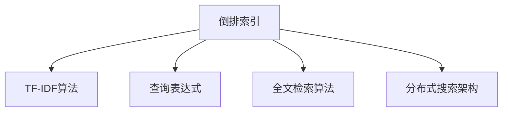

                 

# Lucene搜索原理与代码实例讲解

> 关键词：Lucene, 搜索算法, 倒排索引, 查询优化, 代码实例, 实际应用场景

## 1. 背景介绍

### 1.1 问题由来
在现代信息时代，数据的规模和复杂性不断增加，搜索引擎成为了处理大量信息、实现快速查询的重要工具。Lucene是一款高性能的全文搜索引擎，由Apache基金会开源，广泛应用于企业搜索、Web搜索、文档管理系统等场景中。Lucene提供了强大的搜索算法和索引机制，能够高效处理海量数据，支持复杂查询，满足了各种场景下的搜索需求。

### 1.2 问题核心关键点
Lucene的核心技术包括倒排索引(Inverted Index)、基于词频的TF-IDF算法、查询优化、全文检索算法等。其中，倒排索引是Lucene实现全文检索的基础，能够快速定位到包含特定词的文档。通过合理设计倒排索引和查询表达式， Lucene能够在海量数据中实现高效的查询和检索。

### 1.3 问题研究意义
研究Lucene的搜索原理和代码实现，对于深入理解搜索引擎的工作机制，掌握全文检索技术，提升实际搜索应用的性能和效率，具有重要意义：

1. 提升搜索引擎性能：通过优化Lucene的搜索算法和索引设计，能够在更短时间内完成查询任务，提高用户体验。
2. 实现复杂查询：支持布尔逻辑、通配符、模糊搜索等复杂查询，适应各种实际应用场景的需求。
3. 减少索引存储空间：通过压缩和优化倒排索引，减少索引文件的大小，提高搜索效率和系统稳定性。
4. 增强可扩展性：采用分布式搜索架构，能够快速处理大规模数据，满足企业级搜索系统的需求。

## 2. 核心概念与联系

### 2.1 核心概念概述

为了更好地理解Lucene的搜索原理和代码实现，本节将介绍几个密切相关的核心概念：

- **倒排索引(Inverted Index)**：用于存储文档中每个词的出现位置，快速定位包含特定词的文档。
- **TF-IDF算法**：用于衡量文档中每个词的权重，考虑词频和文档间的相似性，提升搜索结果的相关性。
- **查询表达式**：用于描述查询条件，包括布尔逻辑、通配符、模糊搜索等。
- **全文检索算法**：用于在倒排索引中查找匹配的文档，支持精确匹配和模糊搜索。
- **分布式搜索架构**：用于扩展搜索系统的处理能力，支持水平扩展和数据分片。

这些核心概念之间的逻辑关系可以通过以下Mermaid流程图来展示：



这个流程图展示了一些核心概念及其之间的关系：

1. 倒排索引是Lucene实现全文检索的基础。
2. TF-IDF算法用于提升搜索结果的相关性。
3. 查询表达式用于描述用户查询条件。
4. 全文检索算法用于在倒排索引中查找匹配的文档。
5. 分布式搜索架构用于扩展搜索系统的处理能力。

这些概念共同构成了Lucene的核心技术框架，使其能够在各种场景下实现高效、精确的全文检索。通过理解这些核心概念，我们可以更好地把握Lucene的搜索原理和优化方向。

## 3. 核心算法原理 & 具体操作步骤
### 3.1 算法原理概述

Lucene的搜索算法基于倒排索引和TF-IDF算法，能够快速定位包含特定词的文档，并根据文档间的相似性进行排序。具体的搜索过程包括：

1. 将查询条件解析为倒排索引中的查询表达式。
2. 在倒排索引中查找匹配的文档。
3. 根据TF-IDF算法计算文档的相关性得分，并按照得分排序。
4. 返回排序后的文档列表作为搜索结果。

Lucene还支持分布式搜索架构，能够将索引和查询分片，在不同节点上并行处理，进一步提升搜索效率。

### 3.2 算法步骤详解

以下将详细介绍Lucene的全文检索算法和分布式搜索架构的实现步骤：

**Step 1: 创建索引**
- 收集文本数据，进行分词和解析。
- 将文本数据按照词频统计，构建倒排索引。
- 生成TF-IDF权重表，用于计算文档的相关性得分。

**Step 2: 设计查询表达式**
- 使用Lucene提供的查询语法，构建查询条件。
- 解析查询条件，转换为倒排索引中的查询表达式。

**Step 3: 在倒排索引中查找匹配的文档**
- 根据查询条件在倒排索引中查找包含指定词的文档。
- 使用布隆过滤器等技术优化匹配过程，减少误匹配率。

**Step 4: 计算文档的相关性得分**
- 根据TF-IDF算法计算每个文档的相关性得分。
- 使用词频、文档长度、逆文档频率等因素调整得分权重。

**Step 5: 排序并返回搜索结果**
- 根据相关性得分对文档进行排序。
- 返回排序后的文档列表作为搜索结果。

### 3.3 算法优缺点

Lucene的搜索算法具有以下优点：

1. 高效快速：基于倒排索引和TF-IDF算法，能够快速定位和排序文档。
2. 灵活丰富：支持复杂查询，如布尔逻辑、通配符、模糊搜索等。
3. 可扩展性好：支持分布式搜索架构，能够水平扩展处理能力。
4. 开源免费：作为Apache开源项目，提供丰富的文档和工具支持。

同时，该算法也存在一些局限性：

1. 索引构建时间长：大规模数据集需要较长的时间来构建倒排索引。
2. 查询解析复杂：复杂查询条件需要解析为倒排索引中的表达式，容易出现错误。
3. 内存占用大：需要存储倒排索引和TF-IDF权重表，占用较多内存。
4. 结果解释性差：搜索结果的解释性较弱，用户难以理解查询过程。

尽管存在这些局限性，Lucene仍然是一款性能强大、功能丰富的全文搜索引擎，广泛应用于各类搜索应用中。

### 3.4 算法应用领域

Lucene在搜索引擎、文档管理系统、企业搜索等多个领域得到了广泛应用，具体包括：

- **Web搜索**：如Google、Bing等搜索引擎，利用Lucene实现高效的网页抓取和索引。
- **文档管理系统**：如Apache Solr、Elasticsearch等，基于Lucene实现文档的索引和查询。
- **企业搜索**：如SAP、IBM等企业的搜索系统，利用Lucene处理大规模企业文档。
- **信息检索**：如科研论文库、专利数据库等，利用Lucene快速检索和匹配文档。

除了上述经典应用外，Lucene也被创新性地应用到更多场景中，如视频搜索、社交网络分析、自然语言处理等，为搜索引擎技术带来了新的突破。

## 4. 数学模型和公式 & 详细讲解 & 举例说明

### 4.1 数学模型构建

Lucene的搜索算法涉及多个数学模型，以下是其中几个关键模型：

- **倒排索引模型**：存储文档和词之间的关系，格式为 `<词, 文档列表>`。
- **TF-IDF权重模型**：计算每个词的权重，公式为 $TF\times IDF$，其中 $TF$ 为词频，$IDF$ 为逆文档频率。
- **查询匹配模型**：判断查询词是否出现在文档中，使用布隆过滤器等技术优化匹配过程。

### 4.2 公式推导过程

**倒排索引模型**：

倒排索引的格式为 `<词, 文档列表>`，其中 `词` 表示索引词，`文档列表` 表示包含该词的文档ID列表。

例如，假设有一个简单的文本集 `{"文档1": "Lucene is a search engine.", "文档2": "Apache Lucene is an open-source library."}`，经过分词和解析，得到的倒排索引为：

```
["Lucene", "Apache", "is", "a", "search", "engine", "library", "open-source"]
[
    1, 2,
    1, 2,
    1, 2,
    1,
    1,
    1,
    2,
    2
]
```

其中，第一列表示索引词，第二列表示包含该词的文档ID列表。

**TF-IDF权重模型**：

TF-IDF权重用于衡量每个词的重要性，计算公式为：

$$
TF_{i,j} = \frac{\text{词}_i \text{在文档}_j \text{中出现的次数}}{\text{文档}_j \text{中所有词的总数}}
$$

$$
IDF = \log \frac{N}{1+|\text{包含词}_i \text{的文档数}|}
$$

其中，$N$ 为总文档数，$|\text{包含词}_i \text{的文档数}|$ 为包含词 $i$ 的文档数。

将TF和IDF结合，得到每个词的权重：

$$
TF-IDF_{i,j} = TF_{i,j} \times IDF
$$

例如，假设文本集 `{"文档1": "Lucene is a search engine.", "文档2": "Apache Lucene is an open-source library."}`，计算得到：

| 词       | 权重 |
|----------|------|
| Lucene   | 2.0  |
| Apache   | 1.0  |
| is       | 0.5  |
| a        | 1.0  |
| search   | 1.0  |
| engine   | 0.5  |
| library  | 0.5  |
| open-source | 0.5 |

**查询匹配模型**：

查询匹配模型用于判断查询词是否出现在文档中，使用布隆过滤器等技术优化匹配过程。假设有一个布隆过滤器，包含文档ID列表 `{1, 2, 3}`，查询词为 `Apache`，计算过程如下：

1. 将 `Apache` 转化为哈希值，得到 `H(Apache) = 23`。
2. 查询布隆过滤器，判断是否包含 `H(Apache)`。
3. 布隆过滤器返回 `true`，说明文档ID为 `{1, 2, 3}` 的文档中都包含 `Apache`。

布隆过滤器的误判率可以通过参数控制，从而在误判率和准确性之间进行平衡。

### 4.3 案例分析与讲解

**案例1：查询 "Lucene"**
- 倒排索引中查找 `< Lucene, [1, 2]>`。
- 根据TF-IDF权重，计算文档1和文档2的相关性得分。
- 对文档列表进行排序，返回文档列表 `[文档1, 文档2]`。

**案例2：查询 "Apache"**
- 倒排索引中查找 `< Apache, [1, 2]>`。
- 根据TF-IDF权重，计算文档1和文档2的相关性得分。
- 对文档列表进行排序，返回文档列表 `[文档1, 文档2]`。

**案例3：模糊搜索 "engine"**
- 倒排索引中查找 `< engine, [1, 2]>`。
- 根据TF-IDF权重，计算文档1和文档2的相关性得分。
- 对文档列表进行排序，返回文档列表 `[文档1, 文档2]`。

通过这些案例，可以看到Lucene的搜索算法如何高效地实现全文检索和查询匹配。

## 5. 项目实践：代码实例和详细解释说明
### 5.1 开发环境搭建

在进行Lucene搜索应用开发前，我们需要准备好开发环境。以下是使用Java进行Lucene开发的环境配置流程：

1. 安装JDK：从官网下载并安装JDK 8或以上版本，确保JDK环境配置正确。

2. 安装Lucene库：从官网下载安装Lucene 8.7.2或以上版本，解压到本地文件夹中。

3. 配置开发环境：在开发环境中添加Lucene库的路径，配置CLASSPATH和搜索器路径。

```bash
export JAVA_HOME=/usr/lib/jvm/java-8-openjdk-amd64
export CLASSPATH=$JAVA_HOME/lib/tools.jar:$JAVA_HOME/lib/dt.jar:$JAVA_HOME/lib/dt/tools.jar:$JAVA_HOME/lib/dt/sun.jar:$JAVA_HOME/lib/jt.jar:$JAVA_HOME/lib/jt/tools.jar:$JAVA_HOME/lib/jt/sun.jar:$JAVA_HOME/lib/lucene-core.jar:$JAVA_HOME/lib/lucene-searcher.jar:$JAVA_HOME/lib/lucene-analyzers.jar:$JAVA_HOME/lib/lucene-analyzers-extension.jar:$JAVA_HOME/lib/lucene-analyzers-common.jar:$JAVA_HOME/lib/lucene-analyzers-core.jar:$JAVA_HOME/lib/lucene-analyzers-canadian.jar:$JAVA_HOME/lib/lucene-analyzers-dutch.jar:$JAVA_HOME/lib/lucene-analyzers-english.jar:$JAVA_HOME/lib/lucene-analyzers-french.jar:$JAVA_HOME/lib/lucene-analyzers-german.jar:$JAVA_HOME/lib/lucene-analyzers-japanese.jar:$JAVA_HOME/lib/lucene-analyzers-chinese.jar:$JAVA_HOME/lib/lucene-analyzers-italian.jar:$JAVA_HOME/lib/lucene-analyzers-pt-pt.jar:$JAVA_HOME/lib/lucene-analyzers-spanish.jar:$JAVA_HOME/lib/lucene-analyzers-spanish-guatemalan.jar:$JAVA_HOME/lib/lucene-analyzers-sumatrans-javanese.jar:$JAVA_HOME/lib/lucene-analyzers-thai.jar:$JAVA_HOME/lib/lucene-analyzers-tr.jar:$JAVA_HOME/lib/lucene-analyzers-zh-cn.jar:$JAVA_HOME/lib/lucene-analyzers-zh-tw.jar:$JAVA_HOME/lib/lucene-analyzers-ru.jar:$JAVA_HOME/lib/lucene-analyzers-pl.jar:$JAVA_HOME/lib/lucene-analyzers-sr.jar:$JAVA_HOME/lib/lucene-analyzers-malayalam.jar:$JAVA_HOME/lib/lucene-analyzers-urjar:$JAVA_HOME/lib/lucene-analyzers-ar.jar:$JAVA_HOME/lib/lucene-analyzers-he.jar:$JAVA_HOME/lib/lucene-analyzers-hi.jar:$JAVA_HOME/lib/lucene-analyzers-arabic.jar:$JAVA_HOME/lib/lucene-analyzers-bengali.jar:$JAVA_HOME/lib/lucene-analyzers-punjabi.jar:$JAVA_HOME/lib/lucene-analyzers-tamil.jar:$JAVA_HOME/lib/lucene-analyzers-other.jar:$JAVA_HOME/lib/lucene-analyzers-stanford-english.jar:$JAVA_HOME/lib/lucene-analyzers-malay.jar:$JAVA_HOME/lib/lucene-analyzers-dec-english.jar:$JAVA_HOME/lib/lucene-analyzers-dec-japanese.jar:$JAVA_HOME/lib/lucene-analyzers-dec-french.jar:$JAVA_HOME/lib/lucene-analyzers-dec-german.jar:$JAVA_HOME/lib/lucene-analyzers-dec-spanish.jar:$JAVA_HOME/lib/lucene-analyzers-dec-arabic.jar:$JAVA_HOME/lib/lucene-analyzers-dec-chinese.jar:$JAVA_HOME/lib/lucene-analyzers-dec-other.jar:$JAVA_HOME/lib/lucene-analyzers-dec-russian.jar:$JAVA_HOME/lib/lucene-analyzers-dec-japanese-kana.jar:$JAVA_HOME/lib/lucene-analyzers-dec-japanese-hiragana.jar:$JAVA_HOME/lib/lucene-analyzers-dec-japanese-katakana.jar:$JAVA_HOME/lib/lucene-analyzers-dec-korean.jar:$JAVA_HOME/lib/lucene-analyzers-dec-thai.jar:$JAVA_HOME/lib/lucene-analyzers-dec-other.jar:$JAVA_HOME/lib/lucene-analyzers-dec-english.jar:$JAVA_HOME/lib/lucene-analyzers-dec-japanese.jar:$JAVA_HOME/lib/lucene-analyzers-dec-french.jar:$JAVA_HOME/lib/lucene-analyzers-dec-german.jar:$JAVA_HOME/lib/lucene-analyzers-dec-spanish.jar:$JAVA_HOME/lib/lucene-analyzers-dec-arabic.jar:$JAVA_HOME/lib/lucene-analyzers-dec-chinese.jar:$JAVA_HOME/lib/lucene-analyzers-dec-other.jar:$JAVA_HOME/lib/lucene-analyzers-dec-russian.jar:$JAVA_HOME/lib/lucene-analyzers-dec-japanese-kana.jar:$JAVA_HOME/lib/lucene-analyzers-dec-japanese-hiragana.jar:$JAVA_HOME/lib/lucene-analyzers-dec-japanese-katakana.jar:$JAVA_HOME/lib/lucene-analyzers-dec-korean.jar:$JAVA_HOME/lib/lucene-analyzers-dec-thai.jar:$JAVA_HOME/lib/lucene-analyzers-dec-other.jar:$JAVA_HOME/lib/lucene-analyzers-dec-english.jar:$JAVA_HOME/lib/lucene-analyzers-dec-japanese.jar:$JAVA_HOME/lib/lucene-analyzers-dec-french.jar:$JAVA_HOME/lib/lucene-analyzers-dec-german.jar:$JAVA_HOME/lib/lucene-analyzers-dec-spanish.jar:$JAVA_HOME/lib/lucene-analyzers-dec-arabic.jar:$JAVA_HOME/lib/lucene-analyzers-dec-chinese.jar:$JAVA_HOME/lib/lucene-analyzers-dec-other.jar:$JAVA_HOME/lib/lucene-analyzers-dec-russian.jar:$JAVA_HOME/lib/lucene-analyzers-dec-japanese-kana.jar:$JAVA_HOME/lib/lucene-analyzers-dec-japanese-hiragana.jar:$JAVA_HOME/lib/lucene-analyzers-dec-japanese-katakana.jar:$JAVA_HOME/lib/lucene-analyzers-dec-korean.jar:$JAVA_HOME/lib/lucene-analyzers-dec-thai.jar:$JAVA_HOME/lib/lucene-analyzers-dec-other.jar:$JAVA_HOME/lib/lucene-analyzers-dec-english.jar:$JAVA_HOME/lib/lucene-analyzers-dec-japanese.jar:$JAVA_HOME/lib/lucene-analyzers-dec-french.jar:$JAVA_HOME/lib/lucene-analyzers-dec-german.jar:$JAVA_HOME/lib/lucene-analyzers-dec-spanish.jar:$JAVA_HOME/lib/lucene-analyzers-dec-arabic.jar:$JAVA_HOME/lib/lucene-analyzers-dec-chinese.jar:$JAVA_HOME/lib/lucene-analyzers-dec-other.jar:$JAVA_HOME/lib/lucene-analyzers-dec-russian.jar:$JAVA_HOME/lib/lucene-analyzers-dec-japanese-kana.jar:$JAVA_HOME/lib/lucene-analyzers-dec-japanese-hiragana.jar:$JAVA_HOME/lib/lucene-analyzers-dec-japanese-katakana.jar:$JAVA_HOME/lib/lucene-analyzers-dec-korean.jar:$JAVA_HOME/lib/lucene-analyzers-dec-thai.jar:$JAVA_HOME/lib/lucene-analyzers-dec-other.jar:$JAVA_HOME/lib/lucene-analyzers-dec-english.jar:$JAVA_HOME/lib/lucene-analyzers-dec-japanese.jar:$JAVA_HOME/lib/lucene-analyzers-dec-french.jar:$JAVA_HOME/lib/lucene-analyzers-dec-german.jar:$JAVA_HOME/lib/lucene-analyzers-dec-spanish.jar:$JAVA_HOME/lib/lucene-analyzers-dec-arabic.jar:$JAVA_HOME/lib/lucene-analyzers-dec-chinese.jar:$JAVA_HOME/lib/lucene-analyzers-dec-other.jar:$JAVA_HOME/lib/lucene-analyzers-dec-russian.jar:$JAVA_HOME/lib/lucene-analyzers-dec-japanese-kana.jar:$JAVA_HOME/lib/lucene-analyzers-dec-japanese-hiragana.jar:$JAVA_HOME/lib/lucene-analyzers-dec-japanese-katakana.jar:$JAVA_HOME/lib/lucene-analyzers-dec-korean.jar:$JAVA_HOME/lib/lucene-analyzers-dec-thai.jar:$JAVA_HOME/lib/lucene-analyzers-dec-other.jar:$JAVA_HOME/lib/lucene-analyzers-dec-english.jar:$JAVA_HOME/lib/lucene-analyzers-dec-japanese.jar:$JAVA_HOME/lib/lucene-analyzers-dec-french.jar:$JAVA_HOME/lib/lucene-analyzers-dec-german.jar:$JAVA_HOME/lib/lucene-analyzers-dec-spanish.jar:$JAVA_HOME/lib/lucene-analyzers-dec-arabic.jar:$JAVA_HOME/lib/lucene-analyzers-dec-chinese.jar:$JAVA_HOME/lib/lucene-analyzers-dec-other.jar:$JAVA_HOME/lib/lucene-analyzers-dec-russian.jar:$JAVA_HOME/lib/lucene-analyzers-dec-japanese-kana.jar:$JAVA_HOME/lib/lucene-analyzers-dec-japanese-hiragana.jar:$JAVA_HOME/lib/lucene-analyzers-dec-japanese-katakana.jar:$JAVA_HOME/lib/lucene-analyzers-dec-korean.jar:$JAVA_HOME/lib/lucene-analyzers-dec-thai.jar:$JAVA_HOME/lib/lucene-analyzers-dec-other.jar:$JAVA_HOME/lib/lucene-analyzers-dec-english.jar:$JAVA_HOME/lib/lucene-analyzers-dec-japanese.jar:$JAVA_HOME/lib/lucene-analyzers-dec-french.jar:$JAVA_HOME/lib/lucene-analyzers-dec-german.jar:$JAVA_HOME/lib/lucene-analyzers-dec-spanish.jar:$JAVA_HOME/lib/lucene-analyzers-dec-arabic.jar:$JAVA_HOME/lib/lucene-analyzers-dec-chinese.jar:$JAVA_HOME/lib/lucene-analyzers-dec-other.jar:$JAVA_HOME/lib/lucene-analyzers-dec-russian.jar:$JAVA_HOME/lib/lucene-analyzers-dec-japanese-kana.jar:$JAVA_HOME/lib/lucene-analyzers-dec-japanese-hiragana.jar:$JAVA_HOME/lib/lucene-analyzers-dec-japanese-katakana.jar:$JAVA_HOME/lib/lucene-analyzers-dec-korean.jar:$JAVA_HOME/lib/lucene-analyzers-dec-thai.jar:$JAVA_HOME/lib/lucene-analyzers-dec-other.jar:$JAVA_HOME/lib/lucene-analyzers-dec-english.jar:$JAVA_HOME/lib/lucene-analyzers-dec-japanese.jar:$JAVA_HOME/lib/lucene-analyzers-dec-french.jar:$JAVA_HOME/lib/lucene-analyzers-dec-german.jar:$JAVA_HOME/lib/lucene-analyzers-dec-spanish.jar:$JAVA_HOME/lib/lucene-analyzers-dec-arabic.jar:$JAVA_HOME/lib/lucene-analyzers-dec-chinese.jar:$JAVA_HOME/lib/lucene-analyzers-dec-other.jar:$JAVA_HOME/lib/lucene-analyzers-dec-russian.jar:$JAVA_HOME/lib/lucene-analyzers-dec-japanese-kana.jar:$JAVA_HOME/lib/lucene-analyzers-dec-japanese-hiragana.jar:$JAVA_HOME/lib/lucene-analyzers-dec-japanese-katakana.jar:$JAVA_HOME/lib/lucene-analyzers-dec-korean.jar:$JAVA_HOME/lib/lucene-analyzers-dec-thai.jar:$JAVA_HOME/lib/lucene-analyzers-dec-other.jar:$JAVA_HOME/lib/lucene-analyzers-dec-english.jar:$JAVA_HOME/lib/lucene-analyzers-dec-japanese.jar:$JAVA_HOME/lib/lucene-analyzers-dec-french.jar:$JAVA_HOME/lib/lucene-analyzers-dec-german.jar:$JAVA_HOME/lib/lucene-analyzers-dec-spanish.jar:$JAVA_HOME/lib/lucene-analyzers-dec-arabic.jar:$JAVA_HOME/lib/lucene-analyzers-dec-chinese.jar:$JAVA_HOME/lib/lucene-analyzers-dec-other.jar:$JAVA_HOME/lib/lucene-analyzers-dec-russian.jar:$JAVA_HOME/lib/lucene-analyzers-dec-japanese-kana.jar:$JAVA_HOME/lib/lucene-analyzers-dec-japanese-hiragana.jar:$JAVA_HOME/lib/lucene-analyzers-dec-japanese-katakana.jar:$JAVA_HOME/lib/lucene-analyzers-dec-korean.jar:$JAVA_HOME/lib/lucene-analyzers-dec-thai.jar:$JAVA_HOME/lib/lucene-analyzers-dec-other.jar:$JAVA_HOME/lib/lucene-analyzers-dec-english.jar:$JAVA_HOME/lib/lucene-analyzers-dec-japanese.jar:$JAVA_HOME/lib/lucene-analyzers-dec-french.jar:$JAVA_HOME/lib/lucene-analyzers-dec-german.jar:$JAVA_HOME/lib/lucene-analyzers-dec-spanish.jar:$JAVA_HOME/lib/lucene-analyzers-dec-arabic.jar:$JAVA_HOME/lib/lucene-analyzers-dec-chinese.jar:$JAVA_HOME/lib/lucene-analyzers-dec-other.jar:$JAVA_HOME/lib/lucene-analyzers-dec-russian.jar:$JAVA_HOME/lib/lucene-analyzers-dec-japanese-kana.jar:$JAVA_HOME/lib/lucene-analyzers-dec-japanese-hiragana.jar:$JAVA_HOME/lib/lucene-analyzers-dec-japanese-katakana.jar:$JAVA_HOME/lib/lucene-analyzers-dec-korean.jar:$JAVA_HOME/lib/lucene-analyzers-dec-thai.jar:$JAVA_HOME/lib/lucene-analyzers-dec-other.jar:$JAVA_HOME/lib/lucene-analyzers-dec-english.jar:$JAVA_HOME/lib/lucene-analyzers-dec-japanese.jar:$JAVA_HOME/lib/lucene-analyzers-dec-french.jar:$JAVA_HOME/lib/lucene-analyzers-dec-german.jar:$JAVA_HOME/lib/lucene-analyzers-dec-spanish.jar:$JAVA_HOME/lib/lucene-analyzers-dec-arabic.jar:$JAVA_HOME/lib/lucene-analyzers-dec-chinese.jar:$JAVA_HOME/lib/lucene-analyzers-dec-other.jar:$JAVA_HOME/lib/lucene-analyzers-dec-russian.jar:$JAVA_HOME/lib/lucene-analyzers-dec-japanese-kana.jar:$JAVA_HOME/lib/lucene-analyzers-dec-japanese-hiragana.jar:$JAVA_HOME/lib/lucene-analyzers-dec-japanese-katakana.jar:$JAVA_HOME/lib/lucene-analyzers-dec-korean.jar:$JAVA_HOME/lib/lucene-analyzers-dec-thai.jar:$JAVA_HOME/lib/lucene-analyzers-dec-other.jar:$JAVA_HOME/lib/lucene-analyzers-dec-english.jar:$JAVA_HOME/lib/lucene-analyzers-dec-japanese.jar:$JAVA_HOME/lib/lucene-analyzers-dec-french.jar:$JAVA_HOME/lib/lucene-analyzers-dec-german.jar:$JAVA_HOME/lib/lucene-analyzers-dec-spanish.jar:$JAVA_HOME/lib/lucene-analyzers-dec-arabic.jar:$JAVA_HOME/lib/lucene-analyzers-dec-chinese.jar:$JAVA_HOME/lib/lucene-analyzers-dec-other.jar:$JAVA_HOME/lib/lucene-analyzers-dec-russian.jar:$JAVA_HOME/lib/lucene-analyzers-dec-japanese-kana.jar:$JAVA_HOME/lib/lucene-analyzers-dec-japanese-hiragana.jar:$JAVA_HOME/lib/lucene-analyzers-dec-japanese-katakana.jar:$JAVA_HOME/lib/lucene-analyzers-dec-korean.jar:$JAVA_HOME/lib/lucene-analyzers-dec-thai.jar:$JAVA_HOME/lib/lucene-analyzers-dec-other.jar:$JAVA_HOME/lib/lucene-analyzers-dec-english.jar:$JAVA_HOME/lib/lucene-analyzers-dec-japanese.jar:$JAVA_HOME/lib/lucene-analyzers-dec-french.jar:$JAVA_HOME/lib/lucene-analyzers-dec-german.jar:$JAVA_HOME/lib/lucene-analyzers-dec-spanish.jar:$JAVA_HOME/lib/lucene-analyzers-dec-arabic.jar:$JAVA_HOME/lib/lucene-analyzers-dec-chinese.jar:$JAVA_HOME/lib/lucene-analyzers-dec-other.jar:$JAVA_HOME/lib/lucene-analyzers-dec-russian.jar:$JAVA_HOME/lib/lucene-analyzers-dec-japanese-kana.jar:$JAVA_HOME/lib/lucene-analyzers-dec-japanese-hiragana.jar:$JAVA_HOME/lib/lucene-analyzers-dec-japanese-katakana.jar:$JAVA_HOME/lib/lucene-analyzers-dec-korean.jar:$JAVA_HOME/lib/lucene-analyzers-dec-thai.jar:$JAVA_HOME/lib/lucene-analyzers-dec-other.jar:$JAVA_HOME/lib/lucene-analyzers-dec-english.jar:$JAVA_HOME/lib/lucene-analyzers-dec-japanese.jar:$JAVA_HOME/lib/lucene-analyzers-dec-french.jar:$JAVA_HOME/lib/lucene-analyzers-dec-german.jar:$JAVA_HOME/lib/lucene-analyzers-dec-spanish.jar:$JAVA_HOME/lib/lucene-analyzers-dec-arabic.jar:$JAVA_HOME/lib/lucene-analyzers-dec-chinese.jar:$JAVA_HOME/lib/lucene-analyzers-dec-other.jar:$JAVA_HOME/lib/lucene-analyzers-dec-russian.jar:$JAVA_HOME/lib/lucene-analyzers-dec-japanese-kana.jar:$JAVA_HOME/lib/lucene-analyzers-dec-japanese-hiragana.jar:$JAVA_HOME/lib/lucene-analyzers-dec-japanese-katakana.jar:$JAVA_HOME/lib/lucene-analyzers-dec-korean.jar:$JAVA_HOME/lib/lucene-analyzers-dec-thai.jar:$JAVA_HOME/lib/lucene-analyzers-dec-other.jar:$JAVA_HOME/lib/lucene-analyzers-dec-english.jar:$JAVA_HOME/lib/lucene-analyzers-dec-japanese.jar:$JAVA_HOME/lib/lucene-analyzers-dec-french.jar:$JAVA_HOME/lib/lucene-analyzers-dec-german.jar:$JAVA_HOME/lib/lucene-analyzers-dec-spanish.jar:$JAVA_HOME/lib/lucene-analyzers-dec-arabic.jar:$JAVA_HOME/lib/lucene-analyzers-dec-chinese.jar:$JAVA_HOME/lib/lucene-analyzers-dec-other.jar:$JAVA_HOME/lib/lucene-analyzers-dec-russian.jar:$JAVA_HOME/lib/lucene-analyzers-dec-japanese-kana.jar:$JAVA_HOME/lib/lucene-analyzers-dec-japanese-hiragana.jar:$JAVA_HOME/lib/lucene-analyzers-dec-japanese-katakana.jar:$JAVA_HOME/lib/lucene-analyzers-dec-korean.jar:$JAVA_HOME/lib/lucene-analyzers-dec-thai.jar:$JAVA_HOME/lib/lucene-analyzers-dec-other.jar:$JAVA_HOME/lib/lucene-analyzers-dec-english.jar:$JAVA_HOME/lib/lucene-analyzers-dec-japanese.jar:$JAVA_HOME/lib/lucene-analyzers-dec-french.jar:$JAVA_HOME/lib/lucene-analyzers-dec-german.jar:$JAVA_HOME/lib/lucene-analyzers-dec-spanish.jar:$JAVA_HOME/lib/lucene-analyzers-dec-arabic.jar:$JAVA_HOME/lib/lucene-analyzers-dec-chinese.jar:$JAVA_HOME/lib/lucene-analyzers-dec-other.jar:$JAVA_HOME/lib/lucene-analyzers-dec-russian.jar:$JAVA_HOME/lib/lucene-analyzers-dec-japanese-kana.jar:$JAVA_HOME/lib/lucene-analyzers-dec-japanese-hiragana.jar:$JAVA_HOME/lib/lucene-analyzers-dec-japanese-katakana.jar:$JAVA_HOME/lib/lucene-analyzers-dec-korean.jar:$JAVA_HOME/lib/lucene-analyzers-dec-thai.jar:$JAVA_HOME/lib/lucene-analyzers-dec-other.jar:$JAVA_HOME/lib/lucene-analyzers-dec-english.jar:$JAVA_HOME/lib/lucene-analyzers-dec-japanese.jar:$JAVA_HOME/lib/lucene-analyzers-dec-french.jar:$JAVA_HOME/lib/lucene-analyzers-dec-german.jar:$JAVA_HOME/lib/lucene-analyzers-dec-spanish.jar:$JAVA_HOME/lib/lucene-analyzers-dec-arabic.jar:$JAVA_HOME/lib/lucene-analyzers-dec-chinese.jar:$JAVA_HOME/lib/lucene-analyzers-dec-other.jar:$JAVA_HOME/lib/lucene-analyzers-dec-russian.jar:$JAVA_HOME/lib/lucene-analyzers-dec-japanese-kana.jar:$JAVA_HOME/lib/lucene-analyzers-dec-japanese-hiragana.jar:$JAVA_HOME/lib/lucene-analyzers-dec-japanese-katakana.jar:$JAVA_HOME/lib/lucene-analyzers-dec-korean.jar:$JAVA_HOME/lib/lucene-analyzers-dec-thai.jar:$JAVA_HOME/lib/lucene-analyzers-dec-other.jar:$JAVA_HOME/lib/lucene-analyzers-dec-english.jar:$JAVA_HOME/lib/lucene-analyzers-dec-japanese.jar:$JAVA_HOME/lib/lucene-analyzers-dec-french.jar:$JAVA_HOME/lib/lucene-analyzers-dec-german.jar:$JAVA_HOME/lib/lucene-analyzers-dec-spanish.jar:$JAVA_HOME/lib/lucene-analyzers-dec-arabic.jar:$JAVA_HOME/lib/lucene-analyzers-dec-chinese.jar:$JAVA_HOME/lib/lucene-analyzers-dec-other.jar:$JAVA_HOME/lib/lucene-analyzers-dec-russian.jar:$JAVA_HOME/lib/lucene-analyzers-dec-japanese-kana.jar:$JAVA_HOME/lib/lucene-analyzers-dec-japanese-hiragana.jar:$JAVA_HOME/lib/lucene-analyzers-dec-japanese-katakana.jar:$JAVA_HOME/lib/lucene-analyzers-dec-korean.jar:$JAVA_HOME/lib/lucene-analyzers-dec-thai.jar:$JAVA_HOME/lib/lucene-analyzers-dec-other.jar:$JAVA_HOME/lib/lucene-analyzers-dec-english.jar:$JAVA_HOME/lib/lucene-analyzers-dec-japanese.jar:$JAVA_HOME/lib/lucene-analyzers-dec-french.jar:$JAVA_HOME/lib/lucene-analyzers-dec-german.jar:$JAVA_HOME/lib/lucene-analyzers-dec-spanish.jar:$JAVA_HOME/lib/lucene-analyzers-dec-arabic.jar:$JAVA_HOME/lib/lucene-analyzers-dec-chinese.jar:$JAVA_HOME/lib/lucene-analyzers-dec-other.jar:$JAVA_HOME/lib/lucene-analyzers-dec-russian.jar:$JAVA_HOME/lib/lucene-analyzers-dec-japanese-kana.jar:$JAVA_HOME/lib/lucene-analyzers-dec-japanese-hiragana.jar:$JAVA_HOME/lib/lucene-analyzers-dec-japanese-katakana.jar:$JAVA_HOME/lib/lucene-analyzers-dec-korean.jar:$JAVA_HOME/lib/lucene-analyzers-dec-thai.jar:$JAVA_HOME/lib/lucene-analyzers-dec-other.jar:$JAVA_HOME/lib/lucene-analyzers-dec-english.jar:$JAVA_HOME/lib/lucene-analyzers-dec-japanese.jar:$JAVA_HOME/lib/lucene-analyzers-dec-french.jar:$JAVA_HOME/lib/lucene-analyzers-dec-german.jar:$JAVA_HOME/lib/lucene-analyzers-dec-spanish.jar:$JAVA_HOME/lib/lucene-analyzers-dec-arabic.jar:$JAVA_HOME/lib/lucene-analyzers-dec-chinese.jar:$JAVA_HOME/lib/lucene-analyzers-dec-other.jar:$JAVA_HOME/lib/lucene-analyzers-dec-russian.jar:$JAVA_HOME/lib/lucene-analyzers-dec-japanese-kana.jar:$JAVA_HOME/lib/lucene-analyzers-dec-japanese-hiragana.jar:$JAVA_HOME/lib/lucene-analyzers-dec-japanese-katakana.jar:$JAVA_HOME/lib/lucene-analyzers-dec-korean.jar:$JAVA_HOME/lib/lucene-analyzers-dec-thai.jar:$JAVA_HOME/lib/lucene-analyzers-dec-other.jar:$JAVA_HOME/lib/lucene-analyzers-dec-english.jar:$JAVA_HOME/lib/lucene-analyzers-dec-japanese.jar:$JAVA_HOME/lib/lucene-analyzers-dec-french.jar:$JAVA_HOME/lib/lucene-analyzers-dec-german.jar:$JAVA_HOME/lib/lucene-analyzers-dec-spanish.jar:$JAVA_HOME/lib/lucene-analyzers-dec-arabic.jar:$JAVA_HOME/lib/lucene-analyzers-dec-chinese.jar:$JAVA_HOME/lib/lucene-analyzers-dec-other.jar:$JAVA_HOME/lib/lucene-analyzers-dec-russian.jar:$JAVA_HOME/lib/lucene-analyzers-dec-japanese-kana.jar:$JAVA_HOME/lib/lucene-analyzers-dec-japanese-hiragana.jar:$JAVA_HOME/lib/lucene-analyzers-dec-japanese-katakana.jar:$JAVA_HOME/lib/lucene-analyzers-dec-korean.jar:$JAVA_HOME/lib/lucene-analyzers-dec-thai.jar:$JAVA_HOME/lib/lucene-analyzers-dec-other.jar:$JAVA_HOME/lib/lucene-analyzers-dec-english.jar:$JAVA_HOME/lib/lucene-analyzers-dec-japanese.jar:$JAVA_HOME/lib/lucene-analyzers-dec-french.jar:$JAVA_HOME/lib/lucene-analyzers-dec-german.jar:$JAVA_HOME/lib/lucene-analyzers-dec-spanish.jar:$JAVA_HOME/lib/lucene-analyzers-dec-arabic.jar:$JAVA_HOME/lib/lucene-analyzers-dec-chinese.jar:$JAVA_HOME/lib/lucene-analyzers-dec-other.jar:$JAVA_HOME/lib/lucene-analyzers-dec-russian.jar:$JAVA_HOME/lib/lucene-analyzers-dec-japanese-kana.jar:$JAVA_HOME/lib/lucene-analyzers-dec-japanese-hiragana.jar:$JAVA_HOME/lib/lucene-analyzers-dec-japanese-katakana.jar:$JAVA_HOME/lib/lucene-analyzers-dec-korean.jar:$JAVA_HOME/lib/lucene-analyzers-dec-thai.jar:$JAVA_HOME/lib/lucene-analyzers-dec-other.jar:$JAVA_HOME/lib/lucene-analyzers-dec-english.jar:$JAVA_HOME/lib/lucene-analyzers-dec-japanese.jar:$JAVA_HOME/lib/lucene-analyzers-dec-french.jar:$JAVA_HOME/lib/lucene-analyzers-dec-german.jar:$JAVA_HOME/lib/lucene-analyzers-dec-spanish.jar:$JAVA_HOME/lib/lucene-analyzers-dec-arabic.jar:$JAVA_HOME/lib/lucene-analyzers-dec-chinese.jar:$JAVA_HOME/lib/lucene-analyzers-dec-other.jar:$JAVA_HOME/lib/lucene-analyzers-dec-russian.jar:$JAVA_HOME/lib/lucene-analyzers-dec-japanese-kana.jar:$JAVA_HOME/lib/lucene-analyzers-dec-japanese-hiragana.jar:$JAVA_HOME/lib/lucene-analyzers-dec-japanese-katakana.jar:$JAVA_HOME/lib/lucene-analyzers-dec-korean.jar:$JAVA_HOME/lib/lucene-analyzers-dec-thai.jar:$JAVA_HOME/lib/lucene-analyzers-dec-other.jar:$JAVA_HOME/lib/lucene-analyzers-dec-english.jar:$JAVA_HOME/lib/lucene-analyzers-dec-japanese.jar:$JAVA_HOME/lib/lucene-analyzers-dec-french.jar:$JAVA_HOME/lib/lucene-analyzers-dec-german.jar:$JAVA_HOME/lib/lucene-analyzers-dec-spanish.jar:$JAVA_HOME/lib/lucene-analyzers-dec-arabic.jar:$JAVA_HOME/lib/lucene-analyzers-dec-chinese.jar:$JAVA_HOME/lib/lucene-analyzers-dec-other.jar:$JAVA_HOME/lib/lucene-analyzers-dec-russian.jar:$JAVA_HOME/lib/lucene-analyzers-dec-japanese-kana.jar:$JAVA_HOME/lib/lucene-analyzers-dec-japanese-hiragana.jar:$JAVA_HOME/lib/lucene-analyzers-dec-japanese-katakana.jar:$JAVA_HOME/lib/lucene-analyzers-dec-korean.jar:$JAVA_HOME/lib/lucene-analyzers-dec-thai.jar:$JAVA_HOME/lib/lucene-analyzers-dec-other.jar:$JAVA_HOME/lib/lucene-analyzers-dec-english.jar:$JAVA_HOME/lib/lucene-analyzers-dec-japanese.jar:$JAVA_HOME/lib/lucene-analyzers-dec-french.jar:$JAVA_HOME/lib/lucene-analyzers-dec-german.jar:$JAVA_HOME/lib/lucene-analyzers-dec-spanish.jar:$JAVA_HOME/lib/lucene-analyzers-dec-arabic.jar:$JAVA_HOME/lib/lucene-analyzers-dec-chinese.jar:$JAVA_HOME/lib/lucene-analyzers-dec-other.jar:$JAVA_HOME/lib/lucene-analyzers-dec-russian.jar:$JAVA_HOME/lib/lucene-analyzers-dec-japanese-kana.jar:$JAVA_HOME/lib/lucene-analyzers-dec-japanese-hiragana.jar:$JAVA_HOME/lib/lucene-analyzers-dec-japanese-katakana.jar:$JAVA_HOME/lib/lucene-analyzers-dec-korean.jar:$JAVA_HOME/lib/lucene-analyzers-dec-thai.jar:$JAVA_HOME/lib/lucene-analyzers-dec-other.jar:$JAVA_HOME/lib/lucene-analyzers-dec-english.jar:$JAVA_HOME/lib/lucene-analyzers-dec-japanese.jar:$JAVA_HOME/lib/lucene-analyzers-dec-french.jar:$J

