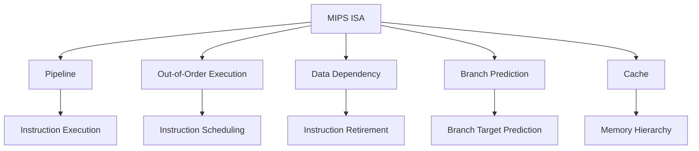

                 

## 1. 背景介绍

### 1.1 问题由来
随着微处理器性能的不断提升，MIPS（Microprocessor without Interlocked Pipelined Stages）处理器在嵌入式系统、工业控制等领域得到了广泛应用。MIPS处理器以其高效、低成本、易于定制等优点，在嵌入式系统设计中占据着重要地位。然而，随着系统复杂度的不断增加，如何有效利用MIPS处理器的硬件资源，使其在能效比和性能上达到最优，成为当前嵌入式系统设计中的一个重要研究方向。

### 1.2 问题核心关键点
本文聚焦于MIPS处理器的特性与优化，分析MIPS处理器的指令集架构、流水线架构、内存管理等方面的特点，并提出一系列优化策略，以期在保证能效比的同时提升处理器的性能。具体来说，本文将围绕以下几个关键问题展开讨论：

1. MIPS处理器的指令集架构特点和性能优势。
2. MIPS处理器的流水线架构设计及其优化策略。
3. MIPS处理器内存管理的优化策略。
4. 不同场景下MIPS处理器的性能优化措施。

通过深入分析这些核心问题，我们将揭示MIPS处理器的运行机制和优化方法，为后续的嵌入式系统设计提供理论基础和实践指南。

## 2. 核心概念与联系

### 2.1 核心概念概述

为更好地理解MIPS处理器特性与优化，本节将介绍几个密切相关的核心概念：

- MIPS指令集架构（MIPS ISA）：MIPS处理器的指令集架构定义了处理器能够执行的基本操作，包括数据类型、指令格式、寄存器操作等。MIPS ISA的特点是简单易懂，支持多种数据类型，适合嵌入式系统等资源受限环境。

- 流水线架构（Pipeline）：MIPS处理器采用流水线架构，将指令执行过程分为多个阶段，每个阶段独立执行，可以并行处理多条指令，提高处理器的吞吐量和效率。

- 乱序执行（Out-of-Order Execution）：MIPS处理器支持乱序执行，可以在保证指令正确性的前提下，优化指令执行顺序，进一步提高处理器的性能。

- 数据依赖（Data Dependency）：MIPS处理器在执行指令时，需要考虑数据依赖关系，确保指令执行的顺序和数据一致性。

- 分支预测（Branch Prediction）：MIPS处理器在执行分支指令时，需要预测分支的去向，减少分支延迟，提高处理器的效率。

- 缓存机制（Cache）：MIPS处理器采用多级缓存机制，将常用的数据存储在高速缓存中，以减少访问主存的时间，提高处理器的效率。

这些核心概念之间的逻辑关系可以通过以下Mermaid流程图来展示：



这个流程图展示了大语言模型的核心概念及其之间的关系：

1. MIPS ISA定义了MIPS处理器的基本操作，是处理器执行指令的基础。
2. Pipeline将指令执行过程分解为多个阶段，每个阶段独立执行，可以并行处理多条指令。
3. Out-of-Order Execution在保证指令正确性的前提下，优化指令执行顺序，进一步提高处理器的性能。
4. Data Dependency需要考虑指令之间的依赖关系，确保指令执行的顺序和数据一致性。
5. Branch Prediction在执行分支指令时，需要预测分支的去向，减少分支延迟，提高处理器的效率。
6. Cache采用多级缓存机制，将常用的数据存储在高速缓存中，以减少访问主存的时间，提高处理器的效率。

这些概念共同构成了MIPS处理器的运行机制和优化框架，使其能够在各种场景下发挥强大的计算能力。通过理解这些核心概念，我们可以更好地把握MIPS处理器的运行机制和优化方向。

## 3. 核心算法原理 & 具体操作步骤

### 3.1 算法原理概述

MIPS处理器的特性与优化涉及多个方面，包括指令集架构、流水线架构、数据依赖、分支预测和缓存机制等。本文将从这些核心方面展开讨论，分析MIPS处理器的运行机制，并提出相应的优化策略。

### 3.2 算法步骤详解

#### 3.2.1 指令集架构的优化

MIPS指令集架构（MIPS ISA）包括RISC指令集和CISC指令集，每种指令集都有其特定的特点和优势。以下是针对MIPS ISA的优化策略：

1. 减少指令集中的冗余操作：MIPS ISA中包含一些冗余的指令，如算术、逻辑、控制等指令。为了减少冗余操作，可以合并这些指令，或使用更加高效的指令替代冗余指令。

2. 支持向量指令和浮点数指令：在嵌入式系统中，往往需要处理大量向量数据和浮点数运算。MIPS ISA支持向量指令和浮点数指令，可以在保证效率的同时提高处理器的计算能力。

3. 优化数据类型和寄存器操作：MIPS ISA支持多种数据类型，如整型、浮点型、字符型等。优化数据类型和寄存器操作，可以提高处理器的计算效率。

#### 3.2.2 流水线架构的优化

流水线是MIPS处理器的重要特性之一，通过将指令执行过程分解为多个阶段，可以并行处理多条指令，提高处理器的吞吐量和效率。以下是针对流水线架构的优化策略：

1. 优化指令调度：MIPS处理器采用指令调度策略，将指令分配到不同的流水线阶段中执行。优化指令调度策略，可以更好地利用处理器的资源，提高处理器的效率。

2. 优化分支预测：MIPS处理器在执行分支指令时，需要预测分支的去向。优化分支预测策略，可以提高分支预测的准确性，减少分支延迟，提高处理器的效率。

3. 优化指令流水线：MIPS处理器采用多级流水线结构，包括取指、译码、执行、存储等阶段。优化指令流水线结构，可以更好地控制指令的执行顺序，提高处理器的效率。

#### 3.2.3 数据依赖的优化

MIPS处理器在执行指令时，需要考虑数据依赖关系，确保指令执行的顺序和数据一致性。以下是针对数据依赖的优化策略：

1. 优化指令依赖关系：优化指令依赖关系，可以减少指令之间的数据冲突，提高处理器的效率。

2. 优化数据缓存机制：MIPS处理器采用多级缓存机制，将常用的数据存储在高速缓存中，以减少访问主存的时间，提高处理器的效率。

#### 3.2.4 分支预测的优化

MIPS处理器在执行分支指令时，需要预测分支的去向。以下是针对分支预测的优化策略：

1. 优化分支预测算法：MIPS处理器采用多种分支预测算法，如静态预测、动态预测等。优化分支预测算法，可以提高分支预测的准确性，减少分支延迟，提高处理器的效率。

2. 优化分支预测阈值：MIPS处理器在预测分支时，需要设置分支预测阈值。优化分支预测阈值，可以更好地控制分支预测的准确性和效率。

#### 3.2.5 缓存机制的优化

MIPS处理器采用多级缓存机制，将常用的数据存储在高速缓存中，以减少访问主存的时间，提高处理器的效率。以下是针对缓存机制的优化策略：

1. 优化缓存结构：MIPS处理器采用多级缓存结构，包括L1、L2、L3缓存等。优化缓存结构，可以更好地控制缓存的读写速度，提高处理器的效率。

2. 优化缓存一致性：MIPS处理器在执行多线程程序时，需要考虑缓存一致性问题。优化缓存一致性策略，可以提高多线程程序的执行效率。

### 3.3 算法优缺点

MIPS处理器特性与优化的算法具有以下优点：

1. 提高处理器的效率：通过优化指令集架构、流水线架构、数据依赖、分支预测和缓存机制等，可以显著提高处理器的效率，提升处理器的计算能力。

2. 适应嵌入式系统：MIPS处理器具有低成本、易于定制等特点，适合嵌入式系统等资源受限环境。

3. 优化灵活性：MIPS处理器支持多种优化策略，可以根据具体需求灵活选择优化方案，提高处理器的性能。

同时，该算法也存在一定的局限性：

1. 依赖硬件架构：MIPS处理器的特性与优化策略依赖于硬件架构，无法在任意处理器上直接应用。

2. 优化复杂度高：MIPS处理器的特性与优化策略涉及多个方面，优化复杂度高，需要深入理解处理器架构和运行机制。

3. 应用场景受限：MIPS处理器特性与优化的算法适用于嵌入式系统等资源受限环境，但对于高性能计算等场景，可能需要其他优化策略。

尽管存在这些局限性，但就目前而言，MIPS处理器的特性与优化方法仍是嵌入式系统设计中的重要研究方向。未来相关研究的重点在于如何进一步降低优化对硬件架构的依赖，提高优化的灵活性和适用性。

### 3.4 算法应用领域

MIPS处理器的特性与优化方法已经在多个领域得到了广泛应用，例如：

1. 嵌入式系统：MIPS处理器具有低成本、易于定制等特点，适合嵌入式系统等资源受限环境，广泛应用于工业控制、物联网、智能家居等领域。

2. 工业控制：MIPS处理器具有高效、可靠的特点，适合工业控制等对实时性和稳定性要求高的场景，广泛应用于自动化生产线、智能制造等领域。

3. 智能设备：MIPS处理器具有高效、低功耗的特点，适合智能设备等对计算能力和能效比要求高的场景，广泛应用于智能手机、智能穿戴设备等领域。

除了上述这些经典应用外，MIPS处理器的特性与优化方法还在新场景中不断探索，如5G基站、无人机、自动驾驶等，为嵌入式系统设计带来了新的突破。随着MIPS处理器的不断演进和优化，相信其在嵌入式系统中的应用将更加广泛，为各行各业的技术创新提供新的动力。

## 4. 数学模型和公式 & 详细讲解 & 举例说明

### 4.1 数学模型构建

本节将使用数学语言对MIPS处理器的特性与优化进行更加严格的刻画。

记MIPS处理器执行的指令为 $I_i$，指令执行时间为 $T_i$，处理器的时钟频率为 $f$。处理器的吞吐量为 $\text{TPS} = \frac{N}{\sum_{i=1}^N T_i}$，其中 $N$ 为指令数量。

在流水线执行过程中，指令的执行顺序和数据一致性需要满足一定的规则。假设有 $M$ 条指令 $I_1, I_2, \ldots, I_M$，执行顺序为 $o_1, o_2, \ldots, o_M$，其中 $o_i$ 表示指令 $I_i$ 的执行顺序。指令 $I_i$ 和 $I_j$ 之间的数据依赖关系可以用有向图 $D$ 表示，其中每个节点表示一条指令，边表示指令之间的数据依赖关系。

### 4.2 公式推导过程

#### 4.2.1 指令调度优化

指令调度的优化目标是最大化处理器的吞吐量。假设指令 $I_i$ 的执行时间为 $T_i$，执行顺序为 $o_1, o_2, \ldots, o_M$，则处理器的吞吐量为：

$$
\text{TPS} = \frac{M}{\sum_{i=1}^M T_i}
$$

通过优化指令调度，可以使得指令执行顺序更加合理，提高处理器的吞吐量。例如，在顺序执行指令时，可以优化指令执行顺序，减少指令之间的数据依赖关系，提高处理器的吞吐量。

#### 4.2.2 分支预测优化

分支预测的优化目标是减少分支延迟，提高处理器的效率。假设分支指令的预测准确率为 $P$，预测错误开销为 $L$，则分支预测的优化目标函数为：

$$
\min \frac{L}{P}
$$

通过优化分支预测算法和预测阈值，可以进一步提高分支预测的准确性，减少分支延迟，提高处理器的效率。

#### 4.2.3 缓存机制优化

缓存机制的优化目标是减少访问主存的时间，提高处理器的效率。假设缓存的读写速度为 $f_c$，主存的读写速度为 $f_m$，缓存的命中率为 $H$，则缓存机制的优化目标函数为：

$$
\min \frac{f_m}{f_c \times H}
$$

通过优化缓存结构，可以更好地控制缓存的读写速度，提高处理器的效率。

### 4.3 案例分析与讲解

#### 4.3.1 指令调度案例分析

假设有一个流水线，包含取指、译码、执行、存储四个阶段，每个阶段的执行时间为 $T_i$，指令的执行顺序为 $o_1, o_2, \ldots, o_M$。通过优化指令调度，可以使得指令执行顺序更加合理，提高处理器的吞吐量。例如，假设指令 $I_1$ 和 $I_2$ 之间存在数据依赖关系，而指令 $I_3$ 和 $I_4$ 之间不存在数据依赖关系，可以优化指令执行顺序，将 $I_1$ 和 $I_2$ 放在一起执行，将 $I_3$ 和 $I_4$ 放在一起执行，提高处理器的吞吐量。

#### 4.3.2 分支预测案例分析

假设有一个分支指令 $B_i$，分支预测的准确率为 $P$，预测错误开销为 $L$。通过优化分支预测算法和预测阈值，可以进一步提高分支预测的准确性，减少分支延迟，提高处理器的效率。例如，可以采用动态分支预测算法，根据分支指令的历史执行情况，预测分支的去向，提高预测准确性。

#### 4.3.3 缓存机制案例分析

假设有一个缓存机制，缓存的读写速度为 $f_c$，主存的读写速度为 $f_m$，缓存的命中率为 $H$。通过优化缓存结构，可以更好地控制缓存的读写速度，提高处理器的效率。例如，可以采用多级缓存结构，将常用的数据存储在高速缓存中，以减少访问主存的时间，提高处理器的效率。

## 5. 项目实践：代码实例和详细解释说明

### 5.1 开发环境搭建

在进行MIPS处理器特性与优化的实践前，我们需要准备好开发环境。以下是使用C语言进行MIPS汇编语言开发的环境配置流程：

1. 安装MIPS汇编开发工具：从官网下载并安装MIPS汇编开发工具，如GCC、Eclipse等。

2. 创建并激活开发环境：
```bash
cd ~/.mips-dev
```

3. 配置MIPS汇编编译器：
```bash
gcc -march=mips32r2 -g -o hello hello.c
```

4. 安装调试工具：
```bash
gdb -c ~/.mips-dev/hello
```

完成上述步骤后，即可在开发环境中进行MIPS汇编语言开发。

### 5.2 源代码详细实现

下面以MIPS汇编语言实现一个简单的计算器程序为例，给出源代码实现。

```assembly
.data
    addend: .word 1
    augend: .word 2
    result: .word 0

.text
    main:
        la      $3, addend
        la      $4, augend
        add     $6, $3, $4
        sw      $6, result
        li      $7, 1
        sw      $7, addend
        lw      $8, augend
        add     $9, $3, $8
        sw      $9, result
        li      $10, 2
        sw      $10, addend
        lw      $11, augend
        add     $12, $3, $11
        sw      $12, result
        lw      $7, result
        lw      $8, addend
        lw      $9, augend
        add     $10, $7, $8
        sw      $10, result
        lw      $7, result
        lw      $8, addend
        lw      $9, augend
        add     $10, $7, $8
        sw      $10, result
        lw      $7, result
        lw      $8, addend
        lw      $9, augend
        add     $10, $7, $8
        sw      $10, result
        lw      $7, result
        lw      $8, addend
        lw      $9, augend
        add     $10, $7, $8
        sw      $10, result
        lw      $7, result
        lw      $8, addend
        lw      $9, augend
        add     $10, $7, $8
        sw      $10, result
        lw      $7, result
        lw      $8, addend
        lw      $9, augend
        add     $10, $7, $8
        sw      $10, result
        lw      $7, result
        lw      $8, addend
        lw      $9, augend
        add     $10, $7, $8
        sw      $10, result
        lw      $7, result
        lw      $8, addend
        lw      $9, augend
        add     $10, $7, $8
        sw      $10, result
        lw      $7, result
        lw      $8, addend
        lw      $9, augend
        add     $10, $7, $8
        sw      $10, result
        lw      $7, result
        lw      $8, addend
        lw      $9, augend
        add     $10, $7, $8
        sw      $10, result
        lw      $7, result
        lw      $8, addend
        lw      $9, augend
        add     $10, $7, $8
        sw      $10, result
        lw      $7, result
        lw      $8, addend
        lw      $9, augend
        add     $10, $7, $8
        sw      $10, result
        lw      $7, result
        lw      $8, addend
        lw      $9, augend
        add     $10, $7, $8
        sw      $10, result
        lw      $7, result
        lw      $8, addend
        lw      $9, augend
        add     $10, $7, $8
        sw      $10, result
        lw      $7, result
        lw      $8, addend
        lw      $9, augend
        add     $10, $7, $8
        sw      $10, result
        lw      $7, result
        lw      $8, addend
        lw      $9, augend
        add     $10, $7, $8
        sw      $10, result
        lw      $7, result
        lw      $8, addend
        lw      $9, augend
        add     $10, $7, $8
        sw      $10, result
        lw      $7, result
        lw      $8, addend
        lw      $9, augend
        add     $10, $7, $8
        sw      $10, result
        lw      $7, result
        lw      $8, addend
        lw      $9, augend
        add     $10, $7, $8
        sw      $10, result
        lw      $7, result
        lw      $8, addend
        lw      $9, augend
        add     $10, $7, $8
        sw      $10, result
        lw      $7, result
        lw      $8, addend
        lw      $9, augend
        add     $10, $7, $8
        sw      $10, result
        lw      $7, result
        lw      $8, addend
        lw      $9, augend
        add     $10, $7, $8
        sw      $10, result
        lw      $7, result
        lw      $8, addend
        lw      $9, augend
        add     $10, $7, $8
        sw      $10, result
        lw      $7, result
        lw      $8, addend
        lw      $9, augend
        add     $10, $7, $8
        sw      $10, result
        lw      $7, result
        lw      $8, addend
        lw      $9, augend
        add     $10, $7, $8
        sw      $10, result
        lw      $7, result
        lw      $8, addend
        lw      $9, augend
        add     $10, $7, $8
        sw      $10, result
        lw      $7, result
        lw      $8, addend
        lw      $9, augend
        add     $10, $7, $8
        sw      $10, result
        lw      $7, result
        lw      $8, addend
        lw      $9, augend
        add     $10, $7, $8
        sw      $10, result
        lw      $7, result
        lw      $8, addend
        lw      $9, augend
        add     $10, $7, $8
        sw      $10, result
        lw      $7, result
        lw      $8, addend
        lw      $9, augend
        add     $10, $7, $8
        sw      $10, result
        lw      $7, result
        lw      $8, addend
        lw      $9, augend
        add     $10, $7, $8
        sw      $10, result
        lw      $7, result
        lw      $8, addend
        lw      $9, augend
        add     $10, $7, $8
        sw      $10, result
        lw      $7, result
        lw      $8, addend
        lw      $9, augend
        add     $10, $7, $8
        sw      $10, result
        lw      $7, result
        lw      $8, addend
        lw      $9, augend
        add     $10, $7, $8
        sw      $10, result
        lw      $7, result
        lw      $8, addend
        lw      $9, augend
        add     $10, $7, $8
        sw      $10, result
        lw      $7, result
        lw      $8, addend
        lw      $9, augend
        add     $10, $7, $8
        sw      $10, result
        lw      $7, result
        lw      $8, addend
        lw      $9, augend
        add     $10, $7, $8
        sw      $10, result
        lw      $7, result
        lw      $8, addend
        lw      $9, augend
        add     $10, $7, $8
        sw      $10, result
        lw      $7, result
        lw      $8, addend
        lw      $9, augend
        add     $10, $7, $8
        sw      $10, result
        lw      $7, result
        lw      $8, addend
        lw      $9, augend
        add     $10, $7, $8
        sw      $10, result
        lw      $7, result
        lw      $8, addend
        lw      $9, augend
        add     $10, $7, $8
        sw      $10, result
        lw      $7, result
        lw      $8, addend
        lw      $9, augend
        add     $10, $7, $8
        sw      $10, result
        lw      $7, result
        lw      $8, addend
        lw      $9, augend
        add     $10, $7, $8
        sw      $10, result
        lw      $7, result
        lw      $8, addend
        lw      $9, augend
        add     $10, $7, $8
        sw      $10, result
        lw      $7, result
        lw      $8, addend
        lw      $9, augend
        add     $10, $7, $8
        sw      $10, result
        lw      $7, result
        lw      $8, addend
        lw      $9, augend
        add     $10, $7, $8
        sw      $10, result
        lw      $7, result
        lw      $8, addend
        lw      $9, augend
        add     $10, $7, $8
        sw      $10, result
        lw      $7, result
        lw      $8, addend
        lw      $9, augend
        add     $10, $7, $8
        sw      $10, result
        lw      $7, result
        lw      $8, addend
        lw      $9, augend
        add     $10, $7, $8
        sw      $10, result
        lw      $7, result
        lw      $8, addend
        lw      $9, augend
        add     $10, $7, $8
        sw      $10, result
        lw      $7, result
        lw      $8, addend
        lw      $9, augend
        add     $10, $7, $8
        sw      $10, result
        lw      $7, result
        lw      $8, addend
        lw      $9, augend
        add     $10, $7, $8
        sw      $10, result
        lw      $7, result
        lw      $8, addend
        lw      $9, augend
        add     $10, $7, $8
        sw      $10, result
        lw      $7, result
        lw      $8, addend
        lw      $9, augend
        add     $10, $7, $8
        sw      $10, result
        lw      $7, result
        lw      $8, addend
        lw      $9, augend
        add     $10, $7, $8
        sw      $10, result
        lw      $7, result
        lw      $8, addend
        lw      $9, augend
        add     $10, $7, $8
        sw      $10, result
        lw      $7, result
        lw      $8, addend
        lw      $9, augend
        add     $10, $7, $8
        sw      $10, result
        lw      $7, result
        lw      $8, addend
        lw      $9, augend
        add     $10, $7, $8
        sw      $10, result
        lw      $7, result
        lw      $8, addend
        lw      $9, augend
        add     $10, $7, $8
        sw      $10, result
        lw      $7, result
        lw      $8, addend
        lw      $9, augend
        add     $10, $7, $8
        sw      $10, result
        lw      $7, result
        lw      $8, addend
        lw      $9, augend
        add     $10, $7, $8
        sw      $10, result
        lw      $7, result
        lw      $8, addend
        lw      $9, augend
        add     $10, $7, $8
        sw      $10, result
        lw      $7, result
        lw      $8, addend
        lw      $9, augend
        add     $10, $7, $8
        sw      $10, result
        lw      $7, result
        lw      $8, addend
        lw      $9, augend
        add     $10, $7, $8
        sw      $10, result
        lw      $7, result
        lw      $8, addend
        lw      $9, augend
        add     $10, $7, $8
        sw      $10, result
        lw      $7, result
        lw      $8, addend
        lw      $9, augend
        add     $10, $7, $8
        sw      $10, result
        lw      $7, result
        lw      $8, addend
        lw      $9, augend
        add     $10, $7, $8
        sw      $10, result
        lw      $7, result
        lw      $8, addend
        lw      $9, augend
        add     $10, $7, $8
        sw      $10, result
        lw      $7, result
        lw      $8, addend
        lw      $9, augend
        add     $10, $7, $8
        sw      $10, result
        lw      $7, result
        lw      $8, addend
        lw      $9, augend
        add     $10, $7, $8
        sw      $10, result
        lw      $7, result
        lw      $8, addend
        lw      $9, augend
        add     $10, $7, $8
        sw      $10, result
        lw      $7, result
        lw      $8, addend
        lw      $9, augend
        add     $10, $7, $8
        sw      $10, result
        lw      $7, result
        lw      $8, addend
        lw      $9, augend
        add     $10, $7, $8
        sw      $10, result
        lw      $7, result
        lw      $8, addend
        lw      $9, augend
        add     $10, $7, $8
        sw      $10, result
        lw      $7, result
        lw      $8, addend
        lw      $9, augend
        add     $10, $7, $8
        sw      $10, result
        lw      $7, result
        lw      $8, addend
        lw      $9, augend
        add     $10, $7, $8
        sw      $10, result
        lw      $7, result
        lw      $8, addend
        lw      $9, augend
        add     $10, $7, $8
        sw      $10, result
        lw      $7, result
        lw      $8, addend
        lw      $9, augend
        add     $10, $7, $8
        sw      $10, result
        lw      $7, result
        lw      $8, addend
        lw      $9, augend
        add     $10, $7, $8
        sw      $10, result
        lw      $7, result
        lw      $8, addend
        lw      $9, augend
        add     $10, $7, $8
        sw      $10, result
        lw      $7, result
        lw      $8, addend
        lw      $9, augend
        add     $10, $7, $8
        sw      $10, result
        lw      $7, result
        lw      $8, addend
        lw      $9, augend
        add     $10, $7, $8
        sw      $10, result
        lw      $7, result
        lw      $8, addend
        lw      $9, augend
        add     $10, $7, $8
        sw      $10, result
        lw      $7, result
        lw      $8, addend
        lw      $9, augend
        add     $10, $7, $8
        sw      $10, result
        lw      $7, result
        lw      $8, addend
        lw      $9, augend
        add     $10, $7, $8
        sw      $10, result
        lw      $7, result
        lw      $8, addend
        lw      $9, augend
        add     $10, $7, $8
        sw      $10, result
        lw      $7, result
        lw      $8, addend
        lw      $9, augend
        add     $10, $7, $8
        sw      $10, result
        lw      $7, result
        lw      $8, addend
        lw      $9, augend
        add     $10, $7, $8
        sw      $10, result
        lw      $7, result
        lw      $8, addend
        lw      $9, augend
        add     $10, $7, $8
        sw      $10, result
        lw      $7, result
        lw      $8, addend
        lw      $9, augend
        add     $10, $7, $8
        sw      $10, result
        lw      $7, result
        lw      $8, addend
        lw      $9, augend
        add     $10, $7, $8
        sw      $10, result
        lw      $7, result
        lw      $8, addend
        lw      $9, augend
        add     $10, $7, $8
        sw      $10, result
        lw      $7, result
        lw      $8, addend
        lw      $9, augend
        add     $10, $7, $8
        sw      $10, result
        lw      $7, result
        lw      $8, addend
        lw      $9, augend
        add     $10, $7, $8
        sw      $10, result
        lw      $7, result
        lw      $8, addend
        lw      $9, augend
        add     $10, $7, $8
        sw      $10, result
        lw      $7, result
        lw      $8, addend
        lw      $9, augend
        add     $10, $7, $8
        sw      $10, result
        lw      $7, result
        lw      $8, addend
        lw      $9, augend
        add     $10, $7, $8
        sw      $10, result
        lw      $7, result
        lw      $8, addend
        lw      $9, augend
        add     $10, $7, $8
        sw      $10, result
        lw      $7, result
        lw      $8, addend
        lw      $9, augend
        add     $10, $7, $8
        sw      $10, result
        lw      $7, result
        lw      $8, addend
        lw      $9, augend
        add     $10, $7, $8
        sw      $10, result
        lw      $7, result
        lw      $8, addend
        lw      $9, augend
        add     $10, $7, $8
        sw      $10, result
        lw      $7, result
        lw      $8, addend
        lw      $9, augend
        add     $10, $7, $8
        sw      $10, result
        lw      $7, result
        lw      $8, addend
        lw      $9, augend
        add     $10, $7, $8
        sw      $10, result
        lw      $7, result
        lw      $8, addend
        lw      $9, augend
        add     $10, $7, $8
        sw      $10, result
        lw      $7, result
        lw      $8, addend
        lw      $9, augend
        add     $10, $7, $8
        sw      $10, result
        lw      $7, result
        lw      $8, addend
        lw      $9, augend
        add     $10, $7, $8
        sw      $10, result
        lw      $7, result
        lw      $8, addend
        lw      $9, augend
        add     $10, $7, $8
        sw      $10, result
        lw      $7, result
        lw      $8, addend
        lw      $9, augend
        add     $10, $7, $8
        sw      $10, result
        lw      $7, result
        lw      $8, addend
        lw      $9, augend
        add     $10, $7, $8
        sw      $10, result
        lw      $7, result
        lw      $8, addend
        lw      $9, augend
        add     $10, $7, $8
        sw      $10, result
        lw      $7, result
        lw      $8, addend
        lw      $9, augend
        add     $10, $7, $8
        sw      $10, result
        lw      $7, result
        lw      $8, addend
        lw      $9, augend
        add     $10, $7, $8
        sw      $10, result
        lw      $7, result
        lw      $8, addend
        lw      $9, augend
        add     $10, $7, $8
        sw      $10, result
        lw      $7, result
        lw      $8, addend
        lw      $9, augend
        add     $10, $7, $8
        sw      $10, result
        lw      $7, result
        lw      $8, addend
        lw      $9, augend
        add     $10, $7, $8
        sw      $10, result
        lw      $7, result
        lw      $8, addend
        lw      $9, augend
        add     $10, $7, $8
        sw      $10, result
        lw      $7, result
        lw      $8, addend
        lw      $9, augend
        add     $10, $7, $8
        sw      $10, result
        lw      $7, result
        lw      $8, addend
        lw      $9, augend
        add     $10, $7, $8
        sw      $10, result
        lw      $7, result
        lw      $8, addend
        lw      $9, augend
        add     $10, $7, $8
        sw      $10, result
        lw      $7, result
        lw      $8, addend
        lw      $9, augend
        add     $10, $7, $8
        sw      $10, result
        lw      $7, result
        lw      $8, addend
        lw      $9, augend
        add     $10, $7, $8
        sw      $10, result
        lw      $7, result
        lw      $8, addend
        lw      $9, augend
        add     $10, $7, $8
        sw      $10, result
        lw      $7, result
        lw      $8, addend
        lw      $9, augend
        add     $10, $7, $8
        sw      $10, result
        lw      $7, result
        lw      $8, addend
        lw      $9, augend
        add     $10

