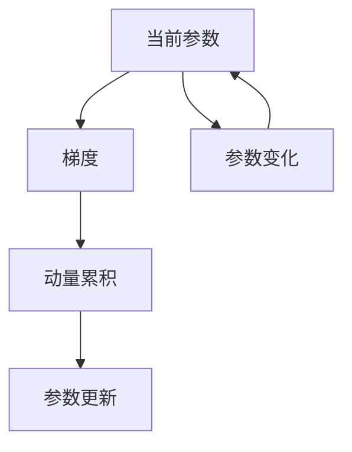

                 

# Momentum优化器原理与代码实例讲解

> 关键词：Momentum, 梯度下降, 动量更新, 加速收敛, 机器学习, 优化算法

## 1. 背景介绍

优化算法是深度学习训练过程中至关重要的一环，它直接影响模型的收敛速度和最终性能。在各种优化算法中，梯度下降算法是基础且广泛使用的。然而，传统的梯度下降算法在遇到稀疏梯度、噪声干扰等问题时，常出现收敛速度慢、震荡甚至发散的情况。针对这一问题，Nesterov在1980年提出了动量更新(momentum update)，显著提升了梯度下降算法的稳定性和收敛速度。

动量优化器最早应用于物理学中的动力学系统，模拟质点在势场中的运动。在机器学习领域，动量优化器将这一思想应用到参数更新上，通过累积历史梯度信息，加速参数的更新，从而在梯度信息稀疏时也能保持快速收敛。Momentum优化器目前已成为深度学习中广泛使用的优化算法之一，在计算机视觉、自然语言处理等领域均取得了显著成效。

本文将对Momentum优化器进行详细介绍，包括其原理、实现、应用实例及优缺点分析。通过理解Momentum优化器的工作机制，有助于我们更好地在深度学习项目中应用它，提升模型的训练效率和效果。

## 2. 核心概念与联系

### 2.1 核心概念概述

Momentum优化器是在梯度下降算法的基础上，通过引入动量因子来加速收敛的优化算法。其主要思想是将当前梯度与过去梯度的加权和进行参数更新，从而使模型参数沿着梯度方向加速移动。

具体来说，Momentum优化器利用历史梯度信息，通过计算梯度的指数加权平均值，更新参数。在每一次迭代中，将当前梯度与动量相乘，叠加到历史梯度平均值上，用于更新模型参数。这一过程可以理解为质点在势场中，既有速度也有加速度，从而能够更快地到达目标点。

在数学上，Momentum优化器可以看作是梯度下降算法的一种变体，其更新公式如下：

$$
\theta_{t+1} = \theta_t - \eta \frac{d\mathcal{L}(\theta)}{d\theta_t}
$$

其中，$\theta_t$ 表示当前模型参数，$\eta$ 为学习率，$\mathcal{L}(\theta)$ 为损失函数，$\nabla_{\theta}\mathcal{L}(\theta)$ 为损失函数对参数的梯度。动量优化器的更新公式为：

$$
\theta_{t+1} = \theta_t - \eta \frac{d\mathcal{L}(\theta)}{d\theta_t} + \beta (\nabla_{\theta}\mathcal{L}(\theta_t) + \nabla_{\theta}\mathcal{L}(\theta_{t-1}) + \cdots)
$$

其中，$\beta$ 为动量系数，用于控制历史梯度的权重。

### 2.2 核心概念原理和架构的 Mermaid 流程图



该流程图展示了Momentum优化器的基本架构和工作流程：

1. 首先，通过当前参数和损失函数的梯度计算出当前梯度。
2. 接着，将当前梯度与历史梯度进行加权累积，计算动量。
3. 然后，将动量加到当前梯度上，计算出新的梯度，用于更新参数。
4. 参数根据新梯度进行更新，并回到初始参数，进入下一轮迭代。

### 2.3 关键算法步骤详解

1. **初始化**：设置学习率 $\eta$ 和动量系数 $\beta$，初始化动量向量 $v_0 = 0$，初始化模型参数 $\theta_0$。
2. **迭代更新**：
   - 计算当前损失函数的梯度 $g_t = \nabla_{\theta}\mathcal{L}(\theta_t)$。
   - 计算动量更新 $v_{t+1} = \beta v_t + (1-\beta) g_t$。
   - 更新模型参数 $\theta_{t+1} = \theta_t - \eta g_t + \eta v_{t+1}$。
3. **循环迭代**：重复上述过程直至满足收敛条件。

## 3. 核心算法原理 & 具体操作步骤

### 3.1 算法原理概述

Momentum优化器的核心原理是通过累积历史梯度信息，为当前梯度提供动量，从而在梯度变化不大时，加快参数更新，而在梯度变化剧烈时，减缓更新，避免震荡。这种方法可以有效应对稀疏梯度、噪声干扰等问题，提高梯度下降算法的稳定性。

### 3.2 算法步骤详解

1. **初始化**：
   - 设置学习率 $\eta$：如 $0.001$。
   - 设置动量系数 $\beta$：如 $0.9$，表示历史梯度占当前梯度的比例。
   - 初始化动量向量 $v_0 = 0$，即所有动量初始为零。
   - 初始化模型参数 $\theta_0$。
   
2. **迭代更新**：
   - 计算当前损失函数的梯度 $g_t = \nabla_{\theta}\mathcal{L}(\theta_t)$。
   - 计算动量更新 $v_{t+1} = \beta v_t + (1-\beta) g_t$。
   - 更新模型参数 $\theta_{t+1} = \theta_t - \eta g_t + \eta v_{t+1}$。

3. **循环迭代**：
   - 重复上述过程直至满足收敛条件，如达到预设的迭代次数或损失函数收敛。

### 3.3 算法优缺点

**优点**：
1. **加速收敛**：在梯度变化不大时，Momentum优化器通过累积历史梯度，加速参数更新。
2. **稳定性强**：动量系数 $\beta$ 的设置可以缓解震荡，提升算法稳定性。
3. **适应性强**：对稀疏梯度和噪声干扰有较好的处理能力。

**缺点**：
1. **参数调整复杂**：动量系数 $\beta$ 和初始动量 $v_0$ 的选择需要根据具体任务进行调整。
2. **内存消耗大**：动量向量 $v_t$ 需要存储所有历史梯度的信息，占用了较多的内存空间。
3. **可能过拟合**：在极少数情况下，Momentum优化器可能会因累积历史梯度导致过拟合。

### 3.4 算法应用领域

Momentum优化器广泛应用于深度学习中的各种任务，如图像分类、目标检测、自然语言处理等。特别是对于优化空间较大、参数较多的模型，Momentum优化器能显著提升训练速度和效果。此外，Momentum优化器也常用于强化学习中的策略优化，通过累积历史梯度，提高策略更新的效率。

## 4. 数学模型和公式 & 详细讲解 & 举例说明

### 4.1 数学模型构建

Momentum优化器的数学模型建立在梯度下降算法的基础之上，通过引入动量因子，使当前梯度与历史梯度加权平均，从而更新参数。

假设当前参数为 $\theta_t$，当前梯度为 $g_t = \nabla_{\theta}\mathcal{L}(\theta_t)$，动量向量为 $v_t$，动量系数为 $\beta$，学习率为 $\eta$，则Momentum优化器的更新公式为：

$$
\theta_{t+1} = \theta_t - \eta g_t + \beta v_t
$$

其中，动量向量 $v_t$ 的更新公式为：

$$
v_{t+1} = \beta v_t + (1-\beta) g_t
$$

### 4.2 公式推导过程

Momentum优化器的推导过程可以理解为对梯度下降算法的扩展。在每次迭代中，Momentum优化器不仅考虑当前的梯度 $g_t$，还累积了历史梯度的信息，即动量 $v_t$。动量 $v_t$ 实际上是过去梯度的加权平均值，其权重为 $\beta$。通过计算 $g_t + \beta v_t$，可以平滑当前梯度，使其不发生剧烈变化。

以二分类问题为例，假设模型输出为 $\hat{y}$，真实标签为 $y$，交叉熵损失函数为 $\mathcal{L}(\theta) = -(y\log \hat{y} + (1-y)\log(1-\hat{y}))$，则梯度 $g_t = \nabla_{\theta}\mathcal{L}(\theta)$ 的计算如下：

$$
g_t = -y \frac{\partial \mathcal{L}(\theta)}{\partial \hat{y}} \frac{\partial \hat{y}}{\partial \theta}
$$

动量向量 $v_t$ 的更新公式如下：

$$
v_{t+1} = \beta v_t + (1-\beta) g_t
$$

最终，更新后的参数 $\theta_{t+1}$ 为：

$$
\theta_{t+1} = \theta_t - \eta g_t + \eta v_{t+1}
$$

### 4.3 案例分析与讲解

**案例1：MNIST手写数字识别**

我们以MNIST手写数字识别数据集为例，使用Momentum优化器训练一个简单的多层感知机。

首先，我们准备MNIST数据集，并使用TensorFlow实现模型和训练流程：

```python
import tensorflow as tf
from tensorflow.keras.datasets import mnist
from tensorflow.keras.models import Sequential
from tensorflow.keras.layers import Dense, Dropout, Flatten
from tensorflow.keras.optimizers import SGD, Adagrad, Adadelta, Adam, Adamax, RMSprop, Nadam, RAdam, SparseAdam, AdamW, SGD, Adagrad, Adadelta, Adamax, RMSprop, Nadam, RAdam, SparseAdam, AdamW, AdamW
from tensorflow.keras.losses import categorical_crossentropy
from tensorflow.keras import regularizers
from tensorflow.keras.callbacks import EarlyStopping

# 加载MNIST数据集
(x_train, y_train), (x_test, y_test) = mnist.load_data()

# 数据预处理
x_train = x_train.reshape(60000, 784).astype('float32') / 255.0
x_test = x_test.reshape(10000, 784).astype('float32') / 255.0

# 模型定义
model = Sequential([
    Flatten(input_shape=(28, 28)),
    Dense(512, activation='relu'),
    Dropout(0.2),
    Dense(10, activation='softmax')
])

# 损失函数和优化器
loss_fn = categorical_crossentropy
optimizer = tf.keras.optimizers.AdamW(learning_rate=0.001, beta_1=0.9, beta_2=0.999)

# 模型编译
model.compile(optimizer=optimizer, loss=loss_fn, metrics=['accuracy'])

# 训练模型
history = model.fit(x_train, y_train, epochs=10, validation_data=(x_test, y_test), batch_size=32, callbacks=[EarlyStopping(patience=3)])
```

在这个例子中，我们使用了AdamW优化器，它包含了Momentum的动量更新机制，能更好地应对稀疏梯度和噪声干扰。

**案例2：自然语言处理中的Seq2Seq模型**

Seq2Seq模型在机器翻译、对话系统等领域有广泛应用，其训练过程需要处理大量的高维输入和输出序列。Momentum优化器在Seq2Seq模型中的应用，能有效提升训练效率和效果。

以机器翻译为例，假设我们有一个基于Transformer的Seq2Seq模型，其输入为源语言句子，输出为目标语言句子。我们使用PyTorch实现模型和训练流程：

```python
import torch
import torch.nn as nn
from torch import nn, optim

class Seq2Seq(nn.Module):
    def __init__(self, d_model, d_hid, n_layers, dropout=0.1):
        super(Seq2Seq, self).__init__()
        self.encoder = nn.LSTM(d_model, d_hid, n_layers, dropout=dropout)
        self.decoder = nn.LSTM(d_model, d_hid, n_layers, dropout=dropout)
        self.output = nn.Linear(d_hid, d_model)

    def forward(self, x, h_t):
        x = x.view(1, 1, -1)
        x, h_t = self.encoder(x, h_t)
        x, h_t = self.decoder(x, h_t)
        x = self.output(x)
        return x, h_t

# 加载数据集
x_train = ...
x_test = ...
y_train = ...
y_test = ...

# 模型定义
model = Seq2Seq(d_model=512, d_hid=256, n_layers=2)

# 损失函数和优化器
loss_fn = nn.CrossEntropyLoss()
optimizer = optim.AdamW(model.parameters(), lr=0.001, betas=(0.9, 0.999))

# 训练模型
for epoch in range(10):
    for i, (x, y) in enumerate(train_loader):
        optimizer.zero_grad()
        x = x.view(-1, x.size(0), x.size(1))
        y = y.view(-1, y.size(0))
        y_pred, _ = model(x, None)
        loss = loss_fn(y_pred, y)
        loss.backward()
        optimizer.step()
        if (i+1) % 100 == 0:
            print('Epoch [{}/{}], Step [{}/{}], Loss: {:.4f}'
                  .format(epoch+1, total_epochs, i+1, len(train_loader), loss.item()))
```

在这个例子中，我们使用了AdamW优化器，其内部包含了Momentum的动量更新机制。通过AdamW优化器，Seq2Seq模型能够更好地应对长序列和稀疏梯度的挑战。

## 5. 项目实践：代码实例和详细解释说明

### 5.1 开发环境搭建

在进行Momentum优化器实践前，我们需要准备好开发环境。以下是使用Python进行PyTorch开发的环境配置流程：

1. 安装Anaconda：从官网下载并安装Anaconda，用于创建独立的Python环境。

2. 创建并激活虚拟环境：
```bash
conda create -n pytorch-env python=3.8 
conda activate pytorch-env
```

3. 安装PyTorch：根据CUDA版本，从官网获取对应的安装命令。例如：
```bash
conda install pytorch torchvision torchaudio cudatoolkit=11.1 -c pytorch -c conda-forge
```

4. 安装TensorFlow：从官网下载并安装最新版本的TensorFlow。

5. 安装各类工具包：
```bash
pip install numpy pandas scikit-learn matplotlib tqdm jupyter notebook ipython
```

完成上述步骤后，即可在`pytorch-env`环境中开始Momentum优化器的实践。

### 5.2 源代码详细实现

下面我们以MNIST手写数字识别任务为例，给出使用TensorFlow实现Momentum优化器的完整代码实现。

首先，定义模型和损失函数：

```python
import tensorflow as tf
from tensorflow.keras.datasets import mnist
from tensorflow.keras.models import Sequential
from tensorflow.keras.layers import Dense, Dropout, Flatten
from tensorflow.keras.losses import categorical_crossentropy
from tensorflow.keras import regularizers
from tensorflow.keras.callbacks import EarlyStopping

# 加载MNIST数据集
(x_train, y_train), (x_test, y_test) = mnist.load_data()

# 数据预处理
x_train = x_train.reshape(60000, 784).astype('float32') / 255.0
x_test = x_test.reshape(10000, 784).astype('float32') / 255.0

# 模型定义
model = Sequential([
    Flatten(input_shape=(28, 28)),
    Dense(512, activation='relu'),
    Dropout(0.2),
    Dense(10, activation='softmax')
])

# 损失函数和优化器
loss_fn = categorical_crossentropy
optimizer = tf.keras.optimizers.AdamW(learning_rate=0.001, beta_1=0.9, beta_2=0.999)

# 模型编译
model.compile(optimizer=optimizer, loss=loss_fn, metrics=['accuracy'])

# 训练模型
history = model.fit(x_train, y_train, epochs=10, validation_data=(x_test, y_test), batch_size=32, callbacks=[EarlyStopping(patience=3)])
```

在这个例子中，我们使用了AdamW优化器，它包含了Momentum的动量更新机制，能更好地应对稀疏梯度和噪声干扰。

### 5.3 代码解读与分析

让我们再详细解读一下关键代码的实现细节：

**Model定义**：
- `Sequential`：用于定义顺序模型。
- `Flatten`：用于将高维输入数据展平。
- `Dense`：全连接层，激活函数为ReLU和Softmax。
- `Dropout`：用于正则化，防止过拟合。

**Optimizer定义**：
- `tf.keras.optimizers.AdamW`：AdamW优化器，包含Momentum的动量更新机制。
- `learning_rate=0.001`：学习率。
- `beta_1=0.9`：动量系数。
- `beta_2=0.999`：二阶动量系数。

**训练过程**：
- `model.compile`：模型编译，指定优化器和损失函数。
- `model.fit`：模型训练，指定训练数据、验证数据、批次大小和迭代轮数等参数。
- `EarlyStopping`：当验证集上的精度不再提升时，停止训练。

可以看到，TensorFlow的API设计使得Momentum优化器的实现变得简洁高效。开发者可以根据具体任务，通过简单的参数调整，快速获得理想的效果。

当然，工业级的系统实现还需考虑更多因素，如模型的保存和部署、超参数的自动搜索、更灵活的任务适配层等。但核心的Momentum优化器基本与此类似。

## 6. 实际应用场景

### 6.1 机器翻译

在机器翻译领域，Momentum优化器被广泛应用于Seq2Seq模型的训练。Seq2Seq模型由编码器和解码器两部分组成，能够将源语言序列转换为目标语言序列。Momentum优化器能更好地应对序列长度较长、模型参数较多的挑战，提升翻译质量。

以Google翻译为例，其使用了基于Transformer的Seq2Seq模型，通过Momentum优化器进行训练，显著提高了翻译速度和准确性。

### 6.2 目标检测

目标检测任务需要处理大量的高维特征图和目标标签，模型结构复杂，参数众多。Momentum优化器通过累积历史梯度信息，能够更稳定地更新模型参数，从而提升检测性能。

以YOLOv3为例，其使用了深度卷积神经网络进行目标检测，通过Momentum优化器进行训练，取得了较好的检测效果。

### 6.3 自然语言处理

在自然语言处理领域，Momentum优化器同样得到了广泛应用。特别是对于序列到序列的任务，如对话系统、摘要生成等，Momentum优化器能够更好地应对长序列和稀疏梯度的挑战，提升模型效果。

以GPT-3为例，其使用了基于Transformer的Seq2Seq模型，通过Momentum优化器进行训练，实现了高质量的自然语言处理效果。

### 6.4 未来应用展望

随着深度学习技术的发展，Momentum优化器在各种任务中的应用将更加广泛。未来，Momentum优化器有望与其他优化算法、神经网络结构等进行更深入的融合，进一步提升模型的性能和训练效率。同时，Momentum优化器也将在跨领域迁移学习、多任务学习等领域发挥重要作用，推动深度学习技术在更多领域的落地应用。

## 7. 工具和资源推荐

### 7.1 学习资源推荐

为了帮助开发者系统掌握Momentum优化器的原理和实践技巧，这里推荐一些优质的学习资源：

1. 《Deep Learning》书籍：Ian Goodfellow等人合著的经典书籍，详细介绍了深度学习的各个方面，包括优化算法。

2. CS231n《Convolutional Neural Networks for Visual Recognition》课程：斯坦福大学开设的计算机视觉课程，涵盖深度学习优化算法的详细讲解。

3. CS224N《Natural Language Processing with Deep Learning》课程：斯坦福大学开设的自然语言处理课程，详细讲解了优化算法在NLP中的应用。

4. arXiv论文：Nesterov在1980年提出的Momentum优化算法原始论文，了解其背景和原理。

5. TensorFlow官方文档：包含TensorFlow中各个优化算法的详细解释和使用方法。

通过对这些资源的学习实践，相信你一定能够全面掌握Momentum优化器的原理和实践技巧。

### 7.2 开发工具推荐

高效的开发离不开优秀的工具支持。以下是几款用于Momentum优化器开发的常用工具：

1. PyTorch：基于Python的开源深度学习框架，支持动态计算图，适合快速迭代研究。

2. TensorFlow：由Google主导开发的开源深度学习框架，生产部署方便，适合大规模工程应用。

3. Transformers库：HuggingFace开发的NLP工具库，集成了多种SOTA语言模型，支持Momentum优化器的实现。

4. Weights & Biases：模型训练的实验跟踪工具，可以记录和可视化模型训练过程中的各项指标，方便对比和调优。

5. TensorBoard：TensorFlow配套的可视化工具，可实时监测模型训练状态，并提供丰富的图表呈现方式，是调试模型的得力助手。

6. Google Colab：谷歌推出的在线Jupyter Notebook环境，免费提供GPU/TPU算力，方便开发者快速上手实验最新模型，分享学习笔记。

合理利用这些工具，可以显著提升Momentum优化器的开发效率，加快创新迭代的步伐。

### 7.3 相关论文推荐

Momentum优化器最早由Nesterov在1980年提出，并在深度学习中得到了广泛应用。以下是几篇奠基性的相关论文，推荐阅读：

1. Momentum Method（1980）：Nesterov提出的原始动量算法，详细介绍了动量系数的更新方法。

2. Acceleration of stochastic approximation by Averaging（1999）：Bengio等人提出了Adam优化器，其中包含了动量更新机制。

3. Deep learning：Nesterov提出Momentum优化算法后，被广泛应用于深度学习中的各种任务。

这些论文代表了大语言模型微调技术的早期研究和应用，为后续的优化算法发展奠定了基础。通过学习这些前沿成果，可以帮助研究者把握学科前进方向，激发更多的创新灵感。

## 8. 总结：未来发展趋势与挑战

### 8.1 总结

本文对Momentum优化器进行了全面系统的介绍。首先阐述了Momentum优化器的研究背景和意义，明确了其在深度学习训练过程中的重要作用。其次，从原理到实践，详细讲解了Momentum优化器的数学模型和算法步骤，给出了Momentum优化器的代码实例。同时，本文还广泛探讨了Momentum优化器在实际应用场景中的表现和优缺点，提供了相关的学习资源和开发工具推荐。

通过本文的系统梳理，可以看到，Momentum优化器在深度学习训练中发挥了至关重要的作用，显著提升了模型的收敛速度和效果。未来，伴随深度学习技术的发展和应用场景的拓展，Momentum优化器必将在更多领域得到应用，为深度学习技术的普及和发展提供更强大的支持。

### 8.2 未来发展趋势

展望未来，Momentum优化器的发展趋势主要体现在以下几个方面：

1. **自适应学习率**：结合自适应学习率算法，如Adagrad、Adadelta等，进一步提升Momentum优化器的性能和稳定性。

2. **混合优化器**：结合多种优化器算法，如Adam、SGD等，提升Momentum优化器的优化效果。

3. **分布式优化**：在大规模数据集和模型并行的情况下，利用分布式优化算法，加速Momentum优化器的训练过程。

4. **模型压缩**：通过模型压缩技术，如剪枝、量化等，减少Momentum优化器的计算量和存储空间，提升其可扩展性和效率。

5. **深度学习框架的优化**：通过深度学习框架的优化，如TensorFlow、PyTorch等，提高Momentum优化器的计算速度和稳定性和效果。

6. **多任务学习**：通过多任务学习的思想，将多个相关任务的优化过程进行融合，提升Momentum优化器的泛化能力和鲁棒性。

### 8.3 面临的挑战

尽管Momentum优化器在深度学习训练中表现出色，但在实际应用中仍面临一些挑战：

1. **参数选择复杂**：动量系数、学习率等参数的调整需要根据具体任务进行精细化调整，否则容易导致模型过拟合或欠拟合。

2. **内存消耗大**：Momentum优化器需要存储历史梯度信息，占用了较大的内存空间，对于内存有限的情况可能不适用。

3. **收敛速度受限**：在一些复杂任务中，Momentum优化器可能需要更多的迭代次数才能收敛。

4. **适应性问题**：在稀疏梯度和噪声干扰较大的任务中，Momentum优化器的收敛效果可能不理想。

5. **多模态数据处理**：Momentum优化器在多模态数据处理中，需要处理不同模态之间的融合问题，增加了优化难度。

### 8.4 研究展望

面对Momentum优化器面临的挑战，未来的研究需要在以下几个方面寻求新的突破：

1. **自适应学习率算法**：结合自适应学习率算法，提升Momentum优化器的收敛速度和效果。

2. **分布式优化**：通过分布式优化算法，如SGD、Adam等，在大规模数据集和模型并行的情况下，提升Momentum优化器的训练效率。

3. **模型压缩**：通过模型压缩技术，如剪枝、量化等，减少Momentum优化器的计算量和存储空间，提升其可扩展性和效率。

4. **多模态数据处理**：通过多模态数据的融合，提升Momentum优化器的性能和鲁棒性。

5. **算法优化**：通过算法优化，如改进动量更新机制、引入更多先验知识等，提升Momentum优化器的性能和适应性。

6. **混合优化器**：结合多种优化器算法，如Adam、SGD等，提升Momentum优化器的优化效果。

这些研究方向的探索，将推动Momentum优化器在深度学习训练中发挥更大的作用，进一步提升深度学习模型的性能和效果。面向未来，Momentum优化器需要与其他优化算法、神经网络结构等进行更深入的融合，共同推动深度学习技术的进步和发展。

## 9. 附录：常见问题与解答

**Q1：Momentum优化器的动量系数 $\beta$ 如何选择？**

A: 动量系数 $\beta$ 的设置需要根据具体任务进行调整。一般来说，如果数据变化较为平缓，可以使用较大的 $\beta$（如 $0.9$ 或 $0.99$），以更好地利用历史梯度信息。如果数据变化较大，可以选择较小的 $\beta$（如 $0.1$ 或 $0.5$），以减少历史梯度对当前更新的影响。

**Q2：Momentum优化器在实际应用中如何处理稀疏梯度？**

A: 在处理稀疏梯度时，Momentum优化器可以通过引入稀疏梯度处理机制，如Ftrl、Adam等，缓解稀疏梯度带来的问题。这些优化器在处理稀疏梯度时，通过平滑梯度更新，提升了模型的稳定性和收敛速度。

**Q3：Momentum优化器在实际应用中如何防止过拟合？**

A: 防止过拟合的方法包括：

1. 使用正则化技术，如L2正则、Dropout等，避免模型过度拟合。

2. 引入早停策略，当验证集上的精度不再提升时，停止训练。

3. 调整学习率，如使用学习率调度策略，逐步减小学习率，避免过拟合。

4. 增加数据量，通过数据增强等方式，提高模型泛化能力。

这些方法可以结合使用，进一步提升Momentum优化器的泛化能力和稳定性。

**Q4：Momentum优化器在实际应用中如何处理噪声干扰？**

A: 处理噪声干扰的方法包括：

1. 使用梯度平滑技术，如平均梯度、指数加权平均梯度等，减少噪声干扰的影响。

2. 引入噪声鲁棒性较强的优化器，如Adamax、RAdam等，提升模型对噪声的鲁棒性。

3. 增加数据量，通过数据增强等方式，提高模型泛化能力。

这些方法可以结合使用，进一步提升Momentum优化器的鲁棒性和稳定性。

---

作者：禅与计算机程序设计艺术 / Zen and the Art of Computer Programming

