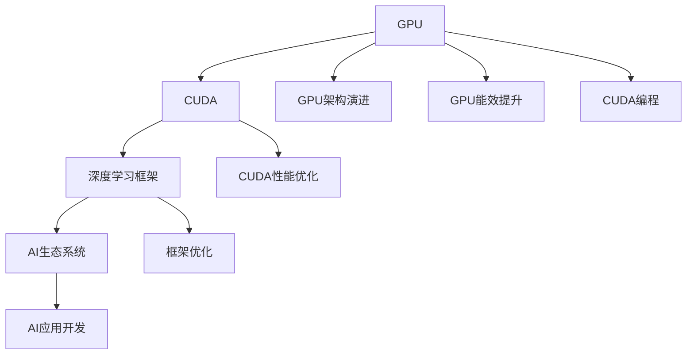

                 

# Nvidia的GPU与AI的发展

Nvidia是一家在全球AI领域占据重要地位的公司，其GPU产品和AI技术的发展历程，充分展示了从底层硬件到应用软件的全栈布局，以及AI技术从实验室到实际应用的全过程。本文将详细介绍Nvidia GPU与AI发展的核心概念、技术原理、实际应用，并探讨其未来趋势和面临的挑战。

## 1. 背景介绍

### 1.1 问题由来

Nvidia的GPU自1995年首次推出以来，经过数十年的发展，已经从最初简单的图形加速器，成长为支持复杂AI计算的强大工具。如今，Nvidia的GPU广泛应用在深度学习、机器学习、计算机视觉、自动驾驶、游戏等领域，推动了AI技术的广泛普及和深度应用。

### 1.2 问题核心关键点

Nvidia GPU与AI发展核心关键点包括以下几个方面：
- **GPU硬件演进**：Nvidia GPU从最初的GeForce 256到目前最新的RTX系列，性能和能效不断提升。
- **CUDA架构**：Nvidia开发的CUDA平台，为GPU提供了高度优化的编程语言和工具，支持深度学习和其他AI任务。
- **深度学习框架**：Nvidia通过自研和合作，支持TensorFlow、PyTorch、MXNet等主流深度学习框架。
- **AI生态系统**：构建了包括云服务、开发工具、教育资源在内的完整AI生态系统。

## 2. 核心概念与联系

### 2.1 核心概念概述

为了更好地理解Nvidia GPU与AI发展，本节将介绍几个关键概念：

- **Nvidia GPU**：由Nvidia公司设计的图形处理单元，主要用于加速图形渲染和深度学习计算。

- **CUDA**：Nvidia开发的一套编程语言和工具，支持在GPU上高效运行并行计算任务。

- **深度学习框架**：如TensorFlow、PyTorch等，这些框架在GPU上运行，利用CUDA实现高效的矩阵计算。

- **AI生态系统**：包括云服务、开发工具、教育资源等，为AI应用提供全方位支持。

这些核心概念之间紧密联系，构成了一个从硬件到软件、从基础研究到应用开发的完整生态。

### 2.2 核心概念原理和架构的 Mermaid 流程图(Mermaid 流程节点中不要有括号、逗号等特殊字符)



## 3. 核心算法原理 & 具体操作步骤

### 3.1 算法原理概述

Nvidia GPU与AI的发展主要依赖于两个核心技术：GPU硬件的持续演进和CUDA平台的不断优化。

GPU的演进从最初的GeForce 256到最新的RTX系列，性能和能效不断提高。每个新型号的GPU都通过增加晶体管数量、改进架构、引入新特性等方式提升性能。同时，Nvidia通过CUDA平台优化，实现了GPU上高效、灵活的编程，支持大规模深度学习任务。

### 3.2 算法步骤详解

Nvidia GPU与AI的开发一般包括以下几个关键步骤：

**Step 1: 选择合适的GPU型号和CUDA版本**
- 根据应用需求选择适合的Nvidia GPU型号。
- 根据硬件配置和应用特性，选择合适的CUDA版本。

**Step 2: 搭建开发环境**
- 安装Nvidia GPU驱动程序和CUDA工具包。
- 安装深度学习框架，如TensorFlow、PyTorch等。

**Step 3: 编写GPU代码**
- 使用CUDA语言编写GPU加速的计算任务。
- 使用深度学习框架提供的API，进行模型定义和训练。

**Step 4: 优化性能**
- 使用CUDA提供的性能分析工具，查找瓶颈。
- 优化代码，提升GPU计算效率。

**Step 5: 部署应用**
- 将训练好的模型部署到目标服务器或云平台。
- 进行性能测试和调优。

### 3.3 算法优缺点

Nvidia GPU与AI的发展具有以下优点：
1. **高性能计算**：Nvidia GPU能够高效地进行矩阵计算和并行处理，适合深度学习等计算密集型任务。
2. **灵活编程**：CUDA平台提供了丰富的编程工具和库，便于开发者编写高效的GPU代码。
3. **广泛应用**：Nvidia GPU和CUDA广泛应用于深度学习、计算机视觉、自动驾驶等领域，推动了AI技术的发展。
4. **生态支持**：Nvidia构建了包括云服务、开发工具、教育资源在内的完整AI生态系统，为开发者提供全方位支持。

同时，Nvidia GPU与AI也面临以下挑战：
1. **成本高昂**：高性能GPU和服务器配置成本较高，限制了小规模企业的应用。
2. **能耗较大**：大规模深度学习任务需要大量GPU并行计算，能耗较大，增加了运营成本。
3. **学习曲线陡峭**：CUDA编程和深度学习框架的使用需要一定的技术背景，新手难以快速上手。

### 3.4 算法应用领域

Nvidia GPU与AI的应用领域非常广泛，涵盖了深度学习、计算机视觉、自然语言处理、自动驾驶等多个领域。以下是一些主要应用场景：

- **深度学习**：训练大规模神经网络，如图像识别、语音识别、自然语言处理等。
- **计算机视觉**：进行图像处理、目标检测、语义分割等任务。
- **自动驾驶**：处理传感器数据，进行环境感知和决策。
- **游戏**：加速图形渲染，提升游戏帧率和视觉效果。
- **科学研究**：进行科学计算和数据处理，加速科学发现。

## 4. 数学模型和公式 & 详细讲解 & 举例说明

### 4.1 数学模型构建

在深度学习任务中，通常使用卷积神经网络(CNN)、循环神经网络(RNN)、变分自编码器(VAE)等模型。这些模型的数学模型构建如下：

- **卷积神经网络**：输入数据通过卷积层、池化层、全连接层进行特征提取和分类。
- **循环神经网络**：输入数据通过循环结构进行序列建模，输出预测结果。
- **变分自编码器**：通过编码器和解码器，学习数据的隐含表示。

### 4.2 公式推导过程

以卷积神经网络为例，假设输入数据为$x$，卷积层权重为$w$，输出特征图为$y$，则卷积运算可以表示为：

$$
y = f(\sum_{i,j} w_{i,j} x_{i,j})
$$

其中$f$为激活函数，$x_{i,j}$为输入数据在位置$(i,j)$的值，$w_{i,j}$为卷积核权重在位置$(i,j)$的值。

### 4.3 案例分析与讲解

以图像分类任务为例，假设输入数据为图像$x$，标签为$y$，网络结构为CNN，使用softmax函数进行分类，则损失函数为：

$$
L = -\frac{1}{N} \sum_{i=1}^N \sum_{j=1}^C y_{i,j} \log p_{i,j}
$$

其中$N$为样本数，$C$为类别数，$p_{i,j}$为模型预测的概率。

通过不断优化损失函数，更新网络参数，模型能够逐渐学习到图像的特征表示，并准确分类。

## 5. 项目实践：代码实例和详细解释说明

### 5.1 开发环境搭建

在Nvidia GPU上进行AI开发，需要先安装GPU驱动程序和CUDA工具包。以下是一个示例：

```bash
# 安装Nvidia GPU驱动程序
sudo apt-get install nvidia-cuda-drivers
# 安装CUDA工具包
sudo apt-get install nvidia-cuda-toolkit
```

### 5.2 源代码详细实现

以TensorFlow在Nvidia GPU上的深度学习为例，以下是一个简单的代码实现：

```python
import tensorflow as tf
from tensorflow.keras import layers

# 定义卷积神经网络模型
model = tf.keras.Sequential([
    layers.Conv2D(32, (3, 3), activation='relu', input_shape=(28, 28, 1)),
    layers.MaxPooling2D((2, 2)),
    layers.Conv2D(64, (3, 3), activation='relu'),
    layers.MaxPooling2D((2, 2)),
    layers.Conv2D(64, (3, 3), activation='relu'),
    layers.Flatten(),
    layers.Dense(64, activation='relu'),
    layers.Dense(10, activation='softmax')
])

# 编译模型
model.compile(optimizer='adam',
              loss='sparse_categorical_crossentropy',
              metrics=['accuracy'])

# 训练模型
model.fit(x_train, y_train, epochs=10, validation_data=(x_test, y_test))
```

### 5.3 代码解读与分析

以上代码首先定义了一个简单的卷积神经网络模型，包括卷积层、池化层、全连接层等。然后编译模型，使用adam优化器，交叉熵损失函数。最后训练模型，使用10个epoch进行训练，并使用测试集进行验证。

### 5.4 运行结果展示

训练完成后，可以通过模型进行预测，例如：

```python
import numpy as np

# 对新数据进行预测
x_new = np.reshape(np.random.rand(1, 28, 28, 1), (1, 28, 28, 1))
y_new = model.predict(x_new)
```

## 6. 实际应用场景

### 6.1 自动驾驶

在自动驾驶领域，Nvidia GPU被广泛应用于环境感知、决策制定和控制等环节。通过并行计算，GPU能够实时处理来自各种传感器的大量数据，实现快速、准确的决策。

### 6.2 科学研究

在科学研究中，Nvidia GPU加速了科学计算和数据处理，例如通过深度学习算法进行药物发现、基因分析等。GPU的高并行性和大内存带宽，使得科学研究更加高效和精确。

### 6.3 游戏

在游戏中，Nvidia GPU加速了图形渲染和实时计算，提升了游戏的帧率和视觉效果，带来了更加沉浸式的游戏体验。

### 6.4 未来应用展望

未来，Nvidia GPU与AI的发展将进一步深化，推动AI技术在更多领域的应用：

- **边缘计算**：将AI模型部署到嵌入式设备中，实现实时数据处理和决策。
- **AI芯片**：开发专门的AI芯片，进一步提升计算效率和能效。
- **跨领域融合**：将AI技术与其他技术（如区块链、物联网等）结合，实现更广泛的应用。

## 7. 工具和资源推荐

### 7.1 学习资源推荐

1. **《深度学习》课程**：Coursera和edX等在线课程平台提供的深度学习课程，涵盖GPU编程和深度学习算法。
2. **Nvidia Developer Guide**：Nvidia官方提供的开发指南，详细介绍了CUDA和深度学习框架的使用。
3. **TensorFlow文档**：TensorFlow官方文档，包含丰富的教程和示例，适合初学者学习。

### 7.2 开发工具推荐

1. **Visual Studio Code**：流行的代码编辑器，支持GPU编程和深度学习框架。
2. **Jupyter Notebook**：支持在云端进行深度学习研究和实验，方便共享和协作。
3. **PyCharm**：专业的Python开发工具，支持GPU编程和深度学习框架。

### 7.3 相关论文推荐

1. **《CUDA并行编程》**：Nvidia发布的并行编程指南，详细介绍了CUDA的使用。
2. **《深度学习加速》**：Nvidia的研究论文，介绍了在GPU上进行深度学习的优化方法。
3. **《GPU高性能计算》**：深度学习领域的经典书籍，介绍了GPU硬件和编程技术。

## 8. 总结：未来发展趋势与挑战

### 8.1 研究成果总结

Nvidia GPU与AI的发展，推动了深度学习和其他AI技术在各个领域的广泛应用，显著提升了计算效率和应用效果。GPU硬件的不断演进和CUDA平台的不断优化，为开发者提供了高效、灵活的计算工具。

### 8.2 未来发展趋势

未来，Nvidia GPU与AI将进一步发展，呈现以下趋势：

1. **边缘计算**：随着物联网和5G技术的发展，边缘计算将成为AI应用的重要方向。
2. **AI芯片**：专门为AI设计的芯片将进一步提升计算效率和能效，降低成本。
3. **跨领域融合**：AI技术与其它技术的融合，将拓展AI应用场景，提升应用价值。

### 8.3 面临的挑战

Nvidia GPU与AI的发展也面临一些挑战：

1. **成本问题**：高性能GPU和服务器配置成本较高，限制了小规模企业的应用。
2. **能耗问题**：大规模深度学习任务需要大量GPU并行计算，能耗较大，增加了运营成本。
3. **学习曲线陡峭**：CUDA编程和深度学习框架的使用需要一定的技术背景，新手难以快速上手。

### 8.4 研究展望

未来，Nvidia GPU与AI的研究将集中在以下几个方面：

1. **边缘计算优化**：优化边缘计算环境下的GPU使用，提高计算效率和能效。
2. **AI芯片设计**：设计和开发更高效的AI芯片，降低成本和能耗。
3. **跨领域应用**：将AI技术与其它技术结合，拓展AI应用场景，提升应用价值。

## 9. 附录：常见问题与解答

**Q1：Nvidia GPU与AI的发展是否存在成本问题？**

A: 是的，高性能GPU和服务器配置成本较高，限制了小规模企业的应用。Nvidia正在努力通过优化硬件和开发性价比更高的解决方案，降低成本。

**Q2：Nvidia GPU与AI的发展如何应对能耗问题？**

A: 大规模深度学习任务需要大量GPU并行计算，能耗较大。Nvidia通过优化GPU架构和算法，提升计算效率，降低能耗。同时，Nvidia也在开发新的AI芯片，以进一步提升计算效率和能效。

**Q3：Nvidia GPU与AI的发展面临哪些技术挑战？**

A: 学习曲线陡峭，CUDA编程和深度学习框架的使用需要一定的技术背景，新手难以快速上手。Nvidia正在通过开发更多的教育资源和工具，降低学习难度，帮助更多人快速上手。

**Q4：Nvidia GPU与AI的发展未来有哪些趋势？**

A: 边缘计算、AI芯片设计、跨领域应用等将成为未来发展的重要方向。Nvidia正在积极布局这些领域，推动AI技术的更广泛应用。

---

作者：禅与计算机程序设计艺术 / Zen and the Art of Computer Programming

