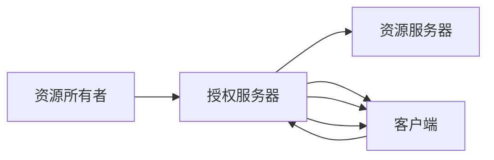

                 

# OAuth 2.0 的基本概念

在数字世界中，用户的数据安全和个人隐私保护一直是重要的议题。随着互联网应用的日益普及，如何在不同服务之间安全、便捷地共享身份信息，成为了一个迫切需要解决的问题。为此，OAuth 2.0协议应运而生，成为当前最广泛使用的身份认证与授权标准之一。本文将从背景介绍、核心概念、算法原理、操作步骤、应用领域等各个方面，系统地解析OAuth 2.0的基本概念，帮助读者全面理解这一重要协议。

## 1. 背景介绍

### 1.1 身份认证与授权需求
随着互联网应用的增多，用户需要跨多个网站和应用进行登录验证，这带来了极大的不便。同时，在用户授权给第三方应用访问自身数据时，如何保证数据安全，也成为了一个重要问题。这些需求推动了OAuth 2.0协议的产生，以实现更加安全和便捷的身份认证与授权机制。

### 1.2 发展历史
OAuth 2.0由OAuth工作组于2007年首次提出，并在2008年正式发布。它是在OAuth 1.0的基础上进行了改进和扩展，更加注重安全性、可扩展性和灵活性。此后，OAuth 2.0协议逐渐成为最主流的身份认证与授权协议之一，广泛应用于社交媒体、云服务、移动应用等多个领域。

## 2. 核心概念与联系

### 2.1 核心概念概述
OAuth 2.0主要涉及以下核心概念：

- **资源所有者**：即用户，拥有某个资源（如电子邮件、照片等）。
- **客户端**：需要访问用户资源的第三方应用，如社交媒体、云存储等。
- **授权服务器**：负责验证用户身份，并根据用户授权决定是否允许客户端访问其资源。
- **资源服务器**：存储用户资源，并向授权服务器提供资源访问令牌。

### 2.2 Mermaid流程图(Mermaid 流程节点中不要有括号、逗号等特殊字符)



## 3. 核心算法原理 & 具体操作步骤

### 3.1 算法原理概述
OAuth 2.0协议基于客户端-服务器模型，主要通过访问令牌(Access Token)来授权客户端访问用户资源。其核心流程包括注册、授权、获取令牌、使用令牌等步骤，确保了身份认证与授权的安全性和灵活性。

### 3.2 算法步骤详解
OAuth 2.0的具体操作步骤如下：

**Step 1: 注册**
- 客户端向授权服务器注册，获取客户端ID和密钥。

**Step 2: 授权请求**
- 客户端引导用户授权，请求授权服务器颁发访问令牌。

**Step 3: 获取令牌**
- 授权服务器验证用户身份，并向客户端颁发访问令牌。

**Step 4: 使用令牌**
- 客户端使用访问令牌向资源服务器请求资源访问。

### 3.3 算法优缺点
OAuth 2.0具有以下优点：

- 安全性高：通过使用访问令牌，实现了客户端与用户资源的分离，提高了系统的安全性。
- 可扩展性强：支持多种授权类型，如授权码、隐式授权、密码授权等，适应不同的应用场景。
- 灵活性好：允许用户在不同应用之间共享资源，提供了更灵活的身份认证与授权方案。

同时，OAuth 2.0也存在一些缺点：

- 复杂度高：协议较为复杂，需要较高的技术水平来理解和实现。
- 隐私问题：用户授权访问后，可能无法完全控制数据的使用方式。

### 3.4 算法应用领域
OAuth 2.0被广泛应用于各种需要身份认证与授权的场景，如：

- 社交媒体：用户通过授权第三方应用访问其社交网络数据。
- 云服务：用户授权第三方应用访问其存储在云端的资源。
- 移动应用：用户在移动应用中授权第三方应用访问其个人数据。

## 4. 数学模型和公式 & 详细讲解 & 举例说明

### 4.1 数学模型构建
OAuth 2.0的核心在于通过访问令牌来实现用户资源的授权访问。令牌通常包含一个唯一标识、有效期、签发方等信息，用于验证客户端的身份和权限。令牌的签发和验证通常基于数字签名技术，保证其安全性。

### 4.2 公式推导过程
令牌签发和验证的基本过程如下：

1. **令牌签发**：
   - 授权服务器生成一个随机令牌，并使用其私钥对其进行签名。
   - 将令牌及其相关信息（如有效期）返回给客户端。

2. **令牌验证**：
   - 客户端在请求资源时，将令牌及其签名发送给资源服务器。
   - 资源服务器使用授权服务器的公钥对令牌进行验证，如果签名有效且令牌未过期，则授权访问。

### 4.3 案例分析与讲解
假设一个社交媒体应用想要访问用户的照片数据，可以按照以下步骤进行：

1. **注册**：社交媒体应用向授权服务器注册，获取客户端ID和密钥。
2. **授权请求**：用户在社交媒体应用中授权访问其照片数据。
3. **获取令牌**：授权服务器验证用户身份，并颁发访问令牌。
4. **使用令牌**：社交媒体应用使用访问令牌向资源服务器请求照片数据。

## 5. 项目实践：代码实例和详细解释说明

### 5.1 开发环境搭建

要实现OAuth 2.0协议，需要一个开发环境来搭建和测试系统。以下是一个简单的搭建过程：

1. 安装Python和Flask框架。
2. 创建两个Flask应用：一个作为授权服务器，一个作为资源服务器。
3. 配置OAuth 2.0所需的密钥和令牌。

### 5.2 源代码详细实现

以下是OAuth 2.0协议的Python实现代码示例：

```python
from flask import Flask, request, jsonify

app = Flask(__name__)

# 模拟授权服务器
app.config['CLIENT_ID'] = 'client_id'
app.config['CLIENT_SECRET'] = 'client_secret'

# 模拟资源服务器
app.config['RESOURCE_ID'] = 'resource_id'

@app.route('/oauth/authorize')
def authorize():
    if request.args.get('code') is None:
        return jsonify({'error': 'Missing authorization code'}), 400
    else:
        # 根据授权码生成令牌
        token = generate_token(request.args.get('code'))
        return jsonify({'token': token}), 200

@app.route('/resource')
def resource():
    if request.headers.get('Authorization') is None:
        return jsonify({'error': 'Missing authorization header'}), 401
    else:
        # 解析令牌并验证
        token = parse_token(request.headers.get('Authorization'))
        if token is None:
            return jsonify({'error': 'Invalid token'}), 403
        else:
            # 返回资源数据
            return jsonify({'resource': 'Resource data'}), 200

def generate_token(code):
    # 使用预定义的密钥和算法生成令牌
    return f'access_token={app.config['CLIENT_ID']}:resource_id'

def parse_token(auth_header):
    # 解析授权令牌，验证其签名和有效期
    parts = auth_header.split(':')
    if len(parts) != 2:
        return None
    client_id, token = parts
    if token != generate_token(client_id):
        return None
    # 在此处验证令牌有效期
    if is_token_valid(token):
        return token
    else:
        return None

def is_token_valid(token):
    # 在此处实现令牌有效期的验证
    return True
```

### 5.3 代码解读与分析
上述代码实现了OAuth 2.0协议的基本功能，包括令牌的签发和验证。具体分析如下：

- `authorize`函数处理授权请求，生成令牌。
- `resource`函数处理资源访问请求，解析令牌并验证。
- `generate_token`函数使用客户端ID和资源ID生成访问令牌。
- `parse_token`函数解析授权令牌，并验证其签名和有效期。
- `is_token_valid`函数验证令牌的有效性。

### 5.4 运行结果展示
在实际运行时，授权服务器和资源服务器将分别接收和处理授权请求和资源访问请求。通过使用访问令牌，用户的数据得到了有效的保护。

## 6. 实际应用场景

### 6.1 社交媒体应用

在社交媒体应用中，用户需要授权第三方应用访问其社交网络数据。OAuth 2.0协议使得这一过程更加安全和便捷。用户只需授权一次，即可在多个应用中共享其社交网络信息。

### 6.2 云存储服务

云存储服务允许用户将文件存储在云端，并授权第三方应用访问这些文件。OAuth 2.0协议提供了安全的访问机制，确保用户数据的安全性。

### 6.3 移动应用

移动应用常常需要访问用户的个人数据，如联系人、照片等。OAuth 2.0协议允许用户授权移动应用访问其数据，同时也保护了用户的隐私。

## 7. 工具和资源推荐

### 7.1 学习资源推荐

要深入理解OAuth 2.0协议，推荐以下学习资源：

- 《OAuth 2.0协议指南》：详细介绍了OAuth 2.0协议的基本概念和实现方法。
- 《OAuth 2.0安全实践》：介绍了OAuth 2.0协议的安全性和最佳实践。
- 《OAuth 2.0实战》：提供了OAuth 2.0协议的实现案例和代码示例。

### 7.2 开发工具推荐

实现OAuth 2.0协议需要一些常用的开发工具：

- Flask：轻量级的Python Web框架，适合快速开发OAuth 2.0应用。
- PyJWT：Python库，用于生成和验证JWT令牌。
- OpenSSL：开源加密库，用于实现OAuth 2.0中的数字签名。

### 7.3 相关论文推荐

以下是一些相关的OAuth 2.0协议的论文，推荐阅读：

- OAuth 2.0协议规范：详细描述了OAuth 2.0协议的各个方面。
- OAuth 2.0安全性分析：对OAuth 2.0协议的安全性进行了详细分析。
- OAuth 2.0扩展性研究：探讨了OAuth 2.0协议的可扩展性。

## 8. 总结：未来发展趋势与挑战

### 8.1 研究成果总结

OAuth 2.0协议自发布以来，已经成为事实上的身份认证与授权标准，广泛应用于各种场景。其主要研究成果包括：

- 安全的授权机制：通过访问令牌实现了客户端与用户资源的分离。
- 灵活的授权类型：支持多种授权方式，适应不同的应用场景。
- 广泛的适用性：应用于社交媒体、云服务、移动应用等多个领域。

### 8.2 未来发展趋势

未来，OAuth 2.0协议的发展趋势可能包括：

- 安全性提升：随着攻击手段的不断进化，OAuth 2.0协议将进一步加强安全性。
- 跨平台支持：支持更多平台和设备，提高用户体验。
- 应用场景扩展：应用于更多领域，如物联网、车联网等。

### 8.3 面临的挑战

尽管OAuth 2.0协议已经取得了一定的成果，但其仍面临以下挑战：

- 复杂性：协议本身较为复杂，需要较高的技术水平来实现。
- 隐私问题：用户授权访问后，可能无法完全控制数据的使用方式。
- 兼容性：不同应用之间的兼容性问题，可能会影响用户体验。

### 8.4 研究展望

未来的研究方向可能包括：

- 简化协议：进一步简化OAuth 2.0协议，降低实现难度。
- 增强隐私保护：开发隐私保护技术，确保用户数据的安全性。
- 扩展应用场景：将OAuth 2.0协议应用于更多领域，推动其发展。

## 9. 附录：常见问题与解答

**Q1: OAuth 2.0协议的基本流程是怎样的？**

A: OAuth 2.0协议的基本流程包括注册、授权请求、获取令牌、使用令牌等步骤。具体流程如下：

1. **注册**：客户端向授权服务器注册，获取客户端ID和密钥。
2. **授权请求**：客户端引导用户授权，请求授权服务器颁发访问令牌。
3. **获取令牌**：授权服务器验证用户身份，并颁发访问令牌。
4. **使用令牌**：客户端使用访问令牌向资源服务器请求资源访问。

**Q2: OAuth 2.0协议的优势有哪些？**

A: OAuth 2.0协议的优势包括：

- 安全性高：通过使用访问令牌，实现了客户端与用户资源的分离，提高了系统的安全性。
- 可扩展性强：支持多种授权类型，如授权码、隐式授权、密码授权等，适应不同的应用场景。
- 灵活性好：允许用户在不同应用之间共享资源，提供了更灵活的身份认证与授权方案。

**Q3: OAuth 2.0协议的主要应用场景有哪些？**

A: OAuth 2.0协议的主要应用场景包括：

- 社交媒体：用户通过授权第三方应用访问其社交网络数据。
- 云服务：用户授权第三方应用访问其存储在云端的资源。
- 移动应用：用户在移动应用中授权第三方应用访问其个人数据。

**Q4: OAuth 2.0协议与OAuth 1.0协议的主要区别是什么？**

A: OAuth 2.0协议与OAuth 1.0协议的主要区别包括：

- 安全性：OAuth 2.0协议使用访问令牌，OAuth 1.0协议使用签名。
- 可扩展性：OAuth 2.0协议支持更多授权类型，OAuth 1.0协议仅支持一种。
- 实现复杂度：OAuth 2.0协议实现相对简单，OAuth 1.0协议较为复杂。

**Q5: OAuth 2.0协议如何保证安全性？**

A: OAuth 2.0协议主要通过访问令牌来实现安全性：

- 访问令牌由授权服务器签发，并使用其私钥进行数字签名。
- 客户端在请求资源时，将访问令牌及其签名发送给资源服务器，资源服务器使用授权服务器的公钥进行验证。
- 访问令牌包含有效期，防止令牌被滥用。

---

作者：禅与计算机程序设计艺术 / Zen and the Art of Computer Programming

