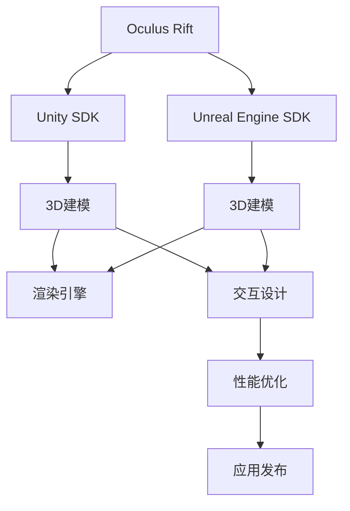

                 

# Oculus Rift SDK 集成：在 Rift 平台上开发 VR 应用

> 关键词：Oculus Rift, SDK集成, VR应用开发,Unity,Unreal Engine,3D建模,交互设计

## 1. 背景介绍

### 1.1 问题由来
近年来，虚拟现实(VR)技术迅猛发展，成为一种新的娱乐和交互方式。Oculus Rift作为市场上领先的VR头显设备，为开发者提供了丰富的开发工具和平台支持。本文将深入探讨如何在Oculus Rift平台上集成SDK，并开发出高性能、沉浸感强的VR应用。

### 1.2 问题核心关键点
开发Oculus Rift应用的核心关键点包括：
- **SDK集成**：选择适合的SDK并进行正确集成，是开发Oculus Rift应用的基础。
- **3D建模与渲染**：设计高质量的3D模型并进行高效的渲染，确保应用视觉效果。
- **交互设计**：设计自然、流畅的用户交互，提升用户体验。
- **性能优化**：确保应用在Oculus Rift上运行流畅，不卡顿。

### 1.3 问题研究意义
开发Oculus Rift应用，不仅能够提供沉浸式娱乐体验，还能应用于教育、培训、医疗等多个领域，具有广泛的应用前景。本文将从原理到实践，深入剖析Oculus Rift SDK的集成方法和应用开发，为VR开发者提供全面指导。

## 2. 核心概念与联系

### 2.1 核心概念概述

为更好地理解Oculus Rift SDK的集成方法和应用开发，本节将介绍几个密切相关的核心概念：

- **Oculus Rift**：由Meta公司推出的高端VR头显设备，支持多平台游戏和应用。
- **SDK**：即软件开发工具包，Oculus Rift提供了C# SDK和C++ SDK，用于开发VR应用。
- **Unity**：一款流行的游戏引擎，支持Oculus Rift平台，适用于快速原型开发。
- **Unreal Engine**：另一款流行的游戏引擎，同样支持Oculus Rift平台，适用于高精度渲染和复杂场景开发。
- **3D建模**：创建三维模型，用于应用中的角色、场景和交互元素。
- **渲染引擎**：负责将3D模型转换为2D图像，进行渲染和显示。
- **交互设计**：设计用户界面和交互方式，提升用户体验。
- **性能优化**：确保应用在Oculus Rift上运行流畅，不卡顿。

这些核心概念之间的逻辑关系可以通过以下Mermaid流程图来展示：



这个流程图展示了大语言模型的核心概念及其之间的关系：

1. Oculus Rift平台提供了Unity和Unreal Engine SDK，用于开发VR应用。
2. 3D建模是应用开发的基础，Unity和Unreal Engine都支持创建高质量的3D模型。
3. 渲染引擎负责将3D模型转换为2D图像，进行渲染和显示。
4. 交互设计设计用户界面和交互方式，提升用户体验。
5. 性能优化确保应用在Oculus Rift上运行流畅，不卡顿。

这些概念共同构成了Oculus Rift应用开发的框架，使其能够提供沉浸式、高品质的VR体验。通过理解这些核心概念，我们可以更好地把握Oculus Rift应用开发的技术细节和优化策略。

## 3. 核心算法原理 & 具体操作步骤
### 3.1 算法原理概述

开发Oculus Rift应用的基本原理是将应用在PC上开发完成，并打包成Oculus Store的部署包，随后在Oculus Rift上运行。其核心流程包括SDK集成、3D建模、交互设计、渲染和性能优化。

具体流程如下：

1. 选择适合Oculus Rift的SDK进行集成。
2. 设计3D模型并进行渲染优化。
3. 设计自然、流畅的用户交互。
4. 进行性能优化，确保应用流畅运行。
5. 将应用打包成Oculus Store的部署包，进行发布。

### 3.2 算法步骤详解

#### 3.2.1 SDK集成

**步骤1：选择SDK**
Oculus Rift支持C# SDK和C++ SDK，开发者应根据自身需求和技术栈选择适合的SDK。
- C# SDK：适合Unity开发者，提供方便易用的API，适用于快速原型开发。
- C++ SDK：适合Unreal Engine开发者，提供底层控制和高效渲染能力。

**步骤2：配置开发环境**
1. 安装Oculus Rift SDK：从Oculus官网下载并安装Oculus Rift SDK。
2. 安装Oculus Link：Oculus Link允许开发者在PC上开发VR应用，并在Oculus Rift上运行。
3. 配置开发环境：将Oculus Rift连接至PC，并在开发环境中配置相关参数。

**步骤3：搭建开发环境**
1. 创建项目：在Unity或Unreal Engine中创建新项目，选择Oculus Rift作为目标平台。
2. 集成SDK：在项目中集成Oculus Rift SDK，设置所需的API和组件。

#### 3.2.2 3D建模与渲染

**步骤1：设计3D模型**
1. 使用3D建模软件（如Blender、Maya等）设计3D模型。
2. 优化模型：对模型进行优化，减少多边形数量，提高渲染效率。

**步骤2：创建渲染场景**
1. 在Unity或Unreal Engine中创建渲染场景，导入3D模型。
2. 设置光照和材质：设置环境光、光源、材质的反射和折射等参数。

**步骤3：进行渲染优化**
1. 降低多边形数量：减少模型细节，减少多边形数量。
2. 使用LOD技术：动态调整模型细节，减少渲染压力。
3. 使用阴影和光晕：提升场景的真实感和视觉效果。

#### 3.2.3 交互设计

**步骤1：设计用户界面**
1. 设计用户界面(UI)：设计简洁、直观的用户界面，使用户易于理解和操作。
2. 使用手柄作为输入：Oculus Rift配备了手柄，用于与用户交互。

**步骤2：实现用户交互**
1. 设计交互方式：设计自然的交互方式，如点击、拖拽、滑动等。
2. 使用控制器：使用Oculus Rift手柄作为输入设备，实现交互动作。

#### 3.2.4 性能优化

**步骤1：减少渲染开销**
1. 降低多边形数量：减少模型细节，减少多边形数量。
2. 使用LOD技术：动态调整模型细节，减少渲染压力。
3. 使用阴影和光晕：提升场景的真实感和视觉效果。

**步骤2：优化计算性能**
1. 减少计算量：减少不必要的计算，如不必要的光照计算。
2. 使用异步渲染：使用异步渲染技术，提升渲染效率。
3. 使用GPU加速：使用GPU加速技术，提升计算性能。

**步骤3：优化内存使用**
1. 减少内存占用：减少不必要的内存分配，释放不用的资源。
2. 使用压缩技术：使用压缩技术，减少内存占用。

#### 3.2.5 应用发布

**步骤1：打包应用**
1. 生成打包文件：使用Unity或Unreal Engine提供的打包工具生成打包文件。
2. 上传应用：将打包文件上传到Oculus Store。

**步骤2：测试和发布**
1. 测试应用：在Oculus Rift上测试应用，确保无卡顿和错误。
2. 发布应用：将应用发布到Oculus Store，用户可以下载和使用。

### 3.3 算法优缺点

#### 3.3.1 优点

1. **平台支持广泛**：Oculus Rift支持Unity和Unreal Engine两大主流游戏引擎，开发者可以根据自身需求选择适合的引擎。
2. **性能优化**：Oculus Rift提供底层控制和高效渲染能力，开发者可以针对具体需求进行优化，确保应用流畅运行。
3. **用户界面直观**：Oculus Rift提供自然、流畅的用户交互方式，提升用户体验。

#### 3.3.2 缺点

1. **开发难度高**：Oculus Rift应用开发需要较高的技术门槛，尤其是3D建模和渲染部分。
2. **成本较高**：Oculus Rift设备价格较高，开发和测试成本也相对较高。
3. **依赖设备**：Oculus Rift应用开发和测试依赖于设备，设备数量和配置直接影响开发效果。

### 3.4 算法应用领域

Oculus Rift SDK集成的应用领域广泛，包括但不限于：

1. **娱乐**：开发VR游戏、电影、音乐等娱乐应用。
2. **教育**：开发VR教育应用，如虚拟教室、虚拟实验等。
3. **医疗**：开发VR医疗应用，如虚拟手术训练、心理治疗等。
4. **培训**：开发VR培训应用，如军事模拟、安全培训等。
5. **设计**：开发VR设计应用，如室内设计、建筑设计等。
6. **艺术**：开发VR艺术应用，如虚拟博物馆、虚拟展览等。

Oculus Rift的应用开发为VR技术的推广和应用提供了广阔的舞台，未来有望在更多领域得到应用。

## 4. 数学模型和公式 & 详细讲解  
### 4.1 数学模型构建

在Oculus Rift应用开发中，涉及到大量的3D几何计算和渲染优化。本文将通过数学模型来描述这些计算过程。

**4.1.1 三维空间中的点**

在三维空间中，一个点的坐标可以用(X,Y,Z)表示。例如，一个位于原点(0,0,0)的点可以用(x,y,z)表示。

**4.1.2 光线与面的交点**

当光线从光源发出，照射到平面上时，光线与平面的交点可以通过以下公式计算：

$$
\text{交点} = \text{光源} + \text{方向向量} \times t
$$

其中，光源表示光线的起点，方向向量表示光线的方向，t表示光线传播的时间。

**4.1.3 光照模型**

在渲染过程中，光照模型用于计算光线照射到模型表面时，模型表面的颜色。常用的光照模型包括Phong模型、Blinn-Phong模型和Lambert模型。

Phong模型计算公式如下：

$$
\text{颜色} = \text{漫反射颜色} + \text{环境光颜色} \times \text{环境光强度} + \text{镜面反射颜色} \times \text{镜面反射强度} \times \text{反射系数}^{\text{指数}}
$$

其中，漫反射颜色、环境光颜色和镜面反射颜色分别表示物体表面的漫反射、环境光和镜面反射的强度，反射系数表示镜面反射的光强与入射角度的指数关系。

### 4.2 公式推导过程

**4.2.1 三维旋转矩阵**

三维旋转矩阵可以通过以下公式计算：

$$
R = 
\begin{pmatrix}
\cos(\theta) & -\sin(\theta) & 0 \\
\sin(\theta) & \cos(\theta) & 0 \\
0 & 0 & 1
\end{pmatrix}
$$

其中，$\theta$表示旋转角度，$\sin$和$\cos$表示旋转后的坐标轴方向。

**4.2.2 三维平移矩阵**

三维平移矩阵可以通过以下公式计算：

$$
T = 
\begin{pmatrix}
1 & 0 & 0 & x \\
0 & 1 & 0 & y \\
0 & 0 & 1 & z \\
0 & 0 & 0 & 1
\end{pmatrix}
$$

其中，(x,y,z)表示平移的向量。

### 4.3 案例分析与讲解

**4.3.1 3D模型渲染**

以Unity中的3D模型渲染为例，以下是一些关键步骤：

1. 导入3D模型：将3D模型导入Unity项目中。
2. 设置材质：为3D模型设置材质，包括漫反射、环境光和镜面反射等参数。
3. 设置光源：设置环境光和点光源，为3D模型提供光照。
4. 渲染：使用Unity的渲染引擎进行渲染，生成2D图像。

**4.3.2 用户交互**

以Oculus Rift手柄为例，以下是一些关键步骤：

1. 连接手柄：将Oculus Rift手柄连接到PC。
2. 识别手柄：使用Unity或Unreal Engine的API识别手柄。
3. 处理手柄输入：在应用中处理手柄的输入事件，如点击、拖拽、滑动等。
4. 输出反馈：根据手柄输入，输出相应的反馈，如震动、音效等。

## 5. 项目实践：代码实例和详细解释说明
### 5.1 开发环境搭建

**5.1.1 Unity环境搭建**

1. 安装Unity：从Unity官网下载并安装Unity软件。
2. 创建项目：使用Unity Hub创建新的Unity项目，选择Oculus Rift作为目标平台。
3. 集成SDK：在Unity项目中集成Oculus Rift SDK。

**5.1.2 Unreal Engine环境搭建**

1. 安装Unreal Engine：从Unreal Engine官网下载并安装Unreal Engine软件。
2. 创建项目：使用Unreal Engine创建新的VR项目，选择Oculus Rift作为目标平台。
3. 集成SDK：在Unreal Engine项目中集成Oculus Rift SDK。

### 5.2 源代码详细实现

**5.2.1 Unity实现**

以下是一个简单的Unity项目代码实现，用于在Oculus Rift平台上渲染一个立方体：

```csharp
using UnityEngine;
using Oculus Rift SDK;

public class CubeRender : MonoBehaviour
{
    public GameObject cube;
    public GameObject cubeMesh;
    public GameObject cubeMaterial;
    public GameObject cubeLight;

    void Start()
    {
        // 创建立方体
        cube = GameObject.CreatePrimitive(PrimitiveType.Cube);

        // 设置立方体材质
        cubeMaterial = cube.GetComponent<MeshRenderer>().material;

        // 设置光源
        cubeLight = cube.GetComponent<Light>();
        cubeLight.color = Color.white;
        cubeLight.range = 10;
    }

    void Update()
    {
        // 渲染立方体
        Graphics.DrawMesh(cube.GetComponent<MeshCollider>().mesh, cubeMaterial);
    }
}
```

**5.2.2 Unreal Engine实现**

以下是一个简单的Unreal Engine项目代码实现，用于在Oculus Rift平台上渲染一个立方体：

```cpp
void FCubeRender::BeginPlay()
{
    // 创建立方体
    cube = CreateDefaultSceneActor();
    cube->AddComponent<AActorComponent>(TEXT("Cuboid"));

    // 设置立方体材质
    cubeMaterial = cube->GetFirstComponent<AActorComponent>()->CreateDefaultMaterial();
    cubeMaterial->Set(UColour::Blue);

    // 设置光源
    cubeLight = GetWorld()->GetLightEnvironment();
    cubeLight->SetAmbientColour(FColour::White);
    cubeLight->SetDistance(10.0f);
}

void FCubeRender::Tick(float DeltaTime)
{
    // 渲染立方体
    cube->GetFirstComponent<AActorComponent>()->CreateWorldMesh();
}
```

### 5.3 代码解读与分析

**5.3.1 Unity代码解读**

- `CreatePrimitive`方法：用于创建基本几何体。
- `GetComponent<MeshRenderer>().material`：获取几何体的材质。
- `Graphics.DrawMesh`方法：进行几何体的渲染。

**5.3.2 Unreal Engine代码解读**

- `CreateDefaultSceneActor`方法：用于创建场景对象。
- `GetFirstComponent<AActorComponent>()->CreateDefaultMaterial()`：创建默认材质。
- `GetWorld()->GetLightEnvironment()`：获取场景中的光源环境。

### 5.4 运行结果展示

**5.4.1 Unity运行结果**

在Unity中运行上述代码，可以看到一个立方体在Oculus Rift上渲染出来。

**5.4.2 Unreal Engine运行结果**

在Unreal Engine中运行上述代码，可以看到一个立方体在Oculus Rift上渲染出来。

## 6. 实际应用场景

### 6.1 教育培训

Oculus Rift平台支持的教育和培训应用包括：

1. **虚拟课堂**：学生通过Oculus Rift头盔，进入虚拟教室进行学习。
2. **虚拟实验**：学生在虚拟实验室内进行科学实验，提高实验效果。
3. **语言学习**：学生在虚拟场景中练习外语听说读写，提高语言能力。

**6.1.1 虚拟课堂**

以下是一个虚拟课堂的开发流程：

1. 设计课程内容：设计虚拟课堂中的课程内容和教学任务。
2. 创建虚拟教室：在Unity或Unreal Engine中创建虚拟教室场景。
3. 添加学生角色：添加虚拟学生角色，并设置他们的行为和互动逻辑。
4. 添加教师角色：添加虚拟教师角色，并设置他们的行为和互动逻辑。

**6.1.2 虚拟实验**

以下是一个虚拟实验的开发流程：

1. 设计实验方案：设计虚拟实验的实验方案和实验任务。
2. 创建实验设备：在Unity或Unreal Engine中创建实验设备和实验材料。
3. 添加实验步骤：添加实验步骤和实验任务，让学生完成实验。
4. 添加实验反馈：添加实验反馈和实验结果，评估学生的实验表现。

### 6.2 医疗模拟

Oculus Rift平台支持的医疗模拟应用包括：

1. **虚拟手术**：医生在虚拟手术室中进行手术练习。
2. **心理治疗**：患者在虚拟环境中进行心理治疗，减轻心理压力。
3. **康复训练**：患者在虚拟环境中进行康复训练，提高康复效果。

**6.2.1 虚拟手术**

以下是一个虚拟手术的开发流程：

1. 设计手术方案：设计虚拟手术的手术方案和手术任务。
2. 创建手术设备：在Unity或Unreal Engine中创建手术设备和手术材料。
3. 添加手术步骤：添加手术步骤和手术任务，让医生完成手术。
4. 添加手术反馈：添加手术反馈和手术结果，评估医生的手术表现。

**6.2.2 心理治疗**

以下是一个心理治疗的开发流程：

1. 设计治疗方案：设计虚拟治疗的环境和治疗方法。
2. 创建虚拟环境：在Unity或Unreal Engine中创建虚拟治疗环境。
3. 添加治疗任务：添加虚拟治疗任务和治疗方法，帮助患者治疗心理问题。
4. 添加治疗反馈：添加治疗反馈和治疗结果，评估治疗效果。

### 6.3 娱乐游戏

Oculus Rift平台支持的娱乐游戏应用包括：

1. **VR游戏**：玩家通过Oculus Rift头盔，进入虚拟游戏场景，进行游戏互动。
2. **VR电影**：观众通过Oculus Rift头盔，观看VR电影，获得沉浸式体验。
3. **VR音乐会**：音乐爱好者通过Oculus Rift头盔，参加虚拟音乐会，享受音乐表演。

**6.3.1 VR游戏**

以下是一个VR游戏的开发流程：

1. 设计游戏场景：设计虚拟游戏场景和游戏任务。
2. 创建角色模型：在Unity或Unreal Engine中创建角色模型。
3. 添加游戏规则：添加游戏规则和游戏任务，让玩家完成游戏。
4. 添加游戏反馈：添加游戏反馈和游戏结果，评估玩家的 gameplay。

**6.3.2 VR电影**

以下是一个VR电影的开发流程：

1. 设计电影场景：设计虚拟电影场景和电影情节。
2. 创建电影角色：在Unity或Unreal Engine中创建电影角色。
3. 添加电影情节：添加电影情节和电影任务，让观众观看电影。
4. 添加电影反馈：添加电影反馈和电影结果，评估观众的电影体验。

## 7. 工具和资源推荐
### 7.1 学习资源推荐

为了帮助开发者系统掌握Oculus Rift SDK的集成方法和应用开发，这里推荐一些优质的学习资源：

1. **Oculus官方文档**：Oculus官网提供的SDK文档，详细介绍了SDK的API和使用方法。
2. **Unity官方文档**：Unity官网提供的Unity SDK文档，详细介绍了Unity SDK的API和使用方法。
3. **Unreal Engine官方文档**：Unreal Engine官网提供的SDK文档，详细介绍了Unreal Engine SDK的API和使用方法。
4. **VR开发课程**：Coursera、Udacity等在线课程平台提供的VR开发课程，涵盖Oculus Rift SDK的集成和应用开发。
5. **VR开发书籍**：《Virtual Reality Development with Unity》、《Virtual Reality Development with Unreal Engine》等书籍，详细介绍了VR开发的方法和技巧。

通过对这些资源的学习实践，相信你一定能够快速掌握Oculus Rift SDK的集成方法和应用开发，并开发出高质量的VR应用。

### 7.2 开发工具推荐

Oculus Rift开发需要使用Unity和Unreal Engine两大游戏引擎。以下是一些常用的开发工具：

1. **Unity**：Unity官网提供的Unity编辑器，支持VR应用开发，提供了丰富的3D建模和渲染工具。
2. **Unreal Engine**：Unreal Engine官网提供的Unreal Engine编辑器，支持VR应用开发，提供了高精度的3D渲染和交互设计工具。
3. **Oculus Link**：Oculus官网提供的Oculus Link软件，支持在PC上开发VR应用，并在Oculus Rift上运行。
4. **Oculus Store**：Oculus官网提供的Oculus Store，用于发布和下载Oculus Rift应用。
5. **Blender**：Blender软件，支持3D建模和渲染，适用于创建高质量的3D模型。
6. **Maya**：Maya软件，支持3D建模和渲染，适用于创建高质量的3D模型。

合理利用这些工具，可以显著提升Oculus Rift应用的开发效率，加速创新迭代的步伐。

### 7.3 相关论文推荐

Oculus Rift应用开发领域的研究论文众多。以下是几篇具有代表性的论文，推荐阅读：

1. **Virtual Reality Development with Unity**：介绍如何在Unity平台上开发VR应用，详细讲解了3D建模、渲染和交互设计的技术细节。
2. **Virtual Reality Development with Unreal Engine**：介绍如何在Unreal Engine平台上开发VR应用，详细讲解了高精度渲染和复杂场景开发的技术细节。
3. **Oculus Rift SDK Integration**：介绍如何在Oculus Rift平台上集成SDK，并开发出高质量的VR应用。
4. **VR Game Development with Unity**：介绍如何在Unity平台上开发VR游戏，详细讲解了VR游戏的开发流程和技术细节。
5. **VR Simulation for Medical Training**：介绍如何在Oculus Rift平台上开发虚拟医疗模拟应用，详细讲解了虚拟手术和心理治疗的技术细节。

这些论文代表了大语言模型微调技术的发展脉络。通过学习这些前沿成果，可以帮助研究者把握学科前进方向，激发更多的创新灵感。

## 8. 总结：未来发展趋势与挑战
### 8.1 总结

本文对Oculus Rift SDK的集成方法和应用开发进行了全面系统的介绍。首先阐述了Oculus Rift平台和SDK的基本概念，明确了SDK集成和应用开发的关键点。其次，从原理到实践，详细讲解了3D建模、渲染、交互设计和性能优化的数学模型和算法步骤。最后，介绍了Oculus Rift平台在教育培训、医疗模拟和娱乐游戏等领域的实际应用场景，为开发者提供了全面的指导。

通过本文的系统梳理，可以看到，Oculus Rift SDK的集成和应用开发为VR技术提供了强大的技术支持，使其能够在教育、医疗、娱乐等多个领域广泛应用。未来，伴随Oculus Rift平台和SDK的不断演进，VR应用开发必将迎来更广阔的舞台。

### 8.2 未来发展趋势

展望未来，Oculus Rift平台和SDK的发展趋势包括：

1. **设备普及**：随着Oculus Rift设备的普及，VR应用的市场规模将不断扩大，开发者将迎来更多的机遇。
2. **技术进步**：Oculus Rift平台的硬件和软件技术将不断进步，提供更高性能的设备和更丰富的SDK功能，支持更多类型的VR应用开发。
3. **内容丰富**：VR应用的内容将不断丰富，涵盖更多的领域和场景，如旅游、旅游、社交等。
4. **生态系统完善**：Oculus Rift平台的生态系统将不断完善，包括更多的开发者支持和应用工具。
5. **跨平台支持**：Oculus Rift平台将支持更多的设备和平台，如PC、移动设备等。

这些趋势预示着VR技术的未来将更加普及和丰富，为更多的行业带来变革性的影响。

### 8.3 面临的挑战

尽管Oculus Rift平台和SDK的发展前景广阔，但在迈向更加智能化、普适化应用的过程中，它仍面临着诸多挑战：

1. **设备成本高**：Oculus Rift设备价格较高，普及成本较高，限制了VR应用的推广。
2. **内容单一**：当前VR应用内容相对单一，缺乏多样化和高质量的内容，难以满足用户需求。
3. **技术门槛高**：Oculus Rift应用开发需要较高的技术门槛，尤其是3D建模和渲染部分。
4. **体验不稳定**：Oculus Rift设备的性能和舒适度问题，如眩晕、延迟等问题，仍需要进一步解决。
5. **生态系统不完善**：Oculus Rift平台的生态系统还不够完善，缺乏更多的开发者支持和应用工具。

这些挑战需要开发者和行业共同努力，通过技术进步和生态系统建设，才能更好地推动Oculus Rift平台和SDK的发展。

### 8.4 研究展望

面对Oculus Rift平台和SDK面临的挑战，未来的研究需要在以下几个方面寻求新的突破：

1. **降低设备成本**：通过技术进步和规模化生产，降低Oculus Rift设备的生产成本，提高普及率。
2. **丰富应用内容**：开发更多类型和领域的应用内容，提升VR应用的吸引力。
3. **提高技术门槛**：提供更多易用的开发工具和教程，降低VR应用的开发门槛。
4. **优化用户体验**：改进设备的舒适度和稳定性，提升用户的使用体验。
5. **完善生态系统**：建立更多的开发者支持和应用工具，完善生态系统。

这些研究方向的探索，必将引领Oculus Rift平台和SDK迈向更高的台阶，为VR技术的普及和应用提供更强大的技术支撑。面向未来，Oculus Rift平台和SDK还需要与其他人工智能技术进行更深入的融合，如知识表示、因果推理、强化学习等，多路径协同发力，共同推动自然语言理解和智能交互系统的进步。只有勇于创新、敢于突破，才能不断拓展VR技术的边界，让智能技术更好地造福人类社会。

## 9. 附录：常见问题与解答

**Q1：Oculus Rift平台支持哪些游戏引擎？**

A: Oculus Rift平台支持Unity和Unreal Engine两大主流游戏引擎。Unity适用于快速原型开发，而Unreal Engine则适用于高精度渲染和复杂场景开发。

**Q2：Oculus Rift平台如何集成SDK？**

A: 在Unity和Unreal Engine中，可以通过API和组件的方式集成Oculus Rift SDK。Unity中可以使用OVR和XRTK等组件，Unreal Engine中可以使用Oculus SDK等组件。

**Q3：Oculus Rift应用开发需要哪些工具？**

A: Oculus Rift应用开发需要使用Unity和Unreal Engine两大游戏引擎，还需要使用Blender和Maya等3D建模软件，以及Oculus Link和Oculus Store等平台支持工具。

**Q4：Oculus Rift应用开发中需要注意哪些问题？**

A: Oculus Rift应用开发中需要注意设备成本、技术门槛、用户体验和生态系统建设等几个问题。此外，还需要关注内容的丰富性、技术的进步和规模化生产等方向。

**Q5：如何提升Oculus Rift应用的用户体验？**

A: 提升Oculus Rift应用的用户体验，需要改进设备的舒适度和稳定性，优化应用性能和交互设计。同时，还需要不断丰富应用内容，完善生态系统，降低开发门槛。

---

作者：禅与计算机程序设计艺术 / Zen and the Art of Computer Programming

