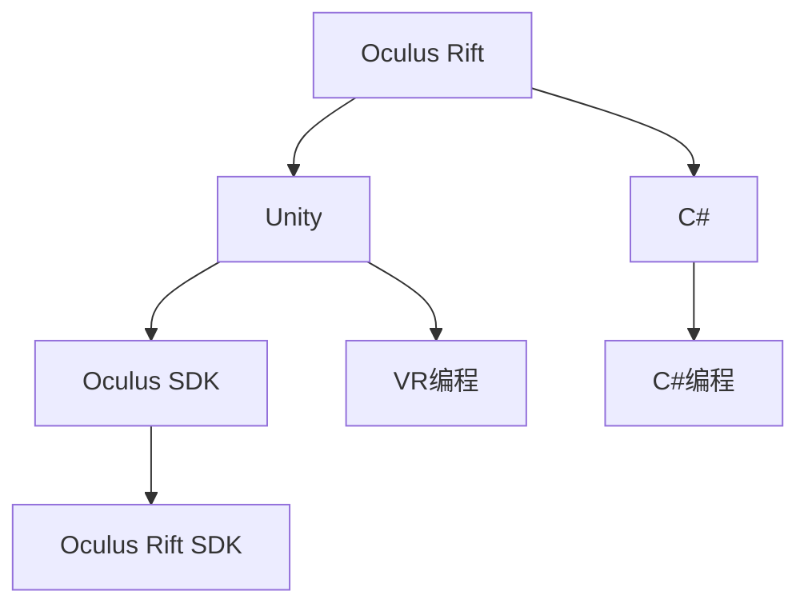

                 

# Oculus Rift 开发：在虚拟世界中

> 关键词：虚拟现实, 软件开发, 游戏开发, Oculus Rift, Unity, C# 

## 1. 背景介绍

### 1.1 问题由来
随着虚拟现实技术的发展，Oculus Rift作为一款领先的虚拟现实头显设备，已经成为了游戏开发、教育和培训等多个领域的重要工具。开发者们可以通过Oculus Rift，将用户带入一个全新的虚拟世界，实现沉浸式互动体验。但要将这个想法转化为实际的项目，却需要从零开始学习Oculus Rift的开发环境、工具和编程语言。本文将介绍如何使用Unity和C#语言开发Oculus Rift应用，涵盖从环境搭建、编程实现到部署发布的完整流程。

### 1.2 问题核心关键点
在开发Oculus Rift应用的过程中，需要注意以下几个关键点：
- Unity与Oculus Rift的集成：如何将Unity与Oculus Rift进行对接，使用Oculus SDK。
- C#编程语言的应用：使用C#编写脚本实现交互逻辑和游戏逻辑。
- 虚拟现实编程的最佳实践：如何实现虚拟世界的构建、交互和渲染。
- 性能优化与调试：如何保证应用的高性能和稳定性。
- 发布与分发：如何将应用部署到Oculus Store等平台。

### 1.3 问题研究意义
开发Oculus Rift应用，不仅可以帮助开发者拓展技术边界，体验虚拟现实带来的新奇体验，还能为游戏、教育等领域注入新的活力。掌握Oculus Rift的开发技能，对于希望进入虚拟现实行业的从业者具有重要的参考价值。

## 2. 核心概念与联系

### 2.1 核心概念概述

为更好地理解Oculus Rift的开发过程，我们首先介绍几个关键概念：

- Oculus Rift：一款由Oculus公司开发的虚拟现实头显设备，支持在PC、Mac、Linux和Windows上运行，提供高质量的虚拟现实体验。
- Unity：一款强大的游戏引擎，支持跨平台开发，可用于游戏、教育、培训等多个领域。
- C#：一种现代、面向对象的编程语言，由Microsoft开发，是Unity的官方编程语言。
- Oculus SDK：Oculus Rift的官方开发工具包，提供了用于访问和控制Oculus Rift设备的各种API。
- VR编程：一种专门为虚拟现实场景设计的编程范式，强调空间感和沉浸式交互体验。

这些核心概念之间的逻辑关系可以通过以下Mermaid流程图来展示：



这个流程图展示了大语言模型的核心概念及其之间的关系：

1. Oculus Rift通过Unity进行游戏和应用开发。
2. Unity使用C#作为官方编程语言，提供丰富的开发工具和库。
3. Oculus SDK提供Oculus Rift设备的操作和控制接口。
4. VR编程技术，使开发者能够构建沉浸式虚拟现实应用。

这些概念共同构成了Oculus Rift应用的开发框架，使得开发者可以更加高效地将创意实现为实际项目。

## 3. 核心算法原理 & 具体操作步骤
### 3.1 算法原理概述

Oculus Rift应用的开发，本质上是一个图形化编程过程，结合了计算机图形学、三维建模、人机交互等多种技术。其核心算法包括：

- 三维模型渲染：使用OpenGL或DirectX，将三维模型渲染成可交互的图形。
- 空间定位与跟踪：使用Oculus Rift设备，跟踪用户的头部和手部动作，实现交互式操作。
- 物理模拟：使用物理引擎（如PhysX），模拟物体运动和碰撞，增强虚拟现实体验的真实感。
- 光照和阴影：使用光照模型和阴影算法，增强场景的立体感和层次感。

这些算法共同构成了Oculus Rift应用的基础技术框架，开发者需要掌握这些核心算法，才能实现高质量的虚拟现实应用。

### 3.2 算法步骤详解

Oculus Rift应用的开发步骤包括：

1. **环境搭建**：安装Oculus Rift设备和相关软件，安装Unity和C#开发环境。
2. **创建项目**：在Unity中创建新项目，配置项目设置，添加Oculus Rift SDK插件。
3. **三维建模**：使用Blender等工具创建三维模型，导入Unity项目中。
4. **场景搭建**：在Unity中搭建虚拟场景，添加光照、材质、碰撞体等元素。
5. **交互逻辑**：编写C#脚本，实现用户交互逻辑，如点击、拖拽、旋转等操作。
6. **物理模拟**：使用PhysX引擎，实现物体的运动和碰撞，增强场景的物理真实感。
7. **性能优化**：对场景进行优化，调整渲染设置，提升应用性能。
8. **测试与调试**：在Unity编辑器中进行测试，使用Oculus Rift设备进行调试，优化体验。
9. **发布与分发**：将应用打包成Oculus Store可发布格式，上传到Oculus Store平台。

### 3.3 算法优缺点

Oculus Rift应用的开发，具有以下优点：
1. 高效可视化：Unity提供了强大的可视化工具，开发者可以迅速构建虚拟场景，无需编写底层代码。
2. 跨平台支持：Unity支持多平台开发，应用可以跨PC、Mac、Linux和Windows等多个操作系统运行。
3. 社区资源丰富：Unity拥有庞大的开发者社区，提供丰富的资源、教程和插件，便于学习和分享。
4. C#易于学习：C#是一种易学易用的编程语言，便于开发者快速上手。
5. Oculus SDK易于集成：Oculus SDK提供了丰富的API，便于开发者实现Oculus Rift设备的控制。

同时，该方法也存在一定的局限性：
1. 性能瓶颈：高分辨率和复杂场景可能导致性能瓶颈，需要优化渲染和物理引擎。
2. 设备限制：Oculus Rift设备较为昂贵，难以大规模普及。
3. 学习曲线：虚拟现实开发需要掌握多种技术，有一定学习曲线。

尽管存在这些局限性，但就目前而言，基于Unity和C#的开发方法仍是大规模Oculus Rift应用开发的主流范式。未来相关研究的重点在于如何进一步降低开发门槛，提高性能和用户体验，同时兼顾可扩展性和兼容性等因素。

### 3.4 算法应用领域

Oculus Rift应用在游戏、培训、教育和娱乐等多个领域得到了广泛应用，例如：

- 虚拟游戏：如《Beat Saber》《Superhot VR》等，将传统游戏带入虚拟现实。
- 医疗培训：如《Oculus Anatomy》，通过虚拟人体解剖，提高医疗专业学生的实践技能。
- 远程教学：如《ClassVR》，通过虚拟教室进行远程教学。
- 虚拟旅游：如《The Magic Leap》，通过虚拟旅游体验，探索世界各地的名胜古迹。

除了上述这些经典应用外，Oculus Rift应用还在更多领域得到创新性的应用，如虚拟制造、虚拟设计、虚拟营销等，为虚拟现实技术带来了全新的突破。

## 4. 数学模型和公式 & 详细讲解 & 举例说明
### 4.1 数学模型构建

Oculus Rift应用的开发，需要处理大量的三维坐标和向量。本节将使用数学语言对Oculus Rift应用的开发过程进行更加严格的刻画。

假设Oculus Rift设备的空间坐标系为$(x,y,z)$，虚拟场景中的对象坐标为$(x',y',z')$。Oculus Rift设备通过跟踪用户的头部和手部动作，计算出用户在虚拟场景中的位置。假设计算出的位置为$(\bar{x},\bar{y},\bar{z})$。

### 4.2 公式推导过程

为了实现用户的空间定位，需要计算出虚拟场景中的对象坐标$(x',y',z')$与用户位置$(\bar{x},\bar{y},\bar{z})$之间的关系。假设用户位置$(\bar{x},\bar{y},\bar{z})$与虚拟场景中的对象坐标$(x',y',z')$之间的转换矩阵为$T$，则有：

$$
(x',y',z') = T(\bar{x},\bar{y},\bar{z})
$$

其中，$T$可以表示为：

$$
T = \begin{bmatrix}
R & t \\
0 & 1
\end{bmatrix}
$$

其中，$R$为旋转矩阵，$t$为平移向量。通过计算旋转和平移矩阵，可以实现用户在虚拟场景中的精确定位。

### 4.3 案例分析与讲解

以一个简单的例子来说明Oculus Rift应用中的空间定位和交互逻辑：

假设用户点击虚拟场景中的一个球体，触发了球体的爆炸效果。为了实现这一效果，需要编写C#脚本来处理用户点击事件，并触发爆炸动画。具体步骤如下：

1. 在Unity编辑器中创建一个球体对象，并设置其物理属性。
2. 编写C#脚本来处理用户点击事件，检查球体是否被点击。
3. 如果球体被点击，触发爆炸动画，并计算爆炸后物体的位置和速度。
4. 使用PhysX引擎，模拟爆炸后的物体运动和碰撞。
5. 渲染爆炸动画，并更新虚拟场景中的物体位置。

通过这一示例，可以看到，Oculus Rift应用的开发涉及多个模块的协作，包括场景搭建、交互逻辑和物理引擎等。开发者需要综合掌握这些技术，才能实现高质量的虚拟现实应用。

## 5. 项目实践：代码实例和详细解释说明
### 5.1 开发环境搭建

在进行Oculus Rift应用开发前，我们需要准备好开发环境。以下是使用Unity进行Oculus Rift开发的流程：

1. **安装Oculus Rift SDK**：
   ```
   pip install ocvrift-sdk
   ```

2. **安装Unity**：
   ```
   sudo apt-get install unity3d-creator unity3d-qt-editor
   ```

3. **创建新项目**：
   在Unity编辑器中，选择创建一个新的Unity项目，命名为“MyOculusRiftProject”。

4. **配置项目设置**：
   在Unity编辑器中，选择File -> Build Settings，选择Oculus Rift作为平台。

5. **添加Oculus Rift SDK插件**：
   在Unity编辑器中，选择Window -> Package Manager，搜索并添加“Oculus Rift SDK”插件。

6. **添加Oculus Rift设备**：
   在Unity编辑器中，选择Edit -> Project Settings，选择XR Settings -> Oculus Rift，选择已连接的Oculus Rift设备。

### 5.2 源代码详细实现

下面是一个简单的C#脚本，用于处理用户点击事件并触发爆炸效果：

```csharp
using UnityEngine;
using Oculus.Rift;
using UnityEngine.Physics;

public class ExplosionController : MonoBehaviour
{
    public GameObject explosionPrefab;
    public float explosionRadius;
    public float explosionForce;
    
    private Rigidbody rb;
    
    void Start()
    {
        rb = GetComponent<Rigidbody>();
    }
    
    void Update()
    {
        if (OVRInput.GetClick(0))
        {
            if (rb == null) return;
            
            // 触发爆炸效果
            Rigidbody[] rbs = GetComponentsInChildren<Rigidbody>();
            foreach (Rigidbody rb in rbs)
            {
                Vector3 explosionPos = transform.position + transform.right * explosionRadius;
                rb.AddExplosionForce(explosionForce, explosionPos);
            }
            
            // 创建爆炸动画
            GameObject explosion = Instantiate(explosionPrefab, explosionPos, Quaternion.identity);
            explosion.GetComponent<ParticleSystem>().enableCollision = false;
        }
    }
}
```

这个脚本实现了以下功能：
- 在玩家点击时，触发爆炸效果。
- 使用PhysX引擎，计算爆炸后的物体速度和位置。
- 渲染爆炸动画，增强视觉效果。

### 5.3 代码解读与分析

让我们再详细解读一下关键代码的实现细节：

**Start函数**：
- 在Start函数中，获取组件的Rigidbody对象，用于实现物体的运动和碰撞。

**Update函数**：
- 在Update函数中，检查OVRInput.GetClick(0)是否被触发，如果被触发，执行爆炸效果。
- 使用OVRInput.GetClick(0)方法，检查Oculus Rift设备的按钮是否被点击。
- 如果点击，获取场景中所有子对象的Rigidbody组件，计算出爆炸位置和力，使用AddExplosionForce方法触发爆炸。
- 创建爆炸动画，增强视觉效果。

### 5.4 运行结果展示

运行上述代码后，可以在Unity编辑器中使用Oculus Rift设备进行测试，实现球体爆炸效果。通过这一示例，可以看到，使用Unity和C#开发Oculus Rift应用，可以方便地实现虚拟现实场景中的交互和动画效果。

## 6. 实际应用场景
### 6.1 虚拟游戏

Oculus Rift在虚拟游戏中的应用，已经带来了革命性的改变。玩家可以在虚拟现实中体验到前所未有的沉浸式游戏体验，如《Beat Saber》和《Superhot VR》等游戏。虚拟游戏不仅提升了玩家的游戏体验，还拓展了游戏产业的发展方向，为未来游戏设计提供了新的思路。

### 6.2 医疗培训

Oculus Rift在医疗培训中的应用，已经得到了广泛的应用。例如，在《Oculus Anatomy》中，用户可以通过虚拟人体解剖，提高医学专业学生的实践技能。通过虚拟现实技术，医生可以更加直观地理解人体结构和手术操作，提升手术成功率。

### 6.3 远程教学

Oculus Rift在远程教学中的应用，已经得到了初步的应用。例如，在《ClassVR》中，教师可以通过虚拟教室进行远程教学，学生可以在虚拟环境中进行互动学习。通过虚拟现实技术，学生可以更加直观地理解复杂概念，提升学习效果。

### 6.4 虚拟旅游

Oculus Rift在虚拟旅游中的应用，已经得到了初步的应用。例如，在《The Magic Leap》中，用户可以通过虚拟旅游，探索世界各地的名胜古迹。通过虚拟现实技术，用户可以更加沉浸式地体验旅游，拓展旅游产业的发展方向。

### 6.5 未来应用展望

随着Oculus Rift设备的普及和技术的不断进步，Oculus Rift应用将在更多领域得到应用，为各行各业带来变革性影响。

在智慧医疗领域，基于Oculus Rift的虚拟现实手术训练系统，将大大提高医生的手术技能。在教育领域，基于Oculus Rift的虚拟教室，将提升学生的学习效果。在娱乐领域，基于Oculus Rift的虚拟现实游戏和动画，将带来全新的观影体验。

此外，在工业生产、房地产、旅游等行业，Oculus Rift应用也将不断涌现，为各行各业带来新的机遇。相信随着技术的日益成熟，Oculus Rift应用必将进入更广阔的应用场景，为人类生产生活方式带来深远影响。

## 7. 工具和资源推荐
### 7.1 学习资源推荐

为了帮助开发者系统掌握Oculus Rift的开发理论基础和实践技巧，这里推荐一些优质的学习资源：

1. **Unity官方文档**：
   - 提供了Oculus Rift SDK的详细说明和API文档。
   - 提供了C#编程语言的官方教程和示例代码。
   - 提供了Unity引擎的官方文档和使用指南。

2. **Oculus Rift SDK文档**：
   - 提供了Oculus Rift SDK的详细说明和API文档。
   - 提供了Oculus Rift设备的控制和操作接口。

3. **Oculus Rift开发教程**：
   - 提供了详细的Oculus Rift应用开发教程，包括环境搭建、编程实现和发布部署。
   - 提供了大量的代码示例和实战项目。

4. **VR编程书籍**：
   - 提供了虚拟现实编程的深入讲解，包括图形学、物理引擎和交互技术。
   - 提供了丰富的代码示例和实战项目。

5. **Oculus Rift社区**：
   - 提供了Oculus Rift开发者的交流平台，可以分享经验和资源。
   - 提供了大量的开源项目和插件，方便学习和使用。

通过这些资源的学习实践，相信你一定能够快速掌握Oculus Rift应用的开发技能，并用于解决实际的虚拟现实问题。

### 7.2 开发工具推荐

高效的开发离不开优秀的工具支持。以下是几款用于Oculus Rift开发常用的工具：

1. **Unity**：
   - 强大的游戏引擎，支持跨平台开发，可用于游戏、教育、培训等多个领域。
   - 提供了丰富的开发工具和库，方便开发者实现虚拟现实应用。

2. **C#**：
   - 现代、面向对象的编程语言，由Microsoft开发，是Unity的官方编程语言。
   - 提供丰富的API和工具，方便开发者实现复杂的逻辑和算法。

3. **Oculus SDK**：
   - Oculus Rift的官方开发工具包，提供了用于访问和控制Oculus Rift设备的各种API。
   - 提供了丰富的API和工具，方便开发者实现Oculus Rift设备的控制。

4. **Blender**：
   - 强大的三维建模工具，支持多种文件格式和导入导出。
   - 提供丰富的建模工具和插件，方便开发者实现三维模型的创建和编辑。

5. **PhysX**：
   - 物理引擎，支持碰撞检测、物理模拟和动画生成。
   - 提供丰富的API和工具，方便开发者实现复杂的物理场景。

6. **Unity编辑器**：
   - 强大的开发环境，支持实时预览和调试。
   - 提供丰富的开发工具和库，方便开发者实现虚拟现实应用。

7. **Oculus Rift设备**：
   - 高质量的虚拟现实头显设备，支持在PC、Mac、Linux和Windows上运行。
   - 提供丰富的功能和接口，方便开发者实现虚拟现实应用。

合理利用这些工具，可以显著提升Oculus Rift应用的开发效率，加快创新迭代的步伐。

### 7.3 相关论文推荐

Oculus Rift应用的开发源于学界的持续研究。以下是几篇奠基性的相关论文，推荐阅读：

1. **《Virtual Reality: An Introduction》**：
   - 提供了虚拟现实技术的详细介绍和应用案例。
   - 介绍了虚拟现实系统的硬件、软件和交互技术。

2. **《Oculus Rift SDK》**：
   - 提供了Oculus Rift SDK的详细说明和API文档。
   - 介绍了Oculus Rift设备的控制和操作接口。

3. **《Unity 3D Game Development by Example》**：
   - 提供了Unity引擎的详细教程和示例代码。
   - 介绍了Unity引擎的编程语言和开发工具。

4. **《C# 7.0 in a Nutshell》**：
   - 提供了C#编程语言的详细教程和示例代码。
   - 介绍了C#编程语言的基本语法和常用工具。

这些论文代表了大语言模型微调技术的发展脉络。通过学习这些前沿成果，可以帮助研究者把握学科前进方向，激发更多的创新灵感。

## 8. 总结：未来发展趋势与挑战

### 8.1 总结

本文对Oculus Rift应用的开发过程进行了全面系统的介绍。首先阐述了Oculus Rift应用的开发环境、编程语言和技术框架，明确了开发过程中需要掌握的核心概念和算法。其次，从原理到实践，详细讲解了Oculus Rift应用的开发流程，包括环境搭建、编程实现和测试部署。最后，本文还探讨了Oculus Rift应用在未来教育、医疗、娱乐等多个领域的应用前景，展示了Oculus Rift应用的巨大潜力。

通过本文的系统梳理，可以看到，Oculus Rift应用的开发需要掌握多种技术，包括图形学、物理引擎、交互技术等。开发者需要不断学习和实践，才能实现高质量的虚拟现实应用。

### 8.2 未来发展趋势

展望未来，Oculus Rift应用的发展趋势包括：

1. **技术成熟度提升**：
   - 随着技术的不断进步，Oculus Rift设备的性能和稳定性将不断提升。
   - 硬件设备的普及和技术的标准化，将进一步降低开发门槛，提高用户体验。

2. **应用场景多样化**：
   - 虚拟现实技术将拓展到更多的领域，如教育、医疗、娱乐、工业等。
   - 不同应用场景的定制化开发，将带来更多的创新应用和商业模式。

3. **跨平台支持**：
   - 跨平台开发工具和技术的不断完善，将使得Oculus Rift应用能够在多个平台运行。
   - 开发者将能够更加灵活地选择开发环境和工具，实现更广泛的应用场景。

4. **生态系统完善**：
   - 开发者社区的不断壮大，将带来更多的资源、工具和插件。
   - 第三方开发平台的出现，将提供更丰富的应用场景和解决方案。

这些趋势将推动Oculus Rift应用的普及和应用，为各行各业带来新的变革。

### 8.3 面临的挑战

尽管Oculus Rift应用的开发取得了不少进展，但在迈向更加智能化、普适化应用的过程中，仍面临一些挑战：

1. **设备成本高昂**：
   - 高质量的Oculus Rift设备价格较高，限制了其普及率。
   - 设备的高成本将导致应用推广的难度增大。

2. **技术门槛高**：
   - 虚拟现实开发需要掌握多种技术，有一定的学习曲线。
   - 开发人员的匮乏和技术门槛高，将限制应用的发展速度。

3. **用户体验不足**：
   - 虚拟现实应用的用户体验仍存在不足，导致用户接受度较低。
   - 界面设计和交互体验的不足，将影响应用的受欢迎程度。

4. **技术标准化**：
   - 不同厂商的设备和技术标准不统一，导致开发难度较大。
   - 技术的标准化和兼容性问题，将影响应用的跨平台开发和推广。

5. **内容生态缺乏**：
   - 虚拟现实应用的优质内容较少，限制了应用的多样性和丰富性。
   - 内容生态的缺乏，将影响应用的吸引力。

这些挑战需要开发者和厂商共同努力，解决技术、成本、用户体验等问题，才能推动Oculus Rift应用进入更广阔的应用场景。

### 8.4 研究展望

面向未来，Oculus Rift应用的开发需要在以下几个方面寻求新的突破：

1. **技术创新**：
   - 探索新的图形渲染技术，提高虚拟场景的真实感和立体感。
   - 探索新的交互技术，提升用户的操作体验和舒适感。

2. **内容创作**：
   - 加强虚拟现实内容的制作和创新，提高应用的多样性和丰富性。
   - 引入更多的用户生成内容，增强用户参与度。

3. **用户体验**：
   - 改善界面设计和交互体验，提升用户的使用舒适度和满意度。
   - 加强用户反馈和改进，优化用户体验。

4. **技术标准化**：
   - 推动技术标准化和兼容性，降低开发难度和成本。
   - 推动开源技术的发展，促进技术的共享和协作。

5. **生态建设**：
   - 建立开发者社区和平台，提供丰富的资源、工具和支持。
   - 加强与第三方的合作，推动应用的多样化和市场化。

这些方向的研究将推动Oculus Rift应用的进一步发展和应用，为人类生产生活方式带来深远影响。

## 9. 附录：常见问题与解答

**Q1：开发Oculus Rift应用需要哪些编程语言和工具？**

A: 开发Oculus Rift应用主要需要掌握Unity和C#语言。Unity是一款强大的游戏引擎，支持跨平台开发，可用于游戏、教育、培训等多个领域。C#是一种现代、面向对象的编程语言，由Microsoft开发，是Unity的官方编程语言。此外，还需要掌握Oculus Rift SDK，以及Blender等三维建模工具。

**Q2：Oculus Rift应用的开发流程是什么？**

A: Oculus Rift应用的开发流程包括以下步骤：
1. 环境搭建：安装Oculus Rift设备和相关软件，安装Unity和C#开发环境。
2. 创建项目：在Unity编辑器中创建新项目，配置项目设置，添加Oculus Rift SDK插件。
3. 三维建模：使用Blender等工具创建三维模型，导入Unity项目中。
4. 场景搭建：在Unity编辑器中搭建虚拟场景，添加光照、材质、碰撞体等元素。
5. 交互逻辑：编写C#脚本，实现用户交互逻辑，如点击、拖拽、旋转等操作。
6. 物理模拟：使用PhysX引擎，实现物体的运动和碰撞，增强场景的物理真实感。
7. 性能优化：对场景进行优化，调整渲染设置，提升应用性能。
8. 测试与调试：在Unity编辑器中使用Oculus Rift设备进行测试，使用Oculus SDK进行调试，优化体验。
9. 发布与分发：将应用打包成Oculus Store可发布格式，上传到Oculus Store平台。

**Q3：如何在Unity中实现三维模型渲染？**

A: 在Unity中实现三维模型渲染，主要需要掌握以下几个步骤：
1. 创建三维模型：使用Blender等工具创建三维模型，并导出为Unity支持的文件格式。
2. 导入Unity项目：在Unity编辑器中，选择File -> Import New Asset，选择三维模型文件，导入项目。
3. 设置材质和光照：为三维模型设置材质和光照，增强场景的真实感和立体感。
4. 渲染场景：在Unity编辑器中，选择Rendering -> Light Mode，设置场景的光源和阴影，增强渲染效果。

通过以上步骤，可以在Unity中实现高质量的三维模型渲染，为Oculus Rift应用提供更加真实和立体的视觉体验。

**Q4：如何在Unity中实现空间定位和交互逻辑？**

A: 在Unity中实现空间定位和交互逻辑，主要需要掌握以下几个步骤：
1. 创建三维模型：使用Blender等工具创建三维模型，并导入Unity项目中。
2. 设置模型属性：为三维模型设置Rigidbody组件，设置碰撞体和物理属性。
3. 实现空间定位：在Unity编辑器中，选择Window ->XR Settings -> Oculus Rift，设置已连接的Oculus Rift设备。
4. 实现交互逻辑：编写C#脚本，实现用户交互逻辑，如点击、拖拽、旋转等操作。
5. 渲染场景：在Unity编辑器中，选择Rendering -> Light Mode，设置场景的光源和阴影，增强渲染效果。

通过以上步骤，可以在Unity中实现高质量的空间定位和交互逻辑，为用户提供更加沉浸式和互动的虚拟现实体验。

**Q5：如何在Unity中实现物理模拟？**

A: 在Unity中实现物理模拟，主要需要掌握以下几个步骤：
1. 创建三维模型：使用Blender等工具创建三维模型，并导入Unity项目中。
2. 设置模型属性：为三维模型设置Rigidbody组件，设置碰撞体和物理属性。
3. 实现物理引擎：在Unity编辑器中，选择Edit -> Project Settings，选择Physics Settings，设置物理引擎为PhysX。
4. 设置物理参数：在Unity编辑器中，选择Edit -> Project Settings，选择Physics Settings，设置物理参数，如摩擦力、弹性和重力等。
5. 实现物体的运动和碰撞：编写C#脚本，实现物体的运动和碰撞，增强场景的物理真实感。

通过以上步骤，可以在Unity中实现高质量的物理模拟，为Oculus Rift应用提供更加真实和立体的视觉体验。

以上回答了在开发Oculus Rift应用过程中可能会遇到的一些常见问题，希望能为读者提供帮助和参考。

