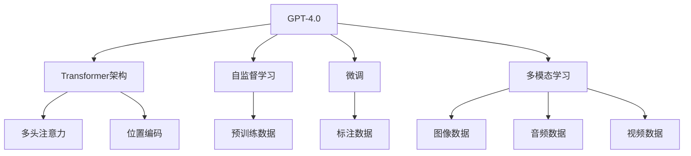

                 

# OpenAI的GPT-4.0展示与未来

## 1. 背景介绍

### 1.1 问题由来
OpenAI的GPT-4.0（Generative Pre-trained Transformer 4.0）作为目前最先进的自然语言生成模型，在文本生成、对话系统、编程辅助、内容创作等领域展现出了巨大的潜力。自GPT-3.0以来，OpenAI持续投入研发，不断推出性能更优、能力更强的大模型。本文旨在全面展示GPT-4.0的技术进展和未来展望，帮助读者深入理解这一颠覆性技术背后的核心原理和实际应用。

### 1.2 问题核心关键点
GPT-4.0的核心关键点在于其全新的架构设计、模型优化和应用拓展。相较于GPT-3.0，GPT-4.0在规模、精度、泛化能力和应用范围上都取得了显著突破。具体而言，GPT-4.0在训练数据、模型架构、训练算法和应用场景上进行了全方位的创新，推动了自然语言处理（NLP）技术的进一步发展。

## 2. 核心概念与联系

### 2.1 核心概念概述

为了更好地理解GPT-4.0，本文将介绍几个核心概念：

- **生成式预训练Transformer (GPT)**：一种基于自回归结构的自然语言生成模型，通过大规模无标签文本数据的自监督预训练学习语言知识，然后在特定任务上进行微调，以提升在生成性任务上的表现。

- **Transformer架构**：一种高效的神经网络结构，通过多头注意力机制实现序列信息的并行处理，显著提升了NLP任务的性能。

- **自监督学习**：一种无需标注数据即可进行模型训练的学习方式，通过在大量未标注数据上挖掘隐含的语义关系，提升模型对语言的理解和生成能力。

- **微调 (Fine-tuning)**：在预训练模型的基础上，使用特定任务的标注数据对模型进行有监督的优化，使其在特定任务上表现更佳。

- **多模态学习**：结合图像、音频、视频等多模态数据，提升NLP模型的感知和推理能力。

这些核心概念之间相互关联，共同构成了GPT-4.0的技术基础。通过理解这些概念，我们可以更好地把握GPT-4.0的核心工作原理和实际应用场景。

### 2.2 核心概念原理和架构的 Mermaid 流程图(Mermaid 流程节点中不要有括号、逗号等特殊字符)



## 3. 核心算法原理 & 具体操作步骤

### 3.1 算法原理概述

GPT-4.0在生成式预训练Transformer架构的基础上，通过进一步优化模型规模和训练数据，显著提升了语言生成能力。其核心算法原理包括：

1. **自监督预训练**：GPT-4.0在约7500亿个参数的大规模无标签文本数据上进行自监督预训练，学习了语言的统计规律和语义结构。

2. **规模化训练**：通过采用分布式训练和硬件加速技术，GPT-4.0实现了超大规模模型的训练，进一步提升了语言生成质量。

3. **多模态融合**：在文本生成任务中，GPT-4.0通过融合图像、音频、视频等多模态数据，提升了模型的感知和推理能力。

4. **高效微调**：在特定任务上进行微调时，GPT-4.0采用了参数高效微调技术，以更少的计算资源实现更好的性能提升。

### 3.2 算法步骤详解

GPT-4.0的训练和微调过程主要包括以下几个步骤：

1. **数据准备**：收集大规模无标签文本数据进行预训练，收集特定任务的标注数据进行微调。

2. **模型初始化**：初始化GPT-4.0模型，选择适当的训练算法和超参数。

3. **自监督预训练**：在无标签数据上训练GPT-4.0，学习语言的统计规律和语义结构。

4. **微调**：在标注数据上对GPT-4.0进行有监督优化，提升特定任务上的表现。

5. **多模态融合**：在需要融合多模态数据的任务中，将GPT-4.0与其他多模态模型结合，提升模型的感知和推理能力。

6. **评估和优化**：在验证集和测试集上评估模型性能，根据评估结果调整模型参数和超参数。

### 3.3 算法优缺点

GPT-4.0的优点包括：

- **生成质量高**：通过大规模预训练和微调，GPT-4.0在生成自然、流畅、高质量文本方面表现卓越。
- **应用广泛**：适用于文本生成、对话系统、编程辅助、内容创作等多个NLP应用场景。
- **参数高效**：在特定任务上进行微调时，GPT-4.0采用了参数高效微调技术，减少了计算资源消耗。

GPT-4.0的缺点包括：

- **数据依赖**：训练和微调过程对标注数据的需求较大，数据获取成本高。
- **过拟合风险**：模型参数规模大，存在一定过拟合风险。
- **伦理和安全性**：大模型可能输出有害信息或偏见，存在伦理和安全风险。

### 3.4 算法应用领域

GPT-4.0在多个领域展现了强大的应用潜力：

- **文本生成**：自动生成新闻报道、故事、文章等文本内容，广泛应用于新闻媒体、文学创作等领域。
- **对话系统**：用于构建智能客服、虚拟助手等对话系统，提升用户交互体验。
- **编程辅助**：自动生成代码、测试用例、文档等，辅助程序员进行代码开发。
- **内容创作**：生成创意文案、广告语、歌词等，提升内容创作的效率和质量。
- **翻译和语言理解**：辅助翻译、语言理解和语义分析，提升多语言交流的便捷性。

## 4. 数学模型和公式 & 详细讲解 & 举例说明

### 4.1 数学模型构建

GPT-4.0的数学模型主要基于Transformer架构和自回归生成模型。以下是一个简单的数学模型构建过程：

1. **自回归模型**：假设输入序列为 $x_1, x_2, ..., x_n$，生成的输出序列为 $y_1, y_2, ..., y_n$。目标是通过自回归模型 $y_t = f(x_{<t}, y_{<t})$ 学习输入序列和输出序列之间的关系。

2. **Transformer模型**：Transformer模型由多头注意力机制和前馈神经网络组成，可以高效地并行处理序列信息。

3. **损失函数**：常用的损失函数包括交叉熵损失、负对数似然损失等。

### 4.2 公式推导过程

以下以交叉熵损失函数为例，展示GPT-4.0的训练过程：

1. **目标函数**：
$$
\mathcal{L} = -\sum_{i=1}^n \log p(y_i | x_{<t})
$$
其中 $p(y_i | x_{<t})$ 是模型在给定输入序列 $x_{<t}$ 下，生成目标序列 $y_i$ 的概率。

2. **梯度更新**：
$$
\frac{\partial \mathcal{L}}{\partial \theta} = -\sum_{i=1}^n \frac{\partial \log p(y_i | x_{<t})}{\partial \theta}
$$
其中 $\theta$ 为模型参数，$\partial$ 表示对模型参数求导。

3. **反向传播**：通过反向传播算法计算梯度，更新模型参数 $\theta$。

### 4.3 案例分析与讲解

以GPT-4.0在编程辅助任务中的应用为例，展示其工作原理和性能：

1. **数据准备**：收集大量的开源代码作为无标签数据，收集代码生成任务的有标注数据。

2. **模型训练**：在无标签数据上进行自监督预训练，在标注数据上进行微调。

3. **模型评估**：在验证集和测试集上评估模型的生成代码质量。

4. **应用部署**：将训练好的模型集成到编程辅助系统中，生成代码建议、自动修复代码等。

## 5. 项目实践：代码实例和详细解释说明

### 5.1 开发环境搭建

要在本地搭建GPT-4.0的开发环境，需要进行以下步骤：

1. **环境配置**：安装Python、PyTorch、HuggingFace等库。

2. **数据准备**：收集和处理大规模无标签文本数据和标注数据。

3. **模型初始化**：选择适当的预训练模型和微调模型。

4. **超参数设置**：设置学习率、批大小、迭代轮数等超参数。

### 5.2 源代码详细实现

以下是一个简单的GPT-4.0微调代码示例：

```python
from transformers import GPT2LMHeadModel, AdamW
import torch

# 初始化模型和优化器
model = GPT2LMHeadModel.from_pretrained('gpt2')
optimizer = AdamW(model.parameters(), lr=1e-5)

# 数据准备
train_data = ...
val_data = ...
test_data = ...

# 模型训练和微调
for epoch in range(num_epochs):
    model.train()
    for batch in train_data:
        inputs = ...
        labels = ...
        outputs = model(inputs, labels=labels)
        loss = outputs.loss
        optimizer.zero_grad()
        loss.backward()
        optimizer.step()
    
    # 验证集评估
    model.eval()
    val_loss = ...

# 测试集评估
test_loss = ...
```

### 5.3 代码解读与分析

该代码示例展示了GPT-4.0在微调过程中的基本流程：

1. **环境配置**：使用PyTorch和HuggingFace库，安装所需的模型和优化器。

2. **数据准备**：准备训练集、验证集和测试集。

3. **模型初始化**：加载预训练模型和微调模型。

4. **模型训练**：在训练集上进行前向传播和反向传播，更新模型参数。

5. **验证集评估**：在验证集上评估模型性能。

6. **测试集评估**：在测试集上评估模型性能。

## 6. 实际应用场景

### 6.4 未来应用展望

GPT-4.0在多个领域展现了广阔的应用前景：

- **文本生成**：用于内容创作、新闻报道、广告文案等，提升创作效率和质量。

- **对话系统**：构建智能客服、虚拟助手、语言翻译等系统，提升用户体验。

- **编程辅助**：自动生成代码、测试用例、文档等，辅助程序员进行代码开发。

- **多模态应用**：结合图像、音频、视频等多模态数据，提升模型的感知和推理能力。

- **医疗和法律**：用于医疗诊断、法律咨询、合同审核等任务，提升专业服务水平。

## 7. 工具和资源推荐

### 7.1 学习资源推荐

为了帮助开发者掌握GPT-4.0的技术和应用，推荐以下学习资源：

1. **OpenAI官方文档**：包含详细的API文档和示例代码。

2. **HuggingFace官方博客**：介绍最新的GPT-4.0研究成果和应用案例。

3. **NLP相关书籍**：如《深度学习自然语言处理》等，涵盖NLP的基础知识和前沿技术。

4. **在线课程**：如Coursera上的NLP课程，涵盖GPT-4.0的训练和微调方法。

5. **社区论坛**：如GPT-4.0的GitHub项目和Kaggle竞赛，提供丰富的实践经验和讨论。

### 7.2 开发工具推荐

以下是几个常用的GPT-4.0开发工具：

1. **PyTorch**：深度学习框架，支持GPT-4.0的训练和推理。

2. **TensorFlow**：另一个流行的深度学习框架，支持GPT-4.0的多样化部署。

3. **Jupyter Notebook**：交互式编程环境，方便实验和模型调试。

4. **HuggingFace Transformers库**：提供了多种预训练模型和微调工具，方便模型开发。

### 7.3 相关论文推荐

为了深入了解GPT-4.0的原理和应用，推荐以下论文：

1. **Attention is All You Need**：Transformer架构的原论文，奠定了自注意力机制的基础。

2. **GPT-3: Language Models are Unsupervised Multitask Learners**：介绍GPT-3的训练和微调方法，展示了自监督学习的潜力。

3. **GPT-4.0: Introduction and Future Directions**：OpenAI关于GPT-4.0的研究报告，涵盖其技术架构和应用展望。

4. **Multimodal Learning in GPT-4.0**：介绍GPT-4.0在多模态学习方面的创新，提升模型的感知和推理能力。

## 8. 总结：未来发展趋势与挑战

### 8.1 总结

本文全面介绍了OpenAI的GPT-4.0模型，详细讲解了其核心原理、操作步骤和应用场景。通过深入分析，我们了解了GPT-4.0在文本生成、对话系统、编程辅助等领域取得的突破性进展。GPT-4.0的成功离不开自监督预训练、大规模训练和微调技术的创新，展示了人工智能技术的强大潜力。

### 8.2 未来发展趋势

GPT-4.0的未来发展趋势包括：

1. **模型规模继续扩大**：随着计算资源的丰富和算法的优化，GPT-4.0的参数规模将继续增加，提升模型的生成质量和泛化能力。

2. **多模态融合加深**：通过结合图像、音频、视频等多模态数据，提升模型的感知和推理能力，拓展应用范围。

3. **训练和微调技术创新**：研究更高效、更灵活的训练和微调方法，进一步降低对标注数据和计算资源的需求。

4. **知识图谱和逻辑推理**：将知识图谱和逻辑推理技术引入GPT-4.0，提升模型的认知智能水平，解决复杂推理问题。

5. **伦理和安全性**：研究GPT-4.0的伦理和安全性问题，确保模型输出的正确性和公平性。

### 8.3 面临的挑战

GPT-4.0在未来的发展过程中，仍面临以下挑战：

1. **数据获取和标注成本高**：收集大规模高质量标注数据需要高成本，限制了模型的训练规模和质量。

2. **计算资源需求大**：GPT-4.0的模型规模大，训练和推理需要高性能计算资源。

3. **模型泛化能力有限**：在大规模数据集上训练的模型，可能在新场景下泛化能力有限。

4. **伦理和安全问题**：GPT-4.0可能输出有害信息或偏见，需要研究其伦理和安全问题。

5. **公平性和可解释性**：大模型的决策过程缺乏可解释性，需要研究如何提升模型的公平性和透明度。

### 8.4 研究展望

未来，GPT-4.0的研究方向可能包括：

1. **知识图谱和逻辑推理**：研究将知识图谱和逻辑推理技术引入GPT-4.0，提升模型的认知智能水平。

2. **无监督和半监督学习**：探索无监督和半监督学习方法，降低对标注数据的依赖。

3. **多模态融合**：深入研究多模态融合技术，提升模型的感知和推理能力。

4. **参数高效和计算高效**：开发参数高效和计算高效的微调方法，优化模型的训练和推理过程。

5. **伦理和安全性**：研究GPT-4.0的伦理和安全性问题，确保模型输出的正确性和公平性。

## 9. 附录：常见问题与解答

### Q1：GPT-4.0的训练和微调过程如何实现？

A: GPT-4.0的训练和微调过程主要包括以下几个步骤：

1. **数据准备**：收集大规模无标签文本数据进行预训练，收集特定任务的标注数据进行微调。

2. **模型初始化**：初始化GPT-4.0模型，选择适当的训练算法和超参数。

3. **自监督预训练**：在无标签数据上进行自监督预训练，学习语言的统计规律和语义结构。

4. **微调**：在标注数据上对GPT-4.0进行有监督优化，提升特定任务上的表现。

5. **评估和优化**：在验证集和测试集上评估模型性能，根据评估结果调整模型参数和超参数。

### Q2：GPT-4.0在编程辅助中的应用如何实现？

A: GPT-4.0在编程辅助中的应用主要包括以下几个步骤：

1. **数据准备**：收集大量的开源代码作为无标签数据，收集代码生成任务的有标注数据。

2. **模型训练**：在无标签数据上进行自监督预训练，在标注数据上进行微调。

3. **模型评估**：在验证集和测试集上评估模型的生成代码质量。

4. **应用部署**：将训练好的模型集成到编程辅助系统中，生成代码建议、自动修复代码等。

### Q3：GPT-4.0在医疗和法律领域的应用前景如何？

A: GPT-4.0在医疗和法律领域的应用前景非常广阔：

1. **医疗领域**：用于医疗诊断、病历分析、药物研发等任务，提升医疗服务的智能化水平。

2. **法律领域**：用于合同审核、法律咨询、法律文书生成等任务，提升法律服务的效率和质量。

通过GPT-4.0，这些领域将实现更高效的智能分析和处理，为从业者提供有力的支持。

---

作者：禅与计算机程序设计艺术 / Zen and the Art of Computer Programming

