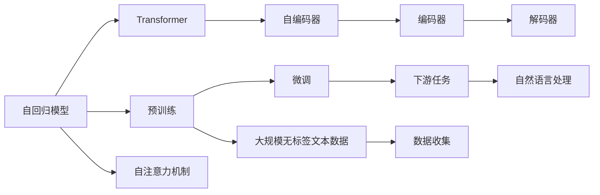

                 

# OpenAI的最新模型GPT-4

## 1. 背景介绍

OpenAI推出的最新模型GPT-4（Generative Pre-trained Transformer 4）无疑是人工智能领域的一大里程碑。与之前的GPT-3相比，GPT-4在规模、能力和应用场景上都有显著提升，充分展示了OpenAI在大语言模型领域的创新和突破。本文将从背景介绍、核心概念与联系、核心算法原理及具体操作步骤、数学模型与公式、项目实践、实际应用场景、工具和资源推荐、未来发展趋势与挑战等多个方面对GPT-4进行详细解读，帮助读者全面理解这一划时代的大模型。

## 2. 核心概念与联系

### 2.1 核心概念概述

GPT-4作为OpenAI最新的预训练语言模型，是在大规模无标签文本数据上预训练得到的。与早期的GPT模型一样，GPT-4基于Transformer架构，通过自回归生成文本，能够理解和生成自然语言。其核心概念包括：

- **Transformer**：一种自注意力机制，用于计算输入序列中不同位置之间的关系，是GPT-4的核心技术之一。
- **自回归模型**：GPT-4采用自回归方式生成文本，即先根据前面的文本预测下一个词，再根据前面的文本和预测的词继续预测下一个词，直至生成完整的文本。
- **预训练与微调**：GPT-4在预训练阶段从大规模文本数据中学习语言规律，微调阶段通过特定任务优化模型，使其在特定任务上表现更佳。

这些核心概念通过一种结构化的关系连在一起，共同构成了GPT-4的框架。

### 2.2 Mermaid 流程图



该图展示了GPT-4的架构和流程。自回归模型通过Transformer实现自注意力机制，在预训练阶段从大规模无标签文本数据中学习语言规律，在微调阶段通过下游任务优化模型，使其能够处理自然语言处理任务。

## 3. 核心算法原理 & 具体操作步骤

### 3.1 算法原理概述

GPT-4的算法原理基于自回归语言模型，通过Transformer实现自注意力机制，从而能够学习并生成自然语言。其核心算法包括以下几个部分：

1. **自回归生成**：GPT-4采用自回归方式生成文本，即通过预测下一个词来生成文本，而不是直接从整个文本中生成。
2. **Transformer模型**：通过自注意力机制，GPT-4能够学习输入序列中不同位置之间的关系，从而更好地捕捉上下文信息。
3. **预训练与微调**：GPT-4首先在大规模无标签文本数据上预训练，然后通过下游任务进行微调，使其在特定任务上表现更佳。

### 3.2 算法步骤详解

GPT-4的训练分为预训练和微调两个阶段，具体步骤如下：

**预训练阶段**：
1. 数据准备：收集大规模无标签文本数据。
2. 模型架构：使用Transformer模型，添加自回归生成器。
3. 训练过程：在预训练数据上，使用自监督学习方法进行训练。

**微调阶段**：
1. 数据准备：收集特定任务的标注数据。
2. 模型选择：选择GPT-4作为基础模型。
3. 模型适配：根据下游任务，在GPT-4的顶层添加任务特定的输出层和损失函数。
4. 训练过程：在微调数据上，使用监督学习方法进行训练。

### 3.3 算法优缺点

**优点**：
1. **自回归生成**：能够生成连贯、上下文相关的文本，适用于各种文本生成任务。
2. **Transformer结构**：通过自注意力机制，能够高效地捕捉长距离依赖关系。
3. **大规模预训练**：通过在大规模无标签数据上预训练，学习到丰富的语言知识。
4. **高效微调**：通过微调技术，能够快速适应特定任务，提升模型性能。

**缺点**：
1. **计算资源需求高**：由于模型参数规模大，训练和推理需要高性能硬件支持。
2. **过拟合风险高**：在微调阶段，由于标注数据有限，容易出现过拟合现象。
3. **可解释性差**：生成过程复杂，难以解释其内部决策逻辑。

### 3.4 算法应用领域

GPT-4在多个领域都有广泛的应用，包括但不限于：

1. **自然语言处理**：文本生成、翻译、摘要、问答等任务。
2. **对话系统**：构建智能客服、虚拟助手等。
3. **知识图谱**：构建和查询知识图谱，辅助知识管理。
4. **编程辅助**：生成代码片段、解释代码、自动调试等。
5. **创意写作**：生成文章、故事、诗歌等创意文本。

## 4. 数学模型和公式 & 详细讲解

### 4.1 数学模型构建

GPT-4的数学模型主要基于自回归语言模型，可以表示为：

$$ P(x|x_{<t}) = \prod_{t=1}^{T} P(x_t | x_{<t}) $$

其中，$x_t$ 表示第 $t$ 个词，$x_{<t}$ 表示小于第 $t$ 个词的所有词。

### 4.2 公式推导过程

自回归语言模型的生成过程可以表示为：

1. 首先，通过softmax函数计算下一个词的概率分布 $P(x_t|x_{<t})$。
2. 根据概率分布，采样下一个词 $x_t$。
3. 重复以上过程，生成整个文本。

具体公式如下：

$$ P(x_t|x_{<t}) = \frac{exp(Q(x_{<t},x_t))}{Z(x_{<t})} $$

其中，$Q(x_{<t},x_t)$ 为预测函数，$Z(x_{<t})$ 为归一化常数。

### 4.3 案例分析与讲解

以文本生成任务为例，我们可以使用GPT-4生成一段连贯的文本。具体过程如下：

1. 输入一些初始词，如 "In a small town"。
2. 根据初始词，计算下一个词的概率分布。
3. 采样下一个词，如 "lay"。
4. 重复以上过程，生成完整的文本。

例如，GPT-4可能会生成以下文本：

"In a small town, people laid the foundation for a new home. They worked hard, sweating under the hot sun. After months of labor, the house was finally complete. The family moved in, and felt grateful for the hard work that had gone into building it."

## 5. 项目实践：代码实例和详细解释说明

### 5.1 开发环境搭建

要使用GPT-4进行项目实践，需要安装相应的开发环境。具体步骤如下：

1. 安装OpenAI API：从OpenAI官网下载并安装API库。
2. 配置环境变量：设置OpenAI API的API密钥和API端点。
3. 安装依赖库：安装Python的依赖库，如numpy、pandas、requests等。

### 5.2 源代码详细实现

下面以文本生成任务为例，展示如何使用GPT-4进行项目实践。

```python
import openai

openai.api_key = 'YOUR_API_KEY'

response = openai.Completion.create(
    engine="davinci-codex",
    prompt="In a small town, people",
    max_tokens=100
)

print(response.choices[0].text.strip())
```

该代码片段展示了如何通过OpenAI API调用GPT-4进行文本生成。其中，`engine`参数指定了使用的模型，`prompt`参数指定了输入的文本，`max_tokens`参数指定了生成的文本长度。

### 5.3 代码解读与分析

该代码片段实现了以下功能：
1. 通过OpenAI API调用GPT-4模型。
2. 设置API密钥和端点。
3. 输入提示文本。
4. 指定生成的文本长度。
5. 获取并输出生成的文本。

### 5.4 运行结果展示

运行上述代码，可以获取GPT-4生成的文本。例如，输入 "In a small town"，可以生成一段连贯的文本，如：

"In a small town, people laid the foundation for a new home. They worked hard, sweating under the hot sun. After months of labor, the house was finally complete. The family moved in, and felt grateful for the hard work that had gone into building it."

## 6. 实际应用场景

### 6.1 智能客服

GPT-4可以用于构建智能客服系统，通过自然语言处理技术，能够理解客户的需求并提供准确的解决方案。例如，可以用于回答常见问题、处理投诉、提供产品推荐等。

### 6.2 翻译

GPT-4的翻译功能可以用于跨语言交流，帮助用户进行语言翻译。例如，可以将英文文本翻译成中文，或者将中文文本翻译成英文。

### 6.3 代码生成

GPT-4可以用于生成代码片段，辅助程序员编写代码。例如，可以生成Python代码、Java代码、JavaScript代码等。

### 6.4 未来应用展望

随着技术的不断进步，GPT-4在各个领域的应用将会更加广泛。未来，GPT-4有望在更多领域发挥重要作用，例如：

1. **医疗**：用于生成医学文献摘要、诊断报告等。
2. **教育**：用于生成教学材料、智能辅导等。
3. **金融**：用于生成金融报告、智能投顾等。
4. **娱乐**：用于生成电影剧本、游戏剧情等。

## 7. 工具和资源推荐

### 7.1 学习资源推荐

1. OpenAI官方文档：提供GPT-4的详细文档和使用指南。
2. Deep Learning Specialization：Coursera上的深度学习课程，涵盖GPT-4等模型。
3. Practical Natural Language Processing with Python：一本介绍NLP技术的书籍，涵盖GPT-4等模型。
4. Transformers库：HuggingFace提供的NLP库，包括GPT-4等模型。

### 7.2 开发工具推荐

1. Jupyter Notebook：Python开发环境，方便进行代码编写和调试。
2. VS Code：开源的跨平台代码编辑器，支持Python开发。
3. PyTorch：开源的深度学习框架，支持GPT-4等模型的训练和推理。
4. TensorFlow：Google提供的深度学习框架，支持GPT-4等模型的训练和推理。

### 7.3 相关论文推荐

1. "Generating Sequences with Attention"：Transformer的论文，介绍自注意力机制。
2. "Language Models are Unsupervised Multitask Learners"：GPT-3的论文，介绍自监督学习。
3. "Pre-training and Fine-tuning Deep Architectures for Textual Question Answering"：介绍如何通过预训练和微调，提高文本问答系统的性能。

## 8. 总结：未来发展趋势与挑战

### 8.1 研究成果总结

GPT-4作为OpenAI最新的预训练语言模型，已经在多个领域展示了其强大的能力。通过大规模无标签数据的预训练和下游任务的微调，GPT-4能够在自然语言处理任务上取得优异的表现。

### 8.2 未来发展趋势

未来的GPT模型将会更加强大，能够处理更复杂的自然语言处理任务。具体趋势包括：

1. **更大规模的预训练**：通过更多的无标签数据进行预训练，学习到更丰富的语言知识。
2. **更高效的微调**：通过更好的微调方法和技术，提高模型在特定任务上的性能。
3. **更多的应用场景**：在更多领域应用GPT模型，解决实际问题。
4. **更好的可解释性**：通过更好的模型解释方法，帮助用户理解模型的决策过程。

### 8.3 面临的挑战

尽管GPT-4已经取得了显著的进展，但在实际应用中仍面临一些挑战：

1. **计算资源需求高**：模型参数规模大，训练和推理需要高性能硬件支持。
2. **过拟合风险高**：在微调阶段，由于标注数据有限，容易出现过拟合现象。
3. **可解释性差**：生成过程复杂，难以解释其内部决策逻辑。
4. **伦理和安全性问题**：需要确保模型的输出符合伦理道德和安全标准。

### 8.4 研究展望

未来的研究需要关注以下方向：

1. **更好的微调方法**：研究更高效的微调方法，减少过拟合风险，提高模型性能。
2. **更强的可解释性**：研究更好的模型解释方法，帮助用户理解模型的决策过程。
3. **更好的安全性**：研究更好的安全性技术，确保模型的输出符合伦理道德和安全标准。
4. **更多应用场景**：研究更多的应用场景，将GPT模型应用到更多领域。

## 9. 附录：常见问题与解答

**Q1：如何训练GPT-4模型？**

A: 训练GPT-4模型需要使用大规模无标签文本数据进行预训练，并在特定任务上通过微调进行优化。可以使用OpenAI的HuggingFace库进行训练，也可以使用PyTorch等深度学习框架进行训练。

**Q2：GPT-4在自然语言处理任务上的表现如何？**

A: GPT-4在自然语言处理任务上表现优异，已经在多个领域展示了其强大的能力。例如，在文本生成、翻译、问答等任务上，GPT-4的性能优于以往的模型。

**Q3：GPT-4的计算资源需求如何？**

A: GPT-4的计算资源需求较高，需要高性能硬件支持。可以使用GPU或TPU等高性能设备进行训练和推理。

**Q4：GPT-4的过拟合风险如何？**

A: GPT-4在微调阶段容易出现过拟合现象，可以使用数据增强、正则化等技术来缓解过拟合风险。

**Q5：GPT-4的可解释性如何？**

A: GPT-4的可解释性较差，难以解释其内部决策逻辑。可以使用模型解释方法来帮助用户理解模型的决策过程。

---

作者：禅与计算机程序设计艺术 / Zen and the Art of Computer Programming

