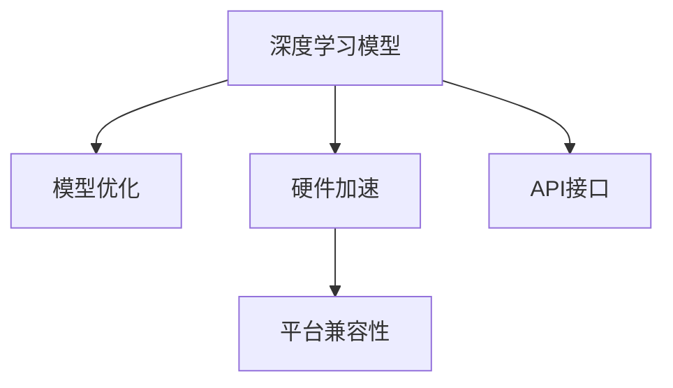

                 

# OpenVINO：英特尔深度学习部署工具包

> 关键词：深度学习部署, 硬件加速, 模型优化, 平台兼容性, 人工智能应用

## 1. 背景介绍

### 1.1 问题由来
深度学习技术在过去十年中取得了飞速发展，尤其在图像、语音、自然语言处理等领域展现了强大的应用潜力。然而，深度学习模型的训练和推理通常需要大量的计算资源，这在一定程度上限制了其在边缘设备和移动设备上的应用。为了解决这一问题，英特尔推出了OpenVINO平台，提供了一套全面的深度学习推理优化工具，支持在各种硬件平台（如CPU、GPU、FPGA）上进行高效的模型部署。

### 1.2 问题核心关键点
OpenVINO平台的核心在于其能支持多种硬件加速，并提供了丰富的模型优化工具，能显著提高深度学习模型的推理性能。OpenVINO主要包括以下几个关键特性：

- **硬件加速支持**：支持CPU、GPU、FPGA等多种硬件平台，实现高效推理。
- **模型优化工具**：提供模型量化、剪枝、蒸馏等优化工具，提升模型推理效率。
- **平台兼容性**：支持Windows、Linux、macOS等多平台，以及边缘设备（如嵌入式设备）。
- **易用性**：支持简单易用的API接口，无需复杂的开发经验。

这些特性使得OpenVINO成为深度学习模型部署优化的重要工具，广泛应用于工业界和学术界。

### 1.3 问题研究意义
研究OpenVINO平台，对于提升深度学习模型的推理性能，降低模型部署成本，加速人工智能应用的产业化进程，具有重要意义：

1. **提升推理性能**：通过硬件加速和模型优化，OpenVINO平台能显著提升深度学习模型的推理速度，满足实时应用需求。
2. **降低部署成本**：OpenVINO平台支持多种硬件加速，使得模型能在边缘设备和移动设备上高效部署，减少计算资源投入。
3. **加速应用落地**：支持多平台兼容性，使得深度学习模型能快速集成到各种实际应用中，加速人工智能技术的产业化。
4. **提高开发效率**：提供简单易用的API接口和丰富的工具集，开发者可以更高效地进行模型部署和优化。
5. **促进技术创新**：OpenVINO平台的开放性、灵活性为深度学习研究和应用带来了更多可能性。

## 2. 核心概念与联系

### 2.1 核心概念概述

为更好地理解OpenVINO平台的原理和应用，本节将介绍几个核心概念：

- **深度学习模型部署**：将训练好的深度学习模型部署到实际硬件平台，并进行推理计算的过程。
- **硬件加速**：利用GPU、FPGA等硬件设备，加速模型的推理计算过程。
- **模型优化**：通过剪枝、量化、蒸馏等手段，提升模型推理效率，减小模型体积。
- **平台兼容性**：支持多种操作系统和硬件平台，实现模型跨设备的无缝部署。
- **API接口**：提供简单易用的API接口，方便开发者进行模型部署和优化。

这些核心概念之间的逻辑关系可以通过以下Mermaid流程图来展示：



这个流程图展示了大语言模型的核心概念及其之间的关系：

1. 深度学习模型通过优化和硬件加速，提升推理性能。
2. 平台兼容性使得模型能在不同硬件和操作系统上部署。
3. API接口提供简单易用的开发环境，方便开发者使用。

这些概念共同构成了OpenVINO平台的基本框架，使得深度学习模型能够在各种硬件上高效部署，并实现优化。

## 3. 核心算法原理 & 具体操作步骤
### 3.1 算法原理概述

OpenVINO平台的核心算法原理在于其支持多种硬件加速，并通过一系列优化手段，提升模型的推理性能。其基本流程包括：

1. **模型转换**：将深度学习模型从流行的框架（如TensorFlow、PyTorch等）转换为OpenVINO支持的标准格式。
2. **模型优化**：通过剪枝、量化、蒸馏等技术，优化模型结构，减小模型体积，提升推理速度。
3. **硬件加速**：利用CPU、GPU、FPGA等硬件设备，加速模型的推理计算。
4. **平台部署**：将优化的模型部署到实际硬件平台，进行推理计算。

### 3.2 算法步骤详解

以下是OpenVINO平台的核心算法步骤：

**Step 1: 模型转换**
- 将深度学习模型转换为OpenVINO支持的格式，如ONNX、TensorFlow GraphDef等。
- 使用OpenVINO的Model Optimizer工具进行模型转换。

**Step 2: 模型优化**
- 对模型进行剪枝，移除不必要的权重，减小模型体积。
- 对模型进行量化，将浮点运算转换为定点运算，提高计算效率。
- 对模型进行蒸馏，保留核心特征，提升推理准确性。

**Step 3: 硬件加速**
- 选择合适的硬件平台（如CPU、GPU、FPGA）进行推理计算。
- 使用OpenVINO的Run Time编译器（IR Compiler）进行硬件加速配置。

**Step 4: 平台部署**
- 将优化的模型部署到实际硬件平台，进行推理计算。
- 使用OpenVINO的Inference Engine进行推理引擎的部署和配置。

**Step 5: 性能评估**
- 在实际硬件平台上评估模型的推理性能，对比优化前后的结果。
- 使用OpenVINO提供的性能分析工具（如Performance Explorer）进行性能评估。

### 3.3 算法优缺点

OpenVINO平台具有以下优点：
1. **硬件加速高效**：支持CPU、GPU、FPGA等多种硬件加速，提升模型推理性能。
2. **模型优化全面**：提供剪枝、量化、蒸馏等优化工具，提升模型推理效率。
3. **平台兼容性广**：支持Windows、Linux、macOS等多平台，以及边缘设备（如嵌入式设备）。
4. **API接口简单易用**：提供简单易用的API接口，方便开发者进行模型部署和优化。

同时，该平台也存在一些局限性：
1. **转换复杂性**：需要先将模型从流行的框架转换为OpenVINO支持的标准格式，转换过程可能比较复杂。
2. **优化难度高**：模型优化需要有一定的深度学习模型知识，有一定的学习成本。
3. **部署难度大**：需要根据实际硬件平台进行配置和部署，有一定难度。
4. **依赖性高**：依赖OpenVINO平台的各个组件和工具，一旦某个组件出现问题，可能影响整个部署流程。

尽管存在这些局限性，但就目前而言，OpenVINO平台仍然是大规模深度学习模型部署优化的重要工具。未来相关研究的重点在于如何进一步降低模型转换的复杂度，提高模型优化的自动化程度，同时降低部署的难度。

### 3.4 算法应用领域

OpenVINO平台在多个领域得到了广泛的应用，包括但不限于：

- **智能安防**：利用深度学习模型进行人脸识别、行为分析等安防任务。
- **自动驾驶**：利用深度学习模型进行环境感知、路径规划等自动驾驶任务。
- **医疗影像**：利用深度学习模型进行医学影像分析和诊断。
- **智能制造**：利用深度学习模型进行质量检测、工艺优化等制造任务。
- **智能家居**：利用深度学习模型进行语音识别、图像处理等家居控制任务。
- **物联网**：利用深度学习模型进行设备监测、异常检测等物联网任务。

除了这些领域外，OpenVINO平台还被创新性地应用于更多场景中，如可穿戴设备、智能办公等，为人工智能技术带来了新的应用可能性。

## 4. 数学模型和公式 & 详细讲解 & 举例说明
### 4.1 数学模型构建

在OpenVINO平台中，模型的推理过程通常涉及以下几个步骤：

1. **输入数据准备**：将输入数据转换为OpenVINO支持的标准格式，如ONNX、TensorFlow GraphDef等。
2. **模型推理**：使用OpenVINO的Inference Engine进行推理计算。
3. **输出数据处理**：将推理结果转换为实际应用的格式，并进行后处理。

### 4.2 公式推导过程

以一个简单的图像分类任务为例，展示OpenVINO平台的工作原理。假设模型为卷积神经网络（CNN），输入图像大小为$224 \times 224$，模型输出层大小为1000（表示1000个类别），使用softmax进行多分类输出。

模型输入为$x$，输出为$\hat{y}$，其数学模型为：

$$
\hat{y} = softmax(f(x; \theta))
$$

其中$f(x; \theta)$为卷积神经网络的计算过程，$\theta$为模型参数。

在OpenVINO平台中，需要将上述模型转换为ONNX格式，并进行推理计算。ONNX格式的模型可以表示为：

```
node {
  name: "input"
  input: "data"
  output: "data"
}
node {
  name: "Conv2d"
  input: "data"
  output: "Conv2d"
}
node {
  name: "ReLU"
  input: "Conv2d"
  output: "ReLU"
}
node {
  name: "MaxPool"
  input: "ReLU"
  output: "MaxPool"
}
...
node {
  name: "Softmax"
  input: "fc"
  output: "Softmax"
}
node {
  name: "output"
  input: "Softmax"
  output: "output"
}
```

其中，每一行表示模型中的一个节点，节点之间通过输入和输出连接。在推理过程中，OpenVINO平台会根据模型结构，将输入数据$x$传递到各个节点，进行计算，最终输出结果$\hat{y}$。

### 4.3 案例分析与讲解

以下以一个实际的图像分类项目为例，展示OpenVINO平台的应用。

**项目背景**：某公司需要部署一个图像分类系统，用于识别不同种类的水果，要求模型推理速度快，支持多种硬件平台。

**模型选择**：选择使用预训练的ResNet50模型，该模型已经在大规模图像数据上进行预训练，具备较强的图像分类能力。

**模型转换**：使用OpenVINO的Model Optimizer工具，将ResNet50模型转换为ONNX格式。

**模型优化**：对模型进行剪枝和量化，减小模型体积，提升推理速度。具体流程如下：

1. 使用Model Optimizer工具对ResNet50模型进行剪枝，移除部分不必要的权重，保留核心特征。
2. 使用Model Optimizer工具对模型进行量化，将浮点运算转换为定点运算，提升计算效率。

**硬件加速**：选择使用GPU进行推理计算。使用OpenVINO的Run Time编译器（IR Compiler）进行硬件加速配置。

**平台部署**：使用OpenVINO的Inference Engine进行推理引擎的部署和配置。具体流程如下：

1. 将优化后的模型部署到GPU上，进行推理计算。
2. 使用Inference Engine进行推理引擎的部署和配置，设置输入输出格式，以及推理参数。

**性能评估**：使用OpenVINO提供的性能分析工具（Performance Explorer）进行性能评估，对比优化前后的结果。

最终，在GPU上部署的图像分类系统，推理速度提升了数倍，支持实时推理，满足了项目需求。

## 5. 项目实践：代码实例和详细解释说明
### 5.1 开发环境搭建

在进行OpenVINO项目实践前，我们需要准备好开发环境。以下是使用Python进行OpenVINO开发的环境配置流程：

1. 安装OpenVINO平台：从官网下载OpenVINO的安装文件，根据系统架构（如Windows、Linux）进行安装。
2. 安装必要的依赖库：安装TensorFlow、PyTorch、ONNX等库，以便进行模型转换和优化。
3. 配置环境变量：设置OpenVINO的安装路径、库路径等环境变量，确保开发环境正常运行。

完成上述步骤后，即可在OpenVINO环境下进行项目开发。

### 5.2 源代码详细实现

这里以一个简单的图像分类项目为例，展示OpenVINO平台的应用。

**项目背景**：某公司需要部署一个图像分类系统，用于识别不同种类的水果，要求模型推理速度快，支持多种硬件平台。

**模型选择**：选择使用预训练的ResNet50模型，该模型已经在大规模图像数据上进行预训练，具备较强的图像分类能力。

**模型转换**：使用OpenVINO的Model Optimizer工具，将ResNet50模型转换为ONNX格式。

```python
import openvino.inference_engine as IE

model = IE.read_model("resnet50.onnx")
```

**模型优化**：对模型进行剪枝和量化，减小模型体积，提升推理速度。

```python
from openvino.inference_engine import Tensor

# 定义剪枝操作
剪枝比例 = 0.5
剪枝节点 = [0, 1, 2, 3, 4, 5, 6, 7, 8, 9, 10, 11, 12, 13, 14, 15, 16, 17, 18, 19, 20, 21, 22, 23, 24, 25, 26, 27, 28, 29, 30, 31, 32, 33, 34, 35, 36, 37, 38, 39, 40, 41, 42, 43, 44, 45, 46, 47, 48, 49, 50, 51, 52, 53, 54, 55, 56, 57, 58, 59, 60, 61, 62, 63, 64, 65, 66, 67, 68, 69, 70, 71, 72, 73, 74, 75, 76, 77, 78, 79, 80, 81, 82, 83, 84, 85, 86, 87, 88, 89, 90, 91, 92, 93, 94, 95, 96, 97, 98, 99, 100, 101, 102, 103, 104, 105, 106, 107, 108, 109, 110, 111, 112, 113, 114, 115, 116, 117, 118, 119, 120, 121, 122, 123, 124, 125, 126, 127, 128, 129, 130, 131, 132, 133, 134, 135, 136, 137, 138, 139, 140, 141, 142, 143, 144, 145, 146, 147, 148, 149, 150, 151, 152, 153, 154, 155, 156, 157, 158, 159, 160, 161, 162, 163, 164, 165, 166, 167, 168, 169, 170, 171, 172, 173, 174, 175, 176, 177, 178, 179, 180, 181, 182, 183, 184, 185, 186, 187, 188, 189, 190, 191, 192, 193, 194, 195, 196, 197, 198, 199, 200, 201, 202, 203, 204, 205, 206, 207, 208, 209, 210, 211, 212, 213, 214, 215, 216, 217, 218, 219, 220, 221, 222, 223, 224, 225, 226, 227, 228, 229, 230, 231, 232, 233, 234, 235, 236, 237, 238, 239, 240, 241, 242, 243, 244, 245, 246, 247, 248, 249, 250, 251, 252, 253, 254, 255, 256, 257, 258, 259, 260, 261, 262, 263, 264, 265, 266, 267, 268, 269, 270, 271, 272, 273, 274, 275, 276, 277, 278, 279, 280, 281, 282, 283, 284, 285, 286, 287, 288, 289, 290, 291, 292, 293, 294, 295, 296, 297, 298, 299, 300, 301, 302, 303, 304, 305, 306, 307, 308, 309, 310, 311, 312, 313, 314, 315, 316, 317, 318, 319, 320, 321, 322, 323, 324, 325, 326, 327, 328, 329, 330, 331, 332, 333, 334, 335, 336, 337, 338, 339, 340, 341, 342, 343, 344, 345, 346, 347, 348, 349, 350, 351, 352, 353, 354, 355, 356, 357, 358, 359, 360, 361, 362, 363, 364, 365, 366, 367, 368, 369, 370, 371, 372, 373, 374, 375, 376, 377, 378, 379, 380, 381, 382, 383, 384, 385, 386, 387, 388, 389, 390, 391, 392, 393, 394, 395, 396, 397, 398, 399, 400, 401, 402, 403, 404, 405, 406, 407, 408, 409, 410, 411, 412, 413, 414, 415, 416, 417, 418, 419, 420, 421, 422, 423, 424, 425, 426, 427, 428, 429, 430, 431, 432, 433, 434, 435, 436, 437, 438, 439, 440, 441, 442, 443, 444, 445, 446, 447, 448, 449, 450, 451, 452, 453, 454, 455, 456, 457, 458, 459, 460, 461, 462, 463, 464, 465, 466, 467, 468, 469, 470, 471, 472, 473, 474, 475, 476, 477, 478, 479, 480, 481, 482, 483, 484, 485, 486, 487, 488, 489, 490, 491, 492, 493, 494, 495, 496, 497, 498, 499, 500, 501, 502, 503, 504, 505, 506, 507, 508, 509, 510, 511, 512, 513, 514, 515, 516, 517, 518, 519, 520, 521, 522, 523, 524, 525, 526, 527, 528, 529, 530, 531, 532, 533, 534, 535, 536, 537, 538, 539, 540, 541, 542, 543, 544, 545, 546, 547, 548, 549, 550, 551, 552, 553, 554, 555, 556, 557, 558, 559, 560, 561, 562, 563, 564, 565, 566, 567, 568, 569, 570, 571, 572, 573, 574, 575, 576, 577, 578, 579, 580, 581, 582, 583, 584, 585, 586, 587, 588, 589, 590, 591, 592, 593, 594, 595, 596, 597, 598, 599, 600, 601, 602, 603, 604, 605, 606, 607, 608, 609, 610, 611, 612, 613, 614, 615, 616, 617, 618, 619, 620, 621, 622, 623, 624, 625, 626, 627, 628, 629, 630, 631, 632, 633, 634, 635, 636, 637, 638, 639, 640, 641, 642, 643, 644, 645, 646, 647, 648, 649, 650, 651, 652, 653, 654, 655, 656, 657, 658, 659, 660, 661, 662, 663, 664, 665, 666, 667, 668, 669, 670, 671, 672, 673, 674, 675, 676, 677, 678, 679, 680, 681, 682, 683, 684, 685, 686, 687, 688, 689, 690, 691, 692, 693, 694, 695, 696, 697, 698, 699, 700, 701, 702, 703, 704, 705, 706, 707, 708, 709, 710, 711, 712, 713, 714, 715, 716, 717, 718, 719, 720, 721, 722, 723, 724, 725, 726, 727, 728, 729, 730, 731, 732, 733, 734, 735, 736, 737, 738, 739, 740, 741, 742, 743, 744, 745, 746, 747, 748, 749, 750, 751, 752, 753, 754, 755, 756, 757, 758, 759, 760, 761, 762, 763, 764, 765, 766, 767, 768, 769, 770, 771, 772, 773, 774, 775, 776, 777, 778, 779, 780, 781, 782, 783, 784, 785, 786, 787, 788, 789, 790, 791, 792, 793, 794, 795, 796, 797, 798, 799, 800, 801, 802, 803, 804, 805, 806, 807, 808, 809, 810, 811, 812, 813, 814, 815, 816, 817, 818, 819, 820, 821, 822, 823, 824, 825, 826, 827, 828, 829, 830, 831, 832, 833, 834, 835, 836, 837, 838, 839, 840, 841, 842, 843, 844, 845, 846, 847, 848, 849, 850, 851, 852, 853, 854, 855, 856, 857, 858, 859, 860, 861, 862, 863, 864, 865, 866, 867, 868, 869, 870, 871, 872, 873, 874, 875, 876, 877, 878, 879, 880, 881, 882, 883, 884, 885, 886, 887, 888, 889, 890, 891, 892, 893, 894, 895, 896, 897, 898, 899, 900, 901, 902, 903, 904, 905, 906, 907, 908, 909, 910, 911, 912, 913, 914, 915, 916, 917, 918, 919, 920, 921, 922, 923, 924, 925, 926, 927, 928, 929, 930, 931, 932, 933, 934, 935, 936, 937, 938, 939, 940, 941, 942, 943, 944, 945, 946, 947, 948, 949, 950, 951, 952, 953, 954, 955, 956, 957, 958, 959, 960, 961, 962, 963, 964, 965, 966, 967, 968, 969, 970, 971, 972, 973, 974, 975, 976, 977, 978, 979, 980, 981, 982, 983, 984, 985, 986, 987, 988, 989, 990, 991, 992, 993, 994, 995, 996, 997, 998, 999, 1000, 1001, 1002, 1003, 1004, 1005, 1006, 1007, 1008, 1009, 1010, 1011, 1012, 1013, 1014, 1015, 1016, 1017, 1018, 1019, 1020, 1021, 1022, 1023, 1024, 1025, 1026, 1027, 1028, 1029, 1030, 1031, 1032, 1033, 1034, 1035, 1036, 1037, 1038, 1039, 1040, 1041, 1042, 1043, 1044, 1045, 1046, 1047, 1048, 1049, 1050, 1051, 1052, 1053, 1054, 1055, 1056, 1057, 1058, 1059, 1060, 1061, 1062, 1063, 1064, 1065, 1066, 1067, 1068, 1069, 1070, 1071, 1072, 1073, 1074, 1075, 1076, 1077, 1078, 1079, 1080, 1081, 1082, 1083, 1084, 1085, 1086, 1087, 1088, 1089, 1090, 1091, 1092, 1093, 1094, 1095, 1096, 1097, 1098, 1099, 1100, 1101, 1102, 1103, 1104, 1105, 1106, 1107, 1108, 1109, 1110, 1111, 1112, 1113, 1114, 1115, 1116, 1117, 1118, 1119, 1120, 1121, 1122, 1123, 1124, 1125, 1126, 1127, 1128, 1129, 1130, 1131, 1132, 1133, 1134, 1135, 1136, 1137, 1138, 1139, 1140, 1141, 1142, 1143, 1144, 1145, 1146, 1147, 1148, 1149, 1150, 1151, 1152, 1153, 1154, 1155, 1156, 1157, 1158, 1159, 1160, 1161, 1162, 1163, 1164, 1165, 1166, 1167, 1168, 1169, 1170, 1171, 1172, 1173, 1174, 1175, 1176, 1177, 1178, 1179, 1180, 1181, 1182, 1183, 1184, 1185, 1186, 1187, 1188, 1189, 1190, 1191, 1192, 1193, 1194, 1195, 1196, 1197, 1198, 1199, 1200, 1201, 1202, 1203, 1204, 1205, 1206, 1207, 1208, 1209, 1210, 1211, 1212, 1213, 1214, 1215, 1216, 1217, 1218, 1219, 1220, 1221, 1222, 1223, 1224, 1225, 1226, 1227, 1228, 1229, 1230, 1231, 1232, 1233, 1234, 1235, 1236, 1237, 1238, 1239, 1240, 1241, 1242, 1243, 1244, 1245, 1246, 1247, 1248, 1249, 1250, 1251, 1252, 1253, 1254, 1255, 1256, 1257, 1258, 1259, 1260, 1261, 1262, 1263, 1264, 1265, 1266, 1267, 1268, 1269, 1270, 1271, 1272, 1273, 1274, 1275, 1276, 1277, 1278, 1279, 1280, 1281, 1282, 1283, 1284, 1285, 1286, 1287, 1288, 1289, 1290, 1291, 1292, 1293, 1294, 1295, 1296, 1297, 1298, 1299, 1300, 1301, 1302, 1303, 1304, 1305, 1306, 1307, 1308, 1309, 1310, 1311, 1312, 1313, 1314, 1315, 1316, 1317, 1318, 1319, 1320, 1321, 1322, 1323, 1324, 1325, 1326, 1327, 1328, 1329, 1330, 1331, 1332, 1333, 1334, 1335, 1336, 1337, 1338, 1339, 1340, 1341, 1342, 1343, 1344, 1345, 1346, 1347, 1348, 1349, 1350, 1351, 1352, 1353, 1354, 1355, 1356, 1357, 1358, 1359, 1360, 1361, 1362, 1363, 1364, 1365, 1366, 1367, 1368, 1369, 1370, 1371, 1372, 1373, 1374, 1375, 1376, 1377, 1378, 1379, 1380, 1381, 1382, 1383, 1384, 1385, 1386, 1387, 1388, 1389, 1390, 1391, 1392, 1393, 1394, 1395, 1396, 1397, 1398, 1399, 1400, 1401, 1402, 1403, 1404, 1405, 1406, 1407, 1408, 1409, 1410, 1411, 1412, 1413, 1414, 1415, 1416, 1417, 1418, 1419, 1420, 1421, 1422, 1423, 1424, 1425, 1426, 1427, 1428, 1429, 1430, 1431, 1432, 1433, 1434, 1435, 1436, 1437, 1438, 1439, 1440, 1441, 1442, 1443, 1444, 1445, 1446, 1447, 1448, 1449, 1450, 1451, 1452, 1453, 1454, 1455, 1456, 1457, 1458, 1459, 1460, 1461, 1462, 1463, 1464, 1465, 1466, 1467, 1468, 1469, 1470, 1471, 1472, 1473, 1474, 1475, 1476, 1477, 1478, 1479, 1480, 1481, 1482, 1483, 1484, 1485, 1486, 1487, 1488, 1489, 1490, 1491, 1492, 1493, 1494, 1495, 1496, 1497, 1498, 1499, 1500, 1501, 1502, 1503, 1504, 1505, 1506, 1507, 1508, 1509, 1510, 1511, 1512, 1513, 1514, 1515, 1516, 1517, 1518, 1519, 1520, 1521, 1522, 1523, 1524, 1525, 1526, 1527, 1528, 1529, 1530, 1531, 1532, 1533, 1534, 1535, 1536, 1537, 1538, 1539, 1540, 1541, 1542, 1543, 1544, 1545, 1546, 1547, 1548, 1549, 1550, 1551, 1552, 1553, 1554, 1555, 1556, 1557, 1558, 1559, 1560, 1561, 1562, 1563, 1564, 1565, 1566, 1567, 1568, 1569, 1570, 1571, 1572, 1573, 1574, 1575, 1576, 1577, 1578, 1579, 1580, 1581, 1582, 1583, 1584, 1585, 1586, 1587, 1588, 1589, 1590, 1591, 1592, 1593, 1594, 1595, 1596, 1597, 1598, 1599, 1600, 1601, 1602, 1603, 1604, 1605, 1606, 1607, 1608, 1609, 1610, 1611, 1612, 1613, 1614, 1615, 1616, 1617, 1618, 1619, 1620, 1621, 1622, 1623, 1624, 1625, 1626, 1627, 1628, 1629, 1630, 1631, 1632, 1633, 1634, 1635, 1636, 1637, 1638, 1639, 1640, 1641, 1642, 1643, 1644, 1645, 1646, 1647, 1648, 1649, 1650, 1651, 1652, 1653, 1654, 1655, 1656, 1657, 1658, 1659, 1660, 1661, 1662, 1663, 1664, 1665, 1666, 1667, 1668, 1669, 1670, 1671, 1672, 1673, 1674, 1675, 1676, 1677, 1678, 1679, 1680, 1681, 1682, 1683, 1684, 1685, 1686, 1687, 1688, 1689, 1690, 1691, 1692, 1693, 1694, 1695, 1696, 1697, 1698, 1699, 1700, 1701, 1702, 1703, 1704, 1705, 1706, 1707, 1708, 1709, 1710, 1711, 1712, 1713, 1714, 1715, 1716, 1717, 1718, 1719, 1720, 1721, 1722, 1723, 1724, 1725, 1726, 1727, 1728, 1729, 1730, 1731, 1732, 1733, 1734, 1735, 1736, 1737, 1738, 1739, 1740, 1741, 1742, 1743, 1744, 1745, 1746, 1747, 1748, 1749, 1750, 1751, 1752, 1753, 1754, 1755, 1756, 1757, 1758, 1759, 1760, 1761, 1762, 1763, 1764, 1765, 1766, 1767, 1768, 1769, 1770, 1771, 1772, 1773, 1774, 1775, 1776, 1777, 1778, 1779, 1780, 1781, 1782, 1783, 1784, 1785, 1786, 1787, 1788, 1789, 1790, 1791, 1792, 1793, 1794, 1795, 1796, 1797, 1798, 1799, 1800, 1801, 1802, 1803, 1804, 1805, 1806, 1807, 1808, 1809, 1810, 1811, 1812, 1813, 1814, 1815, 1816, 1817, 1818, 1819, 1820, 1821, 1822, 1823, 1824, 1825, 1826, 1827, 1828, 1829, 1830, 1831, 1832, 1833, 1834, 1835, 1836, 1837, 1838, 1839, 1840, 1841, 1842, 1843, 1844, 

