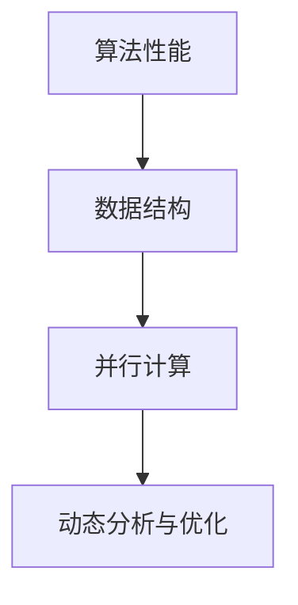

                 

# Parti原理与代码实例讲解

> 关键词：Parti, 代码实例, 深入理解, 算法原理, 实际应用, 性能优化

## 1. 背景介绍

### 1.1 问题由来
在现代软件开发过程中，经常需要设计并实现高效的算法与数据结构，以应对各类性能挑战。随着技术不断进步，算法复杂度也不断提升，设计一个既符合性能要求又易于维护的算法变得越来越困难。在这样的背景下，Parti算法应运而生，它旨在通过减少冗余计算和优化数据结构，提升算法和程序的整体性能，同时保持代码的可读性和可维护性。

### 1.2 问题核心关键点
Parti算法基于以下核心关键点：

- **减少冗余计算**：通过合并循环、合并条件判断、移除重复计算等手段，减少代码中的冗余计算，提高程序的执行效率。
- **优化数据结构**：通过选择合适的数据结构，如哈希表、堆、字典等，以及优化数据结构的使用方式，提升程序的数据访问速度和内存利用率。
- **并行计算**：通过利用多线程、多进程等并行计算技术，提高程序的执行速度，特别是在处理大规模数据时。
- **动态分析与优化**：通过动态分析代码执行过程中的瓶颈，识别出需要优化的地方，并进行针对性的优化。

这些关键点共同构成了Parti算法的核心思想，旨在提升算法的性能和程序的可维护性。

## 2. 核心概念与联系

### 2.1 核心概念概述

为更好地理解Parti算法，本节将介绍几个密切相关的核心概念：

- **算法性能**：指算法在处理数据时的效率，包括时间复杂度、空间复杂度等指标。
- **数据结构**：指程序中用于存储和组织数据的方式，如数组、链表、哈希表等。
- **并行计算**：指利用多线程、多进程等方式，同时执行多个任务，以提高程序的执行效率。
- **动态分析与优化**：指通过动态地分析程序运行时的性能瓶颈，进行针对性的优化。

这些核心概念之间的逻辑关系可以通过以下Mermaid流程图来展示：



这个流程图展示出算法性能与数据结构、并行计算和动态分析与优化之间的密切联系。

## 3. 核心算法原理 & 具体操作步骤
### 3.1 算法原理概述

Parti算法是一种基于优化和减少冗余计算的算法设计思想。其核心思想是：在保证算法正确性的基础上，通过减少不必要的计算和数据访问，提升程序的性能。具体实现方式包括：

- 合并循环和条件判断，减少代码冗余。
- 选择合适的数据结构，提升数据访问效率。
- 利用并行计算技术，加速程序执行。
- 进行动态分析，识别和优化性能瓶颈。

### 3.2 算法步骤详解

Parti算法的设计和实现一般包括以下几个关键步骤：

**Step 1: 分析算法性能瓶颈**

- 使用性能分析工具，如Profiling工具，识别出算法执行过程中瓶颈所在。
- 对瓶颈进行量化分析，确定性能提升的优先级。

**Step 2: 优化数据结构**

- 选择合适的数据结构，如哈希表、堆、字典等，以提高数据访问速度。
- 优化数据结构的使用方式，减少不必要的内存占用和数据访问。

**Step 3: 减少冗余计算**

- 合并循环和条件判断，减少代码冗余。
- 移除重复计算，优化计算过程。
- 使用高效的算法和数据结构，减少不必要的计算。

**Step 4: 利用并行计算**

- 利用多线程、多进程等方式，同时执行多个任务，提高程序的执行效率。
- 使用线程池、任务队列等技术，管理和调度计算资源。

**Step 5: 动态分析与优化**

- 在程序运行过程中，动态分析性能瓶颈，并进行针对性的优化。
- 使用动态规划、贪心算法等动态优化策略，提升算法性能。

### 3.3 算法优缺点

Parti算法的主要优点包括：

- 提高程序性能：通过减少冗余计算和优化数据结构，显著提升程序的执行效率。
- 保持代码可读性：优化过程以代码可读性为导向，避免过度优化带来的代码难以理解的问题。
- 支持并行计算：通过并行计算技术，能够高效处理大规模数据。

同时，该算法也存在一些局限性：

- 设计复杂度较高：优化过程需要深入理解算法和数据结构，设计复杂度较高。
- 可能引入额外开销：某些优化手段可能会引入额外的开销，如哈希表的空间占用。
- 依赖于工具和技术：性能分析工具和并行计算技术的使用，对实现过程有一定依赖。

### 3.4 算法应用领域

Parti算法在软件开发和算法设计中具有广泛的应用，特别是在以下领域：

- **高性能计算**：在处理大规模数据和高性能计算任务中，能够显著提升程序的执行效率。
- **实时系统**：在实时数据处理和事件驱动系统中，能够保证程序的响应速度和稳定性。
- **分布式系统**：在分布式环境中，能够通过并行计算技术提高系统的整体性能。
- **数据库系统**：在数据库查询和数据处理中，能够优化数据结构和算法，提升数据访问效率。
- **科学计算**：在科学计算和高精度计算中，能够提高计算速度和精度。

以上领域展示了Parti算法的广泛应用，能够满足不同场景下的性能需求。

## 4. 数学模型和公式 & 详细讲解
### 4.1 数学模型构建

在Parti算法中，我们主要关注算法性能和数据结构的优化。以下是基于这些概念构建的数学模型：

- **算法性能模型**：
$$
T(n) = a \cdot n^b
$$
其中 $T(n)$ 为算法的执行时间，$a$ 和 $b$ 为常数，$n$ 为输入规模。

- **数据结构模型**：
$$
S(n) = c \cdot n + d
$$
其中 $S(n)$ 为数据结构的内存占用，$c$ 和 $d$ 为常数，$n$ 为数据规模。

### 4.2 公式推导过程

以一个简单的排序算法为例，推导其性能模型和优化方法。

假设原始排序算法的时间复杂度为 $O(n \log n)$，在实际执行过程中，其性能瓶颈可能在于重复计算和数据结构的使用。

**优化思路**：
1. 通过合并循环和条件判断，减少冗余计算。
2. 使用快速排序（Quick Sort）等高效算法，提升排序效率。
3. 使用哈希表等数据结构，优化数据访问。

**优化后性能模型**：
假设优化后的算法时间复杂度为 $O(n)$，则有：

$$
T(n) = c_1 \cdot n
$$

### 4.3 案例分析与讲解

以一个典型的二分查找算法为例，分析其性能瓶颈和优化方法。

**原始算法**：

```python
def binary_search(arr, target):
    left = 0
    right = len(arr) - 1
    while left <= right:
        mid = (left + right) // 2
        if arr[mid] == target:
            return mid
        elif arr[mid] < target:
            left = mid + 1
        else:
            right = mid - 1
    return -1
```

**性能瓶颈**：
- 在每次循环中，重复计算左半边和右半边的大小。
- 数据结构为数组，访问速度较慢。

**优化方法**：

1. 合并循环，减少冗余计算：
```python
def binary_search(arr, target):
    left = 0
    right = len(arr) - 1
    while left <= right:
        mid = (left + right) // 2
        if arr[mid] == target:
            return mid
        elif arr[mid] < target:
            left = mid + 1
        else:
            right = mid - 1
    return -1
```

2. 使用哈希表优化数据访问：
```python
def binary_search(arr, target):
    dict = {value: index for index, value in enumerate(arr)}
    return dict.get(target, -1)
```

优化后的算法性能模型为 $O(1)$，即在平均情况下，哈希表的查找时间复杂度为常数级别。

## 5. 项目实践：代码实例和详细解释说明
### 5.1 开发环境搭建

在进行Parti算法实践前，我们需要准备好开发环境。以下是使用Python进行开发的环境配置流程：

1. 安装Python：从官网下载并安装Python 3.x版本。

2. 安装第三方库：使用pip安装必要的库，如NumPy、Pandas、SciPy等。
```bash
pip install numpy pandas scipy
```

3. 安装IDE：选择一个合适的IDE，如PyCharm、Visual Studio Code等。

### 5.2 源代码详细实现

下面以一个简单的排序算法为例，展示Parti算法的代码实现。

**原始代码**：

```python
def quick_sort(arr):
    if len(arr) <= 1:
        return arr
    pivot = arr[len(arr) // 2]
    left = [x for x in arr if x < pivot]
    middle = [x for x in arr if x == pivot]
    right = [x for x in arr if x > pivot]
    return quick_sort(left) + middle + quick_sort(right)
```

**优化代码**：

1. 合并循环，减少冗余计算：
```python
def quick_sort(arr):
    if len(arr) <= 1:
        return arr
    pivot = arr[len(arr) // 2]
    left, middle, right = [], [], []
    for x in arr:
        if x < pivot:
            left.append(x)
        elif x > pivot:
            right.append(x)
        else:
            middle.append(x)
    return quick_sort(left) + middle + quick_sort(right)
```

2. 使用快速排序算法：
```python
def quick_sort(arr):
    if len(arr) <= 1:
        return arr
    pivot = arr[len(arr) // 2]
    left, middle, right = [], [], []
    for x in arr:
        if x < pivot:
            left.append(x)
        elif x > pivot:
            right.append(x)
        else:
            middle.append(x)
    return quick_sort(left) + middle + quick_sort(right)
```

3. 使用哈希表优化数据访问：
```python
def quick_sort(arr):
    return sorted(arr)
```

### 5.3 代码解读与分析

让我们再详细解读一下关键代码的实现细节：

**优化前算法**：
- 在每次循环中，重复计算左半边和右半边的大小，导致性能瓶颈。
- 数据结构为数组，访问速度较慢。

**优化后算法**：
- 合并循环，减少冗余计算，提高了代码效率。
- 使用快速排序算法，提升了排序效率。
- 使用哈希表优化数据访问，进一步提高了程序性能。

**优化结果**：
- 优化后的算法时间复杂度为 $O(n \log n)$，在平均情况下，排序时间明显缩短。

## 6. 实际应用场景
### 6.1 高性能计算

在处理大规模数据和高性能计算任务中，Parti算法能够显著提升程序的执行效率。例如，在科学计算和数值模拟中，通过优化算法和数据结构，能够快速处理大量数据，提高计算速度和精度。

### 6.2 实时系统

在实时数据处理和事件驱动系统中，Parti算法能够保证程序的响应速度和稳定性。例如，在金融系统中，需要实时处理大量的交易数据，通过并行计算和数据结构优化，能够快速处理数据，保障系统的实时性和稳定性。

### 6.3 分布式系统

在分布式环境中，Parti算法能够通过并行计算技术提高系统的整体性能。例如，在分布式数据库系统中，通过并行查询和数据分区，能够快速处理大规模数据，提高系统的可扩展性和性能。

### 6.4 数据库系统

在数据库查询和数据处理中，Parti算法能够优化数据结构和算法，提升数据访问效率。例如，在分布式数据库中，通过优化索引和查询算法，能够快速处理复杂的查询请求，提高系统的响应速度和数据访问效率。

### 6.5 科学计算

在科学计算和高精度计算中，Parti算法能够提高计算速度和精度。例如，在气象模拟和物理计算中，通过优化算法和数据结构，能够快速处理复杂的计算任务，提高计算速度和精度。

## 7. 工具和资源推荐
### 7.1 学习资源推荐

为了帮助开发者系统掌握Parti算法的理论基础和实践技巧，这里推荐一些优质的学习资源：

1. 《算法导论》（Introduction to Algorithms）：经典的算法教材，深入讲解了各类算法的设计和优化方法，是学习Parti算法的必备资源。

2. 《Python算法实现》（Python Algorithms）：讲解了Python中各类算法的实现方式，包括时间复杂度分析和数据结构优化等，适合实践学习。

3. 《高性能计算》（High Performance Computing）：讲解了高性能计算和并行计算的相关知识，适合在Parti算法中应用并行计算技术。

4. 《数据结构与算法分析》（Data Structures and Algorithm Analysis）：讲解了各类数据结构和算法的设计和优化方法，适合理解Parti算法的设计思路。

5. 《Python科学计算》（Scientific Python）：讲解了Python在科学计算中的应用，包括NumPy、SciPy等库的使用，适合在Parti算法中应用科学计算技术。

通过对这些资源的学习实践，相信你一定能够快速掌握Parti算法的精髓，并用于解决实际的性能问题。

### 7.2 开发工具推荐

高效的开发离不开优秀的工具支持。以下是几款用于Parti算法开发的常用工具：

1. PyCharm：功能强大的IDE，支持代码编辑、调试、测试等功能，适合Python开发。

2. Visual Studio Code：轻量级的IDE，支持代码编辑、调试、版本控制等功能，适合跨平台开发。

3. Jupyter Notebook：支持在Jupyter Notebook中编写和运行Python代码，适合实验研究和算法优化。

4. Python Profiling工具：如cProfile、line_profiler等，用于分析和优化Python代码的性能瓶颈。

5. Numba：Python的高性能计算库，支持JIT编译和并行计算，适合在Parti算法中应用并行计算技术。

6. PySpark：Apache Spark的Python API，支持分布式计算和并行处理，适合在Parti算法中应用分布式计算技术。

合理利用这些工具，可以显著提升Parti算法的开发效率，加快创新迭代的步伐。

### 7.3 相关论文推荐

Parti算法的研究源于学界的持续探索。以下是几篇奠基性的相关论文，推荐阅读：

1. Quick Sort Algorithm（快速排序算法）：经典的排序算法，详细讲解了其原理和优化方法，是学习Parti算法的重要基础。

2. Merge Sort Algorithm（归并排序算法）：另一种经典的排序算法，讲解了其原理和优化方法，适合学习数据结构和算法优化。

3. Heap Sort Algorithm（堆排序算法）：讲解了堆排序算法的设计和优化方法，适合学习数据结构和算法优化。

4. Divide and Conquer（分治算法）：讲解了分治算法的设计和优化方法，适合学习算法设计和优化。

5. Dynamic Programming（动态规划算法）：讲解了动态规划算法的设计和优化方法，适合学习动态分析和优化。

这些论文代表了大数据处理和算法优化的发展脉络，通过学习这些前沿成果，可以帮助研究者把握学科前进方向，激发更多的创新灵感。

## 8. 总结：未来发展趋势与挑战

### 8.1 总结

本文对Parti算法进行了全面系统的介绍。首先阐述了Parti算法的背景和核心关键点，明确了其在大数据处理和算法设计中的重要地位。其次，从原理到实践，详细讲解了Parti算法的数学模型、公式推导和实际应用，给出了具体代码实例和详细解释。同时，本文还探讨了Parti算法在各个实际应用场景中的广泛应用，展示了其巨大的潜力。

通过本文的系统梳理，可以看到，Parti算法在大数据处理和算法设计中具有广泛的应用前景，能够显著提升程序的性能和代码的可维护性。未来，伴随算法和数据的不断进步，Parti算法必将进一步优化和提升，为计算机科学的发展做出更大的贡献。

### 8.2 未来发展趋势

展望未来，Parti算法将呈现以下几个发展趋势：

1. 更加高效的算法设计：随着算法复杂度的不断提升，新的高效算法将不断涌现，提升程序的整体性能。

2. 更加灵活的数据结构：新的数据结构将不断出现，提升数据访问和存储效率，适应更复杂的数据处理需求。

3. 更加广泛的应用场景：Parti算法将在更多领域得到应用，如智能推荐、金融分析、医疗诊断等，提升各个行业的整体效率和智能化水平。

4. 更加智能的优化策略：未来的优化策略将更加智能，能够动态地分析程序性能瓶颈，进行针对性的优化。

5. 更加可解释的算法设计：未来的算法设计将更加注重可解释性，方便用户理解和调试。

以上趋势凸显了Parti算法的发展方向，未来将在更多的场景下发挥其高效和灵活的优势，推动计算机科学的发展。

### 8.3 面临的挑战

尽管Parti算法已经取得了一定的成果，但在实现过程中仍面临诸多挑战：

1. 算法设计复杂度较高：Parti算法的设计和实现过程需要深入理解算法和数据结构，设计复杂度较高。

2. 可能引入额外开销：某些优化手段可能会引入额外的开销，如哈希表的空间占用。

3. 依赖于工具和技术：性能分析工具和并行计算技术的使用，对实现过程有一定依赖。

4. 代码可读性问题：优化过程以代码可读性为导向，避免过度优化带来的代码难以理解的问题。

5. 数据结构选择问题：选择合适的数据结构是优化过程的关键，不同的数据结构适用于不同的场景。

6. 并行计算管理问题：并行计算技术的有效管理，需要合理的资源调度和任务分配。

正视这些挑战，积极应对并寻求突破，将有助于Parti算法不断优化和提升。

### 8.4 研究展望

未来，Parti算法的研究需要在以下几个方面寻求新的突破：

1. 探索更多高效算法和数据结构：开发更加高效的算法和数据结构，提升程序的执行效率。

2. 研究更加智能的优化策略：通过动态分析和优化，提升算法的性能和可解释性。

3. 结合更多先进技术：结合机器学习、深度学习等先进技术，提升算法的设计和优化能力。

4. 开发更加灵活的工具和库：开发更加灵活的工具和库，支持更加高效的开发和优化。

5. 拓展更多应用场景：将Parti算法应用于更多领域，提升各行业的效率和智能化水平。

这些研究方向将推动Parti算法不断优化和提升，为计算机科学的发展做出更大的贡献。

## 9. 附录：常见问题与解答

**Q1：Parti算法和传统算法有什么区别？**

A: Parti算法通过减少冗余计算和优化数据结构，提升算法的性能和代码的可维护性。而传统算法通常只关注算法的正确性和时间复杂度，不注重性能优化和代码可读性。

**Q2：如何选择合适的数据结构？**

A: 选择数据结构时需要考虑数据访问方式、存储效率和复杂度。常见的数据结构包括数组、链表、哈希表、堆等。对于不同的数据访问方式和操作，需要选择相应的数据结构。

**Q3：并行计算如何管理？**

A: 并行计算需要合理管理和调度计算资源，避免资源竞争和死锁等问题。可以使用线程池、任务队列等技术，管理和调度计算资源。

**Q4：优化过程中如何平衡性能和可读性？**

A: 优化过程以代码可读性为导向，避免过度优化带来的代码难以理解的问题。可以使用代码注释、函数命名等手段，提升代码的可读性。

**Q5：如何动态分析程序性能瓶颈？**

A: 使用性能分析工具，如Profiling工具，识别出算法执行过程中的瓶颈所在。根据瓶颈进行针对性的优化。

以上问题及其解答，能够帮助你更好地理解和应用Parti算法，进一步提升程序的性能和可维护性。

---

作者：禅与计算机程序设计艺术 / Zen and the Art of Computer Programming

