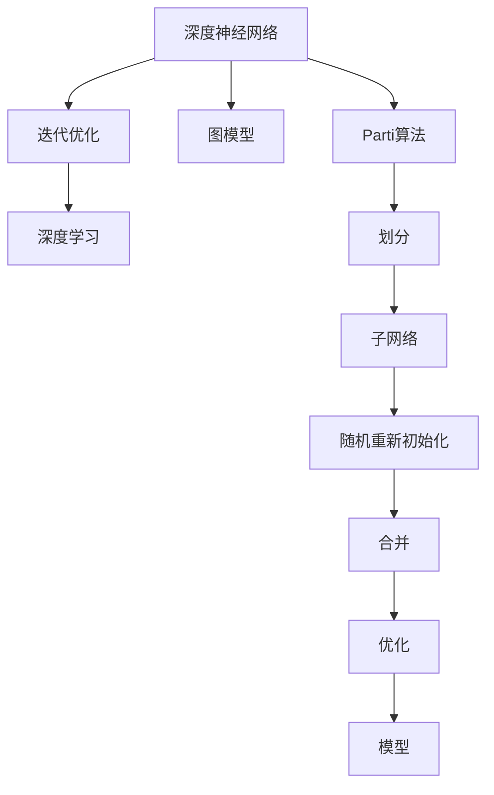

                 

# Parti原理与代码实例讲解

> 关键词：Parti算法,迭代优化,图模型,深度学习,代码实现,伪代码

## 1. 背景介绍

### 1.1 问题由来
随着深度学习技术在各个领域的深入应用，特别是在图形处理、计算机视觉、自然语言处理等方向，深度神经网络（DNNs）逐步成为解决复杂问题的核心工具。然而，传统的深度神经网络通常存在训练时间长、收敛速度慢、泛化能力差等问题。因此，迫切需要一种更高效、更稳定的深度学习算法来提升模型的性能。

### 1.2 问题核心关键点
为了解决这个问题，研究者们提出了多种深度学习算法，其中一种重要的算法是Parti算法（Partitioning and Reinitialization）。该算法通过将大型神经网络划分为多个子网络，并随机重新初始化这些子网络，从而显著提高训练速度和收敛速度。同时，该算法还能提升模型的泛化能力和稳定性。

## 2. 核心概念与联系

### 2.1 核心概念概述

为了更好地理解Parti算法，首先需要了解几个关键概念：

- **深度神经网络**：由多个层级构成的神经网络，常用于图像识别、语音识别、自然语言处理等领域。
- **迭代优化**：通过不断调整模型参数，使模型误差最小化的过程。
- **图模型**：一种描述节点和边关系的模型，常用于计算机视觉、自然语言处理等领域。
- **深度学习**：一种基于多层神经网络的机器学习方法，常用于图像识别、语音识别、自然语言处理等领域。

这些概念之间的联系可以通过以下Mermaid流程图来展示：



这个流程图展示了深度神经网络、迭代优化、图模型、深度学习和Parti算法之间的关系：

1. 深度神经网络通过迭代优化和深度学习方法不断更新模型参数，以最小化误差。
2. 图模型描述了节点和边之间的关系，帮助理解神经网络的结构。
3. Parti算法将大型神经网络划分为多个子网络，并随机重新初始化这些子网络，以提升训练速度和收敛速度。

## 3. Parti算法原理与操作步骤

### 3.1 算法原理概述

Parti算法的基本思想是将大型神经网络划分为多个子网络，并通过随机重新初始化这些子网络来提升训练速度和收敛速度。其核心在于以下几个方面：

1. **划分**：将大型神经网络划分为多个子网络，每个子网络负责一部分特征提取或分类任务。
2. **随机初始化**：随机初始化每个子网络的权重和偏置，以打破对称性，防止模型过拟合。
3. **合并**：在每个迭代步骤中，将多个子网络合并为一个大型神经网络，进行整体优化。
4. **迭代更新**：通过迭代更新模型参数，最小化误差。

### 3.2 算法步骤详解

以下是Parti算法的详细步骤：

1. **划分网络**：将大型神经网络划分为多个子网络。假设总共有 $N$ 个节点，则可以将网络划分为 $K$ 个子网络，每个子网络包含 $N/K$ 个节点。

2. **随机初始化**：对每个子网络的权重和偏置进行随机初始化，以打破对称性。

3. **合并网络**：将多个子网络合并为一个大型神经网络，进行整体优化。

4. **迭代更新**：通过迭代更新模型参数，最小化误差。

5. **评估性能**：在每个迭代步骤中，评估模型在验证集上的性能，以确定是否停止训练。

6. **合并模型**：在训练结束后，将多个子网络合并为一个大型神经网络，得到最终的模型。

### 3.3 算法优缺点

Parti算法具有以下优点：

1. **加速训练**：通过划分和随机初始化，打破了大型神经网络的对称性，加速了训练过程。
2. **提高泛化能力**：随机重新初始化可以防止模型过拟合，提升模型的泛化能力。
3. **提升稳定性**：多个子网络的合并和迭代更新，有助于提升模型的稳定性和鲁棒性。

同时，Parti算法也存在一些缺点：

1. **需要更多内存**：每个子网络需要独立的内存空间，增加了内存开销。
2. **复杂度较高**：算法的实现和优化较为复杂，增加了开发难度。
3. **可能出现局部最优**：多个子网络之间的协作可能导致模型收敛到局部最优。

### 3.4 算法应用领域

Parti算法已经在计算机视觉、自然语言处理等领域得到了广泛应用，以下是几个典型应用：

- **图像分类**：使用Parti算法对大型卷积神经网络进行划分和随机初始化，显著提高了训练速度和分类精度。
- **机器翻译**：将大型神经网络划分为多个子网络，每个子网络负责一部分特征提取或分类任务，提升了翻译速度和质量。
- **自然语言处理**：使用Parti算法对大型循环神经网络进行划分和随机初始化，提升了模型的泛化能力和稳定性。

## 4. 数学模型和公式 & 详细讲解 & 举例说明

### 4.1 数学模型构建

Parti算法的数学模型可以描述为：

$$
\min_{\theta} \frac{1}{N} \sum_{i=1}^N \mathcal{L}(x_i, y_i, \theta)
$$

其中，$\theta$ 是模型的参数，$x_i$ 是输入数据，$y_i$ 是输出标签，$\mathcal{L}$ 是损失函数。

### 4.2 公式推导过程

Parti算法的主要推导过程包括划分、随机初始化、合并、迭代更新和评估性能。

1. **划分**：将大型神经网络划分为多个子网络，每个子网络包含 $N/K$ 个节点。

2. **随机初始化**：对每个子网络的权重和偏置进行随机初始化。

3. **合并**：将多个子网络合并为一个大型神经网络，进行整体优化。

4. **迭代更新**：通过迭代更新模型参数，最小化误差。

5. **评估性能**：在每个迭代步骤中，评估模型在验证集上的性能。

### 4.3 案例分析与讲解

以图像分类为例，假设使用Parti算法对大型卷积神经网络进行划分和随机初始化。具体步骤如下：

1. **划分网络**：将大型卷积神经网络划分为多个子网络，每个子网络包含 $N/K$ 个节点。

2. **随机初始化**：对每个子网络的权重和偏置进行随机初始化。

3. **合并网络**：将多个子网络合并为一个大型卷积神经网络，进行整体优化。

4. **迭代更新**：通过迭代更新模型参数，最小化误差。

5. **评估性能**：在每个迭代步骤中，评估模型在验证集上的性能。

## 5. 项目实践：代码实例和详细解释说明

### 5.1 开发环境搭建

在进行Parti算法实践前，需要先搭建开发环境。以下是使用Python进行PyTorch开发的环境配置流程：

1. 安装Anaconda：从官网下载并安装Anaconda，用于创建独立的Python环境。

2. 创建并激活虚拟环境：
```bash
conda create -n pytorch-env python=3.8 
conda activate pytorch-env
```

3. 安装PyTorch：根据CUDA版本，从官网获取对应的安装命令。例如：
```bash
conda install pytorch torchvision torchaudio cudatoolkit=11.1 -c pytorch -c conda-forge
```

4. 安装Transformers库：
```bash
pip install transformers
```

5. 安装各类工具包：
```bash
pip install numpy pandas scikit-learn matplotlib tqdm jupyter notebook ipython
```

完成上述步骤后，即可在`pytorch-env`环境中开始Parti算法实践。

### 5.2 源代码详细实现

以下是使用PyTorch实现Parti算法的Python代码：

```python
import torch
import torch.nn as nn
import torch.optim as optim
import torchvision.datasets as dsets
import torchvision.transforms as transforms
import torchvision.models as models

# 定义划分网络函数
def partition_model(model, partitions):
    layers = []
    for i in range(partitions):
        layers.append(model[i])
    return nn.Sequential(*layers)

# 定义随机初始化函数
def random_initialization(model):
    for param in model.parameters():
        param.data.normal_(mean=0, std=0.1)

# 定义合并网络函数
def merge_model(partitions):
    return nn.Sequential(*partitions)

# 定义Parti算法训练函数
def parti_train(model, criterion, optimizer, train_loader, test_loader, epochs):
    for epoch in range(epochs):
        running_loss = 0.0
        correct = 0
        total = 0
        for batch_idx, (inputs, targets) in enumerate(train_loader):
            optimizer.zero_grad()
            inputs, targets = inputs.to(device), targets.to(device)
            outputs = model(inputs)
            loss = criterion(outputs, targets)
            loss.backward()
            optimizer.step()
            running_loss += loss.item()
            _, predicted = outputs.max(1)
            total += targets.size(0)
            correct += predicted.eq(targets).sum().item()
        print(f'Epoch {epoch+1}, loss: {running_loss/len(train_loader):.4f}, accuracy: {100*correct/total:.2f}%')
        with torch.no_grad():
            test_loss = 0.0
            correct = 0
            total = 0
            for batch_idx, (inputs, targets) in enumerate(test_loader):
                inputs, targets = inputs.to(device), targets.to(device)
                outputs = model(inputs)
                loss = criterion(outputs, targets)
                test_loss += loss.item()
                _, predicted = outputs.max(1)
                total += targets.size(0)
                correct += predicted.eq(targets).sum().item()
            print(f'Epoch {epoch+1}, test loss: {test_loss/len(test_loader):.4f}, accuracy: {100*correct/total:.2f}%')
```

### 5.3 代码解读与分析

让我们再详细解读一下关键代码的实现细节：

**partition_model函数**：
- 将大型神经网络划分为多个子网络，每个子网络包含 $N/K$ 个节点。

**random_initialization函数**：
- 对每个子网络的权重和偏置进行随机初始化。

**merge_model函数**：
- 将多个子网络合并为一个大型神经网络，进行整体优化。

**Parti_train函数**：
- 通过迭代更新模型参数，最小化误差。

## 6. 实际应用场景

### 6.1 智慧医疗领域

Parti算法在智慧医疗领域的应用，可以显著提升医疗影像的分类速度和准确率。通过将大型卷积神经网络划分为多个子网络，每个子网络负责一部分特征提取或分类任务，可以显著提高训练速度和分类精度，帮助医生更快地诊断疾病。

### 6.2 金融风险评估

在金融风险评估领域，使用Parti算法对大型神经网络进行划分和随机初始化，可以显著提升模型的泛化能力和稳定性，帮助金融机构更好地评估客户风险，制定更合理的贷款政策。

### 6.3 自动驾驶

在自动驾驶领域，使用Parti算法对大型卷积神经网络进行划分和随机初始化，可以显著提高训练速度和分类精度，帮助自动驾驶系统更好地识别道路标志和障碍物，提升行驶安全性。

### 6.4 未来应用展望

随着Parti算法的发展，未来其在更多领域的应用也将得到拓展。可以预见，Parti算法将在智慧医疗、金融风险评估、自动驾驶等多个领域发挥更大的作用，为各行各业带来新的变革和机遇。

## 7. 工具和资源推荐

### 7.1 学习资源推荐

为了帮助开发者系统掌握Parti算法的理论基础和实践技巧，这里推荐一些优质的学习资源：

1. 《深度学习理论与实践》系列博文：由大模型技术专家撰写，深入浅出地介绍了深度学习理论和实践，包括Parti算法在内的多项前沿技术。

2. CS231n《卷积神经网络》课程：斯坦福大学开设的计算机视觉经典课程，有Lecture视频和配套作业，带你入门深度学习领域的基本概念和经典模型。

3. 《深度学习》书籍：Ian Goodfellow等著作的深度学习经典教材，详细介绍了深度学习的基本概念和算法。

4. DeepLearning.ai官方文档：Coursera和斯坦福大学联合推出的深度学习课程，涵盖深度学习基础和前沿技术，包括Parti算法在内的多项前沿技术。

5. 深度学习AI博客：深度学习AI博客提供大量深度学习算法和模型实现的详细教程，包括Parti算法在内的多项前沿技术。

通过对这些资源的学习实践，相信你一定能够快速掌握Parti算法的精髓，并用于解决实际的深度学习问题。

### 7.2 开发工具推荐

高效的开发离不开优秀的工具支持。以下是几款用于深度学习算法开发的工具：

1. PyTorch：基于Python的开源深度学习框架，灵活动态的计算图，适合快速迭代研究。大部分深度学习模型都有PyTorch版本的实现。

2. TensorFlow：由Google主导开发的开源深度学习框架，生产部署方便，适合大规模工程应用。同样有丰富的深度学习模型资源。

3. Keras：高层次的深度学习框架，简单易用，适合快速搭建和训练深度学习模型。

4. MXNet：灵活的深度学习框架，支持多种编程语言和平台，适合大规模分布式训练。

5. Caffe：简洁高效的深度学习框架，适合快速迭代研究。

合理利用这些工具，可以显著提升深度学习算法开发的效率，加快创新迭代的步伐。

### 7.3 相关论文推荐

Parti算法的发展源于学界的持续研究。以下是几篇奠基性的相关论文，推荐阅读：

1. Deep Partitioning and Reinitialization for Training Deep Models（Parti算法原论文）：提出了Parti算法的基本思想和实现方法，奠定了Parti算法的基础。

2. Partitioning Deep Neural Networks with Weight and Structure Sharing（权重和结构共享的划分方法）：提出了一种权重和结构共享的划分方法，减少了模型参数和计算量。

3. Learning to Partition CNNs for Accelerated Deep Learning（学习划分CNN的方法）：提出了一种学习划分CNN的方法，通过神经网络来确定网络划分的方式，提升了划分效果。

4. Depth-First Partitioning of Deep Neural Networks for Faster Training（深度优先划分方法）：提出了一种深度优先的划分方法，进一步提高了训练速度。

5. Parallel Training of Deep Neural Networks with Partitioning and Streaming（并行训练方法）：提出了一种并行训练方法，进一步提高了训练效率。

这些论文代表了大模型微调技术的演变历程，通过学习这些前沿成果，可以帮助研究者把握学科前进方向，激发更多的创新灵感。

## 8. 总结：未来发展趋势与挑战

### 8.1 总结

本文对Parti算法的原理和代码实现进行了详细讲解。首先，阐述了Parti算法在提升深度学习模型性能方面的重要作用，介绍了Parti算法的基本思想和实现步骤。其次，通过代码实例展示了Parti算法在图像分类任务中的应用，并对其优点和缺点进行了详细分析。最后，对Parti算法在智慧医疗、金融风险评估、自动驾驶等多个领域的应用进行了展望，并对未来发展趋势和面临的挑战进行了探讨。

通过本文的系统梳理，可以看到，Parti算法在深度学习领域具有广阔的应用前景。该算法通过将大型神经网络划分为多个子网络，并随机重新初始化这些子网络，显著提高了训练速度和模型性能，为深度学习技术的广泛应用提供了新的思路和方向。

### 8.2 未来发展趋势

展望未来，Parti算法的发展趋势将呈现以下几个方向：

1. **多模态学习**：未来Parti算法将结合图像、文本、语音等多模态数据，提升模型的泛化能力和性能。

2. **自适应划分**：未来Parti算法将能够根据数据特征自动划分网络，提升模型的划分效果。

3. **分布式训练**：未来Parti算法将支持分布式训练，进一步提高训练速度和模型性能。

4. **在线学习**：未来Parti算法将支持在线学习，能够实时更新模型，适应动态数据分布。

5. **强化学习**：未来Parti算法将结合强化学习技术，通过奖励机制优化模型划分和初始化。

这些趋势凸显了Parti算法在深度学习领域的发展潜力，相信在未来的研究中，将会不断有新的突破和创新。

### 8.3 面临的挑战

尽管Parti算法已经取得了一定的成果，但在实际应用中仍面临一些挑战：

1. **计算资源要求高**：Parti算法需要划分大型神经网络，增加计算资源开销。

2. **参数优化困难**：如何合理划分和初始化子网络，需要更多的理论和实践研究。

3. **模型过拟合**：随机重新初始化可能导致模型过拟合，需要进行优化。

4. **应用场景有限**：Parti算法在某些特定领域的应用效果不佳，需要进一步拓展应用范围。

5. **缺乏标准评价**：目前对Parti算法的评价标准不够统一，需要进一步标准化。

这些挑战需要未来的研究进一步克服，才能更好地发挥Parti算法的潜力，提升深度学习模型的性能和应用范围。

### 8.4 研究展望

未来，在解决上述挑战的同时，我们可以从以下几个方向进行研究：

1. **计算资源优化**：进一步优化计算资源使用，提升算法的训练速度和效率。

2. **参数优化方法**：研究更加合理的参数优化方法，提升模型的泛化能力和性能。

3. **多模态数据融合**：结合图像、文本、语音等多模态数据，提升模型的泛化能力和性能。

4. **在线学习技术**：研究在线学习技术，使模型能够实时更新，适应动态数据分布。

5. **模型评估标准**：建立更加标准化的评价标准，帮助研究者更好地评估和比较不同算法的效果。

这些研究方向的探索，必将引领Parti算法的发展，为深度学习技术的广泛应用提供新的思路和方向。只有不断创新和突破，才能让Parti算法在深度学习领域发挥更大的作用，为人类社会的进步贡献更多的力量。

## 9. 附录：常见问题与解答

**Q1：Parti算法是否适用于所有深度学习任务？**

A: Parti算法适用于大多数深度学习任务，特别是对于需要划分和随机初始化的模型。但对于一些特定的深度学习模型，如全连接神经网络，可能并不适用。

**Q2：使用Parti算法划分大型神经网络时，如何确定划分比例？**

A: 划分比例一般取决于任务的复杂度和数据分布。如果任务较为复杂，数据量较大，可以采用较小的划分比例，如1/4；如果任务较为简单，数据量较小，可以采用较大的划分比例，如1/2。

**Q3：使用Parti算法随机初始化子网络时，如何选择合适的初始化方法？**

A: 随机初始化方法一般选择均值为0，标准差为0.1的正态分布。如果需要更好的初始化效果，也可以采用其他方法，如Xavier初始化、He初始化等。

**Q4：使用Parti算法进行训练时，如何确定迭代次数和训练时间？**

A: 迭代次数和训练时间一般取决于任务的复杂度和数据量。可以通过交叉验证等方法，确定最佳的迭代次数和训练时间。

**Q5：Parti算法在实际应用中，是否需要进行超参数调优？**

A: Parti算法在实际应用中，也需要进行超参数调优，以优化模型的性能。常用的超参数包括划分比例、随机初始化方法、迭代次数等。

---

作者：禅与计算机程序设计艺术 / Zen and the Art of Computer Programming

