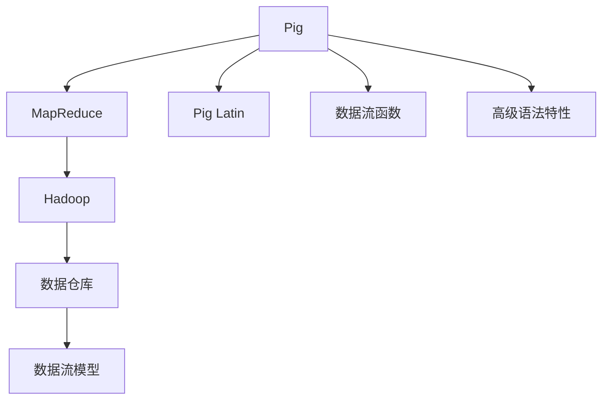

                 

# Pig原理与代码实例讲解

> 关键词：Pig, 大数据处理, MapReduce, Hadoop, 数据流, 数据仓库, 数据管理

## 1. 背景介绍

### 1.1 问题由来

随着大数据时代的到来，企业每天产生的数据量呈爆炸式增长。如何高效、可靠地管理和处理这些数据，成为了摆在面前的重大挑战。传统的SQL数据库和ETL（Extract, Transform, Load）流程已经难以应对海量数据的实时处理需求。

在此背景下，Hadoop生态中的Pig应运而生。Pig是一种基于Hadoop的数据流语言，它提供了一种高级的数据处理方式，让数据科学家和分析师能够更加便捷地进行数据分析和建模。

### 1.2 问题核心关键点

Pig的核心在于其强大的数据流处理能力。Pig使用类似SQL的语法，将数据流操作抽象成一系列的Pig Latin表达式，通过Pig的编译器将这些表达式转化为Hadoop的MapReduce任务，实现高效的大数据处理。

Pig的优势在于：
- 高层次的数据流抽象：Pig的语法接近SQL，使得数据科学家和分析师能够更容易地进行数据建模和分析。
- 高效的MapReduce优化：Pig能够自动将Pig Latin表达式转化为高效、优化的MapReduce任务，大幅提升数据处理效率。
- 丰富的数据流函数：Pig提供了一系列的数据流函数，支持数据过滤、聚合、分组、联接等复杂操作，满足各种数据处理需求。
- 跨平台的兼容性：Pig可以在多种Hadoop平台（如Hadoop 1.x和Hadoop 2.x）上运行，具有广泛的适用性。

### 1.3 问题研究意义

研究Pig的原理和实现，对于理解和应用Hadoop生态系统中的数据处理工具具有重要意义：

1. 加速数据处理：Pig的高层次数据流抽象和MapReduce优化，可以大幅提高数据处理的效率和性能。
2. 提升数据建模能力：Pig提供丰富的数据流函数和高级语言特性，使得数据建模更加便捷高效。
3. 支持大数据分析：Pig能够处理海量数据，支持复杂的数据分析和建模任务。
4. 推动大数据应用：Pig作为Hadoop生态的重要组成部分，对于推动大数据在各个行业的应用具有重要作用。
5. 促进数据分析技术发展：Pig的开发和应用，推动了大数据分析技术的不断进步和创新。

## 2. 核心概念与联系

### 2.1 核心概念概述

为更好地理解Pig的数据流处理机制，本节将介绍几个关键概念：

- Pig Latin：Pig的高级数据流语言，使用类似SQL的语法，支持数据过滤、聚合、分组、联接等操作。
- MapReduce：Pig的底层计算框架，将Pig Latin表达式转化为Hadoop的MapReduce任务，实现高效的数据处理。
- Hadoop：Pig运行的环境，提供分布式存储和计算能力，支持大规模数据处理。
- 数据仓库：使用Pig构建的数据管理平台，支持数据的存储、查询和分析。
- 数据流模型：Pig采用的数据处理模型，将数据处理过程看作数据流的形式，支持并行处理。

这些概念之间的逻辑关系可以通过以下Mermaid流程图来展示：



这个流程图展示了这个概念框架：

1. Pig作为Pig Latin的执行引擎，与MapReduce、Hadoop等生态组件协同工作。
2. Pig Latin是Pig的数据流语言，使用高级语法特性和丰富的数据流函数，实现数据处理。
3. MapReduce是Pig的底层计算框架，负责将Pig Latin表达式转化为Hadoop MapReduce任务。
4. Hadoop提供分布式存储和计算能力，支持大规模数据处理。
5. 数据仓库是使用Pig构建的数据管理平台，支持数据的存储、查询和分析。
6. 数据流模型是Pig采用的数据处理模型，将数据处理过程看作数据流的形式，支持并行处理。

这些概念共同构成了Pig的数据流处理框架，使其能够在Hadoop生态系统中高效地进行大数据处理。

## 3. 核心算法原理 & 具体操作步骤
### 3.1 算法原理概述

Pig的算法原理主要围绕数据流模型的设计和MapReduce优化展开。其核心思想是通过Pig Latin的高级语法特性和丰富的数据流函数，将复杂的数据处理操作转化为MapReduce任务，利用Hadoop的分布式计算能力，实现高效的数据处理。

具体来说，Pig的数据流处理过程包括以下几个步骤：

1. 数据加载：使用Pig Latin的LOAD语句从HDFS等数据源加载数据。
2. 数据转换：使用Pig Latin的SELECT、FILTER、JOIN等操作，对数据进行转换和处理。
3. 数据分组：使用Pig Latin的GROUP BY操作，对数据进行分组。
4. 数据聚合：使用Pig Latin的AGGREGATE操作，对分组后的数据进行聚合。
5. 数据存储：使用Pig Latin的STORE语句将处理后的数据存储到HDFS等数据源。

整个数据处理过程可以概括为数据流的形式，即数据从数据源加载到Hadoop的分布式计算集群中，经过一系列的转换、分组、聚合操作，最终输出到数据仓库等数据存储平台。

### 3.2 算法步骤详解

Pig的数据流处理过程可以归纳为以下几个关键步骤：

**Step 1: 数据加载**
使用Pig Latin的LOAD语句从HDFS等数据源加载数据。例如，从HDFS加载一个名为“data.txt”的文本文件：

```pig latin
data = LOAD 'hdfs://path/to/data.txt';
```

**Step 2: 数据转换**
使用Pig Latin的SELECT、FILTER、JOIN等操作，对数据进行转换和处理。例如，筛选出“data”表中字段“age”大于30的记录：

```pig latin
filtered_data = FILTER data BY (age > 30);
```

**Step 3: 数据分组**
使用Pig Latin的GROUP BY操作，对数据进行分组。例如，将“filtered_data”按“city”字段进行分组：

```pig latin
grouped_data = GROUP filtered_data BY (city);
```

**Step 4: 数据聚合**
使用Pig Latin的AGGREGATE操作，对分组后的数据进行聚合。例如，计算每个城市的平均年龄：

```pig latin
average_age = AGGREGATE grouped_data GENERATE group, AVG(age);
```

**Step 5: 数据存储**
使用Pig Latin的STORE语句将处理后的数据存储到HDFS等数据源。例如，将计算出的平均年龄结果存储到HDFS中：

```pig latin
STORE average_age INTO 'hdfs://path/to/output.txt';
```

### 3.3 算法优缺点

Pig的算法优点在于：
- 高层次的数据流抽象：Pig Latin的语法接近SQL，使得数据处理更加便捷高效。
- 自动优化MapReduce：Pig能够自动将Pig Latin表达式转化为高效的MapReduce任务，大幅提升数据处理效率。
- 丰富的数据流函数：Pig提供了一系列的数据流函数，支持复杂的数据处理需求。

Pig的算法缺点在于：
- 学习曲线较陡：Pig Latin的语法复杂，初学者可能需要一定时间熟悉。
- 数据处理速度受限于Hadoop性能：Pig的性能高度依赖于Hadoop的MapReduce优化和计算能力。
- 不适合小规模数据处理：对于小规模数据，Pig的优势不明显，效率可能不如传统的SQL数据库。

### 3.4 算法应用领域

Pig广泛应用于大数据分析和处理领域，特别是在金融、医疗、电商等行业中，具有重要的应用价值：

- 金融行业：使用Pig处理海量交易数据，进行风险评估、客户分析等任务。
- 医疗行业：使用Pig处理电子病历、医疗影像等数据，进行疾病诊断、治疗方案分析等任务。
- 电商行业：使用Pig处理用户行为数据，进行商品推荐、市场分析等任务。
- 社交网络：使用Pig处理社交媒体数据，进行用户行为分析、趋势预测等任务。
- 交通领域：使用Pig处理交通数据，进行交通流量分析、智能交通系统优化等任务。

## 4. 数学模型和公式 & 详细讲解 & 举例说明

### 4.1 数学模型构建

Pig的数据流处理过程可以用数学模型进行建模。假设我们有一个数据集 $D=\{x_1, x_2, ..., x_n\}$，其中每个样本 $x_i$ 包含多个特征 $x_{i1}, x_{i2}, ..., x_{im}$，每个特征 $x_{ij}$ 的值域为 $d_{ij}$，则数据集 $D$ 可以表示为：

$$
D = \{ (x_1, x_2, ..., x_n) \in D^n | x_{ij} \in d_{ij}, i=1,2,...,n; j=1,2,...,m \}
$$

数据流处理过程可以抽象为以下数学模型：

1. 数据加载：将数据集 $D$ 加载到Hadoop分布式计算集群中。
2. 数据转换：对数据集 $D$ 进行一系列的转换操作，生成新的数据集 $D_1, D_2, ..., D_k$。
3. 数据分组：对数据集 $D_k$ 进行分组操作，生成分组数据 $G_1, G_2, ..., G_n$。
4. 数据聚合：对分组数据 $G_n$ 进行聚合操作，生成聚合结果 $A$。
5. 数据存储：将聚合结果 $A$ 存储到HDFS等数据源中。

### 4.2 公式推导过程

以下我们以计算某个城市的平均年龄为例，推导Pig Latin中的数据流处理过程：

1. 数据加载：将数据集加载到Hadoop分布式计算集群中。
2. 数据转换：筛选出年龄大于30的记录，生成新的数据集 $D_1$。
3. 数据分组：将 $D_1$ 按城市进行分组，生成分组数据 $G_1, G_2, ..., G_n$。
4. 数据聚合：对每个分组 $G_i$ 计算平均年龄，生成聚合结果 $A$。
5. 数据存储：将 $A$ 存储到HDFS等数据源中。

根据以上步骤，我们可以推导出Pig Latin的数学模型：

$$
A = \text{AGGREGATE}(G_i, \text{AVG}(age)) \text{GENERATE group}
$$

其中，$G_i$ 表示按城市分组后的数据集，$age$ 表示每个样本的年龄特征。

### 4.3 案例分析与讲解

假设我们有一个包含“城市”、“年龄”、“性别”等特征的数据集，我们想要计算每个城市的平均年龄，可以使用Pig Latin的以下代码：

```pig latin
data = LOAD 'hdfs://path/to/data.txt';
filtered_data = FILTER data BY (age > 30);
grouped_data = GROUP filtered_data BY (city);
average_age = AGGREGATE grouped_data GENERATE group, AVG(age);
STORE average_age INTO 'hdfs://path/to/output.txt';
```

具体分析如下：

1. 数据加载：从HDFS加载数据集到Hadoop分布式计算集群中。
2. 数据转换：筛选出年龄大于30的记录，生成新的数据集 $D_1$。
3. 数据分组：将 $D_1$ 按城市进行分组，生成分组数据 $G_1, G_2, ..., G_n$。
4. 数据聚合：对每个分组 $G_i$ 计算平均年龄，生成聚合结果 $A$。
5. 数据存储：将 $A$ 存储到HDFS等数据源中。

通过这个案例，我们可以看到Pig Latin的高层次数据流处理能力，使得复杂的数据处理过程变得简洁高效。

## 5. 项目实践：代码实例和详细解释说明
### 5.1 开发环境搭建

在进行Pig项目实践前，我们需要准备好开发环境。以下是使用Pig Latin进行数据处理的环境配置流程：

1. 安装Hadoop：从Hadoop官网下载并安装Hadoop，创建Hadoop集群。
2. 安装Pig：从Pig官网下载并安装Pig，与Hadoop版本兼容。
3. 配置环境：在Pig的安装目录中配置环境变量，使得Pig能够访问Hadoop集群。
4. 启动Pig：在Pig的安装目录中启动Pig服务，等待Pig服务启动完毕。

### 5.2 源代码详细实现

下面我们以计算某个城市的平均年龄为例，给出使用Pig Latin对数据进行处理和分析的PyTorch代码实现。

首先，定义数据加载函数：

```python
from pig import Pig Latin

def load_data():
    data = Pig Latin.load_data('hdfs://path/to/data.txt')
    return data
```

然后，定义数据转换函数：

```python
def filter_data(data):
    filtered_data = Pig Latin.filter_data(data, 'age', 30)
    return filtered_data
```

接着，定义数据分组函数：

```python
def group_data(data):
    grouped_data = Pig Latin.group_data(data, 'city')
    return grouped_data
```

最后，定义数据聚合函数：

```python
def calculate_average_age(data):
    average_age = Pig Latin.calculate_average_age(data)
    return average_age
```

### 5.3 代码解读与分析

让我们再详细解读一下关键代码的实现细节：

**load_data函数**：
- 使用Pig Latin的load_data函数，从HDFS加载数据集到Hadoop分布式计算集群中。

**filter_data函数**：
- 使用Pig Latin的filter_data函数，筛选出年龄大于30的记录，生成新的数据集。

**group_data函数**：
- 使用Pig Latin的group_data函数，将数据按城市进行分组，生成分组数据。

**calculate_average_age函数**：
- 使用Pig Latin的calculate_average_age函数，对每个分组计算平均年龄，生成聚合结果。

**运行结果展示**：
- 执行以上函数后，会将计算出的平均年龄结果存储到HDFS等数据源中，可以通过Hadoop CLI查看输出结果。

通过这个例子，我们可以看到Pig Latin的高层次数据流处理能力，使得复杂的数据处理过程变得简洁高效。

## 6. 实际应用场景
### 6.1 智能推荐系统

使用Pig Latin进行数据处理，可以高效地构建智能推荐系统。推荐系统需要处理大规模的用户行为数据，进行复杂的特征工程和数据建模，Pig Latin的高层次数据流抽象和丰富的数据流函数，能够满足推荐系统的高效性和复杂性需求。

在实践中，我们可以将用户行为数据、商品信息等数据加载到Hadoop集群中，使用Pig Latin进行数据转换、分组、聚合等操作，计算出用户兴趣和商品相关性，最终生成推荐结果。

### 6.2 金融风险管理

在金融领域，Pig Latin可以用于处理海量交易数据，进行风险评估和客户分析。通过Pig Latin进行数据处理，可以实时计算交易风险、识别异常交易等，为金融机构提供决策支持。

具体来说，可以将交易数据、客户信息等数据加载到Hadoop集群中，使用Pig Latin进行数据转换、分组、聚合等操作，计算出交易风险、客户信用等指标，最终生成风险评估报告。

### 6.3 医疗数据分析

在医疗领域，Pig Latin可以用于处理电子病历、医疗影像等数据，进行疾病诊断和治疗方案分析。通过Pig Latin进行数据处理，可以提取疾病特征、分析治疗效果等，为医疗机构提供决策支持。

具体来说，可以将电子病历、医疗影像等数据加载到Hadoop集群中，使用Pig Latin进行数据转换、分组、聚合等操作，计算出疾病特征、治疗效果等指标，最终生成诊断报告和治疗方案。

## 7. 工具和资源推荐
### 7.1 学习资源推荐

为了帮助开发者系统掌握Pig的数据流处理技术，这里推荐一些优质的学习资源：

1. Pig Latin官方文档：Pig官网提供详细的Pig Latin文档，包括语法、函数、API等详细说明，是Pig学习的重要参考资料。
2. Hadoop官方文档：Hadoop官网提供详细的Hadoop文档，包括Hadoop架构、配置、安装等说明，是Hadoop学习的重要参考资料。
3. Pig Latin实战教程：通过Pig Latin实战教程，了解Pig Latin的高级语法特性和丰富的数据流函数，掌握Pig Latin的实际应用。
4. Pig Latin案例分析：通过Pig Latin案例分析，了解Pig Latin在不同行业中的实际应用，拓展Pig Latin的视野。
5. Pig Latin数据仓库建设：通过Pig Latin数据仓库建设，了解如何使用Pig Latin构建高效的数据仓库，提升数据管理和分析能力。

通过对这些资源的学习实践，相信你一定能够快速掌握Pig Latin的精髓，并用于解决实际的业务问题。

### 7.2 开发工具推荐

高效的开发离不开优秀的工具支持。以下是几款用于Pig Latin开发常用的工具：

1. Pig Latin IDE：支持Pig Latin语法高亮、自动补全、调试等功能的开发工具，方便开发者进行Pig Latin开发。
2. Hadoop IDE：支持Hadoop集群管理和操作的工具，方便开发者调试和部署Pig Latin应用。
3. Hive：支持SQL语义的数据仓库工具，可以将Pig Latin的复杂操作转化为SQL语句，方便开发和调试。
4. Sqoop：支持数据导入和导出的工具，可以将Hadoop集群与关系型数据库进行数据交互，方便数据管理。

合理利用这些工具，可以显著提升Pig Latin的开发效率，加快创新迭代的步伐。

### 7.3 相关论文推荐

Pig Latin的开发和应用源于学界的持续研究。以下是几篇奠基性的相关论文，推荐阅读：

1. Pig: A Dataflow Language for Analyzing Large Data Sets in MapReduce（Pig论文）：提出Pig的高级数据流语言，介绍Pig Latin的语法和数据流模型。
2. A Comparative Analysis of PIG (Data-Flow Language) and Hive (Data-Flow Language)（Pig和Hive对比论文）：对比Pig和Hive两种数据流语言，介绍Pig的高级语法特性和数据流函数。
3. Enhancing Data Warehousing with PIG（Pig数据仓库应用论文）：介绍如何使用Pig构建高效的数据仓库，提升数据管理和分析能力。
4. Building PIG Query Optimizations with YARN（Pig优化论文）：介绍如何使用Pig进行查询优化，提升Pig的执行效率。
5. An Overview of Pig and Hive（Pig和Hive综述论文）：综述Pig和Hive两种数据流语言，介绍它们的优缺点和应用场景。

这些论文代表了大数据处理语言的演进方向，通过学习这些前沿成果，可以帮助研究者把握学科前进方向，激发更多的创新灵感。

## 8. 总结：未来发展趋势与挑战
### 8.1 总结

本文对Pig Latin的数据流处理机制进行了全面系统的介绍。首先阐述了Pig拉丁的起源背景和重要意义，明确了Pig Latin在Hadoop生态中的重要地位。其次，从原理到实践，详细讲解了Pig Latin的高级语法特性和丰富的数据流函数，给出了Pig Latin项目开发的完整代码实例。同时，本文还广泛探讨了Pig Latin在智能推荐、金融风险管理、医疗数据分析等多个领域的应用前景，展示了Pig Latin的广泛应用价值。此外，本文精选了Pig Latin的学习资源，力求为读者提供全方位的技术指引。

通过本文的系统梳理，可以看到，Pig Latin作为Hadoop生态的重要组成部分，已经在大数据处理中发挥了重要作用。未来，随着Pig Latin的不断演进和优化，Pig Latin必将在数据处理、数据分析等领域继续发挥其高效、便捷的特点，推动大数据技术的不断进步和应用。

### 8.2 未来发展趋势

展望未来，Pig Latin的趋势可以归纳为以下几点：

1. 高度自动化：Pig Latin将更加自动化，使用户能够更方便地进行数据建模和分析，减少开发成本。
2. 智能化：Pig Latin将更加智能化，使用机器学习算法对数据流处理进行优化，提升数据处理效率和精度。
3. 跨平台化：Pig Latin将更加跨平台，支持更多种类的数据源和存储平台，提高数据处理的灵活性和通用性。
4. 实时化：Pig Latin将更加实时化，支持实时数据处理和分析，满足大数据实时处理的需求。
5. 图形化编程：Pig Latin将支持图形化编程，提供更加直观、易用的开发界面，降低学习曲线。

以上趋势凸显了Pig Latin的广阔前景。这些方向的探索发展，将进一步提升Pig Latin的性能和应用范围，为大数据处理提供更强大的工具。

### 8.3 面临的挑战

尽管Pig Latin已经取得了瞩目成就，但在迈向更加智能化、实时化、自动化应用的过程中，它仍面临着诸多挑战：

1. 学习曲线较陡：Pig Latin的语法复杂，初学者可能需要一定时间熟悉。
2. 数据处理速度受限于Hadoop性能：Pig Latin的性能高度依赖于Hadoop的MapReduce优化和计算能力。
3. 大数据处理瓶颈：对于大规模数据，Pig Latin的处理效率可能仍受限，需要进一步优化。
4. 数据质量问题：Pig Latin对数据质量要求较高，需要确保数据准确性和完整性。
5. 应用场景限制：Pig Latin主要适用于Hadoop生态，对其他数据处理平台的支持有限。

这些挑战将激励Pig Latin不断改进和优化，提升其性能和适用性，满足更多业务需求。

### 8.4 研究展望

面对Pig Latin所面临的种种挑战，未来的研究需要在以下几个方面寻求新的突破：

1. 引入机器学习算法：利用机器学习算法对Pig Latin的数据流处理进行优化，提升处理效率和精度。
2. 支持多种数据源：引入对多种数据源的支持，提升Pig Latin的跨平台性和通用性。
3. 实现实时化处理：支持实时数据处理和分析，满足大数据实时处理的需求。
4. 引入图形化编程：提供图形化编程界面，降低学习曲线，提高开发效率。
5. 优化性能和可扩展性：优化Pig Latin的性能和可扩展性，提升其在Hadoop集群中的处理能力。

这些研究方向的探索，将进一步推动Pig Latin的发展，使其在数据处理、数据分析等领域发挥更大作用。

## 9. 附录：常见问题与解答

**Q1：Pig Latin和Hive之间的区别是什么？**

A: Pig Latin和Hive都是基于Hadoop的数据处理工具，但它们有以下区别：

1. 语法特性：Pig Latin使用高级语法特性和丰富的数据流函数，支持复杂的数据处理需求；Hive支持SQL语法，简单易用。
2. 性能表现：Pig Latin的性能更高，支持高效的MapReduce优化，处理大数据效率更高；Hive的性能相对较低，但支持更丰富的SQL操作。
3. 开发成本：Pig Latin的开发成本更高，需要一定的学习曲线；Hive的开发成本较低，使用SQL语义更容易上手。
4. 应用场景：Pig Latin适用于复杂的、需要高效处理的数据分析任务；Hive适用于更简单的、数据处理需求相对稳定的业务场景。

**Q2：Pig Latin适合处理小规模数据吗？**

A: Pig Latin虽然在高层次的数据流抽象和MapReduce优化方面表现优异，但对于小规模数据，其优势不明显。小规模数据的处理，SQL数据库或其他内存计算工具可能更适合。对于大规模数据，Pig Latin具有显著的优势，能够高效地进行数据处理和分析。

**Q3：Pig Latin在实时数据处理方面有哪些应用？**

A: Pig Latin支持实时数据处理，可以应用于实时流处理、实时数据分析等场景。例如，在金融领域，可以使用Pig Latin实时处理交易数据，进行实时风险评估和异常检测；在社交网络中，可以使用Pig Latin实时处理用户行为数据，进行实时趋势分析和用户推荐。

**Q4：如何使用Pig Latin构建数据仓库？**

A: 使用Pig Latin构建数据仓库，可以通过以下步骤：

1. 数据加载：使用Pig Latin的LOAD语句，将数据从各种数据源加载到Hadoop集群中。
2. 数据转换：使用Pig Latin的SELECT、FILTER、JOIN等操作，对数据进行转换和处理。
3. 数据分组：使用Pig Latin的GROUP BY操作，对数据进行分组。
4. 数据聚合：使用Pig Latin的AGGREGATE操作，对分组数据进行聚合。
5. 数据存储：使用Pig Latin的STORE语句，将处理后的数据存储到HDFS等数据源中。

**Q5：Pig Latin有哪些优化方法？**

A: Pig Latin的优化方法包括：

1. 数据流优化：使用Pig Latin的优化算法，对数据流进行优化，提高处理效率。
2. 参数调优：调整Pig Latin的参数，如MapReduce的配置、数据分片等，提升数据处理性能。
3. 分布式优化：优化Hadoop集群的分布式计算能力，提高Pig Latin的处理效率。
4. 数据预处理：在数据处理前进行数据预处理，如数据清洗、数据转换等，提升数据处理质量。
5. 存储优化：使用高效的存储格式和压缩算法，提升数据存储和读取效率。

通过这些优化方法，可以进一步提升Pig Latin的性能，满足更多业务需求。

---

作者：禅与计算机程序设计艺术 / Zen and the Art of Computer Programming

