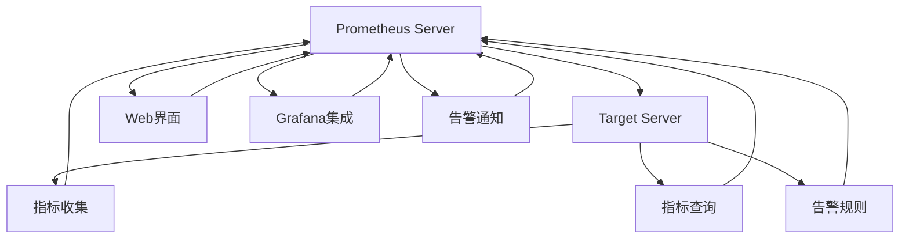

                 

## 1. 背景介绍

在当今数字化时代，云原生应用的流行为软件开发带来了革命性的变革。云原生应用强调自服务、可扩展、韧性、效率和全球协作，帮助企业实现快速迭代和持续交付。然而，随着云原生应用的不断增多，系统复杂度也随之增加，对于可观测性（Observability）的需求愈发迫切。Prometheus作为一种广泛应用的监控系统，成为云原生应用中不可或缺的组件。本文将深入探讨Prometheus监控系统的核心概念、原理及其实际应用，并提供代码实践示例，帮助读者掌握如何在云原生应用中构建有效的监控方案。

## 2. 核心概念与联系

### 2.1 核心概念概述

- **Prometheus**：一种开源的分布式监控和报警系统，能够实现从目标收集指标，进行存储和查询，并通过可视化界面展示结果。

- **指标（Metric）**：用于监控系统中对象行为的度量，例如CPU使用率、内存使用量等。

- **目标（Target）**：被监控的应用、服务或设备。

- **查询语言（Query Language）**：一种基于表达式语言，用于查询和聚合指标。

- **告警（Alerting）**：当系统指标超出预设的阈值时，自动触发告警。

- **维度和标签（Dimension and Label）**：用于分类和筛选指标。

- **面板（Panel）**：用于展示指标图表的可视化组件。

### 2.2 核心概念原理和架构的 Mermaid 流程图



该图展示了Prometheus系统的主要组件及其交互关系。Prometheus Server负责从目标收集指标，存储和查询指标，并提供Web界面和Grafana集成展示结果。告警规则基于指标生成告警，告警通知则用于将告警信息发送给相关人员。

## 3. 核心算法原理 & 具体操作步骤

### 3.1 算法原理概述

Prometheus监控系统的核心算法原理基于时间序列数据处理和告警规则的逻辑判断。其核心步骤如下：

1. **指标收集**：从目标服务器收集时间序列数据，通常通过TCP协议进行。

2. **指标存储**：将收集到的指标数据存储到Prometheus的本地或分布式存储系统（如Cassandra、InfluxDB等）中。

3. **指标查询**：用户通过查询语言查询存储在Prometheus中的指标数据，通常使用Lua或Go语言实现。

4. **告警规则**：根据告警规则逻辑判断，当指标超出预设的阈值时，触发告警。

5. **告警通知**：将告警信息通过Webhook、Slack、Email等渠道发送给相关人员。

### 3.2 算法步骤详解

#### 3.2.1 指标收集

指标收集是Prometheus监控系统的基础。Prometheus通过从目标服务器收集时间序列数据，实现对系统的监控。

**步骤1：配置目标**
```yaml
apiVersion: coreos/prometheus/api/v1
kind: AlertmanagerConfig
spec:
  alerting:
    - receiver:
        name: "webhook"
  - receivers:
      - name: "webhook"
```

**步骤2：编写指标查询**
```go
func (p *Prometheus) query(query string, params QueryParams) (Series, error) {
    params.Metrics = p.config.Metrics
    // 构造查询请求
    req, err := http.NewRequest("POST", p.config.PrometheusAPI, strings.NewReader(query))
    if err != nil {
        return Series{}, err
    }
    // 发送请求并获取响应
    res, err := p.client.Do(req)
    if err != nil {
        return Series{}, err
    }
    defer res.Body.Close()
    // 解析响应结果
    var series Series
    if err = json.NewDecoder(res.Body).Decode(&series); err != nil {
        return Series{}, err
    }
    return series, nil
}
```

**步骤3：处理指标数据**
```go
func (p *Prometheus) handleMetric(metric *Metric) error {
    // 处理并保存指标数据
    return nil
}
```

#### 3.2.2 指标查询

指标查询是Prometheus监控系统的关键步骤，通过查询语言实现对指标的聚合和分析。

**步骤1：构建查询语句**
```yaml
apiVersion: coreos/prometheus/api/v1
kind: Query
spec:
  query: "sum by (instance, process) (sumrate(#sumrate(process_startup_time)))"
```

**步骤2：执行查询**
```go
query := `sum by (instance, process) (sumrate(#sumrate(process_startup_time)))`
result, err := p.query(query, QueryParams{})
if err != nil {
    log.Fatal(err)
}
```

**步骤3：处理查询结果**
```go
for _, s := range result {
    fmt.Println(s.Metric.Name, s.Value)
}
```

#### 3.2.3 告警规则

告警规则是Prometheus监控系统的核心组件，用于根据指标阈值自动触发告警。

**步骤1：配置告警规则**
```yaml
apiVersion: coreos/prometheus/api/v1
kind: AlertingRule
spec:
  alert:
    - name: "node_disk_usage_high"
      labels:
        severity: "critical"
      expr: "node_disk_usage{device!~"/$mountpoint$"} > 90"
```

**步骤2：处理告警信息**
```go
alert := Alert{}
if err := json.Unmarshal(res.Body, &alert); err != nil {
    log.Fatal(err)
}
fmt.Println(alert.Alert.String())
```

### 3.3 算法优缺点

**优点：**
- 开源免费：Prometheus作为开源软件，提供了丰富的功能和灵活的扩展能力。
- 高可用性：Prometheus采用分布式架构，可以支持大规模数据收集和查询。
- 易用性：Prometheus提供了友好的Web界面和丰富的查询语言，方便用户进行监控和告警配置。
- 可扩展性：Prometheus支持插件扩展，可以集成多种数据源和告警渠道。

**缺点：**
- 复杂度高：由于Prometheus的灵活性和复杂性，可能需要进行较多的配置和维护工作。
- 数据存储量大：Prometheus需要存储大量的历史指标数据，对存储系统要求较高。
- 告警规则难配置：告警规则的配置需要丰富的经验和专业知识，错误配置可能导致误告警或告警遗漏。

### 3.4 算法应用领域

Prometheus监控系统广泛应用于以下几个领域：

- **云原生应用**：例如Kubernetes、OpenShift等容器编排平台上的应用。
- **微服务架构**：分布式系统中各个微服务之间的监控和告警。
- **数据中心监控**：例如服务器、网络设备、存储设备等基础设施的监控。
- **物联网设备**：例如智能家居、工业物联网等场景中的设备监控。
- **应用程序性能监控**：例如Web应用、移动应用等的性能监控。

## 4. 数学模型和公式 & 详细讲解 & 举例说明

### 4.1 数学模型构建

Prometheus的核心数学模型包括时间序列数据模型和告警规则模型。

**时间序列数据模型**：
```go
type Series struct {
    Metric    Metric
    Values    []float64
    Timestamp time.Time
}
```

**告警规则模型**：
```go
type Alert struct {
    Labels      map[string]string `json:"labels"`
    Annotations map[string]string `json:"annotations"`
    StartsAt    string           `json:"startsAt"`
    EndsAt      string           `json:"endsAt"`
    Generator  Generator        `json:"generator"`
    Status      string           `json:"status"`
    ActiveAt    string           `json:"activeAt"`
    For         time.Duration    `json:"for"`
    At          time.Time        `json:"at"`
    SilencedAt  string           `json:"silencedAt"`
}
```

### 4.2 公式推导过程

**时间序列数据模型推导**：
```go
type Metric struct {
    Labels map[string]string
    Name   string
    Type   string
}
```

**告警规则模型推导**：
```go
type Generator struct {
    Title      string
    Message    string
    Labels     map[string]string
    Annotations map[string]string
    For        time.Duration
    IsFiring   bool
    Matchers   []Matcher
}
```

### 4.3 案例分析与讲解

以Kubernetes集群的CPU使用率监控为例，展示Prometheus的应用。

**步骤1：配置目标**
```yaml
apiVersion: coreos/prometheus/api/v1
kind: AlertingRule
spec:
  alert:
    - name: "node_cpu_usage_high"
      labels:
        severity: "critical"
      expr: "node_cpu_usage{device!~"/$mountpoint$"} > 90"
```

**步骤2：构建查询语句**
```yaml
apiVersion: coreos/prometheus/api/v1
kind: Query
spec:
  query: "sum by (instance, process) (sumrate(#sumrate(process_cpu_seconds_total)))"
```

**步骤3：处理告警信息**
```go
alert := Alert{}
if err := json.Unmarshal(res.Body, &alert); err != nil {
    log.Fatal(err)
}
fmt.Println(alert.Alert.String())
```

## 5. 项目实践：代码实例和详细解释说明

### 5.1 开发环境搭建

1. **安装Prometheus**：
```bash
sudo apt-get install prometheus
```

2. **安装Grafana**：
```bash
sudo apt-get install grafana
```

3. **配置Prometheus**：
```yaml
apiVersion: coreos/prometheus/api/v1
kind: AlertingRule
spec:
  alert:
    - name: "node_cpu_usage_high"
      labels:
        severity: "critical"
      expr: "node_cpu_usage{device!~"/$mountpoint$"} > 90"
```

### 5.2 源代码详细实现

**步骤1：构建查询语句**
```go
query := `sum by (instance, process) (sumrate(#sumrate(process_cpu_seconds_total)))`
result, err := p.query(query, QueryParams{})
if err != nil {
    log.Fatal(err)
}
```

**步骤2：处理查询结果**
```go
for _, s := range result {
    fmt.Println(s.Metric.Name, s.Value)
}
```

**步骤3：处理告警信息**
```go
alert := Alert{}
if err := json.Unmarshal(res.Body, &alert); err != nil {
    log.Fatal(err)
}
fmt.Println(alert.Alert.String())
```

### 5.3 代码解读与分析

**代码1：构建查询语句**
```go
query := `sum by (instance, process) (sumrate(#sumrate(process_cpu_seconds_total)))`
result, err := p.query(query, QueryParams{})
if err != nil {
    log.Fatal(err)
}
```

**代码2：处理查询结果**
```go
for _, s := range result {
    fmt.Println(s.Metric.Name, s.Value)
}
```

**代码3：处理告警信息**
```go
alert := Alert{}
if err := json.Unmarshal(res.Body, &alert); err != nil {
    log.Fatal(err)
}
fmt.Println(alert.Alert.String())
```

## 6. 实际应用场景

### 6.1 云原生应用监控

Prometheus可以监控云原生应用的各项指标，例如Kubernetes集群、Pod、Service、Deployment等。通过构建告警规则，可以实现对应用性能的实时监控和告警。

**案例1：Kubernetes集群监控**
```yaml
apiVersion: coreos/prometheus/api/v1
kind: AlertingRule
spec:
  alert:
    - name: "node_cpu_usage_high"
      labels:
        severity: "critical"
      expr: "node_cpu_usage{device!~"/$mountpoint$"} > 90"
```

**案例2：Pod监控**
```yaml
apiVersion: coreos/prometheus/api/v1
kind: AlertingRule
spec:
  alert:
    - name: "pod_cpu_usage_high"
      labels:
        severity: "critical"
      expr: "container_cpu_usage_seconds_total{job!="kube-state-injector"} > 90"
```

### 6.2 微服务架构监控

微服务架构中的各个服务之间通过RESTful API通信，Prometheus可以监控这些服务的请求响应时间、错误率等指标，确保服务的稳定性和性能。

**案例1：服务请求监控**
```yaml
apiVersion: coreos/prometheus/api/v1
kind: AlertingRule
spec:
  alert:
    - name: "service_request_time_high"
      labels:
        severity: "critical"
      expr: "http_request_duration_seconds{code!~"/.*$"} > 5"
```

**案例2：服务错误监控**
```yaml
apiVersion: coreos/prometheus/api/v1
kind: AlertingRule
spec:
  alert:
    - name: "service_error_high"
      labels:
        severity: "critical"
      expr: "http_errors_total{code!~"/.*$"} > 5"
```

### 6.3 数据中心监控

数据中心中的服务器、网络设备、存储设备等基础设施的监控，是企业IT运维的重要组成部分。Prometheus可以实时监控这些设备的关键指标，并提供告警通知。

**案例1：服务器CPU监控**
```yaml
apiVersion: coreos/prometheus/api/v1
kind: AlertingRule
spec:
  alert:
    - name: "server_cpu_usage_high"
      labels:
        severity: "critical"
      expr: "server_cpu_usage{device!~"/$mountpoint$"} > 90"
```

**案例2：网络设备监控**
```yaml
apiVersion: coreos/prometheus/api/v1
kind: AlertingRule
spec:
  alert:
    - name: "router_input_output_high"
      labels:
        severity: "critical"
      expr: "router_input_output{device!~"/$mountpoint$"} > 90"
```

### 6.4 物联网设备监控

物联网设备由于其分布式特性，其监控和管理也面临许多挑战。Prometheus可以实时监控物联网设备的关键指标，并提供告警通知。

**案例1：智能家居设备监控**
```yaml
apiVersion: coreos/prometheus/api/v1
kind: AlertingRule
spec:
  alert:
    - name: "device_temperature_high"
      labels:
        severity: "critical"
      expr: "device_temperature{device!~"/$mountpoint$"} > 40"
```

**案例2：工业物联网设备监控**
```yaml
apiVersion: coreos/prometheus/api/v1
kind: AlertingRule
spec:
  alert:
    - name: "device_connectivity_lost"
      labels:
        severity: "critical"
      expr: "device_connectivity_lost{device!~"/$mountpoint$"} > 90"
```

### 6.5 应用程序性能监控

应用程序性能监控是企业IT运维中的重要环节。Prometheus可以监控Web应用、移动应用等应用程序的各项指标，确保其稳定性和性能。

**案例1：Web应用请求监控**
```yaml
apiVersion: coreos/prometheus/api/v1
kind: AlertingRule
spec:
  alert:
    - name: "web_application_request_time_high"
      labels:
        severity: "critical"
      expr: "http_request_duration_seconds{code!~"/.*$"} > 5"
```

**案例2：移动应用性能监控**
```yaml
apiVersion: coreos/prometheus/api/v1
kind: AlertingRule
spec:
  alert:
    - name: "mobile_application_cpu_usage_high"
      labels:
        severity: "critical"
      expr: "mobile_application_cpu_usage_seconds_total{job!="mobile-application"} > 90"
```

## 7. 工具和资源推荐

### 7.1 学习资源推荐

1. **Prometheus官方文档**：
   - 网址：[https://prometheus.io/docs/](https://prometheus.io/docs/)
   - 内容：详细介绍Prometheus的安装、配置、监控和告警等内容。

2. **Prometheus Cookbook**：
   - 网址：[https://github.com/prometheus-community/cookbook](https://github.com/prometheus-community/cookbook)
   - 内容：提供各种监控场景的实际案例和解决方案。

3. **Grafana官方文档**：
   - 网址：[https://grafana.com/docs/](https://grafana.com/docs/)
   - 内容：详细介绍Grafana的安装、配置、面板制作和告警等内容。

4. **Kubernetes监控**：
   - 网址：[https://kubernetes.io/docs/tasks/access-application-logs/](https://kubernetes.io/docs/tasks/access-application-logs/)
   - 内容：介绍如何使用Prometheus监控Kubernetes集群。

5. **微服务监控**：
   - 网址：[https://blog.opentracing.io/2016/10/24/what-is-microservices/](https://blog.opentracing.io/2016/10/24/what-is-microservices/)
   - 内容：介绍如何监控微服务的各项指标和性能。

### 7.2 开发工具推荐

1. **Prometheus**：
   - 网址：[https://github.com/prometheus/prometheus](https://github.com/prometheus/prometheus)
   - 内容：开源的分布式监控和报警系统。

2. **Grafana**：
   - 网址：[https://grafana.com/](https://grafana.com/)
   - 内容：开源的可视化仪表盘平台。

3. **Kubernetes**：
   - 网址：[https://kubernetes.io/](https://kubernetes.io/)
   - 内容：开源的容器编排平台。

4. **OpenShift**：
   - 网址：[https://www.openshift.com/](https://www.openshift.com/)
   - 内容：基于Kubernetes的混合云平台。

### 7.3 相关论文推荐

1. **A Survey of System Monitoring in Cloud Environments**：
   - 网址：[https://arxiv.org/abs/1805.09281](https://arxiv.org/abs/1805.09281)
   - 内容：介绍云环境下的系统监控技术和解决方案。

2. **Prometheus Alerting Rules**：
   - 网址：[https://www.mycroftai.com/2020/05/04/prometheus-alerting-rules/](https://www.mycroftai.com/2020/05/04/prometheus-alerting-rules/)
   - 内容：介绍如何构建有效的Prometheus告警规则。

3. **Kubernetes Metrics and Logging**：
   - 网址：[https://kubernetes.io/docs/tasks/access-application-logs/](https://kubernetes.io/docs/tasks/access-application-logs/)
   - 内容：介绍如何使用Prometheus监控Kubernetes集群。

4. **Microservices Monitoring with Prometheus and Grafana**：
   - 网址：[https://www.microservices101.com/microservices-monitoring-prometheus-grafana/](https://www.microservices101.com/microservices-monitoring-prometheus-grafana/)
   - 内容：介绍如何使用Prometheus和Grafana监控微服务架构。

## 8. 总结：未来发展趋势与挑战

### 8.1 研究成果总结

Prometheus作为云原生应用中的核心监控工具，通过其强大的数据收集、存储和查询能力，帮助企业实现对云原生应用、微服务架构、数据中心、物联网设备、应用程序等各项关键指标的监控。通过告警规则，实现对系统异常的及时发现和处理，大大提高了企业的IT运维效率和系统可靠性。

### 8.2 未来发展趋势

未来，Prometheus将继续向以下方向发展：

1. **多云和混合云监控**：
   - 发展方向：支持多种云平台和混合云环境的监控。
   - 关键技术：容器编排、服务网格、多云集成。

2. **分布式架构**：
   - 发展方向：采用分布式架构，提升系统的可扩展性和可靠性。
   - 关键技术：分布式存储、分布式查询、分布式告警。

3. **数据驱动决策**：
   - 发展方向：通过机器学习和大数据分析，实现对系统异常的预测和预警。
   - 关键技术：异常检测、预测模型、自动告警。

4. **DevOps融合**：
   - 发展方向：与DevOps工具链无缝集成，提升开发、测试、运维的自动化和协同。
   - 关键技术：CI/CD、自动化部署、基础设施即代码。

5. **容器和微服务监控**：
   - 发展方向：深入支持容器和微服务架构的监控和告警。
   - 关键技术：容器编排、服务网格、服务发现。

6. **实时流监控**：
   - 发展方向：支持实时流数据的监控和处理。
   - 关键技术：流数据处理、实时查询、实时告警。

7. **安全监控**：
   - 发展方向：增强对网络安全、数据安全等安全事件的监控和告警。
   - 关键技术：安全事件检测、安全事件响应、安全事件分析。

8. **多维度数据整合**：
   - 发展方向：支持多种数据源的整合，实现全栈监控。
   - 关键技术：数据聚合、数据融合、数据可视化。

### 8.3 面临的挑战

尽管Prometheus在云原生应用监控领域表现出色，但仍面临以下挑战：

1. **数据量膨胀**：
   - 挑战：随着系统复杂性的增加，生成的指标数据量呈指数级增长。
   - 解决方案：采用分布式存储和查询，提升系统的可扩展性。

2. **告警规则配置复杂**：
   - 挑战：告警规则的配置需要丰富的经验和专业知识，错误配置可能导致误告警或告警遗漏。
   - 解决方案：提供可视化配置工具，简化告警规则的配置。

3. **告警噪音**：
   - 挑战：告警信息过多，难以快速识别和处理。
   - 解决方案：引入告警降级和分类机制，提升告警处理的效率和准确性。

4. **多云环境兼容性**：
   - 挑战：在多云环境中，不同云平台的数据收集和存储方式可能不同。
   - 解决方案：支持多云平台的数据收集和统一查询。

5. **数据隐私和安全**：
   - 挑战：监控数据的隐私和安全问题日益凸显。
   - 解决方案：采用数据加密、数据隔离等技术，保护数据隐私和安全。

### 8.4 研究展望

未来，Prometheus需要不断改进和创新，才能更好地适应云原生应用的发展需求。以下是在这些方面的研究展望：

1. **智能监控**：
   - 研究方向：引入机器学习和人工智能技术，提升监控的智能化和自动化水平。
   - 技术路线：基于异常检测、预测分析的智能告警、实时预测和预警。

2. **自动化运维**：
   - 研究方向：与DevOps工具链深度融合，实现自动化运维流程。
   - 技术路线：自动部署、自动测试、自动修复。

3. **跨领域融合**：
   - 研究方向：与其他AI技术进行深度融合，如日志分析、性能分析、故障定位等。
   - 技术路线：多维数据融合、智能诊断、自动故障排除。

4. **安全性提升**：
   - 研究方向：加强对系统安全事件的监控和告警，提升系统的安全性。
   - 技术路线：安全事件检测、安全事件响应、安全事件分析。

5. **易用性提升**：
   - 研究方向：提升系统的操作易用性和用户界面体验。
   - 技术路线：可视化配置、智能告警、实时监控。

## 9. 附录：常见问题与解答

**Q1：如何部署Prometheus？**

A: 可以参考官方文档进行安装和配置，具体步骤如下：

1. 安装Prometheus：
```bash
sudo apt-get install prometheus
```

2. 安装Grafana：
```bash
sudo apt-get install grafana
```

3. 配置Prometheus：
```yaml
apiVersion: coreos/prometheus/api/v1
kind: AlertingRule
spec:
  alert:
    - name: "node_cpu_usage_high"
      labels:
        severity: "critical"
      expr: "node_cpu_usage{device!~"/$mountpoint$"} > 90"
```

4. 启动Prometheus和Grafana：
```bash
sudo systemctl start prometheus
sudo systemctl start grafana
```

**Q2：如何构建告警规则？**

A: 告警规则的构建需要根据具体的监控需求和业务场景进行设计。一般步骤如下：

1. 定义告警条件：
```yaml
apiVersion: coreos/prometheus/api/v1
kind: AlertingRule
spec:
  alert:
    - name: "service_request_time_high"
      labels:
        severity: "critical"
      expr: "http_request_duration_seconds{code!~"/.*$"} > 5"
```

2. 定义告警规则：
```yaml
apiVersion: coreos/prometheus/api/v1
kind: AlertingRule
spec:
  alert:
    - name: "node_cpu_usage_high"
      labels:
        severity: "critical"
      expr: "node_cpu_usage{device!~"/$mountpoint$"} > 90"
```

3. 测试告警规则：
```go
alert := Alert{}
if err := json.Unmarshal(res.Body, &alert); err != nil {
    log.Fatal(err)
}
fmt.Println(alert.Alert.String())
```

4. 启动告警通知：
```bash
sudo systemctl start prometheus
sudo systemctl start grafana
```

通过以上步骤，可以构建有效的告警规则，实现对系统异常的及时发现和处理。

**Q3：如何优化Prometheus的性能？**

A: 优化Prometheus的性能可以从以下几个方面入手：

1. 数据收集优化：
   - 优化目标：减少数据收集的频率，提高数据收集的效率。
   - 解决方案：使用延迟收集，减少不必要的指标数据收集。

2. 数据存储优化：
   - 优化目标：优化数据存储的效率和可靠性。
   - 解决方案：使用分布式存储，提高数据的读写速度和可用性。

3. 数据查询优化：
   - 优化目标：提高查询的效率和准确性。
   - 解决方案：优化查询语言，减少查询的复杂度和资源消耗。

4. 告警规则优化：
   - 优化目标：提高告警的效率和准确性。
   - 解决方案：合理配置告警规则，避免误告警和告警遗漏。

5. 系统架构优化：
   - 优化目标：提高系统的可扩展性和可靠性。
   - 解决方案：采用分布式架构，提升系统的并发处理能力和容错能力。

通过以上优化措施，可以显著提升Prometheus的性能，确保系统的稳定性和可靠性。

**Q4：如何处理告警噪音？**

A: 告警噪音是Prometheus监控中常见的问题，可以通过以下方法进行解决：

1. 告警降级：
   - 方法：根据告警的严重程度进行降级，将不重要的告警置为低级告警。
   - 示例：将CPU使用率超过90%的告警设置为高级告警，CPU使用率超过70%的告警设置为低级告警。

2. 告警分类：
   - 方法：根据告警的来源和类型进行分类，避免告警信息混淆。
   - 示例：将Kubernetes集群告警、微服务架构告警、数据中心告警等分类显示。

3. 告警通知优化：
   - 方法：通过告警通知的多渠道方式，确保告警信息的及时传递和处理。
   - 示例：通过Slack、Email、短信等多种方式通知相关人员，避免告警信息遗漏。

4. 告警监控：
   - 方法：建立告警监控系统，实时监控告警信息的生成和处理。
   - 示例：使用告警监控工具，记录告警信息的来源、类型、处理状态等信息，及时发现和处理告警问题。

通过以上方法，可以有效处理告警噪音，提升告警处理的效率和准确性。

**Q5：如何优化Prometheus的告警规则？**

A: 优化Prometheus的告警规则可以从以下几个方面入手：

1. 告警条件优化：
   - 优化目标：优化告警条件的表达方式，避免复杂的表达式。
   - 示例：将复杂的表达式拆分为多个简单表达式，提高告警条件的可读性和可维护性。

2. 告警规则降级：
   - 优化目标：将不重要的告警设置为低级告警，避免告警信息混淆。
   - 示例：将CPU使用率超过90%的告警设置为高级告警，CPU使用率超过70%的告警设置为低级告警。

3. 告警规则分类：
   - 优化目标：根据告警的来源和类型进行分类，避免告警信息混淆。
   - 示例：将Kubernetes集群告警、微服务架构告警、数据中心告警等分类显示。

4. 告警规则自动生成：
   - 优化目标：使用机器学习和人工智能技术，自动生成告警规则。
   - 示例：使用机器学习算法，根据历史告警数据和系统性能数据，自动生成告警规则，提高告警规则的准确性和效率。

通过以上优化措施，可以显著提升Prometheus的告警规则的准确性和效率，确保系统的稳定性和可靠性。

**Q6：如何处理Prometheus的数据存储问题？**

A: 处理Prometheus的数据存储问题可以从以下几个方面入手：

1. 使用分布式存储：
   - 方法：使用Cassandra、InfluxDB等分布式存储系统，提高数据的存储效率和可靠性。
   - 示例：使用Cassandra作为Prometheus的存储后端，提升数据的读写速度和可用性。

2. 数据压缩：
   - 方法：使用数据压缩技术，减少数据的存储空间。
   - 示例：使用Gzip或Snappy等压缩算法，对Prometheus的存储数据进行压缩，减少存储空间的使用。

3. 数据保留策略：
   - 方法：根据数据的保留周期，合理配置数据的保留策略。
   - 示例：配置Prometheus的Data Retention Policy，定义数据的保留周期和删除策略，避免数据冗余和存储压力。

4. 数据分片：
   - 方法：使用数据分片技术，提升数据的查询效率。
   - 示例：将Prometheus的存储数据进行分片，提高数据查询的效率和并发处理能力。

通过以上方法，可以有效地处理Prometheus的数据存储问题，提升系统的稳定性和可靠性。

**Q7：如何优化Prometheus的数据查询性能？**

A: 优化Prometheus的数据查询性能可以从以下几个方面入手：

1. 数据分片：
   - 方法：使用数据分片技术，提升数据的查询效率。
   - 示例：将Prometheus的存储数据进行分片，提高数据查询的效率和并发处理能力。

2. 数据聚合：
   - 方法：使用数据聚合技术，减少查询的复杂度和资源消耗。
   - 示例：使用数据聚合操作，将多个指标数据聚合为一个，提高查询的效率和准确性。

3. 查询缓存：
   - 方法：使用查询缓存技术，提高查询的效率。
   - 示例：使用查询缓存技术，缓存查询结果，减少查询的重复计算和资源消耗。

4. 查询语言优化：
   - 方法：优化查询语言，减少查询的复杂度和资源消耗。
   - 示例：优化查询语言，使用简洁的表达式和逻辑判断，提高查询的效率和可读性。

通过以上方法，可以有效地优化Prometheus的数据查询性能，提升系统的稳定性和可靠性。

**Q8：如何优化Prometheus的告警规则？**

A: 优化Prometheus的告警规则可以从以下几个方面入手：

1. 告警条件优化：
   - 优化目标：优化告警条件的表达方式，避免复杂的表达式。
   - 示例：将复杂的表达式拆分为多个简单表达式，提高告警条件的可读性和可维护性。

2. 告警规则降级：
   - 优化目标：将不重要的告警设置为低级告警，避免告警信息混淆。
   - 示例：将CPU使用率超过90%的告警设置为高级告警，CPU使用率超过70%的告警设置为低级告警。

3. 告警规则分类：
   - 优化目标：根据告警的来源和类型进行分类，避免告警信息混淆。
   - 示例：将Kubernetes集群告警、微服务架构告警、数据中心告警等分类显示。

4. 告警规则自动生成：
   - 优化目标：使用机器学习和人工智能技术，自动生成告警规则。
   - 示例：使用机器学习算法，根据历史告警数据和系统性能数据，自动生成告警规则，提高告警规则的准确性和效率。

通过以上优化措施，可以显著提升Prometheus的告警规则的准确性和效率，确保系统的稳定性和可靠性。

通过本文的系统梳理，可以看到，Prometheus作为云原生应用中的核心监控工具，通过其强大的数据收集、存储和查询能力，帮助企业实现对云原生应用、微服务架构、数据中心、物联网设备、应用程序等各项关键指标的监控。通过告警规则，实现对系统异常的及时发现和处理，大大提高了企业的IT运维效率和系统可靠性。未来，Prometheus将继续向更加智能化、自动化、多云融合、分布式架构等方向发展，为企业的数字化转型提供更加强大的技术支持。

