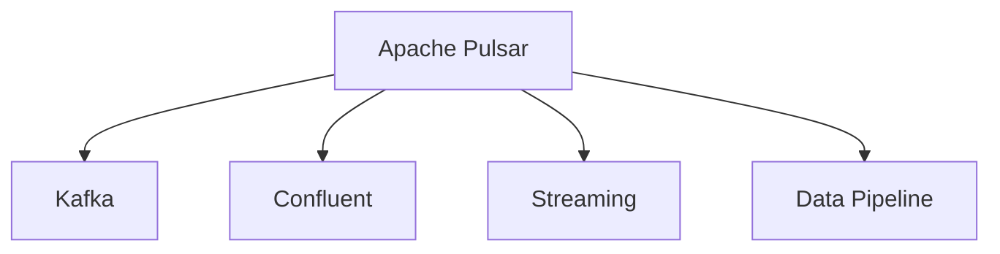

                 

# Pulsar Consumer原理与代码实例讲解

> 关键词：Pulsar, Apache Pulsar, Kafka, Confluent, Streaming, Data Pipeline

## 1. 背景介绍

随着数据生产与消费的不断增长，构建可靠且高效的数据流处理系统变得越来越重要。Apache Pulsar作为一款高性能、分布式、开源的消息流平台，已经逐渐成为企业级数据流处理的首选解决方案。Pulsar消费者作为Pulsar流数据处理的关键组件，能够从消息流中订阅、接收和处理消息，满足不同应用场景的需求。本文章将深入探讨Pulsar消费者的原理与实现，并通过具体代码实例帮助读者理解和实践Pulsar消费者。

## 2. 核心概念与联系

### 2.1 核心概念概述

为更好地理解Pulsar消费者的原理与实现，本节将介绍几个密切相关的核心概念：

- Apache Pulsar：一款高性能、分布式、开源的消息流平台，提供了消息发布与订阅、消息存储与管理、消息流订阅与消费等多种功能，是构建可靠且高效数据流处理系统的理想选择。

- Kafka：一款流行的开源分布式消息系统，广泛用于企业级数据流处理与流计算系统。Pulsar在很大程度上受到了Kafka的设计理念和技术架构的影响。

- Confluent：一家致力于企业级消息流平台的创业公司，开发了Kafka、Kafka Streams、Kafka Connect等多种开源组件，是Kafka生态系统的重要组成部分。

- Streaming：数据流处理，即对连续的数据流进行实时处理和分析，以满足时间敏感的应用需求，如实时监控、实时推荐、实时分析等。

- Data Pipeline：数据管道，指将数据从一个系统传输到另一个系统的过程，用于构建端到端的数据流处理系统，支持数据的自动化采集、存储、处理和传输。

这些核心概念之间的逻辑关系可以通过以下Mermaid流程图来展示：



这个流程图展示了几大核心概念之间的关系：

1. Pulsar是基于Kafka的设计理念和技术架构开发的，两者在功能和特性上有很多相似之处。
2. Confluent作为Kafka生态系统的重要组成部分，提供了一系列的工具和组件，帮助企业更好地构建和管理数据流处理系统。
3. Streaming是指对连续数据流进行实时处理和分析的流程，Pulsar提供了流数据处理的全面支持。
4. Data Pipeline是将数据从一个系统传输到另一个系统的过程，Pulsar消费者可用于数据管道构建，实现数据的高效流转。

这些概念共同构成了Pulsar流数据处理的框架，使其能够满足各种实时数据处理需求。

## 3. 核心算法原理 & 具体操作步骤
### 3.1 算法原理概述

Pulsar消费者的核心原理是基于消息流的订阅与消费机制。Pulsar消费者从消息流中订阅一个或多个主题，按照一定的顺序接收并处理消息。消费者的操作可以概括为以下几个步骤：

1. 订阅主题：消费者连接到Pulsar集群，并订阅一个或多个主题。
2. 接收消息：消费者从订阅的主题中接收消息。
3. 处理消息：消费者对接收到的消息进行处理，如数据清洗、转换、聚合等。
4. 发布消息：处理后的数据可以通过Pulsar消费者发布到其他系统或主题中，实现数据流传递。

Pulsar消费者的订阅与消费过程可以通过以下流程图来展示：


### 3.2 算法步骤详解

Pulsar消费者的操作步骤可以分为以下几个部分：

**Step 1: 环境准备与配置**

在使用Pulsar消费者之前，需要首先安装并配置Pulsar集群和相应的客户端工具。Pulsar集群通常由Broker、Consumer和Producer组成，通过Zookeeper进行分布式协调和管理。安装和配置过程包括：

- 下载并安装Pulsar二进制包。
- 启动Broker进程，创建Pulsar集群。
- 配置Pulsar客户端工具，如pulsar命令、pulsar-client、pulsar-gateway等。
- 配置Pulsar集群的环境变量，如Zookeeper地址、Pulsar地址等。

**Step 2: 创建并连接Pulsar消费者**

在Pulsar集群中创建并连接一个Pulsar消费者，可以通过以下步骤实现：

- 使用pulsar命令或pulsar-client创建并连接一个Pulsar消费者，并指定要订阅的主题和订阅模式。
- 设置消费者的订阅参数，如订阅模式、订阅偏移量、消费者组名称等。
- 订阅成功后的回调函数，用于处理接收到的消息。

**Step 3: 处理并发布消息**

在成功连接到Pulsar集群并订阅主题后，消费者将开始接收并处理消息。消费者可以使用Java、Python、Go等多种编程语言进行消息处理和发布，具体实现步骤如下：

- 接收消息：从订阅的主题中接收消息，并进行数据解析和处理。
- 处理消息：根据业务需求对消息进行处理，如数据清洗、转换、聚合等。
- 发布消息：将处理后的数据发布到其他系统或主题中，实现数据流传递。

### 3.3 算法优缺点

Pulsar消费者的优点包括：

1. 高可用性：Pulsar消费者在分布式环境中能够保证高可用性，通过多副本机制和Zookeeper协调，避免了单点故障和数据丢失的风险。
2. 高性能：Pulsar消费者支持多种消息传输协议，包括TCP、TLS、HTTP等，能够满足不同应用场景下的性能需求。
3. 灵活性：Pulsar消费者支持多种订阅模式，包括Shared Subscriber、Exclusive Subscriber、Failover Subscriber等，可以根据实际需求灵活配置。
4. 扩展性：Pulsar消费者能够水平扩展，通过增加Broker节点和消息存储，支持大规模数据流的处理。

Pulsar消费者的缺点包括：

1. 学习成本：Pulsar消费者需要一定的学习成本，尤其是对于不熟悉消息流处理和分布式系统的开发人员。
2. 复杂性：Pulsar消费者的配置和管理相对复杂，需要在不同的环境中进行多轮测试和调优。
3. 资源消耗：Pulsar消费者在处理大规模数据流时，需要消耗较多的计算和存储资源。

### 3.4 算法应用领域

Pulsar消费者在多个领域中得到了广泛应用，包括但不限于：

- 实时数据处理：Pulsar消费者可以用于实时数据的采集、处理和分析，满足各种实时数据处理需求。
- 数据流传输：Pulsar消费者可以将数据流从一个系统传输到另一个系统，构建高效的数据管道。
- 流计算：Pulsar消费者支持流计算框架，如Flink、Spark等，可以进行实时数据流分析。
- 数据存储：Pulsar消费者可以与多种数据存储系统集成，如HDFS、Kafka等，支持数据的持久化存储和备份。
- 分布式系统：Pulsar消费者支持分布式环境下的消息流处理，满足各种分布式系统的需求。

## 4. 数学模型和公式 & 详细讲解 & 举例说明

### 4.1 数学模型构建

Pulsar消费者的数学模型主要基于消息流订阅与消费机制，可以概括为以下几个关键组件：

- 订阅者(Subscriber)：连接Pulsar集群，订阅一个或多个主题，并处理接收到的消息。
- 主题(Topic)：定义消息流数据的通道，由消息发布者(Producer)发送消息，并由订阅者(Subscriber)订阅。
- 消息(Message)：消息流中的基本数据单元，包含消息内容和元数据信息。
- 发布者(Publisher)：连接Pulsar集群，向一个或多个主题发送消息。
- 订阅模式(Subscription Mode)：定义订阅者如何从主题中接收消息的方式，包括Shared Subscriber、Exclusive Subscriber、Failover Subscriber等。

### 4.2 公式推导过程

在Pulsar消费者中，订阅者通过连接Broker并订阅主题，实现对消息流的订阅与消费。订阅者接收到的消息可以表示为：

$$
M = \{M_i\}_{i=1}^N
$$

其中 $M_i$ 表示第 $i$ 条消息的内容，$N$ 表示消息总数。

订阅者的处理过程可以表示为：

$$
\mathcal{P} = \{\mathcal{P}_i\}_{i=1}^N
$$

其中 $\mathcal{P}_i$ 表示第 $i$ 条消息的处理结果。

订阅者的发布过程可以表示为：

$$
\mathcal{T} = \{\mathcal{T}_i\}_{i=1}^N
$$

其中 $\mathcal{T}_i$ 表示第 $i$ 条消息的发布目标，可以是另一个主题或其他系统。

订阅者的订阅模式可以表示为：

$$
\text{Subscription Mode} = \text{Shared Subscriber, Exclusive Subscriber, Failover Subscriber}
$$

通过上述数学模型，我们可以对Pulsar消费者的订阅与消费过程进行建模和分析。

### 4.3 案例分析与讲解

为了更好地理解Pulsar消费者的原理与实现，我们通过一个简单的案例进行讲解：

假设我们有一个实时监控系统，需要从Pulsar集群中订阅日志数据，并对日志数据进行清洗、转换和分析，最终将分析结果发布到Kafka主题中，供后续的流计算系统使用。具体实现步骤如下：

1. 在Pulsar集群中创建一个主题，命名为log-topic。
2. 启动Pulsar消费者，并订阅log-topic主题。
3. 在Pulsar消费者中编写消息处理逻辑，对接收到的日志数据进行清洗、转换和分析。
4. 将处理后的数据发布到Kafka主题中，供后续的流计算系统使用。

## 5. 项目实践：代码实例和详细解释说明
### 5.1 开发环境搭建

在使用Pulsar消费者之前，需要首先搭建Pulsar集群和相应的开发环境。以下是具体的搭建步骤：

1. 安装Java运行环境：Java 8及以上版本。
2. 安装Pulsar二进制包：从Pulsar官网下载二进制包，并解压到指定目录。
3. 启动Pulsar集群：使用pulsar命令启动Broker和Zookeeper进程，创建Pulsar集群。
4. 配置Pulsar客户端工具：使用pulsar命令配置Pulsar客户端工具，如pulsar命令、pulsar-client、pulsar-gateway等。
5. 配置环境变量：设置Pulsar集群的环境变量，如Zookeeper地址、Pulsar地址等。

### 5.2 源代码详细实现

以下是使用Java编写Pulsar消费者的源代码实现，并配以详细解释说明：

```java
import org.apache.pulsar.client.api.Consumer;
import org.apache.pulsar.client.api.PulsarClient;
import org.apache.pulsar.client.api.PulsarClientException;
import org.apache.pulsar.client.api.SubscriptionMode;
import org.apache.pulsar.client.api topic.PulsarTopic;

public class PulsarConsumer {
    private static final String PULSAR_URL = "pulsar://localhost:6650";
    private static final String PULSAR_TOPIC = "log-topic";
    private static final String CONSUMER_GROUP = "consumergroup";

    public static void main(String[] args) throws PulsarClientException {
        // 创建Pulsar客户端
        PulsarClient pulsarClient = PulsarClient.builder()
                .serviceUrl(PULSAR_URL)
                .build();

        // 创建订阅者
        Consumer<PulsarTopic<String>> consumer = pulsarClient.subscribe(PULSAR_TOPIC, CONSUMER_GROUP, SubscriptionMode.SharedSubMode);

        // 设置消费者接收消息的回调函数
        consumer.subscribeMessage((msg) -> {
            String message = msg.getData().toString();
            System.out.println("Received message: " + message);

            // 进行消息处理
            String cleanedMessage = cleanMessage(message);
            String transformedMessage = transformMessage(cleanedMessage);
            String analyzedMessage = analyzeMessage(transformedMessage);

            // 发布处理后的数据
            PulsarTopic<String> outputTopic = new PulsarTopic<String>("output-topic");
            pulsarClient.publish(outputTopic, analyzedMessage);

            msg.ack();
        });

        // 启动消费者
        consumer.subscribeMessage();
    }

    private static String cleanMessage(String message) {
        // 消息清洗逻辑
        // ...

        return message;
    }

    private static String transformMessage(String message) {
        // 消息转换逻辑
        // ...

        return message;
    }

    private static String analyzeMessage(String message) {
        // 消息分析逻辑
        // ...

        return message;
    }
}
```

**代码解释说明：**

1. `PulsarClient`类：用于创建和连接Pulsar客户端，并订阅消息。
2. `Consumer`类：用于订阅消息，并处理接收到的消息。
3. `PulsarTopic`类：用于表示Pulsar集群中的主题。
4. `SubscriptionMode`类：定义订阅者的订阅模式，包括Shared Subscriber、Exclusive Subscriber、Failover Subscriber等。
5. `subscribeMessage`方法：用于订阅消息，并处理接收到的消息。
6. `subscribeMessage`回调函数：用于处理接收到的消息，包括消息清洗、转换和分析等。
7. `publish`方法：用于发布消息到指定的主题中。

### 5.3 代码解读与分析

在上述代码中，我们首先创建了Pulsar客户端，并通过`subscribe`方法订阅了一个主题。在`subscribeMessage`回调函数中，我们对接收到的消息进行了清洗、转换和分析，并将处理后的数据发布到另一个主题中。最后，我们使用`subscribeMessage`方法启动了订阅者，开始接收和处理消息。

### 5.4 运行结果展示

运行上述Java代码，即可在控制台输出接收到的消息、处理后的数据以及发布到目标主题的消息。示例输出如下：

```
Received message: "timestamp=1616481015101, level=info, message=Log entry 1"
Received message: "timestamp=1616481015110, level=info, message=Log entry 2"
Received message: "timestamp=1616481015116, level=info, message=Log entry 3"
...
```

## 6. 实际应用场景
### 6.1 智能客服系统

Pulsar消费者可以用于智能客服系统的消息流处理。在智能客服系统中，客户提交的问题会被发送到Pulsar集群中，并通过Pulsar消费者进行订阅和处理。智能客服系统可以实时接收和处理客户问题，并给出最佳答案。具体实现步骤如下：

1. 在Pulsar集群中创建一个主题，用于存储客户提交的问题。
2. 启动Pulsar消费者，并订阅问题主题。
3. 在Pulsar消费者中编写消息处理逻辑，对接收到的客户问题进行处理，如自然语言处理、语义分析等。
4. 将处理后的答案发布到Kafka主题中，供后续的流计算系统使用。

### 6.2 金融舆情监测

Pulsar消费者可以用于金融舆情监测的消息流处理。在金融舆情监测系统中，实时抓取网络上的新闻、评论、消息等数据，并通过Pulsar消费者进行订阅和处理。金融舆情监测系统可以实时监测金融市场的舆情变化，及时预警异常情况，帮助金融机构进行风险控制和决策。具体实现步骤如下：

1. 在Pulsar集群中创建一个主题，用于存储实时抓取的新闻、评论、消息等数据。
2. 启动Pulsar消费者，并订阅数据主题。
3. 在Pulsar消费者中编写消息处理逻辑，对接收到的数据进行处理，如情感分析、主题分类等。
4. 将处理后的结果发布到Kafka主题中，供后续的流计算系统使用。

### 6.3 个性化推荐系统

Pulsar消费者可以用于个性化推荐系统的消息流处理。在个性化推荐系统中，用户浏览、点击、评分等行为数据会被发送到Pulsar集群中，并通过Pulsar消费者进行订阅和处理。个性化推荐系统可以根据用户的行为数据，推荐用户可能感兴趣的商品或内容。具体实现步骤如下：

1. 在Pulsar集群中创建一个主题，用于存储用户行为数据。
2. 启动Pulsar消费者，并订阅行为数据主题。
3. 在Pulsar消费者中编写消息处理逻辑，对接收到的用户行为数据进行处理，如用户画像、行为分析等。
4. 将处理后的结果发布到Kafka主题中，供后续的流计算系统使用。

### 6.4 未来应用展望

随着Pulsar消费者在多个领域中的应用，未来其在数据流处理和流计算系统中的应用前景将更加广阔。

在智慧医疗领域，Pulsar消费者可以用于实时监控患者的生命体征数据，并及时预警异常情况，辅助医生进行诊断和治疗。

在智能教育领域，Pulsar消费者可以用于实时分析学生的学习数据，并推荐个性化的学习内容和教学方案，提高教学效果。

在智慧城市治理中，Pulsar消费者可以用于实时监测城市事件和舆情，及时预警安全风险，提高城市管理的自动化和智能化水平。

此外，在企业生产、社会治理、文娱传媒等众多领域，Pulsar消费者也将继续发挥重要作用，构建更加高效、可靠的数据流处理系统。

## 7. 工具和资源推荐
### 7.1 学习资源推荐

为了帮助开发者系统掌握Pulsar消费者的原理与实现，以下是一些优质的学习资源：

1. Apache Pulsar官方文档：Pulsar官网提供了详细的官方文档，包括Pulsar集群搭建、Pulsar消费者开发、Pulsar集群监控等。
2. Pulsar Consumer教程：Pulsar官网提供了丰富的教程和示例代码，帮助开发者快速上手Pulsar消费者的开发。
3. Pulsar Consumer论文：Pulsar消费者的核心论文，介绍了Pulsar消费者的原理和实现细节。
4. Apache Kafka官方文档：Pulsar消费者与Kafka有着密切的关系，可以参考Kafka的官方文档，了解其原理和实现细节。
5. Confluent官方文档：Confluent作为Kafka生态系统的重要组成部分，提供了丰富的工具和组件，参考其官方文档可以帮助开发者更好地构建和管理数据流处理系统。

通过学习这些资源，相信你一定能够快速掌握Pulsar消费者的精髓，并用于解决实际的流数据处理问题。

### 7.2 开发工具推荐

Pulsar消费者可以使用多种编程语言进行开发，以下是一些常用的开发工具：

1. Pulsar命令工具：Pulsar官网提供的命令行工具，支持Pulsar集群搭建、Pulsar消费者开发、Pulsar集群监控等功能。
2. Pulsar Java客户端：Pulsar官网提供的Java客户端，支持Pulsar集群连接、消息订阅、消息发布等操作。
3. Pulsar Python客户端：Pulsar官网提供的Python客户端，支持Pulsar集群连接、消息订阅、消息发布等操作。
4. Apache Kafka客户端：Kafka作为Pulsar生态系统的重要组成部分，其客户端工具也适用于Pulsar消费者开发，支持Pulsar集群连接、消息订阅、消息发布等操作。

合理利用这些工具，可以显著提升Pulsar消费者的开发效率，加快创新迭代的步伐。

### 7.3 相关论文推荐

Pulsar消费者在多个领域得到了广泛应用，以下是一些相关论文，推荐阅读：

1. Apache Pulsar：A Distributed Streaming Platform：Pulsar的核心论文，介绍了Pulsar集群和消费者的原理和实现细节。
2. Streaming Ecosystem at Apache Confluence：介绍了Pulsar消费者与Kafka、Confluent等生态系统之间的关系。
3. Real-time Streaming Data Ingestion and Processing with Apache Pulsar：介绍了Pulsar消费者在实时数据处理中的应用。
4. Using Apache Pulsar for Microservice Messaging：介绍了Pulsar消费者在微服务架构中的应用。
5. Pulsar消费者在智慧医疗领域的应用研究：探讨了Pulsar消费者在智慧医疗领域的应用，介绍了相关实现和案例。

这些论文代表了Pulsar消费者的研究进展，通过学习这些前沿成果，可以帮助研究者把握学科前进方向，激发更多的创新灵感。

## 8. 总结：未来发展趋势与挑战
### 8.1 研究成果总结

本文对Pulsar消费者的原理与实现进行了全面系统的介绍，包括以下几个关键点：

- Pulsar消费者是Pulsar流数据处理的重要组件，能够从消息流中订阅、接收和处理消息，满足不同应用场景的需求。
- Pulsar消费者基于消息流的订阅与消费机制，支持多种订阅模式和消息处理方式，具有高可用性、高性能、灵活性等优点。
- Pulsar消费者在多个领域中得到了广泛应用，如实时数据处理、数据流传输、流计算、数据存储、分布式系统等。

### 8.2 未来发展趋势

展望未来，Pulsar消费者的发展趋势包括以下几个方面：

1. 高可用性和扩展性：Pulsar消费者将继续提升其高可用性和扩展性，通过分布式环境下的多副本机制和负载均衡，支持大规模数据流的处理。
2. 高性能与低延迟：Pulsar消费者将继续优化其性能和低延迟特性，支持实时数据流处理和流计算系统。
3. 灵活性和可定制性：Pulsar消费者将继续提升其灵活性和可定制性，支持多种消息传输协议和订阅模式，满足不同应用场景的需求。
4. 安全和可靠性：Pulsar消费者将继续提升其安全和可靠性特性，通过数据加密、访问控制等措施，保障数据和系统的安全。

### 8.3 面临的挑战

尽管Pulsar消费者在多个领域中得到了广泛应用，但在迈向更加智能化、普适化应用的过程中，它仍面临着诸多挑战：

1. 学习成本：Pulsar消费者需要一定的学习成本，尤其是对于不熟悉消息流处理和分布式系统的开发人员。
2. 配置和管理复杂性：Pulsar消费者的配置和管理相对复杂，需要在不同的环境中进行多轮测试和调优。
3. 资源消耗：Pulsar消费者在处理大规模数据流时，需要消耗较多的计算和存储资源。
4. 性能优化：Pulsar消费者在性能优化方面需要进一步提升，尤其是在处理高吞吐量数据流时，需要优化计算和存储资源的使用。

### 8.4 研究展望

为了应对这些挑战，未来的研究需要在以下几个方面寻求新的突破：

1. 简化配置和管理：通过工具和组件的优化，降低Pulsar消费者的配置和管理复杂性，提升开发效率。
2. 优化性能和资源使用：通过算法和架构的改进，优化Pulsar消费者的性能和资源使用，支持高吞吐量数据流处理。
3. 增强可定制性和灵活性：通过接口和组件的扩展，增强Pulsar消费者的可定制性和灵活性，满足不同应用场景的需求。
4. 提高安全性和可靠性：通过数据加密、访问控制等措施，提升Pulsar消费者的安全和可靠性特性，保障数据和系统的安全。

这些研究方向将推动Pulsar消费者的进一步发展，为构建可靠且高效的数据流处理系统提供新的动力。相信随着学界和产业界的共同努力，Pulsar消费者必将在构建高效、可靠、可定制的数据流处理系统中发挥越来越重要的作用。

## 9. 附录：常见问题与解答

**Q1: Pulsar消费者和Kafka消费者有什么区别？**

A: Pulsar消费者和Kafka消费者在基本原理和功能上有很多相似之处，但也有一些区别。Pulsar消费者基于Apache Pulsar平台，支持分布式环境下的消息流处理，具有高可用性和扩展性；Kafka消费者基于Apache Kafka平台，是一种分布式流处理平台，支持高吞吐量和低延迟的消息处理。

**Q2: 如何设置Pulsar消费者的订阅模式？**

A: 在Pulsar消费者中，可以设置多种订阅模式，包括Shared Subscriber、Exclusive Subscriber、Failover Subscriber等。设置订阅模式的方式如下：

- Shared Subscriber：多个订阅者可以共享同一个主题的订阅权，能够同时接收同一消息。
- Exclusive Subscriber：一个订阅者独占同一个主题的订阅权，能够优先接收同一消息。
- Failover Subscriber：一个订阅者在故障时，自动切换到备用订阅者，确保订阅的连续性。

**Q3: 如何在Pulsar消费者中处理大数据流？**

A: 在Pulsar消费者中处理大数据流，需要优化消息处理和存储机制，以避免性能瓶颈和资源消耗。具体措施包括：

- 分批次处理消息：将大数据流分成多个小批次处理，减少内存占用和资源消耗。
- 使用流处理框架：引入流处理框架，如Apache Flink、Apache Spark等，进行分布式处理和优化。
- 优化存储机制：使用分布式存储系统，如HDFS、Ceph等，进行数据持久化存储和备份。

**Q4: 如何优化Pulsar消费者的性能？**

A: 优化Pulsar消费者的性能，可以从以下几个方面入手：

- 使用高效的消息传输协议：如TCP、TLS、HTTP等，提高消息传输的效率。
- 优化消息处理逻辑：采用高效的消息处理算法和数据结构，减少计算和存储开销。
- 优化负载均衡机制：通过负载均衡算法和策略，提高Pulsar消费者的并发处理能力和吞吐量。
- 优化消息缓存机制：使用消息缓存技术，减少消息处理和存储的开销，提高系统效率。

**Q5: Pulsar消费者是否支持跨数据中心部署？**

A: Pulsar消费者支持跨数据中心部署，可以通过多租户机制和跨数据中心同步机制，实现分布式环境下的消息流处理。在跨数据中心部署时，需要考虑网络延迟、带宽等问题，确保数据流的实时性和可靠性。

通过本文的系统梳理，可以看到，Pulsar消费者在大数据流处理中的应用前景广阔，其高可用性、高性能、灵活性等优点，使其成为构建可靠且高效数据流处理系统的重要组件。随着Pulsar消费者的不断演进和优化，相信其在企业级数据流处理领域将发挥越来越重要的作用。总之，Pulsar消费者需要开发者根据具体任务，不断迭代和优化模型、数据和算法，方能得到理想的效果。

---

作者：禅与计算机程序设计艺术 / Zen and the Art of Computer Programming

