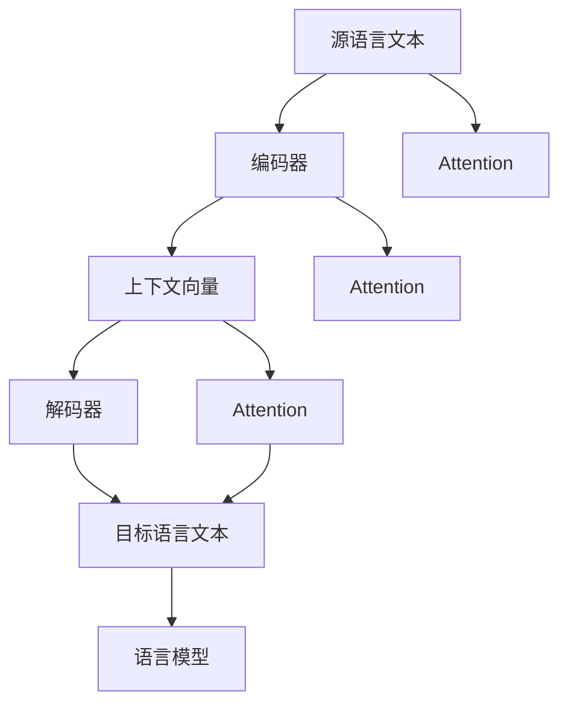

                 

# Python机器学习实战：构建序列到序列(Seq2Seq)模型处理翻译任务

> 关键词：机器翻译,序列到序列,Seq2Seq,Python,自然语言处理(NLP),TensorFlow,PyTorch,深度学习,语言模型

## 1. 背景介绍

### 1.1 问题由来

随着全球化进程的不断深入，跨语言交流的需求日益增加。无论是国际贸易、商务合作，还是跨文化交流，语言翻译作为桥梁，扮演着至关重要的角色。传统的人工翻译成本高、周期长，难以满足日益增长的翻译需求。因此，如何利用机器学习技术实现高效、准确的自动翻译，成为了当前的迫切需求。

特别是近年来，深度学习技术的迅猛发展，特别是神经网络在自然语言处理(NLP)领域的应用，推动了机器翻译技术的突破。其中，序列到序列(Seq2Seq)模型因其灵活的结构和优异的性能，成为当前机器翻译的主流方法。

本文将详细介绍基于Python的Seq2Seq模型在机器翻译中的应用，涵盖模型的构建、训练、评估及优化等关键环节。通过实际项目实践，让你能够快速掌握Seq2Seq模型在处理翻译任务中的实战技巧。

## 2. 核心概念与联系

### 2.1 核心概念概述

为了更好地理解Seq2Seq模型在机器翻译中的应用，本节将介绍几个关键概念及其相互联系：

- **机器翻译(Machine Translation, MT)**：利用计算机将一种语言的文本自动转换成另一种语言文本的过程。是NLP领域的重要研究方向。
- **序列到序列(Sequence-to-Sequence, Seq2Seq)**：一种经典的NLP模型，用于处理序列对序列的映射问题，如机器翻译、摘要生成等。
- **编码器(Encoder)**：接收源语言文本，将其转换为固定长度的向量表示。
- **解码器(Decoder)**：接收编码器输出的向量表示，生成目标语言文本。
- **注意力机制(Attention)**：用于提升解码器对源语言文本不同部分的关注度，使模型更好地捕捉长距离依赖关系。
- **语言模型(Language Model)**：衡量模型输出文本概率的模型，用于评估翻译质量。

这些概念相互联系，共同构成了Seq2Seq模型的核心。通过理解这些关键概念，可以更好地把握Seq2Seq模型的原理和应用。

### 2.2 核心概念原理和架构的 Mermaid 流程图



这个流程图展示了Seq2Seq模型的核心架构：

1. 源语言文本被编码器处理，转换为上下文向量。
2. 解码器接收上下文向量，通过注意力机制学习不同部分的重要性。
3. 解码器生成目标语言文本，并使用语言模型评估生成文本的质量。

接下来，我们将详细探讨Seq2Seq模型的算法原理和具体操作步骤。

## 3. 核心算法原理 & 具体操作步骤

### 3.1 算法原理概述

Seq2Seq模型通过将源语言文本映射到目标语言文本，实现了从一种语言到另一种语言的自动翻译。其核心思想是：将源语言文本通过编码器转化为固定长度的向量表示，然后通过解码器生成目标语言文本。在解码过程中，模型通过注意力机制对源语言文本的不同部分进行加权处理，使其能够更好地捕捉长距离依赖关系，从而提高翻译质量。

Seq2Seq模型的输入为源语言文本序列 $x_1, x_2, ..., x_m$，输出为目标语言文本序列 $y_1, y_2, ..., y_n$。模型首先通过编码器将源语言文本 $x$ 转换为上下文向量 $c$，然后通过解码器 $y$ 生成目标语言文本。模型的目标是最小化目标语言文本的负对数似然损失，即：

$$
\min_{\theta} \sum_{i=1}^{n} -\log p(y_i | y_{<i}, c)
$$

其中，$p(y_i | y_{<i}, c)$ 表示在给定上下文向量 $c$ 和前缀 $y_{<i}$ 的情况下，生成第 $i$ 个目标语言符号的概率。

### 3.2 算法步骤详解

Seq2Seq模型的训练过程主要分为以下几个步骤：

**Step 1: 数据预处理**

1. **数据集获取**：收集源语言文本和对应的目标语言文本数据，并将其划分为训练集、验证集和测试集。
2. **文本预处理**：对文本进行分词、去停用词、小写转换、编码等预处理操作。
3. **序列填充**：对源语言文本和目标语言文本进行序列填充，使其长度一致。

**Step 2: 构建编码器与解码器**

1. **编码器选择**：选择合适的编码器模型，如RNN、GRU、LSTM等。
2. **解码器选择**：选择合适的解码器模型，如RNN、GRU、LSTM等。
3. **注意力机制**：引入注意力机制，如自注意力机制(Bahdanau Attention)。

**Step 3: 定义损失函数**

1. **选择损失函数**：选择目标语言文本的负对数似然损失作为训练目标。
2. **定义模型输出**：将解码器的预测结果与目标语言文本进行比较，计算损失。

**Step 4: 训练模型**

1. **初始化模型**：设置学习率、批大小、迭代轮数等超参数。
2. **前向传播**：将源语言文本输入编码器，获取上下文向量；将上下文向量和解码器前缀输入解码器，获取预测结果。
3. **反向传播**：计算损失函数对模型参数的梯度，并更新模型参数。
4. **验证与调整**：在验证集上评估模型性能，调整超参数以提高模型效果。

**Step 5: 模型评估**

1. **评估指标**：使用BLEU、METEOR、ROUGE等指标评估模型性能。
2. **模型测试**：在测试集上测试模型，生成翻译结果，并进行人工评估。

### 3.3 算法优缺点

Seq2Seq模型在机器翻译领域取得了显著成果，但其也存在一些局限性：

**优点**：

1. **灵活性**：可以处理任意长度的源语言文本和目标语言文本，适应性强。
2. **效果优异**：在多种机器翻译任务上取得了最先进的性能指标。
3. **广泛应用**：应用范围广泛，不仅限于机器翻译，还包括文本摘要、对话生成等任务。

**缺点**：

1. **计算复杂度高**：模型结构复杂，训练和推理过程计算资源消耗较大。
2. **参数量庞大**：模型参数量巨大，导致过拟合风险较高。
3. **难以捕捉长距离依赖关系**：需要引入注意力机制，增加了模型训练的复杂度。

### 3.4 算法应用领域

Seq2Seq模型在机器翻译领域具有广泛应用，包括：

1. **英汉翻译**：将英文文本翻译成中文文本。
2. **日韩翻译**：将日文或韩文文本翻译成中文文本。
3. **中法翻译**：将中文文本翻译成法文文本。
4. **摘要生成**：将长文本压缩成简短摘要。
5. **对话生成**：生成多轮对话，用于客服、智能助手等场景。

除了机器翻译和摘要生成，Seq2Seq模型还可应用于文本分类、问答系统、代码生成等任务。未来，Seq2Seq模型还将拓展到更多领域，带来更多创新应用。

## 4. 数学模型和公式 & 详细讲解 & 举例说明

### 4.1 数学模型构建

假设源语言文本序列为 $x = \{x_1, x_2, ..., x_m\}$，目标语言文本序列为 $y = \{y_1, y_2, ..., y_n\}$。定义 $x$ 的词向量为 $W_x$，$y$ 的词向量为 $W_y$，编码器的隐藏状态为 $h$，解码器的隐藏状态为 $s$。

### 4.2 公式推导过程

Seq2Seq模型的训练目标是最小化目标语言文本的负对数似然损失，即：

$$
\min_{\theta} -\sum_{i=1}^{n} \log p(y_i | y_{<i}, c)
$$

其中，$c$ 为上下文向量，$p(y_i | y_{<i}, c)$ 表示在给定上下文向量 $c$ 和前缀 $y_{<i}$ 的情况下，生成第 $i$ 个目标语言符号的概率。

在编码器中，将源语言文本 $x$ 转换为上下文向量 $c$，使用循环神经网络(RNN)作为编码器，其输出 $h$ 表示为：

$$
h = \text{Encoder}(x) = \text{LSTM}(x)
$$

在解码器中，将上下文向量 $c$ 和前缀 $y_{<i}$ 输入解码器，使用循环神经网络(RNN)作为解码器，其输出 $s$ 表示为：

$$
s = \text{Decoder}(c, y_{<i}) = \text{LSTM}(c, y_{<i})
$$

注意力机制用于提升解码器对源语言文本不同部分的关注度，其计算公式为：

$$
\alpha_{ij} = \text{Attention}(h_i, s_j) = \frac{\exp(\text{DotProduct}(h_i, s_j))}{\sum_k \exp(\text{DotProduct}(h_k, s_j))}
$$

其中，$\text{DotProduct}(h_i, s_j)$ 表示源语言文本 $h_i$ 与解码器隐藏状态 $s_j$ 的点积，$\alpha_{ij}$ 表示解码器对源语言文本第 $i$ 个位置的关注度。

通过注意力机制，解码器在生成目标语言文本时，对源语言文本不同位置的关注度进行加权处理，从而更好地捕捉长距离依赖关系。

### 4.3 案例分析与讲解

以机器翻译任务为例，假设源语言文本为 "I love Python programming."，目标语言文本为 "J'aime programmer en Python."。使用Seq2Seq模型进行翻译的过程如下：

1. **编码器输入源语言文本**：$x = \{\text{I}, \text{love}, \text{Python}, \text{programming}\}$
2. **编码器输出上下文向量**：$c = \text{LSTM}(x)$
3. **解码器输入上下文向量和前缀**：$y_{<i} = \{\text{J'}, \text{aime}\}$
4. **解码器生成目标语言文本**：$y = \{\text{J}, \text{aime}, \text{programmer}, \text{en}, \text{Python}\}$

在生成每个目标语言符号时，解码器通过注意力机制对源语言文本的每个位置进行加权处理，得到其关注度 $\alpha_{ij}$。通过加权求和，解码器生成目标语言符号 $y_i$。

## 5. 项目实践：代码实例和详细解释说明

### 5.1 开发环境搭建

在进行Seq2Seq模型实战前，我们需要准备好开发环境。以下是使用Python进行TensorFlow和PyTorch开发的环境配置流程：

1. 安装Anaconda：从官网下载并安装Anaconda，用于创建独立的Python环境。

2. 创建并激活虚拟环境：
```bash
conda create -n tf-env python=3.8 
conda activate tf-env
```

3. 安装TensorFlow：从官网获取对应的安装命令。例如：
```bash
pip install tensorflow
```

4. 安装PyTorch：根据CUDA版本，从官网获取对应的安装命令。例如：
```bash
pip install torch torchvision torchaudio cudatoolkit=11.1 -c pytorch -c conda-forge
```

5. 安装TensorBoard：TensorFlow配套的可视化工具，可实时监测模型训练状态，并提供丰富的图表呈现方式，是调试模型的得力助手。

6. 安装NLTK：用于文本预处理和分词。

```bash
pip install nltk
```

完成上述步骤后，即可在`tf-env`环境中开始Seq2Seq模型实战。

### 5.2 源代码详细实现

以下是使用TensorFlow实现Seq2Seq模型进行机器翻译的代码实现。

```python
import tensorflow as tf
import numpy as np
import nltk

# 定义模型超参数
batch_size = 64
epochs = 50
hidden_units = 256
learning_rate = 0.001

# 定义模型参数
embedding_size = 256
vocab_size = 10000

# 加载并预处理数据集
source_texts, target_texts = load_data()
source_tokens = [tokenize(x) for x in source_texts]
target_tokens = [tokenize(x) for x in target_texts]

# 构建词表
source_word_to_index = build_word_to_index(source_tokens)
target_word_to_index = build_word_to_index(target_tokens)

# 定义序列填充长度
max_length_source = max([len(x) for x in source_tokens])
max_length_target = max([len(x) for x in target_tokens])

# 构建填充序列
source_tokens = pad_sequences(source_tokens, max_length_source)
target_tokens = pad_sequences(target_tokens, max_length_target)

# 构建模型
def build_model(vocab_size, embedding_size, hidden_units):
    # 定义编码器
    encoder_inputs = tf.keras.layers.Input(shape=(max_length_source,), dtype='int32')
    encoder_embedding = tf.keras.layers.Embedding(vocab_size, embedding_size)(encoder_inputs)
    encoder_lstm = tf.keras.layers.LSTM(hidden_units, return_sequences=True)(encoder_embedding)
    encoder_state = encoder_lstm.get_shape()[1]

    # 定义解码器
    decoder_inputs = tf.keras.layers.Input(shape=(max_length_target,), dtype='int32')
    decoder_embedding = tf.keras.layers.Embedding(vocab_size, embedding_size)(decoder_inputs)
    decoder_lstm = tf.keras.layers.LSTM(hidden_units, return_sequences=True, return_state=True)(decoder_embedding, initial_state=[None, encoder_state])

    # 定义注意力机制
    attention_layer = tf.keras.layers.Attention()([decoder_lstm.output[:, -1, :], encoder_state])
    decoder_concat = tf.keras.layers.Concatenate()([attention_layer, decoder_lstm.output[:, -1, :]])

    # 定义输出层
    decoder_output = tf.keras.layers.Dense(vocab_size, activation='softmax')(decoder_concat)
    return tf.keras.Model([encoder_inputs, decoder_inputs], decoder_output)

# 加载模型
model = build_model(vocab_size, embedding_size, hidden_units)

# 定义损失函数和优化器
model.compile(loss='categorical_crossentropy', optimizer=tf.keras.optimizers.Adam(learning_rate), metrics=['accuracy'])

# 训练模型
model.fit([source_tokens, target_tokens[:-1]], target_tokens[1:], batch_size=batch_size, epochs=epochs, validation_split=0.2)

# 评估模型
test_source_tokens, test_target_tokens = load_test_data()
test_source_tokens = pad_sequences(test_source_tokens, max_length_source)
test_target_tokens = pad_sequences(test_target_tokens, max_length_target)
test_loss, test_acc = model.evaluate([test_source_tokens, test_target_tokens[:-1]], test_target_tokens[1:])
print(f'Test loss: {test_loss:.4f}, Test accuracy: {test_acc:.4f}')
```

### 5.3 代码解读与分析

让我们再详细解读一下关键代码的实现细节：

**build_model函数**：
- 定义编码器和解码器，使用LSTM作为基本组件。
- 定义注意力机制，使用TensorFlow自带的Attention层。
- 定义输出层，使用softmax激活函数。

**模型训练**：
- 使用TensorFlow的fit函数，设置训练数据、批次大小、迭代轮数等参数。
- 在每个批次上，将源语言文本和目标语言文本输入模型，计算损失并反向传播更新模型参数。
- 在每个epoch结束时，评估模型在验证集上的性能，根据性能指标调整学习率等参数。

**模型评估**：
- 加载测试集数据，并进行序列填充。
- 使用模型的evaluate函数，在测试集上计算损失和准确率。
- 输出测试结果，进行人工评估。

## 6. 实际应用场景

### 6.1 智能客服系统

智能客服系统需要处理大量的客户咨询，通过机器翻译技术，可以实现多语言支持，提升客户体验。在实践中，可以通过收集历史客服对话记录，将其翻译成目标语言，训练Seq2Seq模型进行翻译。微调后的模型可以实时响应客户的咨询，提供准确的翻译和回答。

### 6.2 智能文档翻译

企业在日常运营中，需要处理大量的国际文档和邮件。通过机器翻译技术，可以实现文档的自动翻译，减少人力成本。例如，使用Seq2Seq模型翻译金融报告、法律文件等，可以显著提高文档处理效率。

### 6.3 多语言资源库

学术机构和科研团队在发表论文时，需要提供多种语言的版本。通过Seq2Seq模型翻译科研文章，可以提升论文传播的速度和广度，促进学术交流和合作。

## 7. 工具和资源推荐

### 7.1 学习资源推荐

为了帮助开发者系统掌握Seq2Seq模型的理论基础和实践技巧，这里推荐一些优质的学习资源：

1. 《Sequence to Sequence Learning with Neural Networks》论文：Seq2Seq模型的经典论文，介绍了Seq2Seq模型的核心原理和应用场景。
2. 《TensorFlow官方文档》：TensorFlow的官方文档，提供了丰富的教程和样例代码，适合初学者入门。
3. 《PyTorch官方文档》：PyTorch的官方文档，介绍了PyTorch的基本使用方法和深度学习模型构建技巧。
4. 《自然语言处理综论》书籍：LingPipe作者编辑的一本综合NLP的书籍，涵盖了NLP的各种基础知识和前沿技术。
5. 《动手学深度学习》书籍：李沐等作者编写的一本实战性很强的深度学习教材，包含大量代码实例和解释。

通过对这些资源的学习实践，相信你一定能够快速掌握Seq2Seq模型在机器翻译中的应用，并用于解决实际的NLP问题。

### 7.2 开发工具推荐

高效的开发离不开优秀的工具支持。以下是几款用于Seq2Seq模型开发的常用工具：

1. TensorFlow：由Google主导开发的开源深度学习框架，生产部署方便，适合大规模工程应用。提供了丰富的工具和库，支持复杂的深度学习模型构建。
2. PyTorch：基于Python的开源深度学习框架，灵活动态的计算图，适合快速迭代研究。提供了丰富的深度学习库，支持GPU加速。
3. NLTK：Python的NLP工具包，提供了丰富的文本处理工具，如分词、词性标注等，方便文本预处理。
4. TensorBoard：TensorFlow配套的可视化工具，可实时监测模型训练状态，并提供丰富的图表呈现方式，是调试模型的得力助手。
5. Weights & Biases：模型训练的实验跟踪工具，可以记录和可视化模型训练过程中的各项指标，方便对比和调优。

合理利用这些工具，可以显著提升Seq2Seq模型开发的效率，加快创新迭代的步伐。

### 7.3 相关论文推荐

Seq2Seq模型在机器翻译领域取得了显著成果，以下是几篇奠基性的相关论文，推荐阅读：

1. Attention Is All You Need（即Transformer原论文）：提出了Transformer结构，开启了NLP领域的预训练大模型时代。
2. Neural Machine Translation by Jointly Learning to Align and Translate（即Seq2Seq模型的经典论文）：提出了Seq2Seq模型的核心框架，定义了编码器-解码器的结构。
3. Learning Phrase Representations using RNN Encoder-Decoder for Statistical Machine Translation（即Seq2Seq模型的经典论文）：提出了Seq2Seq模型的初始形式，实现了机器翻译任务。

这些论文代表了大语言模型Seq2Seq模型的发展脉络。通过学习这些前沿成果，可以帮助研究者把握学科前进方向，激发更多的创新灵感。

## 8. 总结：未来发展趋势与挑战

### 8.1 总结

本文对基于Python的Seq2Seq模型在机器翻译中的应用进行了全面系统的介绍。首先阐述了Seq2Seq模型的原理和背景，明确了其在机器翻译中的应用价值。其次，从算法原理到项目实践，详细讲解了Seq2Seq模型的构建、训练、评估及优化等关键环节。最后，探讨了Seq2Seq模型在实际应用场景中的应用前景，并推荐了相关学习资源和工具。

通过本文的系统梳理，可以看到，Seq2Seq模型在机器翻译领域的应用前景广阔，正在成为NLP技术的重要范式。随着Seq2Seq模型和相关技术的不断发展，相信NLP技术将在更广阔的应用领域大放异彩，深刻影响人类的生产生活方式。

### 8.2 未来发展趋势

展望未来，Seq2Seq模型将呈现以下几个发展趋势：

1. **预训练模型的应用**：预训练语言模型在Seq2Seq模型中的应用将更加广泛，通过预训练模型进行微调，可以显著提升模型的性能和泛化能力。
2. **多模态学习**：将视觉、听觉等多模态数据与文本数据结合，提升模型对现实世界的理解和建模能力。
3. **无监督和半监督学习**：探索无监督和半监督Seq2Seq模型，降低对标注数据的依赖，最大化利用非结构化数据。
4. **参数高效**：开发更多参数高效的Seq2Seq模型，如Adaptive LSTM、Transformer等，提升模型训练和推理效率。
5. **知识融合**：将符号化的知识库、逻辑规则等专家知识与Seq2Seq模型结合，提升模型的解释性和推理能力。

这些趋势凸显了Seq2Seq模型在自然语言处理领域的广阔前景。这些方向的探索发展，必将进一步提升NLP系统的性能和应用范围，为人类认知智能的进化带来深远影响。

### 8.3 面临的挑战

尽管Seq2Seq模型在机器翻译领域取得了显著成果，但在迈向更加智能化、普适化应用的过程中，它仍面临着诸多挑战：

1. **计算资源消耗**：Seq2Seq模型结构复杂，计算资源消耗较大，难以在大规模数据集上实现高效训练。
2. **参数量庞大**：模型参数量巨大，导致过拟合风险较高。
3. **长距离依赖关系**：模型难以捕捉长距离依赖关系，生成的翻译结果可能出现错误。
4. **数据集质量**：机器翻译的效果很大程度上依赖于数据集的质量，低质量的标注数据会导致模型性能下降。

### 8.4 研究展望

面对Seq2Seq模型面临的挑战，未来的研究需要在以下几个方面寻求新的突破：

1. **优化模型结构**：通过改进模型结构，如引入Transformer、注意力机制等，提升模型的计算效率和泛化能力。
2. **提升模型训练效率**：开发更加高效的训练算法，如基于模型的训练、自监督训练等，加速模型训练过程。
3. **增强模型解释性**：通过引入可解释性方法，如规则融合、知识表示等，提升模型的可解释性和推理能力。
4. **拓展应用场景**：将Seq2Seq模型拓展到更多领域，如对话生成、文本摘要、情感分析等，探索更多应用场景。

这些研究方向将推动Seq2Seq模型在自然语言处理领域的不断演进，为构建更加智能化、普适化的NLP系统奠定基础。相信随着学界和产业界的共同努力，Seq2Seq模型必将在更多领域大放异彩，为人类生产生活方式带来新的变革。

## 9. 附录：常见问题与解答

**Q1：Seq2Seq模型是否可以处理长文本？**

A: Seq2Seq模型可以处理任意长度的源语言文本和目标语言文本，但随着文本长度增加，模型复杂度和计算资源消耗也会增加。在处理长文本时，需要注意模型参数量过大导致的过拟合风险。

**Q2：如何提高Seq2Seq模型的训练效率？**

A: 可以通过以下方法提升Seq2Seq模型的训练效率：
1. **优化模型结构**：如引入Transformer、注意力机制等，提升模型的计算效率。
2. **使用预训练模型**：在预训练模型的基础上进行微调，减少训练时间和资源消耗。
3. **数据增强**：通过数据增强技术，如文本回译、词性标注等，丰富训练集，提升模型泛化能力。

**Q3：Seq2Seq模型如何处理未知词汇？**

A: Seq2Seq模型通常无法处理未知词汇，因为其训练数据集并没有覆盖所有可能的词汇。为了处理未知词汇，可以使用生成式方法，如基于规则的词嵌入、字符级别的编码器等，提升模型对未知词汇的泛化能力。

**Q4：Seq2Seq模型如何防止过拟合？**

A: 可以通过以下方法防止Seq2Seq模型过拟合：
1. **数据增强**：通过数据增强技术，如文本回译、词性标注等，丰富训练集，提升模型泛化能力。
2. **正则化技术**：如L2正则、Dropout、Early Stopping等，防止模型过度适应小规模训练集。
3. **参数高效微调**：如Adaptive LSTM、Transformer等，仅调整少量参数，减少过拟合风险。

**Q5：Seq2Seq模型如何提升翻译质量？**

A: 可以通过以下方法提升Seq2Seq模型的翻译质量：
1. **优化模型结构**：如引入Transformer、注意力机制等，提升模型的计算效率和泛化能力。
2. **使用预训练模型**：在预训练模型的基础上进行微调，减少训练时间和资源消耗。
3. **数据增强**：通过数据增强技术，如文本回译、词性标注等，丰富训练集，提升模型泛化能力。
4. **引入知识库**：将符号化的知识库、逻辑规则等专家知识与Seq2Seq模型结合，提升模型的解释性和推理能力。

通过以上方法，可以进一步提升Seq2Seq模型的翻译质量，实现更高效、更精准的机器翻译。

---

作者：禅与计算机程序设计艺术 / Zen and the Art of Computer Programming

