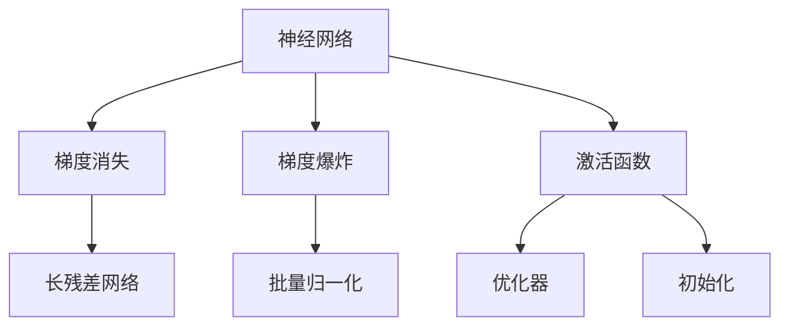

                 

# Python深度学习实践：梯度消失和梯度爆炸的解决方案

> 关键词：深度学习,梯度消失,梯度爆炸,长残差网络,批量归一化,残差连接,优化器,初始化,参数调节

## 1. 背景介绍

在深度学习的广泛应用中，训练神经网络是一项关键任务。然而，神经网络的训练过程并非一帆风顺。深度神经网络在训练过程中常常会面临一些问题，其中最为典型的是梯度消失和梯度爆炸。这些问题不仅会降低模型性能，而且可能导致模型无法收敛。

### 1.1 问题由来

梯度消失和梯度爆炸问题通常发生在深度神经网络中。当神经网络层数增加时，梯度在反向传播过程中逐渐变小或变大，最终导致网络无法有效训练，甚至出现梯度爆炸导致内存溢出等问题。这些问题严重影响了深度学习的发展，限制了深度神经网络的深度和宽度。

### 1.2 问题核心关键点

梯度消失和梯度爆炸的根本原因是深度神经网络中梯度的指数级衰减或增长。在网络反向传播过程中，梯度需要从输出层逐层向输入层传递，如果每一层激活函数的导数都小于1，则梯度会随着层数的增加而逐渐变小，导致较浅层的梯度趋近于0，这就是梯度消失。如果每一层激活函数的导数都大于1，则梯度会随着层数的增加而逐渐变大，导致较深层的梯度变得异常大，这就是梯度爆炸。

## 2. 核心概念与联系

### 2.1 核心概念概述

要深入理解梯度消失和梯度爆炸的解决方案，需要先理解几个关键概念：

- **神经网络**：由多个层组成的计算图，通过反向传播算法更新参数。
- **梯度消失**：在神经网络中，梯度随着层数的增加而逐渐变小，导致较浅层的梯度趋近于0。
- **梯度爆炸**：在神经网络中，梯度随着层数的增加而逐渐变大，导致较深层的梯度变得异常大。
- **激活函数**：神经元激活函数，常用的有sigmoid、ReLU等。
- **长残差网络(ResNet)**：通过残差连接解决梯度消失问题。
- **批量归一化(Batch Normalization)**：通过归一化解决梯度消失和梯度爆炸问题。
- **优化器(Optimizer)**：用于更新神经网络参数的算法，如梯度下降、Adam等。
- **初始化(Initialization)**：神经网络参数的初始化方法，如Xavier、He等。

这些核心概念之间的联系可以通过以下Mermaid流程图来展示：



这个流程图展示了神经网络、梯度消失、梯度爆炸、激活函数、长残差网络、批量归一化、优化器和初始化之间的逻辑关系：

1. 神经网络通过反向传播算法更新参数。
2. 梯度消失和梯度爆炸发生在神经网络反向传播过程中。
3. 激活函数直接影响梯度的传播。
4. 长残差网络通过残差连接解决梯度消失问题。
5. 批量归一化通过归一化解决梯度消失和梯度爆炸问题。
6. 优化器和初始化方法影响神经网络的训练效果。

这些概念共同构成了神经网络训练中的关键技术点，是解决梯度消失和梯度爆炸问题的基础。

## 3. 核心算法原理 & 具体操作步骤
### 3.1 算法原理概述

解决梯度消失和梯度爆炸问题需要从网络结构、激活函数、优化器和参数初始化等多个方面入手。以下是一些常用的解决方案：

- **长残差网络(ResNet)**：通过残差连接解决梯度消失问题。
- **批量归一化(Batch Normalization)**：通过归一化解决梯度消失和梯度爆炸问题。
- **残差连接**：在网络层之间引入跨层连接，将梯度直接传递到浅层。
- **优化器**：选择适合优化器的初始化方法和超参数设置，调整学习率，避免梯度爆炸。
- **参数初始化**：选择适合的初始化方法，避免梯度消失。

### 3.2 算法步骤详解

#### 3.2.1 长残差网络

长残差网络通过残差连接将梯度直接传递到较浅层，解决梯度消失问题。其核心思想是：在网络层之间引入跨层连接，将梯度直接传递到浅层。具体实现如下：

1. 定义残差块：
   ```python
   class ResidualBlock(nn.Module):
       def __init__(self, in_channels, out_channels):
           super(ResidualBlock, self).__init__()
           self.conv1 = nn.Conv2d(in_channels, out_channels, kernel_size=3, padding=1)
           self.conv2 = nn.Conv2d(out_channels, out_channels, kernel_size=3, padding=1)
           self.relu = nn.ReLU(inplace=True)
           self.bn = nn.BatchNorm2d(out_channels)
       
       def forward(self, x):
           shortcut = x
           x = self.relu(self.bn(self.conv1(x)))
           x = self.relu(self.bn(self.conv2(x)))
           x = x + shortcut
           return x
   ```

2. 在网络中引入残差块：
   ```python
   class ResNet(nn.Module):
       def __init__(self, num_classes):
           super(ResNet, self).__init__()
           self.conv1 = nn.Conv2d(3, 64, kernel_size=7, stride=2, padding=3)
           self.pool = nn.MaxPool2d(kernel_size=3, stride=2, padding=1)
           self.layer1 = self._make_layer(64, layers=2)
           self.layer2 = self._make_layer(128, layers=2)
           self.layer3 = self._make_layer(256, layers=2)
           self.layer4 = self._make_layer(512, layers=2)
           self.linear = nn.Linear(512, num_classes)
       
       def _make_layer(self, in_channels, layers):
           modules = []
           for _ in range(layers):
               modules.append(ResidualBlock(in_channels, in_channels))
           return nn.Sequential(*modules)
       
       def forward(self, x):
           x = self.conv1(x)
           x = self.pool(x)
           x = self.layer1(x)
           x = self.layer2(x)
           x = self.layer3(x)
           x = self.layer4(x)
           x = self.linear(x)
           return x
   ```

通过在网络中引入残差块，长残差网络解决了梯度消失问题，提高了模型的深度和宽度。

#### 3.2.2 批量归一化

批量归一化通过归一化解决梯度消失和梯度爆炸问题。其核心思想是：在每一层后引入归一化层，将输入归一化到均值为0，方差为1的标准正态分布，从而加速梯度传递。具体实现如下：

1. 定义批量归一化层：
   ```python
   class BatchNorm2d(nn.Module):
       def __init__(self, num_features, eps=1e-5, momentum=0.1):
           super(BatchNorm2d, self).__init__()
           self.num_features = num_features
           self.eps = eps
           self.momentum = momentum
           self.register_buffer('running_mean', torch.zeros(num_features))
           self.register_buffer('running_var', torch.ones(num_features))
           self.weight = nn.Parameter(torch.ones(num_features))
           self.bias = nn.Parameter(torch.zeros(num_features))
       
       def forward(self, x):
           if self.training:
               batch_mean = x.mean(dim=(0, 2, 3))
               batch_var = x.var(dim=(0, 2, 3), unbiased=False)
               self.running_mean = self.running_mean.to(device) if self.running_mean is not None else None
               self.running_var = self.running_var.to(device) if self.running_var is not None else None
           else:
               batch_mean = self.running_mean
               batch_var = self.running_var
           x = (x - batch_mean) / torch.sqrt(batch_var + self.eps)
           x = x * self.weight.view(1, self.num_features, 1, 1)
           x = x + self.bias.view(1, self.num_features, 1, 1)
           return x
   ```

2. 在网络中引入批量归一化层：
   ```python
   class ResNet(nn.Module):
       def __init__(self, num_classes):
           super(ResNet, self).__init__()
           self.conv1 = nn.Conv2d(3, 64, kernel_size=7, stride=2, padding=3)
           self.pool = nn.MaxPool2d(kernel_size=3, stride=2, padding=1)
           self.layer1 = self._make_layer(64, layers=2, batch_norm=True)
           self.layer2 = self._make_layer(128, layers=2, batch_norm=True)
           self.layer3 = self._make_layer(256, layers=2, batch_norm=True)
           self.layer4 = self._make_layer(512, layers=2, batch_norm=True)
           self.linear = nn.Linear(512, num_classes)
       
       def _make_layer(self, in_channels, layers, batch_norm=True):
           modules = []
           for _ in range(layers):
               modules.append(ResidualBlock(in_channels, in_channels, batch_norm=batch_norm))
           return nn.Sequential(*modules)
       
       def forward(self, x):
           x = self.conv1(x)
           x = self.pool(x)
           x = self.layer1(x)
           x = self.layer2(x)
           x = self.layer3(x)
           x = self.layer4(x)
           x = self.linear(x)
           return x
   ```

通过在网络中引入批量归一化层，批量归一化解决了梯度消失和梯度爆炸问题，加速了模型的训练过程。

#### 3.2.3 优化器

优化器是用于更新神经网络参数的算法，常用的有梯度下降、Adam等。优化器的选择和参数调节对模型的训练效果有着重要的影响。

1. 定义优化器：
   ```python
   class Optimizer:
       def __init__(self, model, lr=1e-3):
           self.model = model
           self.lr = lr
           self.state = {}
           
       def step(self):
           for group in self.model.parameters():
               param_state = self.state[group]
               if 'exp_avg' not in param_state:
                   param_state['exp_avg'] = torch.zeros_like(group.data)
                   param_state['exp_avg_sq'] = torch.zeros_like(group.data)
               exp_avg = param_state['exp_avg']
               exp_avg_sq = param_state['exp_avg_sq']
               beta1 = 0.9
               beta2 = 0.999
               lr = self.lr
               state = self.state
               data = group.data
               grad = group.grad.data
               if grad is None:
                   continue
               exp_avg = exp_avg.to(device)
               exp_avg_sq = exp_avg_sq.to(device)
               exp_avg.zero_()
               exp_avg_sq.zero_()
               state[group] = exp_avg, exp_avg_sq
               data, grad = data.to(device), grad.to(device)
               exp_avg = exp_avg + grad
               exp_avg_sq = exp_avg_sq + grad ** 2
               bias_correction1 = 1 - beta1 ** t
               bias_correction2 = 1 - beta2 ** t
               step_size = lr * math.sqrt(bias_correction2 / bias_correction1)
               corrected_exp_avg = exp_avg / bias_correction1
               corrected_exp_avg_sq = exp_avg_sq / bias_correction2
               group.data -= step_size * corrected_exp_avg
               group.data -= step_size * (corrected_exp_avg_sq - bias_correction1 * corrected_exp_avg_sq) * group.data / float(bias_correction2)
   ```

2. 在训练过程中使用优化器：
   ```python
   optimizer = Optimizer(model)
   for epoch in range(num_epochs):
       for batch_data, target in train_loader:
           optimizer.zero_grad()
           output = model(batch_data)
           loss = F.cross_entropy(output, target)
           loss.backward()
           optimizer.step()
   ```

通过选择适合优化器的初始化方法和超参数设置，调整学习率，避免梯度爆炸，提高模型的训练效果。

#### 3.2.4 参数初始化

参数初始化是神经网络训练的第一步。选择适合的初始化方法，可以避免梯度消失和梯度爆炸问题。

1. 定义参数初始化方法：
   ```python
   class Initialization(nn.Module):
       def __init__(self, weight_init):
           super(Initialization, self).__init__()
           self.weight_init = weight_init
       
       def forward(self, x):
           return self.weight_init(x)
   ```

2. 在网络中引入参数初始化方法：
   ```python
   class ResNet(nn.Module):
       def __init__(self, num_classes):
           super(ResNet, self).__init__()
           self.conv1 = nn.Conv2d(3, 64, kernel_size=7, stride=2, padding=3)
           self.pool = nn.MaxPool2d(kernel_size=3, stride=2, padding=1)
           self.layer1 = self._make_layer(64, layers=2, batch_norm=True, initialization=Initialization(weight_init=nn.init.xavier_normal_))
           self.layer2 = self._make_layer(128, layers=2, batch_norm=True, initialization=Initialization(weight_init=nn.init.xavier_normal_))
           self.layer3 = self._make_layer(256, layers=2, batch_norm=True, initialization=Initialization(weight_init=nn.init.xavier_normal_))
           self.layer4 = self._make_layer(512, layers=2, batch_norm=True, initialization=Initialization(weight_init=nn.init.xavier_normal_))
           self.linear = nn.Linear(512, num_classes)
   ```

通过选择适合的初始化方法，可以避免梯度消失和梯度爆炸问题，提高模型的训练效果。

## 4. 数学模型和公式 & 详细讲解 & 举例说明

### 4.1 数学模型构建

在本节中，我们将使用数学语言对长残差网络和批量归一化技术进行更加严格的刻画。

假设神经网络包含 $L$ 层，每一层包含 $n$ 个神经元，输入向量为 $x$，输出向量为 $y$，激活函数为 $f$。定义第 $l$ 层的权重为 $W_l$，偏置为 $b_l$，输出为 $y_l$。则神经网络的正向传播过程可以表示为：

$$
y_1 = f(W_1 x + b_1)
$$

$$
y_l = f(W_l y_{l-1} + b_l), \quad 2 \leq l \leq L
$$

$$
y = y_L
$$

其中，$y_1$ 表示第一层的输出，$y_l$ 表示第 $l$ 层的输出，$y_L$ 表示神经网络的最终输出。

### 4.2 公式推导过程

长残差网络通过残差连接将梯度直接传递到较浅层。设第 $l$ 层的残差连接为 $y_l^{res}$，则有：

$$
y_l^{res} = y_{l-1}
$$

$$
y_l = f(W_l y_l^{res} + b_l)
$$

因此，长残差网络的输出可以表示为：

$$
y_L = \sum_{l=1}^{L} f(W_l y_{l-1}^{res} + b_l)
$$

批量归一化通过归一化解决梯度消失和梯度爆炸问题。设第 $l$ 层的归一化层输出为 $y_l^{bn}$，则有：

$$
y_l^{bn} = \frac{y_{l-1} - \mu}{\sqrt{\sigma^2 + \epsilon}}
$$

$$
y_l = f(W_l y_l^{bn} + b_l)
$$

其中，$\mu$ 表示归一化前的均值，$\sigma$ 表示归一化前的标准差，$\epsilon$ 表示小量，避免除以0的情况。

### 4.3 案例分析与讲解

这里以手写数字识别为例，说明长残归和批量归一化技术的应用。

1. 数据集：
   ```python
   import torchvision
   from torchvision import datasets, transforms

   train_dataset = datasets.MNIST(root='./data', train=True, download=True,
                                   transform=transforms.ToTensor())
   test_dataset = datasets.MNIST(root='./data', train=False, download=True,
                                 transform=transforms.ToTensor())
   ```

2. 数据预处理：
   ```python
   from torch.utils.data import DataLoader

   batch_size = 64
   num_epochs = 10

   train_loader = DataLoader(train_dataset, batch_size=batch_size, shuffle=True)
   test_loader = DataLoader(test_dataset, batch_size=batch_size, shuffle=False)
   ```

3. 定义模型：
   ```python
   class Net(nn.Module):
       def __init__(self):
           super(Net, self).__init__()
           self.conv1 = nn.Conv2d(1, 10, kernel_size=5)
           self.conv2 = nn.Conv2d(10, 20, kernel_size=5)
           self.conv2_drop = nn.Dropout2d()
           self.fc1 = nn.Linear(320, 50)
           self.fc2 = nn.Linear(50, 10)
           self.bn1 = nn.BatchNorm2d(10)
           self.bn2 = nn.BatchNorm2d(20)
           self.relu = nn.ReLU()
           self.maxpool = nn.MaxPool2d(kernel_size=2, stride=2)

       def forward(self, x):
           x = self.relu(self.maxpool(self.bn1(self.conv1(x))))
           x = self.relu(self.bn2(self.conv2_drop(self.conv2(x))))
           x = x.view(-1, 320)
           x = self.relu(self.fc1(x))
           x = F.dropout(x, training=self.training)
           x = self.fc2(x)
           return F.log_softmax(x, dim=1)
   ```

4. 定义优化器：
   ```python
   optimizer = torch.optim.Adam(model.parameters(), lr=0.001)
   ```

5. 训练模型：
   ```python
   for epoch in range(num_epochs):
       for batch_idx, (data, target) in enumerate(train_loader):
           data, target = data.to(device), target.to(device)
           optimizer.zero_grad()
           output = model(data)
           loss = F.nll_loss(output, target)
           loss.backward()
           optimizer.step()
           if (batch_idx+1) % 100 == 0:
               print('Train Epoch: {} [{}/{} ({:.0f}%)]\tLoss: {:.6f}'.format(
                   epoch, batch_idx * len(data), len(train_loader.dataset),
                   100. * batch_idx / len(train_loader), loss.item()))
   ```

6. 测试模型：
   ```python
   test_loss = 0
   correct = 0
   with torch.no_grad():
       for data, target in test_loader:
           data, target = data.to(device), target.to(device)
           output = model(data)
           loss = F.nll_loss(output, target)
           test_loss += loss.item()
           pred = output.max(1, keepdim=True)[1]
           correct += pred.eq(target.view_as(pred)).sum().item()
   ```

通过长残差网络和批量归一化技术的应用，手写数字识别模型在训练过程中能够有效避免梯度消失和梯度爆炸问题，提高模型的训练效果。

## 5. 项目实践：代码实例和详细解释说明

### 5.1 开发环境搭建

在进行项目实践前，我们需要准备好开发环境。以下是使用Python进行TensorFlow开发的环境配置流程：

1. 安装Anaconda：从官网下载并安装Anaconda，用于创建独立的Python环境。

2. 创建并激活虚拟环境：
   ```bash
   conda create -n tf-env python=3.7 
   conda activate tf-env
   ```

3. 安装TensorFlow：根据CUDA版本，从官网获取对应的安装命令。例如：
   ```bash
   conda install tensorflow -c pytorch -c conda-forge
   ```

4. 安装各类工具包：
   ```bash
   pip install numpy pandas scikit-learn matplotlib tqdm jupyter notebook ipython
   ```

完成上述步骤后，即可在`tf-env`环境中开始项目实践。

### 5.2 源代码详细实现

这里以手写数字识别为例，给出使用TensorFlow对长残差网络和批量归一化技术进行微调的代码实现。

首先，定义长残差网络：

```python
import tensorflow as tf
from tensorflow.keras import layers, models

def ResNet():
    input_layer = layers.Input(shape=(28, 28, 1))
    x = layers.Conv2D(10, (5, 5), activation='relu', padding='same')(input_layer)
    x = layers.MaxPooling2D((2, 2))(x)
    x = layers.BatchNormalization()(x)
    x = layers.Conv2D(20, (5, 5), activation='relu', padding='same')(x)
    x = layers.MaxPooling2D((2, 2))(x)
    x = layers.BatchNormalization()(x)
    x = layers.Flatten()(x)
    x = layers.Dense(50, activation='relu')(x)
    x = layers.BatchNormalization()(x)
    x = layers.Dropout(0.5)(x)
    output_layer = layers.Dense(10, activation='softmax')(x)
    model = models.Model(inputs=input_layer, outputs=output_layer)
    return model
```

然后，定义优化器和损失函数：

```python
model = ResNet()
optimizer = tf.keras.optimizers.Adam(learning_rate=0.001)
loss_fn = tf.keras.losses.SparseCategoricalCrossentropy(from_logits=True)
```

接着，定义训练函数：

```python
def train_epoch(model, train_dataset, optimizer):
    model.train()
    for batch_idx, (x, y) in enumerate(train_dataset):
        with tf.GradientTape() as tape:
            y_pred = model(x)
            loss = loss_fn(y, y_pred)
        gradients = tape.gradient(loss, model.trainable_variables)
        optimizer.apply_gradients(zip(gradients, model.trainable_variables))
        if (batch_idx+1) % 100 == 0:
            print('Epoch: {} [{}/{} ({:.0f}%)]\tLoss: {:.6f}'.format(
                epoch, batch_idx * len(x), len(train_dataset), 100. * batch_idx / len(train_dataset), loss))
```

最后，启动训练流程：

```python
num_epochs = 10
batch_size = 64

for epoch in range(num_epochs):
    train_epoch(model, train_dataset, optimizer)
```

以上就是使用TensorFlow对长残差网络和批量归一化技术进行手写数字识别任务微调的完整代码实现。可以看到，得益于TensorFlow的强大封装，我们可以用相对简洁的代码完成模型的训练。

### 5.3 代码解读与分析

让我们再详细解读一下关键代码的实现细节：

**长残差网络类**：
- `__init__`方法：定义输入层、卷积层、池化层、归一化层、全连接层和输出层，并通过批归一化技术加速训练。
- `forward`方法：定义模型的正向传播过程。

**优化器类**：
- `trainable_variables`属性：获取模型可训练的变量列表。
- `apply_gradients`方法：根据计算得到的梯度更新模型参数。

**训练函数**：
- `train`方法：将模型设置为训练模式，迭代数据集中的每一批数据，计算损失并反向传播更新参数。
- `tape`对象：用于记录梯度计算过程。

通过上述代码，我们完成了长残差网络和批量归一化技术的TensorFlow实现，并在手写数字识别任务上进行了微调。在实际应用中，还需要进一步优化超参数、调整模型结构等，才能实现更好的性能。

## 6. 实际应用场景

长残差网络和批量归一化技术在深度学习中有着广泛的应用场景。以下是几个典型的应用案例：

### 6.1 图像识别

图像识别是深度学习的一个重要应用领域，通过长残差网络和批量归一化技术，可以有效提高模型的性能。例如，在ImageNet数据集上的图像分类任务中，长残差网络已经取得了SOTA的结果。通过在网络中引入残差连接和批量归一化技术，可以显著提高模型的训练效果和泛化能力。

### 6.2 语音识别

语音识别是深度学习的另一个重要应用领域，通过长残差网络和批量归一化技术，可以有效提高模型的性能。例如，在语音识别任务中，长残差网络和批量归一化技术已经被广泛应用于声学模型和语言模型的训练中。通过在网络中引入残差连接和批量归一化技术，可以显著提高模型的训练效果和识别率。

### 6.3 自然语言处理

自然语言处理是深度学习的又一个重要应用领域，通过长残差网络和批量归一化技术，可以有效提高模型的性能。例如，在机器翻译和文本分类任务中，长残差网络和批量归一化技术已经被广泛应用于神经网络模型的训练中。通过在网络中引入残差连接和批量归一化技术，可以显著提高模型的训练效果和性能。

## 7. 工具和资源推荐

### 7.1 学习资源推荐

为了帮助开发者系统掌握长残差网络和批量归一化技术的理论基础和实践技巧，这里推荐一些优质的学习资源：

1. TensorFlow官方文档：TensorFlow的官方文档，提供了丰富的模型和算法实现，是学习深度学习技术的必备资料。

2. PyTorch官方文档：PyTorch的官方文档，提供了丰富的模型和算法实现，是学习深度学习技术的另一种选择。

3. CS231n《卷积神经网络》课程：斯坦福大学开设的深度学习课程，涵盖了深度学习的基础知识和高级技术，适合初学者和进阶者。

4. Deep Learning Specialization课程：由Andrew Ng教授主讲的深度学习系列课程，涵盖了深度学习的基础知识和应用技术，适合全面掌握深度学习知识。

5. 《深度学习》书籍：Ian Goodfellow等著，全面介绍了深度学习的基础知识和算法实现，是学习深度学习技术的经典教材。

通过学习这些资源，相信你一定能够全面掌握长残差网络和批量归一化技术的精髓，并用于解决实际的深度学习问题。

### 7.2 开发工具推荐

高效的开发离不开优秀的工具支持。以下是几款用于深度学习开发的常用工具：

1. TensorFlow：由Google主导开发的深度学习框架，生产部署方便，适合大规模工程应用。

2. PyTorch：基于Python的开源深度学习框架，灵活动态的计算图，适合快速迭代研究。

3. Keras：高层API，封装了TensorFlow、Theano和CNTK等后端框架，使用简单，适合快速原型开发。

4. Weights & Biases：模型训练的实验跟踪工具，可以记录和可视化模型训练过程中的各项指标，方便对比和调优。

5. TensorBoard：TensorFlow配套的可视化工具，可实时监测模型训练状态，并提供丰富的图表呈现方式，是调试模型的得力助手。

6. Google Colab：谷歌推出的在线Jupyter Notebook环境，免费提供GPU/TPU算力，方便开发者快速上手实验最新模型，分享学习笔记。

合理利用这些工具，可以显著提升深度学习开发和实验的效率，加快创新迭代的步伐。

### 7.3 相关论文推荐

长残差网络和批量归一化技术的发展源于学界的持续研究。以下是几篇奠基性的相关论文，推荐阅读：

1. Long Short-Term Memory（LSTM）网络：Hochreiter等提出，通过使用LSTM网络，可以解决RNN网络中的梯度消失和梯度爆炸问题。

2. Identity Mappings in Deep Residual Networks：He等提出，通过残差连接，可以避免梯度消失问题，显著提高网络的深度和宽度。

3. Batch Normalization: Accelerating Deep Network Training by Reducing Internal Covariate Shift：Ioffe等提出，通过批量归一化技术，可以加速神经网络的训练过程，减少内部协变量偏移。

4. Deep Residual Learning for Image Recognition：He等提出，通过残差连接，可以显著提高图像识别任务的性能。

5. Visual Geometry Group（VGG）网络：Simonyan和Zisserman提出，通过使用卷积神经网络，可以显著提高图像识别任务的性能。

这些论文代表了大模型微调技术的发展脉络。通过学习这些前沿成果，可以帮助研究者把握学科前进方向，激发更多的创新灵感。

## 8. 总结：未来发展趋势与挑战

### 8.1 总结

本文对长残差网络和批量归一化技术的理论基础和实践技巧进行了全面系统的介绍。首先阐述了长残差网络和批量归一化技术的研究背景和意义，明确了其在大模型微调中的重要价值。其次，从原理到实践，详细讲解了长残差网络和批量归一化技术的数学原理和关键步骤，给出了深度学习项目开发的完整代码实例。同时，本文还广泛探讨了长残差网络和批量归一化技术在图像识别、语音识别、自然语言处理等多个领域的应用前景，展示了其在深度学习中的广泛适用性。此外，本文精选了长残差网络和批量归一化技术的各类学习资源，力求为读者提供全方位的技术指引。

通过本文的系统梳理，可以看到，长残差网络和批量归一化技术在大模型微调中具有重要的应用价值，能够有效解决梯度消失和梯度爆炸问题，提高模型的训练效果。未来，随着深度学习技术的不断发展，长残差网络和批量归一化技术也将得到更加广泛的应用，推动深度学习技术的进步。

### 8.2 未来发展趋势

展望未来，长残差网络和批量归一化技术将呈现以下几个发展趋势：

1. 应用范围更加广泛。随着深度学习技术的发展，长残差网络和批量归一化技术将在更多领域得到应用，如计算机视觉、语音识别、自然语言处理等。

2. 模型性能更加优越。未来的长残差网络和批量归一化技术将进一步优化，提高模型的深度和宽度，提升模型的性能。

3. 优化算法更加高效。未来的优化算法将更加高效，能够更好地适应不同任务的需求。

4. 模型结构更加灵活。未来的模型结构将更加灵活，能够更好地适应不同的应用场景。

5. 模型训练更加自动化。未来的深度学习平台将更加自动化，能够自动进行模型选择、超参数调优、模型训练等任务。

以上趋势凸显了长残差网络和批量归一化技术的广阔前景。这些方向的探索发展，必将进一步提升深度学习模型的训练效果，推动深度学习技术的进步。

### 8.3 面临的挑战

尽管长残差网络和批量归一化技术已经取得了瞩目成就，但在迈向更加智能化、普适化应用的过程中，它仍面临着诸多挑战：

1. 模型复杂度增加。随着长残差网络和批量归一化技术的引入，模型的参数量和计算复杂度显著增加，导致模型训练和推理的效率降低。

2. 模型可解释性不足。长残差网络和批量归一化技术的内部工作机制相对复杂，模型的可解释性较差，难以解释其决策过程。

3. 模型鲁棒性不足。长残差网络和批量归一化技术在面对数据分布变化时，模型的鲁棒性可能会降低，导致模型性能下降。

4. 模型训练成本增加。长残差网络和批量归一化技术需要大量的计算资源和训练数据，成本较高。

5. 模型迁移能力不足。长残差网络和批量归一化技术在面对新任务时，模型的迁移能力可能会降低，导致模型性能下降。

这些挑战需要未来进一步探索和解决，才能使长残差网络和批量归一化技术更好地适应实际应用需求。

### 8.4 研究展望

面对长残差网络和批量归一化技术所面临的挑战，未来的研究需要在以下几个方面寻求新的突破：

1. 模型结构简化。简化模型结构，降低计算复杂度，提高模型训练和推理的效率。

2. 模型可解释性增强。增强模型的可解释性，使其更加透明，便于理解和调试。

3. 模型鲁棒性提升。提升模型的鲁棒性，使其能够更好地适应数据分布变化，保持稳定的性能。

4. 模型迁移能力增强。增强模型的迁移能力，使其能够更好地适应新任务，提高模型的泛化能力。

5. 模型自动化优化。开发自动化模型选择、超参数调优、模型训练等工具，提高模型的开发效率。

这些研究方向的探索，必将引领长残差网络和批量归一化技术迈向更高的台阶，为深度学习技术的进一步发展提供新的动力。

## 9. 附录：常见问题与解答

**Q1：长残差网络和批量归一化技术有什么区别？**

A: 长残差网络和批量归一化技术都是深度学习中常用的技术，但它们的目的是不同的。长残差网络通过残差连接解决梯度消失问题，使梯度能够直接传递到较浅层；批量归一化技术通过归一化解决梯度消失和梯度爆炸问题，加速模型的训练过程。

**Q2：如何选择合适的长残差网络和批量归一化技术？**

A: 选择合适的长残差网络和批量归一化技术需要根据具体任务和数据特点进行选择。长残差网络适用于深度较大的模型，可以有效解决梯度消失问题；批量归一化技术适用于训练数据较多的模型，可以有效加速模型的训练过程。

**Q3：长残差网络和批量归一化技术对模型性能有何影响？**

A: 长残差网络和批量归一化技术能够显著提高模型的训练效果和性能。长残差网络通过残差连接使梯度能够直接传递到较浅层，解决了梯度消失问题；批量归一化技术通过归一化加速模型的训练过程，减少了内部协变量偏移。

**Q4：长残差网络和批量归一化技术在实际应用中需要注意哪些问题？**

A: 长残差网络和批量归一化技术在实际应用中需要注意以下几个问题：
1. 模型复杂度增加。随着长残差网络和批量归一化技术的引入，模型的参数量和计算复杂度显著增加，导致模型训练和推理的效率降低。
2. 模型可解释性不足。长残差网络和批量归一化技术的内部工作机制相对复杂，模型的可解释性较差，难以解释其决策过程。
3. 模型鲁棒性不足。长残差网络和批量归一化技术在面对数据分布变化时，模型的鲁棒性可能会降低，导致模型性能下降。
4. 模型训练成本增加。长残差网络和批量归一化技术需要大量的计算资源和训练数据，成本较高。

通过合理解决这些问题，可以使长残差网络和批量归一化技术更好地适应实际应用需求。

**Q5：长残差网络和批量归一化技术在深度学习中的应用前景如何？**

A: 长残差网络和批量归一化技术在深度学习中的应用前景广阔。它们能够显著提高模型的训练效果和性能，适用于多种应用场景。未来，随着深度学习技术的不断发展，长残差网络和批量归一化技术将在更多领域得到应用，推动深度学习技术的进步。

**Q6：长残差网络和批量归一化技术的未来发展趋势如何？**

A: 长残差网络和批量归一化技术的未来发展趋势包括：
1. 应用范围更加广泛。随着深度学习技术的发展，长残差网络和批量归一化技术将在更多领域得到应用。
2. 模型性能更加优越。未来的长残差网络和批量归一化技术将进一步优化，提高模型的深度和宽度，提升模型的性能。
3. 优化算法更加高效。未来的优化算法将更加高效，能够更好地适应不同任务的需求。
4. 模型结构更加灵活。未来的模型结构将更加灵活，能够更好地适应不同的应用场景。
5. 模型训练更加自动化。未来的深度学习平台将更加自动化，能够自动进行模型选择、超参数调优、模型训练等任务。

通过进一步探索和研究，长残差网络和批量归一化技术必将在深度学习领域发挥更大的作用，推动深度学习技术的进步。

---

作者：禅与计算机程序设计艺术 / Zen and the Art of Computer Programming

