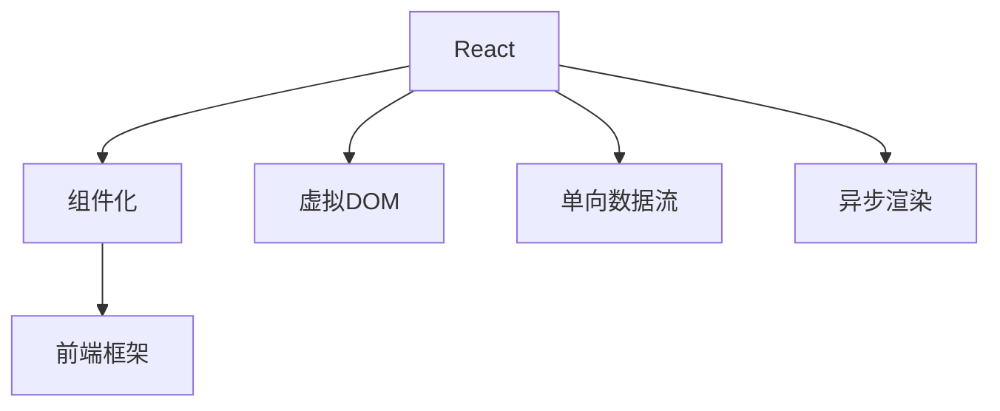

                 

# React 和前端框架：构建动态用户界面

## 1. 背景介绍

### 1.1 问题由来
随着Web应用的日益复杂化，传统的客户端脚本方式已经无法满足现代前端开发的需求。开发人员需要更加高效、可复用、易于维护的技术手段，以应对日益增长的Web应用规模和复杂度。

React作为Facebook于2013年开源的JavaScript库，以其简洁的API和强大的功能，迅速获得了开发者的青睐。React通过组件化、虚拟DOM等核心技术，使得前端开发者能够高效构建出动态用户界面。

### 1.2 问题核心关键点
React的核心思想是组件化，通过将UI分解为多个可复用的组件，使开发者能够更加专注于业务逻辑的实现，同时大幅提升代码的可维护性和复用性。React采用了虚拟DOM技术，通过实时更新DOM子树的方式，提高了渲染效率和用户体验。

同时，React社区围绕其构建了丰富的生态系统，包括Vue、Angular、Svelte等多个前端框架，这些框架都基于React的思想和原则，在React的基础上进行了创新和扩展。

## 2. 核心概念与联系

### 2.1 核心概念概述

为更好地理解React和前端框架，本节将介绍几个关键概念：

- React：由Facebook开源的JavaScript库，采用组件化、虚拟DOM等技术，构建高效、可维护的前端用户界面。
- 前端框架：基于React等核心技术，封装了大量组件和工具，提供统一的开发体验和组件库，如Vue、Angular、Svelte等。
- 虚拟DOM：React的核心技术之一，通过内存中维护DOM的轻量级副本，减少DOM操作次数，提高渲染性能。
- 组件化：React通过将UI分解为可复用的组件，大幅提升开发效率和代码复用性。
- 单向数据流：React数据绑定模型，采用单向数据流，使得组件之间的数据传递更加可控和安全。
- 异步渲染：通过Web Workers等技术，将渲染任务与主线程分离，提升应用性能。

这些核心概念之间的逻辑关系可以通过以下Mermaid流程图来展示：



这个流程图展示出React和前端框架的核心概念及其之间的关系：

1. React通过组件化和虚拟DOM等技术，提升UI构建效率和渲染性能。
2. 前端框架在React的基础上，封装了大量组件和工具，提供了统一的开发体验和组件库。
3. 组件化、虚拟DOM、单向数据流等核心技术，构成了React的核心竞争力。

这些概念共同构成了React前端框架的基石，使得开发者能够高效构建出动态、可维护的前端用户界面。

## 3. 核心算法原理 & 具体操作步骤
### 3.1 算法原理概述

React的核心原理可以归结为以下三个方面：

- 组件化：将UI分解为可复用的组件，使得前端开发更加模块化和可维护。
- 虚拟DOM：在内存中维护DOM的轻量级副本，减少DOM操作次数，提升渲染效率。
- 单向数据流：采用单向数据流，使得数据传递更加可控和安全。

这些核心算法原理共同构成了React的底层逻辑，使得React能够高效构建出动态用户界面。

### 3.2 算法步骤详解

React的核心开发流程可以归纳为以下几个关键步骤：

**Step 1: 安装React和相关库**

- 安装React和React DOM：
```bash
npm install react react-dom
```

- 安装React Router等组件库：
```bash
npm install react-router-dom
```

**Step 2: 创建React项目**

- 使用create-react-app创建新项目：
```bash
npx create-react-app my-app
cd my-app
```

**Step 3: 编写React组件**

- 创建组件文件：
```bash
npm install prop-types
```

- 定义组件：
```javascript
import React from 'react';
import PropTypes from 'prop-types';

class MyComponent extends React.Component {
  render() {
    return (
      <div>
        <h1>Hello, {this.props.name}!</h1>
      </div>
    );
  }
}

MyComponent.propTypes = {
  name: PropTypes.string.isRequired
};

export default MyComponent;
```

- 在父组件中使用子组件：
```javascript
import React from 'react';
import ReactDOM from 'react-dom';
import MyComponent from './MyComponent';

class App extends React.Component {
  render() {
    return (
      <div>
        <MyComponent name="React" />
      </div>
    );
  }
}

ReactDOM.render(<App />, document.getElementById('root'));
```

**Step 4: 组件交互和状态管理**

- 在组件中定义状态：
```javascript
class MyComponent extends React.Component {
  constructor(props) {
    super(props);
    this.state = {
      count: 0
    };
  }

  render() {
    return (
      <div>
        <h1>Count: {this.state.count}</h1>
        <button onClick={() => this.setState({ count: this.state.count + 1 })}>
          Increment
        </button>
      </div>
    );
  }
}
```

- 在组件之间传递状态：
```javascript
class Parent extends React.Component {
  constructor(props) {
    super(props);
    this.state = {
      name: 'React'
    };
  }

  render() {
    return (
      <div>
        <Child name={this.state.name} />
      </div>
    );
  }
}

class Child extends React.Component {
  render() {
    return (
      <div>
        <h1>Hello, {this.props.name}!</h1>
      </div>
    );
  }
}
```

**Step 5: 组件的生命周期和钩子**

- 定义组件的生命周期方法：
```javascript
class MyComponent extends React.Component {
  componentDidMount() {
    console.log('Component mounted');
  }

  componentDidUpdate(prevProps, prevState) {
    console.log('Component updated');
  }

  render() {
    return (
      <div>
        <h1>Hello, {this.props.name}!</h1>
      </div>
    );
  }
}
```

- 使用钩子函数：
```javascript
import React, { useState, useEffect } from 'react';

function App() {
  const [count, setCount] = useState(0);

  useEffect(() => {
    document.title = `Count: ${count}`;
  }, [count]);

  return (
    <div>
      <h1>Count: {count}</h1>
      <button onClick={() => setCount(count + 1)}>
        Increment
      </button>
    </div>
  );
}

export default App;
```

通过以上步骤，即可使用React和前端框架快速构建出动态用户界面。

### 3.3 算法优缺点

React和前端框架在提升UI开发效率和性能方面，具有以下优点：

- 组件化、虚拟DOM、单向数据流等技术，大幅提升了开发效率和代码复用性。
- 丰富的组件库和工具，提供了统一的开发体验，简化了开发过程。
- 强大的生态系统，使得React在社区中获得广泛的认可和支持。

同时，这些技术也存在一些缺点：

- 虚拟DOM在实际渲染时，仍存在一定性能开销。
- 组件之间的复杂状态传递可能导致代码难以理解和维护。
- 单向数据流的限制使得开发人员需要手动管理状态，增加了开发难度。

尽管如此，React和前端框架仍然是前端开发的主流技术，凭借其强大的功能和丰富的生态系统，在构建动态用户界面方面具有无可替代的优势。

### 3.4 算法应用领域

React和前端框架在Web应用开发中，被广泛应用，覆盖了以下多个领域：

- 单页应用(SPA)：通过React Router等组件，实现前后端分离，提高应用性能和维护性。
- 移动应用开发：使用React Native等技术，将Web应用适配到iOS和Android平台上。
- 富客户端应用(Rich Client Application)：利用Web Workers等技术，实现异步渲染和复杂交互。
- 响应式Web应用：通过React等技术，实现动态数据驱动的Web应用。

除了这些经典应用外，React和前端框架还在游戏、物联网、服务器端渲染(SSR)等领域展现出广泛的应用前景。

## 4. 数学模型和公式 & 详细讲解 & 举例说明

### 4.1 数学模型构建

本节将使用数学语言对React的核心原理进行更加严格的刻画。

假设有一个React组件，定义了状态 $s_t$ 和行为 $a_t$，状态转移函数为 $P(s_{t+1}|s_t,a_t)$。在时间 $t$ 时刻，组件的状态为 $s_t$，行为为 $a_t$，在时间 $t+1$ 时刻，状态更新为 $s_{t+1}$。

React的状态更新过程可以用状态转移图表示，其中 $s_t$ 为当前状态，$a_t$ 为当前行为，$s_{t+1}$ 为更新后的状态。

### 4.2 公式推导过程

以下我们以单向数据流为例，推导React组件的渲染过程及其优化方法。

假设有一个React组件 $C$，定义了状态 $s_t$ 和行为 $a_t$，状态转移函数为 $P(s_{t+1}|s_t,a_t)$。在时间 $t$ 时刻，组件的状态为 $s_t$，行为为 $a_t$，在时间 $t+1$ 时刻，状态更新为 $s_{t+1}$。

React的状态更新过程可以用状态转移图表示，其中 $s_t$ 为当前状态，$a_t$ 为当前行为，$s_{t+1}$ 为更新后的状态。

React的状态传递机制基于单向数据流，即组件的状态更新只能通过状态传递，而不能反向修改。在组件 $C$ 中，状态 $s_t$ 的更新过程可以表示为：

$$
s_{t+1} = P(s_{t+1}|s_t,a_t)
$$

React通过虚拟DOM技术，将状态更新转化为对虚拟DOM的更新，具体步骤如下：

1. 在内存中维护虚拟DOM树，表示组件的UI结构。
2. 当组件状态发生变化时，通过Diff算法计算虚拟DOM的更新操作。
3. 将虚拟DOM的更新操作转化为真实DOM的操作，进行页面渲染。

通过虚拟DOM技术，React能够大幅度减少DOM操作次数，提高渲染效率和性能。

### 4.3 案例分析与讲解

以下我们以一个简单的计数器组件为例，展示React的状态传递和渲染过程。

假设有一个计数器组件 `Counter`，包含一个计数器 `count` 和一个增量按钮。组件的状态 `count` 在每次点击按钮时被更新，并触发UI渲染。

```javascript
import React from 'react';
import ReactDOM from 'react-dom';

class Counter extends React.Component {
  constructor(props) {
    super(props);
    this.state = {
      count: 0
    };
  }

  handleClick = () => {
    this.setState({ count: this.state.count + 1 });
  }

  render() {
    return (
      <div>
        <h1>Count: {this.state.count}</h1>
        <button onClick={this.handleClick}>Increment</button>
      </div>
    );
  }
}

ReactDOM.render(<Counter />, document.getElementById('root'));
```

在组件渲染过程中，React会通过虚拟DOM树计算出UI的更新操作，然后将更新操作转化为真实DOM的操作。

React的状态传递机制是基于单向数据流，即组件的状态更新只能通过状态传递，而不能反向修改。在组件 `Counter` 中，状态 `count` 的更新过程可以表示为：

$$
count_{t+1} = count_t + 1
$$

React通过状态传递机制，确保组件的状态传递具有可控性和安全性。

## 5. 项目实践：代码实例和详细解释说明
### 5.1 开发环境搭建

在进行React项目开发前，我们需要准备好开发环境。以下是使用npm或yarn安装React和相关库的步骤：

- 使用npm安装React和React DOM：
```bash
npm install react react-dom
```

- 使用npm安装React Router等组件库：
```bash
npm install react-router-dom
```

- 使用npm初始化项目：
```bash
npm init -y
```

- 在`package.json`文件中添加依赖：
```json
{
  "name": "my-app",
  "version": "0.1.0",
  "dependencies": {
    "react": "^16.13.1",
    "react-dom": "^16.13.1",
    "react-router-dom": "^5.2.0"
  }
}
```

完成以上步骤后，即可在项目中使用React和相关库。

### 5.2 源代码详细实现

这里我们以一个简单的计数器组件为例，展示React的状态传递和渲染过程。

首先，定义计数器组件的代码：

```javascript
import React from 'react';
import ReactDOM from 'react-dom';

class Counter extends React.Component {
  constructor(props) {
    super(props);
    this.state = {
      count: 0
    };
  }

  handleClick = () => {
    this.setState({ count: this.state.count + 1 });
  }

  render() {
    return (
      <div>
        <h1>Count: {this.state.count}</h1>
        <button onClick={this.handleClick}>Increment</button>
      </div>
    );
  }
}

ReactDOM.render(<Counter />, document.getElementById('root'));
```

然后，启动Web服务：

```bash
npm start
```

在浏览器中打开网页，即可看到计数器组件的运行效果。

### 5.3 代码解读与分析

让我们再详细解读一下关键代码的实现细节：

**Counter组件类定义**：
- 构造函数：初始化组件状态 `count`。
- `handleClick`方法：处理点击事件，更新状态 `count`。
- `render`方法：返回组件的UI结构，包含计数器显示和增量按钮。

**渲染过程**：
- 调用`ReactDOM.render`方法，将`<Counter />`组件渲染到页面上。
- 组件渲染时，React通过虚拟DOM技术计算出UI的更新操作，将更新操作转化为真实DOM的操作，实现页面渲染。

React的状态传递机制是基于单向数据流，即组件的状态更新只能通过状态传递，而不能反向修改。在组件 `Counter` 中，状态 `count` 的更新过程可以表示为：

$$
count_{t+1} = count_t + 1
$$

React通过状态传递机制，确保组件的状态传递具有可控性和安全性。

**组件生命周期**：
- `constructor`方法：初始化组件状态。
- `handleClick`方法：处理点击事件，更新状态。
- `render`方法：返回组件的UI结构。

React组件的生命周期方法可以用于处理组件的初始化和卸载等操作，提升组件的可维护性和复用性。

React的状态传递机制基于单向数据流，即组件的状态更新只能通过状态传递，而不能反向修改。在组件 `Counter` 中，状态 `count` 的更新过程可以表示为：

$$
count_{t+1} = count_t + 1
$$

React通过状态传递机制，确保组件的状态传递具有可控性和安全性。

## 6. 实际应用场景

### 6.1 单页应用(SPA)

React的路由机制，使得开发者可以轻松构建出单页应用。通过React Router等组件，实现前后端分离，提升应用性能和维护性。

在实践中，可以将应用的URL映射到不同的组件，实现动态加载和路由导航。例如：

```javascript
import React from 'react';
import ReactDOM from 'react-dom';
import { BrowserRouter as Router, Route, Switch } from 'react-router-dom';

class Home extends React.Component {
  render() {
    return (
      <div>
        <h1>Home</h1>
      </div>
    );
  }
}

class About extends React.Component {
  render() {
    return (
      <div>
        <h1>About</h1>
      </div>
    );
  }
}

class App extends React.Component {
  render() {
    return (
      <Router>
        <Switch>
          <Route exact path="/" component={Home} />
          <Route path="/about" component={About} />
        </Switch>
      </Router>
    );
  }
}

ReactDOM.render(<App />, document.getElementById('root'));
```

在以上示例中，通过React Router的`Route`组件，将应用的URL映射到不同的组件，实现了路由导航。用户可以通过URL访问不同的页面，点击导航栏切换页面，实现单页应用的路由效果。

### 6.2 移动应用开发

React Native是React的移动端开发框架，可以将React应用适配到iOS和Android平台上，实现跨平台的移动应用开发。

在实践中，可以使用React Native构建原生UI组件，通过桥接方式与原生代码进行交互，实现移动应用的各种功能。例如：

```javascript
import { Button, Text } from 'react-native';
import { View } from 'react-native';
import { Linking } from 'react-native';

class MyComponent extends React.Component {
  render() {
    return (
      <View>
        <Button title="Open URL" onPress={() => Linking.openURL('https://www.google.com')} />
        <Text>Hello, React Native!</Text>
      </View>
    );
  }
}

const MyComponentWithLinking = () => {
  return (
    <MyComponent />
  );
}

export default MyComponentWithLinking;
```

在以上示例中，通过React Native的`Button`和`Text`组件，构建移动应用的界面。通过`Linking`组件实现URL跳转功能。在实际应用中，React Native还可以使用原生组件，如`TextInput`、`Image`等，提升移动应用的用户体验。

### 6.3 富客户端应用(Rich Client Application)

React的异步渲染机制，使得开发者可以实现富客户端应用。通过Web Workers等技术，将渲染任务与主线程分离，提升应用性能。

在实践中，可以使用React的异步渲染机制，实现复杂交互和动态数据更新。例如：

```javascript
import React, { useState, useEffect } from 'react';
import { useWebGLContext } from 'react-three-renderer';

function App() {
  const [color, setColor] = useState('red');

  useEffect(() => {
    const { gl } = useWebGLContext();
    gl.clearColor(color, 1, 0, 1);
  }, [color]);

  return (
    <canvas width="640" height="480">
      {/* React Three */}
    </canvas>
  );
}

export default App;
```

在以上示例中，通过React的异步渲染机制，将渲染任务与主线程分离，提升应用性能。通过`useWebGLContext`钩子函数，获取WebGL上下文，实现3D渲染效果。

### 6.4 未来应用展望

随着React和前端框架的不断发展，其在Web应用开发中的应用场景将更加广泛。

未来的Web应用将更加注重用户体验和性能优化，通过React等技术，实现动态数据驱动的Web应用。单页应用、移动应用、富客户端应用等将成为Web开发的主流方向。

同时，React等技术还将广泛应用于游戏、物联网、服务器端渲染(SSR)等领域，推动Web技术向更加多样化和复杂化的方向发展。

## 7. 工具和资源推荐
### 7.1 学习资源推荐

为了帮助开发者系统掌握React和前端框架的理论基础和实践技巧，这里推荐一些优质的学习资源：

1. React官方文档：React官方文档提供了详细的API文档和示例代码，是学习React的必备资源。
2. Vue官方文档：Vue官方文档提供了详细的API文档和示例代码，是学习Vue的必备资源。
3. Angular官方文档：Angular官方文档提供了详细的API文档和示例代码，是学习Angular的必备资源。
4. Svelte官方文档：Svelte官方文档提供了详细的API文档和示例代码，是学习Svelte的必备资源。
5. React Router官方文档：React Router官方文档提供了详细的API文档和示例代码，是学习React路由的必备资源。
6. Vue Router官方文档：Vue Router官方文档提供了详细的API文档和示例代码，是学习Vue路由的必备资源。
7. Angular Router官方文档：Angular Router官方文档提供了详细的API文档和示例代码，是学习Angular路由的必备资源。

通过对这些资源的学习实践，相信你一定能够快速掌握React和前端框架的核心技术，并用于解决实际的开发问题。

### 7.2 开发工具推荐

高效的开发离不开优秀的工具支持。以下是几款用于React和前端框架开发的常用工具：

1. Webpack：Webpack是React和前端框架项目常用的打包工具，支持模块化打包和代码分割，提升应用性能。
2. Babel：Babel是React和前端框架项目常用的编译器，支持ES6+语法和异步渲染等特性。
3. ESLint：ESLint是React和前端框架项目常用的代码检查工具，支持代码风格检查和代码质量提升。
4. Prettier：Prettier是React和前端框架项目常用的代码格式化工具，支持自动格式化代码，提升代码可读性。
5. Storybook：Storybook是React和前端框架项目常用的组件开发工具，支持组件演示和组件开发，提升开发效率。
6. Git：Git是React和前端框架项目常用的版本控制工具，支持代码管理和协作，提升开发效率。

合理利用这些工具，可以显著提升React和前端框架的开发效率，加快创新迭代的步伐。

### 7.3 相关论文推荐

React和前端框架在Web开发中的应用得到了学界的广泛关注。以下是几篇奠基性的相关论文，推荐阅读：

1. React: A JavaScript Library for Building User Interfaces：React的原始论文，详细介绍了React的核心思想和设计理念。
2. React: Performance and Preservation of Application State：React的性能优化论文，介绍了React的虚拟DOM和单向数据流等核心技术。
3. Redux: Predictable State Container：Redux是React项目常用的状态管理库，这篇论文详细介绍了Redux的核心思想和设计理念。
4. Vue: Progressive Framework for Building User Interfaces：Vue的原始论文，详细介绍了Vue的核心思想和设计理念。
5. Angular: Big JavaScript MVC Framework for the Web：Angular的原始论文，详细介绍了Angular的核心思想和设计理念。
6. Svelte: A Compiler for JavaScript Applications：Svelte的原始论文，详细介绍了Svelte的核心思想和设计理念。

这些论文代表了大前端框架的发展脉络。通过学习这些前沿成果，可以帮助研究者把握学科前进方向，激发更多的创新灵感。

## 8. 总结：未来发展趋势与挑战

### 8.1 总结

本文对React和前端框架的核心概念进行了全面系统的介绍。首先阐述了React和前端框架的研究背景和意义，明确了组件化、虚拟DOM、单向数据流等关键技术在提升UI开发效率和性能方面的独特价值。其次，从原理到实践，详细讲解了React和前端框架的核心算法原理和操作步骤，给出了React项目开发的完整代码实例。同时，本文还广泛探讨了React和前端框架在实际应用场景中的应用前景，展示了其广阔的应用范围和潜力。

通过本文的系统梳理，可以看到，React和前端框架在Web应用开发中，已成为不可或缺的技术手段，极大地提升了UI开发的效率和性能。未来，随着React和前端框架的不断发展，其在Web开发中的应用场景将更加广泛。

### 8.2 未来发展趋势

展望未来，React和前端框架的发展趋势将呈现以下几个方向：

1. 组件化：组件化技术将继续发展，实现更高效的UI开发和代码复用。
2. 虚拟DOM：虚拟DOM技术将不断优化，减少DOM操作次数，提升渲染效率。
3. 单向数据流：单向数据流机制将继续完善，提升组件状态的传递可控性和安全性。
4. 异步渲染：异步渲染技术将得到进一步发展，提升应用性能和用户体验。
5. 功能组件化：React的功能组件化将继续推进，使得开发者能够更加专注于业务逻辑的实现。
6. Hooks API：Hooks API将得到更加广泛的应用，提升React开发效率和代码可读性。

这些发展趋势将使得React和前端框架在Web开发中的应用更加广泛，提升应用的性能和用户体验。

### 8.3 面临的挑战

尽管React和前端框架已经取得了瞩目成就，但在迈向更加智能化、普适化应用的过程中，仍然面临一些挑战：

1. 性能瓶颈：虽然虚拟DOM和异步渲染技术提升了应用性能，但在复杂的UI场景下，仍然可能遇到性能瓶颈。如何在保持性能的同时，提升开发效率，是一个重要挑战。
2. 生态系统：虽然React生态系统已经很丰富，但在移动端、服务器端等新领域的应用还有待拓展。如何构建更加完善、统一的生态系统，是一个重要挑战。
3. 可维护性：虽然组件化和Hooks API提升了代码复用性和可维护性，但在复杂的大型应用中，代码的可维护性仍然是一个难题。如何提升代码的可维护性，是一个重要挑战。
4. 学习成本：虽然React和前端框架已经得到了广泛应用，但在实际开发中，学习成本仍然是一个重要问题。如何降低学习成本，提升开发效率，是一个重要挑战。

尽管存在这些挑战，但React和前端框架在Web开发中的应用前景仍然十分广阔。通过不断的技术创新和生态优化，React和前端框架必将在未来的Web开发中扮演越来越重要的角色。

### 8.4 研究展望

面向未来，React和前端框架的研究方向将主要集中在以下几个方面：

1. 组件化：组件化技术将继续发展，实现更高效的UI开发和代码复用。
2. 虚拟DOM：虚拟DOM技术将不断优化，减少DOM操作次数，提升渲染效率。
3. 单向数据流：单向数据流机制将继续完善，提升组件状态的传递可控性和安全性。
4. 异步渲染：异步渲染技术将得到进一步发展，提升应用性能和用户体验。
5. 功能组件化：React的功能组件化将继续推进，使得开发者能够更加专注于业务逻辑的实现。
6. Hooks API：Hooks API将得到更加广泛的应用，提升React开发效率和代码可读性。

这些研究方向将使得React和前端框架在Web开发中的应用更加广泛，提升应用的性能和用户体验。

## 9. 附录：常见问题与解答

**Q1：React和前端框架是什么？**

A: React和前端框架是基于React的核心技术，通过组件化、虚拟DOM、单向数据流等核心技术，构建高效、可维护的前端用户界面。React是最流行的前端框架之一，基于React构建的前端应用广泛应用于Web开发、移动应用开发、富客户端应用等领域。

**Q2：React的状态管理方式有哪些？**

A: React的状态管理方式主要包括以下几种：

1. 组件内部状态管理：在组件内部定义状态，并通过`setState`方法更新状态。
2. 上下文 API：使用上下文 API，实现组件之间的状态共享。
3. Redux：使用Redux状态管理库，实现集中式状态管理。
4. Context API：使用Context API，实现组件之间的状态共享。
5. MobX：使用MobX状态管理库，实现可观察状态管理。

这些状态管理方式各有优缺点，开发者可以根据具体应用场景选择合适的方式。

**Q3：React的虚拟DOM是什么？**

A: React的虚拟DOM是一种轻量级的数据结构，用于表示组件的UI结构。通过虚拟DOM，React能够减少对真实DOM的直接操作，提升渲染效率和性能。

虚拟DOM的核心思想是将UI组件转换为内存中的轻量级数据结构，表示组件的UI结构。在组件状态发生变化时，React通过Diff算法计算虚拟DOM的更新操作，将更新操作转化为真实DOM的操作，实现页面渲染。

通过虚拟DOM技术，React能够大幅度减少DOM操作次数，提高渲染效率和性能。

**Q4：React的生命周期方法有哪些？**

A: React组件的生命周期方法包括以下几种：

1. `constructor`方法：初始化组件状态。
2. `componentDidMount`方法：组件挂载后执行。
3. `componentDidUpdate`方法：组件更新后执行。
4. `componentWillUnmount`方法：组件卸载前执行。

React的生命周期方法可以用于处理组件的初始化和卸载等操作，提升组件的可维护性和复用性。

**Q5：React的异步渲染是什么？**

A: React的异步渲染是指将渲染任务与主线程分离，提升应用性能的技术。通过Web Workers等技术，将渲染任务与主线程分离，实现异步渲染。

在实践中，可以使用React的异步渲染机制，实现复杂交互和动态数据更新。例如：

```javascript
import React, { useState, useEffect } from 'react';
import { useWebGLContext } from 'react-three-renderer';

function App() {
  const [color, setColor] = useState('red');

  useEffect(() => {
    const { gl } = useWebGLContext();
    gl.clearColor(color, 1, 0, 1);
  }, [color]);

  return (
    <canvas width="640" height="480">
      {/* React Three */}
    </canvas>
  );
}

export default App;
```

在以上示例中，通过React的异步渲染机制，将渲染任务与主线程分离，提升应用性能。通过`useWebGLContext`钩子函数，获取WebGL上下文，实现3D渲染效果。

---

作者：禅与计算机程序设计艺术 / Zen and the Art of Computer Programming

