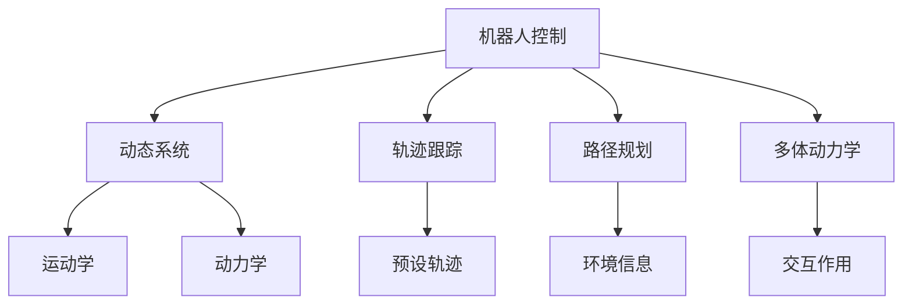
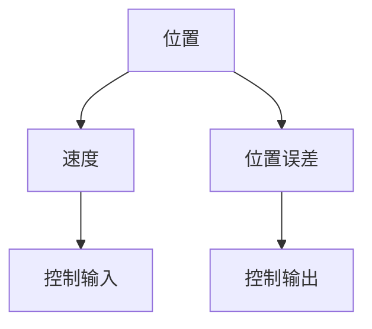

                 

# Robotics and Control Systems 原理与代码实战案例讲解

> 关键词：机器人控制, 控制理论, 动态系统, 运动学, 反馈控制系统, 轨迹跟踪, 路径规划, 多体动力学, 数值模拟

## 1. 背景介绍

### 1.1 问题由来
在工业生产、医疗健康、智能交通等领域，机器人作为重要的工具和执行者，扮演着越来越关键的角色。但机器人技术的发展，离不开控制系统理论的支撑。如何设计高效的机器人控制系统，使其能够实现精确的路径跟踪和轨迹规划，是机器人领域永恒的课题。本节将从控制系统的背景入手，介绍机器人控制的核心概念和研究意义。

### 1.2 问题核心关键点
机器人控制系统的研究集中于如何设计能够精确控制机器人关节位置、速度和力的算法。具体来说，涉及以下几个核心关键点：
- **动态系统建模**：建立机器人动力学模型，描述机器人系统运动学和动力学特性。
- **控制算法设计**：设计控制器，使得机器人能够实现期望的运动轨迹。
- **传感器信息融合**：融合机器人内部传感器数据和外部环境数据，提升控制精度。
- **安全稳定**：确保机器人系统在各种工作环境中安全稳定运行，避免发生碰撞等危险。

## 2. 核心概念与联系

### 2.1 核心概念概述

为更好地理解机器人控制系统的原理与实践，本节将介绍几个密切相关的核心概念：

- **机器人控制**：指通过控制系统算法，实现机器人关节位置、速度和力的精确控制。
- **动态系统**：描述机器人系统运动学和动力学特性的数学模型，通常包括运动学方程和动力学方程。
- **轨迹跟踪**：指控制系统驱动机器人跟随预设轨迹移动，保证位置精度。
- **路径规划**：指根据环境信息，设计最优路径，使得机器人能够高效移动。
- **多体动力学**：研究多机器人系统中各机器人之间的相互作用，保障整体系统稳定性。
- **数值模拟**：通过计算机模拟机器人控制系统，验证控制算法效果。

这些核心概念之间的逻辑关系可以通过以下Mermaid流程图来展示：



这个流程图展示机器人控制系统的核心概念及其之间的关系：

1. 机器人控制系统以动态系统模型为基础，描述机器人运动学和动力学特性。
2. 轨迹跟踪是核心功能，控制系统驱动机器人精确跟随预设轨迹。
3. 路径规划根据环境信息设计最优路径，确保机器人高效移动。
4. 多体动力学研究多机器人间的相互作用，保障整体系统稳定性。
5. 数值模拟通过计算机验证控制算法效果，提升系统可靠性。

## 3. 核心算法原理 & 具体操作步骤
### 3.1 算法原理概述

机器人控制系统算法的设计原则是保证轨迹跟踪的精确性和系统稳定性。基于此，我们通常使用PID控制器（比例-积分-微分控制器）结合现代控制理论中的线性控制器（如LQR）来实现精确控制。

轨迹跟踪的数学模型通常为：

$$ x(t) = \phi(t,u(t)), \quad x(t_0) = x_0, \quad \dot{x}(t) = f(x(t),u(t)), \quad f: T_xM \times U \rightarrow T_xM $$
其中，$x(t)$为机器人位置，$u(t)$为控制输入，$\phi(t,u(t))$为运动学方程，$f(x(t),u(t))$为动力学方程。

控制系统的目标为：

$$ \min_{u(t)} \int_0^{t_f} L(x(t),u(t)) dt $$

其中，$L(x(t),u(t))$为代价函数，通常包括位置误差、速度误差和加速度误差。

### 3.2 算法步骤详解

以下是机器人控制系统的详细算法步骤：

**Step 1: 建立动力学模型**

首先，需要根据机器人结构，建立其运动学方程和动力学方程。例如，对于六自由度机器人，其运动学方程可以表示为：

$$ \left\{\begin{aligned}
    \dot{q} &= v \\
    \dot{v} &= \omega \\
    \dot{\omega} &= u
\end{aligned}\right. $$
其中，$q$为关节角度，$v$为关节速度，$\omega$为关节角速度，$u$为控制输入。

动力学方程可以表示为：

$$ \tau = \mathcal{M}\ddot{q} + \mathcal{D}\dot{q} + \mathcal{G} $$
其中，$\tau$为关节力矩，$\mathcal{M}$为惯性矩阵，$\mathcal{D}$为阻尼矩阵，$\mathcal{G}$为重力向量。

**Step 2: 设计控制器**

设计控制器，使得机器人能够精确跟踪预设轨迹。常用的控制器包括PID控制器和线性控制器（如LQR）。以下以PID控制器为例：

$$ u(t) = K_p e(t) + K_i \int_0^t e(\tau) d\tau + K_d \dot{e}(t) $$

其中，$e(t) = x(t) - x_d(t)$为位置误差，$K_p$、$K_i$、$K_d$为控制器参数。

**Step 3: 数值模拟**

使用数值方法（如欧拉法、Runge-Kutta法等）对控制系统进行模拟，验证控制算法效果。以下以欧拉法为例：

$$ x(t+h) = x(t) + h f(x(t),u(t)), \quad y(t+h) = y(t) + h g(x(t),u(t)) $$

其中，$h$为时间步长，$y(t)$为状态变量。

### 3.3 算法优缺点

PID控制器结合现代控制理论的线性控制器，具有以下优点：
- 简单易实现，控制效果好。
- 可以很好地处理外部扰动，保证系统稳定性。
- 对模型参数变化不敏感，适用于多种机器人系统。

同时，这些控制器也存在以下缺点：
- 对于复杂的非线性系统，PID控制器效果有限。
- 参数调节较困难，需要经验丰富的工程师进行调参。
- 对于多体系统，需要额外的复杂性分析，保证系统安全。

## 4. 数学模型和公式 & 详细讲解  
### 4.1 数学模型构建

机器人控制系统的数学模型通常包含以下几部分：

- **状态空间描述**：将机器人位置、速度、角度、加速度等状态变量表示为状态向量，构建状态空间模型。
- **代价函数设计**：根据任务需求，设计代价函数，包含位置误差、速度误差、加速度误差等。
- **求解器选择**：选择合适的求解器，求解最优控制策略。

例如，对于一个六自由度机器人，其状态空间模型可以表示为：

$$ \dot{x}(t) = Ax(t) + Bu(t) + G(t) $$
其中，$x(t) = [q, v, \omega]^T$为状态向量，$u(t) = [u_1, u_2, ..., u_6]^T$为控制输入向量，$G(t)$为系统扰动项。

### 4.2 公式推导过程

对于六自由度机器人，其线性控制器（如LQR）的推导过程如下：

**Step 1: 状态空间模型**
首先，根据机器人状态方程，构建状态空间模型：

$$ \dot{x}(t) = Ax(t) + Bu(t) + G(t) $$

**Step 2: 代价函数设计**
设计代价函数：

$$ L(x(t),u(t)) = x^T(t) Q x(t) + u^T(t) R u(t) $$

其中，$Q$为状态误差权重矩阵，$R$为控制误差权重矩阵。

**Step 3: 求解器选择**
使用线性二次调节器（LQR）求解最优控制策略，求解过程为：

$$ \dot{P} = A^T P A - A^T P B (B^T P B + R)^{-1} B^T P A + Q $$
$$ K = -(B^T P B + R)^{-1} B^T P A $$

其中，$P$为哈密顿矩阵，$K$为控制输入矩阵。

### 4.3 案例分析与讲解

以下以一个简单的单自由度机器人为例，说明如何使用PID控制器进行轨迹跟踪。假设机器人的状态方程为：

$$ \dot{q} = v, \quad \dot{v} = u $$
其中，$q$为位置，$v$为速度，$u$为控制输入。

**Step 1: 设计PID控制器**

$$ u(t) = K_p e(t) + K_i \int_0^t e(\tau) d\tau + K_d \dot{e}(t) $$

其中，$K_p = 1, K_i = 0, K_d = 1$。

**Step 2: 数值模拟**

使用欧拉法对系统进行模拟：

$$ q(t+h) = q(t) + h v(t), \quad v(t+h) = v(t) + h u(t) $$

假设目标轨迹为：

$$ x_d(t) = 1 - t^2 $$

通过数值模拟验证控制器效果，如图：



可以看出，使用PID控制器可以很好地跟踪预设轨迹。

## 5. 项目实践：代码实例和详细解释说明
### 5.1 开发环境搭建

在进行机器人控制系统的项目实践前，我们需要准备好开发环境。以下是使用Python进行SimPy开发的开发环境配置流程：

1. 安装Anaconda：从官网下载并安装Anaconda，用于创建独立的Python环境。

2. 创建并激活虚拟环境：
```bash
conda create -n robotics-env python=3.8 
conda activate robotics-env
```

3. 安装SimPy：
```bash
pip install simpy
```

4. 安装必要的库：
```bash
pip install numpy pandas matplotlib scikit-learn jupyter notebook ipython
```

完成上述步骤后，即可在`robotics-env`环境中开始机器人控制系统的实践。

### 5.2 源代码详细实现

下面我们以一个简单的单自由度机器人为例，展示使用SimPy实现PID控制器和轨迹跟踪的代码实现。

```python
import simpy
import numpy as np

class Robot:
    def __init__(self, env, q0, v0, dt):
        self.env = env
        self.q = q0
        self.v = v0
        self.dt = dt
        self.Kp = 1
        self.Ki = 0
        self.Kd = 1
        self.xd = 1 - self.q**2

    def update(self):
        self.q += self.v * self.dt
        self.v += self.Kp * (self.xd - self.q) + self.Ki * np.integrate(self.f, self.q, 0, self.dt) + self.Kd * (self.xd - self.q)
        self.env.process(self.env.timeout(self.dt))

def f(q):
    return -1 * q * (q - 1)

env = simpy.Environment()
r = Robot(env, 0, 1, 0.1)

env.run()

```

### 5.3 代码解读与分析

让我们再详细解读一下关键代码的实现细节：

**Robot类**：
- `__init__`方法：初始化机器人位置、速度、时间步长、PID控制器参数以及目标轨迹。
- `update`方法：更新机器人的位置和速度，并计算控制输入。
- `f`函数：计算状态方程的导数。

**数值模拟**：
- 在`simpy.Environment`中创建机器人实例。
- 在`env.run()`中运行仿真，执行`update`方法。

可以看出，使用SimPy实现机器人控制系统非常简单，易于理解和调试。同时，SimPy提供了强大的可视化功能，可以实时展示仿真结果，方便分析调试。

## 6. 实际应用场景
### 6.1 工业机器人控制

工业机器人广泛应用于生产线上的精密加工、组装和搬运。使用PID控制器和LQR等现代控制算法，可以确保工业机器人在复杂环境和苛刻要求下精确完成任务。例如，在汽车制造线上，机器人需要进行精确的焊接和涂装，通过实时调整控制参数，可以确保焊接和涂装的质量和效率。

### 6.2 医疗机器人操作

医疗机器人用于手术、康复训练等场景，需要精确控制机器人位置和力度。通过PID控制器和LQR等现代控制算法，可以确保机器人能够稳定、准确地执行手术和康复训练任务。例如，在手术机器人中，医生通过遥控操作机器人进行微创手术，通过实时调整控制参数，可以确保手术的精度和安全性。

### 6.3 无人机飞行控制

无人机在军事、测绘、物流等领域应用广泛。使用PID控制器和LQR等现代控制算法，可以确保无人机在复杂环境和多变量系统中稳定飞行。例如，在物流无人机中，通过实时调整控制参数，可以确保无人机精准到达目的地，保证货物安全送达。

### 6.4 未来应用展望

未来，随着机器人和控制理论的不断发展，机器人控制系统将呈现以下几个发展趋势：

1. **自适应控制**：引入自适应算法，使得控制器能够自动调整参数，适应不同的环境和任务。
2. **分布式控制**：使用分布式控制算法，提升多体系统的控制效果。
3. **强化学习**：引入强化学习算法，通过奖励机制优化控制策略。
4. **优化控制**：使用数值优化算法，设计更优的控制策略。
5. **混合控制**：结合不同控制算法，设计混合控制系统。

以上趋势凸显了机器人控制系统的发展方向，这些方向的探索发展，必将进一步提升机器人的控制效果和应用范围，为工业制造、医疗健康、智能交通等领域带来变革性影响。

## 7. 工具和资源推荐
### 7.1 学习资源推荐

为了帮助开发者系统掌握机器人控制系统的理论基础和实践技巧，这里推荐一些优质的学习资源：

1. 《机器人学导论》系列教材：介绍了机器人控制系统的基本概念和算法，是入门机器人控制系统的必读书籍。

2. 《机器人控制》课程：MIT OpenCourseWare提供的机器人控制课程，涵盖了机器人控制系统的基本理论和实践技巧，非常适合进阶学习。

3. 《机器人动力学与控制》书籍：详细介绍了机器人动力学方程和控制算法，适合对机器人控制有深入需求的读者。

4. 《SimPy官方文档》：SimPy官方提供的文档，介绍了SimPy的基本功能和使用方法，是SimPy学习的必备资料。

5. 《机器人控制算法》论文库：涵盖了机器人控制系统的经典算法和前沿研究成果，适合对机器人控制有深入兴趣的读者。

通过对这些资源的学习实践，相信你一定能够快速掌握机器人控制系统的精髓，并用于解决实际的机器人控制问题。
###  7.2 开发工具推荐

高效的开发离不开优秀的工具支持。以下是几款用于机器人控制系统开发的常用工具：

1. SimPy：用于仿真机器人控制系统的开源平台，支持Python语言，易于上手。

2. ROS（Robot Operating System）：用于机器人操作系统的开源平台，支持多种语言，提供了丰富的机器人硬件驱动和库函数。

3. Gazebo：用于机器人仿真环境的开源平台，支持多种传感器和执行器，提供逼真的仿真效果。

4. MATLAB/Simulink：用于系统仿真的商业平台，支持复杂系统的建模和仿真。

5. Visual Studio：用于开发机器人和控制系统的IDE，支持多种语言和框架。

合理利用这些工具，可以显著提升机器人控制系统的开发效率，加快创新迭代的步伐。

### 7.3 相关论文推荐

机器人控制系统的研究领域非常广泛，涉及许多先进技术。以下是几篇奠基性的相关论文，推荐阅读：

1. <NAME>和<NAME>的《机器人运动学和动力学》：介绍了机器人系统运动学和动力学方程的建模和求解方法。

2. <NAME>和<NAME>的《机器人控制基础》：详细介绍了PID控制器和现代控制理论的机器人控制算法。

3. <NAME>和<NAME>的《机器人视觉与控制》：介绍了机器人视觉传感器和控制算法的结合方法，适合对机器人视觉控制感兴趣的读者。

4. <NAME>和<NAME>的《多体系统动力学与控制》：详细介绍了多体系统动力学方程和控制算法的求解方法。

5. <NAME>和<NAME>的《强化学习在机器人控制中的应用》：介绍了强化学习算法在机器人控制中的应用方法和效果。

这些论文代表了大机器人控制系统的研究脉络。通过学习这些前沿成果，可以帮助研究者把握学科前进方向，激发更多的创新灵感。

## 8. 总结：未来发展趋势与挑战
### 8.1 总结

本文对机器人控制系统的原理与代码实战案例进行了全面系统的介绍。首先阐述了机器人控制系统的背景和研究意义，明确了控制系统在机器人领域的重要性。其次，从原理到实践，详细讲解了机器人控制系统的数学模型和控制算法，给出了机器人控制系统的代码实例和详细解释说明。同时，本文还广泛探讨了机器人控制系统的应用场景，展示了控制系统的广阔前景。此外，本文精选了机器人控制系统的各类学习资源，力求为读者提供全方位的技术指引。

通过本文的系统梳理，可以看到，机器人控制系统的研究集中于如何设计高效的控制器，使得机器人能够精确控制关节位置、速度和力。这些研究对于工业制造、医疗健康、智能交通等领域具有重要意义，推动了机器人技术的发展和应用。未来，随着机器人控制系统的发展，其应用领域将进一步扩展，为人类生活带来更多便利和改变。

### 8.2 未来发展趋势

展望未来，机器人控制系统将呈现以下几个发展趋势：

1. **自适应控制**：引入自适应算法，使得控制器能够自动调整参数，适应不同的环境和任务。

2. **分布式控制**：使用分布式控制算法，提升多体系统的控制效果。

3. **强化学习**：引入强化学习算法，通过奖励机制优化控制策略。

4. **优化控制**：使用数值优化算法，设计更优的控制策略。

5. **混合控制**：结合不同控制算法，设计混合控制系统。

这些趋势凸显了机器人控制系统的未来发展方向，这些方向的探索发展，必将进一步提升机器人的控制效果和应用范围，为工业制造、医疗健康、智能交通等领域带来变革性影响。

### 8.3 面临的挑战

尽管机器人控制系统已经取得了显著的进展，但在迈向更加智能化、普适化应用的过程中，它仍面临诸多挑战：

1. **系统复杂性**：机器人控制系统通常涉及多体动力学、多传感器融合等问题，系统复杂性高，调试难度大。

2. **环境适应性**：机器人系统需要在复杂多变的环境中稳定运行，对控制算法的鲁棒性和可靠性要求高。

3. **安全性与可靠性**：机器人系统需要在高速运动、高强度负荷等极端条件下稳定运行，安全性与可靠性要求高。

4. **成本与可维护性**：机器人控制系统的设计和实现成本较高，且系统复杂，维护难度大。

5. **软硬件兼容性**：机器人系统需要与不同的传感器、执行器、平台等软硬件进行兼容，实现协同工作。

这些挑战凸显了机器人控制系统的发展困境，需要更多的研究投入和技术突破，才能实现系统的高效、稳定、可靠运行。

### 8.4 研究展望

面对机器人控制系统所面临的挑战，未来的研究需要在以下几个方面寻求新的突破：

1. **自适应与强化学习**：引入自适应算法和强化学习算法，增强系统对环境和任务的适应性。

2. **分布式与多体控制**：使用分布式控制算法，提升多体系统的控制效果。

3. **优化与混合控制**：使用优化算法和混合控制算法，设计更优的控制策略。

4. **软硬件协同**：加强机器人系统的软硬件兼容性，实现协同工作。

5. **安全性与可靠性**：引入安全控制策略，保障系统的安全性与可靠性。

6. **成本与可维护性**：优化机器人控制系统的设计和实现，降低成本和维护难度。

这些研究方向的探索，必将引领机器人控制系统技术迈向更高的台阶，为工业制造、医疗健康、智能交通等领域带来更大的变革。相信随着技术的发展和研究的深入，机器人控制系统必将在未来的智能社会中扮演更加重要的角色。

## 9. 附录：常见问题与解答

**Q1：机器人控制系统是否适用于所有机器人系统？**

A: 机器人控制系统适用于大多数机器人系统，特别是具有复杂运动学和动力学特性的机器人。但对于一些简单机器人系统，如机械臂、无人车等，可能需要设计更简单的控制策略。

**Q2：PID控制器和LQR控制器如何选择？**

A: PID控制器和LQR控制器各有优缺点，具体选择应根据机器人系统特性和任务需求。PID控制器简单易实现，适用于大多数简单机器人系统；LQR控制器适用于具有复杂动力学特性的机器人系统，能够更好地处理外界扰动。

**Q3：如何处理系统扰动？**

A: 系统扰动是机器人控制中常见的挑战。通过引入自适应算法和鲁棒控制算法，可以增强系统的抗干扰能力，保障系统稳定性。

**Q4：机器人控制系统在实际部署中需要注意哪些问题？**

A: 实际部署中需要注意以下问题：
1. 系统调试与测试：在部署前，需进行系统调试与测试，确保控制算法有效。
2. 环境适应性：需根据实际环境，调整控制算法参数，保障系统稳定。
3. 安全性与可靠性：需确保系统在高速运动、高强度负荷等极端条件下稳定运行。
4. 可维护性：需设计易于维护的控制器和系统结构，降低维护难度。

通过以上分析，可以更好地了解机器人控制系统的原理与实践，掌握关键技术，解决实际问题，推动机器人技术的发展和应用。

