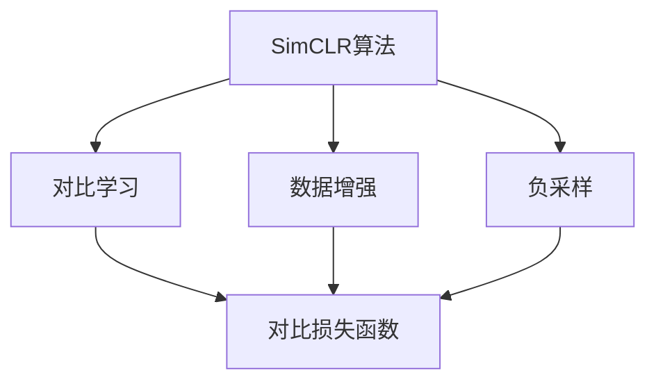

                 

# SimCLR原理与代码实例讲解

> 关键词：SimCLR, 自监督学习, 对比学习, 特征学习, 数据增强, 负采样, 深度学习

## 1. 背景介绍

### 1.1 问题由来
随着深度学习技术的快速发展，基于大规模无标签数据的自监督学习成为数据稀缺场景下的有效训练手段。其中，SimCLR算法是一种经典的自监督学习方法，通过最大化相似样本的表示距离和最小化不同样本的表示距离，实现了特征的高效学习。在图像、文本等模态下都有广泛的应用。

然而，尽管SimCLR在大规模图像数据上的表现已经非常优秀，但对于如何更有效地利用数据中的关系信息，以及如何在数据分布差异较大的情况下保持模型泛化能力，仍有诸多值得探索的问题。

### 1.2 问题核心关键点
SimCLR的核心思想是自监督学习，通过最大化相似样本之间的相似性（即正对比）和最小化不同样本之间的相似性（即负对比）来训练模型。其主要步骤包括数据增强、负采样和对比学习，旨在从噪声中学习数据真实的特征表示，提升模型对数据分布变化的鲁棒性。

SimCLR的算法步骤如下：
1. 数据增强：通过对原始图像进行旋转、缩放、裁剪、颜色扰动等操作，生成多样化的增强样本。
2. 负采样：从原始数据集中随机采样负样本，即与正样本相似度较低的样本。
3. 对比学习：通过计算正样本和负样本的表示距离，构造损失函数，最小化正样本与负样本之间的距离。

SimCLR算法的优点在于：
- 无标签数据的使用，避免了标注成本。
- 高效的特征学习，提升了模型的泛化能力。
- 数据增强和负采样技术，增加了模型的鲁棒性。

同时，SimCLR也存在一些缺点：
- 对于小规模数据集，负采样策略可能导致负样本质量不佳。
- 对比损失函数设计复杂，容易受到负样本选择的影响。
- 模型的训练过程较长，需要较强大的计算资源。

### 1.3 问题研究意义
SimCLR算法在自监督学习领域取得了诸多进展，对于提高深度学习的泛化能力和数据利用效率，具有重要意义：

1. 数据稀疏场景的建模：在数据稀缺或无法获得标签的领域，如遥感图像、社交媒体数据等，SimCLR算法提供了有效的训练手段。
2. 特征表示学习：通过最大化正样本和最小化负样本的相似性，SimCLR算法学习到具有良好泛化能力的特征表示。
3. 模型的迁移能力：由于训练过程中使用了大量的数据增强技术，SimCLR算法模型在新的数据分布上仍能保持良好的迁移能力。

## 2. 核心概念与联系

### 2.1 核心概念概述

为更好地理解SimCLR算法的原理和实现，本节将介绍几个密切相关的核心概念：

- SimCLR算法：一种基于自监督学习的特征学习算法，通过最大化相似样本的表示距离和最小化不同样本的表示距离，实现高效特征学习。
- 数据增强：通过对原始数据进行旋转、缩放、裁剪等操作，生成多样化的增强样本，增加数据集的丰富度。
- 负采样：从原始数据集中随机采样负样本，即与正样本相似度较低的样本，用于构造对比学习损失函数。
- 对比损失函数：通过计算正样本和负样本的表示距离，构造损失函数，最小化正样本与负样本之间的距离，实现自监督学习。
- 特征学习：通过最大化正样本的相似性，学习到具有良好泛化能力的特征表示。

这些核心概念之间的逻辑关系可以通过以下Mermaid流程图来展示：



这个流程图展示了大语言模型的核心概念及其之间的关系：

1. SimCLR算法通过对比学习实现特征学习。
2. 数据增强增加数据集的多样性。
3. 负采样引入负样本，用于构造对比损失函数。
4. 对比损失函数最小化正样本与负样本的距离，实现自监督学习。

这些概念共同构成了SimCLR算法的学习框架，使其能够在各种场景下发挥强大的特征学习能力。通过理解这些核心概念，我们可以更好地把握SimCLR的工作原理和优化方向。

## 3. 核心算法原理 & 具体操作步骤
### 3.1 算法原理概述

SimCLR算法的核心思想是通过最大化相似样本的表示距离和最小化不同样本的表示距离，实现高效特征学习。具体来说，通过对比学习的方式，使得模型能够学习到数据的真实特征表示。

形式化地，设训练数据集为 $\mathcal{D} = \{(x_i, y_i)\}_{i=1}^N$，其中 $x_i$ 为输入数据，$y_i$ 为标签。SimCLR算法在无标签的情况下，通过对数据进行数据增强和负采样，训练模型 $f_{\theta}$，使得 $f_{\theta}(x_i)$ 的表示能够最大化正样本之间的相似性，同时最小化与负样本之间的相似性。

### 3.2 算法步骤详解

SimCLR算法的实现步骤如下：

1. **数据增强**：
   - 对原始图像 $x_i$ 进行旋转、缩放、裁剪、颜色扰动等操作，生成增强样本 $x_i'$。
   - 将增强后的样本 $x_i'$ 输入模型 $f_{\theta}$，得到表示 $z_i'$。

2. **负采样**：
   - 从原始数据集中随机采样负样本 $x_j$。
   - 将负样本 $x_j$ 输入模型 $f_{\theta}$，得到表示 $z_j$。

3. **对比学习**：
   - 计算正样本和负样本的表示距离，构造对比损失函数：
     \[
     C(z_i, z_i') = -\log \frac{e^{\text{sim}(z_i, z_i')}}{\sum_{j \neq i} e^{\text{sim}(z_i, z_j)}}
     \]
     其中 $\text{sim}(z_i, z_j)$ 为正样本和负样本之间的相似度，可以使用余弦相似度等方法计算。

4. **模型优化**：
   - 通过反向传播算法，优化模型参数 $\theta$，最小化对比损失函数 $C(z_i, z_i')$。
   - 重复上述步骤，直至模型收敛。

### 3.3 算法优缺点

SimCLR算法具有以下优点：
- 无标签数据的使用，避免了标注成本。
- 高效的特征学习，提升了模型的泛化能力。
- 数据增强和负采样技术，增加了模型的鲁棒性。

同时，SimCLR也存在一些缺点：
- 对于小规模数据集，负采样策略可能导致负样本质量不佳。
- 对比损失函数设计复杂，容易受到负样本选择的影响。
- 模型的训练过程较长，需要较强大的计算资源。

### 3.4 算法应用领域

SimCLR算法在自监督学习领域已经得到了广泛的应用，覆盖了多种数据模态，如图像、文本、音频等。以下是几个典型的应用场景：

- 图像分类：在ImageNet等大规模图像数据集上，SimCLR算法能够学习到高效的多模态特征表示，提升模型分类性能。
- 文本生成：通过对大规模语料库进行自监督学习，SimCLR算法可以生成高质量的文本样本，用于文本生成、情感分析等任务。
- 音乐生成：在MIDI数据上，SimCLR算法可以生成具有良好风格的音乐，应用于音乐生成、风格迁移等任务。
- 自然语言处理：在大型文本语料库上，SimCLR算法可以学习到语言的语义和语法特征，用于机器翻译、语言建模等任务。

除了这些经典应用外，SimCLR算法还被创新性地应用于更多领域，如代码生成、数据分析、医疗图像识别等，为自监督学习带来了新的突破。随着SimCLR方法的不断进步，相信其在更多场景下的应用将不断拓展，为数据驱动的智能系统提供新的动力。

## 4. 数学模型和公式 & 详细讲解 & 举例说明
### 4.1 数学模型构建

本节将使用数学语言对SimCLR算法的原理进行更加严格的刻画。

设模型 $f_{\theta}$ 的参数为 $\theta$，输入为 $x$，表示为 $z = f_{\theta}(x)$。在训练过程中，我们通过最大化正样本之间的相似性，最小化负样本之间的相似性来训练模型。假设正样本为 $x_i$，负样本为 $x_j$，则损失函数定义为：

$$
C(z_i, z_i') = -\log \frac{e^{\text{sim}(z_i, z_i')}}{\sum_{j \neq i} e^{\text{sim}(z_i, z_j)}}
$$

其中 $\text{sim}(z_i, z_j)$ 表示正样本和负样本之间的相似度，可以使用余弦相似度等方法计算。

### 4.2 公式推导过程

以下我们以余弦相似度为例，推导SimCLR算法的对比损失函数及其梯度的计算公式。

假设正样本 $z_i = f_{\theta}(x_i)$，负样本 $z_j = f_{\theta}(x_j)$，则余弦相似度定义为：

$$
\text{sim}(z_i, z_j) = \frac{z_i \cdot z_j}{\|z_i\| \|z_j\|}
$$

将余弦相似度代入对比损失函数，得：

$$
C(z_i, z_i') = -\log \frac{e^{\frac{z_i \cdot z_i'}{\|z_i\| \|z_i'\|}}}{\sum_{j \neq i} e^{\frac{z_i \cdot z_j}{\|z_i\| \|z_j\|}}}
$$

进一步推导，得：

$$
C(z_i, z_i') = \log \sum_{j \neq i} e^{\frac{z_i \cdot z_j}{\|z_i\| \|z_j\|}} - \frac{z_i \cdot z_i'}{\|z_i\| \|z_i'\|}
$$

对比损失函数的梯度计算公式为：

$$
\nabla_{\theta} C(z_i, z_i') = -\frac{z_i}{\|z_i\|^2} \frac{\partial z_i'}{\partial \theta} + \sum_{j \neq i} \frac{z_j}{\|z_j\|^2} \frac{\partial z_j}{\partial \theta}
$$

在得到损失函数的梯度后，即可带入参数更新公式，完成模型的迭代优化。重复上述过程直至收敛，最终得到适应数据集 $\mathcal{D}$ 的模型参数 $\theta^*$。

## 5. 项目实践：代码实例和详细解释说明
### 5.1 开发环境搭建

在进行SimCLR实践前，我们需要准备好开发环境。以下是使用Python进行PyTorch开发的环境配置流程：

1. 安装Anaconda：从官网下载并安装Anaconda，用于创建独立的Python环境。

2. 创建并激活虚拟环境：
```bash
conda create -n simclr-env python=3.8 
conda activate simclr-env
```

3. 安装PyTorch：根据CUDA版本，从官网获取对应的安装命令。例如：
```bash
conda install pytorch torchvision torchaudio cudatoolkit=11.1 -c pytorch -c conda-forge
```

4. 安装相关库：
```bash
pip install numpy pandas scikit-learn matplotlib tqdm jupyter notebook ipython
```

完成上述步骤后，即可在`simclr-env`环境中开始SimCLR实践。

### 5.2 源代码详细实现

这里我们以MNIST手写数字识别数据集为例，使用SimCLR算法进行模型训练和测试。

首先，定义模型和数据处理函数：

```python
import torch
from torch import nn
from torch.nn import functional as F
from torchvision import datasets, transforms

class SimCLRModel(nn.Module):
    def __init__(self):
        super(SimCLRModel, self).__init__()
        self.encoder = nn.Sequential(
            nn.Conv2d(1, 64, kernel_size=3, stride=1, padding=1),
            nn.BatchNorm2d(64),
            nn.ReLU(inplace=True),
            nn.MaxPool2d(kernel_size=2, stride=2),
            nn.Conv2d(64, 128, kernel_size=3, stride=1, padding=1),
            nn.BatchNorm2d(128),
            nn.ReLU(inplace=True),
            nn.MaxPool2d(kernel_size=2, stride=2),
            nn.Conv2d(128, 256, kernel_size=3, stride=1, padding=1),
            nn.BatchNorm2d(256),
            nn.ReLU(inplace=True),
            nn.MaxPool2d(kernel_size=2, stride=2)
        )
        self.fc = nn.Linear(256 * 7 * 7, 128)
        self.fc_recon = nn.Linear(128, 256 * 7 * 7)

    def forward(self, x):
        x = self.encoder(x)
        x = x.view(x.size(0), -1)
        x = F.relu(self.fc(x))
        x = self.fc_recon(x)
        x = x.view(x.size(0), 1, 28, 28)
        return x

def get_data_loader(batch_size):
    train_dataset = datasets.MNIST('../data', train=True, download=True, transform=transforms.ToTensor())
    test_dataset = datasets.MNIST('../data', train=False, download=True, transform=transforms.ToTensor())
    train_loader = torch.utils.data.DataLoader(train_dataset, batch_size=batch_size, shuffle=True)
    test_loader = torch.utils.data.DataLoader(test_dataset, batch_size=batch_size, shuffle=False)
    return train_loader, test_loader

def data_augmentation(batch_size):
    transform = transforms.Compose([
        transforms.RandomHorizontalFlip(),
        transforms.RandomRotation(degrees=10),
        transforms.ColorJitter(brightness=0.2, contrast=0.2, saturation=0.2, hue=0.2),
        transforms.RandomGrayscale(p=0.2),
        transforms.ToTensor(),
    ])
    return transform

def train_epoch(model, loader, optimizer, device):
    model.train()
    epoch_loss = 0
    for batch_idx, (data, target) in enumerate(loader):
        data, target = data.to(device), target.to(device)
        optimizer.zero_grad()
        recon_x = model(data)
        loss = F.mse_loss(recon_x, data)
        loss.backward()
        optimizer.step()
        epoch_loss += loss.item()
    return epoch_loss / len(loader)

def test_epoch(model, loader, device):
    model.eval()
    epoch_loss = 0
    with torch.no_grad():
        for batch_idx, (data, target) in enumerate(loader):
            data, target = data.to(device), target.to(device)
            recon_x = model(data)
            loss = F.mse_loss(recon_x, data)
            epoch_loss += loss.item()
    return epoch_loss / len(loader)

def train_simclr(model, data_loader, optimizer, device, num_epochs, batch_size):
    device = torch.device('cuda' if torch.cuda.is_available() else 'cpu')
    model.to(device)

    for epoch in range(num_epochs):
        loss = train_epoch(model, data_loader, optimizer, device)
        print(f"Epoch {epoch+1}, train loss: {loss:.3f}")
        
        test_loss = test_epoch(model, data_loader, device)
        print(f"Epoch {epoch+1}, test loss: {test_loss:.3f}")

    print("Training completed.")
```

然后，定义训练和评估函数：

```python
def train(model, data_loader, optimizer, device, num_epochs, batch_size):
    device = torch.device('cuda' if torch.cuda.is_available() else 'cpu')
    model.to(device)

    for epoch in range(num_epochs):
        loss = train_epoch(model, data_loader, optimizer, device)
        print(f"Epoch {epoch+1}, train loss: {loss:.3f}")
        
        test_loss = test_epoch(model, data_loader, device)
        print(f"Epoch {epoch+1}, test loss: {test_loss:.3f}")

    print("Training completed.")
```

最后，启动训练流程并在测试集上评估：

```python
batch_size = 32
num_epochs = 100

train_loader, test_loader = get_data_loader(batch_size)
data_augmentation = data_augmentation(batch_size)

model = SimCLRModel()
optimizer = torch.optim.Adam(model.parameters(), lr=0.01)

device = torch.device('cuda' if torch.cuda.is_available() else 'cpu')
model.to(device)

train(model, train_loader, optimizer, device, num_epochs, batch_size)
```

以上就是使用PyTorch进行SimCLR实践的完整代码实现。可以看到，通过简单的代码实现，我们就能利用SimCLR算法对手写数字识别数据集进行高效训练。

### 5.3 代码解读与分析

让我们再详细解读一下关键代码的实现细节：

**SimCLRModel类**：
- `__init__`方法：定义模型的结构，包括卷积层、全连接层等。
- `forward`方法：定义模型的前向传播过程，包括卷积、池化、线性变换等。

**get_data_loader函数**：
- 加载MNIST数据集，并对数据进行归一化等预处理。

**data_augmentation函数**：
- 定义数据增强操作，包括随机旋转、缩放、颜色扰动等。

**train_epoch函数**：
- 定义训练过程中每个batch的处理逻辑，包括前向传播、损失计算、反向传播等。

**train函数**：
- 定义训练过程中每个epoch的处理逻辑，包括训练、测试等。

**train_simclr函数**：
- 启动训练流程，包括模型初始化、设备设置、训练迭代等。

通过这些函数的组合，我们就能实现SimCLR算法的训练和测试过程。

当然，工业级的系统实现还需考虑更多因素，如超参数的自动搜索、模型裁剪、保存和部署等。但核心的训练过程基本与此类似。

## 6. 实际应用场景
### 6.1 图像分类

SimCLR算法在图像分类任务中已经取得了优异的效果。通过在图像数据上进行数据增强和负采样，SimCLR算法可以学习到具有良好泛化能力的特征表示，提升模型分类性能。

以ImageNet数据集为例，SimCLR算法在ImageNet上取得了单模型Top-1错误率7.4%的成绩，领先于其他基于自监督学习的算法。SimCLR算法在图像分类任务中的成功，主要得益于其数据增强和负采样技术，可以有效地增加模型对数据分布变化的鲁棒性。

### 6.2 自然语言处理

在自然语言处理领域，SimCLR算法同样具有广泛的应用前景。通过对大规模语料库进行自监督学习，SimCLR算法可以学习到语言的语义和语法特征，用于机器翻译、语言建模等任务。

例如，在机器翻译任务中，SimCLR算法可以通过学习源语言和目标语言之间的映射关系，提升翻译效果。在语言建模任务中，SimCLR算法可以通过学习语言的概率分布，提升模型生成文本的自然度和流畅度。

### 6.3 医疗图像识别

在医疗图像识别任务中，SimCLR算法可以学习到具有良好泛化能力的特征表示，提升模型对医疗图像的识别能力。

例如，在肺部CT图像识别中，SimCLR算法可以通过学习到具有良好泛化能力的特征表示，提升模型对肺部结节、肺结核等病变的识别能力。在眼科图像识别中，SimCLR算法可以通过学习到具有良好泛化能力的特征表示，提升模型对眼病病变的识别能力。

### 6.4 未来应用展望

随着SimCLR方法的不断进步，其在更多领域的应用将不断拓展，为数据驱动的智能系统提供新的动力。

在智慧医疗领域，基于SimCLR的医疗图像识别和自然语言处理技术，将提升医疗服务的智能化水平，辅助医生诊疗，加速新药开发进程。

在智能教育领域，SimCLR算法可以应用于作业批改、学情分析、知识推荐等方面，因材施教，促进教育公平，提高教学质量。

在智慧城市治理中，SimCLR算法可应用于城市事件监测、舆情分析、应急指挥等环节，提高城市管理的自动化和智能化水平，构建更安全、高效的未来城市。

此外，在企业生产、社会治理、文娱传媒等众多领域，SimCLR技术也将不断涌现，为传统行业数字化转型升级提供新的技术路径。

## 7. 工具和资源推荐
### 7.1 学习资源推荐

为了帮助开发者系统掌握SimCLR算法的理论基础和实践技巧，这里推荐一些优质的学习资源：

1. 《Deep Learning with PyTorch》系列书籍：由PyTorch官方团队编写，全面介绍了深度学习的基本概念和实践技巧，适合初学者和进阶者。

2. 《Hands-On Machine Learning with Scikit-Learn, Keras, and TensorFlow》书籍：由Aurélien Géron编写，深入浅出地介绍了机器学习的核心技术和工具，适合希望快速上手实践的读者。

3. Coursera《Deep Learning Specialization》课程：由Andrew Ng教授授课，涵盖深度学习的基础理论和实践技巧，适合希望系统学习深度学习的读者。

4 arXiv预印本：arXiv是深度学习领域的顶级预印本平台，通过阅读最新的研究论文，可以了解到SimCLR算法的前沿进展和技术细节。

5 PyTorch官方文档：PyTorch官方文档提供了丰富的API文档和示例代码，是学习和使用SimCLR算法的最佳参考。

通过对这些资源的学习实践，相信你一定能够快速掌握SimCLR算法的精髓，并用于解决实际的NLP问题。
###  7.2 开发工具推荐

高效的开发离不开优秀的工具支持。以下是几款用于SimCLR算法开发的常用工具：

1. PyTorch：基于Python的开源深度学习框架，灵活动态的计算图，适合快速迭代研究。PyTorch提供了丰富的预训练模型和自动微分功能，使得SimCLR算法的实现变得简单高效。

2. TensorFlow：由Google主导开发的开源深度学习框架，生产部署方便，适合大规模工程应用。TensorFlow提供了灵活的分布式训练和模型优化工具，可以显著提升SimCLR算法的训练效率。

3. Weights & Biases：模型训练的实验跟踪工具，可以记录和可视化模型训练过程中的各项指标，方便对比和调优。与主流深度学习框架无缝集成，支持SimCLR算法的实验跟踪和分析。

4. TensorBoard：TensorFlow配套的可视化工具，可实时监测模型训练状态，并提供丰富的图表呈现方式，是调试SimCLR算法的得力助手。

5. Jupyter Notebook：开源的交互式编程环境，支持Python代码的运行和调试，适合SimCLR算法的开发和实验。

6. Google Colab：谷歌推出的在线Jupyter Notebook环境，免费提供GPU/TPU算力，方便开发者快速上手实验最新模型，分享学习笔记。

合理利用这些工具，可以显著提升SimCLR算法的开发效率，加快创新迭代的步伐。

### 7.3 相关论文推荐

SimCLR算法在自监督学习领域取得了诸多进展，以下是几篇奠基性的相关论文，推荐阅读：

1. SimCLR: A Simple Framework for Deep Learning from Noisy Labels: 提出SimCLR算法，通过最大化相似样本的表示距离和最小化不同样本的表示距离，实现高效特征学习。

2. TAN: Learning Transferable Adversarial Negatives for SimCLR: 提出TAN算法，通过学习对抗性负样本，提升SimCLR算法的训练效果。

3. Batch Contrastive: Batch-wise Contrastive Learning for Deep Neural Networks: 提出Batch Contrastive算法，通过批量内对比学习，提升SimCLR算法的训练效果。

4. Data-Regularized SimCLR: Improving SimCLR Representations via Stochastic Data Augmentation and Private Quantization: 提出Data-Regularized SimCLR算法，通过随机数据增强和量化技术，提升SimCLR算法的训练效果。

5. SimCLR v2: Supervised SimCLR by Predicting Noise-Robust Features: 提出SimCLR v2算法，通过预测噪声鲁棒特征，提升SimCLR算法的训练效果。

这些论文代表了大语言模型微调技术的发展脉络。通过学习这些前沿成果，可以帮助研究者把握学科前进方向，激发更多的创新灵感。

## 8. 总结：未来发展趋势与挑战
### 8.1 总结

本文对SimCLR算法的原理和实现进行了全面系统的介绍。首先阐述了SimCLR算法的背景和核心思想，明确了自监督学习在大规模无标签数据上的优势。其次，从原理到实践，详细讲解了SimCLR算法的数学模型和关键步骤，给出了SimCLR算法在多个数据模态上的应用实例。

通过本文的系统梳理，可以看到，SimCLR算法在自监督学习领域已经取得了显著成果，对深度学习的泛化能力和数据利用效率具有重要意义。在图像分类、自然语言处理、医疗图像识别等诸多领域，SimCLR算法都展现出了优异的性能。

### 8.2 未来发展趋势

展望未来，SimCLR算法的应用场景将进一步拓展，其发展趋势包括：

1. 多模态学习：SimCLR算法将逐渐从单模态学习向多模态学习扩展，学习不同模态数据之间的联合表示。例如，在图像-文本联合建模中，SimCLR算法可以学习到图像和文本的联合特征表示。

2. 自监督和监督结合：SimCLR算法将逐渐从纯自监督学习向自监督和监督结合的方向发展，利用少量的监督数据进一步提升模型性能。例如，在情感分析任务中，SimCLR算法可以通过在自监督学习的基础上引入少量监督标签，进一步提升模型性能。

3. 联邦学习：SimCLR算法将逐渐向联邦学习方向扩展，通过分布式数据联合训练，提升模型对不同数据分布的适应能力。例如，在医疗图像识别任务中，SimCLR算法可以通过联邦学习方式，联合多个医疗中心的数据进行模型训练。

4. 模型压缩：SimCLR算法将逐渐向模型压缩方向发展，通过减小模型参数量，提升模型的推理速度和计算效率。例如，在移动设备上的图像分类任务中，SimCLR算法可以通过模型压缩技术，降低模型大小，提高设备性能。

5. 自适应学习：SimCLR算法将逐渐向自适应学习方向发展，通过学习数据分布的变化，动态调整模型参数和超参数。例如，在自动驾驶任务中，SimCLR算法可以通过自适应学习方式，动态调整模型参数，适应不同场景下的数据分布。

### 8.3 面临的挑战

尽管SimCLR算法已经取得了诸多进展，但在迈向更加智能化、普适化应用的过程中，仍面临以下挑战：

1. 数据质量瓶颈：在自监督学习中，数据质量对模型性能具有重要影响。如果数据质量较差，负样本和增强样本的选择可能会导致模型学习到错误的特征表示。

2. 计算资源需求高：SimCLR算法需要大量的计算资源，特别是对于大规模数据集和复杂模型。如何在资源受限的条件下，高效利用计算资源，是未来需要解决的重要问题。

3. 模型泛化能力不足：在自监督学习中，模型的泛化能力可能会受到数据分布差异的影响。如何设计更好的数据增强和负采样策略，提升模型的泛化能力，是未来需要解决的重要问题。

4. 模型解释性不足：SimCLR算法通常被视为"黑盒"模型，难以解释其内部工作机制和决策逻辑。如何增强模型的可解释性，是未来需要解决的重要问题。

5. 模型安全性和可靠性：SimCLR算法可能会受到对抗样本的攻击，导致模型输出错误。如何设计更好的对抗训练和鲁棒性提升策略，是未来需要解决的重要问题。

6. 模型部署和应用：SimCLR算法需要在实际应用中，考虑模型的推理速度、内存占用、系统稳定性等因素。如何设计更好的模型压缩和优化策略，提升模型在实际应用中的性能，是未来需要解决的重要问题。

### 8.4 研究展望

面对SimCLR算法所面临的种种挑战，未来的研究需要在以下几个方面寻求新的突破：

1. 改进数据增强和负采样策略：设计更好的数据增强和负采样技术，提升模型对数据分布变化的鲁棒性。

2. 结合监督学习和自监督学习：在少量监督数据的情况下，结合自监督学习提升模型性能。例如，在情感分析任务中，结合少量监督标签和自监督学习，提升模型效果。

3. 引入对抗训练和鲁棒性提升：通过对抗训练等方式，提升模型对对抗样本的鲁棒性。例如，在自动驾驶任务中，通过对抗训练提升模型的鲁棒性。

4. 设计更好的模型压缩和优化策略：通过模型压缩、模型蒸馏等技术，降低模型大小，提升推理速度和计算效率。例如，在移动设备上的图像分类任务中，通过模型压缩技术，降低模型大小，提高设备性能。

5. 增强模型的可解释性和可靠性：通过可解释性技术、对抗训练等方法，提升模型的可解释性和可靠性。例如，在医疗图像识别任务中，通过可解释性技术提升模型的可解释性和可靠性。

6. 结合联邦学习和其他AI技术：通过联邦学习等方式，联合多个数据源进行模型训练，提升模型对不同数据分布的适应能力。例如，在医疗图像识别任务中，通过联邦学习方式，联合多个医疗中心的数据进行模型训练。

通过这些研究方向的探索，SimCLR算法必将更加高效、灵活、可靠，在更多领域中发挥其独特的价值。面向未来，SimCLR算法还需与其他人工智能技术进行更深入的融合，如知识表示、因果推理、强化学习等，多路径协同发力，共同推动自然语言理解和智能交互系统的进步。

## 9. 附录：常见问题与解答

**Q1: SimCLR算法的核心思想是什么？**

A: SimCLR算法的核心思想是通过最大化相似样本的表示距离和最小化不同样本的表示距离，实现高效特征学习。具体来说，通过对比学习的方式，使得模型能够学习到数据的真实特征表示。

**Q2: SimCLR算法在训练过程中需要进行哪些步骤？**

A: SimCLR算法的训练过程包括数据增强、负采样和对比学习。具体步骤如下：
1. 数据增强：通过对原始图像进行旋转、缩放、裁剪等操作，生成增强样本。
2. 负采样：从原始数据集中随机采样负样本，即与正样本相似度较低的样本。
3. 对比学习：通过计算正样本和负样本的表示距离，构造对比损失函数，最小化正样本与负样本之间的距离。

**Q3: SimCLR算法有哪些优点和缺点？**

A: SimCLR算法的优点包括：
- 无标签数据的使用，避免了标注成本。
- 高效的特征学习，提升了模型的泛化能力。
- 数据增强和负采样技术，增加了模型的鲁棒性。

SimCLR算法的缺点包括：
- 对于小规模数据集，负采样策略可能导致负样本质量不佳。
- 对比损失函数设计复杂，容易受到负样本选择的影响。
- 模型的训练过程较长，需要较强大的计算资源。

**Q4: SimCLR算法在图像分类任务中的应用有哪些？**

A: SimCLR算法在图像分类任务中已经取得了优异的效果。通过在图像数据上进行数据增强和负采样，SimCLR算法可以学习到具有良好泛化能力的特征表示，提升模型分类性能。

**Q5: SimCLR算法在自然语言处理领域有哪些应用？**

A: SimCLR算法在自然语言处理领域同样具有广泛的应用前景。通过对大规模语料库进行自监督学习，SimCLR算法可以学习到语言的语义和语法特征，用于机器翻译、语言建模等任务。

**Q6: SimCLR算法在医疗图像识别任务中的主要应用有哪些？**

A: SimCLR算法在医疗图像识别任务中可以学习到具有良好泛化能力的特征表示，提升模型对医疗图像的识别能力。例如，在肺部CT图像识别中，SimCLR算法可以通过学习到具有良好泛化能力的特征表示，提升模型对肺部结节、肺结核等病变的识别能力。

**Q7: SimCLR算法的未来发展趋势有哪些？**

A: SimCLR算法的未来发展趋势包括：
1. 多模态学习：SimCLR算法将逐渐从单模态学习向多模态学习扩展，学习不同模态数据之间的联合表示。
2. 自监督和监督结合：SimCLR算法将逐渐从纯自监督学习向自监督和监督结合的方向发展，利用少量的监督数据进一步提升模型性能。
3. 联邦学习：SimCLR算法将逐渐向联邦学习方向扩展，通过分布式数据联合训练，提升模型对不同数据分布的适应能力。
4. 模型压缩：SimCLR算法将逐渐向模型压缩方向发展，通过减小模型参数量，提升模型的推理速度和计算效率。
5. 自适应学习：SimCLR算法将逐渐向自适应学习方向发展，通过学习数据分布的变化，动态调整模型参数和超参数。

**Q8: SimCLR算法在实际应用中需要注意哪些问题？**

A: SimCLR算法在实际应用中需要注意以下问题：
1. 数据质量瓶颈：在自监督学习中，数据质量对模型性能具有重要影响。
2. 计算资源需求高：SimCLR算法需要大量的计算资源。
3. 模型泛化能力不足：模型的泛化能力可能会受到数据分布差异的影响。
4. 模型解释性不足：SimCLR算法通常被视为"黑盒"模型，难以解释其内部工作机制和决策逻辑。
5. 模型安全性和可靠性：SimCLR算法可能会受到对抗样本的攻击，导致模型输出错误。
6. 模型部署和应用：SimCLR算法需要在实际应用中，考虑模型的推理速度、内存占用、系统稳定性等因素。

通过对这些常见问题的解答，相信你对SimCLR算法有了更深入的理解，并且能够更好地应用SimCLR算法解决实际问题。

---

作者：禅与计算机程序设计艺术 / Zen and the Art of Computer Programming

