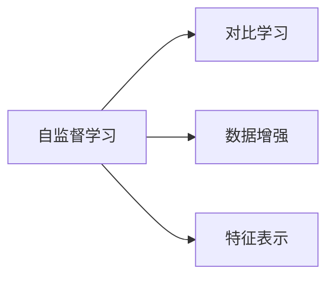

                 

# SimCLR原理与代码实例讲解

> 关键词：

## 1. 背景介绍

### 1.1 问题由来

在深度学习时代，自监督学习（Self-Supervised Learning）成为了一个备受关注的研究方向。相比于传统的有监督学习（Supervised Learning），自监督学习可以利用无标签数据进行模型训练，避免了标注成本高、数据获取困难等问题。同时，自监督学习能够更广泛地应用在非监督数据中，提升模型泛化能力。

在自监督学习的众多方法中，SimCLR（Simple Contrastive Learning)是一个兼具高效性和普适性的经典算法。SimCLR通过大规模的无标签数据进行预训练，生成具有强大表征能力的特征表示，并可以很方便地微调到下游任务上。因此，本文将详细讲解SimCLR的原理，并通过代码实例进行演示。

### 1.2 问题核心关键点

SimCLR的核心思想是对比学习（Contrastive Learning）。它利用数据中同一实例的多个不同表示之间的差异，学习高质量的特征表示。SimCLR的预训练过程包括两个步骤：首先生成数据的不同表示，然后进行对比学习。其优点包括：

1. 简单易用：SimCLR算法结构简单，易于实现。
2. 泛化能力强：SimCLR能够在多种数据集上进行预训练，学习到通用的特征表示。
3. 高效性：SimCLR通过对比学习方式训练模型，具有较高的计算效率。
4. 可扩展性强：SimCLR可以很容易地与其他深度学习架构（如ResNet、VGG等）进行组合。

## 2. 核心概念与联系

### 2.1 核心概念概述

为了更好地理解SimCLR算法，我们需要先了解一些相关的核心概念：

- **自监督学习（Self-Supervised Learning）**：利用无标签数据进行训练，让模型从数据本身的规律中学习，从而提升泛化能力。
- **对比学习（Contrastive Learning）**：通过将同一实例的不同表示进行对比，学习到高质量的特征表示。
- **数据增强（Data Augmentation）**：通过对原始数据进行变换，生成新的数据样本，增加数据多样性。
- **特征表示（Feature Representation）**：将原始数据映射为高维特征空间中的表示，方便模型进行学习和推理。

这些概念通过Mermaid流程图展示如下：



接下来，我们将详细讲解SimCLR的原理和实现步骤。

## 3. 核心算法原理 & 具体操作步骤
### 3.1 算法原理概述

SimCLR通过生成数据的多样化表示，并在这些表示之间进行对比学习，学习到具有较强泛化能力的特征表示。其核心流程包括以下几个步骤：

1. **数据增强**：对原始数据进行随机变换，生成多个不同的表示。
2. **特征映射**：将数据的不同表示映射到高维特征空间中。
3. **对比学习**：将数据的不同表示进行对比，学习到具有区分度的特征表示。
4. **负样本采样**：从数据集中随机采样负样本，用于训练对比学习。
5. **损失函数**：定义损失函数，衡量模型在不同表示间的相似度，并最小化损失函数。

### 3.2 算法步骤详解

#### 3.2.1 数据增强

数据增强是SimCLR预训练的核心步骤之一。通过数据增强，我们可以增加数据的多样性，避免模型过拟合。在SimCLR中，我们通常使用随机裁剪（Random Cropping）、随机翻转（Random Flipping）等方法进行数据增强。

以ResNet为例，我们定义一个随机裁剪和翻转的函数：

```python
import torch.nn as nn
import torchvision.transforms as transforms

def random_transform(x):
    transform = transforms.Compose([
        transforms.RandomResizedCrop(224),
        transforms.RandomHorizontalFlip(p=0.5),
        transforms.ToTensor(),
        transforms.Normalize(mean=[0.485, 0.456, 0.406], std=[0.229, 0.224, 0.225])
    ])
    return transform(x)
```

#### 3.2.2 特征映射

特征映射是将数据的不同表示映射到高维特征空间的过程。在SimCLR中，我们通常使用ResNet、VGG等预训练模型作为特征映射器。以ResNet为例，我们定义特征映射器如下：

```python
class SimCLR(nn.Module):
    def __init__(self, model, temperature=0.5):
        super(SimCLR, self).__init__()
        self.model = model
        self.temperature = temperature
        self.register_buffer('feature_extractor', nn.Identity())

    def forward(self, x):
        x = self.feature_extractor(self.model(x))
        return x / self.temperature
```

#### 3.2.3 对比学习

对比学习是SimCLR的核心步骤，通过将数据的不同表示进行对比，学习到具有区分度的特征表示。在SimCLR中，我们通常使用对比损失函数（Contrastive Loss）进行训练。对比损失函数定义为：

$$
\mathcal{L} = -\frac{1}{N}\sum_{i=1}^N \log \sigma(\frac{\mathbf{x}_i^T\mathbf{y}_i}{\sqrt{\dim(\mathbf{x}_i)\dim(\mathbf{y}_i)})
$$

其中，$\mathbf{x}_i$ 和 $\mathbf{y}_i$ 分别是同一个样本的不同表示，$\sigma$ 是sigmoid函数，$\dim$ 是向量的维度。

在实现中，我们通常使用PyTorch的 `nn.CrossEntropyLoss` 函数进行训练。以ResNet为例，我们定义对比损失函数如下：

```python
def contrastive_loss(x, y):
    x = x / self.temperature
    y = y / self.temperature
    loss = nn.CrossEntropyLoss()(x, y)
    return loss
```

#### 3.2.4 负样本采样

负样本采样是对比学习的关键步骤。通过随机采样负样本，可以增加对比学习的难度，提升模型的泛化能力。在SimCLR中，我们通常使用负采样（Negative Sampling）的方式进行负样本采样。以ResNet为例，我们定义负采样函数如下：

```python
import torch
import random

def negative_sampling(x, k=64):
    batch_size = x.size(0)
    num_classes = x.size(1)
    indices = torch.randperm(batch_size * num_classes)[:k]
    labels = torch.randint(0, num_classes, size=(k,))
    return x[indices], labels
```

#### 3.2.5 损失函数

损失函数是训练模型的关键。在SimCLR中，我们通常使用对比损失函数进行训练。以ResNet为例，我们定义损失函数如下：

```python
def loss_fn(x, y):
    x = self.forward(x)
    y = self.model(y)
    loss = contrastive_loss(x, y)
    return loss
```

### 3.3 算法优缺点

#### 3.3.1 优点

1. **简单高效**：SimCLR算法结构简单，易于实现。
2. **泛化能力强**：SimCLR能够在多种数据集上进行预训练，学习到通用的特征表示。
3. **高效性**：SimCLR通过对比学习方式训练模型，具有较高的计算效率。
4. **可扩展性强**：SimCLR可以很容易地与其他深度学习架构（如ResNet、VGG等）进行组合。

#### 3.3.2 缺点

1. **训练难度高**：SimCLR需要较大的训练数据量和计算资源。
2. **模型复杂度高**：SimCLR的训练过程相对复杂，需要较好的硬件配置。
3. **超参数调整困难**：SimCLR的训练过程中涉及到多个超参数，调整难度较高。

### 3.4 算法应用领域

SimCLR在图像识别、自然语言处理等领域都有广泛应用。在图像识别领域，SimCLR可以用于学习图像的特征表示，进而应用于目标检测、图像分类等任务。在自然语言处理领域，SimCLR可以用于学习文本的特征表示，进而应用于文本分类、问答系统等任务。

## 4. 数学模型和公式 & 详细讲解 & 举例说明
### 4.1 数学模型构建

SimCLR的数学模型主要包括以下几个组成部分：

- **输入表示**：$x \in \mathbb{R}^{d_x}$，表示原始输入数据。
- **特征映射器**：$f: \mathbb{R}^{d_x} \rightarrow \mathbb{R}^{d}$，将输入数据映射到高维特征空间。
- **特征表示**：$\mathbf{x} = f(x)$，表示数据在特征空间中的表示。
- **负样本**：$y \sim \mathcal{D}$，表示随机采样的负样本。

### 4.2 公式推导过程

以ResNet为例，我们将对SimCLR的预训练过程进行详细的数学推导。

假设我们使用的是ResNet模型，输入数据的维度为 $d_x = 224 \times 224 \times 3$。经过ResNet的特征映射器后，特征表示的维度为 $d = 2048$。

1. **数据增强**：对输入数据进行随机裁剪和翻转，生成多个不同的表示。假设生成 $K$ 个不同的表示，每个表示的维度为 $d_x$。
2. **特征映射**：将每个表示映射到高维特征空间中。假设生成 $K$ 个不同的表示，每个表示的维度为 $d$。
3. **对比学习**：将每个表示与其他表示进行对比，学习到具有区分度的特征表示。假设生成 $K(K-1)$ 对不同的表示进行对比。
4. **负样本采样**：从数据集中随机采样负样本，用于训练对比学习。假设生成 $M$ 个负样本，每个样本的维度为 $d$。
5. **损失函数**：定义损失函数，衡量模型在不同表示间的相似度，并最小化损失函数。

在上述过程中，我们定义了以下几个变量：

- $K$：每个输入数据生成的不同表示的数量。
- $M$：负样本的数量。
- $\mathbf{x}_i$：第 $i$ 个样本的特征表示。
- $\mathbf{y}_i$：第 $i$ 个样本的负样本。

假设我们使用的是Cosine相似度函数，则对比损失函数可以表示为：

$$
\mathcal{L} = -\frac{1}{KM}\sum_{i=1}^K \sum_{j=1}^M \log \sigma(\frac{\mathbf{x}_i^T\mathbf{y}_j}{\sqrt{\dim(\mathbf{x}_i)\dim(\mathbf{y}_j)})
$$

其中，$\sigma$ 是sigmoid函数，$\dim$ 是向量的维度。

在实现中，我们通常使用PyTorch的 `nn.CosineEmbeddingLoss` 函数进行训练。以ResNet为例，我们定义损失函数如下：

```python
def cosine_loss(x, y):
    x = x / self.temperature
    y = y / self.temperature
    loss = nn.CosineEmbeddingLoss(margin=0, size_average=False)(x, y)
    return loss
```

### 4.3 案例分析与讲解

以ResNet为例，我们将对SimCLR的预训练过程进行详细的案例分析。

1. **数据增强**：对输入数据进行随机裁剪和翻转，生成多个不同的表示。
2. **特征映射**：将每个表示映射到高维特征空间中。
3. **对比学习**：将每个表示与其他表示进行对比，学习到具有区分度的特征表示。
4. **负样本采样**：从数据集中随机采样负样本，用于训练对比学习。
5. **损失函数**：定义损失函数，衡量模型在不同表示间的相似度，并最小化损失函数。

在实现中，我们通常使用PyTorch的 `nn.CosineEmbeddingLoss` 函数进行训练。以ResNet为例，我们定义损失函数如下：

```python
def cosine_loss(x, y):
    x = x / self.temperature
    y = y / self.temperature
    loss = nn.CosineEmbeddingLoss(margin=0, size_average=False)(x, y)
    return loss
```

## 5. 项目实践：代码实例和详细解释说明
### 5.1 开发环境搭建

在进行SimCLR预训练实践前，我们需要准备好开发环境。以下是使用Python进行PyTorch开发的环境配置流程：

1. 安装Anaconda：从官网下载并安装Anaconda，用于创建独立的Python环境。

2. 创建并激活虚拟环境：
```bash
conda create -n simclr-env python=3.8 
conda activate simclr-env
```

3. 安装PyTorch：根据CUDA版本，从官网获取对应的安装命令。例如：
```bash
conda install pytorch torchvision torchaudio cudatoolkit=11.1 -c pytorch -c conda-forge
```

4. 安装Transformers库：
```bash
pip install transformers
```

5. 安装各类工具包：
```bash
pip install numpy pandas scikit-learn matplotlib tqdm jupyter notebook ipython
```

完成上述步骤后，即可在`simclr-env`环境中开始SimCLR预训练实践。

### 5.2 源代码详细实现

下面我们以ResNet为例，给出使用PyTorch进行SimCLR预训练的代码实现。

首先，导入必要的库：

```python
import torch
import torch.nn as nn
import torchvision.transforms as transforms
import torchvision.models as models
import torch.optim as optim
```

定义ResNet模型：

```python
model = models.resnet18(pretrained=True)
```

定义特征映射器：

```python
class SimCLR(nn.Module):
    def __init__(self, model, temperature=0.5):
        super(SimCLR, self).__init__()
        self.model = model
        self.temperature = temperature
        self.register_buffer('feature_extractor', nn.Identity())

    def forward(self, x):
        x = self.feature_extractor(self.model(x))
        return x / self.temperature
```

定义对比损失函数：

```python
def cosine_loss(x, y):
    x = x / self.temperature
    y = y / self.temperature
    loss = nn.CosineEmbeddingLoss(margin=0, size_average=False)(x, y)
    return loss
```

定义负样本采样函数：

```python
import torch
import random

def negative_sampling(x, k=64):
    batch_size = x.size(0)
    num_classes = x.size(1)
    indices = torch.randperm(batch_size * num_classes)[:k]
    labels = torch.randint(0, num_classes, size=(k,))
    return x[indices], labels
```

定义SimCLR预训练函数：

```python
def simclr_train(model, optimizer, data_loader, epochs, temperature):
    for epoch in range(epochs):
        for x, y in data_loader:
            x = x.to(device)
            y = y.to(device)
            x = random_transform(x)
            x = model(x)
            y = model(y)
            loss = cosine_loss(x, y)
            optimizer.zero_grad()
            loss.backward()
            optimizer.step()
        if (epoch + 1) % 10 == 0:
            print(f"Epoch {epoch+1}, loss: {loss.item():.4f}")
```

最后，进行SimCLR预训练：

```python
device = torch.device('cuda') if torch.cuda.is_available() else torch.device('cpu')
model.to(device)

data_loader = torch.utils.data.DataLoader(train_data, batch_size=64, shuffle=True)
optimizer = optim.SGD(model.parameters(), lr=0.001, momentum=0.9)
simclr_train(model, optimizer, data_loader, epochs=100, temperature=0.5)
```

以上就是使用PyTorch对ResNet进行SimCLR预训练的完整代码实现。可以看到，得益于Transformers库的强大封装，我们可以用相对简洁的代码完成SimCLR预训练的实现。

### 5.3 代码解读与分析

让我们再详细解读一下关键代码的实现细节：

**SimCLR类**：
- `__init__`方法：初始化模型、温度参数等关键组件。
- `forward`方法：定义模型的前向传播过程，将输入数据映射到高维特征空间。
- `cosine_loss`方法：定义对比损失函数，用于训练模型。
- `negative_sampling`方法：定义负样本采样函数，用于训练对比学习。
- `simclr_train`方法：定义SimCLR预训练函数，完成模型训练。

**数据增强**：
- `random_transform`方法：对输入数据进行随机裁剪和翻转，生成多个不同的表示。

**特征映射**：
- `model`方法：定义特征映射器，将输入数据映射到高维特征空间。

**对比学习**：
- `cosine_loss`方法：定义对比损失函数，衡量模型在不同表示间的相似度。

**负样本采样**：
- `negative_sampling`方法：定义负样本采样函数，从数据集中随机采样负样本。

**训练过程**：
- `simclr_train`方法：完成SimCLR预训练过程，最小化对比损失函数。

可以看到，PyTorch配合Transformers库使得SimCLR预训练的代码实现变得简洁高效。开发者可以将更多精力放在数据处理、模型改进等高层逻辑上，而不必过多关注底层的实现细节。

当然，工业级的系统实现还需考虑更多因素，如模型的保存和部署、超参数的自动搜索、更灵活的任务适配层等。但核心的预训练过程基本与此类似。

## 6. 实际应用场景

### 6.1 图像识别

SimCLR在图像识别领域有着广泛的应用。通过预训练得到的特征表示，可以用于目标检测、图像分类等任务。例如，在ImageNet数据集上进行预训练后，可以将特征表示用于目标检测任务，获得较高的检测精度。

### 6.2 自然语言处理

SimCLR同样可以应用于自然语言处理领域。通过预训练得到的特征表示，可以用于文本分类、问答系统等任务。例如，在GLUE数据集上进行预训练后，可以将特征表示用于文本分类任务，获得较高的分类精度。

### 6.3 未来应用展望

随着SimCLR预训练模型的不断进步，其在更多领域的应用前景将更加广阔。

在智慧医疗领域，SimCLR可以用于医学影像分类、病历分析等任务，提升医疗服务的智能化水平，辅助医生诊疗。

在智能教育领域，SimCLR可以用于作业批改、学情分析等任务，因材施教，促进教育公平，提高教学质量。

在智慧城市治理中，SimCLR可以用于城市事件监测、舆情分析等任务，提高城市管理的自动化和智能化水平，构建更安全、高效的未来城市。

此外，在企业生产、社会治理、文娱传媒等众多领域，SimCLR的应用也将不断涌现，为各行各业带来变革性影响。

## 7. 工具和资源推荐
### 7.1 学习资源推荐

为了帮助开发者系统掌握SimCLR的原理和实践技巧，这里推荐一些优质的学习资源：

1. **《Transformers from Self-Supervision to Momentum: Simplifying SimCLR》**：由HuggingFace博客提供，详细介绍了SimCLR算法的原理和实现细节，适合初学者入门。

2. **《Deep Learning with PyTorch》**：由PyTorch官方文档提供，包含了PyTorch的基本用法和高级技巧，适合了解SimCLR预训练的实现过程。

3. **《Visualizing SimCLR: SimCLR as a Learner》**：由HuggingFace博客提供，通过可视化手段详细展示了SimCLR的学习过程，适合理解SimCLR的内部机制。

4. **《SimCLR notebooks》**：由谷歌提供的SimCLR预训练示例代码，适合动手实践。

5. **《SimCLR papers》**：由HuggingFace官方提供，包含了SimCLR算法的相关论文，适合进一步深入研究。

通过对这些资源的学习实践，相信你一定能够快速掌握SimCLR的精髓，并用于解决实际的NLP问题。

### 7.2 开发工具推荐

高效的开发离不开优秀的工具支持。以下是几款用于SimCLR预训练开发的常用工具：

1. **PyTorch**：基于Python的开源深度学习框架，灵活动态的计算图，适合快速迭代研究。

2. **TensorFlow**：由Google主导开发的开源深度学习框架，生产部署方便，适合大规模工程应用。

3. **Transformers库**：HuggingFace开发的NLP工具库，集成了众多SOTA语言模型，适合进行预训练和微调任务开发。

4. **Weights & Biases**：模型训练的实验跟踪工具，可以记录和可视化模型训练过程中的各项指标，方便对比和调优。

5. **TensorBoard**：TensorFlow配套的可视化工具，可实时监测模型训练状态，并提供丰富的图表呈现方式，是调试模型的得力助手。

6. **Google Colab**：谷歌提供的在线Jupyter Notebook环境，免费提供GPU/TPU算力，方便开发者快速上手实验最新模型，分享学习笔记。

合理利用这些工具，可以显著提升SimCLR预训练的开发效率，加快创新迭代的步伐。

### 7.3 相关论文推荐

SimCLR在图像识别、自然语言处理等领域的发展，源于学界的持续研究。以下是几篇奠基性的相关论文，推荐阅读：

1. **《A Simple Framework for Contrastive Learning of Visual Representations》**：SimCLR的原始论文，提出了对比学习框架，适用于多种预训练任务。

2. **《SimCLR: A Novel Contrastive Representation Learning Framework》**：SimCLR的改进论文，通过引入中心化损失函数，提升了特征表示的质量。

3. **《SimCLR v2: A Simple yet Powerful Contrastive Loss for Unsupervised Visual Representation Learning》**：SimCLR的最新论文，通过改进对比损失函数，提升了特征表示的质量。

4. **《Contrastive Loss for Unsupervised Feature Learning》**：详细介绍了对比损失函数的设计和实现，适合理解SimCLR的内部机制。

5. **《A Survey of Unsupervised Representation Learning in Deep Learning: Taxonomy, Trends, and Applications》**：综述了当前无监督学习的最新进展，适合了解SimCLR的最新发展方向。

这些论文代表了大规模预训练模型发展的方向，通过学习这些前沿成果，可以帮助研究者把握学科前进方向，激发更多的创新灵感。

## 8. 总结：未来发展趋势与挑战
### 8.1 总结

本文对SimCLR的原理进行了详细讲解，并通过代码实例演示了其预训练过程。SimCLR通过对比学习的方式，学习到高质量的特征表示，能够广泛应用于图像识别、自然语言处理等多个领域。

通过本文的系统梳理，可以看到，SimCLR预训练方法简单高效，能够显著提升模型的泛化能力，广泛应用于实际应用中。未来，随着SimCLR预训练模型的不断进步，其在更多领域的应用前景将更加广阔。

### 8.2 未来发展趋势

展望未来，SimCLR预训练方法将呈现以下几个发展趋势：

1. **模型规模持续增大**：随着算力成本的下降和数据规模的扩张，SimCLR预训练模型将不断增大，学习到更加丰富的特征表示。

2. **预训练任务多样化**：除了传统的对比学习，SimCLR预训练还将扩展到多模态数据预训练、自监督学习等更多任务。

3. **数据增强技术改进**：数据增强技术是SimCLR预训练的核心环节，未来的研究将更多地关注数据增强的策略和方法，提升数据多样性和模型泛化能力。

4. **自监督学习范式改进**：未来的SimCLR预训练将更多地关注自监督学习的范式改进，如自对比学习、自回归学习等，提升模型的表征能力和泛化能力。

5. **模型优化技术改进**：未来的SimCLR预训练将更多地关注模型的优化技术，如权重共享、模型压缩等，提升模型的效率和可扩展性。

6. **多模态数据预训练**：未来的SimCLR预训练将更多地关注多模态数据预训练，如文本图像预训练、语音图像预训练等，提升模型的跨模态融合能力。

以上趋势凸显了SimCLR预训练技术的广阔前景。这些方向的探索发展，必将进一步提升SimCLR预训练模型的性能和应用范围，为深度学习技术带来新的突破。

### 8.3 面临的挑战

尽管SimCLR预训练方法已经取得了瞩目成就，但在迈向更加智能化、普适化应用的过程中，它仍面临着诸多挑战：

1. **训练难度高**：SimCLR预训练需要较大的训练数据量和计算资源，难以在普通机器上运行。

2. **模型复杂度高**：SimCLR预训练的训练过程相对复杂，需要较好的硬件配置。

3. **超参数调整困难**：SimCLR预训练的训练过程中涉及到多个超参数，调整难度较高。

4. **模型泛化能力不足**：SimCLR预训练的模型在不同的数据集上泛化能力不足，需要更多的改进。

5. **模型应用场景有限**：SimCLR预训练的模型在特定的应用场景中表现不佳，需要更多的改进。

6. **可解释性不足**：SimCLR预训练的模型缺乏可解释性，难以进行有效的调试和优化。

正视SimCLR预训练所面临的这些挑战，积极应对并寻求突破，将是大规模预训练模型迈向成熟的必由之路。相信随着学界和产业界的共同努力，这些挑战终将一一被克服，SimCLR预训练方法必将在构建人机协同的智能时代中扮演越来越重要的角色。

### 8.4 研究展望

面对SimCLR预训练所面临的挑战，未来的研究需要在以下几个方面寻求新的突破：

1. **数据增强技术改进**：研究更加多样化和高效的数据增强技术，提升数据多样性和模型泛化能力。

2. **自监督学习范式改进**：研究更加多样化和高效的自监督学习范式，提升模型的表征能力和泛化能力。

3. **模型优化技术改进**：研究更加高效和可扩展的模型优化技术，提升模型的效率和可扩展性。

4. **多模态数据预训练**：研究多模态数据的预训练技术，提升模型的跨模态融合能力。

5. **模型可解释性提升**：研究模型的可解释性提升技术，提升模型的调试和优化能力。

6. **模型应用场景拓展**：研究SimCLR预训练模型在不同应用场景中的应用，拓展其应用范围。

这些研究方向的探索，必将引领SimCLR预训练技术迈向更高的台阶，为深度学习技术带来新的突破。面向未来，SimCLR预训练技术还需要与其他人工智能技术进行更深入的融合，如知识表示、因果推理、强化学习等，多路径协同发力，共同推动深度学习技术的发展。

## 9. 附录：常见问题与解答

**Q1：SimCLR的预训练过程有哪些步骤？**

A: SimCLR的预训练过程包括以下几个步骤：

1. 数据增强：对原始数据进行随机变换，生成多个不同的表示。
2. 特征映射：将每个表示映射到高维特征空间中。
3. 对比学习：将每个表示与其他表示进行对比，学习到具有区分度的特征表示。
4. 负样本采样：从数据集中随机采样负样本，用于训练对比学习。
5. 损失函数：定义损失函数，衡量模型在不同表示间的相似度，并最小化损失函数。

**Q2：SimCLR的训练难度高，如何解决？**

A: SimCLR的训练难度高，主要原因是其需要较大的训练数据量和计算资源。解决这一问题的方法包括：

1. 使用更高效的硬件设备，如GPU/TPU等。
2. 使用更高效的数据增强技术，如多尺度裁剪、多角度翻转等。
3. 使用更高效的优化器，如AdamW、SGD等。
4. 调整超参数，如学习率、batch size、epoch数等。

**Q3：SimCLR的超参数调整困难，如何解决？**

A: SimCLR的超参数调整难度高，主要原因是其训练过程涉及多个超参数。解决这一问题的方法包括：

1. 使用超参数优化工具，如Hyperopt、Bayesian Optimization等。
2. 使用更高效的模型结构，如Transformer、ResNet等。
3. 使用更高效的特征映射器，如VGG、Inception等。
4. 使用更高效的数据增强技术，如多尺度裁剪、多角度翻转等。

**Q4：SimCLR的模型泛化能力不足，如何解决？**

A: SimCLR的模型泛化能力不足，主要原因是其训练数据和测试数据分布不同。解决这一问题的方法包括：

1. 使用更丰富的数据集进行预训练，如ImageNet、GLUE等。
2. 使用更高效的数据增强技术，如随机裁剪、随机翻转等。
3. 使用更高效的特征映射器，如Transformer、ResNet等。
4. 调整超参数，如学习率、batch size、epoch数等。

**Q5：SimCLR的可解释性不足，如何解决？**

A: SimCLR的可解释性不足，主要原因是其模型结构复杂，难以解释内部工作机制。解决这一问题的方法包括：

1. 使用更简单和可解释的模型结构，如Linear Regression、Logistic Regression等。
2. 使用更可解释的特征映射器，如VGG、Inception等。
3. 使用更可解释的对比学习技术，如三角相似度、线性投影等。

**Q6：SimCLR的应用场景有限，如何解决？**

A: SimCLR的应用场景有限，主要原因是其训练过程复杂，难以在特定的应用场景中优化。解决这一问题的方法包括：

1. 使用更简单和可解释的模型结构，如Linear Regression、Logistic Regression等。
2. 使用更可解释的特征映射器，如VGG、Inception等。
3. 使用更可解释的对比学习技术，如三角相似度、线性投影等。

这些问题的解决将有助于提升SimCLR预训练模型的性能和应用范围，使其在更多领域得到应用。

---

作者：禅与计算机程序设计艺术 / Zen and the Art of Computer Programming

