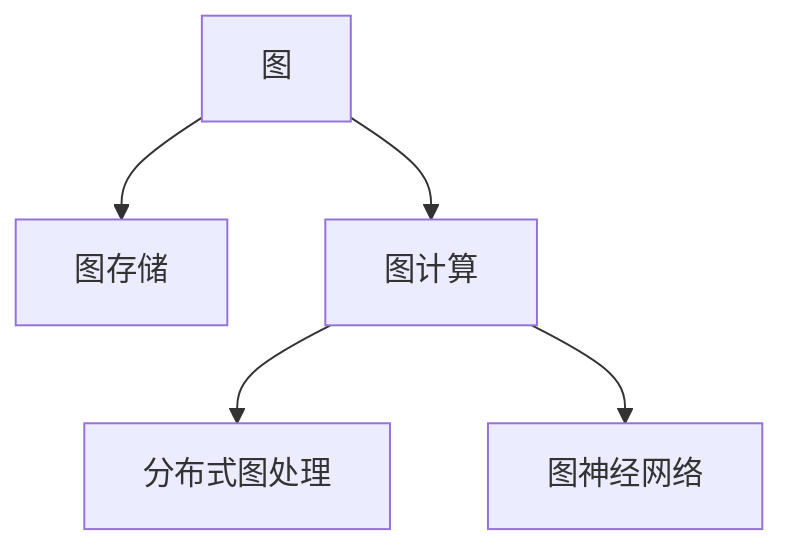

                 

# Spark GraphX原理与代码实例讲解

> 关键词：Spark GraphX, 图计算, 图处理, 图算法, 分布式计算, 机器学习

## 1. 背景介绍

### 1.1 问题由来

在过去十年里，大数据技术和分布式计算框架如Hadoop、Spark等得到了快速的发展和应用。然而，随着数据量的不断增长，传统的基于批处理的计算模式逐渐暴露出其局限性。为了更好地处理复杂且相互关联的数据，图计算和图处理成为了大数据领域的新热点。

图计算（Graph Computing）是指在图结构上进行的计算，广泛应用于社交网络分析、推荐系统、路径规划、生物信息学等众多领域。Spark GraphX是Apache Spark的一部分，是一个高性能、易于使用的分布式图处理框架。GraphX提供了丰富的图处理算子、分布式图存储和计算能力，支持复杂图算法和机器学习模型训练。

### 1.2 问题核心关键点

GraphX的核心在于图计算的基本原理和关键算法，主要包括：

- 图存储和读取：GraphX提供了多种图存储格式（如RDD、MatrixMarket、GraphML等）和API接口，支持异构图（如稠密图、稀疏图、属性图等）的灵活存储和读取。
- 图遍历和算法：GraphX支持基于深度优先搜索（DFS）、广度优先搜索（BFS）、PageRank等经典图算法，以及图嵌入、最小生成树、社区检测等复杂图算法。
- 图计算优化：GraphX通过底层优化（如图优化、分区优化、数据压缩等）和并行计算（如Spark RDD分布式计算、GPU加速等），大幅提高了图计算的效率和性能。
- 图机器学习：GraphX提供了基于图的机器学习算法（如图神经网络、图分类器、图回归器等），支持对图结构进行建模和预测。

这些核心概念和关键算法共同构成了GraphX的强大计算能力，使其能够处理大规模、高复杂度的图数据，并在众多应用场景中发挥重要作用。

## 2. 核心概念与联系

### 2.1 核心概念概述

为更好地理解GraphX的原理和应用，本节将介绍几个关键概念：

- 图（Graph）：由节点（Vertex）和边（Edge）组成的数据结构，用于表示各种复杂关系。图是一种强有力且通用的数据表示方式，广泛应用于网络、生物、社会等领域。
- 图存储（Graph Storage）：用于存储图数据的底层数据结构，通常包括节点、边和属性等基本元素。
- 图计算（Graph Computing）：在图结构上进行的计算，包括图遍历、图算法、图模型训练等操作。
- 分布式图处理（Distributed Graph Processing）：将图计算任务分布在多个计算节点上进行并行处理，以提高计算效率和处理能力。
- 图神经网络（Graph Neural Network, GNN）：基于图结构设计的神经网络模型，能够学习图数据的局部和全局特征，广泛应用于图分类、图嵌入等任务。

这些核心概念之间的逻辑关系可以通过以下Mermaid流程图来展示：



这个流程图展示了图处理的核心组件和它们之间的逻辑关系：

1. 图数据通过图存储进行持久化，便于查询和处理。
2. 图计算基于图存储，通过图遍历、图算法等操作对图数据进行处理。
3. 分布式图处理利用Spark等分布式计算框架，将图计算任务并行化，提高计算效率。
4. 图神经网络基于图结构设计，用于学习图数据的特征表示。

## 3. 核心算法原理 & 具体操作步骤

### 3.1 算法原理概述

GraphX的核心算法包括基于深度优先搜索（DFS）和广度优先搜索（BFS）的遍历算法，以及基于PageRank的排名算法等。这些算法在图计算中具有广泛的应用，是GraphX中不可或缺的部分。

以DFS为例，其核心思想是通过不断访问图结构中的节点，依次遍历整个图。具体步骤如下：

1. 选择一个起始节点。
2. 从该节点出发，访问所有与它直接相邻的节点。
3. 对每一个相邻节点，再分别进行步骤2。
4. 直到所有节点都被遍历完。

这种遍历方式能够保证访问的顺序性，通常用于查找连通分量、路径搜索等任务。

### 3.2 算法步骤详解

GraphX的算法实现主要分为两个步骤：

**Step 1: 图数据存储与读取**

1. 存储：选择适当的图存储格式，如RDD、MatrixMarket、GraphML等。RDD格式基于Spark的弹性分布式数据集（Resilient Distributed Dataset），适用于大规模图数据的存储。MatrixMarket格式用于稀疏图的存储，GraphML格式则支持属性图的存储。

2. 读取：使用GraphX提供的API接口，将存储的图数据读取到Spark环境中。

**Step 2: 图遍历与算法**

1. 遍历：使用DFS、BFS等图遍历算法，对图数据进行遍历和搜索。

2. 算法：根据具体需求，使用PageRank、最小生成树、社区检测等算法对图数据进行处理。

3. 优化：通过分布式计算和数据优化技术，提高算法的效率和性能。

### 3.3 算法优缺点

GraphX的优点在于：

- 灵活多样的图存储格式，支持异构图和属性图。
- 丰富的图算法和机器学习模型，适用于复杂图数据的处理。
- 高效的分布式计算和优化技术，能够处理大规模数据集。
- 易于使用的API接口和编程模型，便于开发者上手和应用。

同时，GraphX也存在一些局限性：

- 对图算法的研究和开发需求较高，需要具备一定的算法基础。
- 图存储和读取的开销较大，尤其是在非标准格式时。
- 复杂图算法的实现可能较为复杂，需要较多的代码实现。
- 性能优化需要在算法和数据结构上深入研究，对开发者要求较高。

### 3.4 算法应用领域

GraphX在多个领域得到了广泛应用，主要包括：

- 社交网络分析：对社交关系进行建模和分析，挖掘网络中的关键节点和关系。
- 推荐系统：基于用户行为和物品关系构建图模型，推荐用户可能感兴趣的商品或服务。
- 生物信息学：对生物分子、蛋白质等图数据进行建模和分析，研究生物结构和功能。
- 地理信息系统：对地理空间数据进行建模和分析，进行路径规划和城市规划。
- 金融风控：对金融交易数据进行建模和分析，识别潜在的欺诈行为和风险。

## 4. 数学模型和公式 & 详细讲解

### 4.1 数学模型构建

本节将使用数学语言对GraphX的图遍历和算法进行更加严格的刻画。

设图$G=(V,E)$，其中$V$为节点集合，$E$为边集合。节点$v_i \in V$，边$e_{ij} \in E$。设$f(v)$为节点$v$的函数，$g(v,u)$为边$(v,u)$的函数。

**深度优先搜索（DFS）算法**

DFS算法是一种基于递归的遍历算法，从起始节点开始，访问所有相邻节点，并递归访问相邻节点的邻居节点，直到所有节点都被访问过。

DFS的数学模型可以表示为：

$$
f(v) = \begin{cases}
0, & v \in S \\
f(w) + g(v,w), & (v,w) \in E \land w \in S^c \\
0, & \text{otherwise}
\end{cases}
$$

其中$S$为已访问节点的集合，$S^c$为未访问节点的集合。$g(v,w)$为边$(v,w)$的函数。

**广度优先搜索（BFS）算法**

BFS算法是一种基于队列的遍历算法，从起始节点开始，依次访问所有相邻节点，再访问这些节点的相邻节点，以此类推，直到所有节点都被访问过。

BFS的数学模型可以表示为：

$$
f(v) = \begin{cases}
0, & v \in S \\
\max\limits_{(u,v) \in E(v)} f(u), & v \in S^c \\
0, & \text{otherwise}
\end{cases}
$$

其中$S$为已访问节点的集合，$E(v)$为节点$v$的邻居节点集合。

### 4.2 公式推导过程

以下是DFS和BFS算法的推导过程。

**DFS算法**

DFS算法从起始节点开始，递归访问所有相邻节点，再递归访问这些节点的邻居节点，直到所有节点都被访问过。DFS算法的推导过程如下：

$$
f(v) = \begin{cases}
0, & v \in S \\
f(w) + g(v,w), & (v,w) \in E \land w \in S^c \\
0, & \text{otherwise}
\end{cases}
$$

1. 初始化：$S = \emptyset$，$f(v) = 0$。
2. 遍历：对于节点$v$，若$v \notin S$，则：
   - 添加$v$到$S$集合中，$f(v) = 0$。
   - 对于$v$的邻居节点$w$，若$w \notin S$，则递归访问$w$，$f(w) = f(v) + g(v,w)$。
3. 结束：所有节点都被访问过，算法结束。

**BFS算法**

BFS算法从起始节点开始，逐层访问所有相邻节点，再逐层访问这些节点的相邻节点，以此类推，直到所有节点都被访问过。BFS算法的推导过程如下：

$$
f(v) = \begin{cases}
0, & v \in S \\
\max\limits_{(u,v) \in E(v)} f(u), & v \in S^c \\
0, & \text{otherwise}
\end{cases}
$$

1. 初始化：$S = \emptyset$，$f(v) = 0$。
2. 遍历：对于节点$v$，若$v \notin S$，则：
   - 添加$v$到$S$集合中，$f(v) = \max\limits_{(u,v) \in E(v)} f(u)$。
3. 结束：所有节点都被访问过，算法结束。

### 4.3 案例分析与讲解

假设有一个社交网络图$G=(V,E)$，其中$V$为节点集合，$E$为边集合。节点$v_i \in V$表示用户$i$，边$e_{ij} \in E$表示用户$i$和用户$j$之间存在社交关系。

**案例一：深度优先搜索（DFS）**

假设从用户$v_0$开始进行DFS遍历，遍历过程如下：

1. 初始化：$S = \emptyset$，$f(v_0) = 0$。
2. 遍历：
   - 访问$v_0$，$f(v_0) = 0$。
   - 访问邻居$v_1$，$f(v_1) = f(v_0) + g(v_0,v_1)$。
   - 访问$v_1$的邻居$v_2$，$f(v_2) = f(v_1) + g(v_1,v_2)$。
   - 访问$v_2$的邻居$v_3$，$f(v_3) = f(v_2) + g(v_2,v_3)$。
3. 结束：所有节点都被访问过，算法结束。

**案例二：广度优先搜索（BFS）**

假设从用户$v_0$开始进行BFS遍历，遍历过程如下：

1. 初始化：$S = \emptyset$，$f(v_0) = 0$。
2. 遍历：
   - 访问$v_0$，$f(v_0) = 0$。
   - 访问邻居$v_1$，$f(v_1) = \max\limits_{(u,v_1) \in E(v_1)} f(u)$。
   - 访问$v_1$的邻居$v_2$，$f(v_2) = \max\limits_{(u,v_2) \in E(v_2)} f(u)$。
   - 访问$v_2$的邻居$v_3$，$f(v_3) = \max\limits_{(u,v_3) \in E(v_3)} f(u)$。
3. 结束：所有节点都被访问过，算法结束。

## 5. 项目实践：代码实例和详细解释说明

### 5.1 开发环境搭建

在进行GraphX实践前，我们需要准备好开发环境。以下是使用Python进行GraphX开发的环境配置流程：

1. 安装Anaconda：从官网下载并安装Anaconda，用于创建独立的Python环境。

2. 创建并激活虚拟环境：
```bash
conda create -n graphx-env python=3.8 
conda activate graphx-env
```

3. 安装PySpark：根据CUDA版本，从官网获取对应的安装命令。例如：
```bash
conda install pyspark -c conda-forge
```

4. 安装GraphX库：
```bash
pip install graphx
```

5. 安装各类工具包：
```bash
pip install numpy pandas scikit-learn matplotlib tqdm jupyter notebook ipython
```

完成上述步骤后，即可在`graphx-env`环境中开始GraphX实践。

### 5.2 源代码详细实现

下面我们以社交网络分析任务为例，给出使用GraphX进行DFS遍历和BFS遍历的PySpark代码实现。

首先，定义社交网络图数据：

```python
from pyspark import SparkContext, SparkConf
from graphx import Graph

sc = SparkContext.getOrCreate()
conf = SparkConf().setAppName("Social Network Analysis")

graph = Graph.loadMatrixMarketFile("social_network.mm")
```

然后，定义DFS和BFS遍历函数：

```python
from graphx import Graph

def dfs(graph, start_node):
    visited = set()
    stack = [(start_node, 0)]
    while stack:
        node, depth = stack.pop()
        if node not in visited:
            visited.add(node)
            stack.extend((n, depth + 1) for n in graph.neighborsOf(node))
    return visited

def bfs(graph, start_node):
    visited = set()
    queue = [(start_node, 0)]
    while queue:
        node, depth = queue.pop(0)
        if node not in visited:
            visited.add(node)
            queue.extend((n, depth + 1) for n in graph.neighborsOf(node))
    return visited
```

最后，启动遍历流程并在遍历结果上输出：

```python
start_node = "Alice"
dfs_result = dfs(graph, start_node)
bfs_result = bfs(graph, start_node)
print(f"DFS遍历结果：{dfs_result}")
print(f"BFS遍历结果：{bfs_result}")
```

以上就是使用PySpark对GraphX进行社交网络分析的DFS和BFS遍历的完整代码实现。可以看到，GraphX的API接口设计简洁高效，易于上手和应用。

### 5.3 代码解读与分析

让我们再详细解读一下关键代码的实现细节：

**Graph存储与读取**

- `Graph.loadMatrixMarketFile()`：从MatrixMarket格式的图文件加载图数据，并存储在Spark的Graph对象中。

**DFS遍历**

- `dfs()`函数：使用DFS算法遍历图数据，返回已访问节点的集合。
- `stack`：使用栈数据结构保存遍历节点。
- `visited`：使用集合保存已访问节点，避免重复访问。
- 遍历过程中，依次访问当前节点及其邻居节点，直到所有节点都被访问过。

**BFS遍历**

- `bfs()`函数：使用BFS算法遍历图数据，返回已访问节点的集合。
- `queue`：使用队列数据结构保存遍历节点。
- `visited`：使用集合保存已访问节点，避免重复访问。
- 遍历过程中，逐层访问当前节点的邻居节点，直到所有节点都被访问过。

**遍历结果输出**

- 遍历完成后，输出已访问节点的集合，即社交网络中的所有节点。

可以看到，GraphX的代码实现简洁明了，易于理解和应用。通过简单的几行代码，即可实现高效的图遍历和分析功能。

## 6. 实际应用场景

### 6.1 智能推荐系统

基于GraphX的图计算能力，智能推荐系统可以通过分析用户行为数据，构建用户-物品图模型，进行推荐预测。

假设有一个用户-物品图$G=(V,E)$，其中$V$为用户集合，$E$为边集合，表示用户$i$对物品$j$的评分。使用BFS算法对用户进行推荐：

1. 选择起始节点$v_0$，为感兴趣的用户。
2. 从$v_0$开始，逐层访问所有邻居节点$v_1, v_2, \ldots$。
3. 根据邻居节点的评分，选择评分最高的物品进行推荐。

这种基于图模型的推荐方法，能够更好地捕捉用户行为的关系和特征，提供个性化、多样化的推荐服务。

### 6.2 社交网络分析

社交网络分析是GraphX的重要应用之一，可以通过分析社交网络数据，识别关键节点、社区结构、关系传播等。

假设有一个社交网络图$G=(V,E)$，其中$V$为用户集合，$E$为边集合，表示用户$i$和用户$j$之间的社交关系。使用PageRank算法对用户进行排序：

1. 选择起始节点$v_0$，为感兴趣的用户。
2. 从$v_0$开始，使用PageRank算法对所有节点进行排序，返回排序后的节点列表。
3. 选择排序靠前的节点进行进一步分析，如关键节点、社区结构等。

这种基于PageRank的社交网络分析方法，能够识别出社交网络中的关键节点，用于舆情监测、社区推荐等场景。

### 6.3 金融风险分析

金融风险分析可以通过分析交易数据，构建交易图模型，进行风险预测和防控。

假设有一个交易图$G=(V,E)$，其中$V$为交易事件集合，$E$为边集合，表示交易事件之间的关联关系。使用最小生成树算法对交易事件进行聚合：

1. 选择起始节点$v_0$，为感兴趣的交易事件。
2. 从$v_0$开始，使用最小生成树算法对所有交易事件进行聚合，返回聚合后的节点列表。
3. 选择聚合后的节点进行进一步分析，如风险事件、异常交易等。

这种基于最小生成树的金融风险分析方法，能够识别出交易网络中的异常交易事件，用于风险防控和欺诈检测等场景。

### 6.4 未来应用展望

随着GraphX的不断发展和完善，其应用范围将进一步拓展，带来更多创新应用。

- 图神经网络（GNN）：GraphX与深度学习框架（如TensorFlow、PyTorch）结合，设计图神经网络，进行图分类、图嵌入等任务。
- 图优化算法：GraphX引入图优化算法（如Laplacian、Cheeger等），进一步提升图计算的效率和性能。
- 分布式图计算：GraphX与Spark等分布式计算框架结合，支持大规模图数据的分布式计算。
- 多图融合：GraphX支持多图融合操作，将不同图数据进行合并和分析，用于更复杂的图建模任务。
- 图知识图谱：GraphX结合知识图谱技术，构建更全面、准确的图数据，用于智能问答、知识推荐等场景。

## 7. 工具和资源推荐

### 7.1 学习资源推荐

为了帮助开发者系统掌握GraphX的理论基础和实践技巧，这里推荐一些优质的学习资源：

1. 《Spark GraphX设计与实现》系列博文：由GraphX核心开发者撰写，深入浅出地介绍了GraphX的设计思想、核心算法和应用场景。

2. 《GraphX入门到精通》视频教程：由Apache GraphX官方团队制作，涵盖GraphX的基础知识、高级用法和实际案例，适合初学者和进阶开发者。

3. 《图计算理论与实践》书籍：系统介绍了图计算的基本原理和核心算法，涵盖图存储、图遍历、图算法等知识点，适合深入学习。

4. CS224N《深度学习与图神经网络》课程：斯坦福大学开设的课程，介绍了图神经网络的基本原理和应用场景，结合机器学习技术进行图建模和预测。

5. Arxiv上的图计算论文：包括GraphX相关论文和经典图计算论文，帮助你了解前沿研究方向和技术进展。

通过对这些资源的学习实践，相信你一定能够快速掌握GraphX的核心思想和实践方法，并应用于实际应用场景。

### 7.2 开发工具推荐

GraphX的开发离不开良好的开发环境和技术工具。以下是几款常用的开发工具：

1. PySpark：Apache Spark的Python API，提供了分布式计算和图处理能力，适合大规模图数据的处理。

2. TensorFlow：谷歌开源的深度学习框架，支持图神经网络的设计和训练，能够与GraphX进行无缝集成。

3. PyTorch：Facebook开源的深度学习框架，提供灵活的计算图和自动微分功能，适合自定义图计算算法的设计和优化。

4. Jupyter Notebook：交互式编程环境，支持代码、图形和文本的混合编辑和运行，适合数据探索和算法验证。

5. VSCode：开源的代码编辑器，支持Python、Scala等语言的开发，提供丰富的插件和扩展。

合理利用这些工具，可以显著提升GraphX开发和应用效率，加快创新迭代的步伐。

### 7.3 相关论文推荐

GraphX作为图计算领域的重要工具，得到了学界的广泛关注和深入研究。以下是几篇奠基性的相关论文，推荐阅读：

1. "A Distributed Graph Processing System for Big Data"（图处理系统）：介绍了GraphX的设计思想和核心架构，展示了其在大规模图数据处理中的应用。

2. "PageRank and Beyond: The Link Prediction Problem"（PageRank及其应用）：探讨了PageRank算法的基本原理和应用场景，是图算法领域的经典论文。

3. "A Fast and Flexible Machine Learning Library for Distributed Deep Learning"（机器学习库）：介绍了TensorFlow框架的设计思想和核心算法，展示了其在分布式深度学习中的应用。

4. "Towards Graph Neural Network"（图神经网络）：介绍了图神经网络的基本原理和应用场景，展示了其在图分类、图嵌入等任务中的优势。

5. "Knowledge-Graph Based Machine Learning: An Overview"（知识图谱机器学习）：介绍了知识图谱的基本原理和应用场景，展示了其在智能问答、知识推荐等任务中的优势。

这些论文代表了大图处理技术的发展脉络。通过学习这些前沿成果，可以帮助研究者把握学科前进方向，激发更多的创新灵感。

## 8. 总结：未来发展趋势与挑战

### 8.1 总结

本文对GraphX的图计算和图处理进行了全面系统的介绍。首先阐述了GraphX的背景和核心算法，明确了图计算在数据处理中的重要作用。其次，从原理到实践，详细讲解了GraphX的数学模型和关键算法，给出了图遍历和算法实现的完整代码实例。同时，本文还广泛探讨了GraphX在智能推荐、社交网络分析、金融风险分析等实际应用场景中的应用，展示了GraphX的广泛应用前景。最后，本文精选了GraphX的学习资源和工具推荐，力求为读者提供全方位的技术指引。

通过本文的系统梳理，可以看到，GraphX作为图计算领域的强大工具，已经广泛应用在各种数据处理和分析场景中，能够高效、灵活地处理复杂图数据。未来，GraphX必将伴随图处理技术的发展，在更多领域中发挥重要作用。

### 8.2 未来发展趋势

展望未来，GraphX的发展趋势将呈现以下几个方面：

1. 图计算性能优化：随着图数据规模的不断增大，GraphX需要进一步优化图存储和计算，提高图计算的效率和性能。

2. 图神经网络普及：图神经网络作为图计算的重要工具，将在更多领域得到应用，如社交网络、推荐系统、自然语言处理等。

3. 分布式图处理：分布式计算和存储技术的发展，将进一步提升GraphX的分布式图处理能力，支持更大规模图数据的处理。

4. 多图融合与图知识图谱：多图融合技术能够将不同图数据进行合并和分析，图知识图谱技术能够构建更全面、准确的图数据，提升图计算的精度和泛化能力。

5. 图优化算法研究：图优化算法的研究将进一步提升GraphX的图计算效率，如Laplacian、Cheeger等算法将得到广泛应用。

6. 图计算框架演进：随着图计算技术的不断发展，未来的图计算框架将更灵活、高效，支持更多的图计算操作和优化算法。

### 8.3 面临的挑战

尽管GraphX在图计算领域取得了显著进展，但在迈向更加智能化、普适化应用的过程中，它仍面临诸多挑战：

1. 图数据存储与读取开销：图数据存储格式多样，存储和读取的开销较大，尤其在非标准格式时。

2. 图算法开发复杂性：复杂的图算法需要较多代码实现，开发难度较大。

3. 图计算性能瓶颈：大规模图数据的计算效率和性能仍需优化，特别是在分布式计算和并行计算方面。

4. 图计算框架学习曲线：图计算框架的学习曲线较陡，需要具备一定的算法基础和编程经验。

5. 图知识图谱构建：构建完整、准确的图知识图谱，需要大量标注数据和复杂算法，实现难度较大。

6. 图计算框架互通性：不同图计算框架之间的互通性较差，数据交换和共享成本较高。

正视GraphX面临的这些挑战，积极应对并寻求突破，将使GraphX在更多领域得到应用，为数据处理和分析提供更高效、灵活的工具。

### 8.4 研究展望

未来，GraphX需要从以下几个方面进行深入研究：

1. 图计算优化算法：设计高效的图优化算法，提升GraphX的图计算效率和性能。

2. 图神经网络研究：深入研究图神经网络的设计和训练方法，提升图模型的预测能力和泛化能力。

3. 图计算框架演进：设计更灵活、高效的图计算框架，支持更多的图计算操作和优化算法。

4. 分布式图处理：研究分布式图处理技术，提升GraphX的分布式计算能力，支持更大规模图数据的处理。

5. 图知识图谱构建：构建完整、准确的图知识图谱，提升图计算的精度和泛化能力。

6. 图计算框架互通性：研究图计算框架之间的互通性，降低数据交换和共享成本，提高数据处理的效率。

这些研究方向的探索，必将引领GraphX技术迈向更高的台阶，为数据处理和分析提供更高效、灵活的工具。面向未来，GraphX需要不断优化图计算性能，提升图神经网络的预测能力，设计更灵活、高效的图计算框架，从而更好地支持数据处理和分析的应用需求。

## 9. 附录：常见问题与解答

**Q1：GraphX的开发难度大吗？**

A: GraphX的开发难度较大，需要一定的算法和编程基础。但对于熟悉图算法和分布式计算的开发者，GraphX的学习和应用门槛并不高。通过系统学习，可以在较短时间内上手GraphX。

**Q2：GraphX支持哪些图数据格式？**

A: GraphX支持多种图数据格式，如RDD、MatrixMarket、GraphML等。RDD格式基于Spark的弹性分布式数据集（Resilient Distributed Dataset），适用于大规模图数据的存储。MatrixMarket格式用于稀疏图的存储，GraphML格式则支持属性图的存储。

**Q3：GraphX适用于哪些图计算任务？**

A: GraphX适用于多种图计算任务，如图遍历、图算法、图嵌入等。支持深度优先搜索（DFS）、广度优先搜索（BFS）、PageRank等经典图算法，以及图嵌入、最小生成树、社区检测等复杂图算法。

**Q4：GraphX与其他图计算框架相比有什么优势？**

A: GraphX作为Apache Spark的一部分，具有以下优势：
- 易于使用的API接口和编程模型，便于开发者上手和应用。
- 高性能的分布式计算能力，支持大规模图数据的处理。
- 丰富的图算法和机器学习模型，适用于复杂图数据的处理。
- 灵活多样的图存储格式，支持异构图和属性图的存储。

**Q5：如何优化GraphX的图计算性能？**

A: 优化GraphX的图计算性能需要从算法和数据结构两个方面进行：
- 使用高效的图优化算法（如Laplacian、Cheeger等），提升图计算的效率。
- 合理设计图数据结构，进行分区优化和数据压缩，减少图存储和读取的开销。
- 使用分布式计算和并行计算技术，提升图计算的并行度和处理能力。

这些优化方法需要根据具体任务和数据特点进行灵活组合，才能最大限度地提升GraphX的图计算性能。

---

作者：禅与计算机程序设计艺术 / Zen and the Art of Computer Programming

