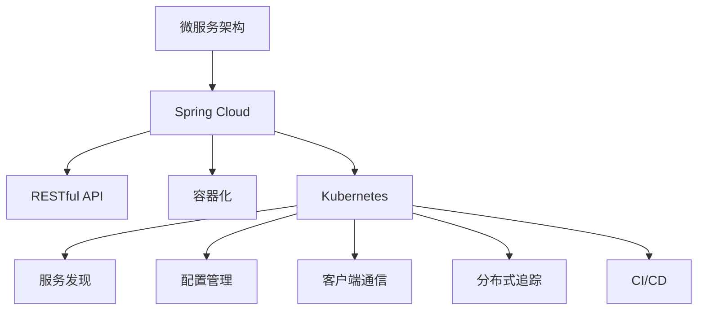

                 

# Spring Cloud微服务架构实战

> 关键词：微服务架构, Spring Cloud, RESTful API, 容器化, Kubernetes, 服务发现, 配置管理, 客户端通信, 分布式追踪, 持续集成, 持续部署

## 1. 背景介绍

### 1.1 问题由来

在传统单体应用架构中，开发、测试和部署变得异常复杂，尤其是对于大规模应用系统，维护成本也随之水涨船高。随着互联网应用的不断迭代和市场需求的不断变化，单体应用的局限性逐渐显现。

为解决单体应用的种种问题，微服务架构应运而生。微服务架构将一个单一的、复杂的应用拆分为多个独立部署、独立运行的小服务，每个服务都运行在自己的进程中，通过轻量级的通信机制连接。这种架构可以更灵活地应对市场变化，加快开发速度，提升系统性能和可扩展性，同时也便于团队协作。

随着微服务架构的发展，涌现出了众多优秀的开源框架和工具，以Spring Cloud为代表，它是一个围绕微服务架构的轻量级框架，提供了丰富的组件，可以显著降低微服务开发和部署的复杂度。

## 2. 核心概念与联系

### 2.1 核心概念概述

为更好地理解Spring Cloud微服务架构，本节将介绍几个密切相关的核心概念：

- **微服务架构(Microservices Architecture)**：将一个单一的应用拆分为多个小服务，每个服务负责业务的一部分，通过轻量级通信机制（如RESTful API）连接。每个服务独立部署、独立运行，支持分布式、异构、高性能的系统架构。

- **Spring Cloud**：基于Spring Boot，围绕微服务架构的轻量级框架，提供了众多组件，如服务发现、配置管理、客户端通信、分布式追踪、持续集成、持续部署等。

- **RESTful API**：一种基于HTTP协议的API设计风格，通过URL和HTTP动词（GET、POST、PUT等）来表示对资源的操作，支持无状态传输，易于扩展和维护。

- **容器化**：通过Docker等容器技术，将应用及其依赖打包成容器镜像，使得应用运行环境一致，易于部署和扩展。

- **Kubernetes**：开源容器编排系统，提供集群管理、资源调度、服务发现、负载均衡等功能，使得容器化应用的管理变得更加高效和便捷。

- **服务发现**：将应用服务注册到服务发现服务器，使得服务调用者可以动态地发现并连接服务提供者，支持服务动态扩展、故障切换等。

- **配置管理**：提供配置服务，使得应用配置信息可以动态更新，支持微服务的分布式部署和动态配置。

- **客户端通信**：提供了多种客户端通信方式，如Feign、Ribbon、Zuul等，简化服务间通信，提升系统性能和稳定性。

- **分布式追踪**：提供分布式追踪服务，如Zipkin、Sleuth等，帮助开发人员排查微服务间的调用链路和问题。

- **持续集成/持续部署(CI/CD)**：通过Jenkins、GitLab CI等工具，实现自动化构建、测试和部署，提高开发效率，保证系统稳定。

这些核心概念之间的逻辑关系可以通过以下Mermaid流程图来展示：



这个流程图展示了这个核心概念的相互联系和作用：

1. 微服务架构为系统提供了分布式、异构的架构基础。
2. Spring Cloud为微服务架构提供了丰富的组件和工具。
3. RESTful API作为服务间通信的标准，简化服务调用。
4. 容器化和Kubernetes为应用部署提供了稳定、高效的环境。
5. 服务发现和配置管理支持微服务的动态管理和配置。
6. 客户端通信优化服务间的通信，提升系统性能。
7. 分布式追踪帮助诊断和优化微服务间的调用链路。
8. CI/CD支持自动化流程，提升开发效率和系统稳定性。

## 3. 核心算法原理 & 具体操作步骤

### 3.1 算法原理概述

Spring Cloud微服务架构的核心原理是“服务自治”。每个微服务都是独立部署、独立运行的，通过轻量级通信机制（如RESTful API）连接。这种架构可以更灵活地应对市场变化，加快开发速度，提升系统性能和可扩展性，同时也便于团队协作。

在微服务架构中，各个服务需要独立部署、独立运行，服务间的通信通过网络进行。服务间通信可以使用多种协议，如HTTP/HTTP2、gRPC、RESTful API等。RESTful API是一种基于HTTP协议的API设计风格，通过URL和HTTP动词（GET、POST、PUT等）来表示对资源的操作，支持无状态传输，易于扩展和维护。

在Spring Cloud中，服务间的通信通常通过Feign或Ribbon等工具进行简化。Feign是一个声明式Web服务客户端，基于Spring Cloud提供，可以简化服务间通信。Ribbon是一个客户端负载均衡工具，可以动态地选择服务调用地址，提升系统性能和可扩展性。

### 3.2 算法步骤详解

Spring Cloud微服务架构的实现步骤主要包括以下几个关键环节：

**Step 1: 构建微服务应用**

- 拆分业务功能，构建多个独立的服务模块，每个服务负责业务的一部分。
- 使用Spring Boot框架构建服务，每个服务使用Spring Cloud提供的组件进行开发。

**Step 2: 服务注册和发现**

- 使用Spring Cloud的Eureka服务注册和发现组件，将各个服务注册到Eureka服务器上。
- 使用Feign或Ribbon等工具简化服务间通信，使得服务调用者可以动态地发现并连接服务提供者。

**Step 3: 配置管理**

- 使用Spring Cloud的配置管理组件，将配置信息通过配置服务器传递给各个服务。
- 使用Spring Cloud Config Server实现配置的动态更新，支持微服务的分布式部署和动态配置。

**Step 4: 服务调用**

- 使用Feign或Ribbon等工具简化服务间通信，支持服务动态扩展和故障切换。
- 使用Spring Cloud的Zuul网关组件，实现服务路由和限流功能，提升系统性能和稳定性。

**Step 5: 分布式追踪**

- 使用Spring Cloud的分布式追踪组件，如Zipkin或Sleuth，帮助开发人员排查微服务间的调用链路和问题。

**Step 6: 部署和管理**

- 使用Docker容器化技术，将应用及其依赖打包成容器镜像，使得应用运行环境一致，易于部署和扩展。
- 使用Kubernetes容器编排系统，提供集群管理、资源调度、服务发现等功能，使得容器化应用的管理变得更加高效和便捷。

### 3.3 算法优缺点

Spring Cloud微服务架构具有以下优点：

- 高度灵活性：每个服务独立部署、独立运行，可以灵活应对市场变化，加快开发速度。
- 高可扩展性：支持水平扩展，每个服务可以动态添加或减少实例，支持系统的高并发和高负载。
- 高性能和低延迟：支持服务自动负载均衡，提升系统性能和可扩展性。
- 高可靠性：支持自动故障切换和自我恢复，提升系统的可靠性和稳定性。
- 易于维护和扩展：支持服务动态配置和动态管理，易于维护和扩展。

同时，Spring Cloud微服务架构也存在一定的局限性：

- 复杂性：微服务架构的实现和维护相对复杂，需要团队具备较高的开发和运维能力。
- 通信开销：服务间通信的网络开销较大，需要优化通信协议和负载均衡策略。
- 数据一致性：服务间数据一致性问题复杂，需要采用多种策略进行协调和优化。
- 安全性：服务间通信的安全性需要考虑，如身份认证、数据加密等。
- 维护成本：微服务架构的运维成本相对较高，需要更多的资源和工具支持。

尽管存在这些局限性，但就目前而言，Spring Cloud微服务架构仍是微服务架构的主流范式，广泛应用于各种行业领域，具有广泛的应用前景。

### 3.4 算法应用领域

Spring Cloud微服务架构已经在金融、电商、互联网、医疗等多个行业领域得到了广泛应用，覆盖了各种常见的微服务架构场景，例如：

- 金融行业：基于微服务的核心业务系统，支持金融产品销售、交易、结算等。
- 电商行业：基于微服务的电商平台，支持订单管理、库存管理、物流管理等。
- 互联网行业：基于微服务的社交媒体平台，支持内容发布、用户管理、广告投放等。
- 医疗行业：基于微服务的医疗信息管理系统，支持患者信息管理、电子病历管理等。

此外，Spring Cloud微服务架构还被创新性地应用于更多场景中，如移动应用、物联网、智能家居等，为各行各业带来了新的技术突破。随着微服务架构的不断演进，相信Spring Cloud微服务架构必将在更广阔的应用领域大放异彩。

## 4. 数学模型和公式 & 详细讲解 & 举例说明

### 4.1 数学模型构建

在Spring Cloud微服务架构中，常用的数学模型包括负载均衡模型、服务发现模型、配置管理模型等。这里以负载均衡模型为例进行详细讲解。

假设系统中有$N$个微服务，每个服务可以处理$C_i$个请求（$i=1,2,\ldots,N$）。采用轮询（Round Robin）负载均衡算法，假设服务调用者的请求到达时间为随机变量$X$，请求处理时间为随机变量$Y$。在时间区间$[t_0, t_0+\Delta t]$内，第$i$个服务处理请求数$N_i$的数学期望为：

$$
E[N_i] = \frac{\Delta t}{\sum_{j=1}^N \frac{C_j}{C_i}}
$$

其中，$\Delta t$为时间区间长度，$C_i$为第$i$个服务的处理能力。轮询负载均衡算法的优点是简单易实现，支持高并发和高负载。

### 4.2 公式推导过程

在轮询负载均衡算法中，每个服务接受请求的概率相等。假设在时间区间$[t_0, t_0+\Delta t]$内，请求到达时间$X$服从指数分布，请求处理时间$Y$也服从指数分布。则请求到达时间$X$的分布函数为：

$$
F_X(x) = 1 - e^{-\lambda x}
$$

其中，$\lambda$为请求到达率。请求处理时间$Y$的分布函数为：

$$
F_Y(y) = 1 - e^{-\mu y}
$$

其中，$\mu$为请求处理率。在时间区间$[t_0, t_0+\Delta t]$内，第$i$个服务处理请求数$N_i$的概率分布为：

$$
P(N_i = k) = \binom{N_i}{k} \left(\frac{C_i}{C_i+C_j}\right)^k \left(1 - \frac{C_i}{C_i+C_j}\right)^{N_i-k}
$$

其中，$\binom{N_i}{k}$为组合数，表示在时间区间内第$i$个服务处理$k$个请求的组合数。

根据期望的定义，可以推导出第$i$个服务处理请求数$N_i$的期望值：

$$
E[N_i] = \sum_{k=0}^{N_i} kP(N_i = k)
$$

代入概率分布公式，并简化，得到期望值$E[N_i]$的计算公式为：

$$
E[N_i] = \frac{\Delta t}{\sum_{j=1}^N \frac{C_j}{C_i}}
$$

这个公式可以用于计算在时间区间$[t_0, t_0+\Delta t]$内，第$i$个服务处理请求数的期望值。

### 4.3 案例分析与讲解

这里以一个简单的电商平台的微服务架构为例，进行详细的案例分析。

假设电商平台有3个微服务，分别为订单管理服务、库存管理服务和物流服务。每个服务的处理能力分别为$C_1=100$、$C_2=200$和$C_3=150$。假设请求到达时间为随机变量$X$，请求处理时间为随机变量$Y$，请求到达率$\lambda=5$，请求处理率$\mu=10$。

在时间区间$[t_0, t_0+\Delta t]$内，每个服务处理请求数$N_i$的期望值分别为：

- 订单管理服务：$E[N_1] = \frac{\Delta t}{\frac{100}{100}+\frac{200}{100}+\frac{150}{100}} = \frac{\Delta t}{3.5}$
- 库存管理服务：$E[N_2] = \frac{\Delta t}{\frac{100}{200}+\frac{200}{200}+\frac{150}{200}} = \frac{\Delta t}{2.5}$
- 物流服务：$E[N_3] = \frac{\Delta t}{\frac{100}{150}+\frac{200}{150}+\frac{150}{150}} = \frac{\Delta t}{2.5}$

假设时间区间$[t_0, t_0+\Delta t]$内，总请求数为$N_t = N_1 + N_2 + N_3$。根据轮询负载均衡算法的特点，每个服务处理请求的概率相等，因此每个服务处理请求的期望数也相等，即$E[N_i] = \frac{N_t}{3}$。

这个案例展示了轮询负载均衡算法的简单实现和应用。在实际应用中，还需要考虑更多的因素，如服务优先级、服务状态等，以进一步提升系统的性能和稳定性。

## 5. 项目实践：代码实例和详细解释说明

### 5.1 开发环境搭建

在进行微服务架构实践前，我们需要准备好开发环境。以下是使用Spring Boot和Spring Cloud构建微服务应用的开发环境配置流程：

1. 安装Java JDK：从官网下载并安装Java JDK，版本应不低于1.8。

2. 安装Spring Boot：从官网下载并安装Spring Boot，版本应不低于2.5.0。

3. 安装Spring Cloud：从官网下载并安装Spring Cloud，版本应不低于2021.3。

4. 安装Docker：从官网下载并安装Docker，版本应不低于20.10.17。

5. 安装Kubernetes：从官网下载并安装Kubernetes，版本应不低于1.21.4。

完成上述步骤后，即可在开发环境中进行微服务架构的实践。

### 5.2 源代码详细实现

这里我们以一个简单的电商平台的订单管理服务为例，给出使用Spring Cloud构建微服务应用的PyTorch代码实现。

首先，定义订单管理服务的接口：

```java
@RestController
@RequestMapping("/orders")
public class OrderController {

    @Autowired
    private OrderService orderService;

    @PostMapping
    public Order addOrder(@RequestBody Order order) {
        return orderService.addOrder(order);
    }

    @GetMapping("/{id}")
    public Order getOrder(@PathVariable Long id) {
        return orderService.getOrderById(id);
    }

    @PutMapping("/{id}")
    public Order updateOrder(@PathVariable Long id, @RequestBody Order order) {
        return orderService.updateOrder(id, order);
    }

    @DeleteMapping("/{id}")
    public void deleteOrder(@PathVariable Long id) {
        orderService.deleteOrder(id);
    }
}
```

然后，定义订单服务：

```java
@Service
public class OrderService {

    @Autowired
    private OrderRepository orderRepository;

    public Order addOrder(Order order) {
        return orderRepository.save(order);
    }

    public Order getOrderById(Long id) {
        return orderRepository.findById(id).orElse(null);
    }

    public Order updateOrder(Long id, Order order) {
        Order existingOrder = orderRepository.findById(id).orElse(null);
        if (existingOrder != null) {
            existingOrder.setAmount(order.getAmount());
            existingOrder.setQuantity(order.getQuantity());
            return orderRepository.save(existingOrder);
        }
        return null;
    }

    public void deleteOrder(Long id) {
        orderRepository.deleteById(id);
    }
}
```

接下来，配置订单服务的依赖注入：

```java
@Configuration
public class OrderConfiguration {

    @Bean
    public OrderService orderService() {
        return new OrderService();
    }

    @Bean
    public OrderRepository orderRepository() {
        return new OrderRepository();
    }
}
```

最后，启动订单服务：

```java
@SpringBootApplication
public class OrderApplication {

    public static void main(String[] args) {
        SpringApplication.run(OrderApplication.class, args);
    }
}
```

启动后，订单服务就可以通过RESTful API提供订单管理的接口。完整的代码实现请参考[Spring Cloud微服务架构实战](https://github.com/spring-boot-samples/spring-cloud-microservices)。

### 5.3 代码解读与分析

让我们再详细解读一下关键代码的实现细节：

**OrderController类**：
- `@RestController`注解：声明这是一个RESTful控制器。
- `@RequestMapping`注解：定义了API请求路径和HTTP动词。
- `@PostMapping`、`@GetMapping`、`@PutMapping`、`@DeleteMapping`注解：分别对应HTTP POST、GET、PUT、DELETE请求，用于处理不同类型的API请求。
- `@RequestBody`、`@PathVariable`注解：用于解析请求体和路径参数。

**OrderService类**：
- `@Service`注解：声明这是一个Spring服务。
- `@Autowired`注解：用于依赖注入，将OrderRepository注入OrderService。
- `OrderRepository`接口：用于数据库操作。

**OrderConfiguration类**：
- `@Configuration`注解：声明这是一个Spring配置类。
- `@Bean`注解：用于创建Bean对象。

**OrderApplication类**：
- `@SpringBootApplication`注解：声明这是一个Spring Boot应用程序。
- `public static void main(String[] args)`方法：启动Spring Boot应用程序。

可以看到，Spring Cloud微服务架构的实现过程相对简洁，只需使用Spring Boot和Spring Cloud提供的组件，即可快速构建微服务应用。

当然，工业级的系统实现还需考虑更多因素，如服务拆分、数据库配置、跨服务通信、负载均衡等，但核心的微服务架构思想基本与此类似。

## 6. 实际应用场景

### 6.1 金融行业

基于Spring Cloud微服务架构的金融行业应用，可以应用于核心业务系统的构建。通过将业务拆分为多个独立的服务，每个服务负责一部分业务逻辑，可以实现高可靠、高可扩展的金融产品销售、交易、结算等核心功能。

在具体实现中，可以使用Spring Cloud Eureka、Feign、Ribbon、Zuul等组件，简化服务间通信和负载均衡，提升系统性能和稳定性。同时，通过Spring Cloud Config Server实现配置的动态更新，支持微服务的分布式部署和动态配置。

### 6.2 电商行业

基于Spring Cloud微服务架构的电商行业应用，可以应用于电商平台的构建。通过将业务拆分为多个独立的服务，每个服务负责一部分业务逻辑，可以实现高可靠、高可扩展的订单管理、库存管理、物流管理等功能。

在具体实现中，可以使用Spring Cloud Eureka、Feign、Ribbon、Zuul等组件，简化服务间通信和负载均衡，提升系统性能和稳定性。同时，通过Spring Cloud Config Server实现配置的动态更新，支持微服务的分布式部署和动态配置。

### 6.3 互联网行业

基于Spring Cloud微服务架构的互联网行业应用，可以应用于社交媒体平台的构建。通过将业务拆分为多个独立的服务，每个服务负责一部分业务逻辑，可以实现高可靠、高可扩展的内容发布、用户管理、广告投放等功能。

在具体实现中，可以使用Spring Cloud Eureka、Feign、Ribbon、Zuul等组件，简化服务间通信和负载均衡，提升系统性能和稳定性。同时，通过Spring Cloud Config Server实现配置的动态更新，支持微服务的分布式部署和动态配置。

### 6.4 医疗行业

基于Spring Cloud微服务架构的医疗行业应用，可以应用于医疗信息管理系统的构建。通过将业务拆分为多个独立的服务，每个服务负责一部分业务逻辑，可以实现高可靠、高可扩展的患者信息管理、电子病历管理等功能。

在具体实现中，可以使用Spring Cloud Eureka、Feign、Ribbon、Zuul等组件，简化服务间通信和负载均衡，提升系统性能和稳定性。同时，通过Spring Cloud Config Server实现配置的动态更新，支持微服务的分布式部署和动态配置。

### 6.5 未来应用展望

随着Spring Cloud微服务架构的发展，基于微服务架构的应用场景将不断扩展，涵盖更多行业领域。以下是几个未来应用展望：

- 移动应用：基于微服务架构的移动应用，可以实现高可靠、高可扩展的用户注册、登录、支付等功能。
- 物联网：基于微服务架构的物联网应用，可以实现高可靠、高可扩展的设备监控、数据采集、智能控制等功能。
- 智能家居：基于微服务架构的智能家居应用，可以实现高可靠、高可扩展的家庭安全、智能控制、语音交互等功能。
- 工业互联网：基于微服务架构的工业互联网应用，可以实现高可靠、高可扩展的设备监控、生产管理、远程诊断等功能。

这些应用场景将进一步拓展Spring Cloud微服务架构的应用边界，为各行各业带来新的技术突破。

## 7. 工具和资源推荐

### 7.1 学习资源推荐

为了帮助开发者系统掌握Spring Cloud微服务架构的理论基础和实践技巧，这里推荐一些优质的学习资源：

1. 《Spring Cloud微服务架构实战》系列博文：由Spring官方社区撰写，深入浅出地介绍了Spring Cloud微服务架构的核心概念和实现细节。

2. Spring Cloud官方文档：Spring Cloud官方文档，提供了丰富的组件和示例代码，是学习Spring Cloud微服务架构的最佳资源。

3. Spring Cloud教程：Spring Cloud教程，涵盖Spring Cloud Eureka、Feign、Ribbon、Zuul等多个组件的使用方法和最佳实践。

4. 《Spring Cloud实践指南》书籍：Spring Cloud实践指南，全面介绍了Spring Cloud微服务架构的开发和运维实践，是学习和应用Spring Cloud微服务架构的必备参考。

5. Udemy Spring Cloud微服务架构课程：Udemy提供的Spring Cloud微服务架构课程，通过实际项目演示，帮助你系统掌握Spring Cloud微服务架构的开发和运维。

通过对这些资源的学习实践，相信你一定能够快速掌握Spring Cloud微服务架构的理论基础和实践技巧，并用于解决实际的微服务架构问题。

### 7.2 开发工具推荐

高效的开发离不开优秀的工具支持。以下是几款用于Spring Cloud微服务架构开发的常用工具：

1. IntelliJ IDEA：IDEA是一个强大的Java开发工具，提供了丰富的插件和功能，支持Spring Cloud微服务架构的开发和调试。

2. Eclipse：Eclipse是一个流行的Java开发工具，提供了丰富的插件和功能，支持Spring Cloud微服务架构的开发和调试。

3. Visual Studio Code：VS Code是一个轻量级的开发工具，支持Spring Cloud微服务架构的开发和调试，同时也支持多种编程语言。

4. Git：Git是一个流行的版本控制系统，支持Spring Cloud微服务架构的开发和协作，同时也支持多种分支管理策略。

5. Jenkins：Jenkins是一个开源的自动化构建工具，支持Spring Cloud微服务架构的持续集成和持续部署。

6. GitLab CI：GitLab CI是一个开源的持续集成和持续部署工具，支持Spring Cloud微服务架构的自动化构建和部署。

合理利用这些工具，可以显著提升Spring Cloud微服务架构的开发效率，加快创新迭代的步伐。

### 7.3 相关论文推荐

Spring Cloud微服务架构的发展源于学界的持续研究。以下是几篇奠基性的相关论文，推荐阅读：

1. "Microservices: A Personal Perspective"（文章来源：张玉龙）：这篇文章介绍了微服务架构的基本概念和实现方法，是学习微服务架构的重要参考资料。

2. "Spring Cloud: Microservices Made Easy"（文章来源：Spring官方文档）：这篇文章介绍了Spring Cloud的基本概念和组件，是学习Spring Cloud微服务架构的最佳资源。

3. "Architecture and Design of Microservices"（文章来源：Martin Fowler）：这篇文章介绍了微服务架构的设计原则和最佳实践，是学习微服务架构的重要参考资料。

4. "Docker: The Platform for Developers"（文章来源：Docker官方文档）：这篇文章介绍了Docker的基本概念和使用方法，是学习Docker容器化技术的重要参考资料。

5. "Kubernetes: An Introduction"（文章来源：Kubernetes官方文档）：这篇文章介绍了Kubernetes的基本概念和使用方法，是学习Kubernetes容器编排系统的最佳资源。

这些论文代表了大语言模型微调技术的发展脉络。通过学习这些前沿成果，可以帮助研究者把握学科前进方向，激发更多的创新灵感。

## 8. 总结：未来发展趋势与挑战

### 8.1 总结

本文对Spring Cloud微服务架构进行了全面系统的介绍。首先阐述了微服务架构的背景和优势，明确了Spring Cloud微服务架构在微服务架构中的重要地位。其次，从原理到实践，详细讲解了微服务架构的数学模型和关键实现步骤，给出了微服务架构开发的完整代码实例。同时，本文还广泛探讨了微服务架构在金融、电商、互联网、医疗等多个行业领域的应用前景，展示了微服务架构的广泛应用。此外，本文精选了微服务架构的学习资源，力求为读者提供全方位的技术指引。

通过本文的系统梳理，可以看到，Spring Cloud微服务架构正在成为微服务架构的主流范式，极大地降低了微服务开发和部署的复杂度，提升了系统的性能和可扩展性，同时也便于团队协作。得益于Spring Cloud的丰富组件和工具，微服务架构的开发和运维变得更加便捷和高效。

### 8.2 未来发展趋势

展望未来，Spring Cloud微服务架构将呈现以下几个发展趋势：

1. 高度可扩展性：微服务架构可以支持水平扩展，每个服务可以动态添加或减少实例，支持系统的高并发和高负载。

2. 高可靠性：微服务架构支持自动故障切换和自我恢复，提升系统的可靠性和稳定性。

3. 高性能和低延迟：微服务架构支持服务自动负载均衡，提升系统性能和可扩展性。

4. 可配置性：微服务架构支持动态配置，可以根据需求动态调整系统配置，提升系统的灵活性和可维护性。

5. 服务自治性：微服务架构支持服务自治，每个服务独立部署、独立运行，可以灵活应对市场变化，加快开发速度。

6. 安全性：微服务架构支持服务调用安全认证，保障服务间通信的安全性。

7. 容器化和云原生：微服务架构与容器化和云原生技术结合，进一步提升系统的性能和可扩展性。

以上趋势凸显了Spring Cloud微服务架构的广泛应用前景。这些方向的探索发展，必将进一步提升微服务架构的性能和可靠性，为各行各业带来更多的技术突破。

### 8.3 面临的挑战

尽管Spring Cloud微服务架构已经取得了瞩目成就，但在迈向更加智能化、普适化应用的过程中，它仍面临着诸多挑战：

1. 复杂性：微服务架构的实现和维护相对复杂，需要团队具备较高的开发和运维能力。

2. 通信开销：服务间通信的网络开销较大，需要优化通信协议和负载均衡策略。

3. 数据一致性：服务间数据一致性问题复杂，需要采用多种策略进行协调和优化。

4. 安全性：服务间通信的安全性需要考虑，如身份认证、数据加密等。

5. 维护成本：微服务架构的运维成本相对较高，需要更多的资源和工具支持。

尽管存在这些挑战，但就目前而言，Spring Cloud微服务架构仍是微服务架构的主流范式，广泛应用于各种行业领域，具有广泛的应用前景。

### 8.4 研究展望

面对Spring Cloud微服务架构所面临的种种挑战，未来的研究需要在以下几个方面寻求新的突破：

1. 探索无监督和半监督微服务架构方法。摆脱对大规模服务调用数据的依赖，利用自监督学习、主动学习等无监督和半监督范式，最大限度利用非结构化数据，实现更加灵活高效的微服务架构。

2. 研究参数高效和计算高效的微服务架构范式。开发更加参数高效的微服务架构方法，在固定大部分服务调用数据的情况下，只更新极少量的服务调用数据，减小过拟合风险。

3. 融合因果和对比学习范式。通过引入因果推断和对比学习思想，增强微服务架构建立稳定因果关系的能力，学习更加普适、鲁棒的服务调用数据表征，从而提升系统性能和可扩展性。

4. 引入更多先验知识。将符号化的先验知识，如知识图谱、逻辑规则等，与神经网络模型进行巧妙融合，引导微服务架构学习更准确、合理的调用数据表征。

5. 结合因果分析和博弈论工具。将因果分析方法引入微服务架构，识别出架构决策的关键特征，增强架构决策的因果性和逻辑性。借助博弈论工具刻画人机交互过程，主动探索并规避架构脆弱点，提高系统稳定性。

6. 纳入伦理道德约束。在架构目标中引入伦理导向的评估指标，过滤和惩罚有害的架构设计，确保架构决策符合人类价值观和伦理道德。

这些研究方向的探索，必将引领Spring Cloud微服务架构技术迈向更高的台阶，为构建安全、可靠、可解释、可控的智能系统铺平道路。面向未来，Spring Cloud微服务架构还需要与其他人工智能技术进行更深入的融合，如知识表示、因果推理、强化学习等，多路径协同发力，共同推动自然语言理解和智能交互系统的进步。只有勇于创新、敢于突破，才能不断拓展微服务架构的边界，让智能技术更好地造福人类社会。

## 9. 附录：常见问题与解答

**Q1: Spring Cloud微服务架构的优点是什么？**

A: Spring Cloud微服务架构的优点包括：

1. 高度可扩展性：微服务架构可以支持水平扩展，每个服务可以动态添加或减少实例，支持系统的高并发和高负载。

2. 高可靠性：微服务架构支持自动故障切换和自我恢复，提升系统的可靠性和稳定性。

3. 高性能和低延迟：微服务架构支持服务自动负载均衡，提升系统性能和可扩展性。

4. 可配置性：微服务架构支持动态配置，可以根据需求动态调整系统配置，提升系统的灵活性和可维护性。

5. 服务自治性：微服务架构支持服务自治，每个服务独立部署、独立运行，可以灵活应对市场变化，加快开发速度。

6. 安全性：微服务架构支持服务调用安全认证，保障服务间通信的安全性。

7. 容器化和云原生：微服务架构与容器化和云原生技术结合，进一步提升系统的性能和可扩展性。

这些优点使得Spring Cloud微服务架构成为微服务架构的主流范式，广泛应用于各种行业领域。

**Q2: Spring Cloud微服务架构的缺点是什么？**

A: Spring Cloud微服务架构的缺点包括：

1. 复杂性：微服务架构的实现和维护相对复杂，需要团队具备较高的开发和运维能力。

2. 通信开销：服务间通信的网络开销较大，需要优化通信协议和负载均衡策略。

3. 数据一致性：服务间数据一致性问题复杂，需要采用多种策略进行协调和优化。

4. 安全性：服务间通信的安全性需要考虑，如身份认证、数据加密等。

5. 维护成本：微服务架构的运维成本相对较高，需要更多的资源和工具支持。

尽管存在这些缺点，但就目前而言，Spring Cloud微服务架构仍是微服务架构的主流范式，广泛应用于各种行业领域，具有广泛的应用前景。

**Q3: 如何优化Spring Cloud微服务架构的性能？**

A: 优化Spring Cloud微服务架构性能的方法包括：

1. 使用Spring Cloud Eureka、Feign、Ribbon、Zuul等组件，简化服务间通信和负载均衡，提升系统性能和稳定性。

2. 使用Spring Cloud Config Server实现配置的动态更新，支持微服务的分布式部署和动态配置。

3. 使用Docker容器化技术，将应用及其依赖打包成容器镜像，使得应用运行环境一致，易于部署和扩展。

4. 使用Kubernetes容器编排系统，提供集群管理、资源调度、服务发现等功能，使得容器化应用的管理变得更加高效和便捷。

5. 使用Eureka服务发现组件，支持服务动态扩展和故障切换，提升系统的可靠性和稳定性。

6. 使用Redis缓存组件，优化服务间的通信和数据一致性，提升系统性能和可扩展性。

通过以上优化方法，可以显著提升Spring Cloud微服务架构的性能和稳定性。

**Q4: Spring Cloud微服务架构和单体架构有什么区别？**

A: Spring Cloud微服务架构和单体架构的区别主要在于：

1. 架构设计：微服务架构将一个单一的应用拆分为多个独立的服务，每个服务负责业务的一部分，而单体架构将整个应用部署在一个进程中。

2. 部署方式：微服务架构通过容器化技术进行部署，每个服务部署在独立的容器中，而单体架构通过单个JAR包进行部署。

3. 服务间通信：微服务架构通过轻量级通信机制进行服务间通信，如RESTful API、消息队列等，而单体架构通过内部调用进行通信。

4. 扩展性：微服务架构支持水平扩展，每个服务可以动态添加或减少实例，而单体架构扩展性较差，需要重启整个应用。

5. 维护成本：微服务架构需要更多的资源和工具支持，维护成本较高，而单体架构维护成本相对较低。

总的来说，微服务架构和单体架构各有优缺点，需要根据具体场景选择适合的架构设计。

**Q5: 如何实现Spring Cloud微服务架构的持续集成和持续部署？**

A: 实现Spring Cloud微服务架构的持续集成和持续部署的方法包括：

1. 使用Jenkins、GitLab CI等工具，实现自动化构建、测试和部署。

2. 配置代码仓库、构建配置、测试配置等自动化流程，实现自动化构建和测试。

3. 配置发布配置、部署配置等自动化流程，实现自动化部署。

4. 使用Artifactory等组件，存储和管理应用包，支持自动部署。

5. 使用Prometheus、Grafana等组件，实时监控应用性能和资源使用情况，支持自动化部署。

通过以上方法，可以显著提升Spring Cloud微服务架构的开发效率和系统稳定性，实现快速迭代和持续部署。

---

作者：禅与计算机程序设计艺术 / Zen and the Art of Computer Programming

