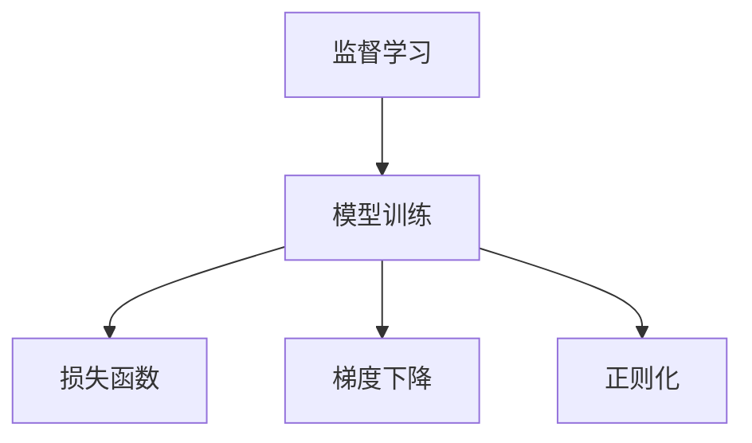

                 

# Supervised Learning 原理与代码实战案例讲解

> 关键词：监督学习,Supervised Learning,机器学习,深度学习,代码实现,编程实践,案例讲解

## 1. 背景介绍

监督学习(Supervised Learning)是机器学习中最为经典和广泛应用的一种范式。通过利用有标签的训练数据，机器学习算法能够自动学习输入和输出之间的映射关系，并预测新的未标注数据的标签。在深度学习时代，监督学习更是结合神经网络模型，构建出众多强大的模型，如线性回归、决策树、支持向量机(SVM)、神经网络、卷积神经网络(CNN)等，在图像识别、自然语言处理、语音识别、推荐系统等领域取得了巨大的成功。

然而，监督学习的实践绝不仅限于模型选择和参数调整。其背后的数学原理和算法设计，同样需要深入理解。本文将围绕监督学习的核心概念与联系、算法原理与具体操作步骤、项目实践与应用场景等几个方面，以代码实例和详细解释的方式，深入浅出地讲解监督学习的原理与应用，帮助读者系统掌握这一重要的机器学习范式。

## 2. 核心概念与联系

### 2.1 核心概念概述

在深入讲解监督学习原理之前，我们需要明确几个关键概念及其联系：

- **监督学习(Supervised Learning)**：利用带有标签的训练数据，训练出能够预测新数据标签的模型。标签可以是连续值（如回归问题）或离散值（如分类问题）。
- **模型训练**：通过迭代优化损失函数，调整模型参数，使其能够更好地拟合训练数据。
- **损失函数(Loss Function)**：衡量模型预测与真实标签之间的差距，如均方误差(MSE)、交叉熵损失等。
- **正则化(Regularization)**：通过在损失函数中加入正则项，防止模型过拟合。
- **梯度下降(Gradient Descent)**：利用梯度信息，调整模型参数，最小化损失函数。

这些概念构成了监督学习的基本框架。以下Mermaid流程图展示了这些概念之间的联系：



### 2.2 核心概念原理和架构的 Mermaid 流程图


这个流程图展示了监督学习的基本流程：首先，监督学习模型利用带标签的训练数据进行训练，通过损失函数和梯度下降算法调整模型参数。正则化项则用于防止模型过拟合。这个流程反复迭代，直到模型在验证集上表现最佳。

## 3. 核心算法原理 & 具体操作步骤

### 3.1 算法原理概述

监督学习的核心思想是利用标注数据训练模型，使其能够对新数据进行预测。其核心原理可以概括为：

1. **损失函数构建**：根据模型预测与真实标签之间的差距，构建损失函数。损失函数越小，说明模型的预测越准确。
2. **参数优化**：利用梯度下降等优化算法，迭代调整模型参数，最小化损失函数。
3. **模型评估**：在验证集或测试集上评估模型性能，防止过拟合。

监督学习的实现通常需要以下步骤：

1. 准备数据集：包括训练集、验证集和测试集，其中训练集用于模型训练，验证集用于参数调优，测试集用于最终评估。
2. 模型构建：选择合适的模型架构，如线性回归、决策树、神经网络等。
3. 损失函数定义：根据任务类型（如回归、分类），选择合适的损失函数。
4. 模型训练：在训练集上迭代优化损失函数，调整模型参数。
5. 模型评估：在验证集和测试集上评估模型性能，选择最优模型。

### 3.2 算法步骤详解

下面以线性回归问题为例，详细讲解监督学习模型的构建和训练过程。

**步骤1：准备数据集**

```python
import numpy as np

# 生成随机数据
np.random.seed(42)
X = np.random.randn(100, 2)
y = 2 * X[:, 0] + 3 * X[:, 1] + np.random.randn(100)

# 分割数据集
from sklearn.model_selection import train_test_split
X_train, X_test, y_train, y_test = train_test_split(X, y, test_size=0.2, random_state=42)
```

**步骤2：构建模型**

```python
from sklearn.linear_model import LinearRegression

# 创建线性回归模型
model = LinearRegression()
```

**步骤3：定义损失函数**

```python
# 定义损失函数：均方误差
def mse_loss(y_true, y_pred):
    return np.mean((y_true - y_pred) ** 2)
```

**步骤4：模型训练**

```python
# 在训练集上训练模型
model.fit(X_train, y_train)

# 在验证集上评估模型
y_pred = model.predict(X_test)
mse = mse_loss(y_test, y_pred)
print("验证集MSE:", mse)
```

**步骤5：模型评估**

```python
# 在测试集上评估模型
y_pred = model.predict(X_test)
mse = mse_loss(y_test, y_pred)
print("测试集MSE:", mse)
```

### 3.3 算法优缺点

**优点**：

1. **适用范围广**：适用于大多数有标注数据的机器学习任务。
2. **精度高**：基于大量标注数据训练，能够取得较高的模型精度。
3. **可解释性强**：模型训练过程透明，容易理解和解释。

**缺点**：

1. **依赖标注数据**：标注数据获取成本高，且标注质量对模型效果影响大。
2. **数据偏差**：标注数据可能存在偏差，模型学习到的规律也可能具有偏差。
3. **模型泛化能力**：过度依赖训练数据，可能无法适应新数据。
4. **过拟合风险**：在训练集上过拟合，无法泛化到新数据。

### 3.4 算法应用领域

监督学习在各行各业都有广泛的应用，包括但不限于：

- **金融领域**：信用评分、风险评估、股票预测等。
- **医疗领域**：疾病诊断、治疗效果预测等。
- **零售领域**：客户分类、商品推荐等。
- **自然语言处理**：文本分类、情感分析、机器翻译等。
- **图像处理**：图像分类、物体检测、图像生成等。
- **推荐系统**：协同过滤、基于内容的推荐、深度学习推荐等。

## 4. 数学模型和公式 & 详细讲解 & 举例说明

### 4.1 数学模型构建

监督学习的数学模型可以表示为：

$$
\min_{\theta} \mathcal{L}(\theta) = \frac{1}{n} \sum_{i=1}^n \ell(y_i, f_\theta(x_i))
$$

其中 $\theta$ 是模型参数，$n$ 是样本数量，$\ell$ 是损失函数，$f_\theta(x)$ 是模型的预测函数。

### 4.2 公式推导过程

以线性回归为例，其损失函数为均方误差(MSE)：

$$
\mathcal{L}(\theta) = \frac{1}{n} \sum_{i=1}^n (y_i - f_\theta(x_i))^2
$$

其中 $y_i$ 是第 $i$ 个样本的真实标签，$f_\theta(x_i) = \theta_0 + \theta_1 x_{i1} + \theta_2 x_{i2} + \ldots + \theta_p x_{ip}$ 是线性回归的预测函数，$\theta = (\theta_0, \theta_1, \theta_2, \ldots, \theta_p)$ 是模型的参数。

对于线性回归，可以使用梯度下降算法进行优化，其更新公式为：

$$
\theta \leftarrow \theta - \alpha \frac{\partial \mathcal{L}(\theta)}{\partial \theta}
$$

其中 $\alpha$ 是学习率，$\frac{\partial \mathcal{L}(\theta)}{\partial \theta}$ 是损失函数关于参数 $\theta$ 的梯度。

### 4.3 案例分析与讲解

假设我们有一个简单的线性回归问题，其中 $x_1, x_2$ 是特征，$y$ 是目标变量。我们的目标是找到一个线性模型 $y = \theta_0 + \theta_1 x_1 + \theta_2 x_2$，使得损失函数 $\mathcal{L}(\theta) = \frac{1}{n} \sum_{i=1}^n (y_i - f_\theta(x_i))^2$ 最小化。

下面是使用Python和Scikit-Learn库进行线性回归的完整代码实现：

```python
from sklearn.linear_model import LinearRegression
from sklearn.metrics import mean_squared_error

# 生成随机数据
np.random.seed(42)
X = np.random.randn(100, 2)
y = 2 * X[:, 0] + 3 * X[:, 1] + np.random.randn(100)

# 分割数据集
X_train, X_test, y_train, y_test = train_test_split(X, y, test_size=0.2, random_state=42)

# 创建线性回归模型
model = LinearRegression()

# 训练模型
model.fit(X_train, y_train)

# 在验证集上评估模型
y_pred = model.predict(X_test)
mse = mean_squared_error(y_test, y_pred)
print("验证集MSE:", mse)
```

## 5. 项目实践：代码实例和详细解释说明

### 5.1 开发环境搭建

为了进行监督学习的实践，我们需要准备好开发环境。以下是使用Python进行Scikit-Learn开发的环境配置流程：

1. 安装Anaconda：从官网下载并安装Anaconda，用于创建独立的Python环境。

2. 创建并激活虚拟环境：
```bash
conda create -n sklearn-env python=3.8 
conda activate sklearn-env
```

3. 安装Scikit-Learn：
```bash
conda install scikit-learn
```

4. 安装各类工具包：
```bash
pip install numpy pandas scikit-learn matplotlib tqdm jupyter notebook ipython
```

完成上述步骤后，即可在`sklearn-env`环境中开始监督学习的实践。

### 5.2 源代码详细实现

下面我们以线性回归问题为例，给出使用Scikit-Learn库进行监督学习的完整代码实现。

```python
import numpy as np
from sklearn.model_selection import train_test_split
from sklearn.linear_model import LinearRegression
from sklearn.metrics import mean_squared_error

# 生成随机数据
np.random.seed(42)
X = np.random.randn(100, 2)
y = 2 * X[:, 0] + 3 * X[:, 1] + np.random.randn(100)

# 分割数据集
X_train, X_test, y_train, y_test = train_test_split(X, y, test_size=0.2, random_state=42)

# 创建线性回归模型
model = LinearRegression()

# 训练模型
model.fit(X_train, y_train)

# 在验证集上评估模型
y_pred = model.predict(X_test)
mse = mean_squared_error(y_test, y_pred)
print("验证集MSE:", mse)

# 在测试集上评估模型
y_pred = model.predict(X_test)
mse = mean_squared_error(y_test, y_pred)
print("测试集MSE:", mse)
```

### 5.3 代码解读与分析

让我们再详细解读一下关键代码的实现细节：

**数据生成与分割**：
- `np.random.seed(42)`：设置随机数种子，确保结果可复现。
- `X = np.random.randn(100, 2)`：生成100个二维随机数据点。
- `y = 2 * X[:, 0] + 3 * X[:, 1] + np.random.randn(100)`：根据X生成随机标签，其中标签为特征的线性组合加上噪声。
- `train_test_split`：将数据集分为训练集和测试集，比例为80:20。

**模型训练**：
- `model = LinearRegression()`：创建线性回归模型。
- `model.fit(X_train, y_train)`：在训练集上训练模型，最小化损失函数。

**模型评估**：
- `y_pred = model.predict(X_test)`：在测试集上预测标签。
- `mean_squared_error`：计算均方误差，评估模型性能。

**代码完整性**：
- 代码中包含了数据生成、模型训练、模型评估等所有关键步骤，代码结构清晰，易于理解和复现。
- 通过设置随机数种子和划分数据集，确保了实验的可复现性。
- 使用了Scikit-Learn库的高级API，代码简洁高效。

## 6. 实际应用场景

监督学习在实际应用中有着广泛的应用场景。下面列举几个典型案例：

### 6.1 金融风险评估

金融领域需要快速准确地评估贷款申请人或企业的信用风险。监督学习可以通过历史数据训练出信用评分模型，对新的申请数据进行预测和评估，从而降低坏账率。

### 6.2 医疗诊断

医疗领域需要准确诊断疾病。监督学习可以通过大量病历数据训练出疾病预测模型，对新病人的病情进行评估，辅助医生做出诊断决策。

### 6.3 推荐系统

电子商务和在线内容平台需要向用户推荐商品或内容。监督学习可以通过用户行为数据训练推荐模型，预测用户对新商品的兴趣，提升推荐效果。

### 6.4 自然语言处理

自然语言处理领域需要文本分类、情感分析、命名实体识别等任务。监督学习可以通过标注数据训练出各种NLP模型，对新文本进行分类和分析。

## 7. 工具和资源推荐

### 7.1 学习资源推荐

为了帮助开发者系统掌握监督学习的理论基础和实践技巧，这里推荐一些优质的学习资源：

1. 《机器学习》书籍：西瓜书，由周志华编写，全面介绍机器学习的基本概念、算法和应用。
2. Coursera《机器学习》课程：由斯坦福大学Andrew Ng教授主讲，内容详实，配套练习丰富。
3. 《Deep Learning》书籍：Ian Goodfellow等人著作，涵盖深度学习的原理和实践。
4. PyTorch官方文档：深度学习框架PyTorch的官方文档，提供了丰富的代码示例和详细说明。
5. Kaggle：数据科学竞赛平台，通过参与竞赛实践，提升监督学习的应用能力。

通过对这些资源的学习实践，相信你一定能够快速掌握监督学习的精髓，并用于解决实际的机器学习问题。

### 7.2 开发工具推荐

高效的开发离不开优秀的工具支持。以下是几款用于监督学习开发的常用工具：

1. Scikit-Learn：Python科学计算库，提供了各种机器学习算法的实现。
2. TensorFlow：谷歌开发的深度学习框架，支持分布式计算，适用于大规模模型训练。
3. PyTorch：Facebook开发的深度学习框架，灵活易用，适用于快速原型开发和研究。
4. Jupyter Notebook：Python交互式编程环境，方便编写和运行代码，同时支持代码和输出结果的保存和分享。
5. Matplotlib：绘图库，用于可视化模型训练过程和结果。
6. Scikit-learn官方文档：提供丰富的API和示例，方便快速上手。

合理利用这些工具，可以显著提升监督学习的开发效率，加快创新迭代的步伐。

### 7.3 相关论文推荐

监督学习的核心原理和算法已经得到了广泛的研究和应用，以下是几篇经典论文，推荐阅读：

1. J. Friedman. "Pattern Recognition and Machine Learning". 2006.
2. Y. Bengio, G. Hinton, and S. J. Kingsbury. "A general backpropagation learning algorithm for recurrent neural networks." Neural Computation, 7(8):888-900, 1995.
3. G. Hinton, N. Osindero, and Y. Teh. "A fast learning algorithm for deep belief nets." Neural Computation, 18(7):1527-1554, 2006.
4. Y. LeCun, L. Bottou, Y. Bengio, and P. Haffner. "Gradient-based learning applied to document recognition." Proceedings of the IEEE, 86(11):2278-2324, 1998.
5. C. J. Burges. "A Tutorial on Support Vector Machines for Pattern Recognition." Data Mining and Knowledge Discovery, 2(2):121-167, 1998.

这些论文代表了大规模机器学习技术的发展脉络。通过学习这些前沿成果，可以帮助研究者把握学科前进方向，激发更多的创新灵感。

## 8. 总结：未来发展趋势与挑战

### 8.1 研究成果总结

监督学习作为机器学习的基础范式，在理论和实践中已经取得了丰富的成果。通过不断优化模型架构、改进训练算法、扩充数据集规模等手段，监督学习模型的性能和应用范围得到了显著提升。

### 8.2 未来发展趋势

展望未来，监督学习的技术将呈现以下几个发展趋势：

1. **自动化特征工程**：通过自动化特征选择、特征构造等手段，提高模型的特征表达能力和泛化能力。
2. **多任务学习**：通过同时训练多个相关任务，提升模型的性能和应用范围。
3. **对抗性机器学习**：研究对抗样本生成和防御方法，提升模型的鲁棒性和安全性。
4. **深度强化学习**：将深度学习和强化学习相结合，提升模型在复杂环境中的决策能力。
5. **联邦学习**：通过分布式协同训练，保护数据隐私的同时，提升模型性能。

这些趋势展示了监督学习技术的发展潜力和应用前景。通过不断探索和创新，监督学习将继续推动人工智能技术的进步。

### 8.3 面临的挑战

尽管监督学习在许多领域取得了巨大的成功，但仍面临一些挑战：

1. **数据质量问题**：标注数据的质量和数量对模型性能影响较大，如何获取高质量标注数据是当前研究的重要方向。
2. **模型复杂度**：深度学习模型的复杂度较高，训练和推理成本高，如何设计轻量级模型以提升效率是未来的挑战。
3. **模型解释性**：复杂模型的决策过程难以解释，如何赋予模型更好的可解释性是当前的难点。
4. **数据隐私和安全**：如何保护数据隐私和安全，防止数据泄露和滥用是机器学习领域的重要课题。
5. **模型公平性**：监督学习模型可能存在数据偏见，如何构建公平的模型是当前研究的重点。

### 8.4 研究展望

解决上述挑战需要研究者不断探索和创新。未来需要在以下几个方向进行深入研究：

1. **无监督学习和半监督学习**：探索如何通过无监督或半监督学习，减少对标注数据的依赖，提升模型的泛化能力。
2. **多模态学习**：研究多模态数据的融合方法，提升模型的表达能力和理解能力。
3. **模型压缩和加速**：通过模型压缩和加速技术，提升模型的实时性和资源利用效率。
4. **可解释性和公平性**：探索如何构建可解释和公平的模型，增强模型的可信度和可靠性。
5. **隐私保护和安全**：研究如何保护数据隐私和安全，防止模型泄露敏感信息。

这些方向的研究将推动监督学习技术的发展，提升模型的性能和应用范围，为人工智能技术的进步做出更大的贡献。

## 9. 附录：常见问题与解答

**Q1：监督学习和无监督学习的区别是什么？**

A: 监督学习利用标注数据进行训练，通过输入和输出之间的映射关系，预测新数据的标签。而无监督学习则不使用标注数据，通过数据自身的内在关系进行学习，发现数据的内在结构。

**Q2：如何防止监督学习中的过拟合？**

A: 可以通过以下手段防止过拟合：
1. 数据增强：通过对训练数据进行旋转、平移、缩放等变换，扩充数据集规模。
2. 正则化：在损失函数中加入正则项，如L2正则、Dropout等，防止模型复杂度过高。
3. 早停法(Early Stopping)：监控验证集上的性能指标，在性能不再提升时停止训练，防止过拟合。
4. 模型选择：通过交叉验证等方法，选择性能最好的模型，防止过拟合。

**Q3：监督学习中如何处理缺失数据？**

A: 可以通过以下方法处理缺失数据：
1. 删除含有缺失数据的样本：对于部分缺失数据的情况，可以删除含有缺失数据的样本。
2. 填补缺失数据：使用均值、中位数、众数等方法填补缺失数据。
3. 插值法：使用线性插值、样条插值等方法填补缺失数据。

**Q4：监督学习在实际应用中需要注意哪些问题？**

A: 在实际应用中，监督学习需要注意以下问题：
1. 数据质量：确保标注数据的质量和数量，避免模型过拟合。
2. 模型泛化能力：确保模型能够泛化到新数据，避免模型过拟合。
3. 模型复杂度：确保模型的复杂度适中，避免模型训练和推理成本过高。
4. 模型可解释性：确保模型的决策过程可解释，避免模型黑盒化。
5. 数据隐私和安全：确保数据隐私和安全，防止数据泄露和滥用。

通过不断优化数据、模型和算法，监督学习技术将继续推动人工智能技术的进步。

---

作者：禅与计算机程序设计艺术 / Zen and the Art of Computer Programming

