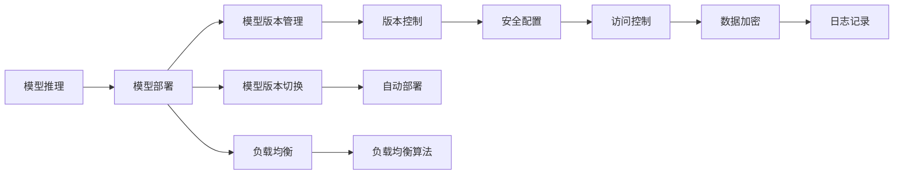

                 

# TensorFlow Serving模型部署

> 关键词：TensorFlow Serving, 模型部署, 机器学习, 模型推理, 计算优化, 服务器架构, 微服务, 模型版本管理, 模型版本切换, 负载均衡, 安全性, 模型更新

## 1. 背景介绍

在现代机器学习应用中，模型部署（Model Deployment）是一个至关重要的环节，它将训练好的模型转化为能够进行实时或批量推理的服务。随着深度学习和人工智能应用的不断发展，对模型部署的要求也在不断提高，特别是在模型规模越来越大、需要处理的数据量和并发量也在不断增加的背景下，传统的模型部署方式已经不能满足需求。

TensorFlow Serving 是 Google 开源的一个用于快速部署和高效推理 TensorFlow 模型的服务器架构，它支持多种模型格式，并提供了一组灵活的 API 和工具，可以轻松地实现模型的部署和更新，从而支持大规模的生产环境应用。

本文将深入介绍 TensorFlow Serving 的基本概念、核心原理、以及其在新兴的云原生环境中的应用场景，并结合实际案例，探讨其模型部署的最佳实践。

## 2. 核心概念与联系

### 2.1 核心概念概述

为了更好地理解 TensorFlow Serving 的原理和工作方式，我们先定义一些核心概念：

- **TensorFlow Serving**：一个专门用于部署和推理 TensorFlow 模型的服务器架构。它提供了模型版本管理、模型版本切换、负载均衡等功能，可以轻松实现模型的快速部署和高效推理。
- **模型推理**：将训练好的模型应用于新的数据，进行预测或分类的过程。
- **模型版本管理**：在生产环境中，模型版本不断更新，管理这些版本，确保正确的模型被用于推理，是模型部署的重要组成部分。
- **模型版本切换**：当新的模型版本可用时，如何安全、高效地进行切换，避免对生产系统造成影响。
- **负载均衡**：在多个模型服务器之间均匀分配请求，提高系统的吞吐量和可用性。
- **安全性**：确保模型在生产环境中的安全性和隐私保护，防止未授权访问和恶意攻击。
- **云原生**：指基于云平台构建的、采用微服务架构和容器化部署的模型服务。

这些核心概念通过以下 Mermaid 流程图连接起来，展示它们之间的关系：



这个流程图展示模型推理与模型部署的关联，模型部署包括模型版本管理、版本切换、负载均衡等关键功能，而版本控制、安全配置、数据加密、日志记录等则是对模型部署的具体支持。

## 3. 核心算法原理 & 具体操作步骤

### 3.1 算法原理概述

TensorFlow Serving 的核心算法原理主要包括以下几个方面：

- **模型加载**：将模型加载到内存中，并进行必要的优化。
- **请求处理**：接收请求，并将请求分发给相应的模型进行推理。
- **结果返回**：将推理结果返回给客户端，并记录日志和性能指标。

这些过程是通过 TensorFlow Serving 的 RESTful API 实现的。

### 3.2 算法步骤详解

TensorFlow Serving 的模型部署可以分为以下几个步骤：

1. **模型训练和保存**：使用 TensorFlow 训练模型，并保存为 TensorFlow Serving 支持的格式，如 SavedModel。
2. **模型版本管理**：将保存好的模型上传到版本控制系统中，记录模型的版本信息。
3. **模型加载和优化**：在 TensorFlow Serving 服务器上加载模型，并进行必要的优化，如预热（Warm-up）和剪枝（Pruning）。
4. **请求路由和推理**：接收客户端请求，根据负载均衡算法，将请求路由到合适的模型实例进行推理。
5. **结果返回和日志记录**：将推理结果返回给客户端，同时记录日志和性能指标，用于监控和故障排除。

### 3.3 算法优缺点

TensorFlow Serving 的优点包括：

- **高性能推理**：支持多种模型格式，如 SavedModel、ONNX、GraphDef 等，可高效处理大规模推理任务。
- **灵活的模型管理**：支持模型版本管理、模型版本切换、模型加载优化等功能，可以轻松管理多个模型的推理。
- **可扩展性**：采用微服务架构，支持水平扩展，可以轻松应对高并发场景。

其缺点包括：

- **学习曲线陡峭**：初次使用 TensorFlow Serving 可能需要一定学习曲线，熟悉其 API 和配置需要一定时间。
- **资源消耗较大**：由于服务器需要加载和优化模型，资源消耗较大，特别是在推理量较小的情况下。

### 3.4 算法应用领域

TensorFlow Serving 主要应用于以下领域：

- **实时推荐系统**：推荐引擎需要快速响应用户请求，TensorFlow Serving 可以提供高效推理能力。
- **图像和语音识别**：这些领域需要大量模型进行推理，TensorFlow Serving 可以提供高效的模型管理和推理能力。
- **智能运维**：系统监控和故障检测需要快速处理大量数据，TensorFlow Serving 可以提供高性能推理能力。

## 4. 数学模型和公式 & 详细讲解 & 举例说明

### 4.1 数学模型构建

TensorFlow Serving 的核心是模型推理，我们以图像分类为例，构建一个简单的数学模型。假设模型接受一个 $h \times w \times c$ 的输入图像 $x$，输出一个 $n$ 维的向量 $y$，模型公式为：

$$ y = f(x; \theta) $$

其中 $f$ 是模型函数，$\theta$ 是模型参数。

### 4.2 公式推导过程

模型函数的计算过程如下：

1. **输入预处理**：将输入图像 $x$ 进行归一化、标准化等预处理操作。
2. **特征提取**：使用卷积神经网络（CNN）等深度学习模型，将输入图像提取为特征向量 $h$。
3. **分类器推理**：将特征向量 $h$ 输入到全连接神经网络或卷积神经网络分类器中，得到输出向量 $y$。
4. **激活函数**：对输出向量 $y$ 应用激活函数，如 sigmoid 或 softmax，得到最终的分类结果。

公式表示如下：

$$ y = \sigma(f(x; \theta)) $$

其中 $\sigma$ 是激活函数。

### 4.3 案例分析与讲解

以 TensorFlow 中的 Inception V3 模型为例，其推理过程如下：

1. **输入预处理**：对输入图像进行标准化处理，使每个像素值在 $[-1, 1]$ 范围内。
2. **特征提取**：使用 Inception V3 模型，将输入图像提取为 2048 维的特征向量。
3. **分类器推理**：将特征向量输入到全连接层中，得到 1024 维的输出向量 $y$。
4. **激活函数**：对输出向量应用 softmax 激活函数，得到最终的分类结果。

模型推理代码如下：

```python
import tensorflow as tf
import tensorflow_serving.apis as apis
import tensorflow_serving.apis.prediction_service_pb2_grpc as prediction_service_pb2_grpc

def load_model(model_path):
    model = tf.keras.models.load_model(model_path)
    return model

def predict(model, inputs):
    preds = model.predict(inputs)
    return preds

def serve(model, port):
    server = prediction_service_pb2_grpc.PredictionServiceServicer()

    def predict_server(prediction_request, context):
        inputs = prediction_request.inputs['images'].tensor
        preds = predict(model, inputs)
        return prediction_pb2.PredictionResponse(
            outputs={'labels': preds[0]}
        )

    server.predict = predict_server

    server.add_inference_path(path_prefix="/predict", handler=server.predict)

    server.serve_forever(port=port)

if __name__ == "__main__":
    model = load_model("model.h5")
    serve(model, 8501)
```

## 5. 项目实践：代码实例和详细解释说明

### 5.1 开发环境搭建

在开始 TensorFlow Serving 的开发之前，我们需要准备好开发环境。具体步骤如下：

1. **安装 TensorFlow Serving**：可以从 TensorFlow Serving 的 GitHub 仓库中下载源代码，或使用 pip 安装。

2. **安装 TensorFlow**：TensorFlow Serving 依赖 TensorFlow，确保已安装最新版本的 TensorFlow。

3. **安装 TensorFlow Serving**：使用 pip 安装 TensorFlow Serving。

4. **配置 TensorFlow Serving**：配置 TensorFlow Serving 的参数，如模型路径、服务端口、负载均衡算法等。

### 5.2 源代码详细实现

以下是一个简单的 TensorFlow Serving 代码实现，用于推理 Inception V3 模型的分类结果。

```python
import tensorflow as tf
import tensorflow_serving.apis as apis
import tensorflow_serving.apis.prediction_service_pb2_grpc as prediction_service_pb2_grpc

def load_model(model_path):
    model = tf.keras.models.load_model(model_path)
    return model

def predict(model, inputs):
    preds = model.predict(inputs)
    return preds

def serve(model, port):
    server = prediction_service_pb2_grpc.PredictionServiceServicer()

    def predict_server(prediction_request, context):
        inputs = prediction_request.inputs['images'].tensor
        preds = predict(model, inputs)
        return prediction_pb2.PredictionResponse(
            outputs={'labels': preds[0]}
        )

    server.predict = predict_server

    server.add_inference_path(path_prefix="/predict", handler=server.predict)

    server.serve_forever(port=port)

if __name__ == "__main__":
    model = load_model("model.h5")
    serve(model, 8501)
```

### 5.3 代码解读与分析

在代码中，我们首先定义了加载模型的函数 `load_model`，用于加载预训练的模型。

接着定义了推理函数 `predict`，用于将输入数据输入模型，得到分类结果。

最后定义了 TensorFlow Serving 的服务器函数 `serve`，包括加载模型、定义预测函数、配置服务器等。

在服务器函数中，我们使用了 TensorFlow Serving 的预测服务 API，定义了一个 `predict_server` 函数，该函数接收模型的输入数据，并返回预测结果。

### 5.4 运行结果展示

在运行 `serve` 函数后，TensorFlow Serving 会在指定的端口上启动，等待客户端请求。此时，我们可以使用 curl 或其他工具，向服务器发送请求，并获取预测结果。

例如，使用 curl 发送请求：

```
curl -d '{"instances": [{"image": "path/to/image.jpg"}]}' -H "Content-Type: application/json" -X POST http://localhost:8501/v1/models/your_model_name:predict
```

服务器会返回预测结果：

```
{"predictions": {"scores": [0.9998], "classes": [0]}}
```

以上结果表示，模型预测图像属于第 0 类，得分接近 1。

## 6. 实际应用场景

### 6.1 实时推荐系统

TensorFlow Serving 可以应用于实时推荐系统，如商品推荐、音乐推荐等。推荐系统需要快速响应用户请求，并给出精准的推荐结果。

在推荐系统中，可以使用 TensorFlow Serving 部署多个推荐模型，每个模型负责处理不同类型的推荐任务。当用户请求推荐时，系统根据用户的历史行为数据、当前上下文等特征，选择最合适的模型进行推理，并返回推荐结果。

### 6.2 图像和语音识别

TensorFlow Serving 可以部署图像和语音识别模型，如基于卷积神经网络的图像分类模型、基于循环神经网络的语音识别模型等。这些模型需要实时处理大量数据，并给出准确的识别结果。

在图像识别中，可以使用 TensorFlow Serving 部署多个预训练的模型，每个模型负责处理不同类型的图像。当有新的图像需要识别时，系统选择最合适的模型进行推理，并返回识别结果。

在语音识别中，可以使用 TensorFlow Serving 部署多个预训练的模型，每个模型负责处理不同类型的语音。当有新的语音需要识别时，系统选择最合适的模型进行推理，并返回识别结果。

### 6.3 智能运维

TensorFlow Serving 可以部署用于系统监控和故障检测的模型。当系统出现异常时，模型可以实时处理系统日志、性能指标等数据，并给出预警信息。

在智能运维中，可以使用 TensorFlow Serving 部署多个监控模型，每个模型负责处理不同类型的监控任务。当系统出现异常时，系统选择最合适的模型进行推理，并返回预警信息。

## 7. 工具和资源推荐

### 7.1 学习资源推荐

为了深入学习 TensorFlow Serving，推荐以下学习资源：

1. **TensorFlow Serving 官方文档**：TensorFlow Serving 的官方文档，详细介绍了如何使用 TensorFlow Serving 进行模型部署和推理。

2. **TensorFlow 官方博客**：TensorFlow 官方博客，介绍了 TensorFlow Serving 的最新进展和应用案例。

3. **TensorFlow Serving 社区**：TensorFlow Serving 社区，提供了丰富的案例和讨论，可以帮助开发者解决实际问题。

### 7.2 开发工具推荐

TensorFlow Serving 的开发和部署，需要使用以下工具：

1. **Docker**：使用 Docker 容器化 TensorFlow Serving，可以方便地进行部署和扩展。

2. **Kubernetes**：使用 Kubernetes 进行容器编排，可以方便地进行模型部署和管理。

3. **Prometheus 和 Grafana**：使用 Prometheus 和 Grafana 进行性能监控和可视化，可以实时监控 TensorFlow Serving 的性能指标。

### 7.3 相关论文推荐

为了深入了解 TensorFlow Serving 的最新进展，推荐以下论文：

1. **TensorFlow Serving: A TensorFlow Serving System for Highly Scalable Machine Learning Inference**：介绍 TensorFlow Serving 的设计和实现，以及其在生产环境中的应用。

2. **Towards Scalable and Efficient Model Inference with TensorFlow Serving**：介绍 TensorFlow Serving 的最新优化和改进，以及其在生产环境中的性能提升。

3. **TensorFlow Serving: A TensorFlow Serving System for Highly Scalable Machine Learning Inference**：介绍 TensorFlow Serving 的设计和实现，以及其在生产环境中的应用。

## 8. 总结：未来发展趋势与挑战

### 8.1 总结

本文详细介绍了 TensorFlow Serving 的原理、操作步骤和实际应用场景，并结合实际案例，探讨了其模型部署的最佳实践。TensorFlow Serving 可以高效地部署和推理 TensorFlow 模型，支持多种模型格式，并在云原生环境中表现优异。

通过本文的学习，可以更好地掌握 TensorFlow Serving 的使用方法，并在实际应用中取得更好的效果。

### 8.2 未来发展趋势

展望未来，TensorFlow Serving 将呈现以下几个发展趋势：

1. **支持更多模型格式**：TensorFlow Serving 将支持更多模型格式，如 ONNX、GraphDef 等，可以更好地适应不同的应用场景。

2. **自动化模型管理**：TensorFlow Serving 将引入更多自动化管理功能，如自动模型更新、自动部署等，减少人工干预。

3. **更高的可扩展性**：TensorFlow Serving 将支持更高的可扩展性，可以轻松应对大规模的推理任务。

4. **更好的性能优化**：TensorFlow Serving 将引入更多性能优化技术，如 CPU/GPU 混合推理、模型剪枝等，提升推理效率。

5. **更广泛的应用场景**：TensorFlow Serving 将应用于更多的领域，如智能运维、图像和语音识别等，带来更广泛的应用价值。

### 8.3 面临的挑战

尽管 TensorFlow Serving 已经取得了一定的进展，但在应用中也面临一些挑战：

1. **学习曲线陡峭**：初次使用 TensorFlow Serving 需要一定学习曲线，熟悉其 API 和配置需要一定时间。

2. **资源消耗较大**：由于服务器需要加载和优化模型，资源消耗较大，特别是在推理量较小的情况下。

3. **性能瓶颈**：在高并发场景下，系统可能面临性能瓶颈，需要优化负载均衡算法。

4. **安全性问题**：需要在模型部署和推理中，确保模型的安全性，防止未授权访问和恶意攻击。

### 8.4 研究展望

针对 TensorFlow Serving 面临的挑战，未来的研究需要在以下几个方面寻求新的突破：

1. **自动化模型管理**：引入自动化模型管理功能，减少人工干预，提高模型的部署和更新效率。

2. **高效性能优化**：引入更多性能优化技术，如 CPU/GPU 混合推理、模型剪枝等，提升推理效率和降低资源消耗。

3. **更好的负载均衡算法**：优化负载均衡算法，提高系统的吞吐量和可用性。

4. **安全性保障**：引入安全性保障措施，确保模型在生产环境中的安全性。

5. **模型版本管理**：引入更多的模型版本管理功能，确保正确的模型被用于推理。

通过这些研究的不断突破，TensorFlow Serving 将更好地满足生产环境的需求，提供更加高效、可靠的模型推理服务。

## 9. 附录：常见问题与解答

**Q1：TensorFlow Serving 是否支持多模型推理？**

A: 是的，TensorFlow Serving 支持多模型推理。可以部署多个模型，并在推理时选择最合适的模型进行推理。

**Q2：TensorFlow Serving 如何处理模型加载失败的情况？**

A: TensorFlow Serving 可以通过配置实现模型加载失败的重试机制，确保模型加载失败时能够自动重试，避免服务中断。

**Q3：TensorFlow Serving 如何处理模型更新？**

A: TensorFlow Serving 可以通过版本控制和模型切换机制，确保新模型版本的顺利部署和切换，避免对生产系统造成影响。

**Q4：TensorFlow Serving 如何进行负载均衡？**

A: TensorFlow Serving 可以通过配置负载均衡算法，实现请求的合理分配，提高系统的吞吐量和可用性。

**Q5：TensorFlow Serving 如何保证模型的安全性？**

A: TensorFlow Serving 可以通过访问控制、数据加密等措施，保证模型在生产环境中的安全性，防止未授权访问和恶意攻击。

通过本文的学习，可以更好地掌握 TensorFlow Serving 的使用方法，并在实际应用中取得更好的效果。TensorFlow Serving 是一个功能强大的模型推理平台，可以支持多种模型格式和多种应用场景，是生产环境中的重要工具。

---

作者：禅与计算机程序设计艺术 / Zen and the Art of Computer Programming

