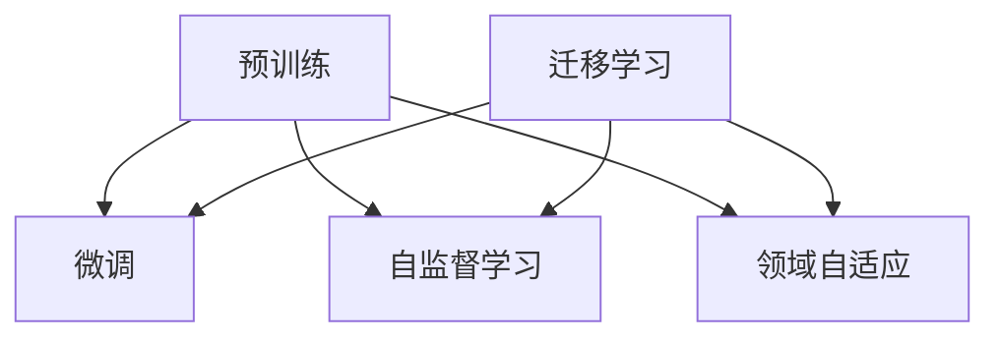

                 

# Transfer Learning 原理与代码实战案例讲解

> 关键词：迁移学习, 预训练, 微调, 代码实例, 深度学习, 优化算法

## 1. 背景介绍

### 1.1 问题由来

近年来，随着深度学习技术的飞速发展，大规模预训练模型在计算机视觉、自然语言处理等领域取得了显著的进步。然而，这些模型通常需要大量的标注数据和强大的计算资源进行训练，导致其在某些特定任务上的性能有限。迁移学习（Transfer Learning）成为一种有效的方法，通过在已有的大型预训练模型上继续学习，减少对标注数据和计算资源的依赖，实现高性能的模型训练。

### 1.2 问题核心关键点

迁移学习旨在通过知识迁移的方式，将一个领域的知识应用于另一个领域的学习中，提高模型的泛化能力和学习效率。常见的迁移学习方法包括微调（Fine-Tuning）、自监督学习（Self-Supervised Learning）、领域自适应（Domain Adaptation）等。其中，微调是最为常用和简单的一种方法，它通过在大规模预训练模型上继续学习新的任务，优化模型的参数，从而提升模型在特定任务上的表现。

微调的核心在于如何避免过拟合，同时最大化利用预训练模型的知识。常见的方法包括选择合适的学习率、应用正则化技术、保留预训练的部分层等。这些方法可以确保模型在微调过程中不会忘记预训练阶段学习到的知识，同时适应新的任务需求。

### 1.3 问题研究意义

研究迁移学习的方法，对于提升模型的泛化能力和加速模型训练，具有重要意义：

1. 减少标注数据需求。迁移学习可以利用预训练模型的知识，减少特定任务所需的标注样本数量，降低数据标注成本。
2. 提升模型性能。通过在预训练模型的基础上继续学习，可以显著提升模型在特定任务上的性能，特别是在数据量较少的场景下效果尤为明显。
3. 加速开发进度。利用迁移学习可以加快新模型的开发速度，缩短从模型设计到实际应用的时间周期。
4. 带来技术创新。迁移学习推动了深度学习领域的多种技术进步，如预训练、自监督学习、领域自适应等，为后续研究提供了新的思路和方法。

## 2. 核心概念与联系

### 2.1 核心概念概述

为更好地理解迁移学习的核心思想，本节将介绍几个关键概念及其相互关系：

- 迁移学习（Transfer Learning）：通过知识迁移的方式，将一个领域的学习应用于另一个领域，减少特定任务的训练时间，提高模型的泛化能力。
- 预训练（Pre-training）：在大规模无标注数据上训练模型，学习通用的特征表示，减少对特定任务数据的需求。
- 微调（Fine-Tuning）：在预训练模型基础上，继续学习特定任务，优化模型参数，提升模型在特定任务上的性能。
- 自监督学习（Self-Supervised Learning）：通过利用数据自身的信息，如掩码预测、噪声注入等，进行无监督训练，提升模型的泛化能力。
- 领域自适应（Domain Adaptation）：将模型在不同领域的数据上进行学习，减少领域差异对模型性能的影响。

这些核心概念之间的关系可以通过以下Mermaid流程图来展示：



这个流程图展示了迁移学习与其他相关概念的关系：

1. 预训练和微调：预训练模型通过在大规模无标注数据上学习通用特征，微调模型通过在特定任务上学习来提升模型性能。
2. 自监督学习和预训练：自监督学习可以用于预训练阶段，通过数据自身的监督信息来训练模型。
3. 领域自适应和迁移学习：领域自适应通过在不同领域数据上训练模型，可以减少领域差异对性能的影响，迁移学习则通过将一个领域的学习应用于另一个领域，提升模型的泛化能力。

## 3. 核心算法原理 & 具体操作步骤
### 3.1 算法原理概述

迁移学习的核心思想是通过在大规模预训练模型上继续学习新的任务，提升模型在特定任务上的性能。这一过程通常包括预训练、微调两个阶段，可以大致分为以下几个步骤：

1. **预训练阶段**：在大规模无标注数据上训练模型，学习通用的特征表示。
2. **微调阶段**：在预训练模型基础上，继续学习特定任务，优化模型参数，提升模型在特定任务上的性能。
3. **自监督学习**：在预训练阶段利用数据自身的监督信息，提升模型的泛化能力。
4. **领域自适应**：在不同领域的数据上进行学习，减少领域差异对模型性能的影响。

### 3.2 算法步骤详解

以下是迁移学习的一般流程：

**Step 1: 准备预训练模型和数据集**
- 选择合适的预训练模型（如ResNet、BERT等）作为初始化参数。
- 准备特定任务的标注数据集，划分为训练集、验证集和测试集。

**Step 2: 添加任务适配层**
- 根据任务类型，设计合适的输出层和损失函数。
- 对于分类任务，通常使用线性分类器和交叉熵损失函数。
- 对于生成任务，通常使用语言模型的解码器输出概率分布，并以负对数似然为损失函数。

**Step 3: 设置微调超参数**
- 选择合适的优化算法及其参数，如AdamW、SGD等，设置学习率、批大小、迭代轮数等。
- 设置正则化技术及强度，包括权重衰减、Dropout、Early Stopping等。
- 确定冻结预训练参数的策略，如仅微调顶层，或全部参数都参与微调。

**Step 4: 执行梯度训练**
- 将训练集数据分批次输入模型，前向传播计算损失函数。
- 反向传播计算参数梯度，根据设定的优化算法和学习率更新模型参数。
- 周期性在验证集上评估模型性能，根据性能指标决定是否触发Early Stopping。
- 重复上述步骤直到满足预设的迭代轮数或Early Stopping条件。

**Step 5: 测试和部署**
- 在测试集上评估微调后模型性能，对比微调前后的精度提升。
- 使用微调后的模型对新样本进行推理预测，集成到实际的应用系统中。
- 持续收集新的数据，定期重新微调模型，以适应数据分布的变化。

### 3.3 算法优缺点

迁移学习的主要优点包括：

1. 减少标注数据需求。迁移学习可以利用预训练模型的知识，减少特定任务所需的标注样本数量，降低数据标注成本。
2. 提升模型性能。通过在预训练模型的基础上继续学习，可以显著提升模型在特定任务上的性能，特别是在数据量较少的场景下效果尤为明显。
3. 加速开发进度。利用迁移学习可以加快新模型的开发速度，缩短从模型设计到实际应用的时间周期。
4. 带来技术创新。迁移学习推动了深度学习领域的多种技术进步，如预训练、自监督学习、领域自适应等，为后续研究提供了新的思路和方法。

同时，迁移学习也存在一些局限性：

1. 依赖标注数据。微调的效果很大程度上取决于标注数据的质量和数量，获取高质量标注数据的成本较高。
2. 迁移能力有限。当目标任务与预训练数据的分布差异较大时，微调的性能提升有限。
3. 负面效果传递。预训练模型的固有偏见、有害信息等，可能通过微调传递到下游任务，造成负面影响。
4. 可解释性不足。迁移学习的决策过程通常缺乏可解释性，难以对其推理逻辑进行分析和调试。

尽管存在这些局限性，但就目前而言，迁移学习仍然是最为常用和简单的一种学习范式。未来相关研究的重点在于如何进一步降低迁移学习对标注数据的依赖，提高模型的少样本学习和跨领域迁移能力，同时兼顾可解释性和伦理安全性等因素。

### 3.4 算法应用领域

迁移学习在计算机视觉、自然语言处理等领域已经得到了广泛的应用，覆盖了几乎所有常见任务，例如：

- 图像分类：如分类各种物体类别。通过微调使模型学习图像-类别映射。
- 目标检测：识别图像中的人、车、动物等特定物体。通过微调使模型学习目标框的回归和分类。
- 文本分类：如情感分析、主题分类、意图识别等。通过微调使模型学习文本-标签映射。
- 命名实体识别：识别文本中的人名、地名、机构名等特定实体。通过微调使模型掌握实体边界和类型。
- 关系抽取：从文本中抽取实体之间的语义关系。通过微调使模型学习实体-关系三元组。
- 问答系统：对自然语言问题给出答案。将问题-答案对作为微调数据，训练模型学习匹配答案。
- 机器翻译：将源语言文本翻译成目标语言。通过微调使模型学习语言-语言映射。
- 文本摘要：将长文本压缩成简短摘要。将文章-摘要对作为微调数据，使模型学习抓取要点。
- 对话系统：使机器能够与人自然对话。将多轮对话历史作为上下文，微调模型进行回复生成。

除了上述这些经典任务外，迁移学习还被创新性地应用到更多场景中，如可控文本生成、常识推理、代码生成、数据增强等，为计算机视觉和自然语言处理技术带来了全新的突破。随着迁移学习方法的不断进步，相信计算机视觉和自然语言处理技术将在更广阔的应用领域大放异彩。

## 4. 数学模型和公式 & 详细讲解  
### 4.1 数学模型构建

以下我们以图像分类任务为例，推导迁移学习的数学原理。

记预训练模型为 $M_{\theta}$，其中 $\theta$ 为预训练得到的模型参数。假设微调任务的训练集为 $D=\{(x_i,y_i)\}_{i=1}^N, x_i \in \mathbb{R}^m, y_i \in \{1,2,...,K\}$，$K$ 为类别数。

定义模型 $M_{\theta}$ 在输入 $x$ 上的输出为 $\hat{y}=M_{\theta}(x) \in \{1,2,...,K\}$，则二分类交叉熵损失函数定义为：

$$
\ell(M_{\theta}(x),y) = -[y\log \hat{y} + (1-y)\log (1-\hat{y})]
$$

将其代入经验风险公式，得：

$$
\mathcal{L}(\theta) = -\frac{1}{N}\sum_{i=1}^N [y_i\log M_{\theta}(x_i)+(1-y_i)\log(1-M_{\theta}(x_i))]
$$

在实践中，我们通常使用基于梯度的优化算法（如SGD、Adam等）来近似求解上述最优化问题。设 $\eta$ 为学习率，$\lambda$ 为正则化系数，则参数的更新公式为：

$$
\theta \leftarrow \theta - \eta \nabla_{\theta}\mathcal{L}(\theta) - \eta\lambda\theta
$$

其中 $\nabla_{\theta}\mathcal{L}(\theta)$ 为损失函数对参数 $\theta$ 的梯度，可通过反向传播算法高效计算。

### 4.2 公式推导过程

以下我们以图像分类任务为例，推导迁移学习的数学原理。

假设模型 $M_{\theta}$ 在输入 $x$ 上的输出为 $\hat{y}=M_{\theta}(x) \in \{1,2,...,K\}$，则二分类交叉熵损失函数定义为：

$$
\ell(M_{\theta}(x),y) = -[y\log \hat{y} + (1-y)\log (1-\hat{y})]
$$

将其代入经验风险公式，得：

$$
\mathcal{L}(\theta) = -\frac{1}{N}\sum_{i=1}^N [y_i\log M_{\theta}(x_i)+(1-y_i)\log(1-M_{\theta}(x_i))]
$$

在实践中，我们通常使用基于梯度的优化算法（如SGD、Adam等）来近似求解上述最优化问题。设 $\eta$ 为学习率，$\lambda$ 为正则化系数，则参数的更新公式为：

$$
\theta \leftarrow \theta - \eta \nabla_{\theta}\mathcal{L}(\theta) - \eta\lambda\theta
$$

其中 $\nabla_{\theta}\mathcal{L}(\theta)$ 为损失函数对参数 $\theta$ 的梯度，可通过反向传播算法高效计算。

在得到损失函数的梯度后，即可带入参数更新公式，完成模型的迭代优化。重复上述过程直至收敛，最终得到适应下游任务的最优模型参数 $\theta^*$。

## 5. 项目实践：代码实例和详细解释说明
### 5.1 开发环境搭建

在进行迁移学习实践前，我们需要准备好开发环境。以下是使用Python进行PyTorch开发的环境配置流程：

1. 安装Anaconda：从官网下载并安装Anaconda，用于创建独立的Python环境。

2. 创建并激活虚拟环境：
```bash
conda create -n pytorch-env python=3.8 
conda activate pytorch-env
```

3. 安装PyTorch：根据CUDA版本，从官网获取对应的安装命令。例如：
```bash
conda install pytorch torchvision torchaudio cudatoolkit=11.1 -c pytorch -c conda-forge
```

4. 安装Transformers库：
```bash
pip install transformers
```

5. 安装各类工具包：
```bash
pip install numpy pandas scikit-learn matplotlib tqdm jupyter notebook ipython
```

完成上述步骤后，即可在`pytorch-env`环境中开始迁移学习实践。

### 5.2 源代码详细实现

这里我们以图像分类任务为例，给出使用Transformers库对ResNet模型进行迁移学习的PyTorch代码实现。

首先，定义模型和数据处理函数：

```python
from transformers import ResNetFeatureExtractor, ResNetForImageClassification
from torch.utils.data import Dataset, DataLoader
import torch

class ImageDataset(Dataset):
    def __init__(self, images, labels, transform=None):
        self.images = images
        self.labels = labels
        self.transform = transform
        
    def __len__(self):
        return len(self.images)
    
    def __getitem__(self, item):
        image = self.images[item]
        label = self.labels[item]
        
        if self.transform:
            image = self.transform(image)
        
        return {'image': image, 'label': label}

# 数据预处理和加载
from transformers import AutoFeatureExtractor, AutoTokenizer
from PIL import Image
import os

data_dir = '/path/to/data'

# 构建数据集
feature_extractor = AutoFeatureExtractor.from_pretrained('resnet18')
tokenizer = AutoTokenizer.from_pretrained('resnet18')

train_dataset = ImageDataset(train_images, train_labels, transform=feature_extractor)
val_dataset = ImageDataset(val_images, val_labels, transform=feature_extractor)
test_dataset = ImageDataset(test_images, test_labels, transform=feature_extractor)

# 构建数据加载器
train_loader = DataLoader(train_dataset, batch_size=16, shuffle=True)
val_loader = DataLoader(val_dataset, batch_size=16)
test_loader = DataLoader(test_dataset, batch_size=16)

# 定义模型和优化器
model = ResNetForImageClassification.from_pretrained('resnet18')
optimizer = AdamW(model.parameters(), lr=2e-5)
```

然后，定义训练和评估函数：

```python
from sklearn.metrics import classification_report

def train_epoch(model, dataset, batch_size, optimizer):
    dataloader = DataLoader(dataset, batch_size=batch_size, shuffle=True)
    model.train()
    epoch_loss = 0
    for batch in dataloader:
        inputs = batch['image']
        labels = batch['label']
        
        model.zero_grad()
        outputs = model(inputs)
        loss = outputs.loss
        epoch_loss += loss.item()
        loss.backward()
        optimizer.step()
    return epoch_loss / len(dataloader)

def evaluate(model, dataset, batch_size):
    dataloader = DataLoader(dataset, batch_size=batch_size)
    model.eval()
    preds, labels = [], []
    with torch.no_grad():
        for batch in dataloader:
            inputs = batch['image']
            labels = batch['label']
            outputs = model(inputs)
            batch_preds = outputs.logits.argmax(dim=1).to('cpu').tolist()
            batch_labels = labels.to('cpu').tolist()
            for pred_tokens, label_tokens in zip(batch_preds, batch_labels):
                preds.append(pred_tokens)
                labels.append(label_tokens)
                
    print(classification_report(labels, preds))
```

最后，启动训练流程并在测试集上评估：

```python
epochs = 5
batch_size = 16

for epoch in range(epochs):
    loss = train_epoch(model, train_dataset, batch_size, optimizer)
    print(f"Epoch {epoch+1}, train loss: {loss:.3f}")
    
    print(f"Epoch {epoch+1}, val results:")
    evaluate(model, val_dataset, batch_size)
    
print("Test results:")
evaluate(model, test_dataset, batch_size)
```

以上就是使用PyTorch对ResNet模型进行图像分类任务迁移学习的完整代码实现。可以看到，得益于Transformers库的强大封装，我们可以用相对简洁的代码完成迁移学习的开发。

### 5.3 代码解读与分析

让我们再详细解读一下关键代码的实现细节：

**ImageDataset类**：
- `__init__`方法：初始化图像、标签等关键组件。
- `__len__`方法：返回数据集的样本数量。
- `__getitem__`方法：对单个样本进行处理，对图像进行预处理和转换，返回模型所需的输入。

**模型和优化器**：
- 使用PyTorch的ResNetForImageClassification模型和AdamW优化器。
- 在训练过程中，设置合适的学习率和批大小，使用AdamW优化器更新模型参数。

**训练和评估函数**：
- 使用PyTorch的DataLoader对数据集进行批次化加载，供模型训练和推理使用。
- 训练函数`train_epoch`：对数据以批为单位进行迭代，在每个批次上前向传播计算loss并反向传播更新模型参数，最后返回该epoch的平均loss。
- 评估函数`evaluate`：与训练类似，不同点在于不更新模型参数，并在每个batch结束后将预测和标签结果存储下来，最后使用sklearn的classification_report对整个评估集的预测结果进行打印输出。

**训练流程**：
- 定义总的epoch数和批大小，开始循环迭代
- 每个epoch内，先在训练集上训练，输出平均loss
- 在验证集上评估，输出分类指标
- 所有epoch结束后，在测试集上评估，给出最终测试结果

可以看到，PyTorch配合Transformers库使得迁移学习的代码实现变得简洁高效。开发者可以将更多精力放在数据处理、模型改进等高层逻辑上，而不必过多关注底层的实现细节。

当然，工业级的系统实现还需考虑更多因素，如模型的保存和部署、超参数的自动搜索、更灵活的任务适配层等。但核心的迁移学习范式基本与此类似。

## 6. 实际应用场景
### 6.1 智能医疗

基于迁移学习的深度学习模型，可以广泛应用于智能医疗领域。传统医疗诊断通常依赖于医生的经验和专业背景，耗时较长且误诊率较高。而使用迁移学习的图像分类模型，可以实时分析医学影像，快速诊断疾病，提高医疗服务的智能化水平。

在技术实现上，可以收集大量的医学影像数据，将其划分为训练集和测试集，然后在预训练的医学影像分类模型上进行微调。微调后的模型能够自动理解影像中的特征，并匹配疾病类别，从而实现快速诊断。

### 6.2 工业检测

在工业检测领域，基于迁移学习的目标检测模型可以自动检测生产线上的产品缺陷，提高检测效率和准确率。传统检测通常依赖人工观察，耗时耗力且难以确保一致性。而使用迁移学习的目标检测模型，可以在大规模工业数据上预训练，并针对特定场景进行微调，实现自动化的产品缺陷检测。

在实际应用中，可以在生产线上安装相机，实时捕捉图像，使用迁移学习模型进行检测，一旦发现异常产品，立即发出警报。

### 6.3 个性化推荐

在电商推荐系统中，基于迁移学习的推荐模型可以更好地理解用户的兴趣偏好，从而提供个性化的商品推荐。传统推荐系统通常只依赖用户的历史行为数据进行推荐，难以深入挖掘用户的潜在兴趣。而使用迁移学习的推荐模型，可以在大规模用户行为数据上预训练，并针对特定用户进行微调，从而提升推荐效果。

在实践中，可以收集用户浏览、点击、购买等行为数据，提取和用户交互的商品信息，使用迁移学习的推荐模型进行推荐。推荐模型能够从用户行为中准确把握用户的兴趣点，并在个性化推荐中取得更好的效果。

### 6.4 未来应用展望

随着迁移学习方法的不断进步，其在计算机视觉、自然语言处理等领域的应用前景将更加广阔。未来，迁移学习将在更多领域得到应用，为传统行业带来变革性影响。

在智慧医疗领域，基于迁移学习的医学影像分类、疾病诊断等应用将提升医疗服务的智能化水平，辅助医生诊疗，加速新药开发进程。

在工业检测领域，基于迁移学习的目标检测、缺陷分析等应用将提高检测效率和准确率，减少人工成本。

在个性化推荐系统中，基于迁移学习的推荐模型将更好地理解用户的兴趣偏好，提供更精准、多样的商品推荐。

此外，在智慧城市治理、金融分析、智能交通等众多领域，基于迁移学习的深度学习应用也将不断涌现，为各行各业带来新的技术突破。相信随着迁移学习技术的持续演进，其在各行各业的应用前景将更加广阔，为人类社会的发展带来深远影响。

## 7. 工具和资源推荐
### 7.1 学习资源推荐

为了帮助开发者系统掌握迁移学习的理论基础和实践技巧，这里推荐一些优质的学习资源：

1. 《深度学习入门：基于Python的理论与实现》系列博文：由大模型技术专家撰写，深入浅出地介绍了深度学习的基本概念和实践技巧，涵盖迁移学习、自监督学习、领域自适应等内容。

2. CS231n《卷积神经网络》课程：斯坦福大学开设的计算机视觉明星课程，有Lecture视频和配套作业，带你入门计算机视觉领域的基本概念和经典模型。

3. 《Deep Learning for Computer Vision: Architectures, Algorithms, and Applications》书籍：全面介绍深度学习在计算机视觉领域的应用，包括迁移学习、自监督学习、领域自适应等技术。

4. PyTorch官方文档：PyTorch的官方文档，提供了丰富的预训练模型和迁移学习样例代码，是上手实践的必备资料。

5. OpenAI博客：OpenAI发布的深度学习研究和应用博客，涵盖迁移学习、自监督学习、领域自适应等前沿话题，提供大量的实践案例和代码。

通过对这些资源的学习实践，相信你一定能够快速掌握迁移学习的精髓，并用于解决实际的计算机视觉和自然语言处理问题。
### 7.2 开发工具推荐

高效的开发离不开优秀的工具支持。以下是几款用于迁移学习开发的常用工具：

1. PyTorch：基于Python的开源深度学习框架，灵活动态的计算图，适合快速迭代研究。大部分预训练模型都有PyTorch版本的实现。

2. TensorFlow：由Google主导开发的开源深度学习框架，生产部署方便，适合大规模工程应用。同样有丰富的预训练模型资源。

3. Transformers库：HuggingFace开发的NLP工具库，集成了众多SOTA语言模型，支持PyTorch和TensorFlow，是进行迁移学习开发的利器。

4. Weights & Biases：模型训练的实验跟踪工具，可以记录和可视化模型训练过程中的各项指标，方便对比和调优。与主流深度学习框架无缝集成。

5. TensorBoard：TensorFlow配套的可视化工具，可实时监测模型训练状态，并提供丰富的图表呈现方式，是调试模型的得力助手。

6. Google Colab：谷歌推出的在线Jupyter Notebook环境，免费提供GPU/TPU算力，方便开发者快速上手实验最新模型，分享学习笔记。

合理利用这些工具，可以显著提升迁移学习的开发效率，加快创新迭代的步伐。

### 7.3 相关论文推荐

迁移学习在深度学习领域的地位日益重要，以下是几篇奠基性的相关论文，推荐阅读：

1. Transfer Learning as ImageNet Trained Classifiers on Other Image Datasets（ImageNet的迁移学习模型）：提出在大规模ImageNet数据集上预训练的模型可以迁移到其他小规模数据集上，取得了非常好的效果。

2. Fine-Grained Recognition with Labeled Noisy Synthetic Data（带噪声的迁移学习）：通过在大型合成数据集上预训练模型，然后迁移到实际数据集上进行微调，取得了良好的迁移效果。

3. Multi-task Learning for Continuous Multi-label Classification（多任务学习）：提出在多个相关任务上联合训练模型，提升模型在特定任务上的性能。

4. A Few-shot Learning Framework for Autonomous Driving: Decision Making and Natural Language Understanding（少样本迁移学习）：在自动驾驶领域提出使用迁移学习进行少样本学习和决策制定的框架。

5. Scalable Model Distillation for Transfer Learning（可扩展的模型蒸馏）：提出使用模型蒸馏进行迁移学习，加速模型训练和微调的过程。

这些论文代表了大迁移学习技术的发展脉络。通过学习这些前沿成果，可以帮助研究者把握学科前进方向，激发更多的创新灵感。

## 8. 总结：未来发展趋势与挑战

### 8.1 总结

本文对迁移学习的方法进行了全面系统的介绍。首先阐述了迁移学习的研究背景和意义，明确了迁移学习在减少标注数据需求、提升模型性能等方面的独特价值。其次，从原理到实践，详细讲解了迁移学习的数学原理和关键步骤，给出了迁移学习任务开发的完整代码实例。同时，本文还广泛探讨了迁移学习在智能医疗、工业检测、个性化推荐等多个领域的应用前景，展示了迁移学习技术的广阔潜力。此外，本文精选了迁移学习的各类学习资源，力求为读者提供全方位的技术指引。

通过本文的系统梳理，可以看到，迁移学习正在成为深度学习领域的重要范式，极大地拓展了预训练模型应用的范围，提升了下游任务的性能。随着迁移学习方法的不断进步，计算机视觉和自然语言处理技术将在更广阔的应用领域大放异彩。未来，伴随迁移学习方法的持续演进，相信计算机视觉和自然语言处理技术将在各行各业中得到广泛应用，为人类社会的发展带来深远影响。

### 8.2 未来发展趋势

展望未来，迁移学习技术将呈现以下几个发展趋势：

1. 模型规模持续增大。随着算力成本的下降和数据规模的扩张，迁移学习模型的参数量还将持续增长。超大模型的迁移学习，将进一步提升模型的泛化能力和学习效率。

2. 迁移方法日趋多样。除了传统的微调外，未来会涌现更多迁移学习的方法，如蒸馏、联合训练等，在保证模型性能的同时，进一步减少训练成本。

3. 持续学习成为常态。随着数据分布的不断变化，迁移学习模型也需要持续学习新知识以保持性能。如何在不遗忘原有知识的同时，高效吸收新样本信息，将成为重要的研究课题。

4. 标注样本需求降低。受启发于提示学习(Prompt-based Learning)的思路，未来的迁移学习将更好地利用预训练模型的知识，通过更加巧妙的任务描述，在更少的标注样本上也能实现理想的迁移效果。

5. 模型通用性增强。经过海量数据的预训练和迁移学习，未来的模型将具备更强大的通用性和泛化能力，逐步迈向通用人工智能(AGI)的目标。

以上趋势凸显了迁移学习技术的广阔前景。这些方向的探索发展，必将进一步提升迁移学习的性能和应用范围，为计算机视觉和自然语言处理技术带来新的突破。

### 8.3 面临的挑战

尽管迁移学习已经取得了显著的进步，但在迈向更加智能化、普适化应用的过程中，仍面临诸多挑战：

1. 依赖标注数据。迁移学习的效果很大程度上取决于标注数据的质量和数量，获取高质量标注数据的成本较高。如何进一步降低迁移学习对标注数据的依赖，将是一大难题。

2. 迁移能力有限。当目标任务与预训练数据的分布差异较大时，迁移学习的性能提升有限。如何在不同领域之间实现更好的知识迁移，仍需深入研究。

3. 负面效果传递。预训练模型的固有偏见、有害信息等，可能通过迁移学习传递到下游任务，造成负面影响。如何从数据和算法层面消除模型偏见，避免恶意用途，确保输出的安全性，也将是重要的研究课题。

4. 可解释性不足。迁移学习模型通常缺乏可解释性，难以对其决策过程进行分析和调试。如何赋予迁移学习模型更强的可解释性，将是亟待攻克的难题。

5. 安全性有待保障。预训练模型难免会学习到有偏见、有害的信息，通过迁移学习传递到下游任务，产生误导性、歧视性的输出，给实际应用带来安全隐患。如何从数据和算法层面消除模型偏见，避免恶意用途，确保输出的安全性，也将是重要的研究课题。

6. 知识整合能力不足。现有的迁移学习模型往往局限于任务内数据，难以灵活吸收和运用更广泛的先验知识。如何让迁移学习过程更好地与外部知识库、规则库等专家知识结合，形成更加全面、准确的信息整合能力，还有很大的想象空间。

正视迁移学习面临的这些挑战，积极应对并寻求突破，将是迁移学习走向成熟的必由之路。相信随着学界和产业界的共同努力，这些挑战终将一一被克服，迁移学习技术必将在构建人机协同的智能时代中扮演越来越重要的角色。

### 8.4 研究展望

面对迁移学习所面临的诸多挑战，未来的研究需要在以下几个方面寻求新的突破：

1. 探索无监督和半监督迁移方法。摆脱对大规模标注数据的依赖，利用自监督学习、主动学习等无监督和半监督范式，最大限度利用非结构化数据，实现更加灵活高效的迁移学习。

2. 研究参数高效和计算高效的迁移范式。开发更加参数高效的迁移方法，在固定大部分预训练参数的同时，只更新极少量的任务相关参数。同时优化迁移模型的计算图，减少前向传播和反向传播的资源消耗，实现更加轻量级、实时性的部署。

3. 引入因果推断和对比学习范式。通过引入因果推断和对比学习思想，增强迁移学习模型建立稳定因果关系的能力，学习更加普适、鲁棒的语言表征，从而提升模型泛化性和抗干扰能力。

4. 融合多种先验知识。将符号化的先验知识，如知识图谱、逻辑规则等，与神经网络模型进行巧妙融合，引导迁移学习过程学习更准确、合理的语言模型。同时加强不同模态数据的整合，实现视觉、语音等多模态信息与文本信息的协同建模。

5. 结合因果分析和博弈论工具。将因果分析方法引入迁移学习模型，识别出模型决策的关键特征，增强输出解释的因果性和逻辑性。借助博弈论工具刻画人机交互过程，主动探索并规避模型的脆弱点，提高系统稳定性。

6. 纳入伦理道德约束。在迁移学习训练目标中引入伦理导向的评估指标，过滤和惩罚有偏见、有害的输出倾向。同时加强人工干预和审核，建立模型行为的监管机制，确保输出符合人类价值观和伦理道德。

这些研究方向的探索，必将引领迁移学习技术迈向更高的台阶，为计算机视觉和自然语言处理技术带来新的突破。面向未来，迁移学习技术还需要与其他人工智能技术进行更深入的融合，如知识表示、因果推理、强化学习等，多路径协同发力，共同推动计算机视觉和自然语言处理系统的进步。只有勇于创新、敢于突破，才能不断拓展迁移学习模型的边界，让智能技术更好地造福人类社会。

## 9. 附录：常见问题与解答

**Q1：迁移学习是否适用于所有NLP任务？**

A: 迁移学习在大多数NLP任务上都能取得不错的效果，特别是对于数据量较小的任务。但对于一些特定领域的任务，如医学、法律等，仅仅依靠通用语料预训练的模型可能难以很好地适应。此时需要在特定领域语料上进一步预训练，再进行迁移学习，才能获得理想效果。此外，对于一些需要时效性、个性化很强的任务，如对话、推荐等，迁移学习方法也需要针对性的改进优化。

**Q2：迁移学习过程中如何选择合适的学习率？**

A: 迁移学习的学习率通常要比预训练时小1-2个数量级，如果使用过大的学习率，容易破坏预训练权重，导致过拟合。一般建议从1e-5开始调参，逐步减小学习率，直至收敛。也可以使用warmup策略，在开始阶段使用较小的学习率，再逐渐过渡到预设值。需要注意的是，不同的优化器(如AdamW、Adafactor等)以及不同的学习率调度策略，可能需要设置不同的学习率阈值。

**Q3：迁移学习过程中如何缓解过拟合问题？**

A: 过拟合是迁移学习面临的主要挑战，尤其是在标注数据不足的情况下。常见的缓解策略包括：
1. 数据增强：通过回译、近义替换等方式扩充训练集
2. 正则化：使用L2正则、Dropout、Early Stopping等避免过拟合
3. 对抗训练：引入对抗样本，提高模型鲁棒性
4. 参数高效迁移：只调整少量参数(如Adapter、Prefix等)，减小过拟合风险
5. 多模型集成：训练多个迁移模型，取平均输出，抑制过拟合

这些策略往往需要根据具体任务和数据特点进行灵活组合。只有在数据、模型、训练、推理等各环节进行全面优化，才能最大限度地发挥迁移学习的威力。

**Q4：迁移学习在落地部署时需要注意哪些问题？**

A: 将迁移学习模型转化为实际应用，还需要考虑以下因素：
1. 模型裁剪：去除不必要的层和参数，减小模型尺寸，加快推理速度
2. 量化加速：将浮点模型转为定点模型，压缩存储空间，提高计算效率
3. 服务化封装：将模型封装为标准化服务接口，便于集成调用
4. 弹性伸缩：根据请求流量动态调整资源配置，平衡服务质量和成本
5. 监控告警：实时采集系统指标，设置异常告警阈值，确保服务稳定性
6. 安全防护：采用访问鉴权、数据脱敏等措施，保障数据和模型安全

迁移学习为NLP应用开启了广阔的想象空间，但如何将强大的性能转化为稳定、高效、安全的业务价值，还需要工程实践的不断打磨。唯有从数据、算法、工程、业务等多个维度协同发力，才能真正实现迁移学习技术在垂直行业的规模化落地。总之，迁移学习需要开发者根据具体任务，不断迭代和优化模型、数据和算法，方能得到理想的效果。

---

作者：禅与计算机程序设计艺术 / Zen and the Art of Computer Programming

