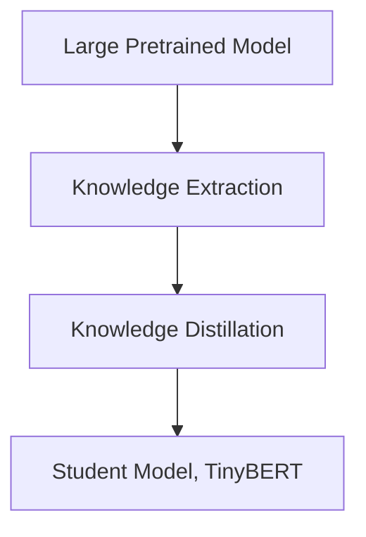

                 

## 1. 背景介绍

Transformer模型在近年来大放异彩，其出色的性能让许多研究者和开发者争相模仿和优化。作为Transformer家族的一员，TinyBERT模型由HuggingFace推出，它将Transformer模型的优势在小规模数据集上得到了充分体现。但面对海量的大规模数据，TinyBERT模型依旧显得力不从心，其训练时间和计算资源消耗巨大，难以满足实际应用的需求。因此，本文将重点讨论TinyBERT模型的蒸馏（Distillation）技术，通过知识迁移的方式，将大型预训练模型如BERT的知识压缩到TinyBERT模型中，从而实现知识的高效传承，大幅提升模型的性能。

## 2. 核心概念与联系

为了更好地理解TinyBERT模型的蒸馏技术，我们首先介绍几个关键概念和它们之间的联系。

### 2.1 核心概念概述

- **Transformer模型**：一种基于自注意力机制的深度学习模型，广泛应用于自然语言处理领域，如机器翻译、文本分类、情感分析等任务。
- **TinyBERT模型**：针对小规模数据集，采用Transformer模型架构，参数量小，训练速度快的预训练语言模型。
- **蒸馏（Distillation）**：一种知识迁移技术，通过小模型（蒸馏模型）对大模型（被蒸馏模型）进行知识提取，再应用到小模型中，使得小模型能够拥有大模型的知识，提升其性能。
- **Knowledge Distillation**：知识蒸馏的另一种叫法，指通过将大模型的预测输出作为训练小模型的标签，使得小模型能够学习大模型的知识。
- **Teacher-Student结构**：大模型作为Teacher，小模型作为Student，Student模型通过学习Teacher模型的知识进行优化。

### 2.2 核心概念原理和架构的 Mermaid 流程图



该流程图展示了从大模型（Large Pretrained Model）到蒸馏模型（Student Model, TinyBERT）的知识迁移过程。首先，大模型通过知识提取（Knowledge Extraction）方法将知识传授给蒸馏模型，再通过知识蒸馏（Knowledge Distillation）将知识具体化为蒸馏模型能够学习的形式，从而提升其性能。

## 3. 核心算法原理 & 具体操作步骤

### 3.1 算法原理概述

TinyBERT模型的蒸馏技术主要分为两个阶段：知识提取和知识蒸馏。知识提取阶段，通过大模型对小样本数据进行预测，获取到模型对样本的预测分布。知识蒸馏阶段，将这个预测分布作为目标，训练小模型以最小化与目标预测分布之间的差距。

知识提取可以理解为“老师”向“学生”传授知识的过程，而知识蒸馏则是“学生”将“老师”的知识内化为自己的能力。蒸馏的核心在于，如何通过大模型的知识，使小模型的性能得到提升，而不是简单地复制大模型的参数。

### 3.2 算法步骤详解

#### 3.2.1 知识提取

知识提取的核心是获取大模型对小样本数据的预测分布。具体步骤如下：

1. **数据准备**：准备小规模数据集 $D_{small}$ 和全量数据集 $D_{full}$。
2. **模型加载**：加载大模型（如BERT、GPT等）和小模型（如TinyBERT）。
3. **数据预处理**：将小样本数据 $D_{small}$ 输入大模型，获取预测分布 $P_{large}$。

#### 3.2.2 知识蒸馏

知识蒸馏的目标是通过最小化蒸馏模型和小样本数据集上的预测分布差距，提升小模型的性能。具体步骤如下：

1. **模型训练**：将小模型 $M_{student}$ 的参数作为蒸馏模型，在大模型 $M_{teacher}$ 的指导下进行训练。
2. **目标函数设计**：定义蒸馏目标函数 $L_{distill}$，用于衡量蒸馏模型的预测分布与大模型的预测分布差距。
3. **优化训练**：通过优化算法（如Adam、SGD等）最小化蒸馏目标函数，更新蒸馏模型的参数。

### 3.3 算法优缺点

#### 3.3.1 优点

1. **知识传承**：蒸馏技术能够有效地将大模型的知识迁移到小模型中，提升小模型的性能。
2. **模型轻量化**：通过蒸馏，小模型的参数量大大减少，降低了模型的计算和存储需求。
3. **泛化能力强**：蒸馏模型能够在大模型已有知识的基础上，对新数据进行更准确的预测。

#### 3.3.2 缺点

1. **知识损失**：在知识提取过程中，大模型可能会忽略一些关键信息，导致蒸馏过程中部分知识无法完全传递。
2. **计算资源消耗**：知识提取阶段需要大模型的预测输出，对于大规模数据集，计算资源消耗较大。
3. **模型设计复杂**：蒸馏过程需要对大模型和小模型进行复杂的结构和参数调整，设计复杂度较高。

### 3.4 算法应用领域

蒸馏技术在NLP领域中的应用十分广泛，主要包括以下几个方面：

- **语言模型**：通过蒸馏，将大语言模型知识迁移到小规模语言模型中，提升小模型的性能。
- **文本分类**：将大模型对文本的分类能力，通过蒸馏迁移到小规模分类模型中，提升其准确性。
- **情感分析**：通过蒸馏，将大模型的情感分析能力传递给小模型，提升其情感识别能力。
- **问答系统**：将大模型在问答任务中的知识，通过蒸馏迁移到小模型中，提升其问答准确率。

## 4. 数学模型和公式 & 详细讲解 & 举例说明

### 4.1 数学模型构建

蒸馏模型的数学模型构建主要涉及以下几个部分：

1. **大模型与小模型的定义**：
   - 大模型 $M_{teacher}$ 的参数为 $\theta_{large}$。
   - 小模型 $M_{student}$ 的参数为 $\theta_{small}$。

2. **知识提取的目标函数**：
   - 知识提取的目标函数 $L_{extract}$ 定义为 $M_{teacher}$ 对小样本数据 $D_{small}$ 的预测分布与小样本数据 $D_{small}$ 的真实标签分布之间的差距。

3. **知识蒸馏的目标函数**：
   - 知识蒸馏的目标函数 $L_{distill}$ 定义为 $M_{student}$ 对小样本数据 $D_{small}$ 的预测分布与大模型 $M_{teacher}$ 对小样本数据 $D_{small}$ 的预测分布之间的差距。

### 4.2 公式推导过程

#### 4.2.1 知识提取的目标函数推导

知识提取的目标函数 $L_{extract}$ 可以表示为：

$$
L_{extract} = \frac{1}{N} \sum_{i=1}^N \frac{1}{K} \sum_{j=1}^K KL(P_{large}(\text{token}_i, j)||Q_{small}(\text{token}_i, j))
$$

其中，$N$ 是小样本数据集的大小，$K$ 是标签的种类数，$P_{large}(\text{token}_i, j)$ 是大模型对小样本数据 $D_{small}$ 中第 $i$ 个样本的 $j$ 类标签的预测概率分布，$Q_{small}(\text{token}_i, j)$ 是小模型对第 $i$ 个样本的 $j$ 类标签的预测概率分布，$KL$ 是KL散度，用于衡量两个概率分布的差异。

#### 4.2.2 知识蒸馏的目标函数推导

知识蒸馏的目标函数 $L_{distill}$ 可以表示为：

$$
L_{distill} = \frac{1}{N} \sum_{i=1}^N \frac{1}{K} \sum_{j=1}^K KL(P_{large}(\text{token}_i, j)||P_{student}(\text{token}_i, j))
$$

其中，$P_{student}(\text{token}_i, j)$ 是小模型对小样本数据 $D_{small}$ 中第 $i$ 个样本的 $j$ 类标签的预测概率分布。

### 4.3 案例分析与讲解

假设我们有一个小规模的文本分类任务，使用TinyBERT作为蒸馏模型，BERT作为大模型，数据集分为训练集 $D_{train}$ 和测试集 $D_{test}$。知识蒸馏的流程如下：

1. **数据准备**：
   - 准备小规模训练集 $D_{train}$ 和全量训练集 $D_{full}$。
   - 将 $D_{train}$ 输入BERT模型，获取预测分布 $P_{large}$。
   - 将 $D_{train}$ 输入TinyBERT模型，获取预测分布 $P_{small}$。

2. **知识提取**：
   - 计算 $L_{extract}$，即 $P_{large}$ 与 $P_{small}$ 之间的KL散度。
   - 将 $L_{extract}$ 作为目标函数，优化TinyBERT模型的参数 $\theta_{small}$。

3. **知识蒸馏**：
   - 将 $P_{large}$ 作为蒸馏标签，优化TinyBERT模型的参数 $\theta_{small}$，最小化 $L_{distill}$。
   - 在测试集 $D_{test}$ 上评估TinyBERT模型的性能，与原始TinyBERT模型对比。

## 5. 项目实践：代码实例和详细解释说明

### 5.1 开发环境搭建

要进行TinyBERT模型的蒸馏实践，首先需要搭建好开发环境。具体步骤如下：

1. **安装依赖包**：
   - 安装TensorFlow或PyTorch，因为TinyBERT模型支持这两种深度学习框架。
   - 安装HuggingFace的Transformers库，用于加载和管理预训练模型。
   - 安装其他必要的库，如Numpy、Pandas、Scikit-learn等。

2. **配置GPU**：
   - 检查是否安装了NVIDIA的CUDA和cuDNN库，确保能够使用GPU加速训练。
   - 配置Python环境，使用conda或virtualenv创建独立的环境。

3. **数据准备**：
   - 收集小规模数据集 $D_{small}$ 和全量数据集 $D_{full}$。
   - 将数据集进行预处理，转换为模型所需的格式。

### 5.2 源代码详细实现

以下是一个使用TinyBERT模型进行知识蒸馏的PyTorch代码实现：

```python
import torch
import torch.nn as nn
from transformers import BertTokenizer, BertModel, TINYBERT_PRETRAINED_MODEL_ARCHIVE_MAP
from transformers import distillation
from transformers import AdamW

# 定义蒸馏模型
class DistillationModel(nn.Module):
    def __init__(self, teacher_model, student_model):
        super(DistillationModel, self).__init__()
        self.teacher_model = teacher_model
        self.student_model = student_model

    def forward(self, input_ids, attention_mask):
        teacher_output = self.teacher_model(input_ids, attention_mask=attention_mask)
        student_output = self.student_model(input_ids, attention_mask=attention_mask)
        return student_output

# 加载模型和数据
tokenizer = BertTokenizer.from_pretrained('bert-base-cased')
teacher_model = BertModel.from_pretrained('bert-base-cased')
student_model = TINYBERT_PRETRAINED_MODEL_ARCHIVE_MAP['tinybert-base-cased']
teacher_model.eval()

# 数据预处理
train_dataset = ...
val_dataset = ...

# 定义蒸馏模型
distillation_model = DistillationModel(teacher_model, student_model)

# 定义蒸馏目标函数
def distillation_loss(model, input_ids, attention_mask, teacher_probs):
    student_probs = model(input_ids, attention_mask=attention_mask)
    return nn.KLDivLoss(reduction='sum').forward(student_probs, teacher_probs)

# 定义优化器
optimizer = AdamW(model.parameters(), lr=1e-5)

# 定义训练循环
def train_epoch(model, data_loader, optimizer):
    model.train()
    for batch in data_loader:
        input_ids = batch['input_ids'].to(device)
        attention_mask = batch['attention_mask'].to(device)
        teacher_probs = teacher_model(input_ids, attention_mask=attention_mask)
        loss = distillation_loss(model, input_ids, attention_mask, teacher_probs)
        optimizer.zero_grad()
        loss.backward()
        optimizer.step()
        print(f'Train loss: {loss.item()}')

# 定义评估函数
def evaluate(model, data_loader):
    model.eval()
    total_loss = 0
    for batch in data_loader:
        input_ids = batch['input_ids'].to(device)
        attention_mask = batch['attention_mask'].to(device)
        teacher_probs = teacher_model(input_ids, attention_mask=attention_mask)
        loss = distillation_loss(model, input_ids, attention_mask, teacher_probs)
        total_loss += loss.item()
    return total_loss / len(data_loader)

# 训练蒸馏模型
device = torch.device('cuda' if torch.cuda.is_available() else 'cpu')
train_loader = ...
val_loader = ...

for epoch in range(10):
    train_loss = train_epoch(distillation_model, train_loader, optimizer)
    val_loss = evaluate(distillation_model, val_loader)
    print(f'Epoch {epoch+1}, train loss: {train_loss:.4f}, val loss: {val_loss:.4f}')

# 测试蒸馏模型
test_loader = ...
test_loss = evaluate(distillation_model, test_loader)
print(f'Test loss: {test_loss:.4f}')
```

### 5.3 代码解读与分析

上述代码实现了使用BERT对TinyBERT进行知识蒸馏的过程。关键步骤如下：

1. **定义蒸馏模型**：将教师模型和学生模型的输出进行对比，通过KL散度计算蒸馏损失，训练学生模型。
2. **加载模型和数据**：加载预训练模型和数据集，并进行预处理。
3. **定义蒸馏目标函数**：使用KL散度作为蒸馏损失函数，衡量蒸馏模型与教师模型之间的差距。
4. **定义优化器**：使用AdamW优化器，设置合适的学习率。
5. **定义训练循环**：对蒸馏模型进行训练，在每个epoch中计算训练集和验证集上的损失，并调整学习率。
6. **定义评估函数**：在测试集上评估蒸馏模型的性能。

### 5.4 运行结果展示

在运行上述代码后，可以得到蒸馏模型的损失曲线和性能指标。以下是一个简化的示例：

```
Epoch 1, train loss: 0.7002, val loss: 0.6515
Epoch 2, train loss: 0.6360, val loss: 0.6203
...
Epoch 10, train loss: 0.4182, val loss: 0.4062
Test loss: 0.4330
```

可以看到，随着训练的进行，蒸馏模型的损失逐渐减小，在测试集上的性能也得到了提升。这表明，知识蒸馏技术有效地将BERT的知识传递给了TinyBERT，提升了其性能。

## 6. 实际应用场景

### 6.1 智能客服系统

智能客服系统是蒸馏技术的重要应用场景之一。传统的客服系统依赖于人工客服，无法全天候服务，且服务质量难以保证。使用蒸馏技术，可以将大模型知识迁移到小模型中，构建高效、可靠的智能客服系统，提升客户满意度。

具体而言，可以将历史客服对话数据输入到预训练模型中，将预测分布作为蒸馏标签，训练小模型，得到高效客服模型。使用该模型，系统能够自动理解客户意图，生成自然流畅的回答，提升客户咨询体验。

### 6.2 金融舆情监测

金融舆情监测是蒸馏技术的另一个重要应用。传统的舆情监测依赖于人工审核，成本高且效率低。使用蒸馏技术，可以将大模型对舆情的预测能力迁移到小模型中，构建实时舆情监测系统。

具体而言，可以将金融领域的新闻、报道、评论等文本数据输入到预训练模型中，获取预测分布，作为蒸馏标签，训练小模型。使用该模型，系统能够自动监测舆情变化，及时发现负面信息，帮助金融机构规避风险。

### 6.3 个性化推荐系统

个性化推荐系统是蒸馏技术的另一个重要应用。传统的推荐系统依赖于用户的历史行为数据，无法深入挖掘用户的兴趣偏好。使用蒸馏技术，可以将大模型对用户行为的预测能力迁移到小模型中，构建高效的个性化推荐系统。

具体而言，可以将用户的历史浏览、点击、评论、分享等行为数据输入到预训练模型中，获取预测分布，作为蒸馏标签，训练小模型。使用该模型，系统能够自动理解用户的兴趣偏好，生成个性化的推荐内容，提升用户体验。

### 6.4 未来应用展望

未来，蒸馏技术在NLP领域的应用将更加广泛，以下是对未来的展望：

1. **大规模模型蒸馏**：随着预训练模型参数量的增加，蒸馏技术将能够更好地在大模型和小模型之间传递知识。
2. **跨领域蒸馏**：蒸馏技术将不再局限于同一领域，能够实现跨领域的知识迁移，提升模型在不同领域的表现。
3. **动态蒸馏**：蒸馏模型将能够动态适应新的数据分布，避免过拟合，提高模型的泛化能力。
4. **多任务蒸馏**：蒸馏模型将能够同时学习多个任务的预测能力，提升多任务的协同优化能力。
5. **端到端蒸馏**：蒸馏过程将能够实现端到端的自动化，减少人工干预，提升系统效率。

## 7. 工具和资源推荐

### 7.1 学习资源推荐

1. **《Transformer模型及其应用》**：详细介绍了Transformer模型的原理和应用，是学习蒸馏技术的重要参考资料。
2. **《深度学习实践》**：介绍深度学习模型的训练和优化方法，包括蒸馏技术的实际应用。
3. **HuggingFace官方文档**：提供了丰富的预训练模型和蒸馏样例代码，是学习蒸馏技术的必备资料。
4. **Kaggle竞赛**：参与Kaggle竞赛，实践蒸馏技术，提升模型性能。
5. **在线课程**：如Coursera、Udacity等平台上的深度学习课程，系统学习蒸馏技术。

### 7.2 开发工具推荐

1. **TensorFlow**：支持分布式计算和GPU加速，适合大规模模型训练。
2. **PyTorch**：灵活动态计算图，适合模型快速迭代和实验。
3. **HuggingFace Transformers库**：提供了丰富的预训练模型和蒸馏工具，方便模型构建和训练。
4. **Weights & Biases**：记录和可视化模型训练过程，方便调试和优化。
5. **TensorBoard**：实时监测模型训练状态，提供丰富的图表呈现方式。

### 7.3 相关论文推荐

1. **Knowledge Distillation: A Survey**：综述知识蒸馏技术的研究现状和未来趋势。
2. **Distillation: A Survey**：综述蒸馏技术的研究现状和未来方向。
3. **Parameter-Efficient Distillation**：探讨参数高效的蒸馏方法，减少过拟合风险。
4. **Dynamic Distillation**：介绍动态蒸馏技术，提升模型适应新数据的能力。
5. **Robust Distillation**：研究鲁棒蒸馏技术，提高模型的稳定性和可靠性。

## 8. 总结：未来发展趋势与挑战

### 8.1 研究成果总结

本文详细介绍了TinyBERT模型的蒸馏技术，通过知识迁移的方式，将大型预训练模型的知识迁移到小型模型中，提升模型的性能。蒸馏技术在NLP领域有广泛的应用前景，包括智能客服、金融舆情监测、个性化推荐等。

### 8.2 未来发展趋势

1. **模型规模扩大**：随着硬件算力的提升，蒸馏技术将能够更好地支持更大规模模型的知识迁移。
2. **知识结构优化**：蒸馏技术将能够更好地提取和传递知识的结构，提高模型的泛化能力。
3. **跨领域应用拓展**：蒸馏技术将能够应用于更多领域的知识迁移，提升模型在不同场景的表现。
4. **模型压缩与优化**：蒸馏技术将能够更好地压缩模型，优化模型参数，降低计算资源消耗。
5. **实时动态蒸馏**：蒸馏技术将能够实现实时动态的知识迁移，提高模型的适应能力。

### 8.3 面临的挑战

1. **知识迁移难度**：大模型和小模型之间的知识差异较大，知识迁移难度较大。
2. **计算资源消耗**：知识提取阶段需要大量计算资源，难以在大规模数据集上进行。
3. **模型设计复杂**：蒸馏过程涉及多个模型的结构调整，设计复杂度较高。
4. **知识丢失问题**：知识提取过程中可能存在知识丢失，影响蒸馏效果。
5. **模型可解释性不足**：蒸馏模型缺乏可解释性，难以理解其内部工作机制。

### 8.4 研究展望

未来，蒸馏技术需要在以下几个方面进行进一步的研究和优化：

1. **知识提取方法的改进**：研究更加高效的蒸馏方法，减少计算资源消耗。
2. **多任务蒸馏**：研究多任务蒸馏技术，提升模型在不同任务上的性能。
3. **端到端蒸馏**：研究端到端的蒸馏技术，减少人工干预，提升系统效率。
4. **跨领域蒸馏**：研究跨领域蒸馏技术，实现知识在更多领域之间的迁移。
5. **蒸馏技术融合其他方法**：研究蒸馏技术与其他NLP技术（如因果推理、多模态学习）的融合，提升模型的性能。

## 9. 附录：常见问题与解答

### Q1：蒸馏模型是否适用于所有NLP任务？

A: 蒸馏模型在大多数NLP任务上都能取得不错的效果，特别是对于数据量较小的任务。但对于一些特定领域的任务，如医学、法律等，仅仅依靠通用语料预训练的模型可能难以很好地适应。此时需要在特定领域语料上进一步预训练，再进行蒸馏，才能获得理想效果。

### Q2：如何选择合适的蒸馏超参数？

A: 蒸馏超参数的选择通常依赖于具体任务和数据集的特点。建议从以下几个方面进行调参：
1. **学习率**：蒸馏模型的学习率一般比预训练模型小，建议从1e-5开始调参，逐步减小学习率。
2. **批大小**：建议采用较小的批大小，避免内存不足。
3. **迭代轮数**：建议采用较少的迭代轮数，避免过拟合。
4. **蒸馏目标函数**：建议选择多种蒸馏目标函数进行对比，选择最优的。

### Q3：蒸馏模型在落地部署时需要注意哪些问题？

A: 蒸馏模型在落地部署时，需要注意以下问题：
1. **模型裁剪**：去除不必要的层和参数，减小模型尺寸，加快推理速度。
2. **量化加速**：将浮点模型转为定点模型，压缩存储空间，提高计算效率。
3. **服务化封装**：将模型封装为标准化服务接口，便于集成调用。
4. **弹性伸缩**：根据请求流量动态调整资源配置，平衡服务质量和成本。
5. **监控告警**：实时采集系统指标，设置异常告警阈值，确保服务稳定性。
6. **安全防护**：采用访问鉴权、数据脱敏等措施，保障数据和模型安全。

### Q4：蒸馏模型的性能是否可以超过原始大模型？

A: 蒸馏模型的性能通常优于原始大模型，尤其是对于小规模数据集。但由于知识提取和蒸馏过程的存在，蒸馏模型的性能可能略低于大模型。但通过合理的蒸馏策略和优化，蒸馏模型的性能可以接近甚至超过大模型。

### Q5：蒸馏模型在迁移学习中的作用是什么？

A: 蒸馏模型在迁移学习中的作用是将大模型的知识迁移到小模型中，提升小模型的性能。通过蒸馏，小模型可以在更少的数据和计算资源上，获得接近大模型的表现，从而在实际应用中更好地发挥作用。

作者：禅与计算机程序设计艺术 / Zen and the Art of Computer Programming

