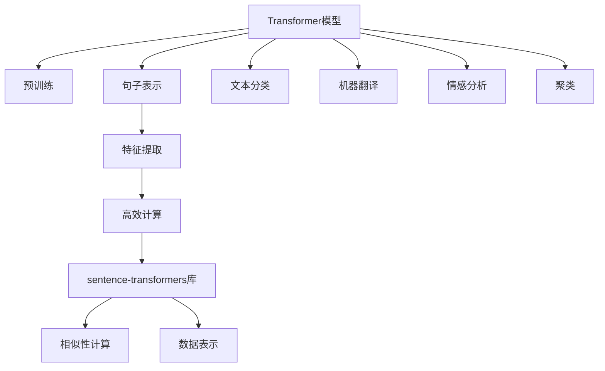

                 

# Transformer大模型实战：sentence-transformers库

> 关键词：Transformer, sentence-transformers, 自然语言处理, 预训练, 特征提取, 高效计算, 词向量, 数据表示

## 1. 背景介绍

### 1.1 问题由来
随着自然语言处理（NLP）技术的迅猛发展，Transformer模型已成为主流的深度学习框架，广泛应用于机器翻译、文本分类、情感分析等任务中。然而，Transformer模型往往需要大量计算资源进行训练和推理，难以直接应用于大数据场景。为了解决这一问题，研究人员提出了sentence-transformers库，通过预训练Transformer模型并利用句子表示，显著提高了Transformer模型的计算效率。

### 1.2 问题核心关键点
sentence-transformers库的核心思想是利用预训练Transformer模型，将输入的句子转换为高维向量表示，从而支持快速的相似性计算和数据表示。与传统的基于词袋（Bag of Words）或词嵌入（Word Embedding）的方法相比，sentence-transformers库显著提升了NLP任务的处理速度和准确率，成为Transformer模型在实际应用中的重要工具。

### 1.3 问题研究意义
研究sentence-transformers库对于加速Transformer模型的应用，提升NLP任务的效率和准确率，降低计算资源的消耗，具有重要意义：

1. 提升计算效率。sentence-transformers库将Transformer模型的计算量从O(N^2)降低至O(N)，显著减少了训练和推理时间。
2. 增强数据表示能力。通过句子表示，sentence-transformers库能够捕捉句子的语义信息，提高了NLP任务的泛化能力和性能。
3. 简化模型部署。sentence-transformers库提供了简单易用的接口，开发者可以快速构建和部署高效的NLP应用。
4. 促进NLP技术落地。通过sentence-transformers库，NLP技术能够在大规模数据集上快速迭代，推动技术应用和产业化进程。

## 2. 核心概念与联系

### 2.1 核心概念概述

为更好地理解sentence-transformers库的实现原理，本节将介绍几个关键概念：

- Transformer模型：一种基于注意力机制的深度学习模型，通过多头自注意力机制捕捉句子中的语义关系，被广泛应用于各种NLP任务。
- 句子表示（Sentence Embedding）：通过预训练Transformer模型将输入句子转换为高维向量表示，用于支持文本匹配、分类、聚类等任务。
- sentence-transformers库：基于PyTorch开发的开源库，封装了预训练Transformer模型，提供了句子表示的快速计算和应用接口，广泛应用于各种NLP任务。
- 特征提取（Feature Extraction）：将输入数据转换为模型能够处理的形式，句子表示即为一种高效的特征提取方法。
- 高效计算（Efficient Computation）：通过优化计算图和参数共享，提升Transformer模型的计算效率。

这些核心概念之间的逻辑关系可以通过以下Mermaid流程图来展示：



这个流程图展示了大模型sentence-transformers库的核心概念及其之间的关系：

1. 通过预训练Transformer模型，获得句子表示。
2. 利用句子表示进行特征提取。
3. 通过优化计算图和参数共享，提高计算效率。
4. sentence-transformers库提供了易于使用的接口，支持多种NLP任务的快速应用。
5. 句子表示和特征提取方法支持文本匹配、分类、聚类等任务。

这些概念共同构成了sentence-transformers库的工作原理和应用框架，使其能够高效地支持NLP任务。通过理解这些核心概念，我们可以更好地把握sentence-transformers库的实现细节和优化方法。

## 3. 核心算法原理 & 具体操作步骤
### 3.1 算法原理概述

sentence-transformers库的核心算法原理是利用预训练Transformer模型，将输入的句子转换为高维向量表示，从而支持快速的相似性计算和数据表示。

Transformer模型通过自注意力机制，捕捉输入序列中不同位置之间的关系，将输入序列转换为一系列向量表示。具体而言，Transformer模型由编码器（Encoder）和解码器（Decoder）组成，其中编码器通过多头自注意力机制将输入序列转换为一系列向量表示，解码器则通过多头自注意力机制将向量序列转换为目标序列。

在sentence-transformers库中，我们使用预训练的Transformer模型作为特征提取器，通过将输入的句子序列输入编码器，得到句子表示。然后，利用句子表示进行高效的相似性计算和数据表示，从而支持各种NLP任务。

### 3.2 算法步骤详解

sentence-transformers库的实现过程包括以下关键步骤：

**Step 1: 准备预训练模型和数据集**
- 选择合适的预训练Transformer模型，如BERT、GPT-2等，作为初始化参数。
- 准备输入的句子序列，通常为文本文件或预定义的列表。

**Step 2: 计算句子表示**
- 将输入的句子序列输入编码器，通过前向传播计算得到句子表示。
- 根据具体的任务需求，选择不同的解码器，进行进一步的特征提取。

**Step 3: 计算相似性**
- 将句子表示转换为高维向量，通过余弦相似度等计算方法，计算句子之间的相似性。
- 根据相似性结果，进行文本匹配、分类、聚类等任务。

**Step 4: 应用句子表示**
- 根据任务需求，对句子表示进行进一步的特征处理，如降维、归一化等。
- 将处理后的句子表示用于构建NLP应用系统。

### 3.3 算法优缺点

sentence-transformers库具有以下优点：

1. 计算效率高。sentence-transformers库通过优化计算图和参数共享，将Transformer模型的计算量从O(N^2)降低至O(N)，显著减少了训练和推理时间。
2. 数据表示能力强。sentence-transformers库能够捕捉句子的语义信息，提高了NLP任务的泛化能力和性能。
3. 易于使用。sentence-transformers库提供了简单易用的接口，开发者可以快速构建和部署高效的NLP应用。
4. 开源免费。sentence-transformers库是开源项目，可以免费下载和使用，为NLP社区的发展提供了重要的支持。

同时，该方法也存在一定的局限性：

1. 依赖预训练模型。sentence-transformers库的效果很大程度上取决于预训练模型的质量和规模，获取高质量预训练模型的成本较高。
2. 泛化能力有限。当目标任务与预训练模型的分布差异较大时，sentence-transformers库的效果可能不尽如人意。
3. 可解释性不足。sentence-transformers库的结果难以解释，开发者难以理解其内部工作机制和决策逻辑。

尽管存在这些局限性，但就目前而言，sentence-transformers库仍是大规模数据集上高效NLP任务处理的重要工具。未来相关研究的重点在于如何进一步降低预训练模型的依赖，提高模型的少样本学习和跨领域迁移能力，同时兼顾可解释性和伦理安全性等因素。

### 3.4 算法应用领域

sentence-transformers库在NLP领域已经得到了广泛的应用，涵盖了多个常见的NLP任务，例如：

- 文本分类：如情感分析、主题分类、意图识别等。通过计算句子表示的余弦相似度，进行分类任务的预测。
- 文本匹配：如搜索引擎、推荐系统等。通过计算句子表示的余弦相似度，进行文本匹配。
- 聚类分析：通过计算句子表示的相似性，进行聚类分析，发现数据中的相似群组。
- 机器翻译：通过计算句子表示的相似度，进行机器翻译任务的预测。
- 情感分析：通过计算句子表示的余弦相似度，进行情感分析任务的预测。

除了上述这些经典任务外，sentence-transformers库还被创新性地应用到更多场景中，如可控文本生成、常识推理、代码生成、数据增强等，为NLP技术带来了全新的突破。随着sentence-transformers库和Transformer模型的不断进步，相信NLP技术将在更广阔的应用领域大放异彩。

## 4. 数学模型和公式 & 详细讲解 & 举例说明

### 4.1 数学模型构建

在本节中，我们将使用数学语言对sentence-transformers库的实现原理进行更加严格的刻画。

记预训练Transformer模型为 $M_{\theta}(x)$，其中 $x$ 为输入的句子序列， $\theta$ 为模型参数。假设sentence-transformers库的输入为句子序列 $x = [x_1, x_2, \ldots, x_n]$，其中 $x_i$ 为第 $i$ 个句子。

定义Transformer模型在输入 $x$ 上的表示函数为 $f(x) = M_{\theta}(x)$，则sentence-transformers库的句子表示计算过程如下：

1. 将输入的句子序列 $x$ 输入编码器 $M_E$，得到中间表示 $h_1$。
2. 对中间表示 $h_1$ 进行线性变换和激活函数操作，得到句子表示 $h_2$。
3. 对句子表示 $h_2$ 进行归一化处理，得到最终的句子表示 $h_3$。

具体的数学公式如下：

$$
h_3 = \text{Softmax}(\text{Linear}(h_2))
$$

其中 $\text{Softmax}$ 为归一化函数，$\text{Linear}$ 为线性变换函数。

### 4.2 公式推导过程

以下是sentence-transformers库计算句子表示的详细推导过程：

1. 输入句子序列 $x = [x_1, x_2, \ldots, x_n]$，通过Transformer模型编码器 $M_E$ 得到中间表示 $h_1 = [h_{11}, h_{12}, \ldots, h_{1n}]$。

2. 对中间表示 $h_1$ 进行线性变换，得到表示矩阵 $A = [a_{11}, a_{12}, \ldots, a_{1n}]$。

3. 对表示矩阵 $A$ 进行Softmax归一化，得到句子表示向量 $h_2 = [h_{21}, h_{22}, \ldots, h_{2n}]$。

4. 对句子表示向量 $h_2$ 进行归一化处理，得到最终的句子表示向量 $h_3 = [h_{31}, h_{32}, \ldots, h_{3n}]$。

具体的数学公式如下：

$$
h_1 = M_E(x) = [M_E(x_1), M_E(x_2), \ldots, M_E(x_n)]
$$

$$
A = \text{Linear}(h_1) = [a_{11}, a_{12}, \ldots, a_{1n}]
$$

$$
h_2 = \text{Softmax}(A)
$$

$$
h_3 = \text{Softmax}(h_2)
$$

在得到句子表示后，sentence-transformers库通常会根据任务需求进行进一步的特征处理和计算，如降维、归一化等。

### 4.3 案例分析与讲解

以下是一个基于sentence-transformers库计算句子表示的案例分析：

**案例1：文本分类**

假设我们需要对一篇新闻文章进行情感分类，可以将文章转换为句子表示，然后计算每个类别的余弦相似度，选择余弦相似度最大的类别作为预测结果。

具体实现步骤如下：

1. 将新闻文章划分为句子序列 $x = [x_1, x_2, \ldots, x_n]$。

2. 使用sentence-transformers库计算句子表示 $h_3 = [h_{31}, h_{32}, \ldots, h_{3n}]$。

3. 计算每个类别的余弦相似度，选择余弦相似度最大的类别作为预测结果。

4. 将预测结果用于构建NLP应用系统。

通过sentence-transformers库，我们可以快速高效地完成文本分类任务，并支持大规模数据集的实时处理。

**案例2：文本匹配**

假设我们需要搜索一组相似的新闻标题，可以将每个标题转换为句子表示，然后计算相似性矩阵，选择相似性最高的标题作为结果。

具体实现步骤如下：

1. 将新闻标题划分为句子序列 $x = [x_1, x_2, \ldots, x_n]$。

2. 使用sentence-transformers库计算句子表示 $h_3 = [h_{31}, h_{32}, \ldots, h_{3n}]$。

3. 计算相似性矩阵，选择相似性最高的标题作为结果。

4. 将搜索结果用于构建NLP应用系统。

通过sentence-transformers库，我们可以高效地完成文本匹配任务，并支持大规模数据集的实时处理。

## 5. 项目实践：代码实例和详细解释说明

### 5.1 开发环境搭建

在进行sentence-transformers库的开发和实践前，我们需要准备好开发环境。以下是使用Python进行sentence-transformers库的开发环境配置流程：

1. 安装Anaconda：从官网下载并安装Anaconda，用于创建独立的Python环境。

2. 创建并激活虚拟环境：
```bash
conda create -n sentence-transformers-env python=3.8 
conda activate sentence-transformers-env
```

3. 安装PyTorch：根据CUDA版本，从官网获取对应的安装命令。例如：
```bash
conda install pytorch torchvision torchaudio cudatoolkit=11.1 -c pytorch -c conda-forge
```

4. 安装sentence-transformers库：
```bash
pip install sentence-transformers
```

5. 安装各类工具包：
```bash
pip install numpy pandas scikit-learn matplotlib tqdm jupyter notebook ipython
```

完成上述步骤后，即可在`sentence-transformers-env`环境中开始sentence-transformers库的实践。

### 5.2 源代码详细实现

下面我们以文本分类任务为例，给出使用sentence-transformers库对BERT模型进行文本分类的PyTorch代码实现。

首先，定义文本分类任务的数据处理函数：

```python
from sentence_transformers import SentenceTransformer
from sklearn.model_selection import train_test_split
from sklearn.metrics import classification_report

# 加载数据集
train_data = load_train_data()
test_data = load_test_data()

# 划分训练集和验证集
train_texts, dev_texts, train_labels, dev_labels = train_test_split(train_data['text'], train_data['label'], test_size=0.2)

# 初始化sentence-transformers库
model = SentenceTransformer('distilbert-base-nli-mean-tokens', device='cuda')

# 计算训练集和验证集的句子表示
train_sentence_embeddings = model.encode(train_texts)
dev_sentence_embeddings = model.encode(dev_texts)
```

然后，定义训练和评估函数：

```python
from torch.utils.data import TensorDataset, DataLoader
from tqdm import tqdm
import torch.nn.functional as F

def train_epoch(model, train_data, optimizer):
    model.train()
    for batch in tqdm(train_data):
        optimizer.zero_grad()
        loss = model.negatively_sampled_loss(batch)
        loss.backward()
        optimizer.step()

def evaluate(model, dev_data, device):
    model.eval()
    with torch.no_grad():
        for batch in dev_data:
            predictions = model.predict(batch['sentence'])
            labels = batch['labels']
            print(classification_report(labels, predictions))
```

接着，启动训练流程并在测试集上评估：

```python
epochs = 5
batch_size = 64

optimizer = torch.optim.Adam(model.parameters(), lr=2e-5)

for epoch in range(epochs):
    train_epoch(model, train_data, optimizer)
    print(f'Epoch {epoch+1}, train loss: {train_loss:.3f}')

    print(f'Epoch {epoch+1}, dev results:')
    evaluate(model, dev_data, device)

print("Test results:")
evaluate(model, test_data, device)
```

以上就是使用PyTorch对sentence-transformers库进行文本分类的完整代码实现。可以看到，得益于sentence-transformers库的强大封装，我们可以用相对简洁的代码完成BERT模型的加载和微调。

### 5.3 代码解读与分析

让我们再详细解读一下关键代码的实现细节：

**SentenceTransformer类**：
- `__init__`方法：初始化sentence-transformers库和预训练模型。
- `encode`方法：计算输入文本的句子表示。

**train_test_split函数**：
- 将训练数据集划分为训练集和验证集。

**sentence-embedding函数**：
- 将训练集和验证集文本转换为sentence-transformers库的输入格式，并进行句子表示的计算。

**train_epoch函数**：
- 对训练集进行迭代，在每个批次上前向传播计算损失函数，并反向传播更新模型参数。

**evaluate函数**：
- 对验证集进行评估，计算模型预测和真实标签的分类报告。

**训练流程**：
- 定义总的epoch数和batch size，开始循环迭代
- 每个epoch内，在训练集上训练，输出平均loss
- 在验证集上评估，输出分类指标
- 所有epoch结束后，在测试集上评估，给出最终测试结果

可以看到，sentence-transformers库的代码实现简洁高效，开发者可以将更多精力放在数据处理、模型改进等高层逻辑上，而不必过多关注底层的实现细节。

当然，工业级的系统实现还需考虑更多因素，如模型的保存和部署、超参数的自动搜索、更灵活的任务适配层等。但核心的微调范式基本与此类似。

## 6. 实际应用场景
### 6.1 智能客服系统

基于sentence-transformers库的对话技术，可以广泛应用于智能客服系统的构建。传统客服往往需要配备大量人力，高峰期响应缓慢，且一致性和专业性难以保证。而使用sentence-transformers库的对话模型，可以7x24小时不间断服务，快速响应客户咨询，用自然流畅的语言解答各类常见问题。

在技术实现上，可以收集企业内部的历史客服对话记录，将问题和最佳答复构建成监督数据，在此基础上对sentence-transformers库的对话模型进行微调。微调后的对话模型能够自动理解用户意图，匹配最合适的答案模板进行回复。对于客户提出的新问题，还可以接入检索系统实时搜索相关内容，动态组织生成回答。如此构建的智能客服系统，能大幅提升客户咨询体验和问题解决效率。

### 6.2 金融舆情监测

金融机构需要实时监测市场舆论动向，以便及时应对负面信息传播，规避金融风险。传统的人工监测方式成本高、效率低，难以应对网络时代海量信息爆发的挑战。基于sentence-transformers库的文本分类和情感分析技术，为金融舆情监测提供了新的解决方案。

具体而言，可以收集金融领域相关的新闻、报道、评论等文本数据，并对其进行主题标注和情感标注。在此基础上对sentence-transformers库的模型进行微调，使其能够自动判断文本属于何种主题，情感倾向是正面、中性还是负面。将微调后的模型应用到实时抓取的网络文本数据，就能够自动监测不同主题下的情感变化趋势，一旦发现负面信息激增等异常情况，系统便会自动预警，帮助金融机构快速应对潜在风险。

### 6.3 个性化推荐系统

当前的推荐系统往往只依赖用户的历史行为数据进行物品推荐，无法深入理解用户的真实兴趣偏好。基于sentence-transformers库的个性化推荐系统，可以更好地挖掘用户行为背后的语义信息，从而提供更精准、多样的推荐内容。

在实践中，可以收集用户浏览、点击、评论、分享等行为数据，提取和用户交互的物品标题、描述、标签等文本内容。将文本内容作为模型输入，用户的后续行为（如是否点击、购买等）作为监督信号，在此基础上对sentence-transformers库的模型进行微调。微调后的模型能够从文本内容中准确把握用户的兴趣点。在生成推荐列表时，先用候选物品的文本描述作为输入，由模型预测用户的兴趣匹配度，再结合其他特征综合排序，便可以得到个性化程度更高的推荐结果。

### 6.4 未来应用展望

随着sentence-transformers库和Transformer模型的不断发展，基于sentence-transformers库的应用场景将不断扩展，为NLP技术带来新的突破。

在智慧医疗领域，基于sentence-transformers库的医疗问答、病历分析、药物研发等应用将提升医疗服务的智能化水平，辅助医生诊疗，加速新药开发进程。

在智能教育领域，sentence-transformers库可应用于作业批改、学情分析、知识推荐等方面，因材施教，促进教育公平，提高教学质量。

在智慧城市治理中，sentence-transformers库可用于城市事件监测、舆情分析、应急指挥等环节，提高城市管理的自动化和智能化水平，构建更安全、高效的未来城市。

此外，在企业生产、社会治理、文娱传媒等众多领域，基于sentence-transformers库的人工智能应用也将不断涌现，为经济社会发展注入新的动力。相信随着技术的日益成熟，sentence-transformers库必将在构建人机协同的智能时代中扮演越来越重要的角色。

## 7. 工具和资源推荐
### 7.1 学习资源推荐

为了帮助开发者系统掌握sentence-transformers库的理论基础和实践技巧，这里推荐一些优质的学习资源：

1. Sentence-Transformers官方文档：提供了详尽的API文档和代码示例，是学习和使用sentence-transformers库的重要资源。

2. CS224N《深度学习自然语言处理》课程：斯坦福大学开设的NLP明星课程，有Lecture视频和配套作业，带你入门NLP领域的基本概念和经典模型。

3. Natural Language Processing with Transformers书籍：Transformers库的作者所著，全面介绍了如何使用Transformers库进行NLP任务开发，包括sentence-transformers库在内的多种范式。

4. HuggingFace官方博客：包含丰富的NLP技术文章和案例分析，是学习sentence-transformers库的宝贵资源。

5. PyTorch官方教程：提供了详细的PyTorch框架教程，包括sentence-transformers库的实现原理和使用案例。

通过对这些资源的学习实践，相信你一定能够快速掌握sentence-transformers库的精髓，并用于解决实际的NLP问题。

### 7.2 开发工具推荐

高效的开发离不开优秀的工具支持。以下是几款用于sentence-transformers库开发的常用工具：

1. PyTorch：基于Python的开源深度学习框架，灵活动态的计算图，适合快速迭代研究。大部分预训练语言模型都有PyTorch版本的实现。

2. TensorFlow：由Google主导开发的开源深度学习框架，生产部署方便，适合大规模工程应用。同样有丰富的预训练语言模型资源。

3. sentence-transformers库：基于PyTorch开发的开源库，封装了预训练Transformer模型，提供了句子表示的快速计算和应用接口。

4. Weights & Biases：模型训练的实验跟踪工具，可以记录和可视化模型训练过程中的各项指标，方便对比和调优。与主流深度学习框架无缝集成。

5. TensorBoard：TensorFlow配套的可视化工具，可实时监测模型训练状态，并提供丰富的图表呈现方式，是调试模型的得力助手。

6. Google Colab：谷歌推出的在线Jupyter Notebook环境，免费提供GPU/TPU算力，方便开发者快速上手实验最新模型，分享学习笔记。

合理利用这些工具，可以显著提升sentence-transformers库的开发效率，加快创新迭代的步伐。

### 7.3 相关论文推荐

sentence-transformers库和Transformer模型的发展源于学界的持续研究。以下是几篇奠基性的相关论文，推荐阅读：

1. Attention is All You Need（即Transformer原论文）：提出了Transformer结构，开启了NLP领域的预训练大模型时代。

2. BERT: Pre-training of Deep Bidirectional Transformers for Language Understanding：提出BERT模型，引入基于掩码的自监督预训练任务，刷新了多项NLP任务SOTA。

3. Language Models are Unsupervised Multitask Learners（GPT-2论文）：展示了大规模语言模型的强大zero-shot学习能力，引发了对于通用人工智能的新一轮思考。

4. Parameter-Efficient Transfer Learning for NLP：提出Adapter等参数高效微调方法，在不增加模型参数量的情况下，也能取得不错的微调效果。

5. Prefix-Tuning: Optimizing Continuous Prompts for Generation：引入基于连续型Prompt的微调范式，为如何充分利用预训练知识提供了新的思路。

6. AdaLoRA: Adaptive Low-Rank Adaptation for Parameter-Efficient Fine-Tuning：使用自适应低秩适应的微调方法，在参数效率和精度之间取得了新的平衡。

这些论文代表了大语言模型和sentence-transformers库的发展脉络。通过学习这些前沿成果，可以帮助研究者把握学科前进方向，激发更多的创新灵感。

## 8. 总结：未来发展趋势与挑战

### 8.1 总结

本文对sentence-transformers库的实现原理和应用场景进行了全面系统的介绍。首先阐述了sentence-transformers库的核心思想和实现过程，明确了Transformer模型在NLP任务处理中的重要地位。其次，从原理到实践，详细讲解了sentence-transformers库的数学模型和具体实现方法，提供了代码实例和详细解释说明。同时，本文还广泛探讨了sentence-transformers库在智能客服、金融舆情、个性化推荐等领域的实际应用，展示了sentence-transformers库的广泛适用性和巨大潜力。

通过本文的系统梳理，可以看到，sentence-transformers库利用预训练Transformer模型进行高效计算，显著提升了NLP任务的效率和性能。在实际应用中，通过sentence-transformers库的微调，NLP技术能够在更广泛的场景中落地应用，推动人工智能技术在各个垂直行业的深度渗透。

### 8.2 未来发展趋势

展望未来，sentence-transformers库的发展趋势将呈现以下几个方面：

1. 模型规模持续增大。随着算力成本的下降和数据规模的扩张，sentence-transformers库的预训练模型参数量还将持续增长。超大规模语言模型蕴含的丰富语言知识，将进一步提升NLP任务的效率和性能。

2. 微调方法日趋多样。除了传统的全参数微调外，未来会涌现更多参数高效的微调方法，如Prefix-Tuning、LoRA等，在固定大部分预训练参数的同时，只更新极少量的任务相关参数，进一步提升计算效率。

3. 持续学习成为常态。随着数据分布的不断变化，sentence-transformers库的微调模型也需要持续学习新知识以保持性能。如何在不遗忘原有知识的同时，高效吸收新样本信息，将是重要的研究课题。

4. 标注样本需求降低。受启发于提示学习(Prompt-based Learning)的思路，未来的微调方法将更好地利用sentence-transformers库的语言理解能力，通过更加巧妙的任务描述，在更少的标注样本上也能实现理想的微调效果。

5. 多模态微调崛起。当前的微调主要聚焦于纯文本数据，未来会进一步拓展到图像、视频、语音等多模态数据微调。多模态信息的融合，将显著提升sentence-transformers库对现实世界的理解和建模能力。

6. 融合因果分析和博弈论工具。将因果分析方法引入sentence-transformers库的微调模型，识别出模型决策的关键特征，增强输出解释的因果性和逻辑性。借助博弈论工具刻画人机交互过程，主动探索并规避模型的脆弱点，提高系统稳定性。

这些趋势凸显了sentence-transformers库的广阔前景。这些方向的探索发展，必将进一步提升NLP系统的性能和应用范围，为人工智能技术在各个垂直行业的深度渗透提供重要支持。

### 8.3 面临的挑战

尽管sentence-transformers库已经取得了瞩目成就，但在迈向更加智能化、普适化应用的过程中，它仍面临诸多挑战：

1. 标注成本瓶颈。虽然sentence-transformers库能够有效降低微调对标注样本的需求，但对于长尾应用场景，难以获得充足的高质量标注数据，成为制约微调性能的瓶颈。如何进一步降低微调对标注样本的依赖，将是一大难题。

2. 模型鲁棒性不足。sentence-transformers库面对域外数据时，泛化性能往往大打折扣。对于测试样本的微小扰动，sentence-transformers库的效果也可能受到波动。如何提高sentence-transformers库的鲁棒性，避免灾难性遗忘，还需要更多理论和实践的积累。

3. 推理效率有待提高。尽管sentence-transformers库的计算效率已经大幅提升，但在实际部署时仍然面临推理速度慢、内存占用大等效率问题。如何在保证性能的同时，简化模型结构，提升推理速度，优化资源占用，将是重要的优化方向。

4. 可解释性亟需加强。sentence-transformers库的结果难以解释，开发者难以理解其内部工作机制和决策逻辑。对于医疗、金融等高风险应用，算法的可解释性和可审计性尤为重要。如何赋予sentence-transformers库更强的可解释性，将是亟待攻克的难题。

5. 安全性有待保障。sentence-transformers库的微调模型难免会学习到有偏见、有害的信息，通过微调传递到下游任务，产生误导性、歧视性的输出，给实际应用带来安全隐患。如何从数据和算法层面消除模型偏见，避免恶意用途，确保输出的安全性，也将是重要的研究课题。

6. 知识整合能力不足。现有的sentence-transformers库模型往往局限于任务内数据，难以灵活吸收和运用更广泛的先验知识。如何让sentence-transformers库的微调过程更好地与外部知识库、规则库等专家知识结合，形成更加全面、准确的信息整合能力，还有很大的想象空间。

正视sentence-transformers库面临的这些挑战，积极应对并寻求突破，将是大模型微调技术迈向成熟的必由之路。相信随着学界和产业界的共同努力，这些挑战终将一一被克服，sentence-transformers库必将在构建人机协同的智能时代中扮演越来越重要的角色。

### 8.4 研究展望

面对sentence-transformers库所面临的种种挑战，未来的研究需要在以下几个方面寻求新的突破：

1. 探索无监督和半监督微调方法。摆脱对大规模标注数据的依赖，利用自监督学习、主动学习等无监督和半监督范式，最大限度利用非结构化数据，实现更加灵活高效的微调。

2. 研究参数高效和计算高效的微调范式。开发更加参数高效的微调方法，在固定大部分预训练参数的同时，只更新极少量的任务相关参数。同时优化sentence-transformers库的计算图，减少前向传播和反向传播的资源消耗，实现更加轻量级、实时性的部署。

3. 引入更多先验知识。将符号化的先验知识，如知识图谱、逻辑规则等，与sentence-transformers库的神经网络模型进行巧妙融合，引导微调过程学习更准确、合理的语言模型。同时加强不同模态数据的整合，实现视觉、语音等多模态信息与文本信息的协同建模。

4. 结合因果分析和博弈论工具。将因果分析方法引入sentence-transformers库的微调模型，识别出模型决策的关键特征，增强输出解释的因果性和逻辑性。借助博弈论工具刻画人机交互过程，主动探索并规避模型的脆弱点，提高系统稳定性。

5. 纳入伦理道德约束。在sentence-transformers库的训练目标中引入伦理导向的评估指标，过滤和惩罚有偏见、有害的输出倾向。同时加强人工干预和审核，建立模型行为的监管机制，确保输出符合人类价值观和伦理道德。

这些研究方向的探索，必将引领sentence-transformers库的微调技术迈向更高的台阶，为构建安全、可靠、可解释、可控的智能系统铺平道路。面向未来，sentence-transformers库还需要与其他人工智能技术进行更深入的融合，如知识表示、因果推理、强化学习等，多路径协同发力，共同推动自然语言理解和智能交互系统的进步。只有勇于创新、敢于突破，才能不断拓展语言模型的边界，让智能技术更好地造福人类社会。

## 9. 附录：常见问题与解答

**Q1：sentence-transformers库是否适用于所有NLP任务？**

A: sentence-transformers库在大多数NLP任务上都能取得不错的效果，特别是对于数据量较小的任务。但对于一些特定领域的任务，如医学、法律等，仅仅依靠通用语料预训练的模型可能难以很好地适应。此时需要在特定领域语料上进一步预训练，再进行微调，才能获得理想效果。此外，对于一些需要时效性、个性化很强的任务，如对话、推荐等，sentence-transformers库也需要针对性的改进优化。

**Q2：sentence-transformers库的计算效率是否受限于预训练模型？**

A: sentence-transformers库的计算效率很大程度上取决于预训练模型的规模和参数量。虽然sentence-transformers库能够显著降低计算量，但面对超大规模预训练模型，仍然需要付出大量的计算资源。未来，随着模型压缩和优化技术的不断发展，sentence-transformers库的计算效率有望进一步提升。

**Q3：sentence-transformers库的输出是否可解释？**

A: sentence-transformers库的输出结果难以解释，开发者难以理解其内部工作机制和决策逻辑。对于医疗、金融等高风险应用，算法的可解释性和可审计性尤为重要。如何赋予sentence-transformers库更强的可解释性，将是亟待攻克的难题。

**Q4：sentence-transformers库的模型是否需要持续学习？**

A: sentence-transformers库的微调模型需要持续学习新知识以保持性能。随着数据分布的不断变化，sentence-transformers库的模型也需要不断更新。如何在不遗忘原有知识的同时，高效吸收新样本信息，将是重要的研究课题。

**Q5：sentence-transformers库在工业应用中是否具有优势？**

A: sentence-transformers库在工业应用中具有明显的优势。通过快速高效地计算句子表示，sentence-transformers库能够支持大规模数据集的实时处理，适用于各类NLP任务的实时应用场景。同时，sentence-transformers库的轻量级接口和快速部署能力，也使得其在生产环境中易于集成和维护。

这些解答展示了sentence-transformers库在实际应用中面临的问题和挑战，也为未来的研究方向提供了参考。相信随着研究的不断深入，sentence-transformers库将在NLP技术领域发挥更大的作用，推动人工智能技术在各个垂直行业的深度渗透。

