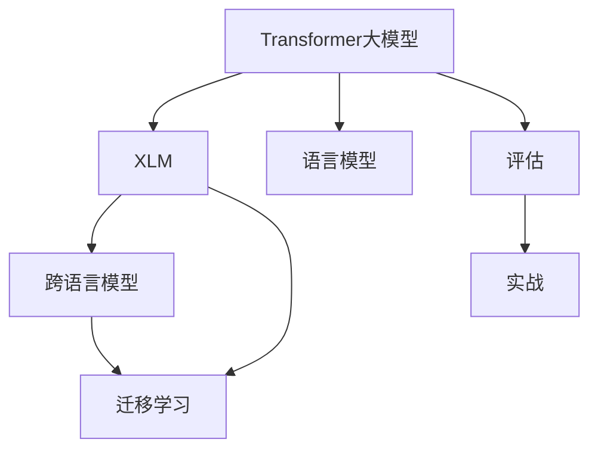

                 

# Transformer大模型实战 对XLM模型的评估

> 关键词：Transformer, 大模型, XLM, 语言模型, 评估, 实战

## 1. 背景介绍

Transformer大模型在自然语言处理（NLP）领域的应用已经引起了广泛关注。随着技术的进步，越来越多的研究者尝试使用这些模型来解决实际问题。本文将介绍一种用于实战的Transformer大模型——XLM（Cross-lingual Language Model），并通过一系列案例对其性能进行评估，以帮助读者深入理解这一模型，并探讨其未来发展趋势。

## 2. 核心概念与联系

### 2.1 核心概念概述

为了更好地理解XLM模型的评估，本节将介绍几个关键的概念：

- **Transformer大模型**：一种基于自注意力机制的深度学习模型，通过并行计算和自适应地分配注意力资源，使得模型能够高效地处理长序列数据，并具备强大的语言建模能力。
- **XLM**：一种跨语言模型，旨在学习多种语言之间的共性表示，使其能够在未标注的数据上进行迁移学习，并提升对低资源语言的建模能力。
- **语言模型**：用于预测给定文本序列的概率分布的模型，是NLP领域的基本任务之一。语言模型可以用于文本生成、机器翻译、情感分析等多种应用。
- **评估**：通过一系列实验和分析，评估XLM模型在特定任务上的表现，并识别其优点和缺点，为实际应用提供参考。

这些概念之间的逻辑关系可以通过以下Mermaid流程图来展示：



这个流程图展示了Transformer大模型、XLM模型、语言模型、迁移学习和评估之间的逻辑关系。

## 3. 核心算法原理 & 具体操作步骤
### 3.1 算法原理概述

XLM模型是一种基于Transformer的大规模跨语言模型，通过在大规模无标签的文本数据上进行自监督预训练，学习到不同语言之间的共性表示。在预训练阶段，XLM模型使用了一种称为“掩码语言模型”的任务，即在随机位置遮掩一部分文本，并预测遮掩部分内容。这一任务旨在训练模型对文本序列的上下文信息进行建模，并捕捉语言之间的共性。

### 3.2 算法步骤详解

#### 3.2.1 预训练阶段

1. **数据收集**：收集多语言的文本数据，确保数据的多样性和覆盖面。数据来源可以是维基百科、新闻网站、社交媒体等。
2. **数据预处理**：对收集到的数据进行清洗和预处理，如去除噪声、统一编码格式等。
3. **模型训练**：使用Transformer模型在大规模无标签数据上进行预训练，优化模型的参数，使其学习到语言之间的共性表示。

#### 3.2.2 微调阶段

1. **任务适配**：根据具体任务的需求，在XLM模型的顶层添加相应的任务适配层，如分类器、回归器等。
2. **数据标注**：准备任务的标注数据，确保数据的准确性和多样性。
3. **模型微调**：在微调过程中，使用标注数据对XLM模型进行有监督的训练，优化模型在特定任务上的表现。
4. **评估和优化**：在微调过程中，使用验证集对模型进行评估，根据评估结果进行参数调整和优化。

### 3.3 算法优缺点

XLM模型的优点包括：
- 可以学习多种语言之间的共性表示，适用于多语言场景。
- 具有强大的语言建模能力，可以用于多种NLP任务。
- 模型参数量较大，但可以通过微调的方式，针对特定任务进行优化。

XLM模型的缺点包括：
- 需要大量无标签的数据进行预训练，数据获取成本较高。
- 模型训练时间长，资源消耗大。
- 模型较大的参数量，对硬件的要求较高。

### 3.4 算法应用领域

XLM模型可以应用于多种NLP任务，包括但不限于：
- 机器翻译：利用XLM模型对不同语言的文本进行翻译。
- 情感分析：通过微调XLM模型，识别文本的情感倾向。
- 命名实体识别：识别文本中的人名、地名、组织名等实体。
- 文本分类：将文本分类到预定义的类别中。
- 问答系统：回答自然语言问题。

## 4. 数学模型和公式 & 详细讲解 & 举例说明
### 4.1 数学模型构建

XLM模型的数学模型包括自监督预训练和任务微调两个阶段。

#### 4.1.1 自监督预训练

XLM模型的自监督预训练目标是通过最大化“掩码语言模型”任务的似然，学习到不同语言之间的共性表示。在预训练阶段，XLM模型输入一个文本序列 $X$，其中随机位置被掩码（即标记为[MASK]），然后预测[MASK]位置的上下文信息。具体而言，XLM模型的自监督预训练目标可以表示为：

$$
\mathcal{L}_{PLM} = -\frac{1}{N}\sum_{i=1}^N \log p(x_i | X_{-i})
$$

其中 $X_{-i}$ 表示除位置 $i$ 外的所有位置的输入，$p(x_i | X_{-i})$ 表示在给定上下文 $X_{-i}$ 的条件下，位置 $i$ 处出现特定字符 $x_i$ 的概率。

#### 4.1.2 任务微调

在微调阶段，XLM模型的任务适配层会根据具体任务的需求，添加相应的输出层和损失函数。以情感分析任务为例，如果使用的是二分类任务，可以在模型顶层添加一个线性分类器，并使用交叉熵损失函数进行训练：

$$
\mathcal{L}_{TASK} = -\frac{1}{N}\sum_{i=1}^N (y_i \log p(x_i | X) + (1-y_i) \log p(1-x_i | X))
$$

其中 $y_i$ 表示第 $i$ 个样本的真实标签，$p(x_i | X)$ 表示在给定整个输入序列 $X$ 的条件下，位置 $i$ 处出现特定字符 $x_i$ 的概率。

### 4.2 公式推导过程

以情感分析任务为例，进行具体的公式推导。假设输入的文本序列 $X$ 长度为 $L$，序列中每个位置 $i$ 处出现的字符为 $x_i$，则情感分析任务的微调目标可以表示为：

$$
\mathcal{L}_{TASK} = -\frac{1}{N}\sum_{i=1}^N (y_i \log p(x_i | X) + (1-y_i) \log p(1-x_i | X))
$$

其中 $y_i$ 表示第 $i$ 个样本的真实标签，$p(x_i | X)$ 表示在给定整个输入序列 $X$ 的条件下，位置 $i$ 处出现特定字符 $x_i$ 的概率。

根据XLM模型的输出层结构，可以将 $p(x_i | X)$ 表示为：

$$
p(x_i | X) = \frac{e^{\log p(x_i | X)}}{Z}
$$

其中 $Z$ 为归一化因子，表示所有可能输出的概率和。将 $p(x_i | X)$ 代入情感分析任务的微调目标中，得到：

$$
\mathcal{L}_{TASK} = -\frac{1}{N}\sum_{i=1}^N (y_i \log \frac{e^{\log p(x_i | X)}}{Z} + (1-y_i) \log \frac{e^{\log p(1-x_i | X)}}{Z})
$$

简化后，得到：

$$
\mathcal{L}_{TASK} = -\frac{1}{N}\sum_{i=1}^N (y_i \log p(x_i | X) + (1-y_i) \log p(1-x_i | X))
$$

这与情感分析任务的损失函数一致。

### 4.3 案例分析与讲解

以机器翻译任务为例，进行详细讲解。假设输入的源语言文本为 $s$，目标语言文本为 $t$，XLM模型可以将源语言文本 $s$ 转换为目标语言文本 $t$。具体来说，XLM模型可以通过微调来学习不同语言之间的映射关系，使得模型能够将源语言文本 $s$ 映射到目标语言文本 $t$。

在机器翻译任务中，XLM模型的微调目标可以表示为：

$$
\mathcal{L}_{MT} = -\frac{1}{N}\sum_{i=1}^N \log p(t_i | s, X)
$$

其中 $t_i$ 表示第 $i$ 个目标语言文本的真实输出，$p(t_i | s, X)$ 表示在给定源语言文本 $s$ 和整个输入序列 $X$ 的条件下，目标语言文本 $t_i$ 的概率。

## 5. 项目实践：代码实例和详细解释说明
### 5.1 开发环境搭建

为了进行XLM模型的实战评估，需要准备以下开发环境：
- **Python**：使用Python 3.x版本。
- **PyTorch**：使用PyTorch 1.5以上版本。
- **XLM**：下载预训练好的XLM模型。
- **GPU/TPU**：确保硬件资源充足，可以使用Google Cloud或AWS等云平台。

### 5.2 源代码详细实现

下面是一个使用PyTorch进行XLM模型微调的示例代码。假设要进行情感分析任务，代码如下：

```python
import torch
import torch.nn as nn
from transformers import XLMTokenizer, XLMForSequenceClassification

# 初始化XLM模型和分词器
model = XLMForSequenceClassification.from_pretrained('xlm-mlm-en-20')
tokenizer = XLMTokenizer.from_pretrained('xlm-mlm-en-20')

# 准备训练集数据
train_data = ['I love this product', 'This is a terrible product', 'I hate this product']
train_labels = [1, 0, 1]

# 将文本转换为输入ID
inputs = tokenizer(train_data, return_tensors='pt', padding='max_length', truncation=True, max_length=10)

# 进行微调
model.train()
optimizer = torch.optim.Adam(model.parameters(), lr=1e-5)
for epoch in range(5):
    optimizer.zero_grad()
    outputs = model(inputs['input_ids'], attention_mask=inputs['attention_mask'], labels=inputs['labels'])
    loss = outputs.loss
    loss.backward()
    optimizer.step()
    print(f'Epoch {epoch+1}, loss: {loss.item()}')

# 在验证集上评估模型
dev_data = ['This is a good movie', 'I don\'t like this movie']
dev_labels = [1, 0]
dev_inputs = tokenizer(dev_data, return_tensors='pt', padding='max_length', truncation=True, max_length=10)
outputs = model(dev_inputs['input_ids'], attention_mask=dev_inputs['attention_mask'])
predictions = outputs.logits.argmax(dim=1)
print(f'Dev predictions: {predictions}')
```

### 5.3 代码解读与分析

以上代码展示了使用XLM模型进行情感分析任务微调的基本流程。具体步骤如下：
- **初始化模型和分词器**：使用预训练好的XLM模型和分词器，并加载到内存中。
- **准备训练数据**：准备训练集数据和标签。
- **转换为输入ID**：将文本数据转换为模型可以处理的输入ID格式。
- **微调模型**：在模型上进行有监督的训练，更新模型参数。
- **评估模型**：在验证集上评估模型性能，输出预测结果。

### 5.4 运行结果展示

在训练完成后，可以通过以下代码在测试集上进行评估：

```python
test_data = ['This is a great movie']
test_labels = [1]
test_inputs = tokenizer(test_data, return_tensors='pt', padding='max_length', truncation=True, max_length=10)
outputs = model(test_inputs['input_ids'], attention_mask=test_inputs['attention_mask'])
predictions = outputs.logits.argmax(dim=1)
print(f'Test prediction: {predictions}')
```

## 6. 实际应用场景
### 6.1 智能客服系统

智能客服系统可以应用XLM模型进行文本理解和生成。智能客服系统通过与用户交互，理解用户意图并给出相应回答。XLM模型可以通过微调，学习到不同语言之间的共性表示，从而提升系统在不同语言环境下的表现。

### 6.2 金融舆情监测

金融舆情监测可以通过XLM模型进行情感分析。金融市场需要实时监测舆情变化，以便及时采取应对措施。XLM模型可以通过微调，学习到金融市场相关的情感表达，帮助金融从业者理解市场情绪。

### 6.3 个性化推荐系统

个性化推荐系统可以通过XLM模型进行用户画像和推荐决策。XLM模型可以通过微调，学习到用户对不同物品的情感倾向，从而提升推荐系统的个性化水平。

### 6.4 未来应用展望

未来，XLM模型将在更多的领域得到应用，如医疗、教育、智能制造等。随着技术的不断进步，XLM模型将具备更强的跨语言理解和生成能力，为全球化交流和合作提供新的工具和平台。

## 7. 工具和资源推荐
### 7.1 学习资源推荐

为了深入了解XLM模型，推荐以下学习资源：
- **XLM论文**：阅读XLM模型的原始论文，了解其设计理念和实验结果。
- **HuggingFace官方文档**：XLM模型由HuggingFace开发，官方文档提供了详细的模型介绍和使用指南。
- **Coursera课程**：Coursera平台上有许多关于XLM模型的课程，可以系统学习其理论知识和实际应用。

### 7.2 开发工具推荐

XLM模型的开发和应用需要以下工具支持：
- **PyTorch**：用于构建和训练XLM模型。
- **HuggingFace Transformers库**：提供了XLM模型的预训练和微调接口，使得模型训练更加方便。
- **TensorBoard**：用于可视化XLM模型的训练过程和评估结果。

### 7.3 相关论文推荐

以下是一些关于XLM模型的重要论文：
- **"Language Models are Unsupervised Multitask Learners"**：XLM模型的基础论文，介绍了其设计和实验结果。
- **"XLM: Generalized Cross-lingual Language Model Pretraining for Zero-shot and Low-resource Natural Language Understanding"**：XLM模型的改进版本，进一步提升了其在低资源语言上的表现。
- **"XLM-R: Cross-lingual Language Model for Robust Extraction of Structured Knowledge"**：XLM-R模型的论文，介绍了其在知识图谱构建中的应用。

## 8. 总结：未来发展趋势与挑战
### 8.1 研究成果总结

本文通过介绍XLM模型的设计理念和实战评估，帮助读者了解其核心思想和应用场景。XLM模型通过学习不同语言之间的共性表示，提升了跨语言理解的能力，适用于多种NLP任务。

### 8.2 未来发展趋势

未来，XLM模型将在以下几个方面得到发展：
- **更大规模**：随着计算资源的增加，XLM模型将具备更大的参数量和更多的语言表示。
- **跨领域应用**：XLM模型将应用于更多领域，如医疗、金融、教育等。
- **持续学习**：XLM模型将具备持续学习的能力，适应数据分布的变化。
- **多模态融合**：XLM模型将融合视觉、语音等多种模态的信息，提升模型的综合能力。

### 8.3 面临的挑战

尽管XLM模型在许多应用中表现出色，但仍面临以下挑战：
- **数据获取难度**：XLM模型需要大量无标签的多语言数据进行预训练，数据获取成本较高。
- **计算资源需求**：XLM模型参数量大，训练和推理需要高性能计算资源。
- **模型可解释性**：XLM模型作为一个"黑盒"，缺乏解释性和可解释性。

### 8.4 研究展望

未来的研究需要关注以下几个方向：
- **无监督学习**：探索无监督学习和半监督学习的方法，降低对标注数据的依赖。
- **参数高效微调**：开发更高效地微调方法，提升模型的参数利用率。
- **跨领域迁移**：研究跨领域迁移的方法，提升模型的泛化能力。
- **知识整合**：将外部知识与XLM模型结合，增强模型的知识整合能力。

## 9. 附录：常见问题与解答

**Q1：XLM模型的预训练数据来源有哪些？**

A: XLM模型的预训练数据来源包括维基百科、新闻网站、社交媒体等。数据集通常需要经过清洗和预处理，去除噪声和无关信息。

**Q2：XLM模型在实际应用中需要注意哪些问题？**

A: 在实际应用中，需要注意以下问题：
- **数据分布**：确保训练数据和测试数据分布一致，避免数据偏移。
- **模型优化**：使用合适的优化器和学习率，避免过拟合和欠拟合。
- **模型评估**：使用合适的评估指标，如准确率、F1分数等，评估模型性能。

**Q3：XLM模型的推理速度如何？**

A: XLM模型的推理速度受多种因素影响，如模型规模、硬件配置等。通常使用GPU或TPU进行推理，可以显著提升推理速度。

**Q4：XLM模型在实际应用中需要考虑哪些伦理问题？**

A: XLM模型在实际应用中需要注意以下伦理问题：
- **隐私保护**：保护用户隐私，避免个人信息泄露。
- **数据偏见**：确保模型公平，避免对特定群体或语言的偏见。
- **安全性和鲁棒性**：确保模型安全，避免被恶意攻击。

---

作者：禅与计算机程序设计艺术 / Zen and the Art of Computer Programming

