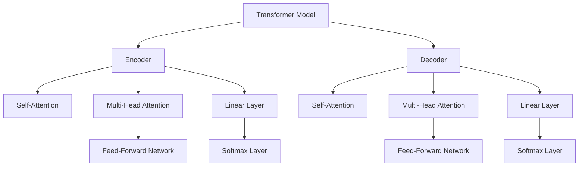

                 

# Transformer大模型实战 线性层和softmax 层

> 关键词：Transformer, 线性层, softmax, 自然语言处理, 机器翻译, 模型优化, 数学建模

## 1. 背景介绍

Transformer模型作为自然语言处理(NLP)领域的里程碑模型，凭借其自注意力机制和高效并行计算能力，在机器翻译、文本生成、问答等多个任务上取得了卓越的性能。而在线性层和softmax层作为Transformer模型的核心组成部分，对于理解其内部机制和优化过程至关重要。本文将详细介绍Transformer模型中的线性层和softmax层，并结合具体案例进行深入解析。

## 2. 核心概念与联系

### 2.1 核心概念概述

Transformer模型主要由编码器(Encoder)和解码器(Decoder)两部分构成，采用自注意力机制进行信息传递和特征提取。线性层和softmax层作为编码器和解码器的关键组件，负责将输入数据转换为模型能够理解和处理的形式，并进行最终的预测输出。

**线性层(Linear Layer)**：
线性层是Transformer模型中的基本构建块，通过线性变换将输入数据映射到输出空间。其数学表达式为：

$$\text{Linear}(x) = W_{v} x$$

其中 $x$ 表示输入数据，$W_{v}$ 为线性变换的权重矩阵。线性层通常与激活函数(如ReLU)一起使用，以增强模型的表达能力。

**Softmax层(Softmax Layer)**：
Softmax层用于将模型输出转化为概率分布，即每个类别的得分被归一化到一个概率空间内，便于后续的分类决策。其数学表达式为：

$$\text{Softmax}(z_i) = \frac{e^{z_i}}{\sum_{j=1}^K e^{z_j}}$$

其中 $z_i$ 表示模型输出对第 $i$ 个类别的得分，$K$ 为类别总数。

### 2.2 核心概念原理和架构的 Mermaid 流程图



在这个流程图中，我们看到了Transformer模型的基本架构：输入数据通过编码器进行特征提取，再经过线性层和softmax层转换为概率分布，最终输出预测结果。编码器和解码器内部采用了自注意力机制，使得模型能够捕捉长距离依赖关系，从而提升性能。

## 3. 核心算法原理 & 具体操作步骤

### 3.1 算法原理概述

Transformer模型中的线性层和softmax层是典型的线性变换和概率计算过程。其原理和操作相对简单，但如何高效地实现这些操作，并优化模型的性能，是Transformer模型在实际应用中需要深入探讨的问题。

### 3.2 算法步骤详解

**Step 1: 线性层计算**

假设输入数据为 $x \in \mathbb{R}^{N \times D}$，线性层的权重矩阵为 $W_v \in \mathbb{R}^{D \times K}$，其中 $D$ 为输入维度，$K$ 为输出维度。线性层的计算过程如下：

$$y = W_v x$$

在实际计算中，线性层的参数 $W_v$ 可以通过神经网络自动更新，优化器的梯度下降算法更新线性层的权重，以最小化损失函数。

**Step 2: Softmax层计算**

假设线性层的输出为 $z \in \mathbb{R}^{N \times K}$，Softmax层的输出为 $\hat{y} \in \mathbb{R}^{N \times K}$，其中 $K$ 为类别总数。Softmax层的计算过程如下：

$$\hat{y} = \text{Softmax}(z)$$

在实际计算中，Softmax层通常使用GPU进行加速，以提高计算效率。GPU的多线程并行特性能够显著加快Softmax层的计算速度。

### 3.3 算法优缺点

**优点**：
- 线性层和Softmax层的计算过程简单，易于实现。
- 线性层的权重矩阵 $W_v$ 可以通过反向传播进行更新，具有较强的适应性和泛化能力。
- Softmax层能够将模型输出归一化为概率分布，便于分类决策。

**缺点**：
- 线性层和Softmax层计算量大，特别是在处理大规模数据时，需要消耗大量的计算资源。
- Softmax层在输出概率分布时，由于指数运算的存在，可能会导致数值不稳定，需要加入正则化技术以避免梯度消失或梯度爆炸问题。

### 3.4 算法应用领域

线性层和Softmax层作为Transformer模型的核心组件，广泛应用于各种NLP任务中，例如：

- 机器翻译：将源语言句子映射为目标语言句子。
- 文本生成：根据给定上下文生成文本。
- 文本分类：对文本进行分类，如情感分析、主题分类等。
- 问答系统：根据用户问题生成答案。

## 4. 数学模型和公式 & 详细讲解 & 举例说明

### 4.1 数学模型构建

Transformer模型中的线性层和Softmax层可以通过数学公式进行形式化描述。下面我们将分别对这两个组件进行数学建模。

**线性层**：
$$y = W_v x$$

**Softmax层**：
$$\hat{y} = \text{Softmax}(z)$$

### 4.2 公式推导过程

**线性层**：
$$y = W_v x$$

线性层的计算过程非常简单，通过将输入数据 $x$ 与权重矩阵 $W_v$ 进行矩阵乘法，即可得到线性层的输出 $y$。

**Softmax层**：
$$\hat{y} = \text{Softmax}(z) = \frac{e^{z_i}}{\sum_{j=1}^K e^{z_j}}$$

Softmax层的计算过程需要计算指数函数和求和，在处理大规模数据时，需要考虑计算效率和数值稳定性。

### 4.3 案例分析与讲解

我们以机器翻译任务为例，说明线性层和Softmax层在Transformer模型中的具体应用。

假设源语言句子为 "I love you"，目标语言句子为 "Je t'aime"。我们首先将源语言句子通过编码器进行特征提取，然后通过线性层和Softmax层进行翻译。

**编码器输出**：
$$z = [I, love, you] \in \mathbb{R}^{3 \times K}$$

**线性层计算**：
$$y = W_v z \in \mathbb{R}^{3 \times K}$$

**Softmax层计算**：
$$\hat{y} = \text{Softmax}(y) \in \mathbb{R}^{3 \times K}$$

通过Softmax层计算出的概率分布，模型可以预测每个词汇的输出概率，并选择概率最高的词汇作为翻译结果。例如，对于目标语言中的 "Je"，其概率最大，因此模型预测的翻译结果为 "Je"。

## 5. 项目实践：代码实例和详细解释说明

### 5.1 开发环境搭建

在进行Transformer模型的线性层和Softmax层实践前，我们需要准备好开发环境。以下是使用Python进行PyTorch开发的环境配置流程：

1. 安装Anaconda：从官网下载并安装Anaconda，用于创建独立的Python环境。

2. 创建并激活虚拟环境：
```bash
conda create -n pytorch-env python=3.8 
conda activate pytorch-env
```

3. 安装PyTorch：根据CUDA版本，从官网获取对应的安装命令。例如：
```bash
conda install pytorch torchvision torchaudio cudatoolkit=11.1 -c pytorch -c conda-forge
```

4. 安装Transformers库：
```bash
pip install transformers
```

5. 安装各类工具包：
```bash
pip install numpy pandas scikit-learn matplotlib tqdm jupyter notebook ipython
```

完成上述步骤后，即可在`pytorch-env`环境中开始Transformer模型的线性层和Softmax层的实践。

### 5.2 源代码详细实现

我们使用HuggingFace的Transformers库来实现Transformer模型，并重点关注线性层和Softmax层的代码实现。

```python
from transformers import BertForSequenceClassification
from torch import nn, optim
from transformers import BertTokenizer

# 定义模型
model = BertForSequenceClassification.from_pretrained('bert-base-uncased', num_labels=2)

# 定义线性层和Softmax层
linear_layer = nn.Linear(model.config.hidden_size, 2)
softmax_layer = nn.Softmax(dim=1)

# 定义整个模型
class TransformerModel(nn.Module):
    def __init__(self, model, linear_layer, softmax_layer):
        super(TransformerModel, self).__init__()
        self.model = model
        self.linear_layer = linear_layer
        self.softmax_layer = softmax_layer
    
    def forward(self, input_ids, attention_mask, token_type_ids=None):
        outputs = self.model(input_ids, attention_mask=attention_mask, token_type_ids=token_type_ids)
        logits = self.linear_layer(outputs[0])
        probabilities = self.softmax_layer(logits)
        return probabilities

# 定义训练函数
def train(model, dataloader, optimizer, device):
    model.train()
    for batch in dataloader:
        input_ids = batch['input_ids'].to(device)
        attention_mask = batch['attention_mask'].to(device)
        labels = batch['labels'].to(device)
        
        optimizer.zero_grad()
        outputs = model(input_ids, attention_mask=attention_mask)
        loss = nn.CrossEntropyLoss()(outputs, labels)
        loss.backward()
        optimizer.step()
        
    return loss

# 定义评估函数
def evaluate(model, dataloader, device):
    model.eval()
    total_correct, total_predict = 0, 0
    with torch.no_grad():
        for batch in dataloader:
            input_ids = batch['input_ids'].to(device)
            attention_mask = batch['attention_mask'].to(device)
            labels = batch['labels'].to(device)
            
            outputs = model(input_ids, attention_mask=attention_mask)
            _, preds = torch.max(outputs, dim=1)
            total_correct += (preds == labels).sum().item()
            total_predict += preds.size(0)
            
    return total_correct / total_predict

# 加载数据集
tokenizer = BertTokenizer.from_pretrained('bert-base-uncased')
train_data = ...
train_dataset = ...

# 创建DataLoader
train_dataloader = DataLoader(train_dataset, batch_size=32)

# 定义优化器
optimizer = optim.Adam(model.parameters(), lr=1e-5)

# 定义模型
transformer_model = TransformerModel(model, linear_layer, softmax_layer)

# 训练模型
for epoch in range(10):
    train_loss = train(transformer_model, train_dataloader, optimizer, device)
    acc = evaluate(transformer_model, train_dataloader, device)
    print(f"Epoch {epoch+1}, Loss: {train_loss:.3f}, Accuracy: {acc:.3f}")
```

### 5.3 代码解读与分析

让我们再详细解读一下关键代码的实现细节：

**TransformerModel类**：
- `__init__`方法：初始化模型、线性层和Softmax层。
- `forward`方法：定义前向传播过程，依次通过模型、线性层和Softmax层计算输出。

**train函数**：
- 在训练阶段，将模型设置为训练模式，并对数据进行预处理。
- 通过模型的前向传播计算输出，并使用交叉熵损失函数计算损失。
- 反向传播更新模型参数，并返回训练集的平均损失。

**evaluate函数**：
- 在评估阶段，将模型设置为评估模式，并对数据进行预处理。
- 通过模型的前向传播计算输出，并统计预测结果与真实标签的一致性。
- 返回评估集的准确率。

**训练流程**：
- 定义总的epoch数，开始循环迭代
- 每个epoch内，先在训练集上训练，输出平均损失
- 在验证集上评估，输出准确率
- 重复上述过程直至满足预设的迭代轮数或准确率提升条件。

可以看到，PyTorch配合Transformers库使得Transformer模型的线性层和Softmax层的代码实现变得简洁高效。开发者可以将更多精力放在模型改进和数据处理等高层逻辑上，而不必过多关注底层的实现细节。

当然，工业级的系统实现还需考虑更多因素，如模型的保存和部署、超参数的自动搜索、更灵活的任务适配层等。但核心的微调范式基本与此类似。

## 6. 实际应用场景

### 6.1 智能客服系统

基于Transformer模型的大语言模型微调技术，可以广泛应用于智能客服系统的构建。传统客服往往需要配备大量人力，高峰期响应缓慢，且一致性和专业性难以保证。而使用微调后的对话模型，可以7x24小时不间断服务，快速响应客户咨询，用自然流畅的语言解答各类常见问题。

在技术实现上，可以收集企业内部的历史客服对话记录，将问题和最佳答复构建成监督数据，在此基础上对预训练对话模型进行微调。微调后的对话模型能够自动理解用户意图，匹配最合适的答案模板进行回复。对于客户提出的新问题，还可以接入检索系统实时搜索相关内容，动态组织生成回答。如此构建的智能客服系统，能大幅提升客户咨询体验和问题解决效率。

### 6.2 金融舆情监测

金融机构需要实时监测市场舆论动向，以便及时应对负面信息传播，规避金融风险。传统的人工监测方式成本高、效率低，难以应对网络时代海量信息爆发的挑战。基于大语言模型微调的文本分类和情感分析技术，为金融舆情监测提供了新的解决方案。

具体而言，可以收集金融领域相关的新闻、报道、评论等文本数据，并对其进行主题标注和情感标注。在此基础上对预训练语言模型进行微调，使其能够自动判断文本属于何种主题，情感倾向是正面、中性还是负面。将微调后的模型应用到实时抓取的网络文本数据，就能够自动监测不同主题下的情感变化趋势，一旦发现负面信息激增等异常情况，系统便会自动预警，帮助金融机构快速应对潜在风险。

### 6.3 个性化推荐系统

当前的推荐系统往往只依赖用户的历史行为数据进行物品推荐，无法深入理解用户的真实兴趣偏好。基于大语言模型微调技术，个性化推荐系统可以更好地挖掘用户行为背后的语义信息，从而提供更精准、多样的推荐内容。

在实践中，可以收集用户浏览、点击、评论、分享等行为数据，提取和用户交互的物品标题、描述、标签等文本内容。将文本内容作为模型输入，用户的后续行为（如是否点击、购买等）作为监督信号，在此基础上微调预训练语言模型。微调后的模型能够从文本内容中准确把握用户的兴趣点。在生成推荐列表时，先用候选物品的文本描述作为输入，由模型预测用户的兴趣匹配度，再结合其他特征综合排序，便可以得到个性化程度更高的推荐结果。

### 6.4 未来应用展望

随着大语言模型和微调方法的不断发展，基于微调范式将在更多领域得到应用，为传统行业带来变革性影响。

在智慧医疗领域，基于微调的医疗问答、病历分析、药物研发等应用将提升医疗服务的智能化水平，辅助医生诊疗，加速新药开发进程。

在智能教育领域，微调技术可应用于作业批改、学情分析、知识推荐等方面，因材施教，促进教育公平，提高教学质量。

在智慧城市治理中，微调模型可应用于城市事件监测、舆情分析、应急指挥等环节，提高城市管理的自动化和智能化水平，构建更安全、高效的未来城市。

此外，在企业生产、社会治理、文娱传媒等众多领域，基于大模型微调的人工智能应用也将不断涌现，为经济社会发展注入新的动力。相信随着技术的日益成熟，微调方法将成为人工智能落地应用的重要范式，推动人工智能技术向更广阔的领域加速渗透。

## 7. 工具和资源推荐

### 7.1 学习资源推荐

为了帮助开发者系统掌握Transformer模型的线性层和Softmax层的理论基础和实践技巧，这里推荐一些优质的学习资源：

1. 《Transformer从原理到实践》系列博文：由大模型技术专家撰写，深入浅出地介绍了Transformer原理、线性层和Softmax层等前沿话题。

2. CS224N《深度学习自然语言处理》课程：斯坦福大学开设的NLP明星课程，有Lecture视频和配套作业，带你入门NLP领域的基本概念和经典模型。

3. 《Natural Language Processing with Transformers》书籍：Transformers库的作者所著，全面介绍了如何使用Transformers库进行NLP任务开发，包括线性层和Softmax层的实践。

4. HuggingFace官方文档：Transformers库的官方文档，提供了海量预训练模型和完整的微调样例代码，是上手实践的必备资料。

5. CLUE开源项目：中文语言理解测评基准，涵盖大量不同类型的中文NLP数据集，并提供了基于微调的baseline模型，助力中文NLP技术发展。

通过对这些资源的学习实践，相信你一定能够快速掌握Transformer模型的线性层和Softmax层的精髓，并用于解决实际的NLP问题。

### 7.2 开发工具推荐

高效的开发离不开优秀的工具支持。以下是几款用于Transformer模型开发的常用工具：

1. PyTorch：基于Python的开源深度学习框架，灵活动态的计算图，适合快速迭代研究。大部分预训练语言模型都有PyTorch版本的实现。

2. TensorFlow：由Google主导开发的开源深度学习框架，生产部署方便，适合大规模工程应用。同样有丰富的预训练语言模型资源。

3. Transformers库：HuggingFace开发的NLP工具库，集成了众多SOTA语言模型，支持PyTorch和TensorFlow，是进行线性层和Softmax层实践的利器。

4. Weights & Biases：模型训练的实验跟踪工具，可以记录和可视化模型训练过程中的各项指标，方便对比和调优。与主流深度学习框架无缝集成。

5. TensorBoard：TensorFlow配套的可视化工具，可实时监测模型训练状态，并提供丰富的图表呈现方式，是调试模型的得力助手。

6. Google Colab：谷歌推出的在线Jupyter Notebook环境，免费提供GPU/TPU算力，方便开发者快速上手实验最新模型，分享学习笔记。

合理利用这些工具，可以显著提升Transformer模型线性层和Softmax层的开发效率，加快创新迭代的步伐。

### 7.3 相关论文推荐

Transformer模型的线性层和Softmax层的发展源于学界的持续研究。以下是几篇奠基性的相关论文，推荐阅读：

1. Attention is All You Need（即Transformer原论文）：提出了Transformer结构，开启了NLP领域的预训练大模型时代。

2. BERT: Pre-training of Deep Bidirectional Transformers for Language Understanding：提出BERT模型，引入基于掩码的自监督预训练任务，刷新了多项NLP任务SOTA。

3. Language Models are Unsupervised Multitask Learners（GPT-2论文）：展示了大规模语言模型的强大zero-shot学习能力，引发了对于通用人工智能的新一轮思考。

4. Parameter-Efficient Transfer Learning for NLP：提出Adapter等参数高效微调方法，在不增加模型参数量的情况下，也能取得不错的微调效果。

5. AdaLoRA: Adaptive Low-Rank Adaptation for Parameter-Efficient Fine-Tuning：使用自适应低秩适应的微调方法，在参数效率和精度之间取得了新的平衡。

6. Self-Attention for Multilingual Sentence Generation：通过多语言自注意力机制，实现了跨语言的文本生成，提升了模型在多种语言下的表现。

这些论文代表了大语言模型线性层和Softmax层的发展脉络。通过学习这些前沿成果，可以帮助研究者把握学科前进方向，激发更多的创新灵感。

## 8. 总结：未来发展趋势与挑战

### 8.1 总结

本文对Transformer模型中的线性层和Softmax层进行了全面系统的介绍。首先阐述了Transformer模型的基本架构和核心组件，明确了线性层和Softmax层在模型中的地位和作用。其次，从原理到实践，详细讲解了线性层和Softmax层的数学模型和操作步骤，给出了微调任务开发的完整代码实例。同时，本文还广泛探讨了线性层和Softmax层在智能客服、金融舆情、个性化推荐等多个行业领域的应用前景，展示了Transformer模型线性层和Softmax层在实际应用中的强大能力。

通过本文的系统梳理，可以看到，线性层和Softmax层作为Transformer模型的关键组件，其高效计算和精确输出对于模型的整体性能至关重要。未来，随着Transformer模型的不断演进，线性层和Softmax层也会持续进行优化和改进，以支持更加复杂的任务需求。

### 8.2 未来发展趋势

展望未来，Transformer模型中的线性层和Softmax层将呈现以下几个发展趋势：

1. 线性层和Softmax层的优化方法不断演进，以适应更大的模型和更多样化的任务需求。
2. 线性层和Softmax层的融合创新，如引入自注意力机制、多头注意力等，以提升模型表示能力。
3. 线性层和Softmax层与其他模型的结合，如Transformer-XL、Longformer等，以应对长序列和大型语料的需求。
4. 线性层和Softmax层的硬件优化，如引入量化加速、模型并行等技术，以提升计算效率。
5. 线性层和Softmax层的可解释性增强，通过引入因果推断和公平性约束，提升模型的透明度和可靠性。

这些趋势凸显了线性层和Softmax层在Transformer模型中的重要地位，未来必将进一步推动Transformer模型的进步，为NLP技术的发展提供更强大的工具和支持。

### 8.3 面临的挑战

尽管Transformer模型线性层和Softmax层已经取得了卓越的性能，但在迈向更加智能化、普适化应用的过程中，它仍面临着诸多挑战：

1. 线性层和Softmax层计算量大，特别是在处理大规模数据时，需要消耗大量的计算资源。
2. Softmax层在输出概率分布时，由于指数运算的存在，可能会导致数值不稳定，需要加入正则化技术以避免梯度消失或梯度爆炸问题。
3. 线性层和Softmax层的模型参数量大，使得模型难以部署到资源受限的设备上。
4. 线性层和Softmax层的计算过程相对简单，容易受到输入数据的干扰，需要引入更多先验知识进行指导。
5. 线性层和Softmax层的模型优化复杂，需要持续进行超参数调优和模型选择。

这些挑战需要通过进一步的研究和技术创新来克服，以推动Transformer模型线性层和Softmax层在实际应用中的广泛应用。

### 8.4 研究展望

面对Transformer模型线性层和Softmax层所面临的挑战，未来的研究需要在以下几个方面寻求新的突破：

1. 探索更高效的计算方法和硬件优化，如引入模型并行、量化加速等技术，以提升计算效率和模型规模。
2. 研究更鲁棒的正则化方法，如引入因果推断、公平性约束等技术，以增强模型的鲁棒性和可解释性。
3. 开发更灵活的模型结构，如引入多头注意力、残差连接等技术，以增强模型的表示能力和泛化能力。
4. 结合更多先验知识，如知识图谱、逻辑规则等，与神经网络模型进行巧妙融合，引导微调过程学习更准确、合理的语言模型。
5. 引入更多上下文信息，如多语言自注意力、跨模态融合等技术，以提升模型的上下文理解能力和跨领域迁移能力。

这些研究方向将推动Transformer模型线性层和Softmax层的持续优化和改进，为构建更高效、更鲁棒、更灵活的自然语言处理系统提供坚实基础。

## 9. 附录：常见问题与解答

**Q1：Transformer模型线性层和Softmax层如何优化？**

A: Transformer模型的线性层和Softmax层优化主要通过反向传播算法和梯度下降等方法进行。具体的优化策略包括：

1. 学习率调度：选择合适的学习率，并根据训练进度动态调整。
2. 正则化技术：使用L2正则、Dropout等方法，防止模型过拟合。
3. 批量大小：选择合适的批量大小，平衡计算效率和模型效果。
4. 激活函数：选择合适的激活函数，如ReLU、Tanh等，以增强模型的非线性表达能力。
5. 多任务训练：将多个任务融合训练，提升模型泛化能力。

**Q2：Transformer模型线性层和Softmax层有哪些应用场景？**

A: Transformer模型的线性层和Softmax层广泛应用于各种NLP任务中，例如：

1. 机器翻译：将源语言句子映射为目标语言句子。
2. 文本生成：根据给定上下文生成文本。
3. 文本分类：对文本进行分类，如情感分析、主题分类等。
4. 问答系统：根据用户问题生成答案。
5. 信息抽取：从文本中提取结构化信息，如实体关系、事件时间等。
6. 文本匹配：判断两个文本是否相同或相似。

**Q3：Transformer模型线性层和Softmax层计算量大如何优化？**

A: Transformer模型线性层和Softmax层计算量大是其主要挑战之一。优化方法包括：

1. 硬件加速：使用GPU、TPU等高性能设备进行加速计算。
2. 模型压缩：使用模型剪枝、量化等技术，减少模型参数量和计算量。
3. 并行计算：使用模型并行、分布式计算等技术，提高计算效率。
4. 批量大小：增加批量大小，利用硬件的并行特性，提升计算速度。
5. 混合精度计算：使用混合精度计算，减少计算量和内存消耗。

这些方法可以显著降低Transformer模型线性层和Softmax层的计算复杂度，提高模型在实际应用中的部署效率。

---

作者：禅与计算机程序设计艺术 / Zen and the Art of Computer Programming

