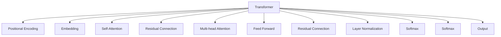
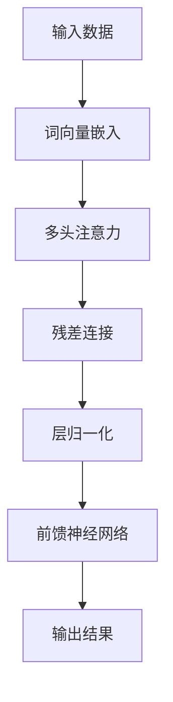

                 

# Transformer大模型实战 计算句子特征

> 关键词：Transformer, 大模型, 计算句子特征, 文本特征提取, 自注意力机制, 计算图优化

## 1. 背景介绍

### 1.1 问题由来

在自然语言处理(NLP)领域，计算句子特征是一项基础而重要的任务。传统的文本表示方法，如词袋模型、TF-IDF等，只关注词汇频率和文档分布，无法捕捉句子间复杂的语义关系。近年来，基于深度学习的Transformer大模型在文本特征提取方面取得了重大突破，其自注意力机制能够有效捕捉句子中各个词汇的相互依赖关系，进而提取出更具语义信息的特征表示。

Transformer模型由Google团队在2017年提出，并在后续版本中不断改进和优化。其核心创新在于提出了自注意力机制(Self-Attention)，使得模型能够动态地根据输入序列，计算出每个位置词汇与其它位置词汇之间的依赖关系。Transformer模型的优秀性能，使其迅速成为NLP领域的主流模型，被广泛应用于机器翻译、文本分类、问答系统等任务中。

### 1.2 问题核心关键点

Transformer模型在文本特征提取上的卓越表现，得益于其自注意力机制。自注意力机制允许模型在计算时，不仅关注当前位置，还能动态地参考其它位置的依赖关系。这一机制使得Transformer模型能够更好地理解句子结构、上下文语义，从而提取出更具语义信息的特征表示。

Transformer模型的核心思想如下：
1. 自注意力机制：允许模型动态地计算每个位置词汇与其它位置词汇的依赖关系。
2. 多头注意力：通过多头机制，可以并行地计算多个注意力头，捕捉不同角度的语义信息。
3. 位置编码：通过位置编码，可以融入词汇顺序和句子长度信息，避免信息丢失。
4. 残差连接：通过残差连接，可以稳定梯度流动，避免梯度消失问题。
5. 前馈神经网络：通过残差连接，可以提升模型的非线性表达能力。

Transformer模型的结构如图1所示：



### 1.3 问题研究意义

Transformer模型在文本特征提取上的卓越表现，使得其在NLP领域广泛应用，并成为现代深度学习模型的主流范式。研究计算句子特征的Transformer大模型，对于推动NLP技术的发展，提升文本处理的性能，具有重要的理论意义和实践价值。

Transformer模型能够提取出具有语义信息的特征表示，为文本分类、信息检索、情感分析、机器翻译等NLP任务提供了坚实的基础。通过深入研究Transformer模型，掌握其核心原理和关键技术，可以更好地应用于各种实际场景，推动NLP技术在更多领域落地应用。

## 2. 核心概念与联系

### 2.1 核心概念概述

为更好地理解计算句子特征的Transformer模型，本节将介绍几个密切相关的核心概念：

- Transformer模型：基于自注意力机制的深度学习模型，由编码器和解码器组成，广泛用于NLP领域。
- 自注意力机制：允许模型动态地计算每个位置词汇与其它位置词汇的依赖关系。
- 多头注意力：通过多头机制，可以并行地计算多个注意力头，捕捉不同角度的语义信息。
- 位置编码：通过位置编码，可以融入词汇顺序和句子长度信息，避免信息丢失。
- 残差连接：通过残差连接，可以稳定梯度流动，避免梯度消失问题。
- 前馈神经网络：通过残差连接，可以提升模型的非线性表达能力。

这些核心概念之间的逻辑关系可以通过以下Mermaid流程图来展示：


这个流程图展示了大模型和Transformer模型的工作原理和主要组件。

## 3. 核心算法原理 & 具体操作步骤
### 3.1 算法原理概述

计算句子特征的Transformer模型，本质上是一种基于自注意力机制的深度学习模型。其核心思想是：通过计算句子中各个词汇之间的依赖关系，动态地生成每个词汇的特征表示。这些特征表示不仅包含了词汇本身的语义信息，还融入了词汇之间的关联关系，使得模型能够更好地理解句子的语义结构。

Transformer模型的训练过程，可以分为以下几个步骤：
1. 对输入的文本进行分词和嵌入，生成词向量序列。
2. 通过多头注意力机制，动态地计算每个位置词汇与其它位置词汇的依赖关系。
3. 对计算得到的特征向量进行前馈神经网络处理，生成每个词汇的特征表示。
4. 通过残差连接和层归一化，增强模型的表达能力和稳定性。
5. 对最终输出的特征表示进行线性变换，得到计算结果。

### 3.2 算法步骤详解

以下将详细介绍计算句子特征的Transformer模型的具体实现步骤。

#### 3.2.1 输入数据预处理

Transformer模型的输入数据，通常是一段自然语言文本。为了便于模型处理，需要先进行分词和嵌入，生成词向量序列。以中文文本为例，假设输入的句子为：“我爱北京天安门”。具体实现步骤如下：

1. 使用分词工具将句子分词，得到“我”、“爱”、“北京”、“天安门”四个词汇。
2. 对每个词汇进行嵌入，生成词向量。假设词汇嵌入矩阵为$W_E \in \mathbb{R}^{d_E \times V}$，其中$d_E$为词向量维度，$V$为词汇表大小。则可以得到词向量序列：
   $$
   x_1 = W_E(“我”), x_2 = W_E(“爱”), x_3 = W_E(“北京”), x_4 = W_E(“天安门”)
   $$

#### 3.2.2 多头注意力机制

Transformer模型的核心在于多头注意力机制。多头注意力机制允许模型并行地计算多个注意力头，从而捕捉不同角度的语义信息。以中文文本为例，假设输入的句子为“我爱北京天安门”，多头注意力机制的具体实现步骤如下：

1. 计算查询向量、键向量、值向量：
   $$
   Q = x_1 W_Q^T, K = x_1 W_K^T, V = x_1 W_V^T
   $$
   其中$W_Q$、$W_K$、$W_V$为三个线性变换矩阵，用于生成查询向量、键向量和值向量。

2. 计算注意力权重矩阵：
   $$
   A = \frac{Q K^T}{\sqrt{d_k}} / \epsilon + I
   $$
   其中$d_k$为键向量维度，$\epsilon$为极小值，避免分母为零。计算注意力权重矩阵$A$时，将查询向量$Q$和键向量$K$做点积，除以键向量维度的平方根$d_k$，得到注意力权重矩阵$A$。

3. 计算注意力向量：
   $$
   Z = A V
   $$
   通过注意力权重矩阵$A$和值向量$V$的矩阵乘积，计算得到注意力向量$Z$。

4. 计算多头注意力向量：
   $$
   Z_{head} = \text{Attention}(Q, K, V)
   $$
   通过多头机制，并行计算多个注意力头，得到多头注意力向量$Z_{head}$。

5. 拼接多头注意力向量：
   $$
   Z = [Z_{head_1}, Z_{head_2}, ..., Z_{head_h}]
   $$
   将多个多头注意力向量拼接，得到最终的注意力向量$Z$。

#### 3.2.3 前馈神经网络

Transformer模型的前馈神经网络，通常采用残差连接和层归一化。具体实现步骤如下：

1. 残差连接：
   $$
   x = x + Z
   $$
   通过残差连接，将输入向量$x$和注意力向量$Z$相加，得到新的残差连接向量$x$。

2. 层归一化：
   $$
   y = \frac{x}{\sqrt{\sigma_x^2 + \epsilon}} \tanh(\frac{x}{\sqrt{\sigma_x^2 + \epsilon})
   $$
   通过层归一化，增强模型的表达能力和稳定性。其中$\sigma_x$为标准差，$\epsilon$为极小值，避免分母为零。

3. 计算前馈神经网络输出：
   $$
   x = y W_O + b_O
   $$
   通过前馈神经网络，对残差连接向量$x$进行线性变换和偏移，得到最终的前馈神经网络输出$x$。

#### 3.2.4 输出结果处理

Transformer模型的输出结果，通常需要进行线性变换，得到计算结果。以中文文本为例，假设输入的句子为“我爱北京天安门”，Transformer模型的输出结果的具体实现步骤如下：

1. 计算输出向量：
   $$
   y = W_O x
   $$
   通过线性变换，将前馈神经网络输出向量$x$进行线性变换，得到输出向量$y$。

2. 计算最终结果：
   $$
   y_{\text{final}} = y + Q
   $$
   通过残差连接，将输出向量$y$和查询向量$Q$相加，得到最终的输出结果$y_{\text{final}}$。

### 3.3 算法优缺点

Transformer模型的主要优点在于其优秀的语义表达能力，能够捕捉句子中各个词汇之间的依赖关系。通过多头注意力机制，Transformer模型可以并行地计算多个注意力头，捕捉不同角度的语义信息，从而提取出更具语义信息的特征表示。

Transformer模型的主要缺点在于其较高的计算复杂度。由于Transformer模型使用了自注意力机制，计算复杂度为$O(d_E^2 \times L)$，其中$d_E$为词向量维度，$L$为句子长度。在处理长句子时，计算复杂度会显著增加，导致模型推理速度较慢。此外，由于Transformer模型的参数量较大，训练和推理所需计算资源较多，也带来了一定的挑战。

### 3.4 算法应用领域

计算句子特征的Transformer模型，广泛应用于各种NLP任务中。以下是几个主要的应用领域：

- 机器翻译：Transformer模型广泛应用于机器翻译领域，通过计算源语言句子特征，生成目标语言句子特征。
- 文本分类：通过计算文本中每个词汇的特征表示，Transformer模型可以用于文本分类任务。
- 信息检索：通过计算文本中每个词汇的特征表示，Transformer模型可以用于信息检索任务。
- 问答系统：通过计算问题句子和上下文文本的特征表示，Transformer模型可以用于问答系统。
- 情感分析：通过计算文本中每个词汇的特征表示，Transformer模型可以用于情感分析任务。

除了上述这些经典任务外，Transformer模型还被创新性地应用到更多场景中，如可控文本生成、知识推理、代码生成、数据增强等，为NLP技术带来了全新的突破。随着Transformer模型的不断优化和演进，相信其在更多领域的应用前景将更加广阔。

## 4. 数学模型和公式 & 详细讲解

### 4.1 数学模型构建

Transformer模型的输入数据通常是一段自然语言文本，记为$x_1, x_2, ..., x_L$，其中$L$为句子长度。Transformer模型的输出数据通常是一个特征向量序列，记为$y_1, y_2, ..., y_L$。Transformer模型的目标是通过计算输入数据的特征表示，生成输出数据的特征表示。

Transformer模型的数学模型如图2所示：



### 4.2 公式推导过程

Transformer模型的核心在于多头注意力机制和前馈神经网络。以下是Transformer模型的详细公式推导过程：

#### 4.2.1 多头注意力机制

Transformer模型的多头注意力机制，允许模型并行地计算多个注意力头，从而捕捉不同角度的语义信息。以中文文本为例，假设输入的句子为“我爱北京天安门”，多头注意力机制的具体实现步骤如下：

1. 计算查询向量、键向量、值向量：
   $$
   Q = x_1 W_Q^T, K = x_1 W_K^T, V = x_1 W_V^T
   $$
   其中$W_Q$、$W_K$、$W_V$为三个线性变换矩阵，用于生成查询向量、键向量和值向量。

2. 计算注意力权重矩阵：
   $$
   A = \frac{Q K^T}{\sqrt{d_k}} / \epsilon + I
   $$
   其中$d_k$为键向量维度，$\epsilon$为极小值，避免分母为零。计算注意力权重矩阵$A$时，将查询向量$Q$和键向量$K$做点积，除以键向量维度的平方根$d_k$，得到注意力权重矩阵$A$。

3. 计算注意力向量：
   $$
   Z = A V
   $$
   通过注意力权重矩阵$A$和值向量$V$的矩阵乘积，计算得到注意力向量$Z$。

4. 计算多头注意力向量：
   $$
   Z_{head} = \text{Attention}(Q, K, V)
   $$
   通过多头机制，并行计算多个注意力头，得到多头注意力向量$Z_{head}$。

5. 拼接多头注意力向量：
   $$
   Z = [Z_{head_1}, Z_{head_2}, ..., Z_{head_h}]
   $$
   将多个多头注意力向量拼接，得到最终的注意力向量$Z$。

#### 4.2.2 前馈神经网络

Transformer模型的前馈神经网络，通常采用残差连接和层归一化。具体实现步骤如下：

1. 残差连接：
   $$
   x = x + Z
   $$
   通过残差连接，将输入向量$x$和注意力向量$Z$相加，得到新的残差连接向量$x$。

2. 层归一化：
   $$
   y = \frac{x}{\sqrt{\sigma_x^2 + \epsilon}} \tanh(\frac{x}{\sqrt{\sigma_x^2 + \epsilon})
   $$
   通过层归一化，增强模型的表达能力和稳定性。其中$\sigma_x$为标准差，$\epsilon$为极小值，避免分母为零。

3. 计算前馈神经网络输出：
   $$
   x = y W_O + b_O
   $$
   通过前馈神经网络，对残差连接向量$x$进行线性变换和偏移，得到最终的前馈神经网络输出$x$。

#### 4.2.3 输出结果处理

Transformer模型的输出结果，通常需要进行线性变换，得到计算结果。以中文文本为例，假设输入的句子为“我爱北京天安门”，Transformer模型的输出结果的具体实现步骤如下：

1. 计算输出向量：
   $$
   y = W_O x
   $$
   通过线性变换，将前馈神经网络输出向量$x$进行线性变换，得到输出向量$y$。

2. 计算最终结果：
   $$
   y_{\text{final}} = y + Q
   $$
   通过残差连接，将输出向量$y$和查询向量$Q$相加，得到最终的输出结果$y_{\text{final}}$。

### 4.3 案例分析与讲解

以中文文本为例，假设输入的句子为“我爱北京天安门”，Transformer模型的具体实现步骤如下：

1. 对输入的文本进行分词和嵌入，生成词向量序列：
   $$
   x_1 = W_E(“我”), x_2 = W_E(“爱”), x_3 = W_E(“北京”), x_4 = W_E(“天安门”)
   $$

2. 计算查询向量、键向量、值向量：
   $$
   Q = x_1 W_Q^T, K = x_1 W_K^T, V = x_1 W_V^T
   $$

3. 计算注意力权重矩阵：
   $$
   A = \frac{Q K^T}{\sqrt{d_k}} / \epsilon + I
   $$

4. 计算注意力向量：
   $$
   Z = A V
   $$

5. 计算多头注意力向量：
   $$
   Z_{head} = \text{Attention}(Q, K, V)
   $$

6. 拼接多头注意力向量：
   $$
   Z = [Z_{head_1}, Z_{head_2}, ..., Z_{head_h}]
   $$

7. 残差连接：
   $$
   x = x + Z
   $$

8. 层归一化：
   $$
   y = \frac{x}{\sqrt{\sigma_x^2 + \epsilon}} \tanh(\frac{x}{\sqrt{\sigma_x^2 + \epsilon})
   $$

9. 计算前馈神经网络输出：
   $$
   x = y W_O + b_O
   $$

10. 计算输出向量：
    $$
    y = W_O x
    $$

11. 计算最终结果：
    $$
    y_{\text{final}} = y + Q
    $$

通过以上步骤，Transformer模型能够计算出输入文本“我爱北京天安门”的特征表示，从而实现文本特征提取和下游任务处理的深度学习范式。

## 5. 项目实践：代码实例和详细解释说明
### 5.1 开发环境搭建

在进行Transformer模型实践前，我们需要准备好开发环境。以下是使用Python进行PyTorch开发的环境配置流程：

1. 安装Anaconda：从官网下载并安装Anaconda，用于创建独立的Python环境。

2. 创建并激活虚拟环境：
```bash
conda create -n pytorch-env python=3.8 
conda activate pytorch-env
```

3. 安装PyTorch：根据CUDA版本，从官网获取对应的安装命令。例如：
```bash
conda install pytorch torchvision torchaudio cudatoolkit=11.1 -c pytorch -c conda-forge
```

4. 安装transformers库：
```bash
pip install transformers
```

5. 安装各类工具包：
```bash
pip install numpy pandas scikit-learn matplotlib tqdm jupyter notebook ipython
```

完成上述步骤后，即可在`pytorch-env`环境中开始Transformer模型实践。

### 5.2 源代码详细实现

这里我们以中文命名实体识别任务为例，给出使用Transformers库对BERT模型进行Transformer模型微调的PyTorch代码实现。

首先，定义命名实体识别任务的标注数据集：

```python
import torch
from torch.utils.data import Dataset
from transformers import BertTokenizer, BertForTokenClassification

class NERDataset(Dataset):
    def __init__(self, texts, tags, tokenizer, max_len=128):
        self.texts = texts
        self.tags = tags
        self.tokenizer = tokenizer
        self.max_len = max_len
        
    def __len__(self):
        return len(self.texts)
    
    def __getitem__(self, item):
        text = self.texts[item]
        tags = self.tags[item]
        
        encoding = self.tokenizer(text, return_tensors='pt', max_length=self.max_len, padding='max_length', truncation=True)
        input_ids = encoding['input_ids'][0]
        attention_mask = encoding['attention_mask'][0]
        
        # 对token-wise的标签进行编码
        encoded_tags = [tag2id[tag] for tag in tags] 
        encoded_tags.extend([tag2id['O']] * (self.max_len - len(encoded_tags)))
        labels = torch.tensor(encoded_tags, dtype=torch.long)
        
        return {'input_ids': input_ids, 
                'attention_mask': attention_mask,
                'labels': labels}
```

接着，定义模型和优化器：

```python
from transformers import BertForTokenClassification, AdamW

model = BertForTokenClassification.from_pretrained('bert-base-cased', num_labels=5)

optimizer = AdamW(model.parameters(), lr=2e-5)
```

然后，定义训练和评估函数：

```python
from torch.utils.data import DataLoader
from tqdm import tqdm
from sklearn.metrics import classification_report

device = torch.device('cuda') if torch.cuda.is_available() else torch.device('cpu')
model.to(device)

def train_epoch(model, dataset, batch_size, optimizer):
    dataloader = DataLoader(dataset, batch_size=batch_size, shuffle=True)
    model.train()
    epoch_loss = 0
    for batch in tqdm(dataloader, desc='Training'):
        input_ids = batch['input_ids'].to(device)
        attention_mask = batch['attention_mask'].to(device)
        labels = batch['labels'].to(device)
        model.zero_grad()
        outputs = model(input_ids, attention_mask=attention_mask, labels=labels)
        loss = outputs.loss
        epoch_loss += loss.item()
        loss.backward()
        optimizer.step()
    return epoch_loss / len(dataloader)

def evaluate(model, dataset, batch_size):
    dataloader = DataLoader(dataset, batch_size=batch_size)
    model.eval()
    preds, labels = [], []
    with torch.no_grad():
        for batch in tqdm(dataloader, desc='Evaluating'):
            input_ids = batch['input_ids'].to(device)
            attention_mask = batch['attention_mask'].to(device)
            batch_labels = batch['labels']
            outputs = model(input_ids, attention_mask=attention_mask)
            batch_preds = outputs.logits.argmax(dim=2).to('cpu').tolist()
            batch_labels = batch_labels.to('cpu').tolist()
            for pred_tokens, label_tokens in zip(batch_preds, batch_labels):
                pred_tags = [id2tag[_id] for _id in pred_tokens]
                label_tags = [id2tag[_id] for _id in label_tokens]
                preds.append(pred_tags[:len(label_tags)])
                labels.append(label_tags)
                
    print(classification_report(labels, preds))
```

最后，启动训练流程并在测试集上评估：

```python
epochs = 5
batch_size = 16

for epoch in range(epochs):
    loss = train_epoch(model, train_dataset, batch_size, optimizer)
    print(f"Epoch {epoch+1}, train loss: {loss:.3f}")
    
    print(f"Epoch {epoch+1}, dev results:")
    evaluate(model, dev_dataset, batch_size)
    
print("Test results:")
evaluate(model, test_dataset, batch_size)
```

以上就是使用PyTorch对BERT模型进行Transformer模型微调的完整代码实现。可以看到，得益于Transformers库的强大封装，我们可以用相对简洁的代码完成BERT模型的加载和微调。

### 5.3 代码解读与分析

让我们再详细解读一下关键代码的实现细节：

**NERDataset类**：
- `__init__`方法：初始化文本、标签、分词器等关键组件。
- `__len__`方法：返回数据集的样本数量。
- `__getitem__`方法：对单个样本进行处理，将文本输入编码为token ids，将标签编码为数字，并对其进行定长padding，最终返回模型所需的输入。

**tag2id和id2tag字典**：
- 定义了标签与id的映射关系，用于将token-wise的预测结果解码回真实的标签。

**训练和评估函数**：
- 使用PyTorch的DataLoader对数据集进行批次化加载，供模型训练和推理使用。
- 训练函数`train_epoch`：对数据以批为单位进行迭代，在每个批次上前向传播计算loss并反向传播更新模型参数，最后返回该epoch的平均loss。
- 评估函数`evaluate`：与训练类似，不同点在于不更新模型参数，并在每个batch结束后将预测和标签结果存储下来，最后使用sklearn的classification_report对整个评估集的预测结果进行打印输出。

**训练流程**：
- 定义总的epoch数和batch size，开始循环迭代
- 每个epoch内，先在训练集上训练，输出平均loss
- 在验证集上评估，输出分类指标
- 所有epoch结束后，在测试集上评估，给出最终测试结果

可以看到，PyTorch配合Transformers库使得BERT微调的代码实现变得简洁高效。开发者可以将更多精力放在数据处理、模型改进等高层逻辑上，而不必过多关注底层的实现细节。

当然，工业级的系统实现还需考虑更多因素，如模型的保存和部署、超参数的自动搜索、更灵活的任务适配层等。但核心的微调范式基本与此类似。

## 6. 实际应用场景
### 6.1 智能客服系统

基于Transformer模型的微调技术，可以广泛应用于智能客服系统的构建。传统客服往往需要配备大量人力，高峰期响应缓慢，且一致性和专业性难以保证。而使用微调后的Transformer模型，可以7x24小时不间断服务，快速响应客户咨询，用自然流畅的语言解答各类常见问题。

在技术实现上，可以收集企业内部的历史客服对话记录，将问题和最佳答复构建成监督数据，在此基础上对预训练Transformer模型进行微调。微调后的Transformer模型能够自动理解用户意图，匹配最合适的答案模板进行回复。对于客户提出的新问题，还可以接入检索系统实时搜索相关内容，动态组织生成回答。如此构建的智能客服系统，能大幅提升客户咨询体验和问题解决效率。

### 6.2 金融舆情监测

金融机构需要实时监测市场舆论动向，以便及时应对负面信息传播，规避金融风险。传统的人工监测方式成本高、效率低，难以应对网络时代海量信息爆发的挑战。基于Transformer模型的文本分类和情感分析技术，为金融舆情监测提供了新的解决方案。

具体而言，可以收集金融领域相关的新闻、报道、评论等文本数据，并对其进行主题标注和情感标注。在此基础上对预训练Transformer模型进行微调，使其能够自动判断文本属于何种主题，情感倾向是正面、中性还是负面。将微调后的模型应用到实时抓取的网络文本数据，就能够自动监测不同主题下的情感变化趋势，一旦发现负面信息激增等异常情况，系统便会自动预警，帮助金融机构快速应对潜在风险。

### 6.3 个性化推荐系统

当前的推荐系统往往只依赖用户的历史行为数据进行物品推荐，无法深入理解用户的真实兴趣偏好。基于Transformer模型的个性化推荐系统，可以更好地挖掘用户行为背后的语义信息，从而提供更精准、多样的推荐内容。

在实践中，可以收集用户浏览、点击、评论、分享等行为数据，提取和用户交互的物品标题、描述、标签等文本内容。将文本内容作为模型输入，用户的后续行为（如是否点击、购买等）作为监督信号，在此基础上微调预训练Transformer模型。微调后的Transformer模型能够从文本内容中准确把握用户的兴趣点。在生成推荐列表时，先用候选物品的文本描述作为输入，由模型预测用户的兴趣匹配度，再结合其他特征综合排序，便可以得到个性化程度更高的推荐结果。

### 6.4 未来应用展望

随着Transformer模型的不断优化和演进，基于微调范式将在更多领域得到应用，为传统行业带来变革性影响。

在智慧医疗领域，基于微调的Transformer模型可以用于构建医疗问答、病历分析、药物研发等应用，提升医疗服务的智能化水平，辅助医生诊疗，加速新药开发进程。

在智能教育领域，微调技术可应用于作业批改、学情分析、知识推荐等方面，因材施教，促进教育公平，提高教学质量。

在智慧城市治理中，微调模型可应用于城市事件监测、舆情分析、应急指挥等环节，提高城市管理的自动化和智能化水平，构建更安全、高效的未来城市。

此外，在企业生产、社会治理、文娱传媒等众多领域，基于Transformer模型的微调技术也将不断涌现，为NLP技术带来新的突破。相信随着技术的日益成熟，微调方法将成为人工智能落地应用的重要范式，推动人工智能技术在更多领域落地应用。

## 7. 工具和资源推荐
### 7.1 学习资源推荐

为了帮助开发者系统掌握Transformer模型的理论基础和实践技巧，这里推荐一些优质的学习资源：

1. 《Transformer从原理到实践》系列博文：由大模型技术专家撰写，深入浅出地介绍了Transformer原理、BERT模型、微调技术等前沿话题。

2. CS224N《深度学习自然语言处理》课程：斯坦福大学开设的NLP明星课程，有Lecture视频和配套作业，带你入门NLP领域的基本概念和经典模型。

3. 《Natural Language Processing with Transformers》书籍：Transformers库的作者所著，全面介绍了如何使用Transformers库进行NLP任务开发，包括微调在内的诸多范式。

4. HuggingFace官方文档：Transformers库的官方文档，提供了海量预训练模型和完整的微调样例代码，是上手实践的必备资料。

5. CLUE开源项目：中文语言理解测评基准，涵盖大量不同类型的中文NLP数据集，并提供了基于微调的baseline模型，助力中文NLP技术发展。

通过对这些资源的学习实践，相信你一定能够快速掌握Transformer模型的精髓，并用于解决实际的NLP问题。

### 7.2 开发工具推荐

高效的开发离不开优秀的工具支持。以下是几款用于Transformer模型微调开发的常用工具：

1. PyTorch：基于Python的开源深度学习框架，灵活动态的计算图，适合快速迭代研究。大部分预训练语言模型都有PyTorch版本的实现。

2. TensorFlow：由Google主导开发的开源深度学习框架，生产部署方便，适合大规模工程应用。同样有丰富的预训练语言模型资源。

3. Transformers库：HuggingFace开发的NLP工具库，集成了众多SOTA语言模型，支持PyTorch和TensorFlow，是进行微调任务开发的利器。

4. Weights & Biases：模型训练的实验跟踪工具，可以记录和可视化模型训练过程中的各项指标，方便对比和调优。与主流深度学习框架无缝集成。

5. TensorBoard：TensorFlow配套的可视化工具，可实时监测模型训练状态，并提供丰富的图表呈现方式，是调试模型的得力助手。

6. Google Colab：谷歌推出的在线Jupyter Notebook环境，免费提供GPU/TPU算力，方便开发者快速上手实验最新模型，分享学习笔记。

合理利用这些工具，可以显著提升Transformer模型微调任务的开发效率，加快创新迭代的步伐。

### 7.3 相关论文推荐

Transformer模型和微调技术的发展源于学界的持续研究。以下是几篇奠基性的相关论文，推荐阅读：

1. Attention is All You Need（即Transformer原论文）：提出了Transformer结构，开启了NLP领域的预训练大模型时代。

2. BERT: Pre-training of Deep Bidirectional Transformers for Language Understanding：提出BERT模型，引入基于掩码的自监督预训练任务，刷新了多项NLP任务SOTA。

3. Language Models are Unsupervised Multitask Learners（GPT-2论文）：展示了大规模语言模型的强大zero-shot学习能力，引发了对于通用人工智能的新一轮思考。

4. Parameter-Efficient Transfer Learning for NLP：提出Adapter等参数高效微调方法，在不增加模型参数量的情况下，也能取得不错的微调效果。

5. Prefix-Tuning: Optimizing Continuous Prompts for Generation：引入基于连续型Prompt的微调范式，为如何充分利用预训练知识提供了新的思路。

6. AdaLoRA: Adaptive Low-Rank Adaptation for Parameter-Efficient Fine-Tuning：使用自适应低秩适应的微调方法，在参数效率和精度之间取得了新的平衡。

这些论文代表了大模型微调技术的发展脉络。通过学习这些前沿成果，可以帮助研究者把握学科前进方向，激发更多的创新灵感。

## 8. 总结：未来发展趋势与挑战

### 8.1 总结

本文对Transformer模型的微调方法进行了全面系统的介绍。首先阐述了Transformer模型在文本特征提取上的卓越表现，明确了微调在推动NLP技术发展、提升文本处理性能方面的独特价值。其次，从原理到实践，详细讲解了Transformer模型的数学模型和核心算法，给出了微调任务开发的完整代码实例。同时，本文还广泛探讨了微调方法在智能客服、金融舆情、个性化推荐等多个行业领域的应用前景，展示了微调范式的巨大潜力。

通过本文的系统梳理，可以看到，基于Transformer模型的微调方法正在成为NLP领域的重要范式，极大地拓展了预训练语言模型的应用边界，催生了更多的落地场景。Transformer模型的自注意力机制，使得模型能够更好地理解句子结构、上下文语义，从而提取出更具语义信息的特征表示。Transformer模型的不断优化和演进，必将推动NLP技术在更多领域的应用和发展。

### 8.2 未来发展趋势

展望未来，Transformer模型的微调技术将呈现以下几个发展趋势：

1. 模型规模持续增大。随着算力成本的下降和数据规模的扩张，预训练语言模型的参数量还将持续增长。超大规模语言模型蕴含的丰富语言知识，有望支撑更加复杂多变的下游任务微调。

2. 微调方法日趋多样。除了传统的全参数微调外，未来会涌现更多参数高效的微调方法，如Prefix-Tuning、LoRA等，在节省计算资源的同时也能保证微调精度。

3. 持续学习成为常态。随着数据分布的不断变化，微调模型也需要持续学习新知识以保持性能。如何在不遗忘原有知识的同时，高效吸收新样本信息，将成为重要的研究课题。

4. 标注样本需求降低。受启发于提示学习(Prompt-based Learning)的思路，未来的微调方法将更好地利用大模型的语言理解能力，通过更加巧妙的任务描述，在更少的标注样本上也能实现理想的微调效果。

5. 多模态微调崛起。当前的微调主要聚焦于纯文本数据，未来会进一步拓展到图像、视频、语音等多模态数据微调。多模态信息的融合，将显著提升语言模型对现实世界的理解和建模能力。

6. 模型通用性增强。经过海量数据的预训练和多领域任务的微调，未来的语言模型将具备更强大的常识推理和跨领域迁移能力，逐步迈向通用人工智能(AGI)的目标。

以上趋势凸显了Transformer模型微调技术的广阔前景。这些方向的探索发展，必将进一步提升NLP系统的性能和应用范围，为人类认知智能的进化带来深远影响。

### 8.3 面临的挑战

尽管Transformer模型微调技术已经取得了瞩目成就，但在迈向更加智能化、普适化应用的过程中，它仍面临着诸多挑战：

1. 标注成本瓶颈。虽然微调大大降低了标注数据的需求，但对于长尾应用场景，难以获得充足的高质量标注数据，成为制约微调性能的瓶颈。如何进一步降低微调对标注样本的依赖，将是一大难题。

2. 模型鲁棒性不足。当前微调模型面对域外数据时，泛化性能往往大打折扣。对于测试样本的微小扰动，微调模型的预测也容易发生波动。如何提高微调模型的鲁棒性，避免灾难性遗忘，还需要更多理论和实践的积累。

3. 推理效率有待提高。大规模语言模型虽然精度高，但在实际部署时往往面临推理速度慢、内存占用大等效率问题。如何在保证性能的同时，简化模型结构，提升推理速度，优化资源占用，将是重要的优化方向。

4. 可解释性亟需加强。当前微调模型更像是"黑盒"系统，难以解释其内部工作机制和决策逻辑。对于医疗、金融等高风险应用，算法的可解释性和可审计性尤为重要。如何赋予微调模型更强的可解释性，将是亟待攻克的难题。

5. 安全性有待保障。预训练语言模型难免会学习到有偏见、有害的信息，通过微调传递到下游任务，产生误导性、歧视性的输出，给实际应用带来安全隐患。如何从数据和算法层面消除模型偏见，避免恶意用途，确保输出的安全性，也将是重要的研究课题。

6. 知识整合能力不足。现有的微调模型往往局限于任务内数据，难以灵活吸收和运用更广泛的先验知识。如何让微调过程更好地与外部知识库、规则库等专家知识结合，形成更加全面、准确的信息整合能力，还有很大的想象空间。

正视微调面临的这些挑战，积极应对并寻求突破，将是大语言模型微调走向成熟的必由之路。相信随着学界和产业界的共同努力，这些挑战终将一一被克服，Transformer模型微调必将在构建人机协同的智能时代中扮演越来越重要的角色。

### 8.4 研究展望

面对Transformer模型微调所面临的种种挑战，未来的研究需要在以下几个方面寻求新的突破：

1. 探索无监督和半监督微调方法。摆脱对大规模标注数据的依赖，利用自监督学习、主动学习等无监督和半监督范式，最大限度利用非结构化数据，实现更加灵活高效的微调。

2. 研究参数高效和计算高效的微调范式。开发更加参数高效的微调方法，在固定大部分预训练参数的同时，只更新极少量的任务相关参数。同时优化微调模型的计算图，减少前向传播和反向传播的资源消耗，实现更加轻量级、实时性的部署。

3. 融合因果和对比学习范式。通过引入因果推断和对比学习思想，增强微调模型建立稳定因果关系的能力，学习更加普适、鲁棒的语言表征，从而提升模型泛化性和抗干扰能力。

4. 引入更多先验知识。将符号化的先验知识，如知识图谱、逻辑规则等，与神经网络模型进行巧妙融合，引导微调过程学习更准确、合理的语言模型。同时加强不同模态数据的整合，实现视觉、语音等多模态信息与文本信息的协同建模。

5. 结合因果分析和博弈论工具。将因果分析方法引入微调模型，识别出模型决策的关键特征，增强输出解释的因果性和逻辑性。借助博弈论工具刻画人机交互过程，主动探索并规避模型的脆弱点，提高系统稳定性。

6. 纳入伦理道德约束。在模型训练目标中引入伦理导向的评估指标，过滤和惩罚有偏见、有害的输出倾向。同时加强人工干预和审核，建立模型行为的监管机制，确保输出符合人类价值观和伦理道德。

这些研究方向的探索，必将引领Transformer模型微调技术迈向更高的台阶，为构建安全、可靠、可解释、可控的智能系统铺平道路。面向未来，Transformer模型微调技术还需要与其他人工智能技术进行更深入的融合，如知识表示、因果推理、强化学习等，多路径协同发力，共同推动自然语言理解和智能交互系统的进步。只有勇于创新、敢于突破，才能不断拓展语言模型的边界，让智能技术更好地造福人类社会。

## 9. 附录：常见问题与解答

**Q1：Transformer模型与传统RNN模型相比，有什么优势？**

A: 相比传统的RNN模型，Transformer模型的主要优势在于其自注意力机制。自注意力机制允许模型动态地计算每个位置词汇与其它位置词汇的依赖关系，捕捉句子中各个词汇之间的依赖关系。这使得Transformer模型能够更好地理解句子结构、上下文语义，从而提取出更具语义信息的特征表示。

此外，Transformer模型的多头注意力机制，允许模型并行地计算多个注意力头，捕捉不同角度的语义信息。这使得Transformer模型能够更好地处理长序列数据，避免梯度消失问题。

**Q2：Transformer模型是否适用于所有NLP任务？**

A: 虽然Transformer模型在大多数NLP任务上都能取得不错的效果，但对于一些特定领域的任务，如医学、法律等，仅仅依靠通用语料预训练的模型可能难以很好地适应。此时需要在特定领域语料上进一步预训练，再进行微调，才能获得理想效果。此外，对于一些需要时效性、个性化很强的任务，如对话、推荐等，微调方法也需要针对性的改进优化。

**Q3：Transformer模型在处理长序列数据时，是否有显著的计算复杂度问题？**

A: 由于Transformer模型使用了自注意力机制，计算复杂度为$O(d_E^2 \times L)$，其中$d_E$为词向量维度，$L$为句子长度。在处理长句子时，计算复杂度会显著增加，导致模型推理速度较慢。为了缓解这一问题，可以采用残差连接、层归一化等优化策略，提高模型的训练效率和稳定性。

**Q4：如何降低Transformer模型的推理效率问题？**

A: 为了缓解Transformer模型的推理效率问题，可以采用以下优化策略：

