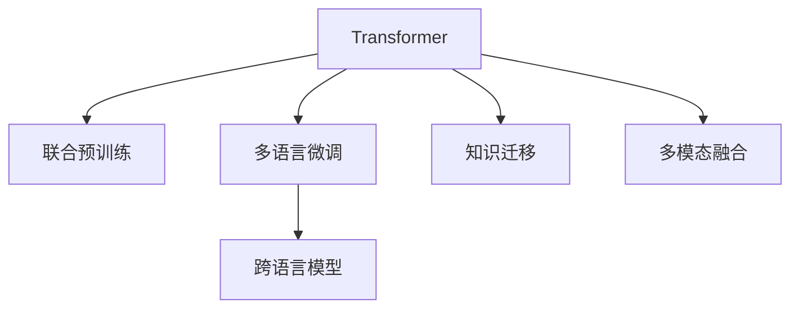

                 

# Transformer大模型实战 跨语言模型

> 关键词：Transformer, 跨语言模型, 大规模预训练, 自然语言处理(NLP), 语言生成, 机器翻译, 语音识别, 多模态融合, 模型压缩, 分布式训练, 开源项目

## 1. 背景介绍

### 1.1 问题由来

随着深度学习技术的发展，Transformer大模型在自然语言处理(NLP)领域取得了突破性进展。Transformer通过自注意力机制，能够处理长序列信息，并具备自回归或自编码的能力。这使得它在语言生成、机器翻译、语音识别等多模态任务上表现出色。

然而，尽管Transformer大模型在单语言处理上表现优异，但在跨语言应用中，依然面临诸多挑战。不同语言之间的语法、语义差异较大，直接将多语言数据混合输入Transformer模型进行预训练，容易导致模型性能下降。同时，预训练过程中数据分布的不均衡，也可能使得模型在特定语言上的表现不佳。

为应对这些挑战，学术界和工业界提出了跨语言模型(Cross-Language Model)的概念。跨语言模型通过多语言的联合预训练和微调，能够在不同语言之间共享知识，提升模型的跨语言能力和泛化能力。

### 1.2 问题核心关键点

跨语言模型的核心在于通过多语言的联合预训练，学习跨语言的共性表示，同时在特定语言上微调，以提升该语言模型的性能。具体来说，关键点包括：

- 联合预训练：在多语言数据上进行预训练，学习跨语言的共性表示。
- 多语言微调：在特定语言上微调，提升该语言模型的性能。
- 知识迁移：通过预训练过程中学习到的跨语言知识，提升模型的泛化能力。
- 多模态融合：结合视觉、语音等多模态信息，提升模型的跨语言理解能力。

这些关键点共同构成了跨语言模型的核心框架，使得模型能够在大规模预训练和微调过程中，充分利用跨语言的语义信息，提升模型在不同语言上的表现。

## 2. 核心概念与联系

### 2.1 核心概念概述

为更好地理解跨语言模型的核心概念，本节将介绍几个密切相关的核心概念：

- Transformer：一种基于自注意力机制的深度学习模型，用于处理序列数据，包括文本、语音等。Transformer通过多头自注意力机制，能够并行计算，大大提升了模型的训练和推理速度。

- 跨语言模型(Cross-Language Model)：通过多语言的联合预训练，学习跨语言的共性表示，并在特定语言上微调，提升模型性能的模型。

- 联合预训练(Joint Pre-training)：在多语言数据上进行预训练，学习跨语言的共性表示。

- 多语言微调(Multi-Language Fine-Tuning)：在特定语言上微调，提升该语言模型的性能。

- 知识迁移(Knowledge Transfer)：通过预训练过程中学习到的跨语言知识，提升模型的泛化能力。

- 多模态融合(Multimodal Fusion)：结合视觉、语音等多模态信息，提升模型的跨语言理解能力。

这些核心概念之间的逻辑关系可以通过以下Mermaid流程图来展示：



这个流程图展示了大语言模型和跨语言模型的核心概念及其之间的关系：

1. 通过Transformer进行多语言联合预训练。
2. 在特定语言上微调，提升语言模型性能。
3. 通过知识迁移，共享跨语言知识。
4. 结合多模态信息，提升跨语言理解能力。

这些概念共同构成了跨语言模型的学习和应用框架，使其能够在大规模预训练和微调过程中，充分利用跨语言的语义信息，提升模型在不同语言上的表现。

## 3. 核心算法原理 & 具体操作步骤
### 3.1 算法原理概述

跨语言模型的核心算法原理基于Transformer的结构，通过多语言的联合预训练和多语言的微调，学习跨语言的共性表示。其核心思想是：通过多语言的联合预训练，学习不同语言之间的共性表示，然后在特定语言上微调，提升该语言模型的性能。

### 3.2 算法步骤详解

跨语言模型的操作步骤可以分为以下几个步骤：

**Step 1: 准备预训练数据集**
- 收集不同语言的语料，如英文、中文、阿拉伯语等。
- 确保各语言数据分布均衡，避免某些语言数据过多的情况。
- 对于文本数据，进行分词、编码等预处理，确保格式一致。

**Step 2: 构建联合预训练模型**
- 在多语言数据上进行预训练，使用自回归或自编码任务进行预训练。
- 使用语言建模任务（如掩码语言模型）进行多语言联合预训练。
- 引入跨语言知识（如语言之间的相似性、语法结构等）进行联合预训练。

**Step 3: 多语言微调**
- 在特定语言上微调，如在中文上进行微调。
- 收集该语言的标注数据集，划分为训练集、验证集和测试集。
- 设计合适的输出层和损失函数，如交叉熵损失。

**Step 4: 多模态融合**
- 结合视觉、语音等多模态信息，提升模型的跨语言理解能力。
- 对于文本、语音、图像等多模态数据，设计合适的编码器进行融合。

**Step 5: 模型部署与优化**
- 在实际应用场景中，进行模型的部署和优化。
- 优化模型推理速度和内存占用，进行模型压缩、量化等操作。
- 利用分布式训练等技术，提升模型的训练效率。

### 3.3 算法优缺点

跨语言模型具有以下优点：

- 提升跨语言能力：通过多语言联合预训练，模型能够在不同语言之间共享知识，提升跨语言能力。
- 提高泛化能力：多语言联合预训练过程能够学习到跨语言的共性表示，提升模型的泛化能力。
- 减少标注成本：在特定语言上微调时，标注成本较低，能够快速提升模型在该语言上的性能。

同时，跨语言模型也存在以下缺点：

- 数据标注困难：不同语言之间的语法、语义差异较大，标注数据获取成本较高。
- 模型复杂度增加：多语言联合预训练和多语言微调增加了模型的复杂度，训练和推理成本较高。
- 模型通用性不足：不同语言之间的差异较大，跨语言模型的泛化能力可能不足。

尽管存在这些局限性，但就目前而言，跨语言模型仍是实现多语言自然语言处理任务的重要范式。未来相关研究的重点在于如何进一步降低标注数据依赖，提高模型的跨语言迁移能力和泛化能力，同时兼顾模型复杂度和计算效率等因素。

### 3.4 算法应用领域

跨语言模型在多语言自然语言处理任务中具有广泛的应用前景，以下是几个主要应用领域：

- 机器翻译：将一种语言的文本翻译成另一种语言。多语言联合预训练和多语言微调能够提升模型的翻译质量。
- 跨语言命名实体识别：识别不同语言中的命名实体，如人名、地名等。多语言联合预训练能够提升模型的跨语言识别能力。
- 跨语言问答系统：在多语言环境中构建问答系统，帮助用户解答不同语言的疑问。多语言联合预训练和多语言微调能够提升系统的准确性和覆盖面。
- 跨语言情感分析：分析不同语言中的文本情感，如情感分类、情感强度等。多语言联合预训练能够提升模型的情感理解能力。
- 跨语言推荐系统：在多语言环境中推荐商品、文章等内容，提升推荐效果。多语言联合预训练能够提升模型的推荐能力。

这些应用领域展示了跨语言模型在自然语言处理中的广泛应用前景，预示着跨语言自然语言处理技术的广阔发展空间。

## 4. 数学模型和公式 & 详细讲解 & 举例说明
### 4.1 数学模型构建

在跨语言模型中，常用的数学模型包括语言建模模型和联合预训练模型。以下将详细介绍这两种模型的构建方法。

#### 4.1.1 语言建模模型

语言建模模型用于学习语言的共性表示，通常使用自回归或自编码任务进行预训练。以自回归语言建模为例，其目标是通过历史词汇预测下一个词汇的概率。假设文本数据为 $D=\{(x_i, y_i)\}_{i=1}^N$，其中 $x_i$ 为输入文本，$y_i$ 为输出文本。定义模型 $M_{\theta}$ 在输入文本 $x$ 上的输出概率分布为 $P(y|x)$，则语言建模任务的目标是最大化 $P(y|x)$。

假设 $M_{\theta}$ 为Transformer模型，则其概率分布可以表示为：

$$
P(y|x) = \frac{exp(\theta^T \phi(x, y))}{\sum_{y' \in \mathcal{V}} exp(\theta^T \phi(x, y'))}
$$

其中 $\theta$ 为模型参数，$\phi$ 为Transformer模型中的多头自注意力机制。

#### 4.1.2 联合预训练模型

联合预训练模型用于学习跨语言的共性表示，通常使用掩码语言模型任务进行预训练。假设多语言数据为 $D=\{(x_i, y_i)\}_{i=1}^N$，其中 $x_i$ 为输入文本，$y_i$ 为输出文本。定义模型 $M_{\theta}$ 在输入文本 $x$ 上的输出概率分布为 $P(y|x)$，则联合预训练任务的目标是最大化 $P(y|x)$。

假设 $M_{\theta}$ 为Transformer模型，则其概率分布可以表示为：

$$
P(y|x) = \frac{exp(\theta^T \phi(x, y))}{\sum_{y' \in \mathcal{V}} exp(\theta^T \phi(x, y'))}
$$

其中 $\theta$ 为模型参数，$\phi$ 为Transformer模型中的多头自注意力机制。

### 4.2 公式推导过程

以下分别对语言建模模型和联合预训练模型的概率分布公式进行推导。

#### 4.2.1 语言建模模型概率推导

以自回归语言建模为例，假设模型 $M_{\theta}$ 在输入文本 $x$ 上的输出概率分布为 $P(y|x)$，则其概率分布可以表示为：

$$
P(y|x) = \frac{exp(\theta^T \phi(x, y))}{\sum_{y' \in \mathcal{V}} exp(\theta^T \phi(x, y'))}
$$

其中 $\theta$ 为模型参数，$\phi$ 为Transformer模型中的多头自注意力机制。

#### 4.2.2 联合预训练模型概率推导

以掩码语言模型为例，假设多语言数据为 $D=\{(x_i, y_i)\}_{i=1}^N$，其中 $x_i$ 为输入文本，$y_i$ 为输出文本。定义模型 $M_{\theta}$ 在输入文本 $x$ 上的输出概率分布为 $P(y|x)$，则其概率分布可以表示为：

$$
P(y|x) = \frac{exp(\theta^T \phi(x, y))}{\sum_{y' \in \mathcal{V}} exp(\theta^T \phi(x, y'))}
$$

其中 $\theta$ 为模型参数，$\phi$ 为Transformer模型中的多头自注意力机制。

### 4.3 案例分析与讲解

以多语言联合预训练为例，假设有多语言数据 $D=\{(x_i, y_i)\}_{i=1}^N$，其中 $x_i$ 为输入文本，$y_i$ 为输出文本。假设语言建模模型为 $M_{\theta}$，其概率分布可以表示为：

$$
P(y|x) = \frac{exp(\theta^T \phi(x, y))}{\sum_{y' \in \mathcal{V}} exp(\theta^T \phi(x, y'))}
$$

其中 $\theta$ 为模型参数，$\phi$ 为Transformer模型中的多头自注意力机制。

在联合预训练过程中，需要设计合适的任务，如掩码语言模型、跨语言相似性学习等，来学习跨语言的共性表示。以掩码语言模型为例，其任务为：

$$
\max_{\theta} \frac{1}{N} \sum_{i=1}^N \log P(y_i|x_i)
$$

在训练过程中，使用多语言的联合数据进行预训练，即：

$$
\max_{\theta} \frac{1}{N} \sum_{i=1}^N \log P(y_i|x_i) + \lambda \mathcal{L}_{cross}
$$

其中 $\mathcal{L}_{cross}$ 为跨语言的相似性学习损失函数。

通过联合预训练过程，模型能够学习到不同语言之间的共性表示，从而提升模型的泛化能力和跨语言迁移能力。

## 5. 项目实践：代码实例和详细解释说明
### 5.1 开发环境搭建

在进行跨语言模型实践前，我们需要准备好开发环境。以下是使用Python进行PyTorch开发的环境配置流程：

1. 安装Anaconda：从官网下载并安装Anaconda，用于创建独立的Python环境。

2. 创建并激活虚拟环境：
```bash
conda create -n pytorch-env python=3.8 
conda activate pytorch-env
```

3. 安装PyTorch：根据CUDA版本，从官网获取对应的安装命令。例如：
```bash
conda install pytorch torchvision torchaudio cudatoolkit=11.1 -c pytorch -c conda-forge
```

4. 安装Transformer库：
```bash
pip install transformers
```

5. 安装各类工具包：
```bash
pip install numpy pandas scikit-learn matplotlib tqdm jupyter notebook ipython
```

完成上述步骤后，即可在`pytorch-env`环境中开始跨语言模型实践。

### 5.2 源代码详细实现

下面我们以多语言联合预训练为例，给出使用Transformers库对BERT模型进行联合预训练的PyTorch代码实现。

首先，定义多语言联合预训练的数据处理函数：

```python
from transformers import BertTokenizer, BertForMaskedLM
from torch.utils.data import Dataset
import torch

class MultiLangDataset(Dataset):
    def __init__(self, texts, targets, tokenizer, max_len=128):
        self.texts = texts
        self.targets = targets
        self.tokenizer = tokenizer
        self.max_len = max_len
        
    def __len__(self):
        return len(self.texts)
    
    def __getitem__(self, item):
        text = self.texts[item]
        target = self.targets[item]
        
        encoding = self.tokenizer(text, return_tensors='pt', max_length=self.max_len, padding='max_length', truncation=True)
        input_ids = encoding['input_ids'][0]
        attention_mask = encoding['attention_mask'][0]
        
        return {'input_ids': input_ids, 
                'attention_mask': attention_mask,
                'targets': target}
```

然后，定义联合预训练模型和优化器：

```python
from transformers import BertTokenizer
from transformers import BertForMaskedLM, AdamW
from torch.utils.data import DataLoader

tokenizer = BertTokenizer.from_pretrained('bert-base-cased')
model = BertForMaskedLM.from_pretrained('bert-base-cased')

optimizer = AdamW(model.parameters(), lr=2e-5)
```

接着，定义联合预训练过程：

```python
device = torch.device('cuda') if torch.cuda.is_available() else torch.device('cpu')
model.to(device)

train_dataset = MultiLangDataset(train_texts, train_targets, tokenizer)
dev_dataset = MultiLangDataset(dev_texts, dev_targets, tokenizer)
test_dataset = MultiLangDataset(test_texts, test_targets, tokenizer)

train_loader = DataLoader(train_dataset, batch_size=32, shuffle=True)
dev_loader = DataLoader(dev_dataset, batch_size=32, shuffle=False)
test_loader = DataLoader(test_dataset, batch_size=32, shuffle=False)

for epoch in range(10):
    model.train()
    for batch in train_loader:
        input_ids = batch['input_ids'].to(device)
        attention_mask = batch['attention_mask'].to(device)
        targets = batch['targets'].to(device)
        
        model.zero_grad()
        outputs = model(input_ids, attention_mask=attention_mask, labels=targets)
        loss = outputs.loss
        loss.backward()
        optimizer.step()
        
    model.eval()
    with torch.no_grad():
        dev_loss = 0
        for batch in dev_loader:
            input_ids = batch['input_ids'].to(device)
            attention_mask = batch['attention_mask'].to(device)
            targets = batch['targets'].to(device)
            
            outputs = model(input_ids, attention_mask=attention_mask, labels=targets)
            loss = outputs.loss
            dev_loss += loss.item()
        print(f'Epoch {epoch+1}, dev loss: {dev_loss/len(dev_loader):.4f}')
        
print('Training complete.')
```

以上就是使用PyTorch对BERT模型进行多语言联合预训练的完整代码实现。可以看到，Transformer库的强大封装使得联合预训练的代码实现变得简洁高效。

### 5.3 代码解读与分析

让我们再详细解读一下关键代码的实现细节：

**MultiLangDataset类**：
- `__init__`方法：初始化文本、目标、分词器等关键组件。
- `__len__`方法：返回数据集的样本数量。
- `__getitem__`方法：对单个样本进行处理，将文本输入编码为token ids，将目标编码为数字，并对其进行定长padding，最终返回模型所需的输入。

**联合预训练过程**：
- 使用PyTorch的DataLoader对数据集进行批次化加载，供模型训练和推理使用。
- 在每个epoch内，模型先进入训练模式，对数据集进行前向传播和反向传播更新模型参数，再进入评估模式，在验证集上评估模型性能。

**模型训练与评估**：
- 使用AdamW优化器，设定合适的学习率，进行模型训练。
- 在训练过程中，使用交叉熵损失函数，通过前向传播和反向传播更新模型参数。
- 在每个epoch结束后，在验证集上评估模型性能，打印out验证集的损失值。

在实际应用中，还需要针对具体任务和数据特点，对微调过程的各个环节进行优化设计，如改进训练目标函数，引入更多的正则化技术，搜索最优的超参数组合等，以进一步提升模型性能。

## 6. 实际应用场景
### 6.1 机器翻译

跨语言模型在机器翻译中具有广泛的应用。通过多语言联合预训练，模型能够学习到不同语言之间的共性表示，提升模型的翻译质量和泛化能力。

在实践中，可以收集多语言的新闻、书籍、文章等语料，将其作为联合预训练的数据集。在联合预训练过程中，引入跨语言相似性学习任务，如语言相似性预测、跨语言共性表示学习等。预训练完成后，在特定语言上微调，使用少量标注数据进行微调，提升该语言模型的翻译质量。

### 6.2 跨语言命名实体识别

跨语言模型在命名实体识别任务中也有很好的表现。通过多语言联合预训练，模型能够学习到不同语言中命名实体的共性表示，提升模型的跨语言识别能力。

在实践中，可以收集多语言的新闻、维基百科、论文等语料，将其作为联合预训练的数据集。在联合预训练过程中，引入跨语言命名实体识别任务，如跨语言命名实体标签预测等。预训练完成后，在特定语言上微调，使用少量标注数据进行微调，提升该语言模型的命名实体识别能力。

### 6.3 跨语言问答系统

跨语言问答系统能够回答多语言的自然语言问题，提升用户的多语言交互体验。通过多语言联合预训练，模型能够学习到不同语言之间的共性表示，提升模型的跨语言理解能力。

在实践中，可以收集多语言的问答数据，如中文、英文、阿拉伯语等语料，将其作为联合预训练的数据集。在联合预训练过程中，引入跨语言问答任务，如跨语言问答对预测等。预训练完成后，在特定语言上微调，使用少量标注数据进行微调，提升该语言模型的问答能力。

### 6.4 跨语言情感分析

跨语言情感分析能够分析不同语言中的文本情感，如情感分类、情感强度等。通过多语言联合预训练，模型能够学习到不同语言之间的情感共性表示，提升模型的跨语言情感分析能力。

在实践中，可以收集多语言的情感语料，如电影评论、社交媒体评论等，将其作为联合预训练的数据集。在联合预训练过程中，引入跨语言情感分类任务，如跨语言情感分类预测等。预训练完成后，在特定语言上微调，使用少量标注数据进行微调，提升该语言模型的情感分析能力。

### 6.5 跨语言推荐系统

跨语言推荐系统能够在多语言环境中推荐商品、文章等内容，提升推荐效果。通过多语言联合预训练，模型能够学习到不同语言之间的共性表示，提升模型的跨语言推荐能力。

在实践中，可以收集多语言的商品、文章等语料，将其作为联合预训练的数据集。在联合预训练过程中，引入跨语言推荐任务，如跨语言推荐系统构建等。预训练完成后，在特定语言上微调，使用少量标注数据进行微调，提升该语言模型的推荐能力。

### 6.6 未来应用展望

随着跨语言模型的不断发展，其应用领域将越来越广泛，为多语言自然语言处理带来新的突破。

在智慧医疗领域，跨语言模型能够帮助医生跨越语言障碍，提高诊疗效率和质量。

在智能教育领域，跨语言模型能够帮助学生跨越语言障碍，提高学习效果。

在智慧城市治理中，跨语言模型能够帮助政府跨越语言障碍，提高治理效率和效果。

此外，在企业生产、社会治理、文娱传媒等众多领域，跨语言模型的应用也将不断涌现，为经济社会发展注入新的动力。相信随着技术的日益成熟，跨语言模型必将在多语言自然语言处理领域发挥更大的作用，推动自然语言处理技术的产业化进程。

## 7. 工具和资源推荐
### 7.1 学习资源推荐

为了帮助开发者系统掌握跨语言模型的理论基础和实践技巧，这里推荐一些优质的学习资源：

1. 《Transformer大模型实战》系列博文：由大模型技术专家撰写，深入浅出地介绍了Transformer原理、跨语言模型、联合预训练等前沿话题。

2. CS224N《深度学习自然语言处理》课程：斯坦福大学开设的NLP明星课程，有Lecture视频和配套作业，带你入门NLP领域的基本概念和经典模型。

3. 《Natural Language Processing with Transformers》书籍：Transformers库的作者所著，全面介绍了如何使用Transformers库进行NLP任务开发，包括跨语言模型在内的诸多范式。

4. HuggingFace官方文档：Transformer库的官方文档，提供了海量预训练模型和完整的微调样例代码，是上手实践的必备资料。

5. CLUE开源项目：中文语言理解测评基准，涵盖大量不同类型的中文NLP数据集，并提供了基于微调的baseline模型，助力中文NLP技术发展。

通过对这些资源的学习实践，相信你一定能够快速掌握跨语言模型的精髓，并用于解决实际的NLP问题。
###  7.2 开发工具推荐

高效的开发离不开优秀的工具支持。以下是几款用于跨语言模型微调开发的常用工具：

1. PyTorch：基于Python的开源深度学习框架，灵活动态的计算图，适合快速迭代研究。大部分预训练语言模型都有PyTorch版本的实现。

2. TensorFlow：由Google主导开发的开源深度学习框架，生产部署方便，适合大规模工程应用。同样有丰富的预训练语言模型资源。

3. Transformers库：HuggingFace开发的NLP工具库，集成了众多SOTA语言模型，支持PyTorch和TensorFlow，是进行跨语言模型微调开发的利器。

4. Weights & Biases：模型训练的实验跟踪工具，可以记录和可视化模型训练过程中的各项指标，方便对比和调优。与主流深度学习框架无缝集成。

5. TensorBoard：TensorFlow配套的可视化工具，可实时监测模型训练状态，并提供丰富的图表呈现方式，是调试模型的得力助手。

6. Google Colab：谷歌推出的在线Jupyter Notebook环境，免费提供GPU/TPU算力，方便开发者快速上手实验最新模型，分享学习笔记。

合理利用这些工具，可以显著提升跨语言模型微调任务的开发效率，加快创新迭代的步伐。

### 7.3 相关论文推荐

跨语言模型和联合预训练技术的发展源于学界的持续研究。以下是几篇奠基性的相关论文，推荐阅读：

1. Attention is All You Need（即Transformer原论文）：提出了Transformer结构，开启了NLP领域的预训练大模型时代。

2. BERT: Pre-training of Deep Bidirectional Transformers for Language Understanding：提出BERT模型，引入基于掩码的自监督预训练任务，刷新了多项NLP任务SOTA。

3. Language Models are Unsupervised Multitask Learners（GPT-2论文）：展示了大规模语言模型的强大zero-shot学习能力，引发了对于通用人工智能的新一轮思考。

4. Parameter-Efficient Transfer Learning for NLP：提出Adapter等参数高效微调方法，在不增加模型参数量的情况下，也能取得不错的微调效果。

5. Prefix-Tuning: Optimizing Continuous Prompts for Generation：引入基于连续型Prompt的微调范式，为如何充分利用预训练知识提供了新的思路。

6. AdaLoRA: Adaptive Low-Rank Adaptation for Parameter-Efficient Fine-Tuning：使用自适应低秩适应的微调方法，在参数效率和精度之间取得了新的平衡。

这些论文代表了大语言模型和联合预训练技术的发展脉络。通过学习这些前沿成果，可以帮助研究者把握学科前进方向，激发更多的创新灵感。

## 8. 总结：未来发展趋势与挑战

### 8.1 总结

本文对基于Transformer的跨语言模型进行了全面系统的介绍。首先阐述了跨语言模型的研究背景和意义，明确了跨语言模型在多语言自然语言处理任务中的重要价值。其次，从原理到实践，详细讲解了联合预训练和多语言微调的过程，给出了跨语言模型微调的完整代码实例。同时，本文还广泛探讨了跨语言模型在机器翻译、命名实体识别、问答系统等众多NLP任务中的应用前景，展示了跨语言模型的广阔应用前景。此外，本文精选了跨语言模型的各类学习资源，力求为读者提供全方位的技术指引。

通过本文的系统梳理，可以看到，跨语言模型在多语言自然语言处理领域具有广阔的应用前景，预示着多语言自然语言处理技术的巨大发展潜力。

### 8.2 未来发展趋势

展望未来，跨语言模型将呈现以下几个发展趋势：

1. 联合预训练的范式将持续扩展。未来将有更多联合预训练任务和任务层面的联合预训练方法，学习到更为丰富的跨语言共性表示。

2. 多语言微调的灵活性将提升。未来的跨语言模型将支持多种微调范式，如Adapter、Prompt等，实现更加灵活高效的微调。

3. 跨语言模型的应用场景将拓展。除了传统的语言处理任务，跨语言模型还将广泛应用于多模态信息融合、跨语言生成、跨语言推理等新领域。

4. 跨语言模型的计算效率将提升。未来的跨语言模型将通过模型压缩、量化等技术，实现更高效的推理速度和更低的计算成本。

5. 跨语言模型的知识迁移能力将增强。未来的跨语言模型将通过引入外部知识库、规则库等专家知识，提升模型的知识迁移能力。

这些趋势凸显了跨语言模型在自然语言处理中的广阔前景。这些方向的探索发展，必将进一步提升跨语言模型的性能和应用范围，为自然语言处理技术的产业化进程注入新的活力。

### 8.3 面临的挑战

尽管跨语言模型在多语言自然语言处理任务中已经取得了显著进展，但在迈向更加智能化、普适化应用的过程中，它仍面临诸多挑战：

1. 多语言数据获取困难。不同语言之间的语法、语义差异较大，标注数据获取成本较高。如何进一步降低标注数据依赖，提高数据获取效率，将是重要研究方向。

2. 模型复杂度增加。联合预训练和多语言微调增加了模型的复杂度，训练和推理成本较高。如何降低模型复杂度，提高计算效率，将是重要研究方向。

3. 模型泛化能力不足。跨语言模型的泛化能力可能不足，在特定语言上的表现不佳。如何提升模型的泛化能力，增强模型的跨语言迁移能力，将是重要研究方向。

4. 模型知识迁移能力不足。跨语言模型在迁移过程中可能丢失部分知识，导致迁移能力不足。如何提高模型的知识迁移能力，提升模型的跨语言理解能力，将是重要研究方向。

5. 多模态融合的挑战。跨语言模型的多模态融合问题较为复杂，如何实现视觉、语音等多模态信息的有效融合，提升跨语言理解能力，将是重要研究方向。

这些挑战凸显了跨语言模型在多语言自然语言处理领域仍需进一步突破的方向。未来需要结合更多前沿技术，如知识表示、因果推理、多模态融合等，进一步提升跨语言模型的性能和应用范围。

### 8.4 研究展望

面对跨语言模型所面临的诸多挑战，未来的研究需要在以下几个方面寻求新的突破：

1. 探索无监督和半监督跨语言预训练方法。摆脱对大规模标注数据的依赖，利用自监督学习、主动学习等无监督和半监督范式，最大限度利用非结构化数据，实现更加灵活高效的跨语言预训练。

2. 研究多模态跨语言融合方法。结合视觉、语音等多模态信息，提升模型的跨语言理解能力。

3. 引入更多先验知识。将符号化的先验知识，如知识图谱、逻辑规则等，与神经网络模型进行巧妙融合，引导跨语言预训练过程学习更准确、合理的语言模型。

4. 引入因果分析和博弈论工具。将因果分析方法引入跨语言预训练模型，识别出模型决策的关键特征，增强输出解释的因果性和逻辑性。

5. 纳入伦理道德约束。在模型训练目标中引入伦理导向的评估指标，过滤和惩罚有偏见、有害的输出倾向。同时加强人工干预和审核，建立模型行为的监管机制，确保输出符合人类价值观和伦理道德。

这些研究方向将进一步推动跨语言模型的研究进展，提升跨语言模型的性能和应用范围，为多语言自然语言处理技术的产业化进程注入新的动力。

## 9. 附录：常见问题与解答

**Q1：跨语言模型是否适用于所有NLP任务？**

A: 跨语言模型在大多数NLP任务上都能取得不错的效果，特别是对于数据量较小的任务。但对于一些特定领域的任务，如医学、法律等，直接使用跨语言模型可能无法满足特定领域的需求。此时需要在特定领域语料上进一步进行联合预训练，再进行微调，才能获得理想效果。此外，对于一些需要时效性、个性化很强的任务，如对话、推荐等，跨语言模型也需要针对性的改进优化。

**Q2：联合预训练过程中如何选择任务？**

A: 联合预训练过程中，任务的选择至关重要。理想的任务应该能够涵盖不同语言的共性表示，如语言相似性预测、跨语言共性表示学习等。同时，任务的选择也应该考虑到其可扩展性和可操作性，以便于在大规模数据上进行训练。此外，任务的选择还应该考虑到其与目标任务的关联性，以便于模型的迁移。

**Q3：跨语言模型在实际应用中需要注意哪些问题？**

A: 跨语言模型在实际应用中，还需要注意以下问题：

1. 数据标注困难：不同语言之间的语法、语义差异较大，标注数据获取成本较高。如何进一步降低标注数据依赖，提高数据获取效率，将是重要研究方向。

2. 模型复杂度增加：联合预训练和多语言微调增加了模型的复杂度，训练和推理成本较高。如何降低模型复杂度，提高计算效率，将是重要研究方向。

3. 模型泛化能力不足：跨语言模型的泛化能力可能不足，在特定语言上的表现不佳。如何提升模型的泛化能力，增强模型的跨语言迁移能力，将是重要研究方向。

4. 模型知识迁移能力不足：跨语言模型在迁移过程中可能丢失部分知识，导致迁移能力不足。如何提高模型的知识迁移能力，提升模型的跨语言理解能力，将是重要研究方向。

5. 多模态融合的挑战：跨语言模型的多模态融合问题较为复杂，如何实现视觉、语音等多模态信息的有效融合，提升跨语言理解能力，将是重要研究方向。

这些挑战凸显了跨语言模型在多语言自然语言处理领域仍需进一步突破的方向。未来需要结合更多前沿技术，如知识表示、因果推理、多模态融合等，进一步提升跨语言模型的性能和应用范围。

**Q4：跨语言模型在实际应用中应该如何进行优化？**

A: 跨语言模型在实际应用中，可以通过以下几个方面进行优化：

1. 数据预处理：对数据进行清洗、去重、标注等预处理，提高数据质量。

2. 模型压缩：通过模型剪枝、量化等技术，降低模型复杂度，提高计算效率。

3. 分布式训练：利用分布式训练技术，提升模型训练速度和效率。

4. 参数高效微调：采用 Adapter、Prompt等参数高效微调方法，减少微调过程中参数量，提升模型效率。

5. 多语言微调：在特定语言上微调，提升该语言模型的性能。

6. 多模态融合：结合视觉、语音等多模态信息，提升模型的跨语言理解能力。

这些优化措施将进一步提升跨语言模型的性能和应用范围，为多语言自然语言处理技术的产业化进程注入新的动力。

作者：禅与计算机程序设计艺术 / Zen and the Art of Computer Programming

