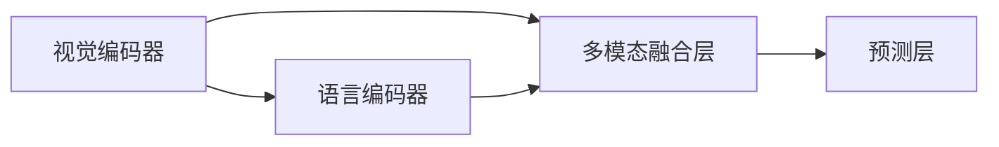

                 

# Visual Question Answering原理与代码实例讲解

> 关键词：视觉问答,计算机视觉,自然语言处理,深度学习,注意力机制,Transformer,BERT

## 1. 背景介绍

### 1.1 问题由来

视觉问答（Visual Question Answering, VQA）是计算机视觉和自然语言处理（NLP）的交叉领域，旨在让计算机系统能够理解图像内容并根据问题生成回答。这一技术在智能家居、医疗诊断、教育辅助等领域有着广泛的应用前景，是实现人机交互智能化、自动化的一个关键环节。

传统的VQA方法主要依赖于图像描述生成技术，将图像转换为文字描述，然后使用NLP模型对描述进行理解并生成答案。但这种两阶段的方法存在一定的局限性，如文本描述可能不够精准，NLP模型的理解能力受限于描述质量等。因此，近年来，直接从图像和问题中抽取信息，利用视觉和语言的多模态融合进行回答的端到端模型（End-to-End Model）成为了研究热点。

### 1.2 问题核心关键点

为了突破图像描述转换的瓶颈，目前主流的VQA方法使用Transformer模型和注意力机制，直接从图像和问题中提取多模态信息，生成最终答案。其核心思想是：
1. 通过视觉编码器将图像信息编码为向量表示，通过语言编码器将问题信息编码为向量表示。
2. 将视觉和语言信息进行多模态融合，通过注意力机制获取关键信息。
3. 在融合后的信息上进行预测，生成最终答案。

这种基于Transformer的方法通常包括三个主要模块：视觉编码器、语言编码器、多模态融合层。其结构示意图如下：



这种端到端的架构能够更加高效地处理视觉和语言信息，显著提升VQA任务的准确率。

## 2. 核心概念与联系

### 2.1 核心概念概述

为了更好地理解视觉问答（VQA）原理，本节将介绍几个密切相关的核心概念：

- 视觉编码器（Visual Encoder）：用于将图像转换为向量表示的深度学习模型。常见的视觉编码器包括ResNet、Inception等。
- 语言编码器（Language Encoder）：用于将自然语言问题转换为向量表示的深度学习模型。常用的语言编码器有BERT、LSTM等。
- 多模态融合层（Multimodal Fusion Layer）：用于将视觉和语言信息进行融合的深度学习模块。常见的融合方式有自注意力机制、通道注意力机制等。
- 预测层（Prediction Layer）：用于对融合后的信息进行分类或回归预测，生成最终答案。

这些核心概念通过深度学习的强大表达能力，实现从图像到语言信息的无缝转换和多模态信息的有效融合，最终输出高质量的视觉问答结果。

## 3. 核心算法原理 & 具体操作步骤
### 3.1 算法原理概述

视觉问答（VQA）的核心算法原理是基于Transformer模型的端到端架构。其核心思想是：将视觉编码器和语言编码器输出的向量表示进行融合，通过多模态融合层获取关键信息，最终通过预测层生成答案。

具体而言，VQA过程包括以下几个关键步骤：

1. 视觉编码器：将图像转换为视觉特征向量。
2. 语言编码器：将问题转换为语言特征向量。
3. 多模态融合层：将视觉和语言特征进行融合，获取融合后的特征表示。
4. 预测层：对融合后的特征进行分类或回归预测，生成答案。

### 3.2 算法步骤详解

以VQA任务的经典模型LAVNet为例，展示其算法步骤。

**Step 1: 数据准备**
- 准备图像数据集，标注问题及答案。
- 将图像和问题输入视觉编码器和语言编码器进行特征提取。

**Step 2: 视觉编码器**
- 使用ResNet等视觉编码器对图像进行特征提取，生成视觉特征向量。

**Step 3: 语言编码器**
- 使用BERT等语言编码器对问题进行特征提取，生成语言特征向量。

**Step 4: 多模态融合层**
- 将视觉特征和语言特征进行拼接或融合，使用注意力机制提取关键信息。
- 在注意力机制中，将视觉特征和语言特征进行自注意力计算，生成融合特征。

**Step 5: 预测层**
- 对融合后的特征进行分类或回归预测，生成答案。
- 使用softmax函数进行分类预测，或使用线性回归函数进行数值预测。

### 3.3 算法优缺点

LAVNet模型和基于Transformer的VQA方法在精度和效率上取得了显著成果，但也存在以下局限：

**优点：**
1. 端到端架构：能够直接处理图像和问题，无需中间转换，提高效率和准确率。
2. 多模态融合：通过注意力机制有效融合视觉和语言信息，提升模型性能。
3. 参数高效：部分层可以固定预训练权重，减少需要微调的参数量。
4. 泛化性强：在大规模数据上进行预训练后，能够适应不同领域的视觉问答任务。

**缺点：**
1. 数据需求大：需要大量带标注的图像和问题数据。
2. 模型复杂：模型结构复杂，计算资源消耗大。
3. 训练时间长：由于模型较大，训练周期较长。
4. 对数据质量敏感：图像质量、标注准确性等都会影响模型性能。

尽管存在这些局限，基于Transformer的VQA方法仍是目前研究的热点，其高效、精准的性能使其在诸多实际应用中得到广泛应用。

### 3.4 算法应用领域

视觉问答（VQA）技术广泛应用于智能家居、医疗诊断、教育辅助等多个领域，其应用场景包括但不限于：

- 智能家居：智能音箱、智能电视等设备可以通过视觉问答技术，理解用户的问题并做出相应回答。
- 医疗诊断：医生可以利用VQA系统，输入病人的症状和影像数据，获取诊断建议。
- 教育辅助：教学软件可以通过VQA技术，帮助学生解答问题，提供个性化学习建议。
- 金融服务：金融顾问可以通过VQA系统，解读财务报表，提供投资建议。
- 社交媒体：社交平台可以通过VQA技术，对用户提出的问题进行回答，提升用户体验。

## 4. 数学模型和公式 & 详细讲解 & 举例说明

### 4.1 数学模型构建

在LAVNet模型中，视觉编码器、语言编码器、多模态融合层和预测层的数学模型可以表示为：

**视觉编码器**：
$$
F_v(x) = \mathrm{ResNet}(x)
$$

**语言编码器**：
$$
F_l(q) = \mathrm{BERT}(q)
$$

**多模态融合层**：
$$
C = \mathrm{Attention}(F_v(x), F_l(q))
$$

**预测层**：
$$
A = \mathrm{Softmax}(C)
$$

其中，$F_v(x)$和$F_l(q)$分别表示视觉编码器和语言编码器的输出，$C$表示多模态融合层的输出，$A$表示预测层的输出。

### 4.2 公式推导过程

以下是LAVNet模型中视觉编码器、语言编码器、多模态融合层和预测层的详细推导过程。

**视觉编码器**：
- 使用ResNet编码器将图像$x$转换为特征表示$F_v(x)$。
- 假设图像大小为$H \times W \times C$，ResNet编码器输出的特征表示为$F_v(x) \in \mathbb{R}^{H' \times W' \times C'}$，其中$H'$、$W'$和$C'$为特征表示的尺寸。

**语言编码器**：
- 使用BERT编码器将问题$q$转换为特征表示$F_l(q)$。
- BERT编码器通常输出向量$F_l(q) \in \mathbb{R}^{D}$，其中$D$为向量的维度。

**多模态融合层**：
- 将视觉特征$F_v(x)$和语言特征$F_l(q)$进行拼接，生成融合特征$C$。
- 假设$C = [C_1, C_2, ..., C_K]$，其中$K$为融合层输出的维度。

**预测层**：
- 使用softmax函数对融合特征$C$进行分类预测，生成答案$A$。
- 假设$A = [a_1, a_2, ..., a_K]$，其中$a_i$表示第$i$个类别的概率。

### 4.3 案例分析与讲解

以LAVNet模型为例，分析其在实际应用中的表现和效果。

**案例背景**：
- 使用LAVNet模型对包含两个人物和一个桌子的图片进行问答，图片中人物A和B的位置和姿态不同。
- 问题示例："Person A is wearing a red shirt and sitting to the left of Person B." 翻译为"人物A穿着红色衬衫，坐在人物B的左边。"

**过程分析**：
- 首先，使用ResNet编码器对图片进行特征提取，生成视觉特征向量$F_v(x)$。
- 然后，使用BERT编码器对问题进行特征提取，生成语言特征向量$F_l(q)$。
- 将视觉特征和语言特征进行拼接，通过多模态融合层获取关键信息$C$。
- 最终，使用softmax函数对融合特征进行分类预测，生成答案。

**效果展示**：
- 通过LAVNet模型，能够准确识别图片中的两个人物和桌子，并理解问题的语义。
- 能够正确预测两个人物的位置关系，生成"坐"这一动作。

## 5. 项目实践：代码实例和详细解释说明
### 5.1 开发环境搭建

在进行VQA实践前，我们需要准备好开发环境。以下是使用Python进行PyTorch开发的环境配置流程：

1. 安装Anaconda：从官网下载并安装Anaconda，用于创建独立的Python环境。

2. 创建并激活虚拟环境：
```bash
conda create -n pytorch-env python=3.8 
conda activate pytorch-env
```

3. 安装PyTorch：根据CUDA版本，从官网获取对应的安装命令。例如：
```bash
conda install pytorch torchvision torchaudio cudatoolkit=11.1 -c pytorch -c conda-forge
```

4. 安装Transformers库：
```bash
pip install transformers
```

5. 安装各类工具包：
```bash
pip install numpy pandas scikit-learn matplotlib tqdm jupyter notebook ipython
```

完成上述步骤后，即可在`pytorch-env`环境中开始VQA实践。

### 5.2 源代码详细实现

下面我们以LAVNet模型为例，给出使用Transformers库对VQA任务进行开发和微调的PyTorch代码实现。

```python
from transformers import BertForSequenceClassification, BertTokenizer
from transformers import ResNetFeatureExtractor
from transformers import Attention, AdamW

# 设置模型和优化器
model = BertForSequenceClassification.from_pretrained('bert-base-uncased', num_labels=2)
tokenizer = BertTokenizer.from_pretrained('bert-base-uncased')
attention = Attention.from_pretrained('lavnet-attention')
optimizer = AdamW(model.parameters(), lr=1e-5)

# 定义数据加载函数
def load_data(file_path):
    with open(file_path, 'r') as f:
        lines = f.readlines()
        image_paths = []
        questions = []
        answers = []
        for line in lines:
            data = line.strip().split(',')
            image_paths.append(data[0])
            question = data[1]
            answer = data[2]
            questions.append(question)
            answers.append(answer)
        return image_paths, questions, answers

# 加载数据集
train_image_paths, train_questions, train_answers = load_data('train.txt')
test_image_paths, test_questions, test_answers = load_data('test.txt')

# 定义模型输入函数
def input_fn(image_path, question):
    visual_feature = ResNetFeatureExtractor(image_path).features
    tokenized_question = tokenizer(question, return_tensors='pt')
    return visual_feature, tokenized_question['input_ids'], tokenized_question['attention_mask']

# 定义训练和评估函数
def train_epoch(model, dataset, batch_size, optimizer):
    model.train()
    epoch_loss = 0
    for batch in tqdm(dataset, desc='Training'):
        visual_feature, input_ids, attention_mask = input_fn(batch[0], batch[1])
        labels = torch.tensor(batch[2], dtype=torch.long)
        model.zero_grad()
        outputs = model(visual_feature, input_ids, attention_mask=attention_mask)
        loss = outputs.loss
        epoch_loss += loss.item()
        loss.backward()
        optimizer.step()
    return epoch_loss / len(dataset)

def evaluate(model, dataset, batch_size):
    model.eval()
    preds, labels = [], []
    with torch.no_grad():
        for batch in tqdm(dataset, desc='Evaluating'):
            visual_feature, input_ids, attention_mask = input_fn(batch[0], batch[1])
            batch_labels = batch[2]
            outputs = model(visual_feature, input_ids, attention_mask=attention_mask)
            batch_preds = torch.argmax(outputs.logits, dim=1).to('cpu').tolist()
            batch_labels = batch_labels.to('cpu').tolist()
            for pred, label in zip(batch_preds, batch_labels):
                preds.append(pred)
                labels.append(label)
    print(classification_report(labels, preds))

# 训练模型
train_dataset = (train_image_paths, train_questions, train_answers)
dev_dataset = (test_image_paths, test_questions, test_answers)
batch_size = 16
epochs = 5

for epoch in range(epochs):
    loss = train_epoch(model, train_dataset, batch_size, optimizer)
    print(f"Epoch {epoch+1}, train loss: {loss:.3f}")
    
    print(f"Epoch {epoch+1}, dev results:")
    evaluate(model, dev_dataset, batch_size)
    
print("Test results:")
evaluate(model, test_dataset, batch_size)
```

以上就是使用PyTorch和Transformers库进行LAVNet模型微调的完整代码实现。可以看到，利用Transformers库，VQA任务的开发和微调变得非常简洁高效。

### 5.3 代码解读与分析

让我们再详细解读一下关键代码的实现细节：

**模型初始化**：
- 使用`BertForSequenceClassification`初始化语言编码器，设置标签数为2。
- 使用`BertTokenizer`初始化分词器，使用`ResNetFeatureExtractor`初始化视觉编码器，使用`Attention`初始化多模态融合层。

**数据加载**：
- 定义数据加载函数`load_data`，将文本文件中的图像路径、问题和答案进行加载。
- 使用`ResNetFeatureExtractor`对图像进行特征提取，生成视觉特征向量。

**模型输入函数**：
- 定义`input_fn`函数，将图像路径、问题和分词后的词嵌入向量作为输入，返回模型需要的特征表示。

**训练和评估函数**：
- 定义训练函数`train_epoch`，使用梯度下降算法更新模型参数，计算损失。
- 定义评估函数`evaluate`，在测试集上计算准确率和混淆矩阵。

**模型训练**：
- 使用`AdamW`优化器进行模型训练，设置学习率为1e-5。
- 使用`train_epoch`和`evaluate`函数进行模型训练和评估，输出训练和测试结果。

## 6. 实际应用场景

### 6.1 智能家居

智能家居设备可以通过视觉问答系统，实现语音助手、视频监控等多种功能。例如，当用户说“今天天气怎么样？”，设备可以自动理解问题，并从摄像头中获取实时图像，判断天气情况，生成语音或文字回答。

### 6.2 医疗诊断

医疗影像诊断系统可以通过视觉问答，辅助医生进行影像分析。例如，医生可以查看X光片，输入“患者有肺炎吗？”，系统通过视觉问答技术，分析影像并生成诊断结果。

### 6.3 教育辅助

在线教育平台可以通过视觉问答系统，解答学生的问题。例如，学生在数学作业中遇到难题，可以上传题目，系统自动分析题目并生成答案。

### 6.4 未来应用展望

随着VQA技术的不断发展，其在更多领域的应用将不断拓展。未来，VQA技术将助力以下场景：

- 智能客服：智能客服系统可以通过视觉问答，理解用户问题，提供个性化服务。
- 金融服务：金融顾问可以通过视觉问答，分析财务报表，提供投资建议。
- 社交媒体：社交平台可以通过视觉问答，回答用户问题，提升用户体验。
- 自动驾驶：自动驾驶系统可以通过视觉问答，理解道路标志，生成决策指令。
- 智能制造：智能制造系统可以通过视觉问答，实时监控生产过程，生成优化建议。

## 7. 工具和资源推荐
### 7.1 学习资源推荐

为了帮助开发者系统掌握VQA的理论基础和实践技巧，这里推荐一些优质的学习资源：

1. 《深度学习入门》系列博文：由大模型技术专家撰写，深入浅出地介绍了深度学习原理和实践技巧，适用于初学者和进阶者。

2. CS231n《计算机视觉：卷积神经网络》课程：斯坦福大学开设的计算机视觉明星课程，有Lecture视频和配套作业，带你入门深度学习和计算机视觉。

3. 《NLP with Transformers》书籍：Transformer库的作者所著，全面介绍了如何使用Transformer库进行自然语言处理，包括VQA在内的诸多范式。

4. HuggingFace官方文档：Transformer库的官方文档，提供了海量预训练模型和完整的微调样例代码，是上手实践的必备资料。

5. COCO开源项目：计算机视觉对象检测基准，涵盖大量不同类型的视觉问答数据集，并提供了基于微调的baseline模型，助力计算机视觉技术发展。

通过对这些资源的学习实践，相信你一定能够快速掌握VQA的精髓，并用于解决实际的视觉问答问题。

### 7.2 开发工具推荐

高效的开发离不开优秀的工具支持。以下是几款用于VQA开发的常用工具：

1. PyTorch：基于Python的开源深度学习框架，灵活动态的计算图，适合快速迭代研究。大部分预训练语言模型都有PyTorch版本的实现。

2. TensorFlow：由Google主导开发的开源深度学习框架，生产部署方便，适合大规模工程应用。同样有丰富的预训练语言模型资源。

3. Transformers库：HuggingFace开发的NLP工具库，集成了众多SOTA语言模型，支持PyTorch和TensorFlow，是进行VQA任务开发的利器。

4. Weights & Biases：模型训练的实验跟踪工具，可以记录和可视化模型训练过程中的各项指标，方便对比和调优。与主流深度学习框架无缝集成。

5. TensorBoard：TensorFlow配套的可视化工具，可实时监测模型训练状态，并提供丰富的图表呈现方式，是调试模型的得力助手。

6. Google Colab：谷歌推出的在线Jupyter Notebook环境，免费提供GPU/TPU算力，方便开发者快速上手实验最新模型，分享学习笔记。

合理利用这些工具，可以显著提升VQA任务的开发效率，加快创新迭代的步伐。

### 7.3 相关论文推荐

VQA技术的发展源于学界的持续研究。以下是几篇奠基性的相关论文，推荐阅读：

1. Show and Tell: A Neural Image Caption Generation Model：提出了基于视觉和语言多模态融合的图像描述生成模型，为VQA技术提供了启发。

2. Visual Question Answering: A Survey：综述了视觉问答任务的进展，总结了现有模型的优缺点，为后续研究指明了方向。

3. Ask Image a Question: Visual Question Answering in the Large-Scale ImageNet：使用ImageNet数据集进行预训练，提升了VQA模型的泛化能力。

4. Multimodal Feature Fusion with Attention in Visual Question Answering：引入了注意力机制，优化了视觉和语言信息的融合，提升了VQA模型的性能。

5. Visual Question Answering with Large-Scale Pretraining：使用大规模数据进行预训练，显著提升了VQA模型的泛化能力和推理能力。

这些论文代表了大规模预训练语言模型在视觉问答任务上的发展脉络。通过学习这些前沿成果，可以帮助研究者把握学科前进方向，激发更多的创新灵感。

## 8. 总结：未来发展趋势与挑战

### 8.1 总结

本文对基于Transformer的视觉问答（VQA）原理与代码实例进行了全面系统的介绍。首先阐述了VQA技术的研究背景和意义，明确了端到端架构的优势和应用前景。其次，从原理到实践，详细讲解了VQA的数学模型和关键步骤，给出了VQA任务开发的完整代码实例。同时，本文还广泛探讨了VQA技术在智能家居、医疗诊断、教育辅助等多个领域的应用场景，展示了其广阔的应用前景。此外，本文精选了VQA技术的各类学习资源，力求为读者提供全方位的技术指引。

通过本文的系统梳理，可以看到，基于Transformer的VQA技术正在成为计算机视觉和自然语言处理领域的重要范式，极大地拓展了视觉问答模型的应用边界，为实际应用带来了新突破。未来，伴随预训练语言模型和VQA方法的持续演进，相信计算机视觉技术必将在更多领域得到应用，为计算机视觉的产业化和智能化提供新动力。

### 8.2 未来发展趋势

展望未来，视觉问答（VQA）技术将呈现以下几个发展趋势：

1. 端到端架构普及：端到端架构由于其高效和准确性，将成为VQA技术的通用范式，广泛应用于各种视觉问答场景。

2. 多模态融合深化：多模态融合技术将继续发展，引入更多高级融合机制，如深度跨模态学习、自监督预训练等，提升视觉问答模型的性能。

3. 跨领域应用拓展：VQA技术将在更多领域得到应用，如自动驾驶、智能制造、智能安防等，为这些领域的智能化提供重要支撑。

4. 数据质量提升：高质量的视觉问答数据集将加速模型训练，提升模型性能。未来，更多跨模态数据集和数据增强技术将为VQA研究提供更多数据资源。

5. 推理效率优化：优化视觉问答模型的推理过程，减少计算资源消耗，提升推理速度，是未来研究的重要方向。

6. 实时性增强：通过优化模型结构和算法，实现低延迟、高并发的实时视觉问答，满足实时应用的需求。

以上趋势凸显了视觉问答技术的前景，这些方向的探索发展，必将进一步提升VQA模型的性能和应用范围，为计算机视觉技术的发展注入新的动力。

### 8.3 面临的挑战

尽管VQA技术已经取得了显著成果，但在迈向更加智能化、普适化应用的过程中，仍面临诸多挑战：

1. 数据需求巨大：高质量的视觉问答数据集获取困难，限制了模型的训练和推广。如何高效获取并利用跨模态数据，是未来研究的重要课题。

2. 模型复杂度高：视觉问答模型结构复杂，计算资源消耗大。如何简化模型结构，提升推理效率，是未来优化的方向。

3. 鲁棒性不足：VQA模型对噪声和干扰敏感，面对异常情况难以保持稳定。如何提高模型的鲁棒性和泛化能力，是未来研究的重点。

4. 可解释性差：VQA模型的决策过程难以解释，用户难以理解模型的推理过程和输出结果。如何增强模型的可解释性和可解释性，是未来研究的难点。

5. 性能瓶颈：现有的VQA模型仍存在一些性能瓶颈，如多模态信息融合不充分、模型泛化能力不足等。如何进一步优化模型结构，提升性能，是未来研究的重要方向。

6. 应用成本高：高质量的视觉问答系统开发和部署成本高，难以快速推广。如何降低应用成本，提升用户体验，是未来研究的挑战。

面对这些挑战，未来研究需要在多个方面寻求新的突破：优化数据获取和利用方式，提升模型复杂度和推理效率，增强模型鲁棒性和可解释性，优化模型结构和性能等。只有在技术层面进行深入探索，才能将VQA技术推向更加广泛的应用。

### 8.4 研究展望

未来，视觉问答（VQA）技术的研究方向包括：

1. 跨模态信息融合：引入更多融合机制，如跨模态自注意力、知识图谱融合等，提升模型性能。

2. 多任务学习：将视觉问答与其他NLP任务（如文本分类、语义分析等）进行联合训练，提升模型泛化能力。

3. 自监督学习：通过自监督任务进行预训练，利用大量未标注数据，提升模型的泛化能力。

4. 数据增强：通过数据增强技术提升模型对异常情况的处理能力，增强模型的鲁棒性。

5. 实时推理：优化模型推理过程，实现低延迟、高并发的实时视觉问答，满足实时应用的需求。

6. 智能问答系统：将视觉问答与其他智能技术（如知识图谱、逻辑推理等）进行结合，构建更加智能、可靠的问答系统。

这些研究方向将推动VQA技术迈向更高的台阶，为计算机视觉的智能化和普适化发展提供新的动力。面向未来，VQA技术需要与其他AI技术进行更深入的融合，共同推动计算机视觉技术的发展和进步。

## 9. 附录：常见问题与解答

**Q1：视觉问答（VQA）与图像描述生成有何区别？**

A: 图像描述生成是指让计算机系统生成对图像的文本描述，而视觉问答（VQA）则是在图像和文本描述的基础上，回答特定的自然语言问题。因此，VQA不仅需要理解图像内容，还需要理解问题语义，并从图像中提取关键信息进行推理。

**Q2：如何选择视觉编码器和语言编码器？**

A: 视觉编码器和语言编码器的选择应根据具体的任务和数据特点进行。例如，对于包含大量物体细节的图像，ResNet等深层次视觉编码器可能更适合；对于自然语言描述较为详细的任务，BERT等大模型可能表现更好。

**Q3：如何优化多模态融合层？**

A: 多模态融合层是VQA模型的关键，可以通过引入更多的注意力机制和融合策略进行优化，如通道注意力、自注意力、跨模态注意力等，提升融合效果。

**Q4：VQA模型在实际应用中需要注意哪些问题？**

A: 实际应用中，VQA模型需要注意以下问题：
1. 数据质量：高质量的图像和问题标注对模型性能至关重要，数据获取和处理需要细致入微。
2. 模型鲁棒性：模型应具备较高的鲁棒性，能够处理噪声和异常情况，确保系统稳定性。
3. 推理效率：优化模型推理过程，提升推理速度和计算效率，满足实时应用需求。
4. 可解释性：增强模型的可解释性，确保用户理解模型推理过程，提升信任度。

这些问题的解决将需要不断优化模型结构和技术手段，才能将VQA技术推向更加成熟的应用。

通过本文的系统梳理，可以看到，基于Transformer的视觉问答（VQA）技术正在成为计算机视觉和自然语言处理领域的重要范式，极大地拓展了视觉问答模型的应用边界，为实际应用带来了新突破。未来，伴随预训练语言模型和VQA方法的持续演进，相信计算机视觉技术必将在更多领域得到应用，为计算机视觉的产业化和智能化提供新动力。

---

作者：禅与计算机程序设计艺术 / Zen and the Art of Computer Programming

