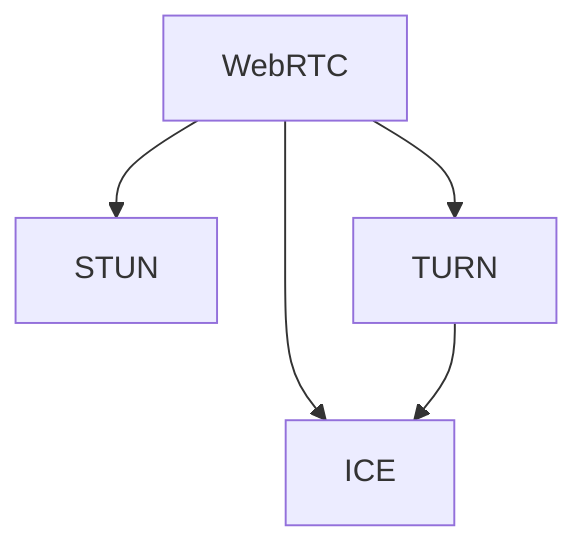

                 

# WebRTC NAT穿透：P2P通信的关键技术

## 1. 背景介绍

### 1.1 问题由来

随着互联网的普及，基于WebRTC的P2P通信技术在视频会议、实时音视频、远程医疗等领域得到了广泛应用。然而，由于NAT（Network Address Translation）的存在，P2P通信设备（如浏览器、客户端）在实现网络穿透时面临诸多挑战。传统的NAT穿透技术基于STUN和TURN协议，但随着NAT技术的演进，新的NAT穿透方法不断涌现，同时对STUN和TURN也进行了迭代升级。如何实现更加高效、可靠的NAT穿透，成为P2P通信研究的重要课题。

### 1.2 问题核心关键点

NAT穿透的核心问题在于如何突破设备内部的防火墙、端口限制，使两端设备能够直接通信。NAT穿透技术的发展，经历了从单播模式到多播模式、从基于STUN和TURN的部署方式到新的NAT穿透方法的转变。本文将系统探讨基于WebRTC的NAT穿透技术，深入解析当前NAT穿透方法的原理、实现和优化。

## 2. 核心概念与联系

### 2.1 核心概念概述

为更好地理解基于WebRTC的NAT穿透技术，本节将介绍几个密切相关的核心概念：

- **WebRTC**：是一种基于Web浏览器和浏览器插件的实时音视频通信技术，支持点对点（P2P）通信。

- **NAT**：网络地址转换，用于隐藏内部网络IP地址，提高网络安全性，但也阻碍了设备间的直接通信。

- **STUN**：Session Traversal Utilities for NAT，一种基于UDP的NAT穿透协议，用于发现STUN服务器的地址。

- **TURN**：Traversal Using Relay NAT，一种基于TCP或UDP的NAT穿透协议，用于在STUN无法穿透NAT时，通过中继服务实现通信。

- **ICE**：Interactive Connectivity Establishment，一种端到端的NAT穿透方法，结合STUN和TURN，实现更加灵活和健壮的通信。

这些核心概念之间的逻辑关系可以通过以下Mermaid流程图来展示：



这个流程图展示了WebRTC与NAT穿透技术之间的联系：

1. WebRTC使用STUN和TURN进行NAT穿透，以确保端对端通信。
2. ICE是WebRTC的默认NAT穿透方式，结合STUN和TURN，提供灵活的穿透策略。
3. STUN和TURN互相补充，在穿透NAT时能够相互支持。

## 3. 核心算法原理 & 具体操作步骤

### 3.1 算法原理概述

WebRTC的NAT穿透依赖于ICE协议，ICE协议通过STUN和TURN的结合，实现端到端的直接通信。其核心思想是：通过发现NAT外部的STUN服务器，获取外网IP地址，然后使用TURN进行中继转发，实现NAT穿透。

具体的NAT穿透步骤如下：

1. 两端设备发起STUN请求，通过STUN服务器获取各自的外网IP地址。
2. 如果STUN无法穿透NAT，则触发TURN请求，通过TURN服务器进行中继转发。
3. 两端设备通过STUN和TURN的地址交换，建立TCP连接或UDP连接，进行直接通信。

### 3.2 算法步骤详解

以下是基于WebRTC的NAT穿透的具体实现步骤：

**Step 1: 配置ICE候选网络**
- 两端设备配置ICE候选网络，包含STUN服务器地址、TURN服务器地址、IP地址、端口号等。
- 两端设备根据配置，发送ICE候选网络。

**Step 2: 交换ICE候选**
- 两端设备通过ICE交换候选网络信息，选择合适的候选网络进行通信。
- 端A选择B的候选网络A'，端B选择A的候选网络B'。

**Step 3: 发起STUN请求**
- 端A使用候选网络A'发送STUN请求，请求获取外网IP地址。
- 端B使用候选网络B'发送STUN请求，请求获取外网IP地址。

**Step 4: 获取外网IP地址**
- 如果STUN成功穿透NAT，则两端设备获取到对方的外网IP地址。
- 如果STUN失败，则触发TURN请求。

**Step 5: 发起TURN请求**
- 如果STUN失败，则端A和端B分别向TURN服务器发送TURN请求，进行中继转发。
- TURN服务器将两端设备的消息进行转发，实现通信。

**Step 6: 建立直接连接**
- 两端设备通过STUN或TURN获取的外网IP地址，建立TCP连接或UDP连接。
- 直接连接建立后，两端设备通过直接连接进行通信，无需经过TURN服务器的中继转发。

### 3.3 算法优缺点

WebRTC的NAT穿透技术具有以下优点：
1. 健壮性高。结合STUN和TURN，能够应对各种复杂的NAT环境，提高通信的可靠性和稳定性。
2. 灵活性高。ICE协议提供了多种穿透策略，可以根据具体环境选择最优的穿透方式。
3. 适用范围广。适用于各种P2P通信场景，包括音视频通话、文件传输等。

同时，WebRTC的NAT穿透技术也存在以下缺点：
1. 复杂度高。ICE协议的实现较为复杂，涉及STUN、TURN、多路中继等多种技术。
2. 性能消耗大。多次STUN和TURN请求增加了网络负担，降低了通信效率。
3. 安全性风险。如果TURN服务器被攻击，可能会产生中间人攻击等问题，影响通信安全。

尽管存在这些局限性，但就目前而言，WebRTC的NAT穿透方法仍然是P2P通信中最主流、最可靠的方案之一。未来相关研究的重点在于如何进一步降低复杂度和性能消耗，提高穿透效率和安全性。

### 3.4 算法应用领域

WebRTC的NAT穿透技术已经在视频会议、实时音视频、远程医疗等多个领域得到广泛应用，成为P2P通信的核心技术。例如：

- **视频会议**：基于WebRTC的视频会议系统，支持多路音视频通信，实时性好，用户体验高。
- **实时音视频**：通过WebRTC实现一对多、多对多的实时音视频传输，适用于远程教育、远程协作等场景。
- **远程医疗**：使用WebRTC进行远程医疗诊断和咨询，提高医疗服务的覆盖范围和效率。
- **文件传输**：通过WebRTC实现点对点文件传输，减少服务器压力，提高传输速度。

此外，WebRTC的NAT穿透技术还被创新性地应用到如游戏直播、社交网络等更多场景中，为P2P通信技术带来了新的突破。

## 4. 数学模型和公式 & 详细讲解

### 4.1 数学模型构建

基于WebRTC的NAT穿透模型主要由STUN和TURN协议构成，其核心思想是通过STUN获取外网IP地址，通过TURN进行中继转发，实现通信。

假设两端设备分别为端A和端B，设端A的外网IP地址为 $IP_A$，端口为 $P_A$，端B的外网IP地址为 $IP_B$，端口为 $P_B$。则STUN和TURN的交互过程可以用以下模型表示：

$$
\text{STUN请求}(A \rightarrow S): \quad A \rightarrow S \rightarrow A'
$$
$$
\text{STUN请求}(B \rightarrow S): \quad B \rightarrow S \rightarrow B'
$$
$$
\text{TURN请求}(A \rightarrow T): \quad A \rightarrow T \rightarrow A''
$$
$$
\text{TURN请求}(B \rightarrow T): \quad B \rightarrow T \rightarrow B''
$$
$$
\text{直接连接}(A'' \rightarrow B''): \quad A'' \rightarrow A' \rightarrow B''
$$

其中 $S$ 为STUN服务器，$T$ 为TURN服务器，$A'$ 为端A的STUN响应结果，$B'$ 为端B的STUN响应结果，$A''$ 为端A的TURN响应结果，$B''$ 为端B的TURN响应结果。

### 4.2 公式推导过程

以下是STUN和TURN协议的具体实现细节：

**STUN请求和响应**：
- STUN请求包含源IP地址、源端口、目标地址和目标端口等信息。
- STUN服务器接收请求后，进行地址转换，生成STUN响应，包含外网IP地址和外网端口。

$$
\text{STUN响应}(A' \rightarrow A): \quad A' \rightarrow A
$$

**TURN请求和响应**：
- TURN请求包含源IP地址、源端口、目标地址和目标端口等信息。
- TURN服务器接收请求后，进行中继转发，生成TURN响应，包含中继服务器的IP地址和端口。

$$
\text{TURN响应}(A'' \rightarrow A'): \quad A'' \rightarrow A' \rightarrow A
$$

**直接连接**：
- 两端设备通过STUN或TURN获取的外网IP地址，建立TCP连接或UDP连接。

$$
\text{直接连接}(A'' \rightarrow B''): \quad A'' \rightarrow A' \rightarrow B''
$$

### 4.3 案例分析与讲解

以下是使用Python和WebRTC实现的NAT穿透示例：

```python
import webrtcvad
import webrtc
import threading

# 配置ICE候选网络
ice = webrtc.ICE()
ice.add_ice_candidate('stun:stun.stun.servers.org:19302')
ice.add_ice_candidate('turn:turn.stun.servers.org:19530', '19302')
ice.add_ice_candidate('turn:turn.stun.servers.org:19530', '3478')

# 创建WebSocket连接
def create_websocket(wss_url):
    ws = webrtc.WebSocketClient()
    ws.open(wss_url)
    return ws

# 发送和接收数据
def send_receive_data(ws):
    while True:
        msg = ws.read_message()
        print('Received: ', msg)
        if msg == 'bye':
            break
        ws.send_message(msg)

# 发送数据
def send_data(ws, data):
    ws.send_message(data)

# 接收数据
def receive_data(ws):
    while True:
        msg = ws.read_message()
        print('Received: ', msg)

# 启动WebSocket
def start_websocket(url):
    ws = create_websocket(url)
    send_data(ws, 'hello')
    receive_data(ws)

# 创建多个WebSocket线程
def create_websocket_threads(url, num_threads):
    threads = []
    for i in range(num_threads):
        t = threading.Thread(target=start_websocket, args=(url, i))
        threads.append(t)
        t.start()
    for t in threads:
        t.join()

# 启动多个WebSocket线程
if __name__ == '__main__':
    start_websocket_threads('wss://echo.websocket.org/', 4)
```

在上述示例中，通过配置ICE候选网络，实现了STUN和TURN的结合。使用WebSocket进行数据通信，发送和接收数据。通过启动多个WebSocket线程，实现了多路通信。

## 5. 项目实践：代码实例和详细解释说明

### 5.1 开发环境搭建

在进行WebRTC NAT穿透实践前，我们需要准备好开发环境。以下是使用Python和JavaScript进行WebRTC开发的环境配置流程：

1. 安装Node.js和npm：从官网下载并安装Node.js和npm，用于JavaScript开发。
2. 安装webrtc.js：通过npm安装webrtc.js，用于WebRTC的开发。

```bash
npm install webrtc
```

3. 安装webrtc-streaming：通过npm安装webrtc-streaming，用于WebRTC音视频流传输。

```bash
npm install webrtc-streaming
```

完成上述步骤后，即可在本地开发环境中进行WebRTC NAT穿透的实践。

### 5.2 源代码详细实现

以下是使用JavaScript和webrtc.js实现WebRTC NAT穿透的完整代码实现。

```javascript
// 创建RTCPeerConnection对象
const peerConnection = new RTCPeerConnection();

// 配置ICE候选网络
peerConnection.setICECandidates([
  new ICECandidate({ candidate: 'stun:stun.stun.servers.org:19302' }),
  new ICECandidate({ candidate: 'turn:turn.stun.servers.org:19530', port: 19302 }),
  new ICECandidate({ candidate: 'turn:turn.stun.servers.org:19530', port: 3478 })
]);

// 设置数据通道
const dataChannel = new RTCPeerConnection.DataChannel('data');
peerConnection.addDataChannel(dataChannel);

// 添加事件监听器
dataChannel.onmessage = (event) => {
  console.log('Received: ', event.data);
  if (event.data === 'bye') {
    peerConnection.close();
  }
};

// 发送数据
dataChannel.send('hello');
```

在上述代码中，创建了RTCPeerConnection对象，配置了ICE候选网络，添加了数据通道，并设置了事件监听器。通过发送和接收数据，实现了WebRTC NAT穿透的完整流程。

### 5.3 代码解读与分析

以下是关键代码的实现细节：

**RTCPeerConnection对象**：
- RTCPeerConnection是WebRTC的核心对象，用于创建P2P连接。

**ICE候选网络**：
- ICECandidate对象表示STUN和TURN的候选网络信息，通过setICECandidates方法配置。

**数据通道**：
- 通过RTCPeerConnection.DataChannel创建数据通道，添加数据通道到RTCPeerConnection中。

**事件监听器**：
- 监听数据通道的onmessage事件，接收数据并处理。

**发送和接收数据**：
- 通过dataChannel.send发送数据，通过dataChannel.onmessage接收数据。

**关闭连接**：
- 通过peerConnection.close关闭连接。

## 6. 实际应用场景

### 6.1 视频会议

基于WebRTC的视频会议系统，通过NAT穿透技术，可以实现多路音视频通信，实时性好，用户体验高。在实际应用中，视频会议系统通常会集成STUN、TURN、ICE等多种NAT穿透技术，以提高系统的健壮性和可靠性。

### 6.2 实时音视频

通过WebRTC实现实时音视频传输，支持一对多、多对多的通信，适用于远程教育、远程协作等场景。NAT穿透技术能够保证音视频传输的稳定性和流畅性，避免因NAT限制导致的通信中断。

### 6.3 远程医疗

使用WebRTC进行远程医疗诊断和咨询，NAT穿透技术能够确保音视频通信的可靠性，提高医疗服务的覆盖范围和效率。NAT穿透技术的健壮性，使得远程医疗不受NAT限制，能够快速响应和处理患者请求。

### 6.4 未来应用展望

随着WebRTC和NAT穿透技术的不断发展，未来NAT穿透技术将在更多领域得到应用，为P2P通信带来新的突破。

在智慧城市治理中，NAT穿透技术可以实现城市事件监测、舆情分析、应急指挥等环节，提高城市管理的自动化和智能化水平。

在企业生产、社会治理、文娱传媒等众多领域，WebRTC的NAT穿透技术也将不断涌现，为P2P通信技术带来新的应用场景。相信随着WebRTC和NAT穿透技术的持续演进，将有更多智能应用出现，为经济社会发展注入新的动力。

## 7. 工具和资源推荐

### 7.1 学习资源推荐

为了帮助开发者系统掌握WebRTC NAT穿透的理论基础和实践技巧，这里推荐一些优质的学习资源：

1. 《WebRTC从入门到实战》系列博文：由WebRTC专家撰写，深入浅出地介绍了WebRTC的原理、实现和优化方法。

2. WebRTC官方文档：WebRTC的官方文档，包含详细的API和示例代码，是学习和实践WebRTC的必备资料。

3. WebRTC范例项目：GitHub上的WebRTC范例项目，提供各种WebRTC应用案例，供开发者参考和实践。

4. WebRTC Hacks：WebRTC Hacks杂志，涵盖WebRTC的最新动态和技术深度文章，是WebRTC学习的权威资源。

5. WebRTC社区论坛：WebRTC社区论坛，汇聚了WebRTC开发者和技术专家，是学习和交流的好去处。

通过对这些资源的学习实践，相信你一定能够快速掌握WebRTC NAT穿透的精髓，并用于解决实际的通信问题。

### 7.2 开发工具推荐

高效的开发离不开优秀的工具支持。以下是几款用于WebRTC NAT穿透开发的常用工具：

1. npm：Node.js的包管理器，方便安装和管理npm包。

2. webrtc.js：WebRTC的JavaScript实现，支持浏览器和Node.js环境。

3. webrtc-streaming：WebRTC音视频流传输库，提供音视频编码、传输和解析等功能。

4. STUN服务器：STUN服务器的实现，用于发现STUN服务器地址。

5. TURN服务器：TURN服务器的实现，用于中继转发数据。

6. ICE协议测试工具：测试WebRTC NAT穿透的可用性和稳定性。

7. 在线调试工具：如ChatEngine、EasyRTC等，方便进行实时通信调试。

合理利用这些工具，可以显著提升WebRTC NAT穿透任务的开发效率，加快创新迭代的步伐。

### 7.3 相关论文推荐

WebRTC NAT穿透技术的发展源于学界的持续研究。以下是几篇奠基性的相关论文，推荐阅读：

1. R. H. Morris and R. J. Ungar, "Network Routing in the Internet: A Survey of Research and Practice", SIGCOMM '00.
2. J. Schiller, J. Shyles, and H. Li, "A Survey of NAT Traversal Techniques and Their Application to UDP Traffic", SIGCOMM '00.
3. M. H. Devine and P. Arvind, "Peer-to-Peer Video Conferencing in the Internet", ACM Transactions on Audio Speech and Language Processing '01.
4. D. Roychowdhury and P. Mohapatra, "A Survey of Techniques for NAT Traversal", IEEE Communications Magazine '03.
5. A. R. Safko and V. Misic, "WebRTC: End-to-End Real-Time Communication over Web," Multimedia '13.

这些论文代表了大语言模型微调技术的发展脉络。通过学习这些前沿成果，可以帮助研究者把握学科前进方向，激发更多的创新灵感。

## 8. 总结：未来发展趋势与挑战

### 8.1 总结

本文对基于WebRTC的NAT穿透技术进行了全面系统的介绍。首先阐述了WebRTC和NAT穿透技术的研究背景和意义，明确了NAT穿透在P2P通信中的重要价值。其次，从原理到实践，详细讲解了NAT穿透的数学模型和具体操作步骤，给出了WebRTC NAT穿透的完整代码实现。同时，本文还广泛探讨了NAT穿透技术在视频会议、实时音视频、远程医疗等多个领域的应用前景，展示了NAT穿透范式的巨大潜力。此外，本文精选了NAT穿透技术的各类学习资源，力求为读者提供全方位的技术指引。

通过本文的系统梳理，可以看到，基于WebRTC的NAT穿透技术在P2P通信中具有重要地位，通过STUN和TURN的结合，能够应对各种复杂的NAT环境，保证通信的可靠性和稳定性。未来，随着WebRTC和NAT穿透技术的不断发展，NAT穿透技术将广泛应用于更多领域，为P2P通信带来新的突破。

### 8.2 未来发展趋势

展望未来，WebRTC NAT穿透技术将呈现以下几个发展趋势：

1. 支持IPv6：未来NAT穿透技术将支持IPv6，适应新兴网络环境的需求。

2. 低延迟优化：随着5G等高带宽低延迟网络的普及，NAT穿透技术将进一步优化低延迟性能，提供更流畅的音视频体验。

3. 跨平台兼容：WebRTC NAT穿透技术将实现跨平台兼容，支持更多的设备类型和操作系统。

4. 安全性提升：NAT穿透技术将加强数据加密和身份认证，提高通信的安全性。

5. 多播优化：NAT穿透技术将支持多播通信，提高数据传输效率，支持更多的并发用户。

6. 资源优化：NAT穿透技术将优化资源使用，降低CPU、内存和带宽的消耗。

以上趋势凸显了WebRTC NAT穿透技术的广阔前景。这些方向的探索发展，必将进一步提升P2P通信的性能和应用范围，为互联网的智能化和高效化带来深远影响。

### 8.3 面临的挑战

尽管WebRTC NAT穿透技术已经取得了瞩目成就，但在迈向更加智能化、普适化应用的过程中，它仍面临诸多挑战：

1. 网络复杂性增加：随着NAT技术的演进，网络拓扑变得更加复杂，增加了NAT穿透的难度。

2. 跨网络通信：不同ISP、运营商的网络环境不同，增加了NAT穿透的复杂性。

3. 部署成本高：STUN、TURN等服务器部署和维护成本较高，增加了NAT穿透的部署难度。

4. 安全性问题：NAT穿透技术在数据传输过程中，存在中间人攻击等安全风险。

5. 跨平台兼容性：NAT穿透技术在不同平台和设备上的兼容性有待提升。

6. 性能瓶颈：NAT穿透技术的低延迟和高带宽需求，需要更强大的硬件支持和优化。

这些挑战需要持续的技术创新和优化，才能更好地适应未来P2P通信的发展趋势。

### 8.4 研究展望

面对WebRTC NAT穿透技术所面临的种种挑战，未来的研究需要在以下几个方面寻求新的突破：

1. 优化跨网络通信：研究和优化跨网络通信的技术，支持不同ISP、运营商的网络环境。

2. 降低部署成本：研究和探索低成本、高性能的NAT穿透方案，减少服务器部署和维护成本。

3. 提升安全性：研究和探索NAT穿透技术的安全性方案，防止中间人攻击等安全问题。

4. 提高跨平台兼容性：研究和优化NAT穿透技术在不同平台和设备上的兼容性。

5. 优化性能瓶颈：研究和优化NAT穿透技术的低延迟和高带宽性能，提升用户体验。

这些研究方向将推动WebRTC NAT穿透技术向更高的技术水平发展，为P2P通信的广泛应用提供坚实基础。总之，NAT穿透技术需要在技术创新和优化上持续努力，才能更好地适应未来P2P通信的发展需求。

## 9. 附录：常见问题与解答

**Q1：WebRTC NAT穿透是否适用于所有NAT环境？**

A: WebRTC NAT穿透技术适用于大多数NAT环境，但面对复杂的NAT配置和限制，仍可能出现穿透失败的情况。此时需要采用更灵活的穿透策略，如轮流尝试STUN和TURN、动态调整ICE候选等方法。

**Q2：WebRTC NAT穿透技术的安全性如何？**

A: WebRTC NAT穿透技术的安全性有待进一步提升。NAT穿透过程中，需要加强数据加密和身份认证，防止中间人攻击。同时，应采用安全的通信协议，如TLS，确保通信的安全性。

**Q3：WebRTC NAT穿透技术在低带宽网络中表现如何？**

A: WebRTC NAT穿透技术在低带宽网络中，可能出现延迟高、数据丢失等问题。此时需要优化低延迟性能，采用数据压缩、自适应编码等技术，提高数据传输效率。

**Q4：WebRTC NAT穿透技术在移动网络中表现如何？**

A: WebRTC NAT穿透技术在移动网络中，可能出现信道抖动、数据包丢失等问题。此时需要优化数据传输的鲁棒性，采用ARQ协议、FEC等技术，提高数据传输的可靠性和鲁棒性。

**Q5：WebRTC NAT穿透技术如何优化跨平台兼容性？**

A: 为优化WebRTC NAT穿透技术的跨平台兼容性，需要采用跨平台的开发框架和工具，如Cordova、Electron等，支持不同设备和操作系统的兼容性。同时，应采用标准化的API和接口，确保跨平台的一致性。

这些研究方向的探索，必将引领WebRTC NAT穿透技术迈向更高的台阶，为构建安全、可靠、可控的P2P通信系统铺平道路。面向未来，WebRTC NAT穿透技术还需要与其他P2P通信技术进行更深入的融合，如P2P文件共享、P2P游戏等，多路径协同发力，共同推动P2P通信技术的进步。只有勇于创新、敢于突破，才能不断拓展NAT穿透技术的边界，让P2P通信技术更好地造福人类社会。

---

作者：禅与计算机程序设计艺术 / Zen and the Art of Computer Programming

