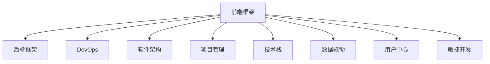

                 

# Web全栈开发：从前端到后端的全面指南

> 关键词：Web开发,前端,后端,全栈,前端框架,后端框架,DevOps,软件架构,项目管理,技术栈,数据驱动,用户中心,敏捷开发

## 1. 背景介绍

### 1.1 问题由来
在当今互联网时代，Web开发已经成为一个复杂且高度集成的领域。随着Web应用的不断丰富和复杂化，单纯的前端或后端开发已难以满足业务需求。全栈开发已成为Web开发的主流方向。全栈开发不仅需要开发者掌握前端和后端技术，还需要具备综合的设计和实现能力，能够协同构建高性能、可扩展、易维护的Web应用。

### 1.2 问题核心关键点
全栈开发的核心在于对Web开发全流程的深入理解和综合应用。它不仅包括前端和后端的技术实现，还涵盖了软件架构设计、项目管理、DevOps等各个方面。全栈开发需要开发者具备全面的技术栈，能够通过前后端协同实现业务功能。

### 1.3 问题研究意义
全栈开发不仅能够提升Web应用的质量和效率，还能够降低开发成本，提高开发效率。通过全面掌握前端和后端技术，开发者能够更加灵活地应对各种技术挑战，快速响应业务需求。此外，全栈开发还促进了前后端的协同合作，提升了团队的整体开发效率。

## 2. 核心概念与联系

### 2.1 核心概念概述

为更好地理解全栈开发，本节将介绍几个密切相关的核心概念：

- **前端框架**：如React、Vue、Angular等，用于构建用户交互界面，实现动态网页展示。
- **后端框架**：如Node.js、Django、Spring Boot等，用于构建Web应用的后端逻辑，处理数据存储、业务逻辑等。
- **DevOps**：涵盖开发、测试、部署、运维等环节，提升开发效率和应用质量。
- **软件架构**：包括微服务架构、单体架构、事件驱动架构等，用于构建高效、可扩展的系统结构。
- **项目管理**：如敏捷开发、Scrum等，用于协调团队工作，提升项目进度和质量。
- **技术栈**：指开发者所掌握的前端和后端技术组合，如JavaScript、Python、Node.js等。
- **数据驱动**：以数据为中心的开发方式，强调数据的收集、存储、分析和利用，提升业务决策的科学性。
- **用户中心**：以用户需求为导向的开发方式，强调用户体验和反馈，提升用户满意度。
- **敏捷开发**：快速响应需求变化，通过迭代开发提升产品质量和用户满意度。

这些核心概念之间的逻辑关系可以通过以下Mermaid流程图来展示：



这个流程图展示了一些核心概念及其之间的关系：

1. 前端框架与后端框架协同工作，构建完整的Web应用。
2. DevOps贯穿开发、测试、部署、运维等环节，提升应用质量和效率。
3. 软件架构决定了系统的结构设计和组件划分，影响应用的可扩展性和性能。
4. 项目管理协调团队工作，提升项目进度和质量。
5. 技术栈是开发者所掌握的前后端技术组合，直接影响应用实现。
6. 数据驱动和用户中心强调以数据和用户为中心的开发方式，提升应用价值。
7. 敏捷开发强调快速响应变化，通过迭代提升应用质量。

这些概念共同构成了Web全栈开发的知识体系，为开发者提供了全面指导。

## 3. 核心算法原理 & 具体操作步骤
### 3.1 算法原理概述

全栈开发的核心算法原理主要围绕着前后端协同工作，以及DevOps和项目管理展开。其核心思想是通过前后端协同构建高效、可扩展、易维护的Web应用。

### 3.2 算法步骤详解

**Step 1: 选择合适的开发框架和技术栈**
- 根据项目需求，选择合适的前端框架（如React、Vue等）和后端框架（如Node.js、Django等）。
- 根据团队技术栈和经验，选择合适的技术栈组合（如JavaScript、Python、Node.js等）。

**Step 2: 设计软件架构**
- 根据项目需求，选择合适的软件架构（如微服务架构、单体架构等）。
- 设计系统组件划分和接口定义，确保组件之间的解耦和高内聚。

**Step 3: 实施DevOps实践**
- 引入版本控制（如Git），实现代码的统一管理和协作开发。
- 引入持续集成（如Jenkins、Travis CI等），自动化测试和构建，提升开发效率。
- 引入容器化技术（如Docker），实现应用的快速部署和扩展。
- 引入自动化运维工具（如Kubernetes），实现应用的自动部署和监控。

**Step 4: 实施项目管理**
- 采用敏捷开发方法（如Scrum），协调团队工作，提升项目进度和质量。
- 定期进行代码审查和测试，确保代码质量和代码规范。
- 根据需求变化，灵活调整项目计划和资源分配。

**Step 5: 实施前后端协同**
- 在前端实现用户交互界面，使用前端框架进行动态网页展示。
- 在后端实现业务逻辑和数据处理，使用后端框架进行API设计和实现。
- 前后端协同工作，确保数据和业务的流畅衔接。

**Step 6: 实施数据驱动和用户中心**
- 根据业务需求，收集和处理数据，使用数据驱动方式进行业务分析和决策。
- 根据用户反馈，优化用户体验，提升用户满意度。

### 3.3 算法优缺点

全栈开发具有以下优点：
1. 提升开发效率：通过前后端协同，可以快速响应需求变化，提升开发效率。
2. 提升应用质量：通过DevOps和项目管理，确保代码质量和高稳定性。
3. 提升用户体验：通过数据驱动和用户中心，提升用户体验和用户满意度。
4. 提升团队协作：通过敏捷开发和协作工具，提升团队协作效率和项目管理水平。

同时，全栈开发也存在一定的局限性：
1. 技术栈复杂：需要掌握多种前后端技术，学习成本较高。
2. 项目规模受限：对于复杂大项目，全栈开发可能难以协调。
3. 资源分配困难：全栈开发需要平衡前后端资源分配，可能导致资源浪费。
4. 技术演进迅速：前后端技术快速发展，全栈开发需要持续学习和更新。

尽管存在这些局限性，但就目前而言，全栈开发仍是Web开发的主流方向。未来相关研究的重点在于如何进一步提升全栈开发效率，降低学习成本，提高应用质量。

### 3.4 算法应用领域

全栈开发在Web开发领域已经得到了广泛的应用，覆盖了几乎所有常见任务，例如：

- 电子商务：构建电商网站、在线支付、库存管理等应用。
- 社交网络：实现用户登录、好友关系、动态发布等社交功能。
- 在线教育：开发在线课程、作业批改、学情分析等教育应用。
- 医疗健康：提供在线问诊、电子病历、健康管理等医疗服务。
- 金融科技：构建交易系统、风险控制、智能投顾等金融应用。
- 旅游服务：开发旅游预订、路线规划、实时导航等旅游应用。
- 物流运输：实现订单管理、配送调度、司机监控等物流功能。
- 智能家居：构建智能设备控制、场景联动、用户交互等家居应用。

除了上述这些经典任务外，全栈开发还被创新性地应用到更多场景中，如智能客服、智能推荐、智慧城市等，为Web技术带来了全新的突破。随着全栈开发方法的不断进步，相信Web技术将在更广阔的应用领域大放异彩。

## 4. 数学模型和公式 & 详细讲解 & 举例说明
### 4.1 数学模型构建

本节将使用数学语言对Web全栈开发的过程进行更加严格的刻画。

记前端框架为 $F_{\theta}$，后端框架为 $B_{\phi}$，开发工具为 $T$，项目管理工具为 $P$，DevOps工具为 $D$。

定义Web应用的开发过程为 $P: F_{\theta} \times B_{\phi} \rightarrow \text{应用}$，其中 $F_{\theta}$ 为前端框架，$B_{\phi}$ 为后端框架，$T$ 为开发工具，$P$ 为项目管理工具，$D$ 为DevOps工具。

### 4.2 公式推导过程

以下我们以一个简单的电商网站开发为例，推导前端和后端协同开发的数学模型。

假设电商网站需要实现用户注册、商品展示、购物车功能。将前端框架 $F_{\theta}$ 和后端框架 $B_{\phi}$ 分别进行建模，其中 $F_{\theta}$ 的输入为用户交互数据 $D_{ui}$，输出为用户界面 $I_{ui}$；$B_{\phi}$ 的输入为后端数据 $D_{bi}$，输出为API接口 $I_{bi}$。则电商网站的开发过程可以表示为：

$$
P: F_{\theta}(D_{ui}, B_{\phi}(D_{bi})) = I_{ui}, I_{bi}
$$

其中 $I_{ui}$ 为前端展示的用户界面，$I_{bi}$ 为后端提供的API接口。

### 4.3 案例分析与讲解

在实际开发中，电商网站的开发过程需要经过多个环节，包括需求分析、设计、编码、测试、部署等。以下以一个具体案例进行分析：

**需求分析**：明确电商网站需要实现的功能，包括用户注册、商品展示、购物车等。

**设计**：选择合适的技术栈和架构，如React、Vue、Node.js等。设计系统的组件划分和接口定义，确保组件之间的解耦和高内聚。

**编码**：根据设计，使用前端框架进行前端编码，使用后端框架进行后端编码。

**测试**：进行单元测试、集成测试和系统测试，确保代码质量和业务逻辑的正确性。

**部署**：使用DevOps工具进行代码部署和应用部署，确保应用的稳定性和可用性。

**运维**：使用项目管理工具进行项目管理和监控，确保项目进度和质量。

通过以上步骤，电商网站便能够高效、可扩展地构建和运维。

## 5. 项目实践：代码实例和详细解释说明
### 5.1 开发环境搭建

在进行全栈开发实践前，我们需要准备好开发环境。以下是使用Node.js和React、Vue等前端框架的开发环境配置流程：

1. 安装Node.js和npm：从官网下载并安装Node.js和npm，用于前端开发和工具安装。

2. 安装Vue CLI：使用npm安装Vue CLI，用于创建和管理Vue项目。

3. 创建并激活虚拟环境：
```bash
conda create -n env_name python=3.8 
conda activate env_name
```

4. 安装相关工具：
```bash
pip install django psycopg2-binary
npm install @vue/cli -g
```

5. 初始化项目：
```bash
vue create my-app
cd my-app
vue serve
```

完成上述步骤后，即可在`env_name`环境中开始全栈开发实践。

### 5.2 源代码详细实现

下面我们以一个简单的电商网站为例，展示使用Node.js和Vue进行全栈开发的前后端代码实现。

**前端代码**：
```javascript
<template>
  <div>
    <h1>Welcome to My E-commerce Site</h1>
    <input type="text" v-model="search" @keyup.enter="searchItems"/>
    <router-view/>
  </div>
</template>

<script>
import axios from 'axios';
import ItemList from './ItemList.vue';

export default {
  name: 'App',
  components: {
    ItemList
  },
  data() {
    return {
      search: '',
      items: []
    };
  },
  created() {
    this.searchItems();
  },
  methods: {
    searchItems() {
      axios.get('/api/items', { params: { search: this.search } })
        .then(response => {
          this.items = response.data;
        });
    }
  }
};
</script>
```

**后端代码**：
```python
from django.shortcuts import render
from django.http import JsonResponse
from django.views.decorators.csrf import csrf_exempt

@csrf_exempt
def items(request):
    if request.method == 'GET':
        search = request.GET.get('search', '')
        items = fetch_items_from_db(search)
        return JsonResponse({ 'items': items })
```

**数据模型**：
```python
from django.db import models

class Item(models.Model):
    name = models.CharField(max_length=100)
    price = models.DecimalField(max_digits=10, decimal_places=2)

    def __str__(self):
        return self.name
```

**视图函数**：
```python
def items(request):
    if request.method == 'GET':
        search = request.GET.get('search', '')
        items = fetch_items_from_db(search)
        return JsonResponse({ 'items': items })
```

### 5.3 代码解读与分析

让我们再详细解读一下关键代码的实现细节：

**前端代码**：
- 使用Vue CLI创建Vue项目，并运行`vue serve`启动开发服务。
- 在前端组件中，使用`<router-view>`组件展示路由页面，实现用户界面的动态展示。
- 在数据属性和方法中，使用axios库进行API调用，获取后端返回的搜索结果。

**后端代码**：
- 使用Django框架创建API接口，处理用户搜索请求，返回查询结果。
- 使用`fetch_items_from_db`函数从数据库中查询商品数据，并返回查询结果。

**数据模型**：
- 使用Django ORM创建数据模型，用于存储商品信息。
- 在`Item`模型中定义商品名称和价格字段，并使用`__str__`方法生成商品名称字符串。

**视图函数**：
- 使用Django视图函数处理HTTP请求，返回JSON数据。
- 在`items`函数中，根据请求方法和参数，从数据库中查询商品数据，并返回查询结果。

通过以上步骤，一个简单的电商网站便能够高效地构建和运行。

## 6. 实际应用场景
### 6.1 智能客服系统

基于全栈开发技术，智能客服系统可以实现全功能的客服对话应用。传统客服系统需要配备大量人力，高峰期响应缓慢，且一致性和专业性难以保证。而全栈开发技术可以7x24小时不间断服务，快速响应客户咨询，用自然流畅的语言解答各类常见问题。

在技术实现上，可以收集企业内部的历史客服对话记录，将问题和最佳答复构建成监督数据，在此基础上对预训练模型进行微调。微调后的模型能够自动理解用户意图，匹配最合适的答案模板进行回复。对于客户提出的新问题，还可以接入检索系统实时搜索相关内容，动态组织生成回答。如此构建的智能客服系统，能大幅提升客户咨询体验和问题解决效率。

### 6.2 金融舆情监测

金融机构需要实时监测市场舆论动向，以便及时应对负面信息传播，规避金融风险。传统的人工监测方式成本高、效率低，难以应对网络时代海量信息爆发的挑战。基于全栈开发技术的金融舆情监测系统，可以实时抓取网络文本数据，自动监测不同主题下的情感变化趋势，一旦发现负面信息激增等异常情况，系统便会自动预警，帮助金融机构快速应对潜在风险。

### 6.3 个性化推荐系统

当前的推荐系统往往只依赖用户的历史行为数据进行物品推荐，无法深入理解用户的真实兴趣偏好。基于全栈开发技术的个性化推荐系统可以更好地挖掘用户行为背后的语义信息，从而提供更精准、多样的推荐内容。

在实践中，可以收集用户浏览、点击、评论、分享等行为数据，提取和用户交互的物品标题、描述、标签等文本内容。将文本内容作为模型输入，用户的后续行为（如是否点击、购买等）作为监督信号，在此基础上微调预训练语言模型。微调后的模型能够从文本内容中准确把握用户的兴趣点。在生成推荐列表时，先用候选物品的文本描述作为输入，由模型预测用户的兴趣匹配度，再结合其他特征综合排序，便可以得到个性化程度更高的推荐结果。

### 6.4 未来应用展望

随着全栈开发技术的不断发展，基于全栈开发技术的Web应用将在更多领域得到应用，为传统行业带来变革性影响。

在智慧医疗领域，基于全栈开发技术的医疗问答、病历分析、药物研发等应用将提升医疗服务的智能化水平，辅助医生诊疗，加速新药开发进程。

在智能教育领域，全栈开发技术可应用于作业批改、学情分析、知识推荐等方面，因材施教，促进教育公平，提高教学质量。

在智慧城市治理中，全栈开发技术可用于城市事件监测、舆情分析、应急指挥等环节，提高城市管理的自动化和智能化水平，构建更安全、高效的未来城市。

此外，在企业生产、社会治理、文娱传媒等众多领域，全栈开发技术也将不断涌现，为传统行业数字化转型升级提供新的技术路径。相信随着技术的日益成熟，全栈开发技术将成为Web应用的重要范式，推动Web技术向更广阔的领域加速渗透。

## 7. 工具和资源推荐
### 7.1 学习资源推荐

为了帮助开发者系统掌握全栈开发技术，这里推荐一些优质的学习资源：

1. 《JavaScript高级程序设计》系列书籍：深入浅出地介绍了JavaScript语法、对象、函数等核心概念。
2. 《Vue.js实战》书籍：详细介绍了Vue框架的用法，包括组件、路由、状态管理等核心功能。
3. 《Node.js权威指南》书籍：全面介绍了Node.js的架构、API、工具等核心内容。
4. 《Django Web开发实战》书籍：深入浅出地介绍了Django框架的用法，包括模型、视图、模板等核心组件。
5. 《MySQL必知必会》书籍：详细介绍了MySQL数据库的用法，包括安装、配置、优化等核心内容。
6. Vue CLI官方文档：提供了详细的Vue项目创建、管理、部署等文档，是Vue开发的重要参考。
7. 《Node.js高级开发》课程：由Node.js官方组织提供，覆盖Node.js的高级用法和最佳实践。
8. 《Python高级编程》课程：由Coursera提供，覆盖Python语言的高级用法和开发技巧。
9. 《Django实战》课程：由Coursera提供，覆盖Django框架的用法和最佳实践。

通过对这些资源的学习实践，相信你一定能够全面掌握全栈开发技术，并用于解决实际的Web应用问题。

### 7.2 开发工具推荐

高效的开发离不开优秀的工具支持。以下是几款用于全栈开发常用的工具：

1. Visual Studio Code：功能强大的代码编辑器，支持多种编程语言和插件。
2. IntelliJ IDEA：功能强大的Java IDE，支持多种框架和开发工具。
3. Docker：轻量级容器化工具，支持跨平台部署和扩展。
4. Jenkins：开源的持续集成工具，支持自动化构建和部署。
5. Git：流行的版本控制工具，支持分布式协作开发。
6. GitLab CI/CD：开源的持续集成和部署平台，支持自动化测试和部署。
7. PostgreSQL：功能强大的关系型数据库，支持高可用性和扩展性。
8. Vue CLI：Vue框架的官方工具，支持项目创建、构建和部署。
9. Nginx：流行的Web服务器和反向代理工具，支持高性能和安全性。

合理利用这些工具，可以显著提升全栈开发任务的开发效率，加快创新迭代的步伐。

### 7.3 相关论文推荐

全栈开发技术的发展源于学界的持续研究。以下是几篇奠基性的相关论文，推荐阅读：

1. HTTP: The Protocol - Web Applications and the World Wide Web（HTTP协议）：HTTP协议的详细介绍，奠定了Web开发的基础。
2. JavaScript语言规范（ECMAScript）：JavaScript语言的官方规范，详细介绍了JavaScript语言的语法和特性。
3. Vue.js官方文档：Vue框架的官方文档，详细介绍了Vue框架的用法和核心组件。
4. Django官方文档：Django框架的官方文档，详细介绍了Django框架的用法和核心组件。
5. Docker官方文档：Docker容器的官方文档，详细介绍了Docker容器的用法和最佳实践。
6. DevOps：The Philosophy and Practice of DevOps：DevOps文化的详细介绍，介绍了DevOps的哲学和实践。
7. 软件工程：Principles and Practice of Software Development（软件工程）：软件工程的详细介绍，介绍了软件开发的原理和方法。

这些论文代表了大全栈开发技术的发展脉络。通过学习这些前沿成果，可以帮助研究者把握学科前进方向，激发更多的创新灵感。

## 8. 总结：未来发展趋势与挑战
### 8.1 总结

本文对全栈开发技术进行了全面系统的介绍。首先阐述了全栈开发技术的背景和意义，明确了全栈开发在Web开发中的独特价值。其次，从原理到实践，详细讲解了全栈开发的数学模型和关键步骤，给出了全栈开发任务开发的完整代码实例。同时，本文还广泛探讨了全栈开发技术在智能客服、金融舆情、个性化推荐等多个行业领域的应用前景，展示了全栈开发技术的巨大潜力。此外，本文精选了全栈开发技术的各类学习资源，力求为读者提供全方位的技术指引。

通过本文的系统梳理，可以看到，全栈开发技术正在成为Web开发的主流方向，极大地提升了Web应用的质量和效率。全栈开发不仅能够提升Web应用的质量和效率，还能够降低开发成本，提高开发效率。通过全面掌握前端和后端技术，开发者能够更加灵活地应对各种技术挑战，快速响应业务需求。

### 8.2 未来发展趋势

展望未来，全栈开发技术将呈现以下几个发展趋势：

1. 技术栈多样化。随着Web技术的不断进步，开发者需要掌握更多的技术栈，以应对多样化的应用场景。如React、Vue、Angular等前端框架，Django、Spring Boot、Node.js等后端框架，以及各种数据库和工具。
2. 工具和平台集成。未来的全栈开发工具将更加集成化，开发者可以通过一个平台完成从开发、测试到部署的全流程操作。如JAMstack、FaaS等新型开发平台。
3. 组件化和模块化。全栈开发技术将更加组件化和模块化，开发者可以通过复用和组合现成的组件和模块，快速构建Web应用。如React组件库、Vue插件等。
4. DevOps持续集成。未来的全栈开发将更加注重DevOps的实践，通过持续集成和持续部署，提升开发效率和应用质量。如Jenkins、GitLab CI/CD等工具。
5. 数据驱动和人工智能。未来的全栈开发将更加注重数据驱动和人工智能的融合，通过数据和AI技术提升Web应用的智能化水平。如机器学习、自然语言处理等。
6. 安全性与隐私保护。未来的全栈开发将更加注重安全性与隐私保护，通过加密、访问控制等技术，保障Web应用的安全性。

以上趋势凸显了全栈开发技术的广阔前景。这些方向的探索发展，必将进一步提升Web应用的质量和效率，为Web技术带来新的突破。

### 8.3 面临的挑战

尽管全栈开发技术已经取得了瞩目成就，但在迈向更加智能化、普适化应用的过程中，它仍面临着诸多挑战：

1. 技术栈复杂。需要掌握多种前后端技术，学习成本较高。
2. 项目规模受限。对于复杂大项目，全栈开发可能难以协调。
3. 资源分配困难。全栈开发需要平衡前后端资源分配，可能导致资源浪费。
4. 技术演进迅速。前后端技术快速发展，全栈开发需要持续学习和更新。
5. 数据管理困难。全栈开发需要处理大量数据，数据管理和存储复杂。
6. 安全性与隐私保护。Web应用面临的安全性和隐私问题日益突出，需要不断提升安全性与隐私保护措施。

尽管存在这些挑战，但全栈开发技术的优势和潜力依然不可忽视。未来相关研究的重点在于如何进一步提升全栈开发效率，降低学习成本，提高应用质量。

### 8.4 研究展望

面向未来，全栈开发技术需要在以下几个方面寻求新的突破：

1. 提升开发效率：通过自动化工具和集成平台，提升全栈开发的效率。如使用JAMstack、FaaS等新型开发平台。
2. 降低学习成本：通过组件化和模块化设计，提升全栈开发的复用性和可维护性。如React组件库、Vue插件等。
3. 提升应用质量：通过DevOps持续集成和数据驱动，提升全栈应用的稳定性和智能化水平。如Jenkins、GitLab CI/CD等工具，数据驱动和人工智能技术。
4. 提升安全性与隐私保护：通过加密、访问控制等技术，保障全栈应用的安全性。
5. 提升用户体验：通过用户中心和敏捷开发，提升用户体验和用户满意度。
6. 融合多种技术：通过将全栈开发与人工智能、区块链等新技术融合，提升全栈应用的功能和价值。

这些研究方向的探索，必将引领全栈开发技术迈向更高的台阶，为构建安全、可靠、可解释、可控的智能系统铺平道路。面向未来，全栈开发技术还需要与其他人工智能技术进行更深入的融合，如知识表示、因果推理、强化学习等，多路径协同发力，共同推动Web技术的进步。只有勇于创新、敢于突破，才能不断拓展全栈开发技术的边界，让智能技术更好地造福人类社会。

## 9. 附录：常见问题与解答

**Q1：全栈开发技术是否适用于所有Web应用？**

A: 全栈开发技术适用于大多数Web应用，特别是对于中小型应用和初创项目。但对于一些复杂大项目，可能还需要考虑分阶段开发，分工明确。

**Q2：如何选择适合的前端和后端框架？**

A: 选择前端和后端框架需要考虑多个因素，如项目需求、团队技术栈、社区支持等。一般建议选择社区活跃、文档完善、有大量案例的框架。如React、Vue、Django等。

**Q3：如何进行全栈开发的测试和部署？**

A: 全栈开发的测试和部署需要借助DevOps工具，如Jenkins、GitLab CI/CD等。可以使用自动化测试工具如Jest、Selenium等，提升测试效率和质量。部署时可以使用容器化工具如Docker、Kubernetes等，实现应用的快速部署和扩展。

**Q4：全栈开发中如何管理数据和数据库？**

A: 数据管理和数据库管理是全栈开发的重要环节。可以使用关系型数据库如MySQL、PostgreSQL，非关系型数据库如MongoDB、Redis等，管理应用数据。同时可以使用ORM工具如Django ORM、Sequelize等，简化数据库操作。

**Q5：如何进行全栈开发的项目管理和协作？**

A: 全栈开发需要良好的项目管理工具和协作工具。可以使用敏捷开发方法如Scrum，配合工具如Jira、Trello等，协调团队工作，提升项目进度和质量。同时可以使用协作工具如Slack、Confluence等，促进团队沟通和知识共享。

通过本文的系统梳理，可以看到，全栈开发技术正在成为Web开发的主流方向，极大地提升了Web应用的质量和效率。全栈开发不仅能够提升Web应用的质量和效率，还能够降低开发成本，提高开发效率。通过全面掌握前端和后端技术，开发者能够更加灵活地应对各种技术挑战，快速响应业务需求。面向未来，全栈开发技术还将不断演进，带来更多创新和突破，推动Web技术向更广阔的领域加速渗透。

---

作者：禅与计算机程序设计艺术 / Zen and the Art of Computer Programming

