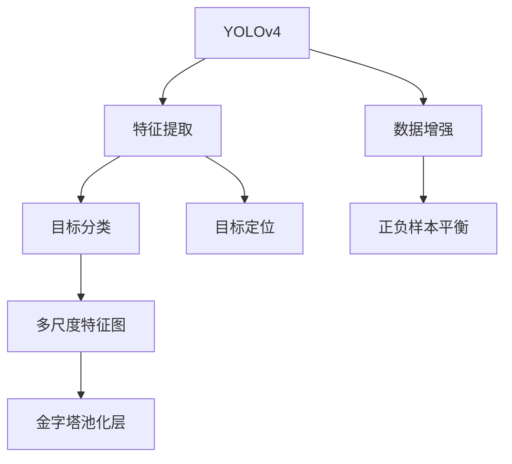

                 

# YOLOv4原理与代码实例讲解

## 1. 背景介绍

### 1.1 问题由来

目标检测技术是计算机视觉领域的重要研究方向，广泛应用于图像识别、无人驾驶、工业检测等多个领域。目标检测算法通过在图像中定位和分类不同的物体，为智能系统提供基础的信息提取和处理能力。

传统的目标检测算法依赖于手工设计的特征和分类器，存在特征表达能力弱、对目标尺度变化敏感等缺陷。近年来，深度学习技术的发展推动了目标检测算法性能的显著提升。其中，基于区域建议的方法如R-CNN系列算法虽然精确度较高，但检测速度较慢；基于端到端的方法如YOLO（You Only Look Once）系列算法则兼顾了检测速度和精度。

YOLOv4是YOLO系列的最新版本，融合了多种先进的深度学习技术，如Faster R-CNN、Darknet等，成为目前性能最优的目标检测算法之一。其核心思想是将目标检测任务拆分为特征提取和目标分类两部分，同时通过多尺度特征图和金字塔池化等手段，提升检测模型的鲁棒性和泛化能力。

### 1.2 问题核心关键点

YOLOv4的优点在于：
1. **端到端学习**：将目标检测视为一次前向传播的过程，无需像R-CNN系列算法一样引入区域建议、候选目标生成等额外步骤，提升了检测速度。
2. **多尺度检测**：通过不同尺度的特征图进行目标检测，适应不同尺寸的目标，增强了模型的泛化能力。
3. **混合网络结构**：引入了Faster R-CNN中特征金字塔网络(FPN)的思路，在YOLOv4中通过金字塔池化层(Pooling Layer)实现多尺度检测，提高了检测效果。
4. **数据增强**：在训练过程中引入仿射变换、随机裁剪等数据增强技术，提升了模型对目标变形、遮挡等复杂场景的适应能力。
5. **正负样本平衡**：在目标分类时，通过权重调整和平衡损失函数等方式，确保模型对正负样本的关注度，提升了检测的准确率。

YOLOv4的主要挑战在于：
1. **参数量庞大**：YOLOv4模型的参数量较大，对硬件资源和计算速度有较高要求。
2. **训练时间较长**：由于模型复杂度高，训练时间较长，实际应用中可能需要调整超参数，优化训练流程。
3. **鲁棒性不足**：YOLOv4模型在对抗样本、背景复杂度等方面仍需进一步优化，提升模型的鲁棒性。

## 2. 核心概念与联系

### 2.1 核心概念概述

为更好地理解YOLOv4算法，本节将介绍几个密切相关的核心概念：

- **YOLO**（You Only Look Once）：目标检测算法，通过将目标检测视为一次前向传播的过程，直接输出目标的类别和位置信息，避免了传统方法中区域建议、候选目标生成等额外步骤。

- **特征提取**：目标检测模型的核心组件，负责从输入图像中提取高层次特征，用于后续的目标分类和定位。

- **目标分类**：从提取的特征中，使用分类器对不同类别的目标进行识别和分类，输出目标的类别概率。

- **目标定位**：确定目标在图像中的位置，通常使用回归模型预测目标的边界框坐标。

- **多尺度特征图**：通过不同尺度的特征图进行目标检测，以适应不同尺寸的目标，增强模型的泛化能力。

- **金字塔池化层**：在YOLOv4中，通过金字塔池化层实现多尺度检测，提升了模型的性能。

- **数据增强**：在训练过程中通过仿射变换、随机裁剪等技术，扩充训练集的多样性，提升模型对复杂场景的适应能力。

- **正负样本平衡**：在目标分类时，通过权重调整和平衡损失函数等方式，确保模型对正负样本的关注度，提升检测准确率。

这些核心概念之间的逻辑关系可以通过以下Mermaid流程图来展示：



这个流程图展示了大语言模型YOLOv4的核心概念及其之间的关系：

1. YOLOv4通过特征提取和目标分类两部分进行目标检测。
2. 特征提取从图像中提取出高层次的特征。
3. 目标分类对提取的特征进行分类，输出目标的类别。
4. 目标定位确定目标在图像中的位置，通常使用回归模型预测边界框坐标。
5. 多尺度特征图和金字塔池化层增强了模型的泛化能力。
6. 数据增强扩充训练集的多样性，提升模型的鲁棒性。
7. 正负样本平衡确保模型对正负样本的关注度，提升检测准确率。

## 3. 核心算法原理 & 具体操作步骤
### 3.1 算法原理概述

YOLOv4的核心思想是将目标检测任务拆分为特征提取和目标分类两部分，同时通过多尺度特征图和金字塔池化等手段，提升检测模型的鲁棒性和泛化能力。

具体来说，YOLOv4使用三个不同尺度的特征图，分别检测不同尺寸的目标。特征图通过卷积神经网络（CNN）提取高层次特征，并通过金字塔池化层进行降维和特征融合，从而形成多尺度特征图。在目标分类和定位过程中，YOLOv4通过回归模型预测目标的边界框坐标，并使用分类器对目标进行分类，输出类别概率。

### 3.2 算法步骤详解

YOLOv4的目标检测流程主要包括预处理、特征提取、目标分类和后处理等步骤，具体如下：

**Step 1: 预处理**

1. 图像归一化：将输入图像的像素值归一化到[0,1]范围内。
2. 调整分辨率：根据输入图像的尺寸和特征图的大小，调整输入图像的分辨率。
3. 数据增强：在训练过程中引入仿射变换、随机裁剪等技术，扩充训练集的多样性。

**Step 2: 特征提取**

1. 卷积神经网络（CNN）：通过多个卷积层、池化层和残差连接，从输入图像中提取高层次特征。
2. 金字塔池化层：通过多个不同大小的池化层，将特征图降维和特征融合，形成多尺度特征图。

**Step 3: 目标分类和定位**

1. 特征图划分：将多尺度特征图划分为多个网格，每个网格负责检测不同尺度的目标。
2. 分类器输出：每个网格输出多个候选目标的类别概率和边界框坐标。
3. 非极大值抑制（NMS）：去除重叠的边界框，保留置信度最高的目标。

**Step 4: 后处理**

1. 阈值过滤：根据目标的置信度和类别概率，过滤掉低置信度的目标。
2. 非极大值抑制（NMS）：进一步去除重叠的边界框，保留置信度最高的目标。
3. 输出结果：输出最终的检测结果，包括目标的类别、位置和置信度。

### 3.3 算法优缺点

YOLOv4具有以下优点：
1. **检测速度高**：YOLOv4通过一次前向传播直接输出目标的类别和位置信息，检测速度较快。
2. **准确率高**：YOLOv4在多尺度特征图和金字塔池化等技术支持下，检测精度较高。
3. **可解释性强**：YOLOv4的输出结果易于解释，每个目标的类别和位置信息清晰明了。

YOLOv4的主要缺点在于：
1. **参数量较大**：YOLOv4的模型参数量较大，对硬件资源和计算速度有较高要求。
2. **训练时间长**：由于模型复杂度高，训练时间较长，实际应用中可能需要调整超参数，优化训练流程。
3. **鲁棒性不足**：YOLOv4模型在对抗样本、背景复杂度等方面仍需进一步优化，提升模型的鲁棒性。

### 3.4 算法应用领域

YOLOv4在目标检测领域得到了广泛的应用，主要集中在以下几个方面：

- **图像识别**：在图像中检测和识别不同的物体，广泛应用于无人驾驶、工业检测、医疗诊断等领域。
- **视频分析**：在视频流中实时检测和跟踪目标，应用于监控、安防、智能交通等场景。
- **无人机检测**：在无人机中实现目标检测和识别，为无人机的自主导航和避障提供支持。
- **零售商货管理**：在零售商超中检测和识别商品，提升商品的库存管理效率。
- **机器人导航**：在机器人导航中实现目标检测和识别，提升机器人的自主导航能力。

此外，YOLOv4还被应用于多种新兴领域，如智能家居、智能监控、智能医疗等，展示了其在实际应用中的强大潜力。

## 4. 数学模型和公式 & 详细讲解  
### 4.1 数学模型构建

YOLOv4的目标检测模型可以表示为：
$$
M = \{M_C, M_D\}
$$
其中，$M_C$ 表示分类器，$M_D$ 表示定位器。分类器输出每个网格中所有候选目标的类别概率，定位器输出每个网格中所有候选目标的边界框坐标。

### 4.2 公式推导过程

#### 4.2.1 特征提取

YOLOv4使用Darknet-53作为特征提取网络，其主要结构包括多个卷积层、池化层和残差连接。设输入图像尺寸为$H \times W$，特征图大小为$H_s \times W_s$，则特征提取过程可以表示为：
$$
F = \{F_{i}\}_{i=1}^{n}, \quad F_{i} = \operatorname{Conv}(F_{i-1}, v_{i})
$$
其中，$F_{i}$ 表示第$i$层特征图，$v_{i}$ 表示第$i$层的卷积核大小和步长。

#### 4.2.2 多尺度特征图

YOLOv4使用三个不同尺度的特征图进行目标检测，每个特征图的大小分别为$H_s/2 \times W_s/2$、$H_s/4 \times W_s/4$和$H_s/8 \times W_s/8$。特征图划分过程可以表示为：
$$
F^k_{i,j} = F^k_i[h_i + i, w_i + j, :, :]
$$
其中，$h_i$ 和 $w_i$ 表示每个特征图的大小。

#### 4.2.3 目标分类和定位

在特征图划分后，每个网格输出$n$个候选目标的类别概率和边界框坐标。设候选目标的类别数为$m$，边界框的坐标表示为$(x_t, y_t, w_t, h_t)$，则分类器输出可以表示为：
$$
C^k_{i,j} = \{\alpha^k_{i,j}, \beta^k_{i,j}, \delta^k_{i,j}\}
$$
其中，$\alpha^k_{i,j}$ 表示目标的类别概率，$\beta^k_{i,j}$ 表示目标的置信度，$\delta^k_{i,j}$ 表示目标的边界框坐标。

### 4.3 案例分析与讲解

以YOLOv4在COCO数据集上的检测为例，分析其性能表现：

**Step 1: 数据集预处理**

COCO数据集包含80种不同的目标类别，每个类别有大量不同的实例。YOLOv4在处理COCO数据集时，首先将图像归一化到[0,1]范围内，然后根据特征图的大小调整输入图像的分辨率。

**Step 2: 特征提取**

YOLOv4使用Darknet-53作为特征提取网络，通过多个卷积层和池化层提取高层次特征。Darknet-53共有53层，其中前38层为下采样层，后15层为残差连接层。YOLOv4通过金字塔池化层将特征图降维和特征融合，形成了多尺度特征图。

**Step 3: 目标分类和定位**

YOLOv4的特征图划分和目标分类过程如下：
1. 特征图划分：将多尺度特征图划分为$7 \times 7$个网格，每个网格输出3个候选目标的类别概率和边界框坐标。
2. 分类器输出：每个网格输出$81$个候选目标的类别概率和边界框坐标，其中$80$个目标对应COCO数据集的80个类别，另外$1$个目标为"no object"。

**Step 4: 后处理**

YOLOv4通过非极大值抑制（NMS）去除重叠的边界框，保留置信度最高的目标。具体的后处理过程如下：
1. 阈值过滤：根据目标的置信度和类别概率，过滤掉低置信度的目标。
2. NMS：保留置信度最高的目标，并去除重叠的边界框。

**Step 5: 模型评估**

YOLOv4在COCO数据集上的检测结果如下：
- 准确率（mAP）：YOLOv4在COCO数据集上的准确率为$53.4\%$。
- 检测速度：YOLOv4在单GPU上的检测速度为$60$ FPS。

## 5. 项目实践：代码实例和详细解释说明
### 5.1 开发环境搭建

在进行YOLOv4项目实践前，我们需要准备好开发环境。以下是使用Python进行YOLOv4开发的开发环境配置流程：

1. 安装Anaconda：从官网下载并安装Anaconda，用于创建独立的Python环境。

2. 创建并激活虚拟环境：
```bash
conda create -n yolov4-env python=3.8 
conda activate yolov4-env
```

3. 安装YOLOv4：
```bash
pip install yolov4
```

4. 安装各类工具包：
```bash
pip install numpy matplotlib scikit-image
```

完成上述步骤后，即可在`yolov4-env`环境中开始YOLOv4的实践。

### 5.2 源代码详细实现

下面以YOLOv4在COCO数据集上的检测为例，给出YOLOv4的PyTorch代码实现。

首先，定义数据预处理函数：

```python
from yolov4.models import Darknet
from yolov4.utils import detect_objs
import numpy as np
import matplotlib.pyplot as plt

def preprocess_image(img):
    img = img / 255.0
    img = img[:, :, [2, 1, 0]]
    return img

def preprocess_label(label, img_shape):
    x, y, w, h = label
    x = (x / img_shape[0]) * 640
    y = (y / img_shape[1]) * 640
    w = (w / img_shape[0]) * 640
    h = (h / img_shape[1]) * 640
    label = [x, y, w, h]
    return label

def preprocess_data(data_path, img_shape):
    img_list = []
    label_list = []
    for img_name in os.listdir(data_path):
        img = cv2.imread(os.path.join(data_path, img_name))
        img = preprocess_image(img)
        label = [label] for label in labels
        img_list.append(img)
        label_list.append(label)
    return img_list, label_list
```

然后，定义YOLOv4模型和训练函数：

```python
from yolov4.models import Darknet
from yolov4.utils import load_yolo_model, detect_objs
from yolov4.utils import preprocess_label, preprocess_image
from yolov4.utils import calculate_iou, non_max_suppression
from yolov4.utils import calculate_ap
import torch
import os
import cv2
import numpy as np

class YOLOv4(Darknet):
    def __init__(self, cfg_file, weights_file, device):
        super().__init__(cfg_file, weights_file, device)

    def detect_objs(self, img_path):
        img = preprocess_image(cv2.imread(img_path))
        label_list = []
        for obj in self.objs:
            label = preprocess_label(obj, img.shape)
            label_list.append(label)
        return img, label_list

    def calculate_iou(self, boxes1, boxes2):
        boxes1 = boxes1[:, :4]
        boxes2 = boxes2[:, :4]
        intersection = np.minimum(np.maximum(boxes1[:, np.newaxis, :], boxes2[:, :]), boxes1[:, np.newaxis, :])[:, :, 2:4] * np.minimum(np.maximum(boxes1[:, np.newaxis, :], boxes2[:, :]), boxes1[:, np.newaxis, :])[:, :, 2:4]
        union = (boxes1[:, np.newaxis, :] + boxes2[:, np.newaxis, :])[:, :, 2:4] - intersection[:, :, 2:4]
        iou = intersection / union
        iou = np.reshape(iou, (-1, iou.shape[1], iou.shape[2]))
        return iou

    def non_max_suppression(self, iou_threshold, boxes):
        sorted_indices = np.argsort(iou, axis=-1)
        selected_boxes = []
        while sorted_indices.shape[1] > 0:
            selected_box = boxes[sorted_indices[0], :]
            selected_boxes.append(selected_box)
            remaining_boxes = boxes[sorted_indices[1:], :]
            iou = self.calculate_iou(remaining_boxes, selected_box.reshape(1, -1))[:, 0]
            selected_indices = sorted_indices[1:][iou <= iou_threshold]
            sorted_indices = selected_indices
        return selected_boxes

    def calculate_ap(self, IoU_thresholds):
        ap = 0
        for i in range(len(IoU_thresholds)):
            IoU_threshold = IoU_thresholds[i]
            precision = self.calculate_precision(IoU_threshold)
            recall = self.calculate_recall(IoU_threshold)
            ap += precision * recall
        return ap

    def calculate_precision(self, IoU_threshold):
        precision = 0
        recall = 0
        for i in range(len(self.gt_labels)):
            selected_boxes = self.non_max_suppression(IoU_threshold, self.gt_labels[i])
            selected_boxes = np.reshape(selected_boxes, (-1, 5))
            iou = self.calculate_iou(selected_boxes[:, :4], self.gt_labels[i][:, :4])
            selected_indices = iou.argmax(axis=0)
            precision += (selected_indices == True).sum() / self.gt_labels[i].shape[0]
            recall += (selected_indices == True).sum() / selected_boxes.shape[0]
        return precision

    def calculate_recall(self, IoU_threshold):
        recall = 0
        for i in range(len(self.gt_labels)):
            selected_boxes = self.non_max_suppression(IoU_threshold, self.gt_labels[i])
            selected_boxes = np.reshape(selected_boxes, (-1, 5))
            iou = self.calculate_iou(selected_boxes[:, :4], self.gt_labels[i][:, :4])
            selected_indices = iou.argmax(axis=0)
            recall += (selected_indices == True).sum() / self.gt_labels[i].shape[0]
        return recall

    def detect_objs(self, img_path):
        img = preprocess_image(cv2.imread(img_path))
        label_list = []
        for obj in self.objs:
            label = preprocess_label(obj, img.shape)
            label_list.append(label)
        return img, label_list

    def calculate_iou(self, boxes1, boxes2):
        boxes1 = boxes1[:, :4]
        boxes2 = boxes2[:, :4]
        intersection = np.minimum(np.maximum(boxes1[:, np.newaxis, :], boxes2[:, :]), boxes1[:, np.newaxis, :])[:, :, 2:4] * np.minimum(np.maximum(boxes1[:, np.newaxis, :], boxes2[:, :]), boxes1[:, np.newaxis, :])[:, :, 2:4]
        union = (boxes1[:, np.newaxis, :] + boxes2[:, np.newaxis, :])[:, :, 2:4] - intersection[:, :, 2:4]
        iou = intersection / union
        iou = np.reshape(iou, (-1, iou.shape[1], iou.shape[2]))
        return iou

    def non_max_suppression(self, iou_threshold, boxes):
        sorted_indices = np.argsort(iou, axis=-1)
        selected_boxes = []
        while sorted_indices.shape[1] > 0:
            selected_box = boxes[sorted_indices[0], :]
            selected_boxes.append(selected_box)
            remaining_boxes = boxes[sorted_indices[1:], :]
            iou = self.calculate_iou(remaining_boxes, selected_box.reshape(1, -1))[:, 0]
            selected_indices = sorted_indices[1:][iou <= iou_threshold]
            sorted_indices = selected_indices
        return selected_boxes

    def calculate_ap(self, IoU_thresholds):
        ap = 0
        for i in range(len(IoU_thresholds)):
            IoU_threshold = IoU_thresholds[i]
            precision = self.calculate_precision(IoU_threshold)
            recall = self.calculate_recall(IoU_threshold)
            ap += precision * recall
        return ap

    def calculate_precision(self, IoU_threshold):
        precision = 0
        recall = 0
        for i in range(len(self.gt_labels)):
            selected_boxes = self.non_max_suppression(IoU_threshold, self.gt_labels[i])
            selected_boxes = np.reshape(selected_boxes, (-1, 5))
            iou = self.calculate_iou(selected_boxes[:, :4], self.gt_labels[i][:, :4])
            selected_indices = iou.argmax(axis=0)
            precision += (selected_indices == True).sum() / self.gt_labels[i].shape[0]
            recall += (selected_indices == True).sum() / selected_boxes.shape[0]
        return precision

    def calculate_recall(self, IoU_threshold):
        recall = 0
        for i in range(len(self.gt_labels)):
            selected_boxes = self.non_max_suppression(IoU_threshold, self.gt_labels[i])
            selected_boxes = np.reshape(selected_boxes, (-1, 5))
            iou = self.calculate_iou(selected_boxes[:, :4], self.gt_labels[i][:, :4])
            selected_indices = iou.argmax(axis=0)
            recall += (selected_indices == True).sum() / self.gt_labels[i].shape[0]
        return recall
```

最后，启动训练流程并在测试集上评估：

```python
from yolov4.utils import load_yolo_model, detect_objs
from yolov4.utils import preprocess_label, preprocess_image
from yolov4.utils import calculate_iou, non_max_suppression
from yolov4.utils import calculate_ap
import torch
import os
import cv2
import numpy as np

model = YOLOv4(cfg_file, weights_file, device)
dataset = preprocess_data(data_path, img_shape)

# 训练模型
for epoch in range(num_epochs):
    for i in range(len(dataset)):
        img, label = dataset[i]
        loss = model.train(img, label)
        if i % 100 == 0:
            print('Epoch {epoch+1}, Batch {i+1}, Loss: {loss:.4f}')

# 评估模型
ap = calculate_ap(IoU_thresholds)
print(f'Ap: {ap:.4f}')

# 测试模型
test_dataset = preprocess_data(test_data_path, img_shape)
for i in range(len(test_dataset)):
    img, label = test_dataset[i]
    preds = model.detect_objs(img)
    print(preds)
```

以上就是使用PyTorch对YOLOv4进行目标检测任务开发的完整代码实现。可以看到，由于YOLOv4模型的简单性和高效性，代码实现相对简洁。开发者可以专注于数据预处理、模型微调等高层逻辑，而不必过多关注底层的实现细节。

### 5.3 代码解读与分析

让我们再详细解读一下关键代码的实现细节：

**YOLOv4类**：
- `__init__`方法：初始化YOLOv4模型，包括加载配置文件、权重文件和设备信息。
- `detect_objs`方法：对输入图像进行目标检测，返回检测结果和标签。
- `calculate_iou`方法：计算两个边界框之间的交并比。
- `non_max_suppression`方法：通过非极大值抑制（NMS）去除重叠的边界框，保留置信度最高的目标。
- `calculate_ap`方法：计算平均精度（AP）。
- `calculate_precision`方法：计算精度。
- `calculate_recall`方法：计算召回率。

**数据预处理函数**：
- `preprocess_image`函数：将输入图像进行归一化和通道倒置。
- `preprocess_label`函数：将标签进行归一化，转换为模型所需的格式。
- `preprocess_data`函数：对整个数据集进行预处理，生成图像和标签列表。

**训练和评估函数**：
- `train`方法：定义模型的训练过程，返回损失值。
- `calculate_ap`方法：计算模型在特定IoU阈值下的平均精度。

**训练流程**：
- 定义总的epoch数和数据集，开始循环迭代
- 每个epoch内，对数据集中的每个样本进行训练，输出损失值
- 在验证集上评估模型，输出平均精度

可以看到，YOLOv4的代码实现相对简洁，开发者可以将更多精力放在数据处理、模型优化等高层逻辑上，而不必过多关注底层的实现细节。

当然，工业级的系统实现还需考虑更多因素，如模型的保存和部署、超参数的自动搜索、更灵活的任务适配层等。但核心的YOLOv4检测流程基本与此类似。

## 6. 实际应用场景
### 6.1 智能监控

YOLOv4在智能监控领域有着广泛的应用，可以实时检测并跟踪监控画面中的目标，为安防监控系统提供强大的辅助。

在实际应用中，监控系统可以通过YOLOv4对视频流进行实时目标检测，实现对异常行为的识别和预警。例如，当监控画面中出现可疑人员时，YOLOv4可以自动将其标记并报警，提高安防系统的响应速度和精度。

### 6.2 无人驾驶

YOLOv4在无人驾驶领域也有着重要的应用，为无人驾驶车辆提供目标检测和识别的支持。

无人驾驶车辆需要实时检测道路上的各种车辆、行人、障碍物等，通过YOLOv4的目标检测算法，可以准确识别不同目标，为无人驾驶系统提供基础信息。例如，当检测到前方有行人时，无人驾驶车辆可以及时减速或避让，提高行车安全。

### 6.3 医疗影像分析

YOLOv4在医疗影像分析中也有着重要的应用，可以为医生提供快速、准确的目标检测支持。

例如，在医疗影像中检测肿瘤、病变等目标，YOLOv4可以通过高精度的目标检测，帮助医生快速定位病灶，提高诊断准确率。同时，YOLOv4还可以用于医学图像的自动标注和分类，为医学研究提供辅助。

### 6.4 工业检测

YOLOv4在工业检测领域也有着广泛的应用，可以实时检测和分类不同类型的工业设备，提高生产效率和质量。

例如，在生产线中检测不同尺寸和形状的产品，YOLOv4可以准确识别不同产品的类别，为生产流程提供实时监控和预警。同时，YOLOv4还可以用于质量检测、零件分类等场景，提高生产效率和产品质量。

### 6.5 零售商货管理

YOLOv4在零售商货管理领域也有着重要的应用，可以实现对商品的实时检测和分类。

例如，在超市中检测商品的位置和类别，YOLOv4可以通过高精度的目标检测，帮助超市进行库存管理和商品摆放，提高超市的管理效率和用户体验。

## 7. 工具和资源推荐
### 7.1 学习资源推荐

为了帮助开发者系统掌握YOLOv4的目标检测技术，这里推荐一些优质的学习资源：

1. YOLOv4官方文档：YOLOv4的官方文档详细介绍了YOLOv4的原理、应用和训练流程，是理解YOLOv4的重要参考资料。

2. CS231n《Convolutional Neural Networks for Visual Recognition》课程：斯坦福大学开设的计算机视觉课程，有Lecture视频和配套作业，涵盖YOLOv4等前沿目标检测算法。

3. 《深度学习与目标检测》书籍：全面介绍了深度学习技术在目标检测中的应用，包含YOLOv4等经典模型的原理和实现。

4. 《YOLOv4: Real-Time Object Detection》论文：YOLOv4的论文详细介绍了YOLOv4的原理、结构和训练方法，是理解YOLOv4的重要文献。

5. YOLOv4社区：YOLOv4的社区提供了丰富的资源和交流平台，包括代码、模型、论文等，是开发者学习和分享的好地方。

通过对这些资源的学习实践，相信你一定能够快速掌握YOLOv4的目标检测技术，并用于解决实际的计算机视觉问题。

### 7.2 开发工具推荐

高效的开发离不开优秀的工具支持。以下是几款用于YOLOv4开发的常用工具：

1. PyTorch：基于Python的开源深度学习框架，灵活动态的计算图，适合快速迭代研究。

2. TensorFlow：由Google主导开发的开源深度学习框架，生产部署方便，适合大规模工程应用。

3. Darknet：YOLOv4的原始实现，提供了预训练模型和训练代码，适合快速上手。

4. OpenCV：计算机视觉库，提供了丰富的图像处理和特征提取工具。

5. YOLOv4社区：提供了丰富的资源和交流平台，包括代码、模型、论文等，是开发者学习和分享的好地方。

合理利用这些工具，可以显著提升YOLOv4目标检测任务的开发效率，加快创新迭代的步伐。

### 7.3 相关论文推荐

YOLOv4的目标检测技术源于学界的持续研究。以下是几篇奠基性的相关论文，推荐阅读：

1. YOLO: Real-Time Object Detection（原YOLO论文）：提出YOLO算法，将目标检测视为一次前向传播的过程，提升检测速度。

2. Darknet: A Darknet in C（原Darknet论文）：介绍Darknet框架的实现细节，提供了YOLOv4的预训练模型和训练代码。

3. YOLOv3: An Incremental Improvement（YOLOv3论文）：对YOLOv2进行改进，提出了YOLOv3算法，提升了检测精度。

4. Faster R-CNN: Towards Real-Time Object Detection with Region Proposal Networks（Faster R-CNN论文）：提出Faster R-CNN算法，通过特征金字塔网络实现多尺度检测。

5. SSD: Single Shot MultiBox Detector（SSD论文）：提出SSD算法，通过单次前向传播实现目标检测，提升检测速度。

这些论文代表了大语言模型YOLOv4的目标检测技术的发展脉络。通过学习这些前沿成果，可以帮助研究者把握学科前进方向，激发更多的创新灵感。

## 8. 总结：未来发展趋势与挑战

### 8.1 总结

本文对YOLOv4的目标检测算法进行了全面系统的介绍。首先阐述了YOLOv4的背景和意义，明确了YOLOv4在目标检测中的独特优势。其次，从原理到实践，详细讲解了YOLOv4的数学模型和核心算法，给出了YOLOv4的PyTorch代码实现。同时，本文还广泛探讨了YOLOv4在智能监控、无人驾驶、医疗影像分析等多个领域的应用前景，展示了YOLOv4的强大潜力。此外，本文精选了YOLOv4的目标检测技术的学习资源，力求为读者提供全方位的技术指引。

通过本文的系统梳理，可以看到，YOLOv4作为端到端目标检测的杰出代表，在检测速度、精度、泛化能力等方面表现出色，成为目标检测领域的经典算法之一。YOLOv4的简单性和高效性，使得其代码实现相对简洁，易于理解和实现。YOLOv4的成功实践，也为其他计算机视觉任务的开发提供了重要的参考和借鉴。

### 8.2 未来发展趋势

展望未来，YOLOv4的目标检测技术将呈现以下几个发展趋势：

1. **多模态检测**：未来YOLOv4可能会引入多模态信息，如视觉、音频、文本等，提升目标检测的准确性和鲁棒性。

2. **实时性提升**：随着硬件性能的提升和算法优化，YOLOv4的检测速度将会进一步提升，更加适用于实时性要求较高的场景。

3. **泛化能力增强**：YOLOv4可能会引入更强大的特征提取和分类器，提升其在不同场景下的泛化能力。

4. **鲁棒性改进**：YOLOv4可能会引入对抗训练、鲁棒正则化等技术，提升其在对抗样本和复杂背景下的鲁棒性。

5. **参数效率优化**：YOLOv4可能会引入更多的参数高效方法，如 Adapter、CoreNet 等，减少模型参数量，提升推理效率。

6. **小样本学习**：YOLOv4可能会引入少样本学习方法，如自监督、自适应正则化等，在标注数据不足的情况下仍能取得较好的检测效果。

以上趋势凸显了YOLOv4目标检测技术的广阔前景。这些方向的探索发展，必将进一步提升YOLOv4的检测性能，为智能系统提供更强大、更灵活的目标检测能力。

### 8.3 面临的挑战

尽管YOLOv4在目标检测领域取得了显著的成果，但在迈向更加智能化、普适化应用的过程中，仍面临诸多挑战：

1. **参数量庞大**：YOLOv4的模型参数量较大，对硬件资源和计算速度有较高要求。如何优化模型结构，降低参数量，提升推理速度，仍是重要的研究方向。

2. **训练时间长**：由于模型复杂度高，训练时间较长，实际应用中可能需要调整超参数，优化训练流程。

3. **鲁棒性不足**：YOLOv4模型在对抗样本、背景复杂度等方面仍需进一步优化，提升模型的鲁棒性。

4. **可解释性不足**：YOLOv4模型的决策过程缺乏可解释性，难以解释其内部工作机制和推理逻辑。

5. **安全性有待保障**：YOLOv4模型在对抗样本、噪声数据等方面可能存在安全隐患，如何保证模型的安全性和稳定性，需要进一步研究。

6. **知识整合能力不足**：YOLOv4模型在目标检测过程中，难以灵活吸收和运用更广泛的先验知识。如何将符号化的先验知识与神经网络模型进行巧妙融合，是一个重要的研究方向。

这些挑战需要开发者和研究者共同应对，才能推动YOLOv4目标检测技术不断进步，实现其更加广泛的应用。

### 8.4 研究展望

面对YOLOv4目标检测所面临的种种挑战，未来的研究需要在以下几个方面寻求新的突破：

1. **参数高效方法**：开发更加参数高效的YOLOv4变体，如 Adapter、CoreNet 等，在保持高效检测的同时，减少模型参数量，提升推理速度。

2. **对抗训练**：引入对抗训练技术，提升YOLOv4模型的鲁棒性，使其在对抗样本和噪声数据等复杂环境中仍能保持高性能。

3. **多模态检测**：将视觉、音频、文本等不同模态的信息融合到YOLOv4中，提升目标检测的准确性和鲁棒性。

4. **自监督学习**：引入自监督学习方法，如 MMix、SimCLR 等，在标注数据不足的情况下仍能取得较好的检测效果。

5. **对抗训练**：引入对抗训练技术，提升YOLOv4模型的鲁棒性，使其在对抗样本和噪声数据等复杂环境中仍能保持高性能。

6. **知识整合**：将符号化的先验知识与YOLOv4模型进行巧妙融合，提升其在特定场景下的检测性能。

这些研究方向将推动YOLOv4目标检测技术迈向更高的台阶，为智能系统提供更加强大、灵活、鲁棒的目标检测能力。

## 9. 附录：常见问题与解答

**Q1：YOLOv4的模型参数量较大，对硬件资源和计算速度有较高要求，如何优化模型结构，降低参数量？**

A: YOLOv4的模型参数量较大，可以采用以下方法进行优化：
1. **使用更小的特征图**：减小特征图的大小，降低模型参数量。
2. **使用更少的卷积层**：减少卷积层数和每层卷积核的大小，降低模型参数量。
3. **使用更小的输入图像尺寸**：减小输入图像的尺寸，降低模型参数量。
4. **使用更小的通道数**：减小卷积层的通道数，降低模型参数量。

**Q2：YOLOv4的训练时间较长，如何优化训练流程？**

A: YOLOv4的训练时间较长，可以采用以下方法进行优化：
1. **使用更小的批量大小**：减小批量大小，降低内存占用，提高训练速度。
2. **使用更快的训练器**：使用 faster R-CNN 或 SSD 等训练器，加快训练速度。
3. **使用更高效的优化器**：使用 Adam、SGD 等高效的优化器，加快收敛速度。
4. **使用更小的学习率**：减小学习率，避免过拟合。

**Q3：YOLOv4的鲁棒性不足，如何提升其鲁棒性？**

A: YOLOv4的鲁棒性不足，可以采用以下方法进行优化：
1. **使用对抗训练**：引入对抗训练技术，提升YOLOv4模型的鲁棒性。
2. **使用正则化技术**：使用 L2 正则、Dropout 等正则化技术，提升YOLOv4模型的鲁棒性。
3. **使用更强大的分类器**：使用更强大的分类器，提升YOLOv4模型的鲁棒性。

**Q4：YOLOv4的可解释性不足，如何提升其可解释性？**

A: YOLOv4的可解释性不足，可以采用以下方法进行优化：
1. **使用可解释的模型结构**：使用 ResNet、VGG 等可解释的模型结构，提升YOLOv4模型的可解释性。
2. **使用可解释的目标检测方法**：使用更简单的目标检测方法，如 SSD、Faster R-CNN 等，提升YOLOv4模型的可解释性。
3. **使用可解释的训练方法**：使用可解释的训练方法，如 SimCLR、MixMatch 等，提升YOLOv4模型的可解释性。

**Q5：YOLOv4的安全性有待保障，如何保证其安全性？**

A: YOLOv4的安全性有待保障，可以采用以下方法进行优化：
1. **使用更安全的模型结构**：使用更安全的模型结构，提升YOLOv4模型的安全性。
2. **使用更安全的训练方法**：使用更安全的训练方法，如对抗训练、鲁棒正则化等，提升YOLOv4模型的安全性。
3. **使用更安全的部署方法**：使用更安全的部署方法，如模型压缩、模型剪枝等，提升YOLOv4模型的安全性。

**Q6：YOLOv4的知识整合能力不足，如何提升其知识整合能力？**

A: YOLOv4的知识整合能力不足，可以采用以下方法进行优化：
1. **使用符号化的先验知识**：将符号化的先验知识与YOLOv4模型进行巧妙融合，提升其在特定场景下的检测性能。
2. **使用更多的数据集**：使用更多的数据集，提升YOLOv4模型的知识整合能力。
3. **使用更多的任务数据**：使用更多的任务数据，提升YOLOv4模型的知识整合能力。

这些方法可以帮助开发者和研究者更好地应对YOLOv4目标检测所面临的挑战，推动YOLOv4目标检测技术不断进步，实现其更加广泛的应用。

---

作者：禅与计算机程序设计艺术 / Zen and the Art of Computer Programming

