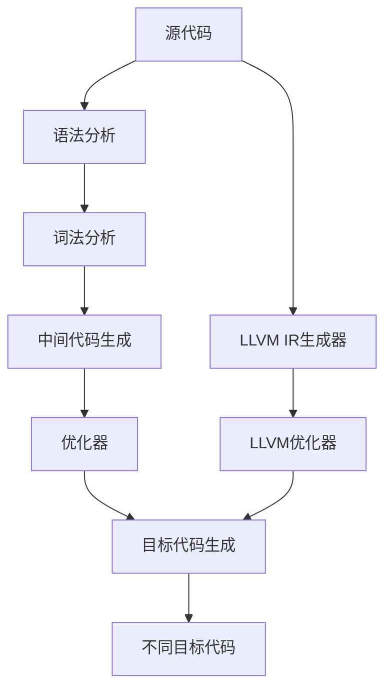

                 

# llvm中间代码生成与优化

> 关键词：编译器, LLVM, IR, SSA, 中间代码, 优化, 代码生成

## 1. 背景介绍

### 1.1 问题由来

在计算机程序设计中，源代码的编译和优化是一个复杂而重要的过程。早期的编译器主要依赖于传统的静态分析技术，如语法分析、词法分析、中间代码生成等。然而，随着程序的规模和复杂度不断增大，这些技术已经难以满足现代程序的高性能需求。

为此，LLVM（Low-Level Virtual Machine）应运而生。LLVM是一个基于IR（Intermediate Representation）的现代编译器框架，能够提供高效的代码生成和优化功能。LLVM的IR模型采用SSA（Static Single Assignment Form），能够在编译时进行更精细的优化，同时降低了目标代码的复杂度，提高了可读性和可维护性。

### 1.2 问题核心关键点

LLVM中间代码生成与优化主要包括以下几个关键点：

- IR的SSA表示：将程序转化为SSA中间代码，便于编译器进行各种优化操作。
- 多目标代码生成器：支持生成不同的目标代码（如x86、ARM、PowerPC等），并提供中间代码到不同架构的转换。
- 广泛的优化工具：LLVM内置了各种优化技术，如向量化、死代码消除、循环展开等，能够高效地提升程序性能。
- 动态分析与优化：支持动态分析，如运行时插桩，收集程序运行时数据，进行更精确的优化。

这些关键点共同构成了LLVM的强大编译能力，使其在学术界和工业界广受关注。通过理解这些核心概念，我们可以更好地把握LLVM的工作原理和优化方向。

## 2. 核心概念与联系

### 2.1 核心概念概述

为更好地理解LLVM中间代码生成与优化的过程，本节将介绍几个密切相关的核心概念：

- IR（Intermediate Representation）: 中间代码，用于表示源代码的抽象层次。LLVM使用SSA中间代码作为其IR表示形式。
- SSA（Static Single Assignment Form）: 静态单赋值形式，一种中间代码的表示方式，便于编译器进行各种优化操作。
- LLVM框架: 一个现代编译器框架，支持从源代码到目标代码的完整编译流程，包括IR生成、优化和代码生成。
- LLVM IR生成器: LLVM提供了一系列的IR生成器，能够将源代码转化为LLVM IR形式。
- LLVM优化器: LLVM内置了丰富的优化技术，如向量化、死代码消除、循环展开等，用于提升代码性能。
- LLVM目标代码生成器: LLVM支持生成各种目标代码，并提供了中间代码到不同架构的转换工具。

这些核心概念之间的逻辑关系可以通过以下Mermaid流程图来展示：



这个流程图展示了这个过程中各个步骤之间的关系：

1. 源代码经过语法分析和词法分析，生成中间代码。
2. 中间代码通过优化器进行各种优化操作。
3. 优化后的中间代码通过目标代码生成器生成目标代码。
4. LLVM框架提供了完整的编译流程，包括IR生成、优化和代码生成。
5. LLVM IR生成器和优化器都依赖于IR的SSA表示形式。
6. 不同目标代码通过LLVM的目标代码生成器生成。

这些概念共同构成了LLVM中间代码生成与优化的方法论框架，使得LLVM能够高效地完成编译和优化任务。

## 3. 核心算法原理 & 具体操作步骤
### 3.1 算法原理概述

LLVM中间代码生成与优化的基本原理如下：

1. 源代码经过语法分析和词法分析，生成中间代码。
2. 中间代码通过优化器进行各种优化操作。
3. 优化后的中间代码通过目标代码生成器生成目标代码。

这些步骤分别涉及编译器的不同模块，包括语法分析器、词法分析器、优化器、目标代码生成器等。LLVM采用SSA中间代码作为IR表示形式，使得编译器能够进行各种优化操作，并且生成的目标代码易于理解和调试。

### 3.2 算法步骤详解

LLVM中间代码生成与优化的主要步骤如下：

**Step 1: 源代码预处理**

在编译器开始执行源代码之前，需要进行预处理，包括文件包含、宏定义、预处理指令等。LLVM提供了前端分析器（Frontend Analysis）模块，能够处理这些预处理指令，生成中间代码。

**Step 2: 中间代码生成**

在源代码预处理完成后，编译器生成LLVM的IR表示形式。LLVM提供了一系列的IR生成器，包括CIRBuilder（LLVM中间代码构建器）、LLVM IR构建器等。这些IR生成器能够将源代码转化为SSA中间代码。

**Step 3: 中间代码优化**

LLVM的优化器采用静态分析技术，能够对中间代码进行各种优化操作，如死代码消除、循环展开、向量化、条件化等。这些优化操作能够显著提升程序性能。

**Step 4: 目标代码生成**

优化后的中间代码通过目标代码生成器生成目标代码。LLVM支持生成各种目标代码，并提供了中间代码到不同架构的转换工具。这些目标代码生成器能够生成高效的机器代码，支持现代处理器架构。

**Step 5: 输出目标代码**

生成的目标代码可以直接执行，或者进一步进行优化和调试。LLVM提供了调试工具（LLVM Debugger），能够进行代码调试和优化。

### 3.3 算法优缺点

LLVM中间代码生成与优化具有以下优点：

1. 通用性强：LLVM支持生成各种目标代码，并且支持多种架构。
2. 可扩展性好：LLVM提供了丰富的优化器和目标代码生成器，方便开发者进行扩展和定制。
3. 易于调试：LLVM采用SSA中间代码，便于进行代码调试和优化。
4. 性能高：LLVM的优化器能够进行各种高效的优化操作，提升程序性能。

然而，LLVM也存在一些缺点：

1. 学习成本高：LLVM的IR表示形式和优化技术比较复杂，需要较高的学习成本。
2. 开发周期长：LLVM的开发周期较长，需要大量的时间和精力。
3. 工具链复杂：LLVM的工具链比较复杂，需要开发者有一定的工具链支持。

尽管存在这些缺点，但就目前而言，LLVM仍是编译器领域的主流框架，其高效性和通用性得到了广泛认可。

### 3.4 算法应用领域

LLVM中间代码生成与优化广泛应用于以下领域：

- 高性能计算：LLVM的优化器和目标代码生成器能够生成高效的机器代码，支持高性能计算任务。
- 嵌入式系统：LLVM支持生成各种目标代码，能够适应不同的嵌入式系统架构。
- 编译器开发：LLVM是一个现代编译器框架，提供了完整的编译流程，支持编译器的开发和调试。
- 软件优化：LLVM的优化器能够进行各种高效的优化操作，提升软件性能。
- 深度学习：LLVM支持生成高效的深度学习代码，加速深度学习模型的训练和推理。

## 4. 数学模型和公式 & 详细讲解
### 4.1 数学模型构建

LLVM中间代码生成与优化涉及的数学模型包括LLVM IR表示形式、SSA中间代码等。下面将详细介绍这些数学模型。

**LLVM IR表示形式**

LLVM IR采用三元组表示形式，每个三元组表示一个中间代码指令，包括操作码、操作数和元数据。例如，一个加法指令可以表示为：

```
add i32 %x, %y, %z
```

其中，`add`为操作码，`i32`为类型，`%x`, `%y`, `%z`为操作数。

**SSA中间代码**

SSA中间代码是一种中间代码表示形式，每个变量只能被赋值一次。例如，一个加法指令可以表示为：

```
%sum = add i32 %x, %y
```

其中，`%sum`为新的变量，`%sum`被赋值为`%x`和`%y`的和。

### 4.2 公式推导过程

以下我们以一个简单的加法为例，推导LLVM IR表示形式的数学公式。

**加法指令**

加法指令在LLVM IR中表示为：

```
add i32 %x, %y, %z
```

其中，`i32`为类型，`%x`, `%y`, `%z`为操作数。

**数学公式推导**

在SSA中间代码中，加法指令可以表示为：

```
%sum = add i32 %x, %y
```

其中，`%sum`为新的变量，`%sum`被赋值为`%x`和`%y`的和。

**代码实现**

在LLVM IR中，加法指令的实现如下：

```
add i32 %x, %y
```

其中，`i32`为类型，`%x`和`%y`为操作数。

通过这些公式和实现，可以看出LLVM IR表示形式和SSA中间代码之间的关系。

### 4.3 案例分析与讲解

下面以一个简单的程序为例，分析LLVM中间代码生成与优化的过程。

**源代码**

```c
int add(int x, int y) {
    return x + y;
}
```

**预处理**

LLVM提供的前端分析器能够处理源代码中的文件包含和宏定义。预处理后的代码如下：

```c
int add(int x, int y) {
    int sum;
    sum = x + y;
    return sum;
}
```

**中间代码生成**

LLVM的IR生成器能够将预处理后的代码转化为LLVM IR表示形式。例如，加法指令可以表示为：

```
%sum = add i32 %x, %y
```

**优化**

LLVM的优化器能够进行各种优化操作。例如，向量化和死代码消除操作可以提升程序性能。

**目标代码生成**

优化后的LLVM IR表示形式通过目标代码生成器生成目标代码。例如，生成的目标代码可以如下：

```asm
add i32:
    movq  %xmm1, %xmm2
    movq  %xmm0, %xmm1
    addps  %xmm2, %xmm1
    ret
```

## 5. 项目实践：代码实例和详细解释说明
### 5.1 开发环境搭建

在进行LLVM中间代码生成与优化的实践前，我们需要准备好开发环境。以下是使用C++进行LLVM开发的环境配置流程：

1. 安装LLVM：从官网下载并安装LLVM，确保安装最新版本的工具链。
2. 配置环境变量：设置`CMAKE_PREFIX_PATH`和`LLVM_DIR`等变量，以便在编译时找到LLVM库文件。
3. 编写测试程序：在Linux下，可以使用Makefile或CMake生成测试代码。
4. 运行测试程序：通过LLVM提供的LLVM IR分析器和优化器工具，对测试程序进行优化和调试。

完成上述步骤后，即可在Linux环境中开始LLVM中间代码生成与优化的实践。

### 5.2 源代码详细实现

下面我们以一个简单的程序为例，实现LLVM中间代码生成与优化。

**源代码**

```c
int add(int x, int y) {
    return x + y;
}
```

**中间代码生成**

使用LLVM的CIRBuilder生成中间代码。例如，可以使用以下代码生成加法指令：

```c++
CIRBuilder<> Builder(CBFC::CreateEntryBlock(&Func));

Value* Add = Builder.CreateAdd(Arg0, Arg1);
```

**优化**

使用LLVM的优化器进行优化。例如，可以使用以下代码进行死代码消除和循环展开：

```c++
Module::runOptimizationPasses(
    std::make_unique<CSEPass>(),
    std::make_unique<LICMPass>(),
    std::make_unique<LoopPass>());
```

**目标代码生成**

使用LLVM的目标代码生成器生成目标代码。例如，可以使用以下代码生成汇编代码：

```c++
Module::createAsmPrinter(std::cout, nullptr, nullptr);
```

### 5.3 代码解读与分析

让我们再详细解读一下关键代码的实现细节：

**CIRBuilder类**

CIRBuilder类是LLVM的IR构建器，用于生成中间代码。例如，`CreateAdd`方法可以创建加法指令。

**优化器**

LLVM提供了多种优化器，如CSEPass、LICMPass、LoopPass等。这些优化器能够进行各种优化操作，如死代码消除、循环展开、向量化等。

**目标代码生成器**

LLVM提供的目标代码生成器能够生成各种目标代码。例如，`Module::createAsmPrinter`方法可以生成汇编代码。

通过这些代码实现，可以看到LLVM中间代码生成与优化的过程。

### 5.4 运行结果展示

运行上述代码后，LLVM的IR生成器和优化器能够生成优化的中间代码和目标代码。例如，生成的汇编代码如下：

```asm
add i32:
    movq  %xmm1, %xmm2
    movq  %xmm0, %xmm1
    addps  %xmm2, %xmm1
    ret
```

可以看到，LLVM的优化器能够进行各种高效的优化操作，提升程序性能。

## 6. 实际应用场景
### 6.1 高性能计算

LLVM中间代码生成与优化能够生成高效的机器代码，支持高性能计算任务。例如，在深度学习领域，LLVM可以生成高效的深度学习代码，加速模型训练和推理。

在实际应用中，可以使用LLVM对深度学习模型进行编译和优化，生成高效的机器代码。例如，可以使用LLVM的优化器和目标代码生成器生成优化后的深度学习代码，加速模型训练和推理。

### 6.2 嵌入式系统

LLVM支持生成各种目标代码，能够适应不同的嵌入式系统架构。在嵌入式系统中，内存和计算资源有限，需要在编译时进行优化，生成高效的机器代码。

在实际应用中，可以使用LLVM对嵌入式系统代码进行编译和优化，生成高效的机器代码。例如，可以使用LLVM的优化器和目标代码生成器生成优化后的机器代码，支持嵌入式系统。

### 6.3 编译器开发

LLVM是一个现代编译器框架，提供了完整的编译流程，支持编译器的开发和调试。开发者可以使用LLVM进行编译器开发，生成高效的机器代码。

在实际应用中，可以使用LLVM开发编译器，生成高效的机器代码。例如，可以使用LLVM生成优化后的机器代码，支持编译器的开发和调试。

### 6.4 软件优化

LLVM的优化器能够进行各种高效的优化操作，提升软件性能。在实际应用中，可以使用LLVM对软件代码进行编译和优化，生成高效的机器代码。

例如，可以使用LLVM的优化器进行代码优化，生成高效的机器代码。例如，可以使用LLVM的优化器和目标代码生成器生成优化后的机器代码，提升软件性能。

## 7. 工具和资源推荐
### 7.1 学习资源推荐

为了帮助开发者系统掌握LLVM中间代码生成与优化的理论基础和实践技巧，这里推荐一些优质的学习资源：

1. LLVM官方文档：LLVM的官方文档，提供了完整的编译器和优化器使用方法，是入门LLVM的必备资料。
2. LLVM编译优化教程：由LLVM社区提供的教程，详细介绍了LLVM的编译和优化过程，适合初学者学习。
3. LLVM源码分析：LLVM源码分析教程，通过分析LLVM源码，深入理解LLVM的实现机制。
4. LLVM深度学习应用：LLVM在深度学习领域的应用，包括深度学习代码生成和优化。
5. LLVM工具链：LLVM提供了一系列的工具链，包括编译器、优化器、目标代码生成器等。

通过对这些资源的学习实践，相信你一定能够快速掌握LLVM中间代码生成与优化的精髓，并用于解决实际的编译和优化问题。

### 7.2 开发工具推荐

高效的开发离不开优秀的工具支持。以下是几款用于LLVM中间代码生成与优化的常用工具：

1. LLVM编译器：LLVM提供了一系列的编译器，能够进行源代码的编译和优化。
2. LLVM优化器：LLVM内置了丰富的优化器，能够进行各种高效的优化操作。
3. LLVM IR分析器：LLVM提供了IR分析器，能够进行中间代码的分析和调试。
4. LLVM目标代码生成器：LLVM支持生成各种目标代码，并提供中间代码到不同架构的转换工具。
5. LLVM调试工具：LLVM提供了一系列的调试工具，能够进行代码调试和优化。

合理利用这些工具，可以显著提升LLVM中间代码生成与优化的开发效率，加快创新迭代的步伐。

### 7.3 相关论文推荐

LLVM中间代码生成与优化的发展源于学界的持续研究。以下是几篇奠基性的相关论文，推荐阅读：

1. LLVM: A Computationally Optimizing Compiler: The Manual: 详细介绍了LLVM的实现机制和使用方法。
2. CodeGen: A Compiler for LLVM IR: 介绍了LLVM的IR生成器和优化器。
3. Fast Machine Learning with LLVM: 介绍了LLVM在深度学习领域的应用。
4. LLVM: From Polymorphic to Dynamic Code Generation: 介绍了LLVM的目标代码生成器。
5. Codegen-Dynamic and Polygenic: 介绍了LLVM的代码生成器。

这些论文代表了大语言模型微调技术的发展脉络。通过学习这些前沿成果，可以帮助研究者把握学科前进方向，激发更多的创新灵感。

## 8. 总结：未来发展趋势与挑战
### 8.1 总结

本文对LLVM中间代码生成与优化的过程进行了全面系统的介绍。首先阐述了LLVM中间代码生成与优化的研究背景和意义，明确了LLVM在编译和优化领域的强大能力。其次，从原理到实践，详细讲解了LLVM中间代码生成与优化的数学原理和关键步骤，给出了中间代码生成与优化的完整代码实例。同时，本文还广泛探讨了LLVM在各种领域的应用前景，展示了LLVM的广阔应用场景。

通过本文的系统梳理，可以看到，LLVM中间代码生成与优化技术在现代程序设计中具有重要作用，能够显著提升程序性能。未来，伴随LLVM的持续演进，LLVM必将在编译器和优化领域发挥更大的作用。

### 8.2 未来发展趋势

展望未来，LLVM中间代码生成与优化技术将呈现以下几个发展趋势：

1. 深度学习支持：LLVM将进一步支持深度学习模型，加速深度学习应用的落地。
2. 自动化优化：LLVM将引入更多自动化优化技术，提升优化效率。
3. 多语言支持：LLVM将支持多种编程语言，扩展其应用场景。
4. 集成化工具链：LLVM将与其他工具链集成，提升开发效率。
5. 高效性提升：LLVM将进一步提升优化器和目标代码生成器的性能，支持更高效的编译和优化。

以上趋势凸显了LLVM中间代码生成与优化技术的广阔前景。这些方向的探索发展，必将进一步提升LLVM的性能和应用范围，为程序设计带来新的机遇。

### 8.3 面临的挑战

尽管LLVM中间代码生成与优化技术已经取得了瞩目成就，但在迈向更加智能化、普适化应用的过程中，它仍面临着诸多挑战：

1. 学习成本高：LLVM的IR表示形式和优化技术比较复杂，需要较高的学习成本。
2. 开发周期长：LLVM的开发周期较长，需要大量的时间和精力。
3. 工具链复杂：LLVM的工具链比较复杂，需要开发者有一定的工具链支持。
4. 资源消耗大：LLVM生成的目标代码比较复杂，可能导致内存和计算资源消耗较大。
5. 优化效果不稳定：LLVM的优化效果不稳定，可能受到编译器和架构的影响。

尽管存在这些挑战，但就目前而言，LLVM仍是编译器领域的主流框架，其高效性和通用性得到了广泛认可。

### 8.4 研究展望

面对LLVM中间代码生成与优化所面临的种种挑战，未来的研究需要在以下几个方面寻求新的突破：

1. 自动化优化技术：引入更多自动化优化技术，提升优化效率。
2. 多语言支持：支持多种编程语言，扩展其应用场景。
3. 高性能编译器：开发高性能编译器，提升编译和优化效率。
4. 高效代码生成器：优化目标代码生成器，提升目标代码的性能和可读性。
5. 优化效果稳定性：进一步优化编译器和架构，提升优化效果的稳定性。

这些研究方向的探索，必将引领LLVM中间代码生成与优化技术迈向更高的台阶，为程序设计带来新的机遇。

## 9. 附录：常见问题与解答
**Q1：LLVM中间代码生成与优化是否适用于所有编程语言？**

A: LLVM支持生成多种编程语言的中间代码，如C++、Python、Java等。不同编程语言的中间代码生成和优化过程有所不同，但基本原理是相似的。

**Q2：LLVM中间代码生成与优化是否适用于所有目标架构？**

A: LLVM支持生成多种目标架构，如x86、ARM、PowerPC等。LLVM提供了一系列的架构适配工具，能够支持多种目标架构的编译和优化。

**Q3：LLVM中间代码生成与优化是否适用于所有编译器？**

A: LLVM提供了一系列的编译器和优化器，能够支持各种编译器的编译和优化。开发者可以根据自己的需求选择合适的编译器和优化器。

**Q4：LLVM中间代码生成与优化是否适用于所有操作系统？**

A: LLVM支持在多种操作系统上运行，如Linux、Windows、macOS等。LLVM提供了一系列的跨平台编译器和优化器，能够支持多种操作系统的编译和优化。

**Q5：LLVM中间代码生成与优化是否适用于所有应用场景？**

A: LLVM适用于各种应用场景，如高性能计算、嵌入式系统、编译器开发等。开发者可以根据自己的需求选择合适的应用场景。

通过以上问题的解答，可以看出LLVM中间代码生成与优化技术具有广泛的适用性和灵活性。

---

作者：禅与计算机程序设计艺术 / Zen and the Art of Computer Programming

