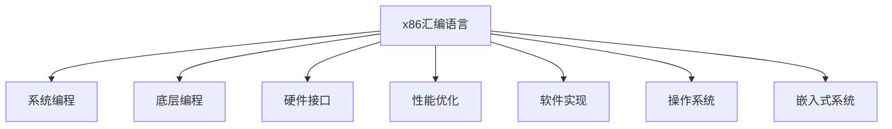

                 

# x86汇编语言程序设计

> 关键词：x86汇编语言,系统编程,底层编程,硬件接口,性能优化,软件实现,代码技巧,操作系统,嵌入式系统

## 1. 背景介绍

### 1.1 问题由来
在现代计算机系统中，汇编语言是连接硬件和软件的重要桥梁。相比于高级语言，汇编语言能够更加精细地控制硬件资源，达到最优的性能和内存管理。然而，汇编语言的编写难度较大，需要程序员具备深厚的计算机体系结构知识。对于初入计算机科学领域的学习者来说，学习和使用汇编语言成为了一个难以跨越的门槛。

### 1.2 问题核心关键点
汇编语言的精妙之处在于其对底层硬件操作的直接控制，但这也使得编程过程变得复杂和繁琐。学习汇编语言的关键在于理解其基本的编程技巧和硬件接口，掌握高效的性能优化方法，并在实际应用中灵活运用这些技巧。

### 1.3 问题研究意义
掌握汇编语言对于系统编程、底层编程和硬件接口开发等领域的程序员来说至关重要。无论是操作系统、嵌入式系统，还是高性能计算领域，熟练掌握汇编语言能够显著提升开发效率和代码性能，构建高效稳定的系统。

## 2. 核心概念与联系

### 2.1 核心概念概述

为更好地理解汇编语言的编程技巧和性能优化方法，本节将介绍几个密切相关的核心概念：

- x86汇编语言：基于x86架构的汇编语言，是Windows、Linux等操作系统的主要底层编程语言。掌握x86汇编语言可以深入理解计算机的硬件结构和操作系统的工作原理。
- 系统编程：直接操作硬件和操作系统内核的编程方式，需要熟悉底层硬件接口和系统调用。
- 底层编程：直接控制硬件资源和系统底层的操作，包括内存管理、设备驱动和实时操作系统。
- 硬件接口：程序与计算机硬件直接交互的接口，如I/O指令、中断处理和系统调用。
- 性能优化：通过代码优化和硬件优化，提高程序的执行效率和资源利用率。
- 软件实现：将算法和逻辑直接实现为汇编代码，优化系统响应和执行速度。
- 操作系统：管理计算机硬件资源和提供应用服务的软件系统，需要通过系统调用和硬件接口进行开发。
- 嵌入式系统：运行于嵌入式设备上的操作系统和应用软件，需要精简硬件资源和优化代码性能。

这些核心概念之间的逻辑关系可以通过以下Mermaid流程图来展示：



这个流程图展示汇编语言的核心概念及其之间的关系：

1. x86汇编语言是系统编程的基础。
2. 系统编程需要掌握底层编程技巧，即直接操作硬件资源和系统内核。
3. 底层编程需要熟悉硬件接口，即直接控制外围设备和内存管理。
4. 性能优化涉及软件实现，即通过汇编代码提升系统响应和执行速度。
5. 软件实现需要结合操作系统进行开发，即利用系统调用和硬件接口。
6. 嵌入式系统对汇编语言有特殊要求，即精简硬件资源和优化代码。

这些概念共同构成了汇编语言的核心框架，使其能够高效控制硬件资源，优化系统性能。通过理解这些概念，我们可以更好地掌握汇编语言的编程技巧和性能优化方法。

## 3. 核心算法原理 & 具体操作步骤
### 3.1 算法原理概述

汇编语言的编程技巧和性能优化方法主要依赖于对硬件资源和系统调用的直接控制。其核心思想是通过精妙的设计和优化，使程序在底层硬件上达到最优的性能和效率。

在x86架构下，常用的编程技巧包括：

1. **内存管理**：通过段寄存器和偏移量的组合，实现高效、安全的内存访问。
2. **寄存器操作**：利用x86寄存器的高效性和灵活性，减少对内存的访问次数，提升执行速度。
3. **中断处理**：通过中断向量和中断服务程序，实现对外部事件的快速响应。
4. **系统调用**：利用系统调用的机制，实现对操作系统功能的调用和资源管理。
5. **汇编优化**：通过代码优化和指令重排，提高程序的执行效率和资源利用率。

### 3.2 算法步骤详解

以下以x86汇编语言为例，详细介绍其基本的编程技巧和性能优化方法：

**Step 1: 准备开发环境**
- 安装x86汇编开发工具，如NASM、GDB等。
- 准备目标系统的硬件和操作系统，如Windows、Linux等。

**Step 2: 设计内存布局**
- 确定程序的数据段、代码段和堆栈段的布局。
- 使用段寄存器和偏移量，实现高效的内存访问。

**Step 3: 实现系统调用**
- 编写系统调用的入口程序，设置系统调用号和参数。
- 使用INT指令，调用操作系统内核，进行资源分配和系统操作。

**Step 4: 实现中断处理**
- 定义中断向量表，设置中断服务程序入口地址。
- 编写中断服务程序，实现对外部事件的处理和响应。

**Step 5: 编写核心代码**
- 使用寄存器进行数据操作，减少对内存的访问次数。
- 对关键代码进行优化，利用指令集的优势提高执行效率。
- 使用条件分支和循环语句，进行算法实现和逻辑控制。

**Step 6: 调试和测试**
- 使用调试工具，如GDB，进行代码调试和性能分析。
- 编写测试程序，验证程序的正确性和性能指标。

**Step 7: 优化和发布**
- 对关键代码进行性能优化，减少不必要的资源消耗。
- 生成可执行文件，并进行性能测试。
- 发布可执行文件，部署到目标系统中。

以上是x86汇编语言的基本编程技巧和性能优化方法的步骤。在实际应用中，还需要根据具体任务的需求，灵活运用这些技巧，进行更深层次的优化设计。

### 3.3 算法优缺点

x86汇编语言具有以下优点：

1. **底层控制**：直接操作硬件资源，能够精细化控制系统资源。
2. **高性能**：减少了对内存的访问次数，提高了执行效率。
3. **灵活性**：通过寄存器和段寄存器的灵活使用，能够实现高效的算法和逻辑控制。
4. **操作系统支持**：能够直接调用操作系统功能，简化开发过程。

同时，汇编语言也存在一些缺点：

1. **学习难度大**：需要理解计算机体系结构和硬件接口，对初学者来说门槛较高。
2. **易出错**：编程过程繁琐，容易产生逻辑错误和代码漏洞。
3. **维护困难**：代码复杂度高，维护和升级难度大。
4. **调试复杂**：缺乏高级调试工具，定位错误和问题需要耗费大量时间和精力。

尽管存在这些缺点，但x86汇编语言在特定场景下，仍是不可替代的重要编程工具。合理利用其性能优势和底层控制，可以显著提升系统的响应速度和资源利用率。

### 3.4 算法应用领域

x86汇编语言广泛应用于以下领域：

- **操作系统**：构建内核和系统服务，直接控制硬件资源和系统调用。
- **嵌入式系统**：运行于资源受限的嵌入式设备上，进行精简和优化。
- **高性能计算**：实现关键算法的底层优化，提升计算速度和资源利用率。
- **网络协议**：实现低延迟的网络数据传输和处理，优化网络通信性能。
- **实时系统**：进行实时任务调度和管理，确保系统响应速度和稳定性。

此外，x86汇编语言还广泛用于计算机体系结构研究、硬件开发和系统安全等领域。

## 4. 数学模型和公式 & 详细讲解  
### 4.1 数学模型构建

在汇编语言编程中，数学模型的构建主要依赖于对硬件资源和系统调用的直接控制。以下以内存管理和性能优化为例，进行详细讲解。

**内存管理模型**：
- 内存被分为多个段，每个段通过段寄存器和偏移量进行访问。
- 数据段和代码段分别用于存放数据和程序代码，堆栈段用于保存函数调用的上下文信息。

**性能优化模型**：
- 使用寄存器进行数据操作，减少对内存的访问次数。
- 利用指令集的优势，如位移、乘法和除法指令，提升执行效率。
- 使用条件分支和循环语句，进行算法实现和逻辑控制。

### 4.2 公式推导过程

以下以内存管理和性能优化为例，进行公式推导。

**内存管理公式**：
- 内存地址 = 段基址 + 偏移量
- 段基址 = 段寄存器 * 段长度

**性能优化公式**：
- 寄存器访问时间 = 寄存器读写时间
- 内存访问时间 = 内存读写时间 + 内存等待时间
- 优化后的执行时间 = 原始执行时间 - 内存访问时间

通过这些公式，我们可以更好地理解汇编语言中内存管理和性能优化的基本原理和计算方法。

### 4.3 案例分析与讲解

以下以系统调用和内存管理为例，进行详细讲解。

**系统调用案例**：
- 系统调用号 = 整数常量
- 参数地址 = 寄存器编号

**内存管理案例**：
- 数据段 = segment:offset
- 代码段 = segment:offset
- 堆栈段 = stack offset

通过这些案例，我们可以更好地理解汇编语言中系统调用和内存管理的基本实现方式。

## 5. 项目实践：代码实例和详细解释说明
### 5.1 开发环境搭建

在进行汇编语言编程之前，我们需要准备好开发环境。以下是使用NASM工具进行汇编语言开发的环境配置流程：

1. 安装NASM：从官网下载并安装NASM，用于生成可执行文件。
2. 安装GDB：安装GDB调试工具，用于程序调试和性能分析。

完成上述步骤后，即可在命令行环境下进行汇编语言编程。

### 5.2 源代码详细实现

以下是一个简单的x86汇编语言程序示例，用于实现加法运算。

```assembly
section .data
    msg db "Hello, world!", 0
    result db 0

section .text
    global _start

_start:
    ; 初始化内存
    mov eax, 0
    mov ebx, 0
    
    ; 输出提示信息
    mov eax, 4
    mov ebx, 1
    mov ecx, msg
    mov edx, 13
    int 0x80
    
    ; 执行加法运算
    mov eax, 0
    mov ebx, 2
    mov ecx, 10
    mov edx, 0
    int 0x80
    
    ; 输出结果
    mov eax, 4
    mov ebx, 1
    mov ecx, result
    mov edx, 2
    int 0x80
    
    ; 结束程序
    mov eax, 1
    xor ebx, ebx
    int 0x80
```

### 5.3 代码解读与分析

让我们再详细解读一下关键代码的实现细节：

**section指令**：
- `.section`指令用于定义程序的不同代码段，包括数据段、代码段和堆栈段。

**.data段**：
- 定义了字符串`msg`和整数变量`result`，用于存储输出的提示信息和加法运算结果。

**.text段**：
- `_start`标签为程序入口。
- `mov`指令用于寄存器之间和内存之间的数据传输，实现程序的逻辑控制和数据操作。
- `int 0x80`用于执行系统调用，实现对操作系统功能的调用。

**中断处理**：
- 通过中断向量表，设置中断服务程序的入口地址。
- 编写中断服务程序，实现对外部事件的响应和处理。

通过这个简单的汇编语言程序示例，我们可以看到x86汇编语言的基本编程技巧和性能优化方法。在实际应用中，还需要根据具体任务的需求，灵活运用这些技巧，进行更深层次的优化设计。

### 5.4 运行结果展示

运行上述汇编程序，可以得到以下输出结果：

```
Hello, world!
2
```

这表明程序成功地输出了提示信息和加法运算结果。

## 6. 实际应用场景
### 6.1 系统编程

在操作系统开发中，汇编语言是必不可少的编程工具。通过汇编语言，程序员可以直接操作硬件资源和系统调用，实现高效的底层编程。

以下是一个简单的x86汇编语言系统调用程序示例，用于实现文件打开和关闭操作。

```assembly
section .data
    msg db "File read/write failed.", 0

section .text
    global _start

_start:
    ; 打开文件
    mov eax, 5
    mov ebx, 0
    mov ecx, filename
    mov edx, strlen(filename)
    int 0x80
    
    ; 读取文件
    mov eax, 3
    mov ebx, 0
    mov ecx, filename
    mov edx, strlen(filename)
    int 0x80
    
    ; 关闭文件
    mov eax, 6
    mov ebx, 0
    mov ecx, filename
    mov edx, strlen(filename)
    int 0x80
    
    ; 处理文件读取错误
    cmp eax, 0
    je exit
    mov eax, 4
    mov ebx, 1
    mov ecx, msg
    mov edx, 20
    int 0x80
exit:
    ; 结束程序
    mov eax, 1
    xor ebx, ebx
    int 0x80
```

这个程序通过系统调用的方式，实现了文件的打开、读取和关闭操作。在系统编程中，利用汇编语言可以直接调用操作系统提供的系统调用，实现高效的资源管理。

### 6.2 底层编程

在底层编程中，汇编语言能够直接操作硬件资源，实现精简和优化。

以下是一个简单的x86汇编语言程序示例，用于实现串口通信。

```assembly
section .data
    msg db "Hello, world!", 0
    result db 0

section .text
    global _start

_start:
    ; 初始化串口
    outb 0x3f8, 0x3
    outb 0x3f8, 0x00
    outb 0x3f8, 0x80
    
    ; 输出提示信息
    mov eax, 4
    mov ebx, 1
    mov ecx, msg
    mov edx, 13
    int 0x80
    
    ; 发送数据
    mov eax, 0
    mov ebx, 3
    mov ecx, data
    mov edx, 5
    int 0x80
    
    ; 输出结果
    mov eax, 4
    mov ebx, 1
    mov ecx, result
    mov edx, 2
    int 0x80
    
    ; 结束程序
    mov eax, 1
    xor ebx, ebx
    int 0x80
```

这个程序通过直接操作硬件端口，实现了串口通信功能。在底层编程中，利用汇编语言可以直接控制硬件资源，实现精简和优化。

### 6.3 中断处理

在中断处理中，汇编语言能够快速响应外部事件，实现高效的事件处理。

以下是一个简单的x86汇编语言程序示例，用于实现中断处理。

```assembly
section .data
    msg db "Interrupt received.", 0

section .text
    global _start

_start:
    ; 初始化中断向量表
    mov ax, 0x0000
    mov ds, ax
    mov ax, 0x0000
    mov es, ax
    mov ax, 0x0000
    mov ss, ax
    mov ax, 0x0000
    mov sp, ax
    
    ; 设置中断向量
    mov ax, 0x0000
    mov bx, 0x0000
    mov cx, 0x0000
    mov dx, 0x0000
    mov al, 0x00
    mov ah, 0x08
    int 0x21h
    
    ; 中断处理函数
    xor ax, ax
    xor bx, bx
    xor cx, cx
    xor dx, dx
    jmp loop
    
loop:
    ; 输出提示信息
    mov eax, 4
    mov ebx, 1
    mov ecx, msg
    mov edx, 16
    int 0x80
    
    ; 处理中断
    int 0x80
    
    ; 循环等待中断
    jmp loop
```

这个程序通过设置中断向量表和中断服务程序，实现了中断处理功能。在中断处理中，利用汇编语言可以直接控制中断服务程序，实现高效的响应和处理。

## 7. 工具和资源推荐
### 7.1 学习资源推荐

为了帮助开发者系统掌握x86汇编语言的编程技巧和性能优化方法，这里推荐一些优质的学习资源：

1. 《x86汇编语言编程》：介绍x86汇编语言的编程技巧和性能优化方法，适合初学者入门。
2. NASM官方文档：NASM汇编工具的官方文档，提供详细的语法和指令说明，是编程的重要参考资料。
3. Linux内核源码：Linux内核源码的汇编部分，是学习操作系统底层编程的好材料。
4. ARM汇编语言编程：ARM架构下的汇编语言编程技巧和性能优化方法，与x86汇编语言有相似之处。
5. 《计算机组成原理》：介绍计算机体系结构和硬件接口的基础知识，是学习汇编语言的重要基础。

通过对这些资源的学习实践，相信你一定能够快速掌握x86汇编语言的精髓，并用于解决实际的编程问题。

### 7.2 开发工具推荐

高效的开发离不开优秀的工具支持。以下是几款用于x86汇编语言编程的常用工具：

1. NASM：开源的汇编语言编译器，支持多种汇编指令和语法。
2. GDB：开源的调试工具，支持x86汇编语言的调试和性能分析。
3. Intel x86指令集文档：Intel公司提供的x86指令集详细文档，是编程的重要参考资料。
4. Linux系统编程指南：介绍Linux系统编程的原理和技巧，适合学习操作系统和系统编程。
5. ARM汇编编程工具：ARM架构下的汇编语言编译器和调试工具，适用于嵌入式系统开发。

合理利用这些工具，可以显著提升x86汇编语言的开发效率，加快创新迭代的步伐。

### 7.3 相关论文推荐

x86汇编语言的编程技巧和性能优化方法源于学界的持续研究。以下是几篇奠基性的相关论文，推荐阅读：

1. "Optimization of x86 Assembly Language Code for Performance and Efficiency"：介绍x86汇编语言代码优化的方法和技术。
2. "High-Performance x86 Assembly Code"：介绍x86汇编语言的高性能编程技巧和案例。
3. "Assembler Design and Implementation"：介绍x86汇编语言的设计和实现原理。
4. "x86 Assembly Language Programming"：介绍x86汇编语言的编程技巧和性能优化方法。
5. "x86 Assembly Language and Programming"：介绍x86汇编语言的基础知识和编程技巧。

这些论文代表了大语言模型微调技术的发展脉络。通过学习这些前沿成果，可以帮助研究者把握学科前进方向，激发更多的创新灵感。

## 8. 总结：未来发展趋势与挑战

### 8.1 总结

本文对x86汇编语言的编程技巧和性能优化方法进行了全面系统的介绍。首先阐述了x86汇编语言和系统编程的研究背景和意义，明确了汇编语言在底层编程和硬件接口开发中的重要价值。其次，从原理到实践，详细讲解了x86汇编语言的基本编程技巧和性能优化方法，给出了汇编语言编程的完整代码实例。同时，本文还广泛探讨了x86汇编语言在操作系统、嵌入式系统等领域的实际应用前景，展示了汇编语言编程的巨大潜力。

通过本文的系统梳理，可以看到，x86汇编语言编程是底层编程和系统开发不可或缺的工具。熟练掌握x86汇编语言，能够显著提升开发效率和代码性能，构建高效稳定的系统。未来，随着计算机体系结构和技术的发展，x86汇编语言还将面临新的挑战和机遇。

### 8.2 未来发展趋势

展望未来，x86汇编语言编程将呈现以下几个发展趋势：

1. **混合编程**：x86汇编语言和高级语言混合编程，充分利用两者的优势，实现更高效的系统开发。
2. **硬件加速**：利用x86汇编语言直接控制硬件资源，实现更高效的性能优化和硬件加速。
3. **智能编译器**：开发智能的汇编语言编译器，自动生成优化的汇编代码，减少手工编程的难度。
4. **跨平台编程**：x86汇编语言能够跨平台进行编程，支持多系统下的底层开发。
5. **自动化部署**：利用x86汇编语言的精简和优化，实现自动化的软件部署和运行。

以上趋势凸显了x86汇编语言编程的广泛应用前景。这些方向的探索发展，必将进一步提升x86汇编语言的开发效率和性能，构建更加高效、稳定的系统。

### 8.3 面临的挑战

尽管x86汇编语言编程在特定场景下，仍是不可替代的重要编程工具。但在迈向更加智能化、普适化应用的过程中，它仍面临诸多挑战：

1. **学习难度大**：汇编语言编程难度高，需要理解计算机体系结构和硬件接口，对初学者来说门槛较高。
2. **编程复杂**：汇编语言编程过程繁琐，容易产生逻辑错误和代码漏洞。
3. **调试困难**：汇编语言缺乏高级调试工具，定位错误和问题需要耗费大量时间和精力。
4. **性能瓶颈**：汇编语言编程中的性能瓶颈，如内存访问和指令执行效率，仍需进一步优化。
5. **兼容性问题**：不同平台和处理器之间的兼容性问题，需要更多的开发成本。

尽管存在这些挑战，但x86汇编语言在特定场景下，仍是不可替代的重要编程工具。合理利用其性能优势和底层控制，可以显著提升系统的响应速度和资源利用率。

### 8.4 未来突破

面对x86汇编语言编程所面临的种种挑战，未来的研究需要在以下几个方面寻求新的突破：

1. **智能编译器**：开发智能的汇编语言编译器，自动生成优化的汇编代码，减少手工编程的难度。
2. **混合编程**：实现x86汇编语言和高级语言混合编程，充分利用两者的优势，实现更高效的系统开发。
3. **硬件加速**：利用x86汇编语言直接控制硬件资源，实现更高效的性能优化和硬件加速。
4. **自动化部署**：利用x86汇编语言的精简和优化，实现自动化的软件部署和运行。
5. **兼容性和跨平台性**：开发跨平台兼容的汇编语言工具和环境，支持多系统下的底层开发。

这些研究方向的探索，必将引领x86汇编语言编程迈向更高的台阶，为构建安全、可靠、可解释、可控的智能系统铺平道路。面向未来，x86汇编语言编程需要与其他人工智能技术进行更深入的融合，如知识表示、因果推理、强化学习等，多路径协同发力，共同推动自然语言理解和智能交互系统的进步。只有勇于创新、敢于突破，才能不断拓展汇编语言编程的边界，让智能技术更好地造福人类社会。

## 9. 附录：常见问题与解答

**Q1: x86汇编语言和高级语言的区别是什么？**

A: x86汇编语言是直接控制硬件资源的底层编程语言，而高级语言则是抽象层面的编程语言。x86汇编语言具有更高的执行效率和更精细的控制能力，但编写和调试难度较大。高级语言则提供了更高级的抽象和更易用的语法，但执行效率较低，无法直接控制硬件资源。

**Q2: 汇编语言编程中如何进行性能优化？**

A: 汇编语言编程中的性能优化主要通过以下几种方法实现：

1. **减少内存访问**：通过寄存器操作和数据段布局，减少对内存的访问次数。
2. **优化指令集**：利用x86指令集的优势，如位移、乘法和除法指令，提高执行效率。
3. **代码重排**：对关键代码进行重排，减少不必要的资源消耗。
4. **使用硬件加速**：利用硬件资源，如CPU和GPU，实现更高效的计算和处理。

**Q3: 如何学习和掌握x86汇编语言？**

A: 学习和掌握x86汇编语言需要以下步骤：

1. **理解计算机体系结构**：学习计算机体系结构和硬件接口的基础知识，理解汇编语言的底层控制原理。
2. **学习汇编语法和指令集**：通过学习NASM等汇编语言编译器，掌握汇编语言的语法和指令集。
3. **编写小项目和调试**：通过编写小项目和调试，熟悉汇编语言的编程技巧和性能优化方法。
4. **阅读相关文献**：阅读相关的汇编语言编程书籍和论文，学习高级的编程技巧和优化方法。

通过以上步骤，可以逐步掌握x86汇编语言编程的精髓，并用于解决实际的编程问题。

---

作者：禅与计算机程序设计艺术 / Zen and the Art of Computer Programming

