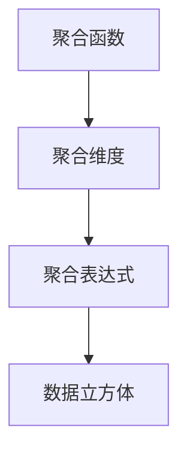

                 

# 【AI大数据计算原理与代码实例讲解】聚合分析

> 关键词：大数据,聚合分析,计算原理,代码实例,数据科学

## 1. 背景介绍

### 1.1 问题由来
在大数据时代，数据已经成为企业重要的资产之一。如何从海量的数据中提取出有价值的信息，帮助企业做出更准确的决策，成为数据科学家的首要任务。在这个过程中，聚合分析（Aggregation Analysis）作为一种重要的数据处理方法，发挥了至关重要的作用。聚合分析可以帮助我们快速计算和展示大量数据的关键统计特性，从而更好地理解数据的分布、趋势和规律。

### 1.2 问题核心关键点
聚合分析的核心在于如何高效地计算和展示数据的聚合结果。具体而言，主要有以下几个关键点：
- 选择合适的聚合函数：如求和、平均值、中位数、标准差等。
- 设计合理的聚合维度：如按时间、地域、用户等维度进行分组聚合。
- 优化计算过程：如利用并行计算、缓存技术、分布式计算等提升效率。
- 可视化展示：如使用图表、仪表盘等直观展示聚合结果。

聚合分析的应用范围非常广泛，几乎覆盖了所有需要处理和分析数据的情景，包括但不限于：
- 业务决策：通过聚合分析结果，帮助企业领导和决策者做出更为明智的决策。
- 产品优化：通过聚合分析用户行为数据，识别出用户的偏好和需求，指导产品开发和改进。
- 风险控制：通过聚合分析金融数据，及时发现异常交易行为，预防金融风险。
- 营销策略：通过聚合分析市场数据，了解市场趋势和消费者行为，优化营销策略。

### 1.3 问题研究意义
聚合分析在数据科学中的应用具有重要意义：
- 提升数据价值：通过聚合分析，将庞杂的数据转化为更有价值的信息，为决策提供支持。
- 提高数据处理效率：利用聚合分析，可以快速处理和计算大量数据，节省时间成本。
- 支持业务智能：聚合分析是支持业务智能（BI）的重要技术之一，能帮助企业实现数字化转型。
- 促进数据驱动决策：聚合分析通过统计分析数据，为业务决策提供科学依据，助力企业智能化发展。

## 2. 核心概念与联系

### 2.1 核心概念概述

为更好地理解聚合分析，本节将介绍几个密切相关的核心概念：

- 聚合函数（Aggregation Function）：用于对数据进行统计计算的函数，如求和（SUM）、平均值（AVG）、最大值（MAX）、最小值（MIN）、标准差（STD）等。
- 聚合维度（Aggregation Dimension）：用于分组聚合数据的维度，如时间、地域、用户等。
- 聚合表达式（Aggregation Expression）：由聚合函数和聚合维度组成的表达式，如SUM(收入)/SUM(销量)。
- 数据立方体（Data Cube）：多维数据的组织形式，通过多个维度的组合形成。常见的数据立方体结构包括事实维度（Business Fact）和维度维度（Dimension）。

这些核心概念之间的逻辑关系可以通过以下Mermaid流程图来展示：



这个流程图展示了一个典型的聚合分析流程：先通过聚合函数对数据进行统计计算，然后根据聚合维度进行分组聚合，最后形成数据立方体。

## 3. 核心算法原理 & 具体操作步骤
### 3.1 算法原理概述

聚合分析的原理相对简单，但实现起来可能较为复杂。其核心思想是通过对数据的聚合处理，得到有意义的统计特征。在具体实现时，通常会涉及以下几个步骤：

1. 数据收集：从不同数据源收集数据，如数据库、日志文件、API接口等。
2. 数据清洗：对数据进行清洗、去重、异常值处理等操作，确保数据的质量和一致性。
3. 数据分组：根据指定的聚合维度对数据进行分组。
4. 聚合计算：对每个分组应用合适的聚合函数进行计算。
5. 结果展示：将计算结果以图表、报告等形式展示出来。

### 3.2 算法步骤详解

聚合分析的具体实现步骤如下：

**Step 1: 数据准备**
- 收集数据源。
- 清洗数据，去除重复和异常值。
- 选择合适的数据格式，如CSV、JSON等。

**Step 2: 定义聚合维度**
- 根据业务需求选择合适的聚合维度，如时间、地域、用户等。
- 对数据进行分组，如按时间划分月度、季度等。

**Step 3: 选择聚合函数**
- 根据业务需求选择合适的聚合函数，如求和（SUM）、平均值（AVG）、最大值（MAX）、最小值（MIN）、标准差（STD）等。

**Step 4: 进行聚合计算**
- 对每个分组应用指定的聚合函数进行计算，得到聚合结果。
- 可以使用数据库查询、Python等工具进行计算。

**Step 5: 结果展示**
- 使用图表、仪表盘等可视化工具展示聚合结果。
- 可以借助BI工具，如Tableau、Power BI等，实现更高级的展示。

### 3.3 算法优缺点

聚合分析作为一种数据处理方法，具有以下优点：
1. 高效计算：聚合分析通过分组聚合，可以将数据处理的计算量大大减少。
2. 统计分析：聚合分析通过计算统计特征，帮助人们更好地理解数据的规律和趋势。
3. 灵活性高：聚合分析可以灵活地选择聚合函数和维度，适应不同的业务需求。

但聚合分析也存在一些缺点：
1. 数据粒度问题：聚合分析可能丢失部分数据的细节，需要权衡聚合精度和处理速度。
2. 预处理要求高：数据清洗和分组聚合需要较高的预处理要求，可能会增加数据处理的复杂性。
3. 结果解释性不足：聚合分析的计算过程较为简单，但结果的解释性相对较弱，难以解释复杂的业务问题。

### 3.4 算法应用领域

聚合分析在多个领域都有广泛的应用，以下是几个典型的例子：

**金融行业**
- 风险控制：通过聚合分析金融数据，及时发现异常交易行为，预防金融风险。
- 业绩分析：通过聚合分析市场数据，了解企业业绩和市场表现，指导投资决策。

**电商行业**
- 用户行为分析：通过聚合分析用户行为数据，识别用户偏好和需求，优化个性化推荐。
- 销售数据分析：通过聚合分析销售数据，了解不同商品和渠道的销售情况，优化供应链和库存管理。

**互联网行业**
- 用户增长分析：通过聚合分析用户数据，了解用户增长趋势和用户特征，指导用户增长策略。
- 流量分析：通过聚合分析网站流量数据，了解用户访问行为，优化网站设计和用户体验。

**政府行业**
- 公共服务绩效评估：通过聚合分析公共服务数据，评估政府服务绩效，指导服务优化。
- 社会经济分析：通过聚合分析社会经济数据，了解社会经济发展趋势，指导政策制定。

## 4. 数学模型和公式 & 详细讲解 & 举例说明

### 4.1 数学模型构建

聚合分析的数学模型主要涉及以下几个方面：

1. 定义聚合函数：如SUM、AVG、MAX、MIN、STD等。
2. 定义数据分组：如按时间、地域、用户等维度分组。
3. 定义数据立方体：多维数据的组织形式，通过多个维度的组合形成。

以计算月度销售额的聚合分析为例，其数学模型可以表示为：

$$
\text{Monthly Sales} = \text{SUM(Sales)} / \text{COUNT(Users)}
$$

其中，Sales表示销售额，Users表示用户数。

### 4.2 公式推导过程

聚合分析的公式推导过程主要涉及以下几个步骤：

1. 定义聚合函数和分组维度。
2. 计算每个分组的聚合结果。
3. 合并每个分组的聚合结果，得到最终的聚合分析结果。

以计算季度收入的聚合分析为例，其公式推导过程如下：

假设原始数据为：

| 时间       | 用户 | 收入 |
|-----------|-----|-----|
| 2021-04-01| 1   | 1000|
| 2021-04-01| 2   | 2000|
| 2021-04-02| 3   | 1500|
| 2021-04-02| 4   | 3000|
| 2021-04-03| 1   | 2000|

首先，将数据按照季度进行分组，得到：

| 季度    | 用户 | 收入 |
|--------|-----|-----|
| Q1     | 1   | 1000|
| Q1     | 2   | 2000|
| Q2     | 3   | 1500|
| Q2     | 4   | 3000|
| Q3     | 1   | 2000|

然后，对每个季度应用求和函数，得到季度收入的聚合结果：

| 季度    | 收入 |
|--------|-----|
| Q1     | 3000|
| Q2     | 4500|
| Q3     | 2000|

最后，将季度收入的聚合结果按照时间顺序排列，得到最终的聚合分析结果：

| 季度    | 收入 |
|--------|-----|
| Q1     | 3000|
| Q2     | 4500|
| Q3     | 2000|

### 4.3 案例分析与讲解

以某电商平台的销售额分析为例，讲解如何通过聚合分析进行业务决策：

**案例背景**
某电商平台希望了解不同用户群体在每个月的销售额分布情况，以便优化产品推荐和市场营销策略。

**数据准备**
- 收集用户购买记录，包括时间、用户ID、商品ID、价格等字段。
- 清洗数据，去除重复和异常值。
- 将数据按照时间和用户ID进行分组，得到每个用户每个月的购买记录。

**聚合分析过程**
1. 计算每个用户每个月的销售额，即每个用户ID的SUM(Sales)。
2. 按照用户ID和时间维度进行分组，得到每个用户每个月的销售额。
3. 计算每个用户每个月的平均销售额，即每个用户ID的AVG(Sales)。
4. 按照时间维度进行分组，得到每个月的平均销售额。
5. 按照用户ID和时间维度进行分组，得到每个用户每个月的平均销售额。

**结果展示**
- 通过可视化工具，将每个用户每个月的平均销售额展示为柱状图。
- 通过可视化工具，将每个月的平均销售额展示为折线图。

**决策指导**
- 通过柱状图，可以直观地了解每个用户在不同月度的销售额分布情况，从而进行个性化推荐。
- 通过折线图，可以了解整体销售额的趋势，指导市场营销策略的调整。

## 5. 项目实践：代码实例和详细解释说明
### 5.1 开发环境搭建

在进行聚合分析项目实践前，我们需要准备好开发环境。以下是使用Python进行聚合分析的开发环境配置流程：

1. 安装Python：从官网下载并安装Python，可以选择3.7及以上版本。
2. 安装Pandas：使用pip安装Pandas库，Pandas是Python中进行数据处理和分析的常用库。
3. 安装Matplotlib：使用pip安装Matplotlib库，Matplotlib是Python中进行数据可视化的常用库。
4. 安装Seaborn：使用pip安装Seaborn库，Seaborn是基于Matplotlib的高级可视化库，适合进行统计图形绘制。
5. 安装Jupyter Notebook：使用pip安装Jupyter Notebook库，Jupyter Notebook是Python中进行交互式数据科学编程的常用工具。

完成上述步骤后，即可在Python环境下进行聚合分析项目实践。

### 5.2 源代码详细实现

下面以计算月度销售额为例，给出使用Pandas库进行聚合分析的Python代码实现。

```python
import pandas as pd
import matplotlib.pyplot as plt
import seaborn as sns

# 读取数据
data = pd.read_csv('sales_data.csv')

# 清洗数据
data = data.drop_duplicates() # 去除重复数据
data = data.dropna() # 去除缺失值

# 计算每个用户每个月的销售额
grouped = data.groupby(['user_id', 'month'])['销售额'].sum()

# 按照用户ID和时间维度进行分组
grouped = grouped.groupby('user_id').mean()

# 按照时间维度进行分组
grouped = grouped.groupby('month').mean()

# 可视化结果
sns.lineplot(x='month', y='销售额', data=grouped)
plt.show()
```

### 5.3 代码解读与分析

让我们再详细解读一下关键代码的实现细节：

**数据读取**
```python
data = pd.read_csv('sales_data.csv')
```
使用Pandas的`read_csv`函数读取CSV格式的数据文件，将数据加载到Pandas DataFrame对象中。

**数据清洗**
```python
data = data.drop_duplicates() # 去除重复数据
data = data.dropna() # 去除缺失值
```
使用Pandas的`drop_duplicates`函数和`dropna`函数，对数据进行去重和缺失值处理。

**聚合计算**
```python
grouped = data.groupby(['user_id', 'month'])['销售额'].sum()
grouped = grouped.groupby('user_id').mean()
grouped = grouped.groupby('month').mean()
```
使用Pandas的`groupby`函数，对数据按照用户ID和时间维度进行分组聚合计算。先按照用户ID和时间维度进行分组，计算每个用户每个月的销售额。再按照用户ID进行分组，计算每个用户每个月的平均销售额。最后按照时间维度进行分组，计算每个月的平均销售额。

**结果展示**
```python
sns.lineplot(x='month', y='销售额', data=grouped)
plt.show()
```
使用Seaborn的`lineplot`函数，绘制每个月的平均销售额的折线图。使用Matplotlib的`show`函数，显示图形。

## 6. 实际应用场景
### 6.1 电商销售分析

电商平台的销售数据通常非常庞大，通过聚合分析可以提取出有用的信息，帮助企业优化销售策略。以某电商平台的销售数据分析为例：

- **用户购买行为分析**
通过聚合分析用户购买数据，可以了解用户的购买偏好、购买频率、购买金额等信息。例如，按照用户ID和时间维度进行分组，计算每个用户每个月的平均销售额，然后可视化展示结果，发现哪些用户贡献了主要的销售额，从而进行针对性的推荐和营销。

- **商品销售情况分析**
通过聚合分析商品销售数据，可以了解不同商品在每个月的销售情况。例如，按照商品ID和时间维度进行分组，计算每个商品每个月的销售额，然后可视化展示结果，发现哪些商品销售表现较好，从而进行库存管理和推荐。

### 6.2 银行风险控制

银行在处理金融数据时，需要实时监控交易情况，及时发现异常交易行为。通过聚合分析金融数据，可以提取出有用的统计特征，帮助银行进行风险控制。例如，按照用户ID和交易时间进行分组，计算每个用户每个交易时间的平均交易金额，然后可视化展示结果，发现哪些用户的交易行为异常，从而进行预警和干预。

### 6.3 政府绩效评估

政府在处理公共服务数据时，需要评估公共服务的绩效，指导服务优化。通过聚合分析公共服务数据，可以提取出有用的统计特征，帮助政府进行绩效评估。例如，按照服务类型和地域进行分组，计算每个服务类型每个地域的平均服务时间，然后可视化展示结果，发现哪些地域的服务质量较差，从而进行服务优化。

### 6.4 未来应用展望

随着大数据和人工智能技术的不断发展，聚合分析的应用领域将不断扩展。未来，聚合分析将在以下几个方面得到广泛应用：

- **实时数据处理**：通过实时聚合分析，可以及时处理和展示海量数据，帮助企业做出快速决策。
- **多模态数据融合**：将聚合分析应用到多模态数据（如文本、图像、视频等）的融合中，提升数据处理和分析的精度和效率。
- **联邦学习**：通过聚合分析联邦学习中的聚合结果，可以实现跨机构的数据共享和协同优化。
- **自动化数据分析**：借助自动化数据分析工具，将聚合分析自动化，提高数据处理的效率和准确性。

## 7. 工具和资源推荐
### 7.1 学习资源推荐

为了帮助开发者系统掌握聚合分析的理论基础和实践技巧，这里推荐一些优质的学习资源：

1. 《Python数据分析与可视化》书籍：通过实例介绍Pandas、Matplotlib和Seaborn等库的使用，适合初学者和进阶开发者。
2. 《数据科学实战》书籍：介绍了数据分析的基本概念和工具，适合非专业人士学习。
3. Coursera《Data Analysis with Python》课程：由Johns Hopkins大学开设的课程，系统介绍数据分析和可视化的基本方法和工具。
4 Kaggle竞赛平台：提供大量数据集和代码实现，适合进行实战练习和数据分析技能提升。

通过对这些资源的学习实践，相信你一定能够快速掌握聚合分析的精髓，并用于解决实际的业务问题。

### 7.2 开发工具推荐

高效的开发离不开优秀的工具支持。以下是几款用于聚合分析开发的常用工具：

1. Python：作为数据分析和可视化的主要语言，Python的Pandas、NumPy等库功能强大，易于学习和使用。
2. R语言：适用于统计分析和可视化，具有强大的数据处理能力。
3. Excel：适用于简单的数据处理和分析，易于上手。
4. Tableau：适用于高级的数据可视化和分析，适合进行复杂的数据分析和展示。

合理利用这些工具，可以显著提升聚合分析任务的开发效率，加快创新迭代的步伐。

### 7.3 相关论文推荐

聚合分析在大数据和人工智能领域的研究也在不断推进。以下是几篇奠基性的相关论文，推荐阅读：

1. Aggregation of Uncertain Data in Knowledge Discovery：介绍不确定数据聚合的基本原理和应用，为聚合分析提供理论基础。
2. Aggregation of Information in Databases：探讨信息聚合的基本方法和应用，适合数据库和信息工程领域的研究者。
3. Aggregation of Time-Series Data：介绍时间序列数据的聚合方法和应用，适合金融和商业领域的研究者。

这些论文代表了大数据和人工智能领域的研究进展，通过学习这些前沿成果，可以帮助研究者把握学科前进方向，激发更多的创新灵感。

## 8. 总结：未来发展趋势与挑战
### 8.1 总结

本文对聚合分析的理论基础和实践技巧进行了全面系统的介绍。首先阐述了聚合分析在数据科学中的重要意义，明确了聚合分析在数据处理和分析中的独特价值。其次，从原理到实践，详细讲解了聚合分析的数学原理和关键步骤，给出了聚合分析任务开发的完整代码实例。同时，本文还探讨了聚合分析在电商、金融、政府等多个领域的应用前景，展示了聚合分析技术的广泛应用潜力。此外，本文精选了聚合分析技术的各类学习资源，力求为读者提供全方位的技术指引。

通过本文的系统梳理，可以看到，聚合分析在数据科学中的应用具有重要意义：
- 提升数据价值：通过聚合分析，将庞杂的数据转化为更有价值的信息，为决策提供支持。
- 提高数据处理效率：利用聚合分析，可以快速处理和计算大量数据，节省时间成本。
- 支持业务智能：聚合分析是支持业务智能（BI）的重要技术之一，能帮助企业实现数字化转型。
- 促进数据驱动决策：聚合分析通过统计分析数据，为业务决策提供科学依据，助力企业智能化发展。

### 8.2 未来发展趋势

展望未来，聚合分析技术将呈现以下几个发展趋势：

1. 数据粒度精细化：随着数据处理技术的不断发展，聚合分析可以进一步精细化数据粒度，提升数据的准确性和精度。
2. 数据实时化：利用流处理和实时计算技术，聚合分析可以实时处理和展示数据，支持实时决策。
3. 多模态融合：将聚合分析应用到多模态数据的融合中，提升数据处理的全面性和准确性。
4. 自动化分析：借助自动化数据分析工具，将聚合分析自动化，提高数据处理的效率和准确性。
5. 联邦学习：通过聚合分析联邦学习中的聚合结果，可以实现跨机构的数据共享和协同优化。

### 8.3 面临的挑战

尽管聚合分析在数据科学中的应用具有重要意义，但在迈向更加智能化、普适化应用的过程中，它仍面临诸多挑战：

1. 数据质量和处理难度：聚合分析需要高质量的数据和复杂的处理过程，数据质量和处理难度较高。
2. 数据维度过多：聚合分析需要处理多维数据，维度过多可能会导致计算复杂性增加。
3. 结果解释性不足：聚合分析的计算过程较为简单，但结果的解释性相对较弱，难以解释复杂的业务问题。
4. 技术复杂度：聚合分析涉及多个技术领域，如数据清洗、统计计算、可视化等，技术复杂度较高。

### 8.4 研究展望

面对聚合分析面临的挑战，未来的研究需要在以下几个方面寻求新的突破：

1. 数据清洗自动化：探索自动化数据清洗技术，降低数据处理的复杂性，提高数据处理效率。
2. 多模态数据融合：研究多模态数据的融合技术，提升数据处理的全面性和准确性。
3. 结果解释性增强：探索增强结果解释性的方法，提升聚合分析的业务应用价值。
4. 分布式计算优化：研究分布式计算技术，提升聚合分析的计算效率和处理能力。
5. 联邦学习融合：研究联邦学习技术，实现跨机构的数据共享和协同优化。

这些研究方向的探索，必将引领聚合分析技术迈向更高的台阶，为数据科学和业务智能化发展提供更强大的支持。

## 9. 附录：常见问题与解答

**Q1：聚合分析是否适用于所有数据类型？**

A: 聚合分析适用于大多数数据类型，如数值型数据、分类数据、时间序列数据等。但对于一些特殊的数据类型，如文本和图像，可能需要先进行预处理才能进行聚合分析。

**Q2：聚合分析如何处理缺失值？**

A: 聚合分析通常会将缺失值视为0，并进行正常的聚合计算。但需要注意的是，如果缺失值较多，可能会影响聚合结果的准确性。因此，在处理缺失值时，需要根据具体情况选择合适的处理方法，如插值、删除等。

**Q3：聚合分析在实际应用中需要注意哪些问题？**

A: 聚合分析在实际应用中需要注意以下问题：
1. 数据质量：确保数据的质量和一致性，避免因数据错误导致分析结果失真。
2. 数据粒度：选择合适的数据粒度，避免因粒度过细导致计算复杂性增加。
3. 结果解释性：确保分析结果具有较好的解释性，便于业务理解和决策。
4. 数据维度：避免维度过多导致计算复杂性增加，合理选择维度。

这些问题是聚合分析在实际应用中需要重点关注的。只有从数据、技术、业务等多个维度进行全面优化，才能真正发挥聚合分析的价值。

**Q4：如何提高聚合分析的效率？**

A: 提高聚合分析的效率可以从以下几个方面入手：
1. 数据清洗：优化数据清洗流程，去除重复和异常值，提升数据质量。
2. 数据结构：选择合适的数据结构，如DataFrame、Series等，提升数据处理效率。
3. 并行计算：利用并行计算技术，提升聚合计算的效率。
4. 分布式计算：利用分布式计算技术，提升数据处理的并行性和效率。

这些方法可以显著提高聚合分析的效率，加速数据处理和分析的进程。

**Q5：聚合分析在金融领域有哪些应用？**

A: 聚合分析在金融领域有许多应用，如：
1. 风险控制：通过聚合分析金融数据，及时发现异常交易行为，预防金融风险。
2. 业绩分析：通过聚合分析市场数据，了解企业业绩和市场表现，指导投资决策。
3. 信用评估：通过聚合分析用户数据，评估用户的信用等级，指导贷款审批。
4. 客户分析：通过聚合分析用户行为数据，了解客户的消费偏好，指导产品推荐和营销。

这些应用场景展示了聚合分析在金融领域的重要价值。

---

作者：禅与计算机程序设计艺术 / Zen and the Art of Computer Programming

