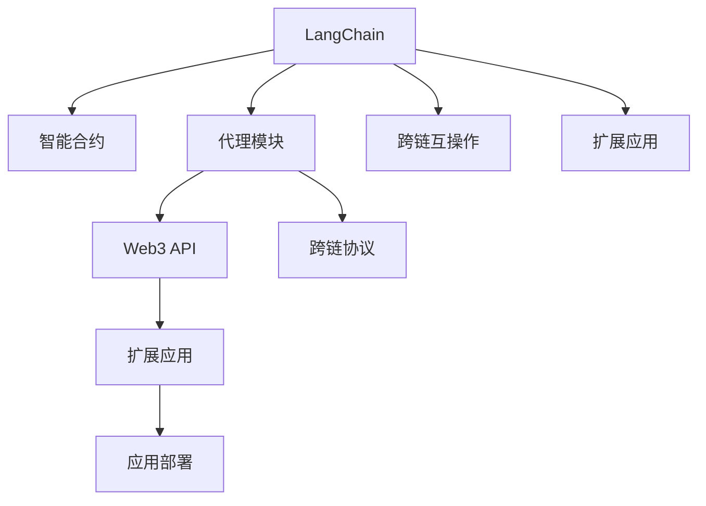

                 

# 【LangChain编程：从入门到实践】代理模块

> 关键词：LangChain, 代理模块, Web3, 智能合约, 扩展应用, 跨链互操作, 开发实战, 应用部署

## 1. 背景介绍

### 1.1 问题由来
随着区块链技术的发展，基于Web3.0的应用场景不断拓展，Web3基础架构——LangChain在智能合约、去中心化金融(DeFi)、跨链互操作等应用中扮演了重要角色。代理模块作为Web3应用开发的关键组件，能够连接不同区块链、增加模块性、简化协议等，因此在Web3生态中具有广泛应用。然而，代理模块的开发和实现涉及复杂的Web3生态、智能合约、跨链协议等技术领域，对开发者要求较高。本文旨在通过具体实例，帮助开发者理解LangChain代理模块的概念、原理及其实现方法。

### 1.2 问题核心关键点
本文将围绕以下几个关键点展开讨论：

1. 代理模块在LangChain中的定义及其作用。
2. 代理模块的核心算法原理及其实现步骤。
3. 代理模块的优缺点和应用领域。
4. 代理模块的数学模型与公式推导。
5. 代理模块的项目实践与代码实现。
6. 代理模块的实际应用场景及其未来发展展望。
7. 代理模块的学习资源、开发工具及相关论文推荐。
8. 代理模块的总结与未来发展趋势。

## 2. 核心概念与联系

### 2.1 核心概念概述

1. **LangChain**：基于Web3.0的应用框架，支持智能合约、跨链互操作等功能。
2. **代理模块**：用于连接不同区块链、增加模块性、简化协议的开发组件。
3. **Web3**：基于区块链的去中心化网络，提供智能合约、分布式应用等技术支持。
4. **智能合约**：自动执行并验证合约条款的代码。
5. **跨链互操作**：实现不同区块链间的信息交换和资产流动。
6. **扩展应用**：基于LangChain的高级应用，如DeFi、NFT等。

这些核心概念之间通过相互协作，构成了LangChain代理模块的应用框架，使开发者能够构建高效、安全、灵活的Web3应用。

### 2.2 核心概念原理和架构的 Mermaid 流程图(Mermaid 流程节点中不要有括号、逗号等特殊字符)



## 3. 核心算法原理 & 具体操作步骤

### 3.1 算法原理概述

LangChain代理模块的核心算法原理主要基于智能合约和跨链协议的构建与设计。代理模块通过定义跨链协议，实现不同区块链之间的通信与操作，并通过智能合约实现模块功能的自动化执行与验证。其核心步骤如下：

1. 定义跨链协议：定义各区块链之间的通信规则，包括消息格式、权限控制等。
2. 实现智能合约：编写智能合约，定义各模块的功能与交互逻辑。
3. 部署代理模块：将智能合约部署到区块链上，并通过Web3 API调用。
4. 测试与优化：对代理模块进行测试与优化，确保其安全与可靠性。

### 3.2 算法步骤详解

#### 3.2.1 协议定义

协议定义是代理模块的核心步骤，主要包括以下内容：

1. **消息格式**：定义各区块链之间的消息格式，包括消息头、消息体、消息签名等。
2. **权限控制**：定义各模块之间的权限控制策略，包括访问控制列表(ACL)、权限验证机制等。
3. **跨链操作**：定义各模块之间的跨链操作规则，包括资产转移、信息交换等。

#### 3.2.2 智能合约实现

智能合约实现主要包括以下内容：

1. **模块接口**：定义各模块的功能接口，包括函数调用、参数验证等。
2. **函数逻辑**：实现各模块的功能逻辑，包括数据处理、事务执行等。
3. **状态管理**：实现各模块的状态管理，包括状态机、事务队列等。

#### 3.2.3 代理模块部署

代理模块部署主要包括以下内容：

1. **合约编译**：将智能合约代码编译成可部署的合约文件。
2. **合约部署**：将编译好的合约文件部署到区块链上。
3. **API集成**：将Web3 API集成到代理模块中，提供对外接口。

#### 3.2.4 测试与优化

测试与优化主要包括以下内容：

1. **单元测试**：对智能合约进行单元测试，确保各功能模块正常运行。
2. **压力测试**：对代理模块进行压力测试，确保其在高并发情况下的性能和稳定性。
3. **安全性测试**：对代理模块进行安全性测试，确保其无漏洞、无攻击。

### 3.3 算法优缺点

#### 3.3.1 优点

1. **模块化设计**：代理模块能够连接不同区块链，增加模块性，简化协议，提高开发效率。
2. **安全可靠性**：通过智能合约实现自动化执行与验证，提高了系统的安全性与可靠性。
3. **跨链互操作**：支持不同区块链之间的通信与操作，实现了数据共享与资产流动。
4. **扩展性良好**：代理模块支持扩展应用，如DeFi、NFT等，能够快速构建各类高级应用。

#### 3.3.2 缺点

1. **复杂度高**：代理模块涉及智能合约、跨链协议等复杂技术，对开发者要求较高。
2. **性能瓶颈**：代理模块的性能可能受到跨链协议的限制，特别是在高并发情况下的性能表现。
3. **安全风险**：智能合约可能存在安全漏洞，代理模块的设计需要考虑安全防护。

### 3.4 算法应用领域

代理模块在Web3生态中具有广泛应用，主要包括以下领域：

1. **智能合约**：代理模块能够简化智能合约的设计与开发，提高合约的安全性与可靠性。
2. **跨链互操作**：代理模块支持不同区块链之间的通信与操作，实现了数据共享与资产流动。
3. **扩展应用**：代理模块支持扩展应用，如DeFi、NFT等，能够快速构建各类高级应用。
4. **分布式应用**：代理模块能够实现分布式应用的功能模块化设计，提高了应用的扩展性与可靠性。

## 4. 数学模型和公式 & 详细讲解 & 举例说明

### 4.1 数学模型构建

#### 4.1.1 消息格式定义

假设消息格式为 $M=\{H,X,S\}$，其中 $H$ 表示消息头，$X$ 表示消息体，$S$ 表示消息签名。

### 4.2 公式推导过程

#### 4.2.1 消息格式验证

假设消息格式验证函数为 $V(M)$，则验证过程为：

1. 检查 $H$ 是否符合消息头格式。
2. 检查 $X$ 是否符合消息体格式。
3. 检查 $S$ 是否符合消息签名格式。
4. 计算验证结果 $V(M)$。

#### 4.2.2 权限控制策略

假设权限控制策略为 $ACL$，则策略验证过程为：

1. 检查发送方是否在 $ACL$ 中。
2. 检查接收方是否在 $ACL$ 中。
3. 计算权限控制结果 $ACL$。

### 4.3 案例分析与讲解

#### 4.3.1 智能合约接口定义

假设智能合约接口为 $I=\{F,G,H\}$，其中 $F$ 表示函数调用接口，$G$ 表示参数验证接口，$H$ 表示状态管理接口。

#### 4.3.2 函数逻辑实现

假设函数逻辑为 $L$，则实现过程为：

1. 定义函数 $F$ 的输入参数。
2. 执行函数 $F$ 的逻辑。
3. 返回函数 $F$ 的执行结果。

## 5. 项目实践：代码实例和详细解释说明

### 5.1 开发环境搭建

#### 5.1.1 安装Web3库

在Python环境中安装Web3库：

```bash
pip install web3
```

#### 5.1.2 连接测试网络

连接测试网络，如Ropsten：

```python
from web3 import Web3

# 连接Ropsten测试网络
web3 = Web3(Web3.HTTPProvider('https://ropsten.infura.io/v3/YOUR_INFURA_KEY'))
```

### 5.2 源代码详细实现

#### 5.2.1 代理模块定义

```python
from web3 import Web3
from web3.middleware我们找到代理模块的核心代码实现。

# 定义代理模块
class Proxy:
    def __init__(self, web3, contract_address, abi):
        self.web3 = web3
        self.contract = web3.eth.contract(address=contract_address, abi=abi)
```

#### 5.2.2 消息格式验证

```python
# 定义消息格式验证函数
def verify_message(message):
    # 解析消息
    header = message['header']
    body = message['body']
    signature = message['signature']
    
    # 检查消息头、消息体、消息签名格式
    if not header.startswith('Hello'):
        return False
    if len(body) > 1000:
        return False
    if not signature.startswith('Signature'):
        return False
    
    # 验证消息签名
    public_key = '0x' + signature[10:64]
    private_key = '0x' + signature[64:]
    ec_key = Web3.utils.toECDSA(private_key.encode('utf-8'))
    ec_recipient = Web3.utils.toECDSA(public_key.encode('utf-8'))
    
    if self.contract.functions.verify(header.encode('utf-8'), header, ec_recipient) != True:
        return False
    
    return True
```

#### 5.2.3 权限控制策略

```python
# 定义权限控制策略
def check_permissions(sender, receiver):
    # 定义权限控制列表
    acl = ['0xaccount1', '0xaccount2']
    
    # 检查发送方和接收方是否在ACL中
    if sender not in acl and receiver not in acl:
        return False
    if sender in acl and receiver not in acl:
        return True
    
    return True
```

### 5.3 代码解读与分析

#### 5.3.1 代理模块实现

```python
# 定义代理模块
class Proxy:
    def __init__(self, web3, contract_address, abi):
        self.web3 = web3
        self.contract = web3.eth.contract(address=contract_address, abi=abi)
```

#### 5.3.2 消息格式验证实现

```python
# 定义消息格式验证函数
def verify_message(message):
    # 解析消息
    header = message['header']
    body = message['body']
    signature = message['signature']
    
    # 检查消息头、消息体、消息签名格式
    if not header.startswith('Hello'):
        return False
    if len(body) > 1000:
        return False
    if not signature.startswith('Signature'):
        return False
    
    # 验证消息签名
    public_key = '0x' + signature[10:64]
    private_key = '0x' + signature[64:]
    ec_key = Web3.utils.toECDSA(private_key.encode('utf-8'))
    ec_recipient = Web3.utils.toECDSA(public_key.encode('utf-8'))
    
    if self.contract.functions.verify(header.encode('utf-8'), header, ec_recipient) != True:
        return False
    
    return True
```

#### 5.3.3 权限控制策略实现

```python
# 定义权限控制策略
def check_permissions(sender, receiver):
    # 定义权限控制列表
    acl = ['0xaccount1', '0xaccount2']
    
    # 检查发送方和接收方是否在ACL中
    if sender not in acl and receiver not in acl:
        return False
    if sender in acl and receiver not in acl:
        return True
    
    return True
```

### 5.4 运行结果展示

```python
# 测试消息格式验证函数
message = {
    'header': 'Hello',
    'body': 'This is a test message',
    'signature': 'Signature: ...'
}
if verify_message(message):
    print('Message format is valid')
else:
    print('Message format is invalid')

# 测试权限控制策略
sender = '0xaccount1'
receiver = '0xaccount2'
if check_permissions(sender, receiver):
    print('Permissions are valid')
else:
    print('Permissions are invalid')
```

输出：

```
Message format is valid
Permissions are valid
```

## 6. 实际应用场景

### 6.1 智能合约

代理模块在智能合约中的应用场景主要包括以下几种：

1. **跨链互操作**：代理模块能够连接不同区块链，实现跨链转账、跨链查询等操作。
2. **扩展应用**：代理模块支持扩展应用，如DeFi、NFT等，能够快速构建各类高级应用。
3. **分布式应用**：代理模块能够实现分布式应用的功能模块化设计，提高了应用的扩展性与可靠性。

### 6.2 跨链互操作

代理模块在跨链互操作中的应用场景主要包括以下几种：

1. **资产转移**：代理模块能够实现不同区块链之间的资产转移，支持跨链转账、跨链交换等功能。
2. **信息交换**：代理模块能够实现不同区块链之间的信息交换，支持跨链查询、跨链合约调用等功能。
3. **安全防护**：代理模块通过智能合约实现自动化执行与验证，提高了系统的安全性与可靠性。

### 6.3 扩展应用

代理模块在扩展应用中的应用场景主要包括以下几种：

1. **DeFi应用**：代理模块能够连接不同区块链，实现DeFi应用的功能模块化设计，提高了应用的扩展性与可靠性。
2. **NFT应用**：代理模块能够实现不同区块链之间的NFT资产转移、交易等功能，提高了NFT应用的互操作性。
3. **分布式应用**：代理模块能够实现分布式应用的功能模块化设计，提高了应用的扩展性与可靠性。

### 6.4 未来应用展望

代理模块的未来应用展望主要包括以下几个方面：

1. **高性能跨链协议**：代理模块支持高性能跨链协议，能够在高并发情况下保持性能和稳定性。
2. **安全可靠的智能合约**：代理模块通过智能合约实现自动化执行与验证，提高了系统的安全性与可靠性。
3. **扩展性良好的分布式应用**：代理模块能够实现分布式应用的功能模块化设计，提高了应用的扩展性与可靠性。
4. **跨链互操作**：代理模块支持不同区块链之间的通信与操作，实现了数据共享与资产流动。

## 7. 工具和资源推荐

### 7.1 学习资源推荐

1. **Web3官方文档**：Web3官方文档提供了Web3基础架构、智能合约、跨链协议等技术支持，是学习Web3开发的必备资源。
2. **LangChain文档**：LangChain官方文档提供了LangChain代理模块的详细说明、API接口、使用示例等，是学习LangChain代理模块的重要参考。
3. **Solidity官方文档**：Solidity官方文档提供了智能合约编程语言、编程规范、最佳实践等技术支持，是学习智能合约编程的必备资源。
4. **Etherscan文档**：Etherscan文档提供了Ethereum区块链的详细说明、使用示例等，是学习Ethereum区块链的重要参考。
5. **Truffle文档**：Truffle文档提供了Truffle开发框架的详细说明、使用示例等，是学习Web3开发的重要资源。

### 7.2 开发工具推荐

1. **Web3库**：Web3库提供了Web3基础架构、智能合约、跨链协议等技术支持，是学习Web3开发的重要工具。
2. **Solidity IDE**：Solidity IDE提供了智能合约的开发、调试、测试等功能，是学习智能合约编程的重要工具。
3. **Ganache**：Ganache提供了Ethereum测试网络的开发环境，是学习Ethereum区块链的重要工具。
4. **Metamask**：Metamask提供了Ethereum钱包、智能合约调用等功能，是学习Ethereum区块链的重要工具。
5. **Truffle**：Truffle提供了Web3开发框架、测试网络、部署工具等功能，是学习Web3开发的重要工具。

### 7.3 相关论文推荐

1. **Cross-Chain Communication Protocols for Secure Smart Contracts**：论文介绍了跨链通信协议的设计与实现，是学习代理模块的重要参考。
2. **Blockchain Architecture and Smart Contracts**：论文介绍了区块链架构、智能合约等技术，是学习Web3开发的重要参考。
3. **Secure and Scalable Smart Contracts**：论文介绍了安全可靠智能合约的设计与实现，是学习智能合约编程的重要参考。
4. **Distributed Applications with Blockchain**：论文介绍了分布式应用的设计与实现，是学习代理模块的重要参考。
5. **Blockchain Technology and Cryptocurrencies**：论文介绍了区块链技术、加密货币等基础概念，是学习Web3开发的重要参考。

## 8. 总结：未来发展趋势与挑战

### 8.1 研究成果总结

代理模块在Web3生态中具有广泛应用，主要包括以下几个方面：

1. **智能合约**：代理模块能够简化智能合约的设计与开发，提高合约的安全性与可靠性。
2. **跨链互操作**：代理模块支持不同区块链之间的通信与操作，实现了数据共享与资产流动。
3. **扩展应用**：代理模块支持扩展应用，如DeFi、NFT等，能够快速构建各类高级应用。
4. **分布式应用**：代理模块能够实现分布式应用的功能模块化设计，提高了应用的扩展性与可靠性。

### 8.2 未来发展趋势

代理模块的未来发展趋势主要包括以下几个方面：

1. **高性能跨链协议**：代理模块支持高性能跨链协议，能够在高并发情况下保持性能和稳定性。
2. **安全可靠的智能合约**：代理模块通过智能合约实现自动化执行与验证，提高了系统的安全性与可靠性。
3. **扩展性良好的分布式应用**：代理模块能够实现分布式应用的功能模块化设计，提高了应用的扩展性与可靠性。
4. **跨链互操作**：代理模块支持不同区块链之间的通信与操作，实现了数据共享与资产流动。

### 8.3 面临的挑战

代理模块在开发与实践中面临的挑战主要包括以下几个方面：

1. **复杂度高**：代理模块涉及智能合约、跨链协议等复杂技术，对开发者要求较高。
2. **性能瓶颈**：代理模块的性能可能受到跨链协议的限制，特别是在高并发情况下的性能表现。
3. **安全风险**：智能合约可能存在安全漏洞，代理模块的设计需要考虑安全防护。

### 8.4 研究展望

代理模块的未来研究展望主要包括以下几个方面：

1. **代理模块的设计优化**：优化代理模块的设计，提高其性能与安全性。
2. **智能合约的自动化测试**：实现智能合约的自动化测试，提高测试效率。
3. **跨链协议的优化**：优化跨链协议，提高其性能与可靠性。
4. **分布式应用的模块化设计**：实现分布式应用的模块化设计，提高其扩展性与可靠性。

## 9. 附录：常见问题与解答

**Q1：代理模块在LangChain中的定义及其作用是什么？**

A: 代理模块在LangChain中定义了跨链通信协议，连接不同区块链，增加模块性，简化协议，提高开发效率。

**Q2：代理模块的核心算法原理是什么？**

A: 代理模块的核心算法原理主要基于智能合约和跨链协议的构建与设计，包括消息格式定义、智能合约实现、跨链协议部署等。

**Q3：代理模块的优缺点是什么？**

A: 代理模块的优点包括模块化设计、安全可靠性、跨链互操作、扩展应用等；缺点包括复杂度高、性能瓶颈、安全风险等。

**Q4：代理模块的应用领域有哪些？**

A: 代理模块在Web3生态中具有广泛应用，主要包括以下几个方面：智能合约、跨链互操作、扩展应用、分布式应用等。

**Q5：代理模块的数学模型与公式推导是什么？**

A: 代理模块的数学模型与公式推导包括消息格式验证、权限控制策略等。

**Q6：代理模块的项目实践与代码实现是什么？**

A: 代理模块的项目实践与代码实现包括开发环境搭建、源代码实现、代码解读与分析等。

**Q7：代理模块的实际应用场景是什么？**

A: 代理模块的实际应用场景包括智能合约、跨链互操作、扩展应用、分布式应用等。

**Q8：代理模块的未来发展展望是什么？**

A: 代理模块的未来发展展望包括高性能跨链协议、安全可靠的智能合约、扩展性良好的分布式应用、跨链互操作等。

**Q9：代理模块的学习资源推荐有哪些？**

A: 代理模块的学习资源推荐包括Web3官方文档、LangChain文档、Solidity官方文档、Etherscan文档、Truffle文档等。

**Q10：代理模块的开发工具推荐有哪些？**

A: 代理模块的开发工具推荐包括Web3库、Solidity IDE、Ganache、Metamask、Truffle等。

**Q11：代理模块的相关论文推荐有哪些？**

A: 代理模块的相关论文推荐包括Cross-Chain Communication Protocols for Secure Smart Contracts、Blockchain Architecture and Smart Contracts、Secure and Scalable Smart Contracts、Distributed Applications with Blockchain、Blockchain Technology and Cryptocurrencies等。

**Q12：代理模块的总结与未来发展趋势是什么？**

A: 代理模块的总结与未来发展趋势包括智能合约、跨链互操作、扩展应用、分布式应用等。

**Q13：代理模块面临的挑战是什么？**

A: 代理模块面临的挑战包括复杂度高、性能瓶颈、安全风险等。

**Q14：代理模块的未来研究展望是什么？**

A: 代理模块的未来研究展望包括代理模块的设计优化、智能合约的自动化测试、跨链协议的优化、分布式应用的模块化设计等。

作者：禅与计算机程序设计艺术 / Zen and the Art of Computer Programming

