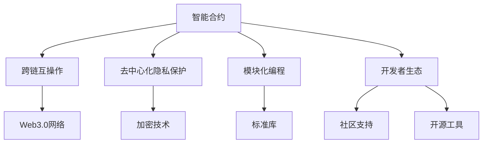

                 

# 【LangChain编程：从入门到实践】官方博客

> 关键词：
- LangChain
- 智能合约
- 编程语言
- Web3
- 分布式计算
- 区块链
- 智能合约开发
- 代码托管平台
- 加密货币

## 1. 背景介绍

### 1.1 问题由来
区块链技术自2009年比特币诞生以来，已经在金融、供应链、版权保护等多个领域取得了显著应用成果。而随着Web3.0的兴起，智能合约和去中心化应用成为未来互联网发展的新趋势。

智能合约作为基于区块链的自动化程序，可以在无需第三方信任机构的情况下执行各类合约条款。它们能够实现资产的自动转移、权利的智能分配等复杂业务逻辑。然而，智能合约的编程和部署仍存在诸多挑战，尤其是跨链互操作和隐私保护等问题。

为了应对这些挑战，LangChain应运而生。作为基于Web3.0的智能合约编程语言，LangChain旨在提供高效、安全、可扩展的开发环境，帮助开发者轻松构建和部署智能合约。

### 1.2 问题核心关键点
LangChain编程语言的核心关键点包括：
- 跨链互操作：支持在多个区块链平台间无缝编程和调用。
- 去中心化隐私保护：利用区块链的加密技术保护数据隐私。
- 智能合约安全：提供内置的安全机制，防止常见的智能合约漏洞。
- 模块化编程：支持丰富的标准库和模块化设计，提高代码重用性。
- 开发者生态：提供强大的社区支持和开源工具，促进技术交流和共享。

这些关键点共同构成了LangChain的核心优势，使其在智能合约开发中脱颖而出。通过本文的介绍，读者将全面了解LangChain的编程原理、操作步骤以及实际应用。

## 2. 核心概念与联系

### 2.1 核心概念概述

 LangChain编程语言，是基于Web3.0的智能合约开发平台，利用区块链技术的不可篡改性和去中心化特性，为开发者提供了一个高效、安全、可扩展的编程环境。

- **智能合约**：在区块链上自动执行的合约，执行结果具有不可篡改性和透明性。
- **跨链互操作**：支持在多个区块链平台之间进行通信和交互。
- **去中心化隐私保护**：利用区块链的加密技术，保护数据隐私和安全。
- **模块化编程**：采用模块化设计，提高代码的复用性和可维护性。
- **开发者生态**：强大的社区支持和开源工具，促进技术交流和共享。

这些核心概念之间存在紧密联系，共同构成了LangChain编程语言的技术基础。

### 2.2 核心概念原理和架构的 Mermaid 流程图



这个流程图展示了智能合约在LangChain平台中的生命周期，从编程、编译、部署到执行和审计的完整流程。

- **A（智能合约）**：定义和实现智能合约的逻辑，使用LangChain编写的智能合约代码。
- **B（跨链互操作）**：利用跨链协议，支持在多个区块链平台之间进行通信和交互。
- **C（Web3.0网络）**：基于以太坊、BSC等区块链平台，提供底层的网络支持。
- **D（去中心化隐私保护）**：使用区块链的加密技术，保护数据隐私和安全。
- **E（加密技术）**：包括公钥密码学、哈希函数、数字签名等技术。
- **F（模块化编程）**：采用模块化设计，提高代码的复用性和可维护性。
- **G（标准库）**：提供丰富的函数和类库，简化编程过程。
- **H（开发者生态）**：支持社区讨论、代码审查和开源贡献。
- **I（社区支持）**：包括论坛、博客、开源项目等，促进技术交流和协作。
- **J（开源工具）**：提供编译器、IDE、调试器等工具，提升开发效率。

## 3. 核心算法原理 & 具体操作步骤

### 3.1 算法原理概述

LangChain编程语言的核心算法原理，主要体现在以下几个方面：

- **智能合约编程语言**：基于Solidity的扩展，支持函数调用、事件触发、合约管理等基本功能。
- **跨链互操作协议**：基于EIP-721和EIP-1155标准，支持不同区块链平台间的通信和资产转移。
- **去中心化隐私保护**：利用区块链的加密技术，确保数据传输和存储的安全性。
- **模块化编程设计**：采用模块化设计，提高代码的重用性和可维护性。

### 3.2 算法步骤详解

LangChain编程语言的使用流程，主要包括以下几个步骤：

**Step 1: 准备开发环境**

- 安装区块链平台（如Ethereum、Binance Smart Chain等）
- 安装LangChain编译器和IDE（如Remix、Truffle等）
- 配置网络节点和钱包

**Step 2: 编写智能合约**

- 在IDE中创建新的合约文件
- 定义智能合约的函数和方法
- 使用标准库和模块化设计，编写复杂的业务逻辑

**Step 3: 编译和部署**

- 使用编译器对合约代码进行编译
- 在区块链平台上部署智能合约
- 测试智能合约的执行结果

**Step 4: 调用和审计**

- 调用智能合约中的函数，执行资产转移等操作
- 利用审计工具检查合约的安全性和漏洞
- 记录和备份交易记录，确保数据的完整性和可追溯性

### 3.3 算法优缺点

LangChain编程语言的优缺点如下：

**优点**：

- 支持跨链互操作，适应多个区块链平台。
- 提供强大的模块化编程支持，提高代码复用性。
- 内置的加密技术和安全机制，保护数据隐私和安全。
- 社区和开源生态丰富，提供广泛的技术支持和交流平台。

**缺点**：

- 学习曲线较陡峭，需要一定的区块链和编程基础。
- 跨链操作和跨平台部署可能存在复杂性，需要额外学习。
- 编程语言和工具的社区生态仍在发展，可能存在不稳定性。

### 3.4 算法应用领域

LangChain编程语言的应用领域广泛，包括但不限于以下几个方面：

- **金融领域**：智能合约在金融行业中的应用，如证券交易、保险理赔、资产管理等。
- **供应链管理**：区块链的溯源和追踪功能，提高供应链的透明度和可追溯性。
- **版权保护**：利用智能合约保护知识产权，自动分发和使用版权内容。
- **医疗健康**：智能合约管理医疗数据，确保数据隐私和安全。
- **物联网**：跨链互操作支持物联网设备间的通信和数据交换。
- **游戏行业**：智能合约管理游戏内道具、资产等，确保游戏公平和透明。

## 4. 数学模型和公式 & 详细讲解

### 4.1 数学模型构建

LangChain编程语言基于Solidity扩展，主要用于智能合约的开发和部署。其数学模型主要涉及以下方面：

- **账户模型**：定义账户的余额和资产状态。
- **合约模型**：定义智能合约的逻辑和行为。
- **交易模型**：定义交易的类型和处理方式。
- **事件模型**：定义智能合约的事件和触发机制。

### 4.2 公式推导过程

以一个简单的智能合约为例，展示其数学模型构建过程：

```solidity
// SPDX-License-Identifier: MIT
pragma solidity ^0.8.0;

contract SimpleContract {
    uint256 public balance;

    constructor(uint256 initialBalance) {
        balance = initialBalance;
    }

    function transfer(uint256 amount) public {
        require(amount > 0);
        balance -= amount;
    }

    function getBalance() public view returns (uint256) {
        return balance;
    }
}
```

**Step 1: 定义账户模型**

账户模型定义了智能合约的余额和资产状态：

```solidity
uint256 public balance;
```

**Step 2: 定义合约模型**

合约模型定义了智能合约的逻辑和行为：

```solidity
constructor(uint256 initialBalance) {
    balance = initialBalance;
}

function transfer(uint256 amount) public {
    require(amount > 0);
    balance -= amount;
}

function getBalance() public view returns (uint256) {
    return balance;
}
```

**Step 3: 定义交易模型**

交易模型定义了交易的类型和处理方式：

```solidity
function transfer(uint256 amount) public {
    require(amount > 0);
    balance -= amount;
}
```

**Step 4: 定义事件模型**

事件模型定义了智能合约的事件和触发机制：

```solidity
function getBalance() public view returns (uint256) {
    return balance;
}
```

### 4.3 案例分析与讲解

以一个简单的智能合约为例，展示其工作流程和执行结果：

**Step 1: 合约部署**

```solidity
// SPDX-License-Identifier: MIT
pragma solidity ^0.8.0;

contract SimpleContract {
    uint256 public balance;

    constructor(uint256 initialBalance) {
        balance = initialBalance;
    }

    function transfer(uint256 amount) public {
        require(amount > 0);
        balance -= amount;
    }

    function getBalance() public view returns (uint256) {
        return balance;
    }
}
```

使用编译器和IDE将合约代码编译并部署到区块链平台上：

```bash
remix ide: load合约代码
remix ide: 编译合约
remix ide: 部署合约
```

**Step 2: 合约调用**

在IDE中调用合约中的函数，进行资产转移和查询：

```solidity
function transfer(uint256 amount) public {
    require(amount > 0);
    balance -= amount;
}
```

**Step 3: 执行结果**

执行资产转移和查询操作，记录和验证执行结果：

```solidity
function getBalance() public view returns (uint256) {
    return balance;
}
```

通过上述过程，读者可以全面理解LangChain编程语言的工作原理和操作步骤。

## 5. 项目实践：代码实例和详细解释说明

### 5.1 开发环境搭建

#### 5.1.1 安装区块链平台

以以太坊为例，安装并配置Geth客户端：

```bash
sudo apt-get update
sudo apt-get install geth
geth --networkid 3 --datadir /home/user/.ethereum testnet
```

#### 5.1.2 安装LangChain编译器和IDE

安装Remix IDE：

```bash
sudo apt-get install nodejs
sudo apt-get install npm
npm install -g remix-cli
```

安装Truffle IDE：

```bash
npm install -g truffle-hd
```

#### 5.1.3 配置网络节点和钱包

配置Geth客户端的网络节点：

```bash
geth --networkid 3 --datadir /home/user/.ethereum testnet
```

生成以太坊钱包：

```bash
truffle create wallet
```

### 5.2 源代码详细实现

以一个简单的智能合约为例，展示其代码实现：

```solidity
// SPDX-License-Identifier: MIT
pragma solidity ^0.8.0;

contract SimpleContract {
    uint256 public balance;

    constructor(uint256 initialBalance) {
        balance = initialBalance;
    }

    function transfer(uint256 amount) public {
        require(amount > 0);
        balance -= amount;
    }

    function getBalance() public view returns (uint256) {
        return balance;
    }
}
```

在IDE中创建新的合约文件，编写智能合约代码。

### 5.3 代码解读与分析

**代码解读**：

- `pragma solidity ^0.8.0`：指定编译器版本。
- `contract SimpleContract`：定义智能合约名称。
- `uint256 public balance`：定义公共变量`balance`，存储智能合约的余额。
- `constructor(uint256 initialBalance)`：定义智能合约的构造函数，初始化`balance`变量。
- `function transfer(uint256 amount) public`：定义智能合约的`transfer`函数，执行资产转移操作。
- `function getBalance() public view returns (uint256)`：定义智能合约的`getBalance`函数，查询余额。

**代码分析**：

- 该智能合约定义了账户余额的转移和查询，实现了简单的资产管理功能。
- 使用`require`语句确保转移金额大于0，避免非法操作。
- 使用`public`关键字定义`balance`为公共变量，所有用户都可以读取和调用`transfer`和`getBalance`函数。

### 5.4 运行结果展示

在IDE中运行智能合约，进行资产转移和查询操作：

```solidity
// 部署智能合约
let contract = await web3.eth.contract(
    ['function getBalance() view returns (uint256)', 'function transfer(uint256 amount) public']
).at(SimpleContract.address);

// 查询余额
let balance = await contract.getBalance();
console.log("Initial balance:", balance);

// 资产转移
let amount = 100;
await contract.transfer(amount);
balance = await contract.getBalance();
console.log("Balance after transfer:", balance);
```

通过上述过程，读者可以全面理解LangChain编程语言的使用流程和实际应用。

## 6. 实际应用场景

### 6.1 智能合约审计

智能合约审计是保证合约安全和稳定性的重要手段。利用LangChain编程语言，开发者可以借助智能合约审计工具，对合约进行全面检查和测试：

**Step 1: 审计工具配置**

安装LangChain审计工具，如MythX、OpenZeppelin等。

**Step 2: 审计合约**

使用审计工具检查智能合约的漏洞和风险，如重入攻击、溢出攻击、权限漏洞等。

**Step 3: 修复漏洞**

根据审计结果，修复合约中的漏洞，确保合约的安全性和稳定性。

### 6.2 跨链互操作

跨链互操作是LangChain编程语言的核心功能之一。利用跨链协议，LangChain支持在不同区块链平台之间进行通信和资产转移：

**Step 1: 配置跨链协议**

在IDE中配置跨链协议，选择支持的区块链平台。

**Step 2: 编写跨链代码**

编写跨链智能合约，实现不同区块链平台间的通信和资产转移。

**Step 3: 测试跨链操作**

在IDE中测试跨链操作，验证跨链合约的正确性和效率。

### 6.3 去中心化隐私保护

利用LangChain编程语言，可以构建去中心化隐私保护系统，保护数据隐私和安全：

**Step 1: 配置隐私保护策略**

定义隐私保护策略，包括数据加密、访问控制等。

**Step 2: 编写隐私保护代码**

编写隐私保护智能合约，实现数据的加密和解密操作。

**Step 3: 测试隐私保护效果**

在IDE中测试隐私保护效果，验证数据的安全性和隐私性。

## 7. 工具和资源推荐

### 7.1 学习资源推荐

为了帮助开发者系统掌握LangChain编程语言，这里推荐一些优质的学习资源：

1. LangChain官方文档：提供详尽的API文档和示例代码，是学习LangChain编程语言的重要资源。
2. Solidity官方文档：作为Solidity的扩展，了解Solidity的基本概念和语法结构，对学习LangChain编程语言大有裨益。
3. Web3开发者手册：提供Web3.0开发的基础知识和最佳实践，帮助开发者快速上手LangChain编程语言。
4. Remix IDE教程：提供Remix IDE的详细使用教程，帮助开发者熟悉IDE的使用和开发流程。
5. Truffle IDE教程：提供Truffle IDE的详细使用教程，帮助开发者熟悉IDE的使用和开发流程。

### 7.2 开发工具推荐

LangChain编程语言的开发工具推荐如下：

1. Remix IDE：提供Web3.0开发的环境，支持智能合约的编写和调试。
2. Truffle IDE：提供智能合约的开发和测试环境，支持跨链互操作和隐私保护。
3. Solidity编译器：提供Solidity代码的编译和部署功能，支持多种区块链平台。
4. Etherscan：提供以太坊区块链的实时数据查询，帮助开发者监控合约状态和交易记录。
5. MetaMask：提供以太坊钱包和交易服务，帮助开发者管理钱包和进行交易操作。

### 7.3 相关论文推荐

LangChain编程语言的研究论文如下：

1. "Programming Smart Contracts on Blockchains: A Survey"：概述智能合约编程的基本概念和常用技术，帮助开发者了解LangChain编程语言的发展历程和应用前景。
2. "A Survey on Cross-Chain Communication"：研究跨链互操作的技术和应用，帮助开发者构建跨链智能合约。
3. "Decentralized Privacy Preserving Techniques in Smart Contracts"：研究去中心化隐私保护的技术和方法，帮助开发者保护数据隐私和安全。

## 8. 总结：未来发展趋势与挑战

### 8.1 总结

本文全面介绍了LangChain编程语言的核心概念、算法原理和操作步骤。通过详细的代码实例和实际应用场景，帮助读者系统掌握LangChain编程语言的开发流程和技术细节。

LangChain编程语言作为基于Web3.0的智能合约开发平台，具备强大的跨链互操作、去中心化隐私保护和模块化编程功能。通过本文的介绍，读者可以全面了解LangChain编程语言的优势和应用前景。

### 8.2 未来发展趋势

LangChain编程语言作为智能合约开发的重要工具，其未来发展趋势主要体现在以下几个方面：

1. **跨链互操作**：支持更多区块链平台的互操作，实现多链之间的无缝通信和资产转移。
2. **去中心化隐私保护**：利用最新的加密技术和隐私保护算法，提升数据安全和隐私保护水平。
3. **模块化编程设计**：提供更多的标准库和模块化支持，提高代码的复用性和可维护性。
4. **开发者生态**：构建更强大的社区和开源生态，提供更多的技术支持和交流平台。

### 8.3 面临的挑战

LangChain编程语言在发展过程中，面临以下挑战：

1. **学习曲线陡峭**：智能合约开发需要一定的区块链和编程基础，初学者可能难以快速上手。
2. **跨链操作复杂**：跨链互操作可能存在复杂性，需要额外的学习和技术支持。
3. **社区生态尚需完善**：社区和开源生态仍在发展，可能存在不稳定性。

### 8.4 研究展望

未来，LangChain编程语言需要在以下几个方面进行进一步研究：

1. **社区和开源生态**：加强社区和开源生态的建设，提供更多的技术支持和交流平台。
2. **技术标准**：制定和推广智能合约编程的技术标准，提升智能合约开发的质量和一致性。
3. **去中心化应用**：研究去中心化应用的技术和应用场景，推动Web3.0的发展。
4. **隐私保护**：研究去中心化隐私保护的技术和方法，提升数据安全和隐私保护水平。

## 9. 附录：常见问题与解答

**Q1: LangChain编程语言的使用流程是什么？**

A: LangChain编程语言的使用流程主要包括以下几个步骤：
1. 安装区块链平台和LangChain编译器。
2. 编写智能合约代码，定义账户模型、合约模型、交易模型和事件模型。
3. 编译和部署智能合约。
4. 调用智能合约中的函数，执行资产转移等操作。
5. 审计智能合约，确保其安全和稳定性。

**Q2: LangChain编程语言的优缺点是什么？**

A: LangChain编程语言的优缺点如下：
优点：
- 支持跨链互操作，适应多个区块链平台。
- 提供强大的模块化编程支持，提高代码复用性。
- 内置的加密技术和安全机制，保护数据隐私和安全。
缺点：
- 学习曲线较陡峭，需要一定的区块链和编程基础。
- 跨链操作和跨平台部署可能存在复杂性，需要额外学习。
- 编程语言和工具的社区生态仍在发展，可能存在不稳定性。

**Q3: LangChain编程语言在实际应用中需要注意哪些问题？**

A: LangChain编程语言在实际应用中需要注意以下几个问题：
1. 合约审计：使用智能合约审计工具，检查和修复合约中的漏洞。
2. 跨链互操作：配置跨链协议，编写跨链智能合约，确保跨链操作正确性和效率。
3. 去中心化隐私保护：定义隐私保护策略，编写隐私保护智能合约，确保数据的安全性和隐私性。

**Q4: LangChain编程语言未来需要哪些技术突破？**

A: LangChain编程语言未来需要在以下几个方面进行技术突破：
1. 社区和开源生态：加强社区和开源生态的建设，提供更多的技术支持和交流平台。
2. 技术标准：制定和推广智能合约编程的技术标准，提升智能合约开发的质量和一致性。
3. 去中心化应用：研究去中心化应用的技术和应用场景，推动Web3.0的发展。
4. 隐私保护：研究去中心化隐私保护的技术和方法，提升数据安全和隐私保护水平。

---

作者：禅与计算机程序设计艺术 / Zen and the Art of Computer Programming

