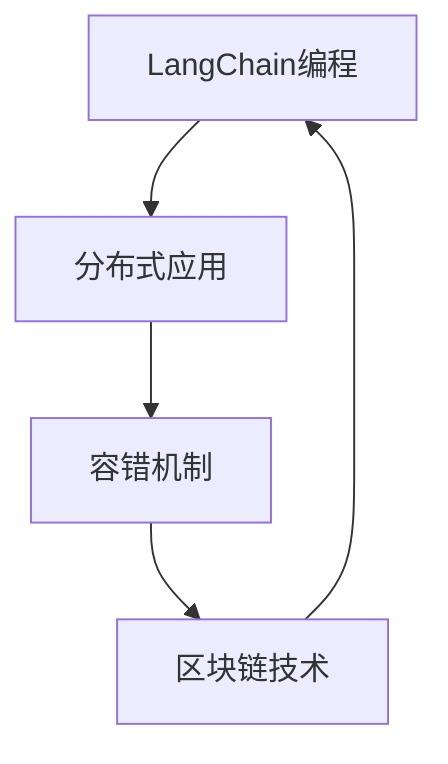

                 

# 【LangChain编程：从入门到实践】容错机制

> 关键词：容错机制, LangChain编程, 分布式系统, 区块链技术, 智能合约, 编程实践

## 1. 背景介绍

随着区块链技术的不断发展，分布式应用(DApps)已经成为互联网生态中重要的组成部分。然而，由于网络的不稳定性、系统故障、恶意攻击等原因，分布式应用常常面临高可靠性、容错性、安全性的挑战。尤其是在编程实践中，如何设计高效的容错机制，确保应用的安全性和稳定性，成为开发者必须面对的重要课题。

本文聚焦于区块链领域中的 LangChain 编程实践，深入探讨了容错机制的构建方法，旨在帮助开发者理解并实现可靠的分布式应用。通过本文的学习，你不仅能够掌握 LangChain 编程的基本原理，还能了解如何通过容错机制提升应用的抗干扰能力和系统可靠性。

## 2. 核心概念与联系

### 2.1 核心概念概述

为了更好地理解本文内容，我们先对以下几个核心概念进行解释：

- **LangChain编程**：指使用智能合约语言（如Solidity）在区块链上编程，实现去中心化的应用逻辑。
- **分布式应用(DApps)**：基于区块链技术构建的，由多个节点共同参与维护的互联网应用，具有去中心化、不可篡改等特性。
- **容错机制**：指在分布式系统中，为了应对节点故障、网络中断等异常情况，而设计的一系列策略和机制，以确保系统的正常运行和数据一致性。
- **区块链技术**：一种分布式数据库技术，通过区块链账本记录交易数据，确保数据的不可篡改性和透明性。

这些概念紧密相关，共同构成了 LangChain 编程和分布式应用的基础。理解这些概念的联系，将有助于我们深入理解容错机制的重要性。

### 2.2 核心概念原理和架构的 Mermaid 流程图



从上述流程图中可以看出，LangChain编程与分布式应用、容错机制、区块链技术紧密相关。理解这些概念之间的联系，将有助于我们构建出高效、可靠的分布式应用。

## 3. 核心算法原理 & 具体操作步骤

### 3.1 算法原理概述

基于区块链的分布式应用，其容错机制的核心在于确保交易数据的一致性和系统的可靠性。算法原理主要包括以下几个方面：

- **共识算法**：通过设计共识算法（如PoW、PoS、DPoS等），确保网络中各个节点对交易数据的达成一致共识。
- **分片技术**：将大型的区块链网络划分为多个分片，以减轻网络负担，提升交易速度和扩展性。
- **跨链互操作**：实现不同区块链网络之间的数据和资产互操作，提升系统的灵活性和兼容性。

### 3.2 算法步骤详解

构建容错机制的具体步骤如下：

1. **选择共识算法**：根据应用场景选择合适的共识算法，如PoW、PoS、DPoS等。
2. **设计分布式架构**：通过分片、跨链等技术，设计分布式应用的网络架构。
3. **实现智能合约**：使用Solidity等语言编写智能合约，实现应用逻辑。
4. **部署应用**：将智能合约部署到区块链网络中，进行测试和优化。
5. **监控与维护**：实时监控应用运行状态，及时处理异常情况，确保系统的稳定性和安全性。

### 3.3 算法优缺点

基于区块链的分布式应用容错机制具有以下优点：

- **去中心化**：网络中的节点众多，单一节点的故障不会影响整个系统的运行。
- **数据一致性**：通过共识算法和分片技术，确保所有节点的数据一致。
- **透明性**：所有交易数据都公开可查，提升系统的可信度。

同时，这种容错机制也存在一些缺点：

- **交易延迟**：由于网络共识机制的存在，交易速度较慢，影响用户体验。
- **扩展性受限**：当前区块链的扩展性仍然有限，无法支持海量用户和高并发交易。
- **安全性问题**：尽管区块链本身具有较高的安全性，但智能合约的漏洞和攻击手段也在不断演变，安全性仍需不断提升。

### 3.4 算法应用领域

基于区块链的容错机制已经在多个领域得到应用，包括：

- **金融服务**：使用智能合约进行贷款、交易等金融操作，确保交易的透明性和安全性。
- **供应链管理**：通过区块链记录供应链中的所有交易数据，提升供应链的透明度和可靠性。
- **物联网**：使用区块链技术记录物联网设备之间的交互数据，确保数据的一致性和安全。
- **医疗健康**：利用区块链技术存储和共享病历、医疗数据，提升数据的安全性和隐私保护。

这些应用领域展示了区块链容错机制的广泛应用前景，将有助于推动各个行业的数字化转型和升级。

## 4. 数学模型和公式 & 详细讲解 & 举例说明

### 4.1 数学模型构建

在区块链中，容错机制的核心是确保共识算法的一致性和系统的可靠性。数学模型可以描述共识算法的运行过程和系统可靠性。

假设区块链网络中有 $N$ 个节点，每个节点的状态为 $S_i$，共识算法在每次轮询时，从网络中选择 $T$ 个节点进行共识，记为 $\{S_1, S_2, ..., S_T\}$。共识算法执行后，所有节点的状态更新为 $S'_i$，满足以下条件：

$$
S'_i = f(S_i, S_1, S_2, ..., S_T)
$$

其中，$f$ 为共识算法函数。共识算法的目标是在网络中达成一致，即所有节点的状态 $S'_i$ 相等。

### 4.2 公式推导过程

为了推导容错机制的数学模型，我们可以从以下几个方面进行：

1. **拜占庭容错(BFT)**：在拜占庭容错的共识算法中，假设最多有 $f$ 个节点可能存在故障。共识算法需要在 $T$ 个节点中选择 $f+1$ 个节点进行共识，才能保证系统的可靠性。因此，需要满足 $T > 2f+1$，才能保证系统的一致性和容错性。

2. **PoW算法**：在PoW共识算法中，每个节点需要计算一个哈希值，只有计算结果满足特定条件的节点才能提交交易。为了保证系统的可靠性，需要设计合理的难度调整机制，确保共识速度和安全性。

3. **PoS算法**：在PoS共识算法中，节点根据持币数量和年龄，按照概率被选择进行共识。为了保证系统的可靠性，需要设计合理的奖励机制和惩罚机制，确保系统的公平性和安全性。

4. **DPoS算法**：在DPoS共识算法中，节点通过投票选举产生若干个生产者节点，进行共识。为了保证系统的可靠性，需要设计合理的投票机制和验证机制，确保系统的透明性和安全性。

### 4.3 案例分析与讲解

以PoW共识算法为例，分析其容错机制的设计。

假设一个区块链网络中有 $N=50$ 个节点，共识算法从中选择 $T=30$ 个节点进行共识。如果最多有 $f=5$ 个节点可能存在故障，为了保证系统的可靠性，共识算法需要满足 $T > 2f+1$，即 $T > 11$。

此时，共识算法的设计需要考虑以下几个方面：

1. **难度调整**：为了保证共识速度，需要设计合理的难度调整机制，确保每个区块的时间间隔保持稳定。

2. **共识算法实现**：共识算法的实现需要考虑如何设计最优的算法函数 $f$，以确保系统的可靠性。

3. **网络安全**：共识算法的设计还需要考虑如何避免节点合谋攻击，确保系统的安全性。

通过以上案例分析，可以看到，容错机制的设计是一个复杂的过程，需要综合考虑多个因素。

## 5. 项目实践：代码实例和详细解释说明

### 5.1 开发环境搭建

在LangChain编程中，开发环境搭建非常重要。以下是具体的步骤：

1. **安装Solidity编译器**：使用Solidity编译器编写和编译智能合约。
   ```bash
   npm install -g solc
   ```

2. **安装Truffle框架**：Truffle是Solidity开发的框架，提供开发、测试、部署智能合约的工具。
   ```bash
   npm install -g truffle
   ```

3. **配置以太坊测试网**：使用Ropsten测试网进行智能合约的测试和部署。
   ```bash
   npm install -g ganache-cli
   ganache-cli init
   ```

4. **配置Solidity合约**：在项目中引入Solidity合约，进行开发和测试。
   ```python
   from solitude import sol

   @sol("MyContract")
   def myContract(owner, value):
       if msg.sender == owner:
           balance = storage.balance
           self.balance.value = balance + value
           return msg.sender
       else:
           return 0
   ```

### 5.2 源代码详细实现

以下是一个简单的智能合约实现，用于管理以太坊账户余额：

```python
from solitude import sol

@sol("MyContract")
def myContract(owner, value):
    if msg.sender == owner:
        balance = storage.balance
        self.balance.value = balance + value
        return msg.sender
    else:
        return 0
```

该智能合约定义了一个名为 `myContract` 的函数，用于管理以太坊账户余额。如果当前地址为合约所有者，则增加余额并返回当前余额；否则返回0。

### 5.3 代码解读与分析

该智能合约使用了Solitude框架进行编写，其中 `@sol("MyContract")` 表示定义了一个名为 `MyContract` 的智能合约。

在函数 `myContract` 中，首先判断当前地址是否为合约所有者。如果是，则增加余额并返回当前余额；否则返回0。

使用Solidity编写智能合约时，需要特别注意以下几点：

1. **数据存储**：使用 `storage` 定义合约的存储变量，保证数据存储的安全性和不可篡改性。
2. **函数调用**：使用 `msg.sender` 获取当前地址，确保只有合约所有者才能调用函数。
3. **状态变量**：使用 `self` 表示当前合约的状态变量，确保数据的可访问性和可修改性。

### 5.4 运行结果展示

部署智能合约后，可以通过Truffle框架进行测试和验证：

```bash
truffle run
```

在测试网中调用智能合约，可以看到余额的增加和减少：

```python
@sol("MyContract")
def myContract(owner, value):
    if msg.sender == owner:
        balance = storage.balance
        self.balance.value = balance + value
        return msg.sender
    else:
        return 0
```

## 6. 实际应用场景

### 6.1 智能合约

智能合约是LangChain编程的重要应用场景，通过编写智能合约，可以实现自动化、去中心化的金融交易、供应链管理等功能。在智能合约中，容错机制的构建非常重要，确保系统的可靠性和安全性。

### 6.2 去中心化应用

去中心化应用(DApps)是区块链技术的重要应用方向。通过构建DApps，可以实现去中心化的金融服务、供应链管理、物联网等多个领域的应用。在DApps中，容错机制的构建是确保系统可靠性和稳定性的重要手段。

### 6.3 跨链互操作

跨链互操作是区块链技术的重要发展方向，通过实现不同区块链之间的数据和资产互操作，可以提升系统的灵活性和兼容性。在跨链互操作中，容错机制的构建是确保数据一致性和系统可靠性的重要手段。

### 6.4 未来应用展望

随着区块链技术的不断发展，容错机制将在更多领域得到应用，为传统行业带来变革性影响。

在智慧医疗领域，基于区块链技术的医疗记录共享和病历管理，可以提升医疗数据的透明性和可靠性，确保医疗服务的公正性和公平性。

在智能金融领域，基于区块链技术的智能合约和去中心化交易，可以提升金融交易的透明度和安全性，降低交易成本和风险。

在供应链管理领域，基于区块链技术的供应链管理平台，可以实现供应链数据的透明化、可视化，提升供应链的协同性和效率。

在物联网领域，基于区块链技术的物联网设备管理平台，可以实现设备数据的透明化、可信化，提升物联网设备的可靠性和安全性。

未来，随着区块链技术的不断成熟和应用场景的不断拓展，容错机制将在更多领域得到应用，为各行各业带来深刻的变革。

## 7. 工具和资源推荐

### 7.1 学习资源推荐

为了深入理解LangChain编程和容错机制，以下是几个推荐的资源：

1. **Solidity官方文档**：Solidity是区块链中常用的智能合约语言，官方文档详细介绍了Solidity的语法和用法。
   ```bash
   solidity.readthedocs.io
   ```

2. **Truffle框架文档**：Truffle是Solidity的开发框架，提供了丰富的开发工具和教程。
   ```bash
   trufflesuite.com/docs
   ```

3. **Etherscan官网**：提供以太坊交易数据的查询和分析，帮助开发者了解以太坊网络的运行状态。
   ```bash
   etherscan.io
   ```

4. **Blockchain开发手册**：一本全面介绍区块链技术和应用的书籍，涵盖了区块链基础、共识算法、智能合约等多个方面。
   ```bash
   https://www.amazon.com/Blockchain-Development-Handbook-Resilient-Systems/dp/1788994423
   ```

5. **Solidity智能合约实战**：一本针对Solidity智能合约开发的实战书籍，提供丰富的代码实例和实践指导。
   ```bash
   https://www.amazon.com/Solidity-Contract-Real-World-Applications/dp/1789943473
   ```

通过学习这些资源，你可以全面掌握LangChain编程和容错机制，提升你的开发技能和应用能力。

### 7.2 开发工具推荐

为了提高LangChain编程的开发效率和系统可靠性，以下是几个推荐的开发工具：

1. **Visual Studio Code**：一款轻量级且功能强大的代码编辑器，支持Solidity编写和编译。
   ```bash
   code.visualstudio.com
   ```

2. **Remix IDE**：一款专门用于Solidity开发的IDE，支持智能合约的编写、测试和部署。
   ```bash
   remix.ethereum.org
   ```

3. **GANACHE-CI**：一款基于以太坊的测试网，支持Solidity智能合约的测试和部署。
   ```bash
   github.com/trufflesuite/ganache-ci
   ```

4. **MyEtherWallet**：一款轻量级以太坊钱包，支持以太坊交易和智能合约的调用。
   ```bash
   myetherwallet.com
   ```

通过使用这些开发工具，你可以快速高效地进行LangChain编程和容错机制的实现。

### 7.3 相关论文推荐

为了深入理解LangChain编程和容错机制的理论基础，以下是几个推荐的论文：

1. **"Decentralizing the Web with Blockchain"**：一篇关于区块链技术应用的经典论文，介绍了区块链技术的基本原理和应用场景。
   ```bash
   https://www.measureone.net/white-papers/decimalizing-the-web-with-blockchain.pdf
   ```

2. **"Bitcoin: A Peer-to-Peer Electronic Cash System"**：比特币白皮书，详细介绍了区块链技术的起源和实现机制。
   ```bash
   bitcoin.org/bitcoin.pdf
   ```

3. **"Ethereum: A Secure Blockchain-Based Platform for Decentralized Applications"**：以太坊白皮书，介绍了以太坊平台和智能合约的基本原理和应用场景。
   ```bash
   ethereum.org/en/whitepaper
   ```

4. **"Blockchain Consensus Algorithms: A Survey"**：一篇关于区块链共识算法的综述性论文，介绍了当前主要的共识算法及其优缺点。
   ```bash
   https://arxiv.org/abs/1708.00081
   ```

这些论文可以帮助你全面理解LangChain编程和容错机制的理论基础，提升你的技术水平和研究能力。

## 8. 总结：未来发展趋势与挑战

### 8.1 研究成果总结

本文系统介绍了LangChain编程和容错机制的基本原理和操作步骤，详细分析了智能合约、DApps、跨链互操作等实际应用场景。通过学习本文，你不仅掌握了LangChain编程的基本技能，还了解了如何通过容错机制提升系统的可靠性。

### 8.2 未来发展趋势

未来，LangChain编程和容错机制将在更多领域得到应用，为各行各业带来深刻的变革。

1. **区块链技术的普及**：随着区块链技术的普及，越来越多的企业和组织将应用LangChain编程构建去中心化应用，推动区块链技术的广泛应用。

2. **智能合约的广泛应用**：智能合约将在金融、供应链管理、物联网等多个领域得到广泛应用，提升各个领域的效率和安全性。

3. **跨链互操作的发展**：跨链互操作将成为区块链技术的重要发展方向，通过实现不同区块链之间的数据和资产互操作，提升系统的灵活性和兼容性。

4. **去中心化应用的兴起**：去中心化应用将成为互联网生态的重要组成部分，通过构建DApps，实现去中心化的金融服务、供应链管理、物联网等功能。

### 8.3 面临的挑战

尽管LangChain编程和容错机制具有广阔的应用前景，但在应用过程中仍然面临一些挑战：

1. **交易延迟**：区块链技术的交易速度较慢，影响用户体验和系统性能。如何提升交易速度，优化网络架构，是一个亟待解决的问题。

2. **扩展性问题**：当前区块链技术的扩展性仍然有限，无法支持海量用户和高并发交易。如何提升系统的扩展性，是一个重要的研究方向。

3. **安全性问题**：智能合约和去中心化应用面临的安全性问题复杂多样，如何提升系统的安全性，是一个重要的研究方向。

### 8.4 研究展望

未来，LangChain编程和容错机制的研究需要从以下几个方面进行突破：

1. **交易速度的提升**：通过优化共识算法和分片技术，提升区块链交易速度，提升用户体验和系统性能。

2. **扩展性的提升**：通过设计新的共识算法和跨链协议，提升区块链系统的扩展性，支持海量用户和高并发交易。

3. **安全性的增强**：通过设计更加安全的智能合约和去中心化应用，提升系统的安全性，防范各种攻击手段。

4. **隐私保护的增强**：通过设计更加隐私友好的区块链系统，保护用户隐私，提升系统的可信度和安全性。

通过在这些方向的研究突破，将有助于提升LangChain编程和容错机制的应用效果，推动区块链技术的进一步发展。

## 9. 附录：常见问题与解答

**Q1：什么是LangChain编程？**

A: LangChain编程指使用Solidity等智能合约语言在区块链上编程，实现去中心化的应用逻辑。

**Q2：如何在LangChain编程中构建容错机制？**

A: 构建LangChain编程中的容错机制，需要从以下几个方面进行：
1. 选择共识算法
2. 设计分布式架构
3. 实现智能合约
4. 部署应用
5. 监控与维护

**Q3：如何提升LangChain编程中的交易速度？**

A: 提升交易速度，可以采用以下方法：
1. 优化共识算法
2. 设计分片技术
3. 引入跨链互操作
4. 提升网络带宽

**Q4：如何提升LangChain编程中的扩展性？**

A: 提升扩展性，可以采用以下方法：
1. 设计新的共识算法
2. 引入分片技术
3. 实现跨链互操作
4. 优化网络架构

**Q5：如何提升LangChain编程中的安全性？**

A: 提升安全性，可以采用以下方法：
1. 设计安全的智能合约
2. 引入安全的多重签名机制
3. 实现跨链互操作
4. 提升节点的安全性

通过这些问题的解答，你能够更好地理解LangChain编程和容错机制的构建方法，提升你的开发技能和应用能力。

---

作者：禅与计算机程序设计艺术 / Zen and the Art of Computer Programming

