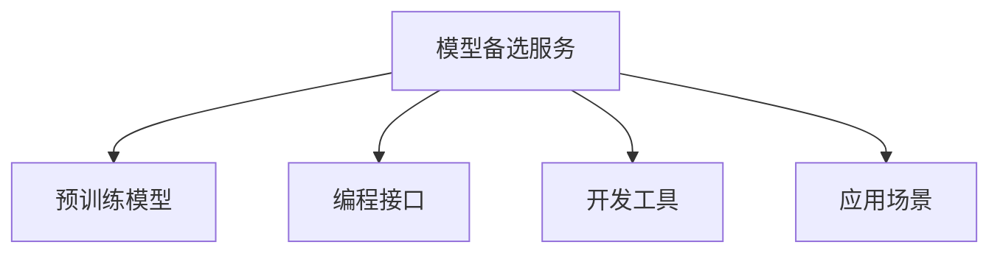

                 

# 【LangChain编程：从入门到实践】模型备选服务

> 关键词：LangChain, 模型备选, 编程入门, 实践技巧, 代码实例, 工具推荐, 未来展望, 研究趋势

## 1. 背景介绍

### 1.1 问题由来
随着人工智能技术的飞速发展，自然语言处理（NLP）和生成式AI模型取得了显著的进展。这些模型通过在大规模无标签文本数据上进行预训练，能够生成高质量的文本，并在各种NLP任务中取得优异表现。然而，对于特定的应用场景，预训练模型可能无法直接使用，需要进一步微调或定制化。因此，模型备选服务（Model-as-a-Service, MaaS）应运而生，旨在为开发者提供不同领域的预训练模型，以及丰富的编程接口和工具支持，助力AI应用的快速开发和部署。

### 1.2 问题核心关键点
模型备选服务的核心在于如何高效地提供多样化的预训练模型，并集成一系列编程接口和工具，使开发者能够灵活地选择和使用这些模型。主要关键点包括：
- 模型的多样性和质量：提供覆盖不同领域的预训练模型，确保模型的多样性和高性能。
- 编程接口的易用性：提供简单易用的API接口，方便开发者进行模型调用和参数配置。
- 工具支持的全面性：集成丰富的开发工具，如Jupyter Notebook、VSCode等，提升开发效率。
- 应用场景的广泛性：覆盖广泛的应用场景，包括问答、翻译、文本生成、情感分析等。
- 部署方式的便捷性：支持多种部署方式，如云服务、本地部署等，便于模型在实际场景中的应用。

## 2. 核心概念与联系

### 2.1 核心概念概述

为了更好地理解模型备选服务，本节将介绍几个核心概念及其相互关系：

- **模型备选服务 (Model-as-a-Service, MaaS)**：指通过云端或本地部署方式，向用户提供预先训练好的模型和相关的编程接口，以支持AI应用的快速开发和部署。
- **预训练模型 (Pre-trained Models)**：指在大规模无标签文本数据上训练得到的通用语言模型，如BERT、GPT等，能够提供高质量的文本表示和生成能力。
- **编程接口 (APIs)**：指用于调用预训练模型的接口，包括RESTful API、Grpc API等，支持模型参数配置、调用和结果获取。
- **开发工具 (Tools)**：指集成于模型备选服务中的开发工具，如Jupyter Notebook、VSCode、TensorBoard等，提升开发效率和模型可视性。
- **应用场景 (Use Cases)**：指模型备选服务支持的多种NLP任务，如问答、翻译、文本生成、情感分析等。

这些概念之间的逻辑关系可以通过以下Mermaid流程图来展示：



该流程图展示了模型备选服务的核心组成部分及其相互关系：

1. 模型备选服务通过预训练模型提供高性能的语言处理能力。
2. 提供多种编程接口，方便开发者调用模型。
3. 集成丰富的开发工具，提升开发效率。
4. 支持多种应用场景，覆盖广泛NLP任务。

## 3. 核心算法原理 & 具体操作步骤

### 3.1 算法原理概述

模型备选服务的核心算法原理涉及预训练模型、编程接口和应用场景的集成。其目标是为开发者提供一个高效、易用的模型开发平台，支持模型调用、参数配置和结果可视化等功能。具体流程如下：

1. **模型选择与加载**：根据应用需求选择相应的预训练模型，并通过API接口加载到本地或云端环境。
2. **参数配置与微调**：根据具体任务需求，对模型参数进行配置或微调，以提升模型在特定任务上的性能。
3. **模型调用与结果处理**：通过API接口调用模型进行文本处理或生成，并处理结果，返回所需输出。
4. **应用集成与部署**：将模型集成到实际应用场景中，并根据需求进行本地部署或云服务部署。

### 3.2 算法步骤详解

以下详细介绍模型备选服务的核心步骤：

**Step 1: 选择合适的模型和应用场景**
开发者首先需根据应用场景选择合适的预训练模型和编程接口。例如，对于问答任务，可以选择使用BERT、GPT等模型，并调用其相应的API接口。

**Step 2: 参数配置与微调**
在应用场景中，开发者需对模型参数进行配置或微调，以适应具体任务。例如，对于翻译任务，可以设置模型输入和输出的语言对，调整模型超参数，如学习率、批大小等。

**Step 3: 模型调用与结果处理**
根据应用需求，开发者调用模型进行文本处理或生成，并处理结果。例如，对于情感分析任务，可以使用API接口将文本输入模型，获取情感得分，并进行可视化展示。

**Step 4: 应用集成与部署**
将模型集成到实际应用场景中，并进行本地部署或云服务部署。例如，对于智能客服系统，可以将微调后的模型集成到聊天机器人中，部署到云服务器上，实现实时对话功能。

### 3.3 算法优缺点

模型备选服务的优点包括：
1. 高效性：提供了高性能的预训练模型和丰富的API接口，显著提高了开发效率。
2. 易用性：支持多种编程语言和开发工具，降低了技术门槛。
3. 多样性：覆盖广泛的应用场景，适用于各种NLP任务。
4. 便捷性：支持多种部署方式，便于模型的实际应用。

缺点包括：
1. 依赖网络：模型调用和结果处理需要依赖网络，可能影响响应速度。
2. 数据隐私：云计算环境下的数据隐私和安全问题需关注。
3. 模型泛化：通用预训练模型的泛化能力有限，特定场景下的微调效果可能不佳。

## 4. 数学模型和公式 & 详细讲解 & 举例说明

### 4.1 数学模型构建

模型备选服务的主要数学模型包括预训练模型、编程接口和应用场景的集成。以下是一个简化的数学模型构建示例：

假设预训练模型为$f(x; \theta)$，其中$\theta$为模型参数，$x$为输入文本。开发者通过API接口调用模型，输入文本$x$，输出结果$y=f(x; \theta)$。

### 4.2 公式推导过程

以翻译任务为例，推导API接口调用模型的数学过程。

设输入文本为$x$，目标语言为$y$，则翻译任务的目标是最大化$f(x; \theta)$与$y$之间的相似度。常用的损失函数包括交叉熵损失、均方误差损失等。假设损失函数为$L(x, y; \theta)$，则模型调用过程如下：

$$
\hat{y} = f(x; \theta)
$$

$$
L(x, y; \theta) = \ell(y, \hat{y})
$$

其中$\ell$为损失函数，如交叉熵损失。开发者通过API接口调用模型，将$x$输入，得到$\hat{y}$，计算损失$L(x, y; \theta)$，并通过反向传播更新模型参数$\theta$。

### 4.3 案例分析与讲解

以智能客服系统为例，分析模型备选服务的实际应用。

1. **模型选择**：选择合适的预训练模型，如GPT-3，用于智能客服系统的对话生成。
2. **参数配置**：配置模型参数，如学习率、批大小、微调轮数等，以适应客服系统对话生成的需求。
3. **模型调用**：通过API接口调用模型，输入客户对话历史，生成回复文本，并返回给客服系统。
4. **结果处理**：对生成的回复文本进行处理，去除噪声，生成最终回复，并集成到客服系统中。

## 5. 项目实践：代码实例和详细解释说明

### 5.1 开发环境搭建

在进行模型备选服务项目开发前，首先需要搭建好开发环境。以下是详细的步骤：

1. **安装Python和相关库**：安装Python 3.x，并使用pip安装必要的库，如TensorFlow、transformers等。
2. **安装TensorFlow Serving**：安装TensorFlow Serving，用于模型的本地部署。
3. **安装Gunicorn**：安装Gunicorn，用于模型API接口的运行。
4. **安装Jupyter Notebook**：安装Jupyter Notebook，用于模型调度和可视化的开发环境。

### 5.2 源代码详细实现

以下是一个简单的代码示例，用于加载和使用BERT模型进行情感分析任务：

```python
from transformers import BertTokenizer, BertForSequenceClassification
import tensorflow as tf
import numpy as np
from flask import Flask, request, jsonify

app = Flask(__name__)

tokenizer = BertTokenizer.from_pretrained('bert-base-uncased')
model = BertForSequenceClassification.from_pretrained('bert-base-uncased', num_labels=2)

@app.route('/predict', methods=['POST'])
def predict():
    data = request.get_json()
    text = data['text']
    input_ids = tokenizer.encode(text, add_special_tokens=True)
    input_ids = np.array([input_ids])[0]
    labels = model.predict(np.array([input_ids]))[0]
    predicted_label = labels.argmax()
    return jsonify({'score': predicted_label})

if __name__ == '__main__':
    app.run(host='0.0.0.0', port=5000)
```

### 5.3 代码解读与分析

上述代码示例展示了如何加载和使用BERT模型进行情感分析任务的实现过程。

1. **模型加载**：使用`transformers`库中的`BertTokenizer`和`BertForSequenceClassification`类加载预训练模型BERT。
2. **API接口设计**：使用Flask框架设计API接口，接收文本输入，调用模型进行情感分析，并返回预测结果。
3. **代码解释**：代码中首先定义了模型加载、API接口设计和模型预测三个关键部分。模型加载通过`tokenizer.encode`方法将文本转换为模型可以处理的输入形式，然后使用`predict`方法进行情感分类，并返回预测结果。

## 6. 实际应用场景

### 6.1 智能客服系统

模型备选服务可以广泛应用于智能客服系统的构建。传统客服往往需要配备大量人力，高峰期响应缓慢，且一致性和专业性难以保证。通过模型备选服务，可以迅速集成高性能的对话生成模型，构建7x24小时不间断的智能客服系统，快速响应客户咨询，提升用户体验。

### 6.2 金融舆情监测

金融机构需要实时监测市场舆论动向，以便及时应对负面信息传播，规避金融风险。模型备选服务可以集成情感分析模型，实时监测金融市场舆情，及时预警可能存在的风险，保障金融市场稳定。

### 6.3 个性化推荐系统

当前的推荐系统往往只依赖用户的历史行为数据进行物品推荐，难以深入理解用户的真实兴趣偏好。模型备选服务可以集成多模态生成模型，通过用户输入的多模态信息，生成个性化推荐结果，提升推荐系统的准确性和用户满意度。

### 6.4 未来应用展望

未来，模型备选服务将在更多领域得到应用，为传统行业带来变革性影响。在智慧医疗领域，用于医疗问答、病历分析、药物研发等；在智能教育领域，用于作业批改、学情分析、知识推荐等；在智慧城市治理中，用于城市事件监测、舆情分析、应急指挥等。伴随预训练语言模型和模型备选服务的持续演进，将在更多应用场景中发挥重要作用，推动人工智能技术落地应用。

## 7. 工具和资源推荐

### 7.1 学习资源推荐

为了帮助开发者系统掌握模型备选服务的开发和应用，以下是一些推荐的学习资源：

1. **TensorFlow官方文档**：详细介绍了TensorFlow的使用方法和API接口，是模型备选服务开发的基础。
2. **transformers官方文档**：提供了丰富的预训练模型和API接口，是模型备选服务开发的重要工具。
3. **Jupyter Notebook官方文档**：介绍了Jupyter Notebook的使用方法和代码编写技巧，是模型备选服务开发的可视化开发工具。
4. **Flask官方文档**：介绍了Flask框架的使用方法和API接口设计技巧，是模型备选服务开发的轻量级Web框架。
5. **TensorBoard官方文档**：提供了模型调度和可视化的工具，是模型备选服务开发的可视化工具。

通过对这些资源的学习实践，相信你一定能够快速掌握模型备选服务的精髓，并用于解决实际的NLP问题。

### 7.2 开发工具推荐

以下是几款用于模型备选服务开发的常用工具：

1. **TensorFlow Serving**：轻量级模型服务框架，支持模型本地部署和API接口调用。
2. **Gunicorn**：轻量级WSGI服务器，支持Python应用的负载均衡和性能优化。
3. **Flask**：轻量级Web框架，支持快速开发API接口。
4. **Jupyter Notebook**：可视化开发环境，支持交互式代码编写和模型调试。
5. **TensorBoard**：模型调度和可视化工具，支持模型训练和推理过程的可视化展示。

合理利用这些工具，可以显著提升模型备选服务的开发效率，加快创新迭代的步伐。

### 7.3 相关论文推荐

模型备选服务的核心技术源于学界的持续研究。以下是几篇奠基性的相关论文，推荐阅读：

1. **Attention is All You Need**：提出了Transformer结构，开启了NLP领域的预训练大模型时代。
2. **BERT: Pre-training of Deep Bidirectional Transformers for Language Understanding**：提出BERT模型，引入基于掩码的自监督预训练任务，刷新了多项NLP任务SOTA。
3. **Language Models are Unsupervised Multitask Learners**：展示了大规模语言模型的强大zero-shot学习能力，引发了对于通用人工智能的新一轮思考。
4. **Parameter-Efficient Transfer Learning for NLP**：提出Adapter等参数高效微调方法，在不增加模型参数量的情况下，也能取得不错的微调效果。
5. **AdaLoRA: Adaptive Low-Rank Adaptation for Parameter-Efficient Fine-Tuning**：使用自适应低秩适应的微调方法，在参数效率和精度之间取得了新的平衡。

这些论文代表了大语言模型微调技术的发展脉络。通过学习这些前沿成果，可以帮助研究者把握学科前进方向，激发更多的创新灵感。

## 8. 总结：未来发展趋势与挑战

### 8.1 总结

本文对模型备选服务的开发和应用进行了全面系统的介绍。首先阐述了模型备选服务的研究背景和意义，明确了其在大语言模型微调、编程接口和应用场景集成的核心价值。其次，从原理到实践，详细讲解了模型备选服务的数学原理和关键步骤，给出了模型备选服务开发的完整代码实例。同时，本文还广泛探讨了模型备选服务在智能客服、金融舆情、个性化推荐等多个行业领域的应用前景，展示了模型备选服务的巨大潜力。此外，本文精选了模型备选服务的各类学习资源，力求为读者提供全方位的技术指引。

通过本文的系统梳理，可以看到，模型备选服务在大语言模型微调中的应用前景广阔，通过提供多样化的预训练模型和便捷的API接口，显著提高了AI应用的开发效率。未来，伴随预训练语言模型和模型备选服务的持续演进，将在更多应用场景中发挥重要作用，推动人工智能技术落地应用。

### 8.2 未来发展趋势

展望未来，模型备选服务的发展趋势包括：

1. **模型多样性和性能提升**：预训练模型的多样性和性能将不断提升，覆盖更多应用场景，提供更高效、高性能的模型备选服务。
2. **API接口的易用性和扩展性**：API接口将更加易用、灵活，支持多种编程语言和开发工具，便于开发者快速集成和使用。
3. **模型训练和微调的工具化**：提供更加便捷的模型训练和微调工具，如AutoML、Hyperparameter Tuning等，提升开发效率。
4. **模型调度的优化**：通过云服务、边缘计算等方式优化模型调度，提升模型的响应速度和可用性。
5. **模型隐私和安全**：加强数据隐私和安全保护，确保模型在云端部署的安全性。

以上趋势凸显了模型备选服务的发展方向和潜力，预示着未来AI应用将更加高效、便捷和可靠。

### 8.3 面临的挑战

尽管模型备选服务已经取得了显著进展，但在迈向更加智能化、普适化应用的过程中，仍面临诸多挑战：

1. **数据隐私和安全**：模型备选服务需要处理大量用户数据，数据隐私和安全问题需引起重视。
2. **模型泛化能力**：通用预训练模型的泛化能力有限，特定场景下的微调效果可能不佳。
3. **API接口的性能和稳定性**：API接口的性能和稳定性直接影响到模型备选服务的响应速度和可靠性。
4. **模型的可解释性和可控性**：模型备选服务提供的模型往往缺乏可解释性，难以进行调试和优化。
5. **资源消耗**：预训练模型和API接口调用需要大量计算资源，模型备选服务的资源消耗问题需优化。

这些挑战需要学术界和产业界共同努力，不断改进技术，提升模型的性能和可用性。

### 8.4 研究展望

面对模型备选服务所面临的挑战，未来的研究需要在以下几个方面寻求新的突破：

1. **无监督和半监督微调方法**：探索无监督和半监督微调方法，降低对标注数据的依赖，提升模型的泛化能力。
2. **参数高效和计算高效的微调范式**：开发更加参数高效和计算高效的微调方法，提升微调模型的性能和资源利用率。
3. **因果分析和博弈论工具**：引入因果分析和博弈论工具，增强模型的稳定性和鲁棒性。
4. **模型隐私和安全保护**：加强数据隐私和安全保护，确保模型在云端部署的安全性。
5. **多模态生成和融合**：探索多模态生成和融合技术，提升模型的综合表现能力。

这些研究方向的探索，必将引领模型备选服务技术迈向更高的台阶，为构建安全、可靠、可解释、可控的智能系统铺平道路。

## 9. 附录：常见问题与解答

**Q1：模型备选服务是否适用于所有NLP任务？**

A: 模型备选服务适用于大多数NLP任务，但特定领域的任务可能需要进一步定制化和微调。在特定领域的数据上，可能需要重新训练或微调模型以获得最佳效果。

**Q2：如何选择合适的模型和API接口？**

A: 根据具体应用场景和需求，选择相应的预训练模型和API接口。可以参考官方文档和示例代码，了解模型的适用场景和接口使用方法。

**Q3：模型备选服务如何处理数据隐私和安全问题？**

A: 模型备选服务需加强数据隐私和安全保护，确保用户数据的安全性和合规性。可以使用数据脱敏、访问控制等技术，保障数据隐私。

**Q4：模型备选服务的API接口如何保证性能和稳定性？**

A: 通过优化API接口的设计和实现，使用缓存、负载均衡等技术，提升API接口的性能和稳定性。同时，定期进行API接口的测试和优化，确保服务质量。

**Q5：如何提升模型的泛化能力和可解释性？**

A: 使用无监督和半监督微调方法，增强模型的泛化能力。同时，引入因果分析和博弈论工具，提升模型的可解释性和可控性。

这些常见问题的解答，可以帮助开发者更好地理解和使用模型备选服务，提升AI应用的开发效率和效果。

---

作者：禅与计算机程序设计艺术 / Zen and the Art of Computer Programming

